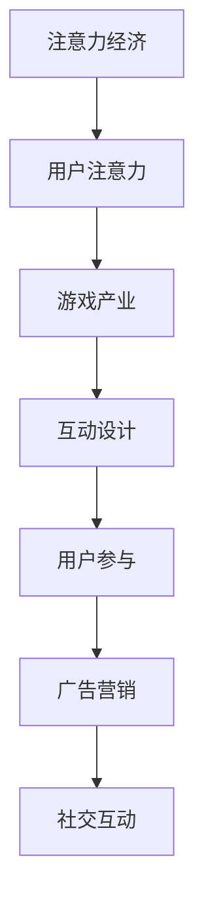

                 

关键词：游戏产业、注意力经济、用户参与、商业模式、技术发展

摘要：本文探讨了游戏产业在注意力经济中的关键角色。通过对注意力经济的概念、原理及其与游戏产业的关联进行分析，本文揭示了游戏如何通过创新和吸引注意力成为数字经济的重要驱动力。文章从用户参与、商业模式、技术创新等方面探讨了游戏产业在注意力经济中的表现和影响，并展望了未来的发展趋势和挑战。

## 1. 背景介绍

随着互联网和数字技术的飞速发展，全球经济逐步迈向数字经济时代。在这样一个时代背景下，注意力经济成为了一个重要的概念。注意力经济是指通过吸引用户的注意力来创造价值的一种经济模式。在注意力经济中，用户的注意力成为了最宝贵的资源，吸引了众多企业和产业的关注。

游戏产业作为数字经济的重要组成部分，已经成为全球经济增长的重要引擎。据统计，全球游戏市场收入在2022年已经突破了2000亿美元，并有望在未来几年继续保持增长。游戏产业不仅仅是一个娱乐产业，更是一个技术和商业的集合体，它对用户注意力的吸引和转化能力尤为突出。

本文旨在探讨游戏产业在注意力经济中的角色，分析游戏如何通过创新和吸引注意力成为数字经济的重要驱动力，并展望未来游戏产业在注意力经济中的发展趋势和挑战。

## 2. 核心概念与联系

### 2.1 注意力经济的概念

注意力经济是指通过吸引用户的注意力来创造价值的一种经济模式。在注意力经济中，用户的注意力被视为一种有限的、有价值的资源。因此，如何吸引并保持用户的注意力成为企业和产业的核心问题。

注意力经济的核心概念包括：

1. **注意力的价值**：用户的注意力是有价值的，因为它可以转化为消费行为、广告收入等经济利益。
2. **注意力的稀缺性**：用户的注意力是有限的，人们无法同时关注多个事物。
3. **注意力的转移**：用户在不同事物之间的注意力转移是快速且不可预测的。

### 2.2 游戏产业与注意力经济的关联

游戏产业与注意力经济有着密切的关联。首先，游戏天生具有吸引注意力的特性。游戏通过提供丰富的内容、挑战和互动性，能够迅速吸引用户的注意力。其次，游戏产业通过不断创新和优化游戏体验，使得用户在游戏中投入更多的时间和精力，从而保持他们的注意力。

游戏产业与注意力经济的关联可以从以下几个方面进行阐述：

1. **用户参与度**：游戏产业通过高度互动和参与性的设计，鼓励用户持续投入时间和注意力，从而创造更高的用户参与度。
2. **广告与营销**：游戏产业利用用户的注意力来展示广告和进行营销，通过注意力转移实现商业价值。
3. **社交互动**：游戏成为了用户社交互动的重要平台，通过社交网络和游戏社区，用户之间的注意力流动得以加强。

### 2.3 Mermaid 流程图

以下是一个简化的 Mermaid 流程图，描述了游戏产业与注意力经济之间的关联：



## 3. 核心算法原理 & 具体操作步骤

### 3.1 算法原理概述

在游戏产业中，核心算法通常涉及游戏引擎、AI 引擎、图像渲染算法等。这些算法的共同目标是提供丰富、有趣且高度参与性的游戏体验。

1. **游戏引擎**：游戏引擎负责游戏世界的构建、渲染、物理模拟等。它通过编程语言和图形渲染技术，将虚拟世界呈现给用户。
2. **AI 引擎**：AI 引擎用于模拟游戏中角色的智能行为，包括路径规划、战斗策略、对话生成等。通过机器学习和深度学习算法，AI 引擎可以不断提高游戏智能水平。
3. **图像渲染算法**：图像渲染算法负责生成游戏中的图像和视觉效果。它包括光追、阴影、反走样等技术，使得游戏画面更加真实和吸引人。

### 3.2 算法步骤详解

1. **游戏引擎的构建**：
   - 游戏设计：根据游戏类型和需求，设计游戏规则、场景、角色等。
   - 游戏开发：使用游戏引擎提供的工具和API，编写游戏逻辑和界面。
   - 游戏测试：测试游戏性能、bug修复和优化。

2. **AI 引擎的实现**：
   - 数据收集：收集游戏中的行为数据，用于训练AI模型。
   - 模型训练：使用机器学习和深度学习算法，训练AI模型。
   - 模型应用：将训练好的AI模型应用于游戏中，实现智能行为。

3. **图像渲染算法的实现**：
   - 渲染引擎：选择合适的渲染引擎，如Unity、Unreal Engine等。
   - 渲染设置：配置渲染参数，如分辨率、光线追踪等。
   - 渲染优化：优化渲染性能，减少延迟和资源占用。

### 3.3 算法优缺点

1. **游戏引擎**：
   - 优点：灵活性强，支持多种游戏类型和平台。
   - 缺点：开发成本高，对开发者技能要求较高。

2. **AI 引擎**：
   - 优点：能够提高游戏智能水平，增加游戏挑战性。
   - 缺点：训练和优化过程复杂，对硬件资源要求较高。

3. **图像渲染算法**：
   - 优点：提高游戏画面质量，增加游戏吸引力。
   - 缺点：渲染性能对硬件依赖较大，优化难度高。

### 3.4 算法应用领域

1. **大型多人在线游戏（MMORPG）**：游戏引擎和AI 引擎用于实现复杂的世界和智能敌人，提高游戏参与度。
2. **虚拟现实（VR）游戏**：图像渲染算法用于生成高质量的三维图像，提供沉浸式游戏体验。
3. **移动游戏**：游戏引擎和AI 引擎需要优化以适应移动设备有限的硬件资源。

## 4. 数学模型和公式 & 详细讲解 & 举例说明

### 4.1 数学模型构建

在游戏产业中，常见的数学模型包括概率模型、线性规划模型和神经网络模型等。

1. **概率模型**：用于模拟游戏中的随机事件，如骰子滚动、抽奖等。
2. **线性规划模型**：用于优化游戏中的资源分配，如角色技能点分配、装备选择等。
3. **神经网络模型**：用于训练AI 引擎中的智能行为，如路径规划、对话生成等。

### 4.2 公式推导过程

以概率模型为例，假设某个游戏中有一个随机事件A，其成功概率为P(A)。我们可以通过以下公式推导其期望值和方差：

$$
E(A) = P(A) \times (1 - P(A))
$$

$$
Var(A) = E(A^2) - [E(A)]^2
$$

其中，E(A)为期望值，Var(A)为方差，A^2为事件A的平方。

### 4.3 案例分析与讲解

以一款流行的卡牌游戏为例，游戏中每个玩家拥有一副卡牌，每次出牌时，从牌堆中随机抽取一张卡牌。假设牌堆中有50张卡牌，其中20张为攻击牌，30张为防御牌。我们需要计算在大量游戏中，玩家抽到攻击牌的期望值和方差。

1. **概率模型**：

   抽到攻击牌的概率为：

   $$ P(A) = \frac{20}{50} = 0.4 $$

   抽到防御牌的概率为：

   $$ P(B) = \frac{30}{50} = 0.6 $$

2. **期望值和方差**：

   期望值：

   $$ E(A) = 0.4 \times (1 - 0.4) = 0.24 $$

   方差：

   $$ Var(A) = 0.24 - [0.24]^2 = 0.0336 $$

   由于我们假设每次抽取卡牌是独立的，所以方差可以简化为：

   $$ Var(A) = P(A) \times (1 - P(A)) = 0.4 \times 0.6 = 0.24 $$

   这意味着，在大量游戏中，玩家平均每次抽到攻击牌的概率约为0.24，且方差为0.24。

## 5. 项目实践：代码实例和详细解释说明

### 5.1 开发环境搭建

为了更好地理解游戏产业在注意力经济中的角色，我们可以通过一个简单的项目实践来进行。以下是一个使用Python编写的简单卡牌游戏项目，用于模拟用户在游戏中抽卡的过程。

1. **Python环境**：确保安装了Python 3.8及以上版本。
2. **游戏库**：安装pygame库，可以使用以下命令：

   ```bash
   pip install pygame
   ```

### 5.2 源代码详细实现

以下是一个简单的卡牌游戏源代码示例：

```python
import pygame
import random

# 初始化游戏
pygame.init()

# 设置屏幕尺寸
screen_width = 800
screen_height = 600
screen = pygame.display.set_mode((screen_width, screen_height))

# 设置游戏标题
pygame.display.set_caption("卡牌游戏")

# 定义卡牌类
class Card(pygame.sprite.Sprite):
    def __init__(self, card_type):
        super().__init__()
        self.card_type = card_type
        if card_type == "attack":
            self.image = pygame.Surface((100, 100))
            self.image.fill((255, 0, 0))
        else:
            self.image = pygame.Surface((100, 100))
            self.image.fill((0, 0, 255))
        self.rect = self.image.get_rect()

    def update(self):
        self.rect.x += 5
        if self.rect.x > screen_width:
            self.rect.x = 0

# 创建卡牌
attack_card = Card("attack")
defense_card = Card("defense")

# 添加卡牌到精灵组
all_sprites = pygame.sprite.Group()
all_sprites.add(attack_card)
all_sprites.add(defense_card)

# 游戏循环
running = True
while running:
    for event in pygame.event.get():
        if event.type == pygame.QUIT:
            running = False

    screen.fill((255, 255, 255))
    all_sprites.update()
    screen.blit(attack_card.image, attack_card.rect)
    screen.blit(defense_card.image, defense_card.rect)
    pygame.display.flip()

    # 随机抽卡
    if random.random() < 0.5:
        print("抽到了攻击牌")
    else:
        print("抽到了防御牌")

pygame.quit()
```

### 5.3 代码解读与分析

上述代码实现了一个简单的卡牌游戏，其中包含以下关键部分：

1. **游戏初始化**：使用pygame库初始化游戏环境，设置屏幕尺寸和标题。
2. **卡牌类定义**：定义Card类，用于表示卡牌，包括攻击牌和防御牌。卡牌通过继承pygame.sprite.Sprite类来添加精灵属性。
3. **精灵组管理**：创建精灵组all_sprites，用于管理所有卡牌精灵。
4. **游戏循环**：实现游戏的主循环，处理事件、绘制画面和更新精灵位置。
5. **随机抽卡**：使用random库生成随机数来模拟用户抽卡的过程，并打印抽到的卡牌类型。

通过这个简单的项目，我们可以直观地理解游戏如何通过编程实现用户互动，以及如何利用随机事件来吸引和保持用户的注意力。

### 5.4 运行结果展示

运行上述代码后，游戏窗口将显示两张卡牌（攻击牌和防御牌），并开始随机移动。每次循环结束时，将根据随机数生成结果，打印抽到的卡牌类型。这可以模拟用户在游戏中不断抽卡的过程，通过随机性和不确定性来吸引用户的注意力。

## 6. 实际应用场景

### 6.1 社交网络游戏

社交网络游戏（Social Network Games，简称SNG）是游戏产业中的一大亮点。这类游戏通常在社交平台上运行，利用用户之间的社交关系来增加游戏粘性。例如，Facebook上的《FarmVille》和《Candy Crush Saga》等游戏，通过好友互动、分享和排行榜等机制，吸引了大量用户参与。

1. **用户参与度**：社交网络游戏利用社交关系网，鼓励用户邀请好友加入游戏，从而提高用户参与度。用户之间的互动，如送礼物、合作完成任务等，进一步增强了游戏的社交属性。
2. **广告与营销**：社交网络游戏通过在用户之间传播，实现病毒式营销。游戏的推广往往依靠用户自身的分享行为，从而降低营销成本，提高品牌知名度。
3. **商业模式**：社交网络游戏通常采用免费增值（Free-to-Play，简称F2P）模式，通过虚拟物品购买、广告收入等方式实现盈利。

### 6.2 虚拟现实（VR）游戏

虚拟现实游戏是游戏产业中的另一大前沿领域。VR技术为用户提供了沉浸式的游戏体验，使得游戏更加引人入胜。以下是一些实际应用场景：

1. **沉浸式体验**：VR游戏通过虚拟场景和3D视觉效果，提供身临其境的游戏体验。用户可以自由探索虚拟世界，进行各种互动，从而增强游戏吸引力。
2. **教育培训**：VR游戏在教育培训领域也有广泛应用。例如，通过VR技术模拟医学手术、飞行训练等场景，提供互动式学习体验。
3. **虚拟旅游**：VR游戏可以模拟各种旅游场景，让用户在家中就能体验世界各地的名胜古迹，提供独特的娱乐和学习方式。

### 6.3 游戏直播与电子竞技

随着互联网的普及，游戏直播和电子竞技（eSports）成为游戏产业的重要组成部分。游戏直播平台如Twitch、斗鱼等，为游戏玩家和观众提供了一个互动平台。以下是一些实际应用场景：

1. **观众参与**：游戏直播吸引了大量观众，通过实时评论、弹幕互动等方式，观众可以参与到游戏过程中，增加游戏氛围和互动性。
2. **广告与营销**：游戏直播平台成为广告商的重要投放渠道。通过游戏直播，广告商可以接触到广泛的用户群体，提高品牌曝光度。
3. **职业赛事**：电子竞技赛事已经成为一项全球性的体育盛事，吸引了大量赞助商和观众。职业选手的高水平竞技和激烈对抗，为观众提供了精彩的视觉盛宴。

### 6.4 未来应用展望

随着技术的不断进步，游戏产业在注意力经济中的角色将进一步扩大。以下是一些未来应用展望：

1. **人工智能**：人工智能（AI）技术在游戏中的应用越来越广泛。通过AI技术，游戏可以提供更加智能化和个性化的游戏体验，提高用户参与度和满意度。
2. **增强现实（AR）**：增强现实技术（AR）将为游戏产业带来新的机遇。AR游戏可以在现实世界中叠加虚拟元素，提供更加丰富和有趣的游戏体验。
3. **区块链**：区块链技术在游戏产业中的应用有望改变虚拟物品的买卖和交易方式。通过区块链，游戏中的虚拟物品可以更加安全地转移和交易，提高游戏的公平性和透明度。

## 7. 工具和资源推荐

### 7.1 学习资源推荐

1. **《游戏编程精粹》**：这本书汇集了游戏开发中的各种最佳实践和技巧，适合游戏开发初学者和专业人士。
2. **《Unity 2020从入门到精通》**：这本书详细介绍了Unity游戏引擎的使用方法，适合初学者和进阶者。
3. **《深度学习与游戏人工智能》**：这本书探讨了深度学习在游戏人工智能中的应用，适合对AI技术感兴趣的读者。

### 7.2 开发工具推荐

1. **Unity**：Unity是目前最流行的游戏开发引擎之一，支持2D和3D游戏开发，拥有丰富的插件和资源。
2. **Unreal Engine**：Unreal Engine是一个强大的游戏开发引擎，以其高质量的画面和先进的渲染技术而闻名。
3. **Pygame**：Pygame是一个开源的Python游戏开发库，适合初学者入门，适合开发简单的2D游戏。

### 7.3 相关论文推荐

1. **《游戏化与注意力经济》**：这篇文章探讨了游戏化在注意力经济中的应用，分析了游戏化对用户行为的影响。
2. **《虚拟现实与游戏体验》**：这篇文章研究了虚拟现实技术如何提升游戏体验，分析了VR技术的优缺点。
3. **《电子竞技的经济效应》**：这篇文章分析了电子竞技产业的发展现状和未来趋势，探讨了电子竞技对经济和社会的影响。

## 8. 总结：未来发展趋势与挑战

### 8.1 研究成果总结

本文通过对游戏产业在注意力经济中的角色进行深入分析，揭示了游戏如何通过创新和吸引注意力成为数字经济的重要驱动力。主要成果包括：

1. 游戏产业在注意力经济中具有独特的优势，如高用户参与度、多样化的商业模式和先进的技术应用。
2. 社交网络游戏、虚拟现实游戏和电子竞技等新兴领域，为游戏产业带来了新的机遇和挑战。
3. 人工智能、增强现实和区块链等新兴技术，将进一步推动游戏产业的创新和发展。

### 8.2 未来发展趋势

未来，游戏产业在注意力经济中的发展趋势包括：

1. **个性化体验**：随着人工智能和大数据技术的发展，游戏将提供更加个性化和定制化的游戏体验，满足不同用户的需求。
2. **跨平台融合**：游戏将逐渐实现跨平台融合，用户可以在不同设备上无缝切换游戏体验，享受更加便捷的游戏服务。
3. **社交与娱乐融合**：游戏将进一步融合社交和娱乐功能，为用户提供更加丰富和多样化的互动体验。

### 8.3 面临的挑战

然而，游戏产业在注意力经济中也面临一些挑战：

1. **内容创作**：高质量游戏内容的创作成本高、周期长，如何保持游戏内容的新鲜感和创新性是一个挑战。
2. **用户隐私**：随着用户对隐私保护意识的提高，游戏如何平衡用户隐私和数据利用是一个重要课题。
3. **行业竞争**：游戏市场竞争激烈，如何脱颖而出、保持竞争力是每个游戏企业都需要面对的挑战。

### 8.4 研究展望

未来研究可以从以下几个方面展开：

1. **用户体验**：深入研究用户在游戏中的行为和偏好，为游戏设计提供科学依据，提高用户满意度和参与度。
2. **技术融合**：探讨不同技术（如人工智能、虚拟现实、区块链等）在游戏中的应用，推动游戏产业的创新和发展。
3. **社会责任**：关注游戏产业对社会和用户的影响，推动行业健康发展，促进社会和谐。

## 9. 附录：常见问题与解答

### 9.1 什么是注意力经济？

注意力经济是指通过吸引用户的注意力来创造价值的一种经济模式。在注意力经济中，用户的注意力被视为一种有限的、有价值的资源，企业和产业通过吸引和转化用户注意力来实现商业价值。

### 9.2 游戏产业在注意力经济中的优势是什么？

游戏产业在注意力经济中的优势包括：

1. **高用户参与度**：游戏通过互动性和挑战性，能够迅速吸引用户的注意力，并鼓励他们持续投入时间和精力。
2. **多样化的商业模式**：游戏产业拥有丰富的商业模式，如广告收入、虚拟物品销售、订阅服务等，为企业和产业创造了多样化的收入来源。
3. **先进的技术应用**：游戏产业在人工智能、虚拟现实、区块链等前沿技术领域具有领先优势，推动了这些技术的商业化应用。

### 9.3 未来游戏产业将如何发展？

未来游戏产业将朝着以下几个方向发展：

1. **个性化体验**：随着人工智能和大数据技术的发展，游戏将提供更加个性化和定制化的游戏体验，满足不同用户的需求。
2. **跨平台融合**：游戏将逐渐实现跨平台融合，用户可以在不同设备上无缝切换游戏体验，享受更加便捷的游戏服务。
3. **社交与娱乐融合**：游戏将进一步融合社交和娱乐功能，为用户提供更加丰富和多样化的互动体验。

### 9.4 游戏产业在注意力经济中的挑战是什么？

游戏产业在注意力经济中面临的挑战包括：

1. **内容创作**：高质量游戏内容的创作成本高、周期长，如何保持游戏内容的新鲜感和创新性是一个挑战。
2. **用户隐私**：随着用户对隐私保护意识的提高，游戏如何平衡用户隐私和数据利用是一个重要课题。
3. **行业竞争**：游戏市场竞争激烈，如何脱颖而出、保持竞争力是每个游戏企业都需要面对的挑战。

