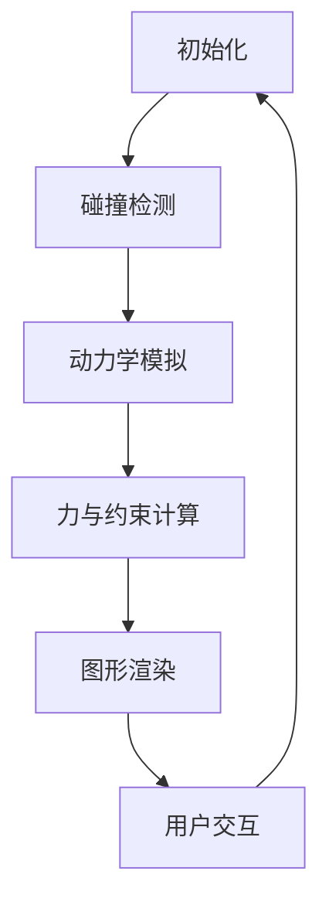

                 

 **关键词：**
- 游戏物理引擎
- 真实世界模拟
- 计算模拟
- 数学模型
- 图形渲染
- 算法优化

<|assistant|> **摘要：**
本文深入探讨了游戏物理引擎在真实世界模拟中的应用。通过分析核心概念、算法原理、数学模型以及实践实例，阐述了如何构建高效、逼真的物理引擎。文章还展望了未来发展趋势与面临的挑战，为开发者提供了有价值的指导。

## 1. 背景介绍

游戏物理引擎是游戏开发中不可或缺的一环，它负责模拟和计算游戏中物理现象，如碰撞检测、动力学模拟、重力、摩擦等。一个优秀的游戏物理引擎不仅能提高游戏的真实感，还能优化游戏的性能和用户体验。然而，实现一个真实的物理世界模拟并非易事，它涉及复杂的数学模型、高效的算法以及庞大的计算资源。

近年来，随着计算能力的提升和图形渲染技术的进步，游戏物理引擎在模拟真实世界方面取得了显著的进展。例如，大规模开放世界游戏如《上古卷轴5：天际》和《巫师3：狂猎》采用了先进的物理引擎，使得游戏中的世界更加生动和真实。

本文旨在介绍游戏物理引擎的核心概念、算法原理、数学模型以及实际应用，帮助开发者理解和构建高效逼真的物理引擎。

## 2. 核心概念与联系

### 2.1 物理引擎基础概念

游戏物理引擎主要涉及以下几个核心概念：

- **碰撞检测**：检测物体之间是否发生碰撞，以及碰撞点的位置。
- **动力学模拟**：模拟物体的运动状态，包括速度、加速度等。
- **力与约束**：计算物体受到的力，以及这些力如何影响物体的运动。
- **图形渲染**：将物理引擎计算的结果通过图形渲染器呈现给玩家。

### 2.2 物理引擎架构

物理引擎的架构可以分为以下几个主要模块：

1. **碰撞检测模块**：负责检测物体之间的碰撞，并计算出碰撞点的位置。
2. **动力学模拟模块**：根据物理定律计算物体的运动状态，并更新物体的位置和速度。
3. **力与约束模块**：计算物体受到的各种力，包括重力、摩擦力等，并根据约束条件调整物体的运动。
4. **图形渲染模块**：将物理引擎计算的结果通过图形渲染器渲染出来。

### 2.3 Mermaid 流程图

以下是物理引擎的核心流程图：



在上述流程图中，物理引擎首先进行初始化，然后进入循环，依次进行碰撞检测、动力学模拟、力与约束计算以及图形渲染，最后处理用户交互并重新开始循环。

## 3. 核心算法原理 & 具体操作步骤

### 3.1 算法原理概述

游戏物理引擎的核心算法主要包括以下几种：

1. **碰撞检测算法**：常用的碰撞检测算法有OBB（AABB）树、Sphere树等。
2. **积分算法**：常用的积分算法有欧拉积分和龙格-库塔积分。
3. **约束求解算法**：常用的约束求解算法有拉格朗日乘子和序列二次规划。

### 3.2 算法步骤详解

1. **碰撞检测算法步骤**：

   - 构建OBB（AABB）树或Sphere树。
   - 遍历树结构，检查物体之间的碰撞。
   - 计算碰撞点的位置和法线。

2. **积分算法步骤**：

   - 初始化速度和加速度。
   - 应用积分算法（如欧拉积分或龙格-库塔积分）计算物体的位置和速度。
   - 更新物体的状态。

3. **约束求解算法步骤**：

   - 构建约束方程。
   - 使用拉格朗日乘子或序列二次规划求解约束方程。
   - 更新物体的状态以满足约束条件。

### 3.3 算法优缺点

1. **碰撞检测算法**：

   - **优点**：效率高，能够快速检测物体之间的碰撞。
   - **缺点**：对于复杂的碰撞场景，可能需要大量的计算资源。

2. **积分算法**：

   - **优点**：简单易懂，适用于大多数场景。
   - **缺点**：对于复杂的动力学场景，可能需要较高的计算精度。

3. **约束求解算法**：

   - **优点**：能够有效地解决约束问题，提高物理模拟的准确性。
   - **缺点**：计算复杂度较高，可能影响性能。

### 3.4 算法应用领域

物理引擎的应用领域非常广泛，包括但不限于以下方面：

- **游戏开发**：模拟游戏中的物理现象，提高游戏的真实感。
- **动画制作**：模拟动画中的物理运动，实现更加自然和逼真的动画效果。
- **机器人仿真**：模拟机器人的运动和交互，用于机器人研究和设计。
- **建筑仿真**：模拟建筑物的结构强度和稳定性，用于建筑设计。

## 4. 数学模型和公式 & 详细讲解 & 举例说明

### 4.1 数学模型构建

物理引擎的核心数学模型主要包括以下几个方面：

1. **碰撞检测模型**：基于几何形状的碰撞检测模型，如OBB（AABB）树模型。
2. **积分模型**：基于牛顿第二定律的积分模型，如欧拉积分和龙格-库塔积分。
3. **约束模型**：基于拉格朗日乘子法的约束模型。

### 4.2 公式推导过程

1. **碰撞检测模型**：

   - 假设物体A和物体B发生碰撞，碰撞点为P，法线为N。
   - 根据碰撞检测的基本原理，有：$$\vec{N} \cdot (\vec{P}_A - \vec{P}_B) = 0$$

2. **积分模型**：

   - 假设物体质量为m，加速度为a，速度为v。
   - 根据牛顿第二定律，有：$$\vec{F} = m\vec{a}$$
   - 对加速度积分，得到速度：$$\vec{v} = \vec{v}_0 + \vec{a}t$$
   - 对速度积分，得到位置：$$\vec{p} = \vec{p}_0 + \vec{v}t + \frac{1}{2}\vec{a}t^2$$

3. **约束模型**：

   - 假设物体A和物体B之间存在约束，约束方程为f(x, y, z) = 0。
   - 使用拉格朗日乘子法，构造拉格朗日方程：$$L = \frac{1}{2}m\vec{v}^2 + f(x, y, z)$$
   - 对拉格朗日方程求导，得到约束方程：$$\frac{df}{dx} = -\frac{dL}{dx}$$

### 4.3 案例分析与讲解

以一个简单的二维碰撞检测为例，说明数学模型的应用。

假设有两个矩形物体A和B，它们的尺寸分别为w和h，位置分别为(x1, y1)和(x2, y2)。

1. **碰撞检测模型**：

   - 使用AABB树进行碰撞检测。
   - 初始化AABB树，将两个矩形物体的边界框放入树中。
   - 遍历AABB树，检查矩形物体A和B的边界框是否有重叠。

2. **积分模型**：

   - 初始化物体的速度和加速度。
   - 使用欧拉积分计算物体的位置和速度。
   - 更新物体的状态。

3. **约束模型**：

   - 假设物体A和B之间存在约束，约束方程为x1 + w = x2。
   - 使用拉格朗日乘子法，构造拉格朗日方程。
   - 求解拉格朗日方程，得到约束条件下的物体状态。

通过上述数学模型的应用，可以有效地检测物体之间的碰撞、计算物体的运动状态以及满足约束条件，从而实现真实的物理世界模拟。

## 5. 项目实践：代码实例和详细解释说明

### 5.1 开发环境搭建

为了实现一个简单的二维物理引擎，我们可以选择Python作为编程语言，结合Pygame库进行图形渲染。以下是开发环境的搭建步骤：

1. 安装Python：从官网下载并安装Python 3.8及以上版本。
2. 安装Pygame：在命令行中运行`pip install pygame`。
3. 安装numpy：在命令行中运行`pip install numpy`。

### 5.2 源代码详细实现

以下是简单的二维物理引擎的源代码实现：

```python
import pygame
import numpy as np

# 初始化Pygame
pygame.init()

# 设置窗口大小
width, height = 800, 600
screen = pygame.display.set_mode((width, height))

# 设置物体初始状态
mass = 1.0
velocity = np.array([1.0, 0.0])
position = np.array([100.0, 100.0])
acceleration = np.array([0.0, -9.8])

# 主循环
running = True
while running:
    for event in pygame.event.get():
        if event.type == pygame.QUIT:
            running = False

    # 更新物体状态
    velocity += acceleration * 0.016
    position += velocity * 0.016
    acceleration = np.array([0.0, -9.8])

    # 绘制物体
    pygame.draw.rect(screen, (0, 0, 255), (position[0], position[1], 10, 10))

    # 更新屏幕
    pygame.display.flip()

# 退出Pygame
pygame.quit()
```

### 5.3 代码解读与分析

1. **初始化Pygame和窗口**：

   - 使用`pygame.init()`初始化Pygame。
   - 使用`pygame.display.set_mode()`设置窗口大小。

2. **设置物体初始状态**：

   - 初始化质量、速度、位置和加速度。

3. **主循环**：

   - 使用`for`循环遍历事件，当接收到退出事件时，退出主循环。
   - 使用`velocity += acceleration * 0.016`和`position += velocity * 0.016`更新物体的状态。
   - 使用`pygame.draw.rect()`绘制物体。

4. **更新屏幕**：

   - 使用`pygame.display.flip()`更新屏幕。

### 5.4 运行结果展示

运行上述代码后，会弹出一个窗口，显示一个蓝色的方块，方块会不断下落，直到窗口底部。这实现了基本的二维自由落体运动模拟。

## 6. 实际应用场景

游戏物理引擎在现实世界中有着广泛的应用。以下是一些典型的应用场景：

1. **游戏开发**：游戏物理引擎是游戏开发的核心技术之一，用于模拟游戏中的各种物理现象，如碰撞、重力、摩擦等。
2. **动画制作**：动画制作公司使用物理引擎模拟动画中的物理运动，如角色的跳跃、坠落、碰撞等，实现更加自然和逼真的动画效果。
3. **机器人仿真**：机器人研究领域使用物理引擎模拟机器人的运动和交互，用于机器人设计和测试。
4. **建筑仿真**：建筑领域使用物理引擎模拟建筑物的结构强度和稳定性，用于建筑设计和分析。

## 7. 工具和资源推荐

### 7.1 学习资源推荐

1. **《物理引擎开发实战》**：一本关于游戏物理引擎开发的实用指南，涵盖了碰撞检测、积分算法、约束求解等方面的内容。
2. **《计算机图形学：原理及实践》**：一本经典教材，详细介绍了图形渲染的基本原理和实现方法，对于理解物理引擎的图形渲染模块非常有帮助。

### 7.2 开发工具推荐

1. **Unity**：一款流行的游戏开发引擎，内置了强大的物理引擎，支持各种碰撞检测、动力学模拟等功能。
2. **Unreal Engine**：一款功能强大的游戏开发引擎，具有高度灵活的物理引擎，适用于开发高真实感游戏。

### 7.3 相关论文推荐

1. **“Real-Time Ray Casting Algorithms”**：一篇关于实时光线追踪算法的论文，介绍了如何使用物理引擎实现高效的图形渲染。
2. **“Constraint Solving for Animation”**：一篇关于约束求解在动画中的应用的论文，详细介绍了拉格朗日乘子法和序列二次规划等约束求解算法。

## 8. 总结：未来发展趋势与挑战

### 8.1 研究成果总结

游戏物理引擎在过去几十年中取得了显著的进展，从简单的碰撞检测和动力学模拟，发展到如今能够模拟复杂物理现象的高级引擎。这一成果得益于计算能力的提升、图形渲染技术的进步以及算法研究的深入。

### 8.2 未来发展趋势

未来，游戏物理引擎的发展将朝着更加高效、逼真和可扩展的方向发展。以下是一些潜在的趋势：

1. **硬件加速**：随着硬件技术的发展，物理引擎将更多地依赖GPU进行计算，提高性能和效率。
2. **人工智能**：将人工智能技术应用于物理引擎，实现更加智能的物理模拟和优化。
3. **分布式计算**：利用云计算和分布式计算技术，实现大规模物理引擎的并行计算，提高模拟的规模和精度。

### 8.3 面临的挑战

然而，游戏物理引擎在未来的发展中也将面临一系列挑战：

1. **计算资源限制**：物理引擎的计算需求日益增长，如何在高性能硬件和有限的计算资源之间找到平衡是一个关键问题。
2. **真实感提升**：物理引擎需要模拟更加复杂的物理现象，如流体力学、热传导等，这要求算法和数学模型有更高的精度和效率。
3. **可扩展性**：物理引擎需要支持各种不同规模和应用场景，如何设计一个可扩展的架构是一个重要的课题。

### 8.4 研究展望

未来，研究者将继续探索高效的物理引擎算法、数学模型和架构设计，以应对上述挑战。此外，跨学科的合作也将成为推动物理引擎发展的重要力量，如与人工智能、机器人学、建筑学等领域的结合，为物理引擎的应用带来更多可能性。

## 9. 附录：常见问题与解答

### 9.1 如何优化物理引擎的性能？

1. 使用硬件加速，如GPU计算。
2. 优化算法，减少不必要的计算。
3. 使用并行计算，提高并行度。
4. 减少图形渲染的开销，如简化模型和减少光照计算。

### 9.2 如何实现真实的碰撞检测？

1. 使用几何形状（如AABB、OBB、Sphere）进行初步碰撞检测。
2. 使用物理公式（如动量守恒、能量守恒）进行精确碰撞计算。
3. 考虑碰撞响应，如弹性碰撞和非弹性碰撞。

### 9.3 物理引擎如何与图形渲染集成？

1. 使用图形渲染API（如OpenGL、DirectX）进行图形渲染。
2. 将物理引擎计算的结果（如位置、速度）传递给图形渲染模块。
3. 调整渲染参数，如光照、阴影等，以实现逼真的视觉效果。

---

### 作者署名

作者：禅与计算机程序设计艺术 / Zen and the Art of Computer Programming
----------------------------------------------------------------

以上，就是本文的完整内容。希望对您在游戏物理引擎开发领域有所启发和帮助。如果您有任何问题或建议，欢迎在评论区留言。感谢您的阅读！

