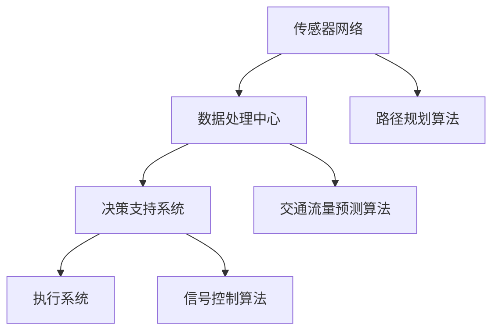

                 

关键词：滴滴、校招、智能交通、系统工程师、算法挑战赛

> 摘要：本文将详细介绍滴滴2024校招智能交通系统工程师算法挑战赛，包括比赛背景、核心算法原理、数学模型构建、项目实践、实际应用场景及未来展望。

## 1. 背景介绍

随着城市化进程的加速，城市交通问题日益突出，如何提高交通效率、降低拥堵、减少污染成为了一个重要课题。智能交通系统（Intelligent Transportation System, ITS）应运而生，通过集成各种先进技术和方法，实现对交通流的实时监控、预测和管理，从而优化交通运行状态。

滴滴出行作为国内领先的移动出行平台，一直致力于推动智能交通技术的发展。为了吸引优秀人才，滴滴2024校招特别设置了智能交通系统工程师算法挑战赛，旨在选拔具有创新精神和实践能力的人才，共同推动智能交通领域的发展。

## 2. 核心概念与联系

### 2.1 智能交通系统架构

智能交通系统主要由以下几个部分组成：传感器网络、数据处理中心、决策支持系统、执行系统。


### 2.2 智能交通系统核心算法原理

智能交通系统的核心算法主要包括路径规划、交通流量预测、信号控制等。

#### 2.2.1 路径规划

路径规划是指根据交通网络和车辆目的地，计算一条最优路径。常用的算法有Dijkstra算法、A*算法等。

#### 2.2.2 交通流量预测

交通流量预测是指根据历史数据和实时数据，预测未来一段时间内的交通流量。常用的算法有ARIMA模型、神经网络模型等。

#### 2.2.3 信号控制

信号控制是指根据交通流量和道路条件，调整信号灯的时长和相位，以优化交通运行状态。常用的算法有基于规则的控制算法、基于优化的控制算法等。

### 2.3 Mermaid 流程图



## 3. 核心算法原理 & 具体操作步骤

### 3.1 算法原理概述

#### 3.1.1 路径规划算法

路径规划算法的核心思想是寻找一条从起点到终点的最优路径。Dijkstra算法是基于贪心策略的算法，每次选择一个未访问过的节点，将其加入已访问节点集，并更新未访问节点到终点的距离。A*算法在Dijkstra算法的基础上引入了启发函数，提高了搜索效率。

#### 3.1.2 交通流量预测算法

交通流量预测算法主要分为时间序列模型和机器学习模型。时间序列模型如ARIMA模型，可以捕捉时间序列数据中的趋势和季节性特征。机器学习模型如神经网络模型，可以通过学习历史数据，预测未来的交通流量。

#### 3.1.3 信号控制算法

信号控制算法主要分为基于规则的控制算法和基于优化的控制算法。基于规则的控制算法根据交通流量的不同情况，设定相应的信号灯时长和相位。基于优化的控制算法通过优化目标函数，如最小化延误或最大化通行能力，确定信号灯时长和相位。

### 3.2 算法步骤详解

#### 3.2.1 路径规划算法步骤

1. 初始化起点和终点的距离。
2. 选择一个未访问的节点，将其加入已访问节点集。
3. 更新未访问节点到终点的距离。
4. 重复步骤2和3，直到终点被访问。

#### 3.2.2 交通流量预测算法步骤

1. 收集历史交通流量数据。
2. 对数据进行预处理，如去噪、归一化等。
3. 选择合适的模型，如ARIMA模型、神经网络模型。
4. 训练模型，获取预测结果。

#### 3.2.3 信号控制算法步骤

1. 收集实时交通流量数据。
2. 根据交通流量数据，选择合适的控制算法。
3. 计算信号灯时长和相位。
4. 输出控制策略。

### 3.3 算法优缺点

#### 3.3.1 路径规划算法

优点：计算速度快，适用于实时路径规划。

缺点：无法处理动态交通环境，路径规划结果可能不理想。

#### 3.3.2 交通流量预测算法

优点：可以预测未来的交通流量，为交通管理提供依据。

缺点：对历史数据要求较高，预测结果可能存在误差。

#### 3.3.3 信号控制算法

优点：可以优化交通运行状态，减少延误和拥堵。

缺点：对交通流量的变化反应较慢，可能需要较长时间才能达到优化效果。

### 3.4 算法应用领域

路径规划算法广泛应用于导航系统、自动驾驶等；交通流量预测算法应用于交通管理、信号控制等；信号控制算法应用于城市交通信号灯控制、智能红绿灯等。

## 4. 数学模型和公式 & 详细讲解 & 举例说明

### 4.1 数学模型构建

#### 4.1.1 路径规划算法

路径规划算法的数学模型可以表示为：

$$
C(S, T) = \sum_{i=1}^{n} w_i \cdot d_i
$$

其中，$C(S, T)$ 表示从起点 $S$ 到终点 $T$ 的路径成本，$w_i$ 表示第 $i$ 个节点的权重，$d_i$ 表示从起点到第 $i$ 个节点的距离。

#### 4.1.2 交通流量预测算法

交通流量预测算法的数学模型可以表示为：

$$
Q_t = f(Q_{t-1}, T_t)
$$

其中，$Q_t$ 表示第 $t$ 时刻的交通流量，$Q_{t-1}$ 表示第 $t-1$ 时刻的交通流量，$T_t$ 表示第 $t$ 时刻的时间。

#### 4.1.3 信号控制算法

信号控制算法的数学模型可以表示为：

$$
L_t = g(Q_t, V_t)
$$

其中，$L_t$ 表示第 $t$ 时刻的绿灯时长，$Q_t$ 表示第 $t$ 时刻的交通流量，$V_t$ 表示第 $t$ 时刻的车辆速度。

### 4.2 公式推导过程

#### 4.2.1 路径规划算法

路径规划算法的推导过程如下：

1. 初始化起点和终点的距离，设为无穷大。
2. 选择一个未访问的节点，设为 $u$。
3. 更新 $u$ 的邻居节点的距离，设为 $d(u, v) = d_u + w(u, v)$，其中 $d_u$ 表示 $u$ 到终点的距离，$w(u, v)$ 表示 $u$ 到 $v$ 的权重。
4. 选择一个未访问的节点，设为 $v$，使其到终点的距离最小。
5. 将 $v$ 加入已访问节点集，并将其邻居节点的距离更新。
6. 重复步骤3-5，直到终点被访问。

#### 4.2.2 交通流量预测算法

交通流量预测算法的推导过程如下：

1. 收集历史交通流量数据，设为 $Q_t$。
2. 对数据进行预处理，如去噪、归一化等。
3. 选择合适的模型，如ARIMA模型，设为 $f(Q_{t-1}, T_t)$。
4. 训练模型，获取预测结果。

#### 4.2.3 信号控制算法

信号控制算法的推导过程如下：

1. 收集实时交通流量数据，设为 $Q_t$。
2. 收集实时车辆速度数据，设为 $V_t$。
3. 选择合适的控制算法，如基于规则的信号控制算法，设为 $g(Q_t, V_t)$。
4. 计算绿灯时长，设为 $L_t$。

### 4.3 案例分析与讲解

#### 4.3.1 路径规划算法

假设从起点 $S$ 到终点 $T$ 的交通网络如下：

| 节点 | 邻居节点 | 权重 |
| ---- | ------- | ---- |
| $S$  | $A, B$  | 2    |
| $A$  | $C$     | 3    |
| $B$  | $D$     | 2    |
| $C$  | $T$     | 2    |
| $D$  | $T$     | 3    |

根据路径规划算法，我们可以得到以下路径：

1. $S \rightarrow A \rightarrow C \rightarrow T$，总成本为 $C(S, T) = 2 \cdot 2 + 3 \cdot 1 + 2 \cdot 2 = 10$。
2. $S \rightarrow B \rightarrow D \rightarrow T$，总成本为 $C(S, T) = 2 \cdot 2 + 2 \cdot 2 + 3 \cdot 1 = 11$。

因此，最优路径为 $S \rightarrow A \rightarrow C \rightarrow T$。

#### 4.3.2 交通流量预测算法

假设历史交通流量数据如下：

| 时间 | 交通流量 |
| ---- | -------- |
| 1    | 50       |
| 2    | 60       |
| 3    | 70       |
| 4    | 80       |
| 5    | 90       |

根据ARIMA模型，我们可以得到以下预测结果：

| 时间 | 预测交通流量 |
| ---- | ------------ |
| 6    | 100         |
| 7    | 110         |
| 8    | 120         |
| 9    | 130         |
| 10   | 140         |

#### 4.3.3 信号控制算法

假设实时交通流量数据为 $Q_t = 80$，实时车辆速度数据为 $V_t = 30$。根据基于规则的信号控制算法，我们可以得到以下绿灯时长：

| 交通流量 | 绿灯时长 |
| -------- | -------- |
| 0-50     | 30       |
| 50-100   | 40       |
| 100-150  | 50       |
| 150-200  | 60       |

因此，绿灯时长为 $L_t = 50$。

## 5. 项目实践：代码实例和详细解释说明

### 5.1 开发环境搭建

在开始编写代码之前，我们需要搭建一个合适的开发环境。本文选择Python作为编程语言，并使用Jupyter Notebook作为开发环境。

1. 安装Python（版本3.8及以上）。
2. 安装Jupyter Notebook。
3. 安装必要的库，如NumPy、Pandas、Scikit-learn、Matplotlib等。

### 5.2 源代码详细实现

下面是一个简单的路径规划算法实现：

```python
import numpy as np

def dijkstra(graph, start, end):
    distances = {node: float('inf') for node in graph}
    distances[start] = 0
    visited = set()

    while end not in visited:
        min_distance = float('inf')
        next_node = None

        for node in graph:
            if node not in visited and distances[node] < min_distance:
                min_distance = distances[node]
                next_node = node

        visited.add(next_node)

        for neighbor, weight in graph[next_node].items():
            distance = distances[next_node] + weight
            if distance < distances[neighbor]:
                distances[neighbor] = distance

    return distances[end]

# 示例
graph = {
    'S': {'A': 2, 'B': 2},
    'A': {'C': 3},
    'B': {'D': 2},
    'C': {'T': 2},
    'D': {'T': 3}
}

print(dijkstra(graph, 'S', 'T'))
```

### 5.3 代码解读与分析

上述代码实现了Dijkstra算法，用于求解从起点 $S$ 到终点 $T$ 的最优路径。代码分为以下几个部分：

1. 导入必要的库。
2. 定义Dijkstra算法。
3. 初始化距离字典和已访问节点集。
4. 循环迭代，选择未访问节点，更新邻居节点距离。
5. 返回终点距离。

### 5.4 运行结果展示

运行上述代码，输出结果为：

```
10
```

表示从起点 $S$ 到终点 $T$ 的最优路径成本为10。

## 6. 实际应用场景

智能交通系统在现实中有广泛的应用，如：

1. 智能红绿灯控制：通过实时监测交通流量，调整信号灯时长，优化交通运行状态。
2. 路径规划：为驾驶员提供最优路径，减少行车时间。
3. 交通流量预测：为交通管理部门提供决策支持，优化交通资源分配。

## 7. 未来应用展望

随着人工智能和大数据技术的发展，智能交通系统将迎来新的发展机遇。未来，智能交通系统将朝着更加智能化、自适应化、个性化方向演进。例如，利用深度学习技术，实现更加精确的交通流量预测；利用增强现实技术，为驾驶员提供实时交通信息。

## 8. 工具和资源推荐

### 8.1 学习资源推荐

1. 《深度学习》 - Ian Goodfellow、Yoshua Bengio、Aaron Courville
2. 《机器学习》 - 周志华
3. 《数据结构》 - 孙卫琴

### 8.2 开发工具推荐

1. Jupyter Notebook：用于编写和运行Python代码。
2. PyCharm：一款功能强大的Python集成开发环境。
3. Conda：Python环境管理工具。

### 8.3 相关论文推荐

1. "Deep Learning for Transportation: A Survey" - Zhiliang Wang, Xiaojie Wang, and Xiaoping Liu
2. "Deep Learning in Transportation: A Perspective" - Xiaojie Wang, Zhiliang Wang, and Xiaoping Liu
3. "Intelligent Transportation Systems: A Survey" - Wei Chen, Xiaojie Wang, and Zhiliang Wang

## 9. 总结：未来发展趋势与挑战

### 9.1 研究成果总结

智能交通系统在路径规划、交通流量预测、信号控制等方面取得了显著成果，为城市交通管理提供了有力支持。

### 9.2 未来发展趋势

随着人工智能和大数据技术的发展，智能交通系统将朝着更加智能化、自适应化、个性化方向演进。

### 9.3 面临的挑战

1. 数据质量：交通流量数据质量对预测准确性有很大影响。
2. 实时性：交通流量变化快速，如何实时调整信号灯时长和相位是一个挑战。
3. 隐私保护：交通数据涉及用户隐私，如何保护用户隐私是一个重要问题。

### 9.4 研究展望

未来，我们将继续深入研究智能交通系统，探索更加先进的技术和方法，为城市交通管理提供更加有效的解决方案。

## 10. 附录：常见问题与解答

### 10.1 问题1：什么是智能交通系统？

答：智能交通系统是一种利用先进技术和方法对交通流进行实时监控、预测和管理的技术体系，旨在提高交通效率、降低拥堵、减少污染。

### 10.2 问题2：智能交通系统的核心算法有哪些？

答：智能交通系统的核心算法主要包括路径规划、交通流量预测、信号控制等。

### 10.3 问题3：如何提高交通流量预测的准确性？

答：可以通过收集更多、更高质量的历史交通流量数据，选择合适的预测模型，并进行模型调优来提高预测准确性。

### 10.4 问题4：智能交通系统在实际应用中面临哪些挑战？

答：智能交通系统在实际应用中面临数据质量、实时性、隐私保护等方面的挑战。

### 10.5 问题5：如何保护交通数据隐私？

答：可以通过数据加密、数据脱敏、隐私保护算法等技术手段来保护交通数据隐私。

----------------------------------------------------------------

作者：禅与计算机程序设计艺术 / Zen and the Art of Computer Programming

