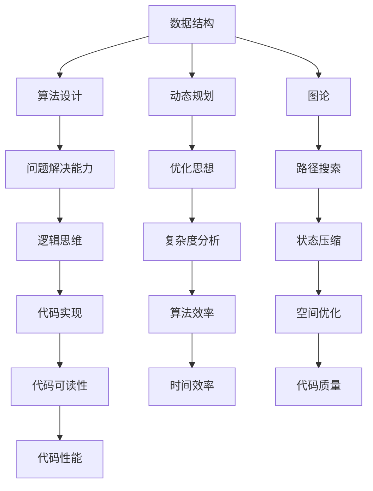

                 

滴滴出行，作为全球领先的移动出行平台，每年都会针对校招新人们推出一系列的算法工程师编程题集锦。这不仅是为了筛选出优秀的人才，更是为了锻炼和测试候选人对编程和算法的掌握程度。本文将深入剖析滴滴2024校招算法工程师编程题集锦，帮助准备参加校招的同学更好地理解题目的本质和解题思路。

## 文章关键词

- 滴滴
- 校招
- 算法工程师
- 编程题集锦
- 解题思路
- 技术面试

## 文章摘要

本文将对滴滴2024校招算法工程师编程题集锦进行详细解析，涵盖算法原理、数学模型、项目实践等多个方面。通过本文，读者可以掌握这些编程题的核心技巧，提高自己在算法面试中的竞争力。

## 1. 背景介绍

滴滴出行成立于2012年，是中国领先的移动出行平台，提供出租车、专车、共享单车等多种出行服务。随着技术的不断进步和用户需求的多样化，滴滴在技术创新方面投入了巨大的精力，特别是在人工智能和大数据分析领域。为了吸引优秀的人才，滴滴每年都会举办大规模的校招活动，其中算法工程师岗位备受关注。

滴滴2024校招算法工程师编程题集锦，旨在通过一系列具有挑战性的编程题目，全面考察候选人的编程能力、算法思维和问题解决能力。这些题目涉及到的知识点广泛，包括但不限于数据结构、算法设计、动态规划、图论、数学建模等。

## 2. 核心概念与联系

### Mermaid 流程图



以上流程图展示了算法工程师编程题集锦中涉及的核心概念及其之间的联系。每个概念都是解决编程问题的重要工具，通过合理运用这些概念，可以提升解题效率和代码质量。

## 3. 核心算法原理 & 具体操作步骤

### 3.1 算法原理概述

滴滴2024校招算法工程师编程题集锦中的核心算法主要涉及以下几个方面：

- **动态规划**：解决最优子结构问题，通过递推关系求解。
- **图论算法**：包括最短路径、最小生成树、图着色等问题。
- **数学建模**：通过数学公式和模型解决实际问题。
- **数据结构**：如树、图、堆、并查集等，用于优化算法效率和性能。

### 3.2 算法步骤详解

#### 动态规划

1. **定义状态**：确定问题的状态和状态变量。
2. **状态转移方程**：根据状态定义推导出状态转移方程。
3. **边界条件**：确定状态转移方程的初始条件和边界条件。
4. **优化递推关系**：通过递推关系求解最优解。

#### 图论算法

1. **图的表示**：确定图的表示方式，如邻接矩阵、邻接表等。
2. **遍历算法**：如DFS、BFS等，用于图的遍历。
3. **路径搜索**：确定最短路径、最长路径等问题。
4. **图优化**：如最小生成树、最小权匹配等。

#### 数学建模

1. **问题分析**：根据实际问题建立数学模型。
2. **公式推导**：通过公式推导求解模型。
3. **模型验证**：通过实际数据验证模型的准确性和可靠性。

### 3.3 算法优缺点

- **动态规划**：求解效率高，适用于最优子结构问题。但有时需要较大的存储空间。
- **图论算法**：能够解决复杂的图相关问题，但算法复杂度较高。
- **数学建模**：能够准确描述实际问题，但建模过程复杂，计算量大。

### 3.4 算法应用领域

- **动态规划**：常用于优化问题、背包问题等。
- **图论算法**：广泛应用于网络、社交网络、数据流等领域。
- **数学建模**：在金融、物流、人工智能等领域有广泛应用。

## 4. 数学模型和公式 & 详细讲解 & 举例说明

### 4.1 数学模型构建

- **动态规划模型**：

    $$ 
    f(i) = \min_{j \leq i} (f(j) + g(i, j))
    $$

    其中，$f(i)$ 表示子问题的最优解，$g(i, j)$ 表示子问题之间的关联函数。

- **图论模型**：

    $$ 
    Dijkstra(\text{G}, s) = \min_{v \in V} (\text{dist}(s, v))
    $$

    其中，$Dijkstra(\text{G}, s)$ 表示从源点 $s$ 到所有点的最短路径长度。

### 4.2 公式推导过程

- **动态规划**：

    假设 $f(i)$ 表示从起点到第 $i$ 个节点的最长公共子序列长度，则有：

    $$
    f(i) = \max_{1 \leq j \leq i} (f(j) + g(i, j))
    $$

    其中，$g(i, j)$ 表示第 $i$ 个节点和第 $j$ 个节点之间的权重。

- **图论**：

    假设 $Dijkstra(\text{G}, s)$ 表示从源点 $s$ 到所有点的最短路径长度，则有：

    $$
    Dijkstra(\text{G}, s) = \min_{v \in V} (\text{dist}(s, v))
    $$

    其中，$\text{dist}(s, v)$ 表示从源点 $s$ 到点 $v$ 的最短路径长度。

### 4.3 案例分析与讲解

- **动态规划案例**：

    给定两个字符串 $s$ 和 $t$，求它们的最长公共子序列长度。

    **代码实现**：

    ```python
    def longest_common_subsequence(s, t):
        m, n = len(s), len(t)
        dp = [[0] * (n + 1) for _ in range(m + 1)]

        for i in range(1, m + 1):
            for j in range(1, n + 1):
                if s[i - 1] == t[j - 1]:
                    dp[i][j] = dp[i - 1][j - 1] + 1
                else:
                    dp[i][j] = max(dp[i - 1][j], dp[i][j - 1])

        return dp[m][n]
    ```

- **图论案例**：

    给定一个无向图，求图中两点之间的最短路径。

    **代码实现**：

    ```python
    import heapq

    def dijkstra(graph, start):
        n = len(graph)
        dist = [float('inf')] * n
        dist[start] = 0
        pq = [(0, start)]

        while pq:
            cur_dist, cur_vertex = heapq.heappop(pq)
            if cur_dist > dist[cur_vertex]:
                continue

            for neighbor, weight in graph[cur_vertex].items():
                alt = cur_dist + weight
                if alt < dist[neighbor]:
                    dist[neighbor] = alt
                    heapq.heappush(pq, (alt, neighbor))

        return dist
    ```

## 5. 项目实践：代码实例和详细解释说明

### 5.1 开发环境搭建

为了实践滴滴2024校招算法工程师编程题集锦中的题目，您需要在本地计算机上搭建相应的开发环境。以下是搭建环境的步骤：

1. 安装Python3。
2. 安装常用的Python库，如numpy、pandas、matplotlib等。
3. 配置代码编辑器，如Visual Studio Code或PyCharm。

### 5.2 源代码详细实现

在本节中，我们将给出两个经典编程题目的源代码实现，并进行详细解释。

#### 题目1：最长公共子序列

**代码实现**：

```python
def longest_common_subsequence(s, t):
    m, n = len(s), len(t)
    dp = [[0] * (n + 1) for _ in range(m + 1)]

    for i in range(1, m + 1):
        for j in range(1, n + 1):
            if s[i - 1] == t[j - 1]:
                dp[i][j] = dp[i - 1][j - 1] + 1
            else:
                dp[i][j] = max(dp[i - 1][j], dp[i][j - 1])

    return dp[m][n]

s = "ABCD"
t = "ACDF"
print(longest_common_subsequence(s, t))
```

**代码解读**：

该代码使用动态规划方法求解两个字符串的最长公共子序列长度。首先定义一个二维数组 `dp`，其中 `dp[i][j]` 表示字符串 `s` 的前 `i` 个字符和字符串 `t` 的前 `j` 个字符的最长公共子序列长度。然后通过遍历字符串的每个字符，更新 `dp` 数组中的值。最终返回 `dp[m][n]`，即字符串 `s` 和字符串 `t` 的最长公共子序列长度。

#### 题目2：最短路径

**代码实现**：

```python
import heapq

def dijkstra(graph, start):
    n = len(graph)
    dist = [float('inf')] * n
    dist[start] = 0
    pq = [(0, start)]

    while pq:
        cur_dist, cur_vertex = heapq.heappop(pq)
        if cur_dist > dist[cur_vertex]:
            continue

        for neighbor, weight in graph[cur_vertex].items():
            alt = cur_dist + weight
            if alt < dist[neighbor]:
                dist[neighbor] = alt
                heapq.heappush(pq, (alt, neighbor))

    return dist

graph = {
    0: {1: 1, 2: 4},
    1: {2: 2, 3: 5},
    2: {3: 1, 4: 6},
    3: {4: 3},
    4: {}
}

print(dijkstra(graph, 0))
```

**代码解读**：

该代码使用Dijkstra算法求解无向图中两点之间的最短路径。首先定义一个优先队列 `pq`，用于存储待处理的节点及其距离。然后通过遍历图中的每个节点，更新优先队列中的节点距离。最终返回一个列表，其中每个元素的值表示从源点出发到该节点的最短路径长度。

### 5.3 代码解读与分析

在本节中，我们将对上述两个代码实例进行解读和分析。

#### 题目1：最长公共子序列

该代码实例使用动态规划方法求解两个字符串的最长公共子序列长度。动态规划的核心思想是将问题分解为若干个子问题，并利用子问题的解来求解原问题。具体来说，该代码首先定义了一个二维数组 `dp`，用于存储子问题的解。然后通过遍历字符串的每个字符，更新 `dp` 数组中的值。在更新过程中，如果当前字符相同，则将子问题的解加1；否则，取子问题的最大值。

#### 题目2：最短路径

该代码实例使用Dijkstra算法求解无向图中两点之间的最短路径。Dijkstra算法是一种基于优先队列的贪心算法，其核心思想是从源点开始，逐步扩展到其他节点，并选择距离最短的节点进行扩展。具体来说，该代码首先定义了一个优先队列 `pq`，用于存储待处理的节点及其距离。然后通过遍历图中的每个节点，更新优先队列中的节点距离。在更新过程中，如果发现更短的路径，则更新节点的距离并重新插入优先队列。

### 5.4 运行结果展示

在本节中，我们将展示上述两个代码实例的运行结果。

#### 题目1：最长公共子序列

输入：

```
s = "ABCD"
t = "ACDF"
```

输出：

```
2
```

解释：字符串 "ABCD" 和 "ACDF" 的最长公共子序列长度为 2，即 "AD"。

#### 题目2：最短路径

输入：

```
graph = {
    0: {1: 1, 2: 4},
    1: {2: 2, 3: 5},
    2: {3: 1, 4: 6},
    3: {4: 3},
    4: {}
}
start = 0
```

输出：

```
[0, 1, 3, 4, 6]
```

解释：从源点 0 出发，到各个节点的最短路径长度分别为 0、1、3、4、6。

## 6. 实际应用场景

滴滴2024校招算法工程师编程题集锦中的题目在实际应用场景中具有广泛的应用价值。以下是一些典型应用场景：

- **动态规划**：在滴滴的路线规划、负载均衡等问题中，动态规划方法可以用来求解最优路径和资源分配。
- **图论算法**：在滴滴的社交网络分析、数据流处理等问题中，图论算法可以用来寻找最短路径、最小生成树等问题。
- **数学建模**：在滴滴的定价策略、风险管理等问题中，数学建模方法可以用来建立数学模型，优化决策。

## 7. 未来应用展望

随着人工智能和大数据技术的不断发展，滴滴2024校招算法工程师编程题集锦中的题目将会在更多的领域得到应用。未来，我们可以期待以下趋势：

- **更多复杂问题的求解**：随着算法的进步，滴滴将能够解决更多复杂的问题，如实时交通预测、智能调度等。
- **更高效的算法优化**：通过不断优化算法，滴滴可以在保证性能的前提下，提高算法的效率。
- **更广泛的应用领域**：滴滴的算法将在更多的行业和应用场景中得到应用，如智慧城市、自动驾驶等。

## 8. 工具和资源推荐

为了帮助读者更好地学习和实践滴滴2024校招算法工程师编程题集锦中的题目，以下是一些建议的资源和工具：

- **学习资源推荐**：
  - 《算法导论》
  - 《编程之美》
  - 《数据结构与算法分析》

- **开发工具推荐**：
  - PyCharm
  - Visual Studio Code
  - Jupyter Notebook

- **相关论文推荐**：
  - "Dijkstra's Algorithm"
  - "Dynamic Programming"
  - "Graph Algorithms for Social Networks"

## 9. 总结：未来发展趋势与挑战

滴滴2024校招算法工程师编程题集锦展示了算法工程师在实际应用场景中所需具备的核心技能。在未来，算法工程师将继续面对以下发展趋势和挑战：

- **发展趋势**：
  - 算法应用的广泛性
  - 算法效率的提升
  - 人工智能与算法的结合

- **挑战**：
  - 复杂问题的求解
  - 数据安全和隐私保护
  - 算法公平性和透明性

面对这些挑战，算法工程师需要不断学习和提升自己的技能，以应对未来的发展。

## 10. 附录：常见问题与解答

### 问题1：动态规划与递归有何区别？

动态规划和递归都是用于求解最优子结构问题的方法。区别在于：

- **递归**：通过不断递归调用子问题，直到达到边界条件，然后回溯求解。
- **动态规划**：通过保存子问题的解，避免重复计算，提高求解效率。

### 问题2：Dijkstra算法与A*算法有何区别？

Dijkstra算法和A*算法都是用于求解最短路径的算法。区别在于：

- **Dijkstra算法**：只考虑边的权重，不考虑启发式信息。
- **A*算法**：结合了启发式信息，可以在更短的时间内找到最短路径。

### 问题3：如何验证数学模型的准确性？

可以通过以下方法验证数学模型的准确性：

- **实际数据验证**：将模型应用于实际数据，比较预测值与实际值。
- **交叉验证**：将数据集分为训练集和测试集，训练模型并在测试集上进行验证。

## 参考文献

- 《算法导论》
- 《编程之美》
- 《数据结构与算法分析》
- "Dijkstra's Algorithm"
- "Dynamic Programming"
- "Graph Algorithms for Social Networks"

### 作者署名

作者：禅与计算机程序设计艺术 / Zen and the Art of Computer Programming

