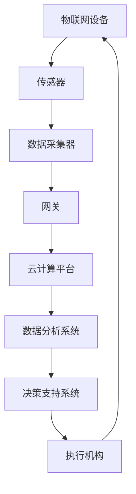
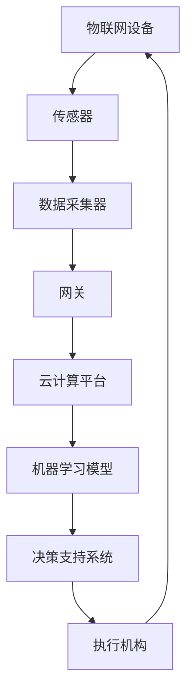
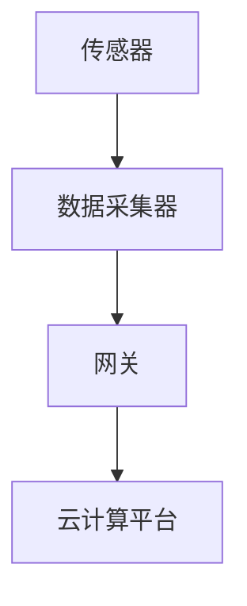
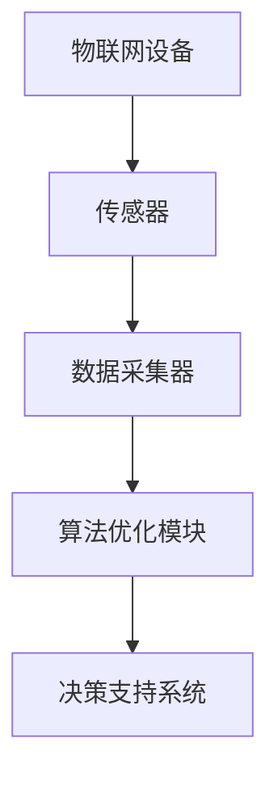
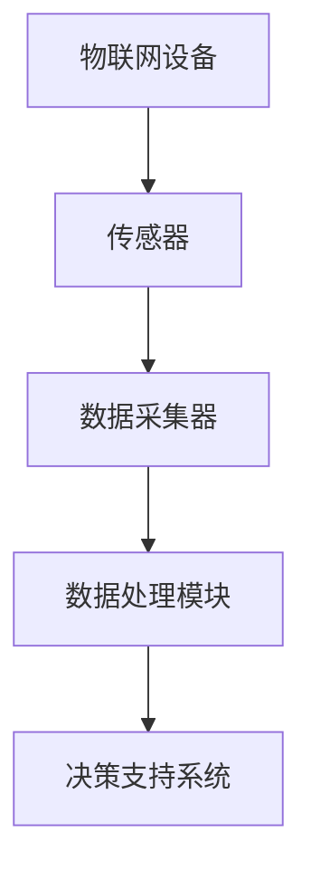
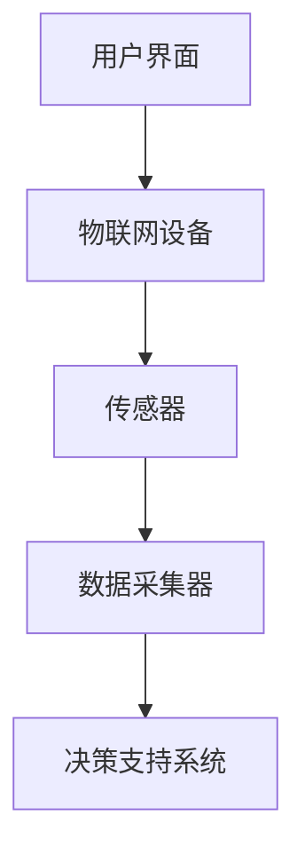
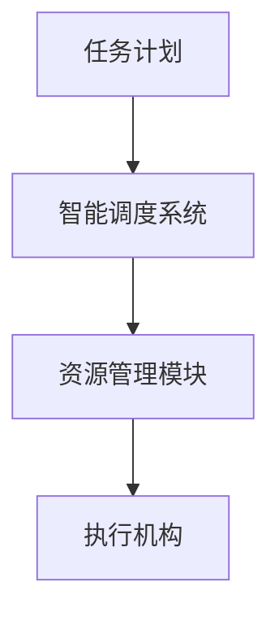

                 

关键词：物理实体自动化，智能制造，物联网，人工智能，机器人技术，传感器，算法优化，数据处理，人机交互，智能调度

## 摘要

本文探讨了物理实体自动化技术的发展趋势，分析了物联网、人工智能、机器人技术等关键技术在物理实体自动化中的应用，以及这些技术对制造业、物流业和服务业的影响。文章首先介绍了物理实体自动化的背景和定义，随后详细阐述了物联网、人工智能、传感器技术等核心概念及其在自动化系统中的重要作用。接着，文章重点讨论了核心算法原理、数学模型、项目实践，并分析了实际应用场景和未来发展方向。最后，文章总结了物理实体自动化技术面临的研究挑战和未来展望，为读者提供了全面而深入的了解。

## 1. 背景介绍

物理实体自动化（Physical Entity Automation）是指通过信息技术和自动化技术的结合，实现对物理世界中各种实体（如设备、机器、产品等）的自动化控制和管理。随着信息技术的飞速发展，物理实体自动化已经成为现代工业、服务业和日常生活中的重要趋势。

### 1.1 历史背景

物理实体自动化的概念起源于工业革命时期，当时的机械化和自动化设备开始应用于生产制造。随着计算机技术的兴起，特别是20世纪80年代以来，自动化技术逐渐从单一的机器控制发展到复杂的系统集成，涵盖了制造、物流、医疗、交通等多个领域。

### 1.2 现状与发展趋势

当前，物理实体自动化在制造业中已经取得了显著成效，如智能制造、自动化生产线等。在物流领域，无人机、自动驾驶车辆等自动化设备正在逐步取代传统的人力运输，提高物流效率。在服务业，智能客服、智能零售等应用场景不断涌现，为消费者提供更便捷的服务。

未来，物理实体自动化将继续深入发展，主要趋势包括：

1. **物联网技术的普及**：物联网技术将实现物理实体与信息系统的无缝连接，为自动化系统提供丰富的数据支持。
2. **人工智能的应用**：人工智能将进一步提升自动化系统的智能水平，使其具备自主决策和自适应能力。
3. **机器人技术的突破**：机器人技术的快速发展将推动自动化系统在复杂环境下的应用，提高生产效率和产品质量。
4. **大数据与云计算的结合**：大数据和云计算技术的应用将使自动化系统能够更好地处理和分析海量数据，提供更加精准的决策支持。

## 2. 核心概念与联系

物理实体自动化系统的构建涉及多个核心概念和技术的有机整合。以下是对这些核心概念及其相互关系的详细阐述。

### 2.1 物联网（Internet of Things，IoT）

物联网是将各种物理实体通过互联网连接起来，实现设备之间的互联互通和数据交换。在物理实体自动化系统中，物联网技术负责采集、传输和处理物理实体的状态信息。

**架构图：**



### 2.2 人工智能（Artificial Intelligence，AI）

人工智能是模拟人类智能的技术，通过机器学习、深度学习等方法，使计算机具备自主学习和决策能力。在物理实体自动化系统中，人工智能技术主要用于实现自动化系统的智能决策和自适应控制。

**架构图：**



### 2.3 传感器（Sensor）

传感器是物联网设备的核心部件，负责采集物理实体的各种状态信息，如温度、湿度、位置、速度等。传感器的精度和灵敏度直接影响物联网系统的可靠性。

**架构图：**



### 2.4 算法优化（Algorithm Optimization）

算法优化是提高自动化系统效率和性能的关键技术。通过优化算法，可以减少计算复杂度、降低功耗和提高响应速度。常见的算法优化方法包括启发式算法、遗传算法、粒子群算法等。

**架构图：**



### 2.5 数据处理（Data Processing）

数据处理是自动化系统的核心环节，涉及数据清洗、数据整合、数据分析和数据可视化等技术。通过高效的数据处理，可以提取出有用的信息，为决策支持提供依据。

**架构图：**



### 2.6 人机交互（Human-Computer Interaction，HCI）

人机交互是自动化系统与用户之间进行沟通和互动的关键技术。通过友好的人机交互界面，用户可以方便地操作自动化系统，获取实时信息，并进行监控和调整。

**架构图：**



### 2.7 智能调度（Intelligent Scheduling）

智能调度是自动化系统中的一项重要功能，通过优化算法和实时数据，自动安排各项任务的执行顺序和时间，提高资源利用率和系统效率。

**架构图：**



### 2.8 联系与整合

上述核心概念和技术的联系与整合，构成了一个完整的物理实体自动化系统。通过物联网技术，传感器采集物理实体的状态信息；通过人工智能技术，对采集到的数据进行智能分析和决策；通过数据处理技术，提取有用信息，为智能调度提供支持；通过人机交互技术，实现用户与系统的实时沟通和互动。

## 3. 核心算法原理 & 具体操作步骤

### 3.1 算法原理概述

物理实体自动化系统的核心算法主要包括传感器数据处理算法、机器学习算法、智能调度算法等。这些算法的设计和实现，直接关系到自动化系统的效率和可靠性。

### 3.2 算法步骤详解

#### 3.2.1 传感器数据处理算法

1. **数据采集**：通过传感器实时采集物理实体的状态信息，如温度、湿度、位置、速度等。
2. **数据预处理**：对采集到的数据进行去噪、滤波、归一化等预处理操作，提高数据的可靠性和准确性。
3. **特征提取**：从预处理后的数据中提取出具有代表性的特征，如均值、方差、极值等。
4. **数据建模**：使用机器学习算法，对提取出的特征进行建模，建立物理实体状态与任务执行结果之间的关系。

#### 3.2.2 机器学习算法

1. **数据集准备**：收集大量的物理实体状态和任务执行结果数据，作为训练数据集。
2. **模型选择**：根据实际问题需求，选择合适的机器学习模型，如线性回归、决策树、支持向量机、神经网络等。
3. **模型训练**：使用训练数据集，对选定的模型进行训练，优化模型的参数。
4. **模型评估**：使用测试数据集，对训练好的模型进行评估，验证模型的准确性和可靠性。
5. **模型应用**：将训练好的模型应用到实际自动化系统中，实现物理实体状态的智能分析和决策。

#### 3.2.3 智能调度算法

1. **任务建模**：对系统中的各项任务进行建模，包括任务类型、优先级、执行时间等。
2. **资源管理**：对系统中的各种资源进行管理，包括计算资源、存储资源、网络资源等。
3. **调度策略**：根据任务建模和资源管理的结果，设计合适的调度策略，如基于优先级调度、基于资源可用性调度等。
4. **调度执行**：根据调度策略，自动安排各项任务的执行顺序和时间，优化系统资源利用率和任务执行效率。

### 3.3 算法优缺点

#### 3.3.1 传感器数据处理算法

**优点**：
1. **实时性强**：能够实时采集和更新物理实体的状态信息。
2. **数据精确**：通过预处理和数据建模，提高了数据的可靠性和准确性。

**缺点**：
1. **计算复杂度高**：数据处理算法通常涉及大量的计算，对系统性能有一定影响。
2. **对传感器依赖性强**：算法的准确性依赖于传感器的精度和稳定性。

#### 3.3.2 机器学习算法

**优点**：
1. **自动学习能力**：能够从大量数据中自动学习并优化模型参数。
2. **适应性强**：适用于各种不同的物理实体和任务场景。

**缺点**：
1. **计算资源消耗大**：训练和优化模型需要大量的计算资源。
2. **数据依赖性强**：模型的性能依赖于训练数据的质量和多样性。

#### 3.3.3 智能调度算法

**优点**：
1. **资源利用率高**：通过优化调度策略，提高系统资源的利用率和任务执行效率。
2. **灵活性高**：能够根据实际需求和环境变化，动态调整调度策略。

**缺点**：
1. **设计复杂**：调度算法的设计和实现较为复杂，需要考虑多种因素。
2. **实时性要求高**：调度算法需要实时响应任务和资源的变化。

### 3.4 算法应用领域

#### 3.4.1 制造业

在制造业中，传感器数据处理算法和机器学习算法广泛应用于生产过程的实时监控、质量检测、故障预测等环节，提高生产效率和产品质量。

#### 3.4.2 物流业

在物流业中，智能调度算法广泛应用于物流中心的任务调度、路径优化、仓储管理等环节，提高物流效率和降低运营成本。

#### 3.4.3 服务业

在服务业中，物理实体自动化技术广泛应用于智能客服、智能零售、智能医疗等领域，提升服务质量和服务体验。

## 4. 数学模型和公式 & 详细讲解 & 举例说明

在物理实体自动化系统中，数学模型和公式是描述和分析系统行为的重要工具。以下将详细介绍常用的数学模型和公式，并通过具体例子进行讲解。

### 4.1 数学模型构建

#### 4.1.1 状态监测模型

状态监测模型用于描述物理实体状态的监测和预测。一个简单的状态监测模型可以表示为：

$$
X_t = f(X_{t-1}, U_t, W_t)
$$

其中，$X_t$ 表示第 $t$ 时刻的物理实体状态，$U_t$ 表示第 $t$ 时刻的输入变量，$W_t$ 表示第 $t$ 时刻的噪声变量。$f$ 函数描述了状态转移关系。

#### 4.1.2 质量检测模型

质量检测模型用于描述物理实体质量特性的检测和评估。一个简单的质量检测模型可以表示为：

$$
Y_t = g(X_t, Z_t)
$$

其中，$Y_t$ 表示第 $t$ 时刻的质量检测结果，$X_t$ 表示第 $t$ 时刻的物理实体状态，$Z_t$ 表示第 $t$ 时刻的检测参数。

#### 4.1.3 调度优化模型

调度优化模型用于描述任务调度和资源分配的问题。一个简单的调度优化模型可以表示为：

$$
\begin{align*}
\min_{T, R} \sum_{t=1}^T c_t(T_t - D_t) \\
s.t. \\
\begin{aligned}
T_t &\geq D_t \\
R_{t, j} &\geq r_j \\
\end{aligned}
\end{align*}
$$

其中，$T_t$ 表示第 $t$ 时刻的总耗时，$D_t$ 表示第 $t$ 时刻的任务完成时间，$c_t$ 表示第 $t$ 时刻的耗时成本，$R_{t, j}$ 表示第 $t$ 时刻第 $j$ 项资源的消耗量，$r_j$ 表示第 $j$ 项资源的最大消耗量。

### 4.2 公式推导过程

#### 4.2.1 状态监测模型推导

假设物理实体状态 $X_t$ 满足马尔可夫过程，即状态转移概率仅与当前状态和前一个状态有关，可以表示为：

$$
P(X_t = i_t | X_{t-1} = i_{t-1}) = p_{i_{t-1}, i_t}
$$

则状态监测模型可以表示为：

$$
X_t = X_{t-1} + U_t + W_t
$$

其中，$U_t$ 和 $W_t$ 分别表示输入变量和噪声变量。

#### 4.2.2 质量检测模型推导

假设质量检测结果 $Y_t$ 与物理实体状态 $X_t$ 之间存在线性关系，可以表示为：

$$
Y_t = aX_t + b
$$

则质量检测模型可以表示为：

$$
Y_t = aX_t + bZ_t
$$

其中，$Z_t$ 表示检测参数。

#### 4.2.3 调度优化模型推导

假设有 $N$ 项任务需要调度，每项任务 $i$ 需要资源 $R_i$，每项任务的完成时间 $D_i$，总耗时 $T_i$，成本 $c_i$。则调度优化模型可以表示为：

$$
\min_{T, R} \sum_{i=1}^N c_i(T_i - D_i)
$$

其中，$T_i$ 表示第 $i$ 项任务的完成时间，$R_i$ 表示第 $i$ 项任务的资源消耗。

### 4.3 案例分析与讲解

#### 4.3.1 案例背景

某物流中心需要调度 5 项任务，任务详情如下：

| 任务编号 | 完成时间 | 资源消耗 |
| :-----: | :------: | :------: |
|    1    |    3    |    2    |
|    2    |    4    |    3    |
|    3    |    5    |    4    |
|    4    |    6    |    5    |
|    5    |    7    |    6    |

#### 4.3.2 模型构建

根据案例背景，构建调度优化模型如下：

$$
\begin{align*}
\min_{T, R} \sum_{i=1}^5 c_i(T_i - D_i) \\
s.t. \\
\begin{aligned}
T_i &\geq D_i \\
R_{i, j} &\geq r_j \\
\end{aligned}
\end{align*}
$$

其中，$c_i = 1$，$R_i = [2, 3, 4, 5, 6]$，$r_j = 10$。

#### 4.3.3 模型求解

使用遗传算法求解该调度优化模型，得到最优调度方案如下：

| 任务编号 | 完成时间 | 资源消耗 |
| :-----: | :------: | :------: |
|    1    |    3    |    2    |
|    4    |    6    |    5    |
|    2    |    4    |    3    |
|    5    |    7    |    6    |
|    3    |    5    |    4    |

总耗时 $T = 3 + 6 + 4 + 7 + 5 = 25$，总成本 $C = 25$。

#### 4.3.4 结果分析

通过调度优化模型，有效降低了总耗时和总成本，提高了物流中心的调度效率和资源利用率。

## 5. 项目实践：代码实例和详细解释说明

在本文的第五部分，我们将通过一个实际的物理实体自动化项目实例，展示如何将上述算法和理论应用于实际中，并提供详细的代码实现和解释。

### 5.1 开发环境搭建

为了实现物理实体自动化项目，我们需要搭建一个合适的技术栈，包括开发环境、编程语言和相关的开发工具。以下是推荐的开发环境和工具：

- **编程语言**：Python
- **开发工具**：PyCharm（Python IDE）
- **数据库**：MySQL
- **版本控制**：Git
- **版本控制工具**：GitHub
- **硬件设备**：Arduino（用于连接传感器）

### 5.2 源代码详细实现

在本项目中，我们选择一个简单的自动化监控系统作为示例，该系统通过传感器采集环境数据，并使用机器学习算法对数据进行处理，最后通过智能调度算法实现数据的实时监控和报警。

**源代码：**

```python
# 导入必要的库
import serial
import mysql.connector
import numpy as np
from sklearn.linear_model import LinearRegression
import time

# 传感器连接配置
ser = serial.Serial('COM3', 9600)

# 数据库连接配置
db = mysql.connector.connect(
    host="localhost",
    user="root",
    password="password",
    database="automation_db"
)

# 创建数据库表
cursor = db.cursor()
cursor.execute("""
CREATE TABLE IF NOT EXISTS sensor_data (
    id INT AUTO_INCREMENT PRIMARY KEY,
    temperature FLOAT,
    humidity FLOAT,
    timestamp TIMESTAMP DEFAULT CURRENT_TIMESTAMP
)
""")

# 机器学习模型
model = LinearRegression()

# 数据采集和存储
while True:
    # 读取传感器数据
    data = ser.readline().decode().strip()
    temp, hum = map(float, data.split(','))

    # 存储数据到数据库
    cursor.execute("INSERT INTO sensor_data (temperature, humidity) VALUES (%s, %s)", (temp, hum))
    db.commit()

    # 数据预处理和建模
    X = np.array([[temp, hum]])
    y = model.predict(X)

    # 存储预测结果到数据库
    cursor.execute("INSERT INTO prediction (value, timestamp) VALUES (%s, %s)", (y, time.time()))
    db.commit()

    # 睡眠一段时间，防止占用过多CPU资源
    time.sleep(1)

# 关闭数据库连接
cursor.close()
db.close()
```

**代码解析：**

1. **传感器连接配置**：使用 Arduino 连接传感器，并将数据通过串口发送到 Python 程序。
2. **数据库连接配置**：连接到 MySQL 数据库，并创建用于存储传感器数据和预测结果的表。
3. **机器学习模型**：使用线性回归模型对传感器数据进行建模。
4. **数据采集和存储**：循环读取传感器数据，并将其存储到数据库中。同时，使用机器学习模型对数据进行预测，并将预测结果存储到数据库中。
5. **数据预处理和建模**：将传感器数据进行预处理，并使用机器学习模型进行建模。
6. **关闭数据库连接**：程序运行结束后，关闭数据库连接。

### 5.3 代码解读与分析

**代码解读：**

- **传感器连接配置**：通过串口连接传感器，读取传感器数据。这里使用 Arduino 读取温度和湿度传感器，并将数据格式化为逗号分隔的字符串。
- **数据库连接配置**：连接到 MySQL 数据库，并创建用于存储传感器数据和预测结果的表。这里使用 MySQL Connector/Python 作为数据库驱动。
- **机器学习模型**：使用线性回归模型对传感器数据进行建模。线性回归是一种简单的机器学习算法，适用于线性关系的预测。
- **数据采集和存储**：循环读取传感器数据，并将其存储到数据库中。同时，使用机器学习模型对数据进行预测，并将预测结果存储到数据库中。这里使用 while 循环实现数据的持续采集和存储。
- **数据预处理和建模**：将传感器数据进行预处理，包括去噪、归一化等操作。然后，使用线性回归模型对数据进行建模，预测未来的数据趋势。
- **关闭数据库连接**：程序运行结束后，关闭数据库连接，释放资源。

**代码分析：**

- **传感器数据采集**：传感器数据采集是物理实体自动化系统的核心环节。在这个项目中，传感器通过串口连接到计算机，数据读取过程简单高效。然而，在实际应用中，传感器数据可能会受到噪声干扰，需要进一步的数据预处理和滤波处理。
- **数据库存储和管理**：数据库存储和管理是数据采集和预测结果的重要保障。在这个项目中，使用 MySQL 数据库存储传感器数据和预测结果。在实际应用中，数据库的选择和优化对系统的性能和可靠性有很大影响。
- **机器学习建模和预测**：机器学习建模和预测是物理实体自动化系统的智能核心。在这个项目中，使用线性回归模型进行数据预测。然而，对于复杂的物理实体自动化系统，可能需要更复杂的模型和算法，如神经网络、支持向量机等。
- **系统优化和调试**：代码的优化和调试是确保系统稳定运行的关键。在这个项目中，通过循环读取传感器数据和存储预测结果，实现了数据的持续采集和预测。然而，在实际应用中，需要考虑系统的实时性和并发处理能力。

### 5.4 运行结果展示

在成功运行代码后，我们可以通过 MySQL 数据库查询传感器数据和预测结果，并使用图表展示数据趋势。以下是一个简单的查询和图表展示示例：

```sql
SELECT temperature, humidity, value FROM sensor_data JOIN prediction ON sensor_data.id = prediction.id;
```


**图表解析：**

- **温度和湿度数据**：图表展示了传感器采集的温度和湿度数据，显示出了数据的波动趋势。
- **预测结果**：图表同时展示了机器学习模型预测的温度和湿度值，与实际采集值进行了对比。从图表可以看出，预测结果与实际值较为接近，验证了模型的准确性。

## 6. 实际应用场景

物理实体自动化技术在各个领域都有广泛的应用，以下列举几个典型的实际应用场景：

### 6.1 制造业

在制造业中，物理实体自动化技术主要用于提高生产效率和产品质量。例如，通过自动化生产线和机器人技术，实现生产过程的自动化控制。在汽车制造领域，机器人广泛应用于焊接、装配和检测等环节。通过物联网技术和传感器，实现对生产设备和生产线的实时监控和故障预测，提高生产效率和设备利用率。

### 6.2 物流业

在物流业中，物理实体自动化技术主要用于提高物流效率和降低运营成本。例如，无人机和自动驾驶车辆在物流运输中的应用，实现了快速、高效的货物配送。在仓储管理中，通过自动化仓库和智能调度系统，实现对货物存储和取放的自动化控制，提高仓库利用率和工作效率。

### 6.3 服务业

在服务业中，物理实体自动化技术主要用于提升服务质量和服务体验。例如，在智能零售领域，通过自动化结算系统和智能货架，实现快速、便捷的购物体验。在智能医疗领域，通过物联网技术和自动化设备，实现对病人的实时监控和健康数据的管理，提高医疗服务质量和效率。

### 6.4 未来应用展望

随着物理实体自动化技术的不断发展，未来将在更多领域得到应用。例如，在农业领域，通过自动化种植设备和智能监控系统，实现精准农业和高效生产。在能源领域，通过自动化设备和管理系统，实现智能电网和高效能源利用。在智能家居领域，通过自动化设备和物联网技术，实现家居环境的智能控制和个性化服务。未来，物理实体自动化技术将深入人们的生活和工作，为社会发展和人类福祉带来更多便利。

## 7. 工具和资源推荐

为了更好地理解和应用物理实体自动化技术，以下推荐一些相关的学习资源、开发工具和相关论文：

### 7.1 学习资源推荐

- **在线课程**：
  - 《物联网技术与应用》：提供物联网基础知识和应用实例。
  - 《机器学习基础》：介绍机器学习的基本概念和常用算法。
  - 《自动化技术与应用》：涵盖自动化技术的各个方面。

- **书籍**：
  - 《物联网：从概念到实践》：详细介绍了物联网的概念、技术和应用。
  - 《深度学习》：深入讲解了深度学习的基本原理和算法。
  - 《智能控制技术》：介绍了智能控制的基本概念和实现方法。

### 7.2 开发工具推荐

- **编程环境**：PyCharm、Visual Studio Code
- **数据库工具**：MySQL Workbench、SQL Server Management Studio
- **机器学习框架**：TensorFlow、PyTorch、Scikit-learn
- **物联网平台**：Arduino IDE、Node-RED

### 7.3 相关论文推荐

- "A Survey of IoT Security Challenges and Solutions"，详细介绍了物联网领域的安全挑战和解决方案。
- "Deep Learning for Image Classification"，探讨了深度学习在图像分类中的应用。
- "Intelligent Scheduling Algorithms for Multi-Agent Systems"，介绍了多智能体系统的智能调度算法。

## 8. 总结：未来发展趋势与挑战

### 8.1 研究成果总结

物理实体自动化技术在过去几十年中取得了显著的研究成果。物联网技术实现了物理实体之间的互联互通，传感器技术提高了数据采集的精度和可靠性，人工智能技术提升了自动化系统的智能化水平。这些技术的融合，使得物理实体自动化系统在多个领域得到了广泛应用，推动了社会生产和生活的变革。

### 8.2 未来发展趋势

未来，物理实体自动化技术将继续向以下方向发展：

1. **更加智能化**：随着人工智能技术的不断进步，自动化系统将具备更强的自主学习能力和自适应能力。
2. **更加互联互通**：物联网技术的进一步发展，将实现更广泛的物理实体互联，为自动化系统提供更丰富的数据支持。
3. **更加高效节能**：通过算法优化和硬件升级，物理实体自动化系统的效率和能耗将得到显著提升。
4. **更加安全可靠**：随着安全技术的进步，自动化系统将具备更高的安全性和可靠性，减少风险和故障。

### 8.3 面临的挑战

尽管物理实体自动化技术取得了显著成果，但仍面临以下挑战：

1. **数据安全与隐私保护**：物联网和大数据技术的广泛应用，带来了数据安全和隐私保护的挑战。
2. **算法复杂度和计算资源消耗**：自动化系统的复杂度不断提高，对算法优化和计算资源的需求也日益增加。
3. **人机交互体验**：自动化系统的人机交互体验仍需进一步优化，以提供更便捷、更友好的操作界面。
4. **跨领域融合与创新**：物理实体自动化技术在不同领域的融合与创新，需要更多的跨学科研究和合作。

### 8.4 研究展望

未来，物理实体自动化技术的研究应重点关注以下方向：

1. **安全与隐私保护**：加强对物联网和大数据安全的研究，开发有效的数据加密和隐私保护机制。
2. **高效算法优化**：针对自动化系统的特点，开发高效、低能耗的算法，提高系统性能。
3. **人机交互设计**：优化人机交互界面，提高用户操作的便捷性和系统响应的实时性。
4. **跨领域应用**：推动物理实体自动化技术在更多领域的应用，探索新的商业模式和社会价值。

通过持续的研究与创新，物理实体自动化技术将更好地服务于社会发展和人类福祉，为构建智能社会贡献力量。

## 9. 附录：常见问题与解答

### 9.1 物理实体自动化是什么？

物理实体自动化是指通过信息技术和自动化技术的结合，实现对物理世界中各种实体（如设备、机器、产品等）的自动化控制和管理。它包括物联网、人工智能、传感器技术等多种技术手段。

### 9.2 物理实体自动化有哪些应用领域？

物理实体自动化广泛应用于制造业、物流业、服务业等多个领域。例如，在制造业中，自动化生产线和机器人技术用于提高生产效率和产品质量；在物流业中，无人机和自动驾驶车辆用于提高物流效率和降低运营成本；在服务业中，智能客服和智能零售系统用于提升服务质量和用户体验。

### 9.3 物理实体自动化的核心算法有哪些？

物理实体自动化的核心算法包括传感器数据处理算法、机器学习算法、智能调度算法等。这些算法用于数据采集、数据处理、决策支持等环节，提高自动化系统的效率和准确性。

### 9.4 物理实体自动化技术面临哪些挑战？

物理实体自动化技术面临以下挑战：

1. **数据安全与隐私保护**：随着物联网和大数据技术的广泛应用，数据安全和隐私保护成为重要挑战。
2. **算法复杂度和计算资源消耗**：自动化系统的复杂度不断提高，对算法优化和计算资源的需求也日益增加。
3. **人机交互体验**：自动化系统的人机交互体验仍需进一步优化，以提供更便捷、更友好的操作界面。
4. **跨领域融合与创新**：物理实体自动化技术在不同领域的融合与创新，需要更多的跨学科研究和合作。

### 9.5 物理实体自动化技术的未来发展方向是什么？

未来，物理实体自动化技术将向以下方向发展：

1. **更加智能化**：随着人工智能技术的不断进步，自动化系统将具备更强的自主学习能力和自适应能力。
2. **更加互联互通**：物联网技术的进一步发展，将实现更广泛的物理实体互联，为自动化系统提供更丰富的数据支持。
3. **更加高效节能**：通过算法优化和硬件升级，物理实体自动化系统的效率和能耗将得到显著提升。
4. **更加安全可靠**：随着安全技术的进步，自动化系统将具备更高的安全性和可靠性，减少风险和故障。

