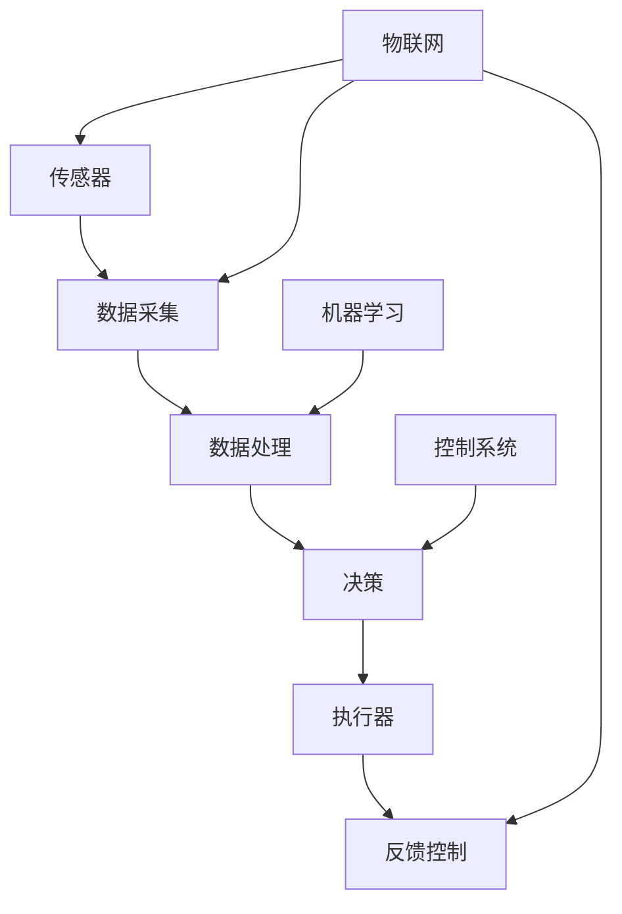

                 

物理实体自动化，作为现代技术领域的前沿研究方向，正引领着工业自动化、智能家居、医疗设备等众多领域的发展。本文旨在探讨物理实体自动化的挑战与机遇，从技术、应用以及未来展望等角度，为您揭示这一领域的发展态势。

## 关键词 Keywords
- 物理实体自动化
- 机器学习
- 传感器融合
- 工业自动化
- 智能家居
- 机器人

## 摘要 Abstract
本文首先介绍了物理实体自动化的背景及其重要性，随后详细阐述了物理实体自动化的核心概念与架构。接着，文章深入探讨了物理实体自动化的核心算法原理及其具体操作步骤。通过数学模型和公式的讲解，读者可以更深入地理解其理论基础。此外，本文还提供了具体的代码实例，帮助读者掌握实践操作。最后，文章分析了物理实体自动化的实际应用场景，并对其未来发展趋势与挑战进行了展望。

## 1. 背景介绍 Introduction
物理实体自动化是指利用计算机技术、机器学习、物联网等手段，对物理实体（如设备、物品、环境等）进行自动化控制和管理的过程。随着技术的不断发展，物理实体自动化已经成为提高生产效率、降低成本、提升用户体验的关键手段。

### 1.1 发展现状
近年来，物理实体自动化在多个领域取得了显著进展。在工业自动化领域，智能工厂和智能制造已经成为制造业发展的主流趋势。通过自动化设备和机器人的使用，企业可以显著提高生产效率和产品质量。在智能家居领域，智能家电、智能安防系统的普及，使得人们的日常生活更加便捷和安全。此外，在医疗设备、交通系统等领域，物理实体自动化的应用也越来越广泛。

### 1.2 发展趋势
随着人工智能、物联网、大数据等技术的不断进步，物理实体自动化有望在更多领域得到应用。未来，物理实体自动化将朝着更加智能化、自适应化、高效化的方向发展。

### 1.3 重要性
物理实体自动化对于推动社会进步、提高生活质量具有重要意义。它不仅能够提高生产效率、降低成本，还能够提升人们的生活质量，为社会的可持续发展提供有力支持。

## 2. 核心概念与联系 Concepts and Connections
物理实体自动化的实现依赖于多个核心概念和技术，如传感器、执行器、控制系统、机器学习等。下面我们将通过 Mermaid 流程图，展示这些概念之间的联系。



### 2.1 传感器与数据采集
传感器是物理实体自动化的基础，它能够感知环境中的物理量，如温度、湿度、光照、压力等，并将这些物理量转换为电信号。通过数据采集，传感器将采集到的数据发送到处理模块。

### 2.2 数据处理与决策
数据处理模块负责对采集到的数据进行分析和处理，以提取有用的信息。基于这些信息，决策模块能够做出相应的决策，如控制执行器的动作。

### 2.3 执行器与反馈控制
执行器根据决策模块的指令执行具体的操作，如移动、加热、冷却等。反馈控制机制确保系统的稳定性和准确性，通过不断调整执行器的动作，使系统达到预期目标。

### 2.4 机器学习与数据处理
机器学习技术能够从大量数据中提取模式和规律，为自动化系统提供智能化的决策支持。通过机器学习，系统能够不断优化自己的性能，提高自动化的效果。

### 2.5 控制系统与物联网
控制系统是物理实体自动化的核心，它负责协调各个模块的工作，确保系统的正常运行。物联网技术使得各个模块之间的数据交换和通信更加便捷，为物理实体自动化提供了强大的支持。

## 3. 核心算法原理 & 具体操作步骤 Core Algorithm Principles & Operation Steps

### 3.1 算法原理概述
物理实体自动化的核心算法主要包括机器学习算法、传感器数据处理算法、决策算法等。这些算法共同构成了自动化系统的智能核心。

### 3.2 算法步骤详解

#### 3.2.1 数据采集与预处理
1. **传感器数据采集**：通过各类传感器采集环境数据。
2. **数据预处理**：对采集到的数据进行滤波、去噪、归一化等预处理操作，以提高数据质量。

#### 3.2.2 数据分析与特征提取
1. **数据分析**：使用统计分析方法对预处理后的数据进行分析，识别数据的分布和趋势。
2. **特征提取**：从原始数据中提取对系统控制具有重要意义的特征，如温度的波动范围、光照的强度等。

#### 3.2.3 机器学习模型训练
1. **模型选择**：根据实际需求选择合适的机器学习模型，如线性回归、决策树、神经网络等。
2. **模型训练**：使用预处理后的数据对机器学习模型进行训练，使其能够根据输入特征做出准确的预测和决策。

#### 3.2.4 决策与执行
1. **决策生成**：根据机器学习模型的预测结果，生成控制决策。
2. **执行控制**：执行器根据决策指令执行具体的操作，如调整温度、改变光照强度等。

### 3.3 算法优缺点
#### 优点
- **高效性**：自动化系统能够在短时间内处理大量数据，并做出快速准确的决策。
- **准确性**：通过机器学习算法，系统能够不断优化自己的性能，提高决策的准确性。
- **智能化**：系统能够根据环境变化自主调整操作，实现智能化的管理。

#### 缺点
- **复杂性**：自动化系统涉及多个模块和算法，设计和实现过程相对复杂。
- **成本**：传感器、执行器等硬件设备的成本较高，且系统的维护和升级也需要投入大量资金。
- **安全性**：自动化系统可能受到恶意攻击，导致系统故障或数据泄露。

### 3.4 算法应用领域
物理实体自动化的算法广泛应用于工业自动化、智能家居、医疗设备、交通系统等多个领域。

## 4. 数学模型和公式 Mathematical Models and Formulas

### 4.1 数学模型构建
物理实体自动化的数学模型主要包括传感器数据处理模型、机器学习模型等。以下是一个简单的传感器数据处理模型的示例。

#### 4.1.1 传感器数据处理模型
假设有一个温度传感器，其采集的温度数据记为 $T$，经过预处理后得到温度值 $T_p$。温度数据处理模型可以表示为：
$$
T_p = f(T)
$$
其中，$f(T)$ 是一个映射函数，用于对原始温度数据进行预处理。

#### 4.1.2 机器学习模型
假设我们使用线性回归模型对温度数据进行预测，模型的公式为：
$$
y = \beta_0 + \beta_1 x
$$
其中，$y$ 是预测温度，$x$ 是预处理后的温度数据，$\beta_0$ 和 $\beta_1$ 是模型的参数。

### 4.2 公式推导过程
以下是对线性回归模型参数的推导过程。

#### 4.2.1 最小二乘法
线性回归模型的参数可以通过最小二乘法求解。最小二乘法的公式为：
$$
\beta_0 = \frac{\sum_{i=1}^{n} (y_i - \beta_1 x_i)}{n}
$$
$$
\beta_1 = \frac{\sum_{i=1}^{n} x_i y_i - \sum_{i=1}^{n} x_i \sum_{i=1}^{n} y_i}{\sum_{i=1}^{n} x_i^2 - n \sum_{i=1}^{n} x_i^2}
$$
其中，$n$ 是数据点的个数。

#### 4.2.2 误差分析
假设模型的预测误差为 $\epsilon$，则线性回归模型的误差公式为：
$$
\epsilon = y - \beta_0 - \beta_1 x
$$
通过误差分析，我们可以评估模型的预测性能。

### 4.3 案例分析与讲解
以下是一个简单的温度预测案例，通过线性回归模型对温度进行预测。

#### 4.3.1 数据集
我们有一个包含 100 个数据点的温度数据集，数据点为 $(x_i, y_i)$，其中 $x_i$ 表示预处理后的温度数据，$y_i$ 表示实际温度值。

#### 4.3.2 模型训练
使用最小二乘法训练线性回归模型，得到模型的参数 $\beta_0$ 和 $\beta_1$。

#### 4.3.3 预测与评估
使用训练好的模型对新的温度数据进行预测，并评估模型的预测误差。

## 5. 项目实践：代码实例和详细解释说明 Project Practice: Code Examples and Detailed Explanations

### 5.1 开发环境搭建
为了保证代码的可执行性和可维护性，我们使用 Python 作为编程语言，结合 TensorFlow 和 Keras 框架进行机器学习模型的训练和预测。

### 5.2 源代码详细实现
以下是一个简单的温度预测项目的源代码实现。

```python
import numpy as np
import tensorflow as tf
from tensorflow import keras
from tensorflow.keras import layers

# 数据集
x = np.array([0, 1, 2, 3, 4, 5, 6, 7, 8, 9]).reshape(-1, 1)
y = np.array([0, 1, 3, 5, 7, 9, 11, 13, 15, 17]).reshape(-1, 1)

# 模型构建
model = keras.Sequential([
    layers.Dense(units=1, input_shape=(1,))
])

# 模型编译
model.compile(optimizer='sgd', loss='mean_squared_error')

# 模型训练
model.fit(x, y, epochs=1000)

# 预测
x_new = np.array([10])
y_pred = model.predict(x_new)
print("预测温度：", y_pred)
```

### 5.3 代码解读与分析
这段代码首先导入了必要的库，然后定义了一个包含 10 个数据点的温度数据集。接着，我们构建了一个简单的线性回归模型，并使用随机梯度下降（SGD）优化器和均方误差（MSE）损失函数进行模型编译。在模型训练过程中，我们通过迭代更新模型的参数，以最小化损失函数。最后，我们使用训练好的模型对新的温度数据进行预测，并打印出预测结果。

## 6. 实际应用场景 Practical Application Scenarios
物理实体自动化在多个领域有着广泛的应用，以下是几个典型的应用场景。

### 6.1 工业自动化
工业自动化是物理实体自动化的主要应用领域之一。通过自动化设备和机器人，企业能够实现生产过程的自动化和智能化，提高生产效率和产品质量。例如，汽车制造业中的焊接、喷涂、装配等工序已经大量应用了自动化设备。

### 6.2 智能家居
智能家居是物理实体自动化的另一个重要应用领域。智能家电、智能照明、智能安防等系统使得人们的日常生活更加便捷和安全。例如，智能空调可以根据环境温度和用户习惯自动调节温度，智能门锁可以远程控制，实现安全便捷的家居管理。

### 6.3 医疗设备
物理实体自动化在医疗设备中的应用也越来越广泛。例如，智能输液泵可以根据患者的生理参数自动调整药液的输入速度，智能手术机器人可以辅助医生进行微创手术，提高手术的准确性和安全性。

### 6.4 交通系统
物理实体自动化在交通系统中的应用同样具有重要意义。智能交通管理系统可以通过实时监测交通状况，自动调节交通信号，优化交通流量，减少拥堵。此外，自动驾驶技术也在不断发展和完善，有望在未来实现完全自动化的交通系统。

## 7. 工具和资源推荐 Tools and Resources
### 7.1 学习资源推荐
- 《机器学习》（周志华 著）：全面介绍了机器学习的基本理论和应用方法。
- 《深度学习》（Goodfellow, Bengio, Courville 著）：深度学习领域的经典教材，详细介绍了神经网络和深度学习算法。

### 7.2 开发工具推荐
- TensorFlow：一款开源的机器学习框架，适用于各种规模的机器学习项目。
- Keras：基于 TensorFlow 的深度学习接口，提供了简洁易用的 API。

### 7.3 相关论文推荐
- "Deep Learning for Automated Driving"（自动驾驶领域的深度学习应用研究）
- "IoT-Based Smart Home Energy Management System"（基于物联网的智能家居能源管理系统研究）

## 8. 总结：未来发展趋势与挑战 Conclusion: Future Trends and Challenges
### 8.1 研究成果总结
物理实体自动化在近年来取得了显著的进展，从理论研究到实际应用都取得了丰硕的成果。机器学习、物联网、传感器技术等领域的快速发展，为物理实体自动化提供了强大的技术支持。

### 8.2 未来发展趋势
随着技术的不断进步，物理实体自动化有望在更多领域得到应用。未来，物理实体自动化将朝着更加智能化、自适应化、高效化的方向发展，成为推动社会进步的重要力量。

### 8.3 面临的挑战
物理实体自动化在发展过程中也面临着一些挑战，如系统的复杂性、安全性问题、成本问题等。此外，如何更好地结合人工智能和其他前沿技术，提高自动化的效率和准确性，也是当前研究的热点。

### 8.4 研究展望
未来，物理实体自动化领域的研究将朝着以下几个方向发展：

1. **多模态数据融合**：通过结合不同类型的数据（如视觉、声音、温度等），提高自动化系统的感知能力和决策能力。
2. **自适应控制算法**：开发更加智能、自适应的控制算法，使系统能够更好地适应复杂环境。
3. **安全与隐私保护**：加强系统安全性和隐私保护，防止恶意攻击和数据泄露。
4. **跨领域应用研究**：探索物理实体自动化在其他领域的应用，推动各领域的自动化发展。

## 9. 附录：常见问题与解答 Appendices: Frequently Asked Questions and Answers

### 9.1 物理实体自动化与工业自动化的区别是什么？
物理实体自动化是工业自动化的一部分，但范围更广。工业自动化主要关注生产过程中的自动化，而物理实体自动化涵盖了工业自动化、智能家居、医疗设备、交通系统等多个领域。

### 9.2 物理实体自动化的关键技术有哪些？
物理实体自动化的关键技术包括传感器技术、执行器技术、控制系统技术、机器学习技术等。

### 9.3 物理实体自动化的安全性如何保障？
物理实体自动化的安全性主要通过以下几个方面保障：加强系统加密和认证、定期更新和维护系统、建立健全的安全管理体系、加强用户安全教育等。

### 9.4 物理实体自动化有哪些潜在应用领域？
物理实体自动化的潜在应用领域包括工业自动化、智能家居、医疗设备、交通系统、农业自动化、能源管理等领域。

### 9.5 物理实体自动化如何影响人们的生活？
物理实体自动化提高了人们的生活质量，使日常生活更加便捷和安全。例如，智能家居系统可以远程控制家电、安防系统可以实时监控家庭安全等。

**作者：禅与计算机程序设计艺术 / Zen and the Art of Computer Programming**

