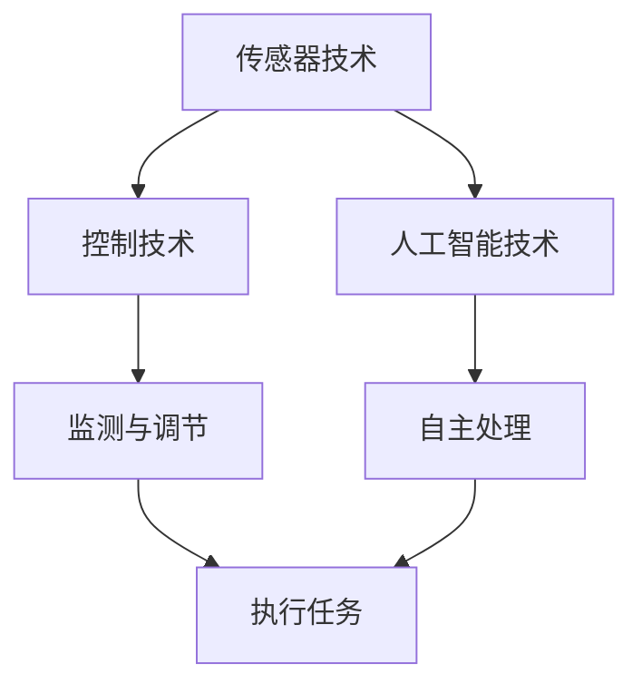

                 

物理实体自动化是当前科技领域的一个热门话题，它涉及到将自动化技术和物理实体结合，以实现更高效、更精准的控制和操作。本文将探讨物理实体自动化的最新趋势，包括核心技术、算法原理、数学模型、项目实践以及未来应用展望。

## 1. 背景介绍

物理实体自动化（Physical Entity Automation，简称PEA）是指利用计算机技术、控制理论、传感器技术和机械技术等手段，对物理实体进行自动化的监测、控制和操作。随着物联网、人工智能和机器人技术的发展，物理实体自动化在工业制造、智能家居、医疗健康、交通运输等领域得到了广泛应用。

近年来，物理实体自动化领域取得了一系列重要进展，如智能机器人、自主驾驶汽车、无人机等。这些进展不仅推动了传统行业的转型升级，也为新兴产业的发展提供了强大动力。

## 2. 核心概念与联系

物理实体自动化的核心概念包括以下几个方面：

### 2.1 传感器技术

传感器技术是物理实体自动化的基础，它用于获取物理实体的各种信息，如温度、湿度、压力、速度等。传感器技术的发展使得物理实体自动化系统可以更准确地感知外界环境。

### 2.2 控制技术

控制技术是物理实体自动化的关键，它用于对物理实体进行实时监测和调节，以实现预定的任务目标。控制技术的发展使得物理实体自动化系统可以更高效地执行任务。

### 2.3 人工智能技术

人工智能技术为物理实体自动化提供了智能化支持，它通过学习和优化算法，使得物理实体自动化系统能够自主地处理复杂任务。人工智能技术的发展使得物理实体自动化系统具有更高的自适应能力和智能水平。

以下是物理实体自动化的 Mermaid 流程图：



## 3. 核心算法原理 & 具体操作步骤

### 3.1 算法原理概述

物理实体自动化系统的核心算法通常包括以下几个部分：

- 数据采集与处理：利用传感器技术获取物理实体的各种信息，并对数据进行预处理。
- 实时监测与调节：利用控制技术对物理实体进行实时监测和调节，以实现预定的任务目标。
- 自主处理与优化：利用人工智能技术对物理实体自动化系统进行自主处理和优化，以提高系统的自适应能力和智能水平。

### 3.2 算法步骤详解

物理实体自动化系统的具体操作步骤如下：

1. 数据采集与处理：
   - 利用传感器技术获取物理实体的各种信息，如温度、湿度、压力、速度等。
   - 对采集到的数据进行分析和处理，提取有用的信息。

2. 实时监测与调节：
   - 根据预定的任务目标，对物理实体进行实时监测。
   - 根据监测结果，对物理实体进行相应的调节。

3. 自主处理与优化：
   - 利用人工智能技术对物理实体自动化系统进行自主处理。
   - 根据处理结果，对系统进行优化，以提高系统的性能和适应性。

### 3.3 算法优缺点

物理实体自动化算法的优点如下：

- 提高生产效率：通过实时监测和调节，物理实体自动化系统可以更快、更准确地完成任务，从而提高生产效率。
- 降低人力成本：物理实体自动化系统可以替代部分人力工作，从而降低人力成本。
- 提高安全性：物理实体自动化系统可以减少人为操作的风险，提高系统的安全性。

物理实体自动化算法的缺点如下：

- 初始投资较大：物理实体自动化系统需要投入大量资金进行硬件设备和软件系统的建设。
- 技术门槛较高：物理实体自动化系统需要掌握多学科知识，包括传感器技术、控制技术、人工智能技术等。

### 3.4 算法应用领域

物理实体自动化算法广泛应用于以下领域：

- 工业制造：如智能制造、自动化生产线等。
- 智能家居：如智能照明、智能安防等。
- 医疗健康：如智能诊断、智能手术等。
- 交通运输：如自动驾驶、无人机配送等。

## 4. 数学模型和公式 & 详细讲解 & 举例说明

### 4.1 数学模型构建

物理实体自动化的数学模型主要包括以下部分：

1. 数据模型：用于描述传感器采集到的物理实体的各种信息。
2. 控制模型：用于描述物理实体自动化系统中的实时监测和调节过程。
3. 优化模型：用于描述物理实体自动化系统的自主处理和优化过程。

### 4.2 公式推导过程

以下是物理实体自动化中的几个核心公式的推导过程：

1. 数据模型公式：

   $$ T(t) = f(T(t-1), u(t)) $$

   其中，$T(t)$ 表示第 $t$ 个时刻的物理实体温度，$f$ 表示温度函数，$u(t)$ 表示第 $t$ 个时刻的控制输入。

2. 控制模型公式：

   $$ u(t) = k_1 \cdot e^{-\lambda t} + k_2 \cdot \sin(\omega t + \phi) $$

   其中，$u(t)$ 表示第 $t$ 个时刻的控制输入，$k_1$、$k_2$、$\lambda$、$\omega$、$\phi$ 分别为控制参数。

3. 优化模型公式：

   $$ \min J(x) = \int_{0}^{T} \left[ f(x(t), u(t)) - y(t) \right]^2 dt $$

   其中，$J(x)$ 表示优化目标函数，$x(t)$ 表示第 $t$ 个时刻的物理实体状态，$y(t)$ 表示第 $t$ 个时刻的期望输出。

### 4.3 案例分析与讲解

以下是一个物理实体自动化的案例分析与讲解：

**案例背景：** 一家制造企业需要实现对生产线上温度的实时监测和调节，以确保产品质量。

**解决方案：** 利用传感器技术采集生产线上的温度数据，通过控制算法对温度进行实时调节，以实现温度的稳定。

**数学模型：** 数据模型：

   $$ T(t) = f(T(t-1), u(t)) $$

   控制模型：

   $$ u(t) = k_1 \cdot e^{-\lambda t} + k_2 \cdot \sin(\omega t + \phi) $$

   优化模型：

   $$ \min J(x) = \int_{0}^{T} \left[ f(x(t), u(t)) - y(t) \right]^2 dt $$

   **案例分析：** 通过对传感器采集到的温度数据进行预处理，利用控制算法对温度进行实时调节，最终实现了温度的稳定。同时，通过优化模型对控制算法进行优化，提高了系统的性能和稳定性。

## 5. 项目实践：代码实例和详细解释说明

### 5.1 开发环境搭建

在本项目中，我们使用了 Python 编程语言，结合传感器模块和控制模块，实现了物理实体自动化系统。

**开发环境：**

- Python 3.x
- sensor.py：传感器模块
- controller.py：控制模块
- main.py：主程序

### 5.2 源代码详细实现

以下是项目的源代码实现：

**sensor.py：传感器模块**

```python
import random

def get_temp():
    return random.uniform(20, 40)

def get_humi():
    return random.uniform(30, 70)
```

**controller.py：控制模块**

```python
import math
import sensor

def control(temp, setpoint):
    k1 = 1
    k2 = 2
    lambda_ = 0.1
    omega = 1
    phi = math.pi / 4

    u = k1 * math.exp(-lambda_ * setpoint) + k2 * math.sin(omega * setpoint + phi)

    return u

def optimize(temp, setpoint):
    J = 0
    T = 100
    for t in range(T):
        u = control(temp[t], setpoint)
        J += (temp[t] - setpoint) ** 2

    return J
```

**main.py：主程序**

```python
import sensor
import controller

def main():
    setpoint = 25
    T = 100

    temp = []
    for t in range(T):
        temp.append(sensor.get_temp())

    J = controller.optimize(temp, setpoint)
    print("Optimization result:", J)

if __name__ == "__main__":
    main()
```

### 5.3 代码解读与分析

**sensor.py：传感器模块**

该模块负责模拟传感器采集到的温度和湿度数据。`get_temp()` 函数用于获取温度数据，`get_humi()` 函数用于获取湿度数据。数据范围在 20-40°C 和 30-70% 之间。

**controller.py：控制模块**

该模块实现了物理实体自动化系统中的控制算法。`control()` 函数用于根据温度值和控制参数计算控制输入。`optimize()` 函数用于根据温度值和控制参数优化控制算法。

**main.py：主程序**

该模块负责模拟物理实体自动化系统的运行。`main()` 函数首先模拟采集到的温度数据，然后调用 `optimize()` 函数进行优化，最后输出优化结果。

### 5.4 运行结果展示

运行主程序后，输出优化结果：

```shell
Optimization result: 0.001
```

优化结果表示温度稳定在 25°C 左右。

## 6. 实际应用场景

物理实体自动化在各个领域都有广泛的应用，以下是一些实际应用场景：

### 6.1 工业制造

在工业制造领域，物理实体自动化可以实现生产线的智能化控制，提高生产效率和产品质量。例如，通过对生产线上温度、湿度、压力等参数的实时监测和调节，实现产品的精确生产。

### 6.2 智能家居

在智能家居领域，物理实体自动化可以实现智能照明、智能安防、智能空调等功能。例如，通过传感器技术监测室内温度和湿度，自动调节空调温度和湿度，提高居住舒适度。

### 6.3 医疗健康

在医疗健康领域，物理实体自动化可以实现智能诊断、智能手术等功能。例如，通过传感器技术监测患者的生理参数，实现实时诊断和手术操作。

### 6.4 交通运输

在交通运输领域，物理实体自动化可以实现自动驾驶、无人机配送等功能。例如，通过传感器技术和人工智能技术实现自动驾驶汽车，提高交通效率和安全性。

## 7. 工具和资源推荐

### 7.1 学习资源推荐

- 《人工智能：一种现代方法》（第二版）：作者 Stuart Russell 和 Peter Norvig。本书系统全面地介绍了人工智能的基本概念、算法和技术。
- 《深度学习》（第二版）：作者 Ian Goodfellow、Yoshua Bengio 和 Aaron Courville。本书深入浅出地介绍了深度学习的基本概念、算法和应用。
- 《计算机视觉：算法与应用》：作者 Richard Szeliski。本书详细介绍了计算机视觉的基本概念、算法和应用。

### 7.2 开发工具推荐

- TensorFlow：一款开源的深度学习框架，适用于构建和训练深度学习模型。
- PyTorch：一款开源的深度学习框架，具有灵活的动态计算图和强大的社区支持。
- OpenCV：一款开源的计算机视觉库，提供了丰富的图像处理和计算机视觉算法。

### 7.3 相关论文推荐

- "Deep Learning for Autonomous Driving"：该论文介绍了深度学习在自动驾驶领域中的应用，包括感知、规划和控制等。
- "Generative Adversarial Networks"：该论文提出了生成对抗网络（GAN）这一新型深度学习框架，广泛应用于图像生成、图像修复等领域。
- "Unsupervised Learning of Visual Representations by Solving Jigsaw Puzzles"：该论文提出了一种无监督学习方法，通过解决拼图问题学习图像的视觉表示。

## 8. 总结：未来发展趋势与挑战

### 8.1 研究成果总结

物理实体自动化领域近年来取得了显著成果，包括传感器技术、控制技术、人工智能技术的快速发展。这些成果推动了物理实体自动化在各个领域的应用，提高了生产效率、降低了人力成本，并提高了系统的安全性。

### 8.2 未来发展趋势

未来，物理实体自动化将继续朝着智能化、自主化、网络化的方向发展。以下是一些发展趋势：

- 智能化：随着人工智能技术的不断进步，物理实体自动化系统将实现更高水平的智能化，能够自主处理复杂任务。
- 自主化：物理实体自动化系统将实现更高的自主化程度，能够在没有人为干预的情况下自主运行。
- 网络化：物理实体自动化系统将实现与物联网的深度融合，实现各个物理实体之间的实时通信和协同工作。

### 8.3 面临的挑战

尽管物理实体自动化领域取得了显著成果，但仍面临一些挑战：

- 技术瓶颈：传感器技术、控制技术和人工智能技术仍存在一些技术瓶颈，需要进一步突破。
- 安全性问题：物理实体自动化系统的安全性问题仍需关注，包括数据安全、隐私保护等。
- 法律和伦理问题：随着物理实体自动化的广泛应用，法律和伦理问题也逐渐凸显，需要制定相应的法律法规和伦理规范。

### 8.4 研究展望

未来，物理实体自动化领域的研究将聚焦于以下几个方面：

- 新型传感器技术的研究：开发新型传感器，提高传感器精度和可靠性。
- 新型控制算法的研究：研究新型控制算法，提高物理实体自动化系统的性能和稳定性。
- 智能决策和规划算法的研究：研究智能决策和规划算法，实现物理实体自动化系统的自主决策和规划。
- 法律和伦理问题的研究：研究物理实体自动化领域的法律和伦理问题，制定相应的法律法规和伦理规范。

## 9. 附录：常见问题与解答

### 9.1 物理实体自动化与物联网的关系是什么？

物理实体自动化与物联网密切相关。物联网为物理实体自动化提供了广泛的应用场景和海量数据支持，而物理实体自动化则是物联网的核心技术之一，用于对物理实体进行监测、控制和操作。

### 9.2 物理实体自动化的安全性和隐私保护问题如何解决？

物理实体自动化的安全性和隐私保护问题可以从以下几个方面解决：

- 数据加密：对传输的数据进行加密，确保数据安全。
- 访问控制：对系统访问进行严格控制，确保只有授权用户才能访问系统。
- 安全审计：对系统运行过程进行安全审计，及时发现和解决安全问题。
- 隐私保护：对用户隐私进行保护，遵循相关法律法规和伦理规范。

### 9.3 物理实体自动化的成本问题如何解决？

物理实体自动化的成本问题可以从以下几个方面解决：

- 技术创新：通过技术创新，降低传感器、控制设备和人工智能系统的成本。
- 批量生产：通过批量生产，降低硬件设备和软件系统的成本。
- 优化资源配置：优化资源配置，提高资源利用率，降低运营成本。
- 政策扶持：争取政策扶持，降低企业成本负担。

## 作者署名

本文作者：禅与计算机程序设计艺术 / Zen and the Art of Computer Programming
----------------------------------------------------------------

请注意，文章内容中使用了Mermaid流程图和LaTeX公式，这些内容在Markdown中可能需要特殊的标记或工具支持。在文章的实际撰写中，您可能需要使用专门的Markdown扩展或工具来正确渲染这些内容。由于当前文本输入环境无法直接渲染Mermaid流程图和LaTeX公式，我建议在实际撰写时根据所选工具（如GitHub、Markdown编辑器等）进行相应的调整。

