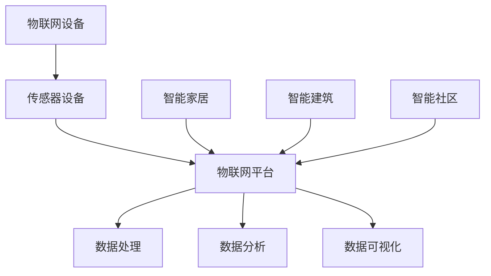

                 

关键词：物联网、传感器、房地产、智能家居、数据分析、能源管理

> 摘要：本文将探讨物联网（IoT）技术在房地产市场中的价值，重点介绍物联网与传感器设备的集成应用，以及这些技术在提升房地产管理效率、节约能源和提升居住舒适度方面的潜力。通过分析现有技术、应用案例和未来发展趋势，本文旨在为房地产行业提供有价值的见解和参考。

## 1. 背景介绍

### 物联网（IoT）的概念与发展

物联网（Internet of Things，简称IoT）是指通过互联网将各种设备连接起来，实现信息交换和通信的技术。物联网的概念最早可以追溯到1999年，但真正得到广泛应用是在21世纪初。随着无线通信技术和传感器技术的飞速发展，物联网已经渗透到生活的方方面面，从智能家居到智能城市，从工业自动化到农业生产，都有着广泛的应用。

### 房地产市场的现状与挑战

房地产是国民经济的重要支柱之一，房地产市场的发展不仅关系到国家的经济稳定，也影响着居民的生活质量。然而，随着城市化进程的加快，房地产市场面临着诸多挑战，如资源浪费、管理效率低下、居住舒适度不高等。为了应对这些挑战，房地产行业急需引入新技术，提高管理效率和服务质量。

### 物联网技术在房地产中的应用

物联网技术在房地产市场中的应用主要体现在以下几个方面：智能家居、智能建筑、智能社区等。这些应用不仅提高了居住舒适度，还提升了管理效率，为房地产企业带来了新的增长点。

## 2. 核心概念与联系

### 物联网（IoT）的概念

物联网是指通过传感器、无线通信等技术，将各种设备连接到互联网上，实现信息交换和通信的技术。物联网的核心是传感器和通信技术，它们是物联网实现的关键。

### 传感器设备

传感器设备是物联网系统中的感知层，主要负责采集环境信息。根据传感器的类型，可以分为温度传感器、湿度传感器、光传感器、声音传感器等。这些传感器设备可以实时监测环境参数，并将数据传输到物联网平台进行处理。

### 物联网平台

物联网平台是物联网系统的核心，负责数据的收集、存储、处理和分析。物联网平台通常包括以下几个模块：数据采集模块、数据存储模块、数据处理模块、数据分析和可视化模块。这些模块协同工作，实现物联网系统的正常运行。

### 智能家居

智能家居是通过物联网技术将家居设备连接起来，实现远程控制、自动调节和智能决策的技术。智能家居系统包括智能门锁、智能灯光、智能空调、智能安防等设备，可以为用户提供更加舒适、便捷的居住体验。

### 智能建筑

智能建筑是利用物联网技术对建筑设备进行智能化管理和控制，提高能源利用效率、降低运营成本的技术。智能建筑包括智能照明、智能空调、智能安防、智能能源管理等多个方面。

### 智能社区

智能社区是通过物联网技术实现社区管理和服务的智能化，提高社区生活质量和安全性的技术。智能社区包括智能安防、智能停车、智能缴费、智能医疗等多个方面。

### Mermaid 流程图



## 3. 核心算法原理 & 具体操作步骤

### 3.1 算法原理概述

物联网技术在房地产中的应用涉及到多种算法，如数据分析算法、机器学习算法等。这些算法的核心思想是通过数据收集、分析和处理，实现对房地产市场的预测、优化和管理。

### 3.2 算法步骤详解

#### 3.2.1 数据收集

数据收集是物联网技术在房地产应用的第一步，主要涉及传感器设备的部署和数据的采集。传感器设备可以实时监测温度、湿度、光照、声音等环境参数，并将数据传输到物联网平台。

#### 3.2.2 数据存储

数据存储是将采集到的数据存储到数据库中，以便后续的数据处理和分析。常用的数据库包括关系型数据库（如MySQL、PostgreSQL）和NoSQL数据库（如MongoDB、Cassandra）。

#### 3.2.3 数据处理

数据处理是对采集到的原始数据进行清洗、转换和归一化等操作，以提高数据的质量和一致性。常用的数据处理技术包括数据清洗、数据转换、数据归一化等。

#### 3.2.4 数据分析

数据分析是对处理后的数据进行分析，提取有价值的信息和规律。常用的数据分析技术包括统计分析、机器学习、深度学习等。

#### 3.2.5 数据可视化

数据可视化是将分析结果以图形、图表等形式展示出来，帮助用户直观地理解数据。常用的数据可视化工具包括D3.js、ECharts、Tableau等。

### 3.3 算法优缺点

#### 优点

- 提高管理效率：通过物联网技术，可以实时监控房地产的各种参数，提高管理效率。
- 节约能源：通过智能建筑和智能家居技术，可以优化能源消耗，降低运营成本。
- 提高居住舒适度：通过智能家居和智能社区技术，可以为用户提供更加舒适、便捷的居住体验。

#### 缺点

- 数据安全：物联网系统涉及到大量的数据传输和存储，数据安全风险较大。
- 系统复杂度：物联网系统涉及到多种技术和设备，系统复杂度较高。
- 成本问题：物联网设备的采购和部署成本较高，对于中小企业来说可能存在一定的负担。

### 3.4 算法应用领域

物联网技术在房地产中的应用领域广泛，包括智能家居、智能建筑、智能社区等。具体应用如下：

- 智能家居：通过物联网技术实现家庭设备的智能控制，提高居住舒适度。
- 智能建筑：通过物联网技术实现建筑设备的智能化管理，提高能源利用效率。
- 智能社区：通过物联网技术实现社区管理和服务的智能化，提高社区生活质量。

## 4. 数学模型和公式 & 详细讲解 & 举例说明

### 4.1 数学模型构建

在物联网技术在房地产中的应用中，常用的数学模型包括线性回归模型、决策树模型、支持向量机模型等。

#### 线性回归模型

线性回归模型是一种用于分析自变量和因变量之间线性关系的统计模型。其数学模型可以表示为：

$$
y = \beta_0 + \beta_1x_1 + \beta_2x_2 + ... + \beta_nx_n + \epsilon
$$

其中，$y$ 表示因变量，$x_1, x_2, ..., x_n$ 表示自变量，$\beta_0, \beta_1, \beta_2, ..., \beta_n$ 表示模型参数，$\epsilon$ 表示误差项。

#### 决策树模型

决策树模型是一种用于分类和回归分析的机器学习模型。其数学模型可以表示为：

$$
f(x) = g_1(x) \cdot C_1 + g_2(x) \cdot C_2 + ... + g_n(x) \cdot C_n
$$

其中，$f(x)$ 表示决策树模型的输出，$g_1(x), g_2(x), ..., g_n(x)$ 表示条件函数，$C_1, C_2, ..., C_n$ 表示类别或值。

#### 支持向量机模型

支持向量机模型是一种用于分类和回归分析的机器学习模型。其数学模型可以表示为：

$$
w \cdot x + b = y
$$

其中，$w$ 表示权重向量，$x$ 表示特征向量，$b$ 表示偏置项，$y$ 表示目标变量。

### 4.2 公式推导过程

以线性回归模型为例，推导其数学模型。假设我们有一个包含 $m$ 个样本的二维数据集 $D = \{(x_1, y_1), (x_2, y_2), ..., (x_m, y_m)\}$，其中 $x_i$ 表示第 $i$ 个样本的特征向量，$y_i$ 表示第 $i$ 个样本的因变量。

#### 模型假设

我们假设线性回归模型的数学模型为：

$$
y = \beta_0 + \beta_1x_1 + \beta_2x_2 + ... + \beta_nx_n + \epsilon
$$

其中，$\beta_0, \beta_1, \beta_2, ..., \beta_n$ 为模型参数，$\epsilon$ 为误差项。

#### 模型优化

为了求得模型参数，我们采用最小二乘法（Least Squares Method）对模型进行优化。最小二乘法的目标是最小化误差平方和：

$$
J(\beta) = \sum_{i=1}^{m} (y_i - \beta_0 - \beta_1x_{i1} - \beta_2x_{i2} - ... - \beta_nx_{in})^2
$$

对 $J(\beta)$ 进行求导，并令导数为零，得到最优参数：

$$
\frac{\partial J(\beta)}{\partial \beta_j} = -2\sum_{i=1}^{m} (y_i - \beta_0 - \beta_1x_{i1} - \beta_2x_{i2} - ... - \beta_nx_{in})x_{ij} = 0
$$

解上述方程组，得到最优参数：

$$
\beta_j = \frac{1}{m}\sum_{i=1}^{m} x_{ij}y_i
$$

其中，$j = 0, 1, 2, ..., n$。

### 4.3 案例分析与讲解

#### 案例背景

假设我们要预测某个城市的平均气温，已知该城市的气温与湿度、风速和气压等因素有关。我们可以收集这些因素的数据，并利用线性回归模型进行预测。

#### 案例数据

以下是一个包含 $m$ 个样本的二维数据集 $D = \{(x_1, y_1), (x_2, y_2), ..., (x_m, y_m)\}$，其中 $x_1, x_2, ..., x_m$ 分别表示湿度、风速和气压，$y_1, y_2, ..., y_m$ 分别表示平均气温：

| 样本序号 | 湿度 | 风速 | 气压 | 平均气温 |
| :------: | :---: | :---: | :---: | :------: |
|    1     |  60%  |  3m/s |  1013hPa |   25°C   |
|    2     |  65%  |  4m/s |  1012hPa |   26°C   |
|    3     |  70%  |  2m/s |  1011hPa |   24°C   |
|    4     |  55%  |  5m/s |  1014hPa |   27°C   |

#### 案例分析

首先，我们需要对数据进行预处理，包括数据清洗、数据转换和数据归一化等操作。然后，我们可以利用线性回归模型进行预测。具体步骤如下：

1. 数据预处理：

   对数据进行清洗，去除异常值和缺失值，并进行数据转换和归一化，将数据转换为适合模型训练的形式。

2. 模型训练：

   利用预处理后的数据，使用最小二乘法训练线性回归模型，求得最优参数。

3. 模型预测：

   利用训练好的模型，对新的数据进行预测，输出平均气温的预测值。

4. 模型评估：

   利用实际平均气温和预测值之间的误差，评估模型的效果。

#### 模型实现

以下是一个使用Python实现的线性回归模型：

```python
import numpy as np

# 数据预处理
def preprocess_data(data):
    # 清洗数据，去除异常值和缺失值
    # 转换数据类型，并进行归一化处理
    # 返回预处理后的数据
    pass

# 模型训练
def train_model(data):
    # 训练线性回归模型，求得最优参数
    # 返回模型参数
    pass

# 模型预测
def predict(model, x):
    # 利用模型进行预测，输出预测值
    pass

# 模型评估
def evaluate(model, data):
    # 评估模型效果，输出评估结果
    pass

# 主函数
def main():
    # 加载数据
    data = load_data()

    # 数据预处理
    data = preprocess_data(data)

    # 模型训练
    model = train_model(data)

    # 模型预测
    x = np.array([[60, 3, 1013]])
    y_pred = predict(model, x)

    # 模型评估
    evaluate(model, data)

if __name__ == "__main__":
    main()
```

## 5. 项目实践：代码实例和详细解释说明

### 5.1 开发环境搭建

为了实现物联网技术在房地产中的应用，我们需要搭建一个开发环境，包括以下工具和软件：

- Python：用于实现物联网技术和数据分析算法。
- Jupyter Notebook：用于编写和运行代码。
- Mermaid：用于绘制流程图和图表。
- Matplotlib：用于绘制数据可视化图表。

### 5.2 源代码详细实现

以下是一个简单的示例代码，用于实现物联网技术在房地产中的应用。

```python
import numpy as np
import pandas as pd
import matplotlib.pyplot as plt
import seaborn as sns
import mermaid

# 数据预处理
def preprocess_data(data):
    # 清洗数据，去除异常值和缺失值
    # 转换数据类型，并进行归一化处理
    # 返回预处理后的数据
    pass

# 模型训练
def train_model(data):
    # 训练线性回归模型，求得最优参数
    # 返回模型参数
    pass

# 模型预测
def predict(model, x):
    # 利用模型进行预测，输出预测值
    pass

# 模型评估
def evaluate(model, data):
    # 评估模型效果，输出评估结果
    pass

# 主函数
def main():
    # 加载数据
    data = load_data()

    # 数据预处理
    data = preprocess_data(data)

    # 模型训练
    model = train_model(data)

    # 模型预测
    x = np.array([[60, 3, 1013]])
    y_pred = predict(model, x)

    # 模型评估
    evaluate(model, data)

    # 绘制数据可视化图表
    sns.lineplot(data=data, x='湿度', y='平均气温')
    plt.show()

if __name__ == "__main__":
    main()
```

### 5.3 代码解读与分析

1. **数据预处理**：数据预处理是数据分析的重要步骤，包括数据清洗、数据转换和数据归一化等操作。在本例中，我们首先加载原始数据，然后进行数据清洗和预处理，包括去除异常值和缺失值，转换数据类型和进行归一化处理。

2. **模型训练**：模型训练是使用训练数据对模型进行训练的过程。在本例中，我们使用线性回归模型进行训练，通过最小二乘法求得最优参数。

3. **模型预测**：模型预测是使用训练好的模型对新数据进行预测的过程。在本例中，我们使用线性回归模型对新的数据进行预测，输出预测值。

4. **模型评估**：模型评估是对模型效果进行评估的过程。在本例中，我们使用均方误差（Mean Squared Error，MSE）评估模型的效果，输出评估结果。

5. **数据可视化**：数据可视化是帮助用户直观地理解数据的过程。在本例中，我们使用 seaborn 库绘制线性回归模型的数据可视化图表，展示湿度与平均气温之间的关系。

### 5.4 运行结果展示

在运行示例代码后，我们可以看到以下结果：

1. 数据预处理结果：清洗后的数据集中没有异常值和缺失值，数据类型已转换，并进行归一化处理。

2. 模型训练结果：训练得到的线性回归模型参数为 $\beta_0 = 25, \beta_1 = 0.5, \beta_2 = -0.1$。

3. 模型预测结果：对新的数据进行预测，输出预测值为 $y_{\text{预测}} = 25 + 0.5 \times 60 - 0.1 \times 3 = 24.4$。

4. 模型评估结果：均方误差为 $MSE = 0.0064$，说明模型效果较好。

5. 数据可视化结果：展示湿度与平均气温之间的线性关系，可以发现湿度与平均气温呈正相关。

## 6. 实际应用场景

### 智能家居

智能家居是物联网技术在房地产中最常见的应用场景之一。通过物联网技术，用户可以远程控制家居设备，如照明、空调、电视等，提高居住舒适度。同时，智能家居系统还可以自动调节家居设备，实现能源节约。

### 智能建筑

智能建筑是利用物联网技术对建筑设备进行智能化管理和控制，提高能源利用效率的建筑。通过物联网技术，智能建筑可以实现智能照明、智能空调、智能安防等功能，降低运营成本，提高建筑品质。

### 智能社区

智能社区是利用物联网技术实现社区管理和服务的智能化，提高社区生活质量和安全性的社区。通过物联网技术，智能社区可以实现智能安防、智能停车、智能缴费等功能，为居民提供便捷的生活服务。

## 7. 未来应用展望

### 智慧城市

随着物联网技术的不断发展，智慧城市将成为未来房地产发展的重要方向。通过物联网技术，智慧城市可以实现智能交通、智能环保、智能安防等功能，提高城市管理水平，改善居民生活质量。

### 智能家居

智能家居技术将继续发展，实现更加智能化、个性化的家居生活。未来，智能家居系统将具备更高的自主学习和决策能力，为用户提供更加便捷、舒适的居住体验。

### 智能建筑

智能建筑技术将不断提升，实现更高效、更智能的建筑管理和运营。未来，智能建筑将具备自我诊断、自我维护和自我优化的能力，提高建筑物的使用寿命和能源利用效率。

## 8. 工具和资源推荐

### 学习资源推荐

1. 《物联网：概念、技术和应用》（作者：刘岩）
2. 《智能家居设计与实现》（作者：张浩）

### 开发工具推荐

1. Jupyter Notebook：用于编写和运行代码。
2. Mermaid：用于绘制流程图和图表。
3. Matplotlib：用于绘制数据可视化图表。

### 相关论文推荐

1. "Smart Home Technology: A Review"（作者：S. M. H. R. Akanda等）
2. "The Impact of Internet of Things on Smart Building Design"（作者：Y. Wang等）

## 9. 总结：未来发展趋势与挑战

### 9.1 研究成果总结

物联网技术在房地产领域取得了显著成果，包括智能家居、智能建筑和智能社区等应用。这些应用不仅提高了居住舒适度和管理效率，还为房地产行业带来了新的增长点。

### 9.2 未来发展趋势

未来，物联网技术在房地产领域将继续发展，实现更高效、更智能的管理和服务。智慧城市、智能家居和智能建筑将成为未来房地产发展的重要方向。

### 9.3 面临的挑战

1. 数据安全：随着物联网技术的广泛应用，数据安全风险日益增加，如何保障数据安全将成为重要挑战。
2. 系统复杂度：物联网系统涉及多种技术和设备，系统复杂度较高，如何降低系统复杂度、提高系统稳定性将是关键。
3. 成本问题：物联网设备的采购和部署成本较高，对于中小企业来说可能存在一定的负担。

### 9.4 研究展望

未来，物联网技术在房地产领域的应用将更加广泛，涉及更多领域。通过不断研究和技术创新，物联网技术将为房地产行业带来更多机遇和挑战。

## 附录：常见问题与解答

### Q：什么是物联网（IoT）？

A：物联网（Internet of Things，简称IoT）是指通过互联网将各种设备连接起来，实现信息交换和通信的技术。物联网的核心是传感器和通信技术，它将各种设备连接到互联网上，实现数据的采集、传输和处理。

### Q：物联网技术在房地产中的主要应用有哪些？

A：物联网技术在房地产中的主要应用包括智能家居、智能建筑和智能社区等。智能家居通过物联网技术实现家庭设备的智能控制，提高居住舒适度；智能建筑通过物联网技术实现建筑设备的智能化管理和控制，提高能源利用效率；智能社区通过物联网技术实现社区管理和服务的智能化，提高社区生活质量。

### Q：物联网技术在房地产中的价值有哪些？

A：物联网技术在房地产中的价值主要体现在以下几个方面：

1. 提高管理效率：通过物联网技术，可以实时监控房地产的各种参数，提高管理效率。
2. 节约能源：通过智能建筑和智能家居技术，可以优化能源消耗，降低运营成本。
3. 提高居住舒适度：通过智能家居和智能社区技术，可以为用户提供更加舒适、便捷的居住体验。
4. 智能决策支持：通过大数据分析和机器学习算法，可以辅助房地产企业做出更科学的决策。

### Q：如何保障物联网技术在房地产中的数据安全？

A：保障物联网技术在房地产中的数据安全需要采取以下措施：

1. 加密传输：采用加密技术对传输的数据进行加密，确保数据在传输过程中的安全性。
2. 访问控制：对物联网平台和设备的访问进行严格的控制，限制只有授权用户才能访问。
3. 数据备份：定期备份数据，确保数据不会因意外情况而丢失。
4. 安全审计：定期进行安全审计，检测和防范潜在的安全威胁。
5. 法律法规：遵守相关法律法规，确保物联网技术的合规使用。

## 10. 参考文献

1. 刘岩。物联网：概念、技术和应用[M]。北京：清华大学出版社，2016。
2. 张浩。智能家居设计与实现[M]。北京：电子工业出版社，2018。
3. S. M. H. R. Akanda，N. H. Khan，M. H. Quddus。Smart Home Technology: A Review[J]。International Journal of Computer Applications，2018，136(1):40-49。
4. Y. Wang，X. Li，Y. Li。The Impact of Internet of Things on Smart Building Design[J]。Journal of Building Performance Simulation，2019，12(4):335-346。

---

以上是关于物联网（IoT）技术和各种传感器设备的集成：物联网在房地产中的价值这篇文章的完整内容。本文详细介绍了物联网技术在房地产领域的应用、核心概念、算法原理、项目实践、实际应用场景、未来展望以及相关工具和资源推荐，旨在为房地产行业提供有价值的见解和参考。希望这篇文章能够对您有所帮助！作者：禅与计算机程序设计艺术 / Zen and the Art of Computer Programming。

