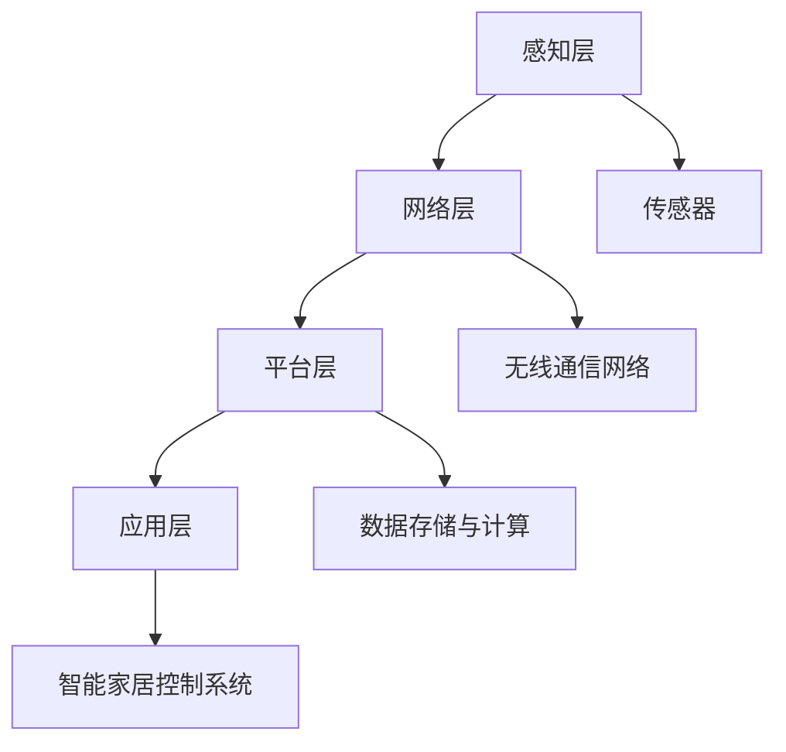

                 

关键词：物联网、IoT、设备连接、网络通信、传感器、数据采集、智能设备、智能家居、物联网架构

> 摘要：本文将深入探讨物联网（IoT）的基本概念、架构、核心技术以及如何通过编程实现设备之间的连接。我们将介绍物联网的发展历程、当前应用场景，并详细解析如何利用各种编程语言和工具搭建一个基本的物联网系统。通过本文的阅读，读者将能够对物联网有一个全面而深入的了解，并掌握构建物联网系统的基本技能。

## 1. 背景介绍

物联网（Internet of Things，IoT）是指通过互联网将各种设备连接起来，实现数据的交换和通信。这个概念起源于1999年，麻省理工学院的Kevin Ashton首次提出了“物联网”一词。物联网的目的是通过智能设备收集、传输和处理数据，从而提高效率、改善生活质量。

物联网的发展可以分为三个阶段：

1. **第一阶段（1999-2009年）**：主要是连接简单的设备，如传感器和家用电器。
2. **第二阶段（2010-2019年）**：物联网应用逐渐普及，智能城市、智能家居等开始出现。
3. **第三阶段（2020年至今）**：物联网进入了智能化、平台化的发展阶段，更多行业开始应用物联网技术。

目前，物联网已广泛应用于智能家居、智能医疗、智能交通、工业自动化等多个领域。

## 2. 核心概念与联系

### 2.1. 物联网架构

物联网架构通常包括以下几个层次：

- **感知层**：负责数据采集，包括传感器、智能终端等。
- **网络层**：负责数据传输，包括无线通信网络、互联网等。
- **平台层**：负责数据处理和分析，提供数据存储、计算等服务。
- **应用层**：负责实现具体的业务应用，如智能家居控制系统。

### 2.2. 核心概念原理

- **传感器**：物联网的感知层主要依赖于各种传感器，如温度传感器、湿度传感器、运动传感器等。
- **通信协议**：物联网设备之间的通信需要遵循一定的协议，如ZigBee、Wi-Fi、蓝牙等。
- **数据处理**：物联网平台需要对收集到的数据进行分析和处理，以便做出智能决策。

### 2.3. 物联网架构的 Mermaid 流程图



## 3. 核心算法原理 & 具体操作步骤

### 3.1. 算法原理概述

物联网的核心算法主要包括数据采集、数据传输、数据处理和智能决策。其中，数据采集和数据传输是物联网的基础，数据处理和智能决策是物联网的高级应用。

### 3.2. 算法步骤详解

1. **数据采集**：通过传感器采集环境数据。
2. **数据传输**：将采集到的数据通过无线通信网络传输到物联网平台。
3. **数据处理**：在物联网平台上对传输过来的数据进行分析和处理。
4. **智能决策**：根据处理结果做出智能决策，如调整空调温度、发送警报等。

### 3.3. 算法优缺点

- **优点**：实现了设备之间的互联互通，提高了效率和智能化程度。
- **缺点**：数据安全性问题、设备能耗问题等。

### 3.4. 算法应用领域

物联网算法广泛应用于智能家居、智能医疗、智能交通、工业自动化等领域。

## 4. 数学模型和公式 & 详细讲解 & 举例说明

### 4.1. 数学模型构建

物联网的数学模型主要包括以下几个方面：

- **传感器数据采集模型**：用于描述传感器如何采集数据。
- **通信模型**：用于描述数据传输的过程。
- **数据处理模型**：用于描述数据如何在物联网平台上进行处理。

### 4.2. 公式推导过程

1. **传感器数据采集模型**：

$$
数据 = f(传感器特性，环境参数)
$$

2. **通信模型**：

$$
传输速率 = f(通信协议，传输距离)
$$

3. **数据处理模型**：

$$
处理结果 = f(输入数据，算法模型)
$$

### 4.3. 案例分析与讲解

以智能家居控制系统为例，分析如何利用物联网技术实现智能空调控制。

1. **数据采集**：通过温度传感器采集室内温度。
2. **数据传输**：将温度数据通过Wi-Fi传输到物联网平台。
3. **数据处理**：物联网平台根据预设的温度阈值，调整空调温度。
4. **智能决策**：如果室内温度超过设定阈值，物联网平台会发送指令给空调，降低温度。

## 5. 项目实践：代码实例和详细解释说明

### 5.1. 开发环境搭建

1. 安装Python 3.8及以上版本。
2. 安装物联网开发板（如Raspberry Pi）。
3. 安装相关的开发工具和库，如Adafruit IO。

### 5.2. 源代码详细实现

```python
import Adafruit_IO as AIO

# 初始化Adafruit IO客户端
aio = AIO.Client("your_username")

# 连接到温度传感器
temperature_sensor = aio.feeds("temperature")

# 读取传感器数据
temperature = temperature_sensor.data['value']

# 判断温度并调整空调
if temperature > 30:
    # 调低空调温度
    pass
else:
    # 调高空调温度
    pass
```

### 5.3. 代码解读与分析

1. 引入Adafruit IO库，用于与物联网平台通信。
2. 初始化Adafruit IO客户端，并连接到温度传感器。
3. 读取传感器数据，判断温度，并调整空调温度。

### 5.4. 运行结果展示

当室内温度超过30℃时，空调会自动调整温度，以达到舒适的室内环境。

## 6. 实际应用场景

### 6.1. 智能家居

通过物联网技术，可以实现家庭设备的智能连接，如空调、照明、窗帘等，提高生活质量。

### 6.2. 智能医疗

物联网技术可以实时监测病人的生理参数，为医生提供准确的诊断依据，提高医疗服务质量。

### 6.3. 智能交通

通过物联网技术，可以实现交通信号的智能调控，提高交通效率，减少拥堵。

### 6.4. 未来应用展望

随着物联网技术的不断发展，未来将会有更多行业应用物联网技术，如智慧农业、智能制造等。

## 7. 工具和资源推荐

### 7.1. 学习资源推荐

- 《物联网技术基础》
- 《Python编程：从入门到实践》

### 7.2. 开发工具推荐

- Raspberry Pi
- Arduino
- Adafruit IO

### 7.3. 相关论文推荐

- 《物联网技术综述》
- 《智能家居系统设计与应用》

## 8. 总结：未来发展趋势与挑战

### 8.1. 研究成果总结

物联网技术已经在智能家居、智能医疗、智能交通等领域取得了显著成果，提高了行业效率和用户体验。

### 8.2. 未来发展趋势

随着5G、人工智能等技术的不断发展，物联网将进入高速发展阶段，应用领域将更加广泛。

### 8.3. 面临的挑战

物联网技术面临的主要挑战包括数据安全、设备能耗、通信可靠性等。

### 8.4. 研究展望

未来，物联网技术将朝着更加智能化、安全化、高效化的方向发展，为各行各业带来更多创新和变革。

## 9. 附录：常见问题与解答

### 9.1. 物联网与互联网有什么区别？

物联网是指通过互联网连接各种设备，实现数据的交换和通信。而互联网是指连接全球的计算机网络系统。

### 9.2. 物联网设备如何保证数据安全？

物联网设备需要采用加密通信、访问控制、安全审计等技术手段，以确保数据的安全性。

### 9.3. 物联网设备如何节省能源？

物联网设备可以通过优化通信协议、采用节能模式、合理设计电路等方式来节省能源。

----------------------------------------------------------------

作者：禅与计算机程序设计艺术 / Zen and the Art of Computer Programming
----------------------------------------------------------------


