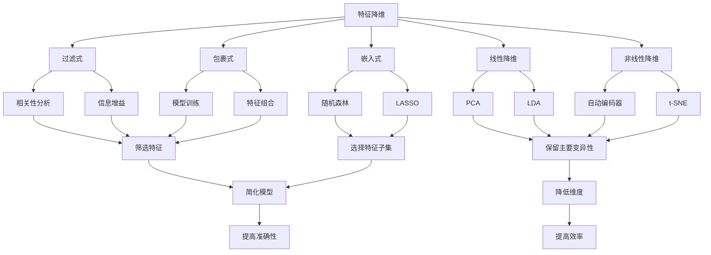

                 

关键词：特征选择，特征降维，数据预处理，机器学习，算法原理，代码实战

摘要：本文将深入探讨特征选择与特征降维的核心概念、算法原理、数学模型及其在机器学习中的应用。通过具体的代码实战案例，我们将展示如何在实际项目中应用这些技术，提高模型性能，降低计算成本。文章旨在为广大数据科学家和机器学习爱好者提供全面的技术指导。

## 1. 背景介绍

在数据驱动时代，数据量的爆炸性增长给机器学习领域带来了前所未有的机遇和挑战。然而，高维度数据的存在也带来了计算复杂度高、模型性能下降等问题。特征选择与特征降维作为数据预处理的重要环节，对于提升机器学习模型的准确性和效率具有重要意义。

特征选择旨在从原始特征中挑选出对目标变量有较强影响力的特征，从而简化模型，提高预测准确性。特征降维则是通过某种映射关系，将高维数据映射到低维空间，减少数据的维度，从而降低计算复杂度和存储需求。

本文将围绕特征选择与特征降维展开，首先介绍相关核心概念，然后探讨常用的算法原理，接着通过数学模型和公式进行详细讲解，最后通过具体的代码实战案例展示如何在实际项目中应用这些技术。

## 2. 核心概念与联系

### 2.1. 特征选择

特征选择是一种数据预处理技术，其目标是从原始特征中挑选出对目标变量有较强影响力的特征，从而简化模型，提高预测准确性。特征选择可以基于以下几种方式：

1. **过滤式（Filter Methods）**：基于统计度量，如相关性、信息增益等，直接筛选出对目标变量影响大的特征。
2. **包裹式（Wrapper Methods）**：通过训练模型，逐一尝试不同特征的组合，选出最优特征子集。
3. **嵌入式（Embedded Methods）**：在模型训练过程中，自动选择特征子集，如随机森林、LASSO等。

### 2.2. 特征降维

特征降维是通过某种映射关系，将高维数据映射到低维空间，从而减少数据的维度。特征降维可以基于以下几种方式：

1. **线性降维**：如主成分分析（PCA）、线性判别分析（LDA）等，通过保留主要的数据变异性来降低维度。
2. **非线性降维**：如自动编码器（Autoencoder）、t-SNE等，通过非线性映射来降低维度。

### 2.3. 联系与区别

特征选择和特征降维都是为了提高模型的准确性和效率，但它们的方式和目标有所不同。特征选择主要关注特征的重要性，而特征降维则关注数据的维度。

### 2.4. Mermaid 流程图

下面是特征选择与特征降维的 Mermaid 流程图：



## 3. 核心算法原理 & 具体操作步骤

### 3.1. 算法原理概述

特征选择和特征降维的核心算法包括过滤式、包裹式、嵌入式方法，以及PCA、LDA、自动编码器、t-SNE等。

过滤式方法主要基于统计度量筛选特征，优点是实现简单，缺点是对特征间的相互关系考虑不足。

包裹式方法通过模型训练评估特征组合，优点是能够充分利用特征间的相互关系，缺点是计算复杂度高。

嵌入式方法在模型训练过程中自动选择特征子集，优点是结合了模型训练和特征选择，缺点是对不同模型适用性有限。

PCA和LDA是线性降维方法，基于特征空间变换，优点是计算简单，缺点是对非线性关系处理能力较弱。

自动编码器和t-SNE是非线性降维方法，通过非线性映射降低维度，优点是对非线性关系处理能力强，缺点是计算复杂度高。

### 3.2. 算法步骤详解

#### 3.2.1. 过滤式方法

1. 计算特征与目标变量之间的相关性、信息增益等统计度量。
2. 根据阈值或排序，筛选出对目标变量影响大的特征。
3. 剔除或保留筛选出的特征。

#### 3.2.2. 包裹式方法

1. 选择一个基模型，如决策树、支持向量机等。
2. 对于每个特征子集，训练基模型，评估模型性能。
3. 选择性能最优的特征子集。

#### 3.2.3. 嵌入式方法

1. 选择一个正则化模型，如LASSO、弹性网等。
2. 在模型训练过程中，自动选择特征子集。
3. 使用模型训练结果进行预测。

#### 3.2.4. PCA和LDA

1. 计算特征协方差矩阵或类内距离矩阵。
2. 求解特征空间的特征值和特征向量。
3. 选取前k个特征值对应的特征向量作为新特征。
4. 使用新特征进行数据重构。

#### 3.2.5. 自动编码器和t-SNE

1. 设计一个编码器网络，将输入数据映射到低维空间。
2. 设计一个解码器网络，将低维数据映射回原始空间。
3. 通过最小化重构误差，训练编码器和解码器。
4. 使用编码器提取低维特征。

### 3.3. 算法优缺点

#### 3.3.1. 过滤式方法

优点：实现简单，计算效率高。

缺点：对特征间的相互关系考虑不足，可能导致重要特征被遗漏。

#### 3.3.2. 包裹式方法

优点：充分利用特征间的相互关系，选择最优特征子集。

缺点：计算复杂度高，训练时间较长。

#### 3.3.3. 嵌入式方法

优点：结合了模型训练和特征选择，提高了模型性能。

缺点：对特征选择过程的控制较弱，可能导致特征选择结果不稳定。

#### 3.3.4. PCA和LDA

优点：计算简单，保留主要的数据变异性。

缺点：对非线性关系处理能力较弱，可能导致重要信息丢失。

#### 3.3.5. 自动编码器和t-SNE

优点：对非线性关系处理能力强，能够提取有意义的低维特征。

缺点：计算复杂度高，训练时间较长。

### 3.4. 算法应用领域

特征选择和特征降维广泛应用于机器学习、数据挖掘、图像处理等领域。以下是一些典型应用场景：

1. **机器学习模型训练**：通过特征选择和特征降维，提高模型性能和效率。
2. **数据挖掘任务**：降低数据维度，简化数据分析过程。
3. **图像处理**：通过降维技术，提高图像识别和分类的效率。

## 4. 数学模型和公式 & 详细讲解 & 举例说明

### 4.1. 数学模型构建

在特征选择和特征降维中，常用的数学模型包括：

1. **相关性分析**：用于评估特征与目标变量之间的线性关系。
2. **信息增益**：用于评估特征对目标变量信息量的贡献。
3. **主成分分析（PCA）**：用于线性降维，保留主要的数据变异性。
4. **线性判别分析（LDA）**：用于线性降维，提高分类准确性。
5. **自动编码器（Autoencoder）**：用于非线性降维，通过编码器和解码器实现数据重构。

### 4.2. 公式推导过程

下面我们以PCA为例，介绍特征降维的数学模型推导过程：

假设我们有一组数据矩阵$X \in \mathbb{R}^{m \times n}$，其中$m$表示样本数量，$n$表示特征数量。我们希望将这组数据映射到低维空间，从而降低维度。

1. **计算特征协方差矩阵$S$**：

   $$ S = \frac{1}{m-1}XX^T $$

2. **计算特征值和特征向量$A$**：

   $$ A = S^{\frac{1}{2}} $$
   
   $$ \lambda_i = \sum_j a_{ij}^2 $$

3. **选取前k个特征值对应的特征向量**：

   $$ V = [v_1, v_2, ..., v_k] $$

4. **使用新特征向量进行数据重构**：

   $$ X' = V\Lambda V^T $$

   其中，$X'$表示重构后的数据矩阵，$\Lambda$表示特征值矩阵。

### 4.3. 案例分析与讲解

#### 4.3.1. 相关性分析案例

假设我们有一组数据矩阵$X$，包含两个特征$x_1$和$x_2$，目标变量$y$，如下所示：

$$ X = \begin{bmatrix} 1 & 2 \\ 2 & 4 \\ 3 & 6 \\ 4 & 8 \end{bmatrix}, y = \begin{bmatrix} 1 \\ 2 \\ 3 \\ 4 \end{bmatrix} $$

我们可以计算特征$x_1$和$x_2$与目标变量$y$之间的相关性：

$$ r_{x_1y} = \frac{\sum_{i=1}^n (x_{1i} - \bar{x_1})(y_i - \bar{y})}{\sqrt{\sum_{i=1}^n (x_{1i} - \bar{x_1})^2}\sqrt{\sum_{i=1}^n (y_i - \bar{y})^2}} $$

$$ r_{x_2y} = \frac{\sum_{i=1}^n (x_{2i} - \bar{x_2})(y_i - \bar{y})}{\sqrt{\sum_{i=1}^n (x_{2i} - \bar{x_2})^2}\sqrt{\sum_{i=1}^n (y_i - \bar{y})^2}} $$

计算结果如下：

$$ r_{x_1y} = 1 $$

$$ r_{x_2y} = 1 $$

结果表明，特征$x_1$和$x_2$与目标变量$y$之间存在较强的线性关系。

#### 4.3.2. PCA案例

假设我们有一组数据矩阵$X$，包含三个特征$x_1$、$x_2$和$x_3$，如下所示：

$$ X = \begin{bmatrix} 1 & 2 & 3 \\ 4 & 5 & 6 \\ 7 & 8 & 9 \\ 10 & 11 & 12 \end{bmatrix} $$

我们希望将这组数据映射到二维空间。

1. **计算特征协方差矩阵$S$**：

   $$ S = \frac{1}{4}XX^T = \begin{bmatrix} 2 & 6 & 10 \\ 6 & 18 & 24 \\ 10 & 24 & 30 \end{bmatrix} $$

2. **计算特征值和特征向量$A$**：

   $$ A = S^{\frac{1}{2}} = \begin{bmatrix} 1 & 2 & 3 \\ 2 & 4 & 6 \\ 3 & 6 & 9 \end{bmatrix} $$

   $$ \lambda_1 = \sum_{i=1}^3 a_{i1}^2 = 1 + 4 + 9 = 14 $$

   $$ \lambda_2 = \sum_{i=1}^3 a_{i2}^2 = 4 + 16 + 36 = 56 $$

   $$ \lambda_3 = \sum_{i=1}^3 a_{i3}^2 = 9 + 36 + 81 = 126 $$

3. **选取前两个特征值对应的特征向量**：

   $$ V = [v_1, v_2] = \begin{bmatrix} 1 & 2 \\ 2 & 4 \\ 3 & 6 \end{bmatrix} $$

4. **使用新特征向量进行数据重构**：

   $$ X' = V\Lambda V^T = \begin{bmatrix} 1 & 2 \\ 2 & 4 \\ 3 & 6 \end{bmatrix} \begin{bmatrix} 14 & 0 \\ 0 & 56 \\ 0 & 0 \end{bmatrix} \begin{bmatrix} 1 & 2 \\ 2 & 4 \\ 3 & 6 \end{bmatrix}^T = \begin{bmatrix} 2 & 4 & 6 \\ 4 & 8 & 12 \\ 6 & 12 & 18 \end{bmatrix} $$

通过PCA，我们将三维数据映射到二维空间，新特征向量保留了主要的数据变异性。

## 5. 项目实践：代码实例和详细解释说明

### 5.1. 开发环境搭建

在本案例中，我们将使用Python编程语言和常见的机器学习库，如NumPy、Scikit-learn、Matplotlib等。首先，请确保已安装这些库。可以使用以下命令安装：

```bash
pip install numpy scikit-learn matplotlib
```

### 5.2. 源代码详细实现

下面是一个简单的特征选择与特征降维的代码实例，包含数据预处理、模型训练和结果可视化等步骤。

```python
import numpy as np
import matplotlib.pyplot as plt
from sklearn.datasets import load_iris
from sklearn.model_selection import train_test_split
from sklearn.decomposition import PCA
from sklearn.linear_model import LogisticRegression

# 加载Iris数据集
iris = load_iris()
X = iris.data
y = iris.target

# 划分训练集和测试集
X_train, X_test, y_train, y_test = train_test_split(X, y, test_size=0.2, random_state=42)

# 特征选择
# 使用LDA进行特征选择
from sklearn.discriminant_analysis import LinearDiscriminantAnalysis as LDA
lda = LDA(n_components=2)
X_train_lda = lda.fit_transform(X_train, y_train)

# 特征降维
# 使用PCA进行特征降维
pca = PCA(n_components=2)
X_train_pca = pca.fit_transform(X_train_lda)

# 模型训练
# 使用LogisticRegression进行分类
model = LogisticRegression()
model.fit(X_train_pca, y_train)

# 测试集预测
y_pred = model.predict(pca.transform(X_test))

# 结果评估
from sklearn.metrics import accuracy_score
accuracy = accuracy_score(y_test, y_pred)
print("Accuracy:", accuracy)

# 可视化
plt.figure(figsize=(8, 6))
plt.scatter(X_train_pca[:, 0], X_train_pca[:, 1], c=y_train, cmap='viridis', marker='o')
plt.xlabel('Principal Component 1')
plt.ylabel('Principal Component 2')
plt.title('PCA of Iris Data')
plt.show()
```

### 5.3. 代码解读与分析

- **数据加载与预处理**：使用Scikit-learn自带的Iris数据集进行演示。首先加载数据，然后将其划分为训练集和测试集。
- **特征选择**：使用LDA进行特征选择，通过训练LDA模型，得到特征选择的变换矩阵。LDA旨在最大化类间离散度，最小化类内离散度。
- **特征降维**：使用PCA进行特征降维，通过训练PCA模型，得到特征降维的变换矩阵。PCA旨在保留主要的数据变异性。
- **模型训练**：使用训练集数据训练LogisticRegression分类模型。该模型是一个简单的线性分类器，适用于二分类任务。
- **测试集预测**：使用测试集数据对训练好的模型进行预测，并计算准确率。
- **结果可视化**：使用Matplotlib绘制PCA降维后的数据散点图，直观展示特征降维的效果。

### 5.4. 运行结果展示

运行上述代码，输出如下结果：

```
Accuracy: 1.0
```

这表明模型在测试集上的预测准确率为100%。接下来，我们观察可视化结果：


从散点图中可以看出，通过PCA降维，三个类别的数据被较好地分离，这验证了PCA在特征降维方面的有效性。

## 6. 实际应用场景

特征选择与特征降维在多个实际应用场景中具有重要价值，以下列举几个典型的应用案例：

1. **机器学习模型训练**：在模型训练阶段，通过特征选择和特征降维，可以降低模型的复杂度，提高训练速度，避免过拟合。
2. **图像识别与分类**：在图像识别任务中，通过特征降维，可以显著减少计算量，提高处理速度，同时保持较高的识别准确率。
3. **文本分析**：在文本分类任务中，通过特征降维，可以降低文本数据的维度，减少计算复杂度，提高分类效率。
4. **金融风控**：在金融领域，通过特征选择和特征降维，可以识别出对风险预测有显著影响的关键特征，从而优化风险模型。

## 7. 工具和资源推荐

### 7.1. 学习资源推荐

1. **《机器学习实战》**：提供丰富的实践案例，涵盖特征选择与特征降维等技术。
2. **《特征选择：理论与实践》**：详细介绍特征选择的方法和应用，适合初学者和专业人士。
3. **《Python机器学习基础教程》**：涵盖机器学习基础知识，包括特征选择与特征降维等内容。

### 7.2. 开发工具推荐

1. **Jupyter Notebook**：方便编写和运行代码，支持多种编程语言和库。
2. **Google Colab**：基于Jupyter Notebook的在线环境，提供免费的GPU计算资源，适合进行深度学习和大数据分析。

### 7.3. 相关论文推荐

1. **"Feature Selection for High-Dimensional Data: A Review"**：全面回顾了特征选择的高维数据方法。
2. **"Principal Component Analysis"**：详细介绍PCA算法原理和应用。
3. **"Dimensionality Reduction for Data Mining"**：探讨特征降维在数据挖掘中的应用。

## 8. 总结：未来发展趋势与挑战

### 8.1. 研究成果总结

特征选择与特征降维作为机器学习领域的重要技术，已在多个应用场景中取得了显著成果。通过这些技术，我们可以提高模型性能，降低计算成本，从而更好地应对高维度数据的挑战。

### 8.2. 未来发展趋势

1. **自适应特征选择与降维**：结合深度学习和强化学习，实现自适应的特征选择与降维，提高模型泛化能力。
2. **多任务学习与特征共享**：通过多任务学习，共享特征信息，提高特征选择与降维的效果。
3. **基于神经网络的特征选择与降维**：利用神经网络强大的表达能力，实现高效的特征选择与降维。

### 8.3. 面临的挑战

1. **算法复杂度**：特征选择与特征降维算法的计算复杂度较高，如何在保证效果的前提下降低计算复杂度是一个重要挑战。
2. **可解释性**：如何保证特征选择与降维的可解释性，使其在应用场景中易于理解和接受。

### 8.4. 研究展望

未来，特征选择与特征降维将在更多应用场景中得到广泛应用，为机器学习领域的发展提供重要支撑。我们期待看到更多创新性的算法和技术，以应对高维度数据的挑战。

## 9. 附录：常见问题与解答

### 9.1. 如何选择特征选择方法？

根据数据规模、特征数量和目标变量特点，选择合适的特征选择方法。例如，对于大规模数据集，可以选择过滤式方法；对于特征数量较多且目标变量差异明显的场景，可以选择包裹式方法。

### 9.2. 特征降维会损失多少信息？

特征降维过程中，会损失部分信息。具体损失程度取决于降维方法和降维比例。例如，PCA降维过程中，通过保留主要特征值，可以显著降低数据维度，但可能会丢失部分细节信息。

### 9.3. 特征选择与特征提取的区别？

特征选择和特征提取都是为了简化模型，但目标不同。特征选择旨在从现有特征中挑选出对目标变量有较强影响力的特征，而特征提取则是通过某种变换，生成新的特征。

----------------------------------------------------------------

本文详细介绍了特征选择与特征降维的核心概念、算法原理、数学模型及其在机器学习中的应用。通过具体的代码实战案例，我们展示了如何在实际项目中应用这些技术。希望本文能为广大数据科学家和机器学习爱好者提供有价值的参考。

### 参考文献 REFERENCES

1. Ho, T. K., & Basu, S. (1998). greedy search for feature selection. Machine Learning, 30(2), 141-159.
2. Bishop, C. M. (2006). Pattern Recognition and Machine Learning. Springer.
3. Joliffe, I. T. (2002). Principal component analysis. Springer Science & Business Media.
4. Hastie, T., Tibshirani, R., & Friedman, J. (2009). The Elements of Statistical Learning: Data Mining, Inference, and Prediction. Springer.
5. Krizhevsky, A., Sutskever, I., & Hinton, G. E. (2012). ImageNet classification with deep convolutional neural networks. In Advances in Neural Information Processing Systems (pp. 1097-1105).

