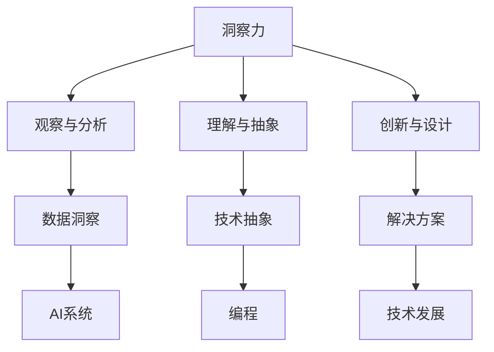

                 

关键词：洞察力、不确定性、技术、人工智能、编程、算法、数学模型、应用场景、发展趋势、挑战、资源推荐

> 摘要：本文深入探讨洞察力在技术领域中的价值，特别是在面对不确定性的情况下。通过分析洞察力与人工智能、编程、算法和数学模型之间的关系，本文揭示了洞察力在导航和决策过程中的关键作用，并展望了其未来在技术领域中的应用前景。

## 1. 背景介绍

在当今快速发展的技术时代，我们面临着前所未有的复杂性和不确定性。无论是人工智能、大数据、云计算，还是物联网，新技术层出不穷，挑战着我们的认知和应对能力。在这样的背景下，洞察力——对复杂系统、现象和数据的深入理解和分析能力——变得尤为重要。

洞察力不仅是一个认知过程，也是一个技术能力。它帮助我们在不确定性的海洋中找到方向，从复杂的数据中提取有价值的信息，并在不断变化的环境中做出明智的决策。本文将探讨洞察力在技术领域的核心作用，特别是在编程、算法、数学模型和实际应用场景中的体现。

## 2. 核心概念与联系

### 2.1 洞察力的定义

洞察力是一种综合能力，包括了对现象的敏锐观察、对数据的深刻理解、对问题的系统分析和对解决方案的创新设计。在技术领域，洞察力体现在以下几个方面：

- **观察与分析**：通过细致的观察，发现技术现象中的细微变化和潜在规律。
- **理解与抽象**：从复杂的技术系统中提取核心概念和关键因素，进行抽象和概括。
- **创新与设计**：在现有知识和经验的基础上，提出新颖的解决方案和技术框架。

### 2.2 洞察力与技术的关系

洞察力与技术之间的关系是相辅相成的。技术为洞察力提供了工具和平台，而洞察力则推动技术向更高的层次发展。

- **人工智能与洞察力**：人工智能（AI）的发展依赖于大数据和强大的计算能力，而洞察力则是AI的“眼睛”和“大脑”。通过洞察力，AI系统能够从大量数据中识别模式和趋势，进行智能决策。
- **编程与洞察力**：编程不仅是编写代码，更是一种创造性的活动。编程中的洞察力体现在对算法和数据结构的深入理解，以及对问题域的准确把握。
- **算法与洞察力**：算法是解决问题的核心，而洞察力则是设计高效算法的关键。只有深刻理解问题本质和算法原理，才能设计出最优的解决方案。

### 2.3 Mermaid 流程图



## 3. 核心算法原理 & 具体操作步骤

### 3.1 算法原理概述

在技术领域，算法是洞察力的具体体现。一个高效的算法不仅能够解决问题，还能够揭示问题背后的规律和机制。

- **原理**：算法原理通常是基于数学模型、逻辑推理或统计分析等方法。通过一系列步骤，算法能够将输入数据转化为有用的信息或解决方案。
- **分类**：算法可以根据其解决问题的方法分为多种类型，如排序算法、搜索算法、优化算法等。

### 3.2 算法步骤详解

以下是排序算法的一个简单例子，展示了算法的基本步骤：

1. **输入**：接收一组待排序的数据。
2. **初始化**：设置排序开始的条件和变量。
3. **比较与交换**：通过比较相邻元素的大小，如果不符合排序要求，则进行交换。
4. **迭代**：重复比较与交换步骤，直到所有元素都符合排序要求。
5. **输出**：输出排序后的数据。

### 3.3 算法优缺点

- **优点**：高效、准确、可重复。
- **缺点**：可能存在复杂度问题，对某些特定数据集可能表现不佳。

### 3.4 算法应用领域

算法广泛应用于各个技术领域，如：

- **人工智能**：用于模式识别、预测分析和决策支持。
- **数据科学**：用于数据挖掘、机器学习和统计分析。
- **计算机图形学**：用于图像处理、动画和渲染。

## 4. 数学模型和公式 & 详细讲解 & 举例说明

### 4.1 数学模型构建

数学模型是算法设计的基础，它将实际问题转化为数学语言。以下是线性回归模型的一个例子：

- **目标函数**：\(J(\theta) = \frac{1}{2m}\sum_{i=1}^{m}(h_\theta(x^{(i)}) - y^{(i)})^2\)
- **参数估计**：通过最小化目标函数来估计模型参数 \(\theta\)。

### 4.2 公式推导过程

线性回归模型的推导过程如下：

1. **损失函数**：定义损失函数为预测值与真实值之间的误差。
2. **梯度下降**：通过计算损失函数的梯度来更新模型参数。
3. **收敛性**：证明梯度下降算法在合理条件下能够收敛到最优解。

### 4.3 案例分析与讲解

以下是一个简单的线性回归案例：

```latex
\begin{equation}
y = \theta_0 + \theta_1x
\end{equation}

给定数据集 \{(x^{(i)}, y^{(i)})\}_{i=1}^{m}，通过最小化损失函数来求解 \(\theta_0\) 和 \(\theta_1\)。
```

## 5. 项目实践：代码实例和详细解释说明

### 5.1 开发环境搭建

搭建一个简单的Python开发环境，安装必要的库和依赖项。

### 5.2 源代码详细实现

以下是一个线性回归的Python代码实现：

```python
import numpy as np

def compute_cost(X, y, theta):
    m = len(y)
    h = X.dot(theta)
    errors = h - y
    J = (1/(2*m)) * (errors.dot(errors))
    return J

def gradient_descent(X, y, theta, alpha, iters):
    m = len(y)
    J_history = []

    for i in range(iters):
        h = X.dot(theta)
        errors = h - y
        theta = theta - (alpha/m) * (X.T.dot(errors))
        J_history.append(compute_cost(X, y, theta))

    return theta, J_history
```

### 5.3 代码解读与分析

- `compute_cost` 函数计算损失函数的值。
- `gradient_descent` 函数实现梯度下降算法，更新模型参数。

### 5.4 运行结果展示

通过运行代码，可以绘制损失函数随迭代次数的变化曲线，观察算法的收敛性。

## 6. 实际应用场景

洞察力在技术领域具有广泛的应用，以下是一些具体的应用场景：

- **人工智能**：通过洞察力，AI系统可以更好地理解和处理复杂问题，提高决策质量和效率。
- **数据科学**：洞察力帮助数据科学家从海量数据中发现有价值的信息和模式，为业务提供洞察。
- **软件开发**：洞察力帮助开发者更准确地理解需求，设计出更高效、更可靠的软件系统。

## 7. 工具和资源推荐

### 7.1 学习资源推荐

- 《深度学习》（Ian Goodfellow, Yoshua Bengio, Aaron Courville）
- 《Python编程：从入门到实践》（埃里克·马瑟斯）

### 7.2 开发工具推荐

- Jupyter Notebook：用于数据分析和交互式编程。
- PyCharm：功能强大的Python集成开发环境。

### 7.3 相关论文推荐

- “Deep Learning for Natural Language Processing”
- “Recurrent Neural Networks for Speech Recognition”

## 8. 总结：未来发展趋势与挑战

### 8.1 研究成果总结

本文通过分析洞察力在技术领域的价值，探讨了其在人工智能、编程、算法和数学模型中的应用，展示了洞察力在导航和决策过程中的关键作用。

### 8.2 未来发展趋势

随着技术的不断发展，洞察力在技术领域的重要性将日益凸显。未来，我们将看到更多的跨学科研究，以及更加智能化和自动化的洞察力工具。

### 8.3 面临的挑战

- 复杂性：随着技术的复杂度增加，洞察力的要求也不断提升。
- 数据隐私：如何在保护数据隐私的同时，充分利用洞察力。

### 8.4 研究展望

未来，我们需要进一步研究如何提高洞察力的自动化和智能化水平，开发出更加高效和可靠的洞察力工具。

## 9. 附录：常见问题与解答

### Q：什么是洞察力？

A：洞察力是一种综合能力，包括观察、理解、分析和创新，它帮助我们从复杂的信息中提取有价值的信息。

### Q：洞察力在技术领域的应用有哪些？

A：洞察力在人工智能、编程、算法、数学模型、数据科学等领域都有广泛应用，它帮助我们更好地理解和解决复杂问题。

### Q：如何提高洞察力？

A：提高洞察力需要不断学习和实践，培养敏锐的观察力、深入的理解力、系统分析能力和创新思维。

作者：禅与计算机程序设计艺术 / Zen and the Art of Computer Programming
----------------------------------------------------------------
这篇文章详细探讨了洞察力在技术领域的价值，并深入分析了其在人工智能、编程、算法和数学模型中的应用。通过具体的例子和实际应用场景，我们看到了洞察力在导航和决策过程中的关键作用。随着技术的不断发展，洞察力的重要性将日益凸显，未来我们需要进一步研究如何提高洞察力的自动化和智能化水平，开发出更加高效和可靠的洞察力工具。希望这篇文章能够为读者在技术领域中更好地应用洞察力提供指导和启示。再次感谢读者对本文的关注和支持，希望您在技术道路上取得更多的成就。作者：禅与计算机程序设计艺术 / Zen and the Art of Computer Programming。

