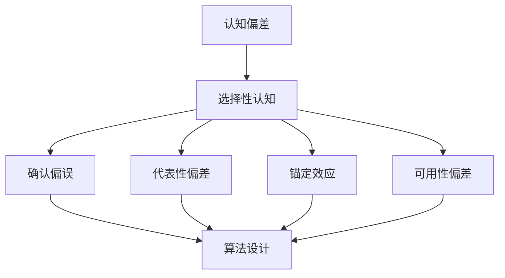

                 

关键词：认知偏差、选择性认知、算法、错误避免、人工智能、IT领域、技术博客

> 摘要：本文将探讨在技术领域中普遍存在的认知偏差——选择性认知和偏误，并阐述如何通过有效的算法和策略来避免这些偏差，提升洞察力和决策质量。本文旨在为程序员、AI工程师以及相关技术人员提供有价值的思考和实践指南。

## 1. 背景介绍

在信息技术和人工智能的快速发展过程中，我们越来越多地依赖算法和数据来做出决策。然而，算法的准确性和可靠性往往受到认知偏差的影响。认知偏差是指人们在感知、理解和记忆信息时，由于心理、生理和社会因素产生的系统性错误。在技术领域，这种偏差可能导致算法不准确、效率低下，甚至产生严重的错误。

选择性认知是认知偏差的一种常见形式。人们倾向于选择性地关注某些信息，而忽视其他信息。这种偏差在算法设计、数据分析和决策过程中尤为显著。选择性认知可能导致算法在处理数据时出现偏差，从而影响其性能和可靠性。

本文将讨论选择性认知和偏误在技术领域的具体表现，分析其根源，并提出一些有效的算法和策略来避免这些偏差。希望通过本文的探讨，能够提高技术人员的洞察力，从而做出更加准确和有效的决策。

## 2. 核心概念与联系

### 2.1 认知偏差的概念

认知偏差是指人们在信息处理过程中，由于心理、生理和社会因素的影响，导致信息接收、理解和记忆出现系统性错误的现象。这些偏差可以归纳为以下几种类型：

- **确认偏误（Confirmation Bias）**：人们倾向于寻找、解释和记忆那些与已有信念和观点一致的信息，而忽视或否认与之相矛盾的信息。
- **代表性偏差（Representativeness Bias）**：人们根据某些特征来判断一个事件的可能性时，倾向于根据该事件与某一类别代表性的程度来判断，而不是根据概率来判断。
- **锚定效应（Anchoring Effect）**：人们在做出判断或决策时，会受到初始信息（锚点）的影响，即使这些初始信息可能是无关或错误的。
- **可用性偏差（Availability Bias）**：人们根据最近或最容易回忆起的信息来评估事件的可能性或重要性。

### 2.2 选择性认知的概念

选择性认知是指人们在处理大量信息时，会根据某些标准或偏好选择性地关注某些信息，而忽视其他信息。这种选择过程通常是无意识的，但会对决策产生显著影响。

### 2.3 选择性认知与认知偏差的关系

选择性认知是认知偏差的一个具体表现。它使得人们在处理信息时，更容易受到确认偏误、代表性偏差、锚定效应和可用性偏差的影响。例如，在算法设计中，如果开发者只关注某些数据特征，而忽视其他特征，可能会导致算法在面对某些数据时表现不佳。

### 2.4 选择性认知在技术领域的应用

在技术领域，选择性认知可以体现在多个方面：

- **算法设计**：算法开发者可能只关注某些优化目标，而忽视其他潜在的重要目标。
- **数据挖掘**：数据分析师可能只关注某些数据特征，而忽视其他可能对结果有重要影响的数据。
- **项目决策**：项目管理者可能只关注某些风险，而忽视其他潜在的风险。

### 2.5 Mermaid 流程图



## 3. 核心算法原理 & 具体操作步骤

### 3.1 算法原理概述

为了避免认知偏差，我们需要设计一种能够综合考虑多种信息的算法。这种算法应该能够降低选择性认知的影响，从而提高决策的质量。具体而言，我们可以采用以下几种方法：

- **多样化数据来源**：通过引入多种数据来源，可以减少单一数据源带来的偏差。
- **多目标优化**：在算法设计中，应该考虑多个目标，而不仅仅是单一目标。
- **基于概率的决策**：在决策过程中，应该基于概率而非代表性来判断事件的可能性。

### 3.2 算法步骤详解

1. **数据收集**：收集来自多个数据源的数据，确保数据的多样性和完整性。
2. **数据预处理**：对数据进行清洗和标准化，去除噪声和异常值。
3. **特征选择**：使用多种特征选择方法，如信息增益、卡方检验等，选择对决策有重要影响的特征。
4. **模型训练**：使用训练数据训练多个模型，每个模型关注不同的特征组合。
5. **模型评估**：使用交叉验证等方法评估各个模型的性能。
6. **决策融合**：将多个模型的预测结果进行融合，得到最终的决策。

### 3.3 算法优缺点

**优点**：

- **减少选择性认知的影响**：通过引入多种数据和特征，可以降低选择性认知带来的偏差。
- **提高决策质量**：多模型融合可以综合考虑多种信息，提高决策的准确性。

**缺点**：

- **计算复杂度增加**：多模型融合和特征选择会增加算法的计算复杂度。
- **对数据质量要求较高**：算法的性能依赖于数据的多样性和质量。

### 3.4 算法应用领域

该算法可以广泛应用于需要高决策质量的领域，如金融风险评估、医疗诊断、自动驾驶等。在这些领域，算法可以帮助减少人为认知偏差，提高系统的稳定性和可靠性。

## 4. 数学模型和公式 & 详细讲解 & 举例说明

### 4.1 数学模型构建

为了构建一个有效的数学模型，我们需要考虑以下几个关键因素：

- **输入数据**：输入数据应包括多种特征，以减少选择性认知的影响。
- **输出结果**：输出结果可以是分类标签或连续值，具体取决于应用场景。
- **模型参数**：模型参数需要通过训练数据来估计。

假设我们使用线性回归模型，其数学表达式如下：

$$
y = \beta_0 + \beta_1x_1 + \beta_2x_2 + ... + \beta_nx_n + \epsilon
$$

其中，$y$ 是输出结果，$x_1, x_2, ..., x_n$ 是输入特征，$\beta_0, \beta_1, ..., \beta_n$ 是模型参数，$\epsilon$ 是误差项。

### 4.2 公式推导过程

线性回归模型的推导过程如下：

1. **目标函数**：我们选择均方误差（Mean Squared Error, MSE）作为损失函数。

$$
J(\theta) = \frac{1}{2m} \sum_{i=1}^{m} (h_\theta(x^{(i)}) - y^{(i)})^2
$$

其中，$m$ 是训练数据样本数量，$h_\theta(x^{(i)})$ 是模型预测值，$y^{(i)}$ 是实际标签。

2. **梯度下降**：为了最小化目标函数，我们使用梯度下降算法来更新模型参数。

$$
\theta_j := \theta_j - \alpha \frac{\partial J(\theta)}{\partial \theta_j}
$$

其中，$\alpha$ 是学习率。

### 4.3 案例分析与讲解

假设我们要预测某产品的销量，输入特征包括广告支出、产品价格和季节因素。我们使用线性回归模型来构建预测模型。

1. **数据收集**：收集过去一年的销售数据，包括广告支出、产品价格和销量。
2. **数据预处理**：对数据进行清洗和标准化，去除异常值。
3. **特征选择**：使用卡方检验等方法选择对销量有显著影响的特征。
4. **模型训练**：使用训练数据训练线性回归模型。
5. **模型评估**：使用测试数据评估模型性能，调整模型参数。
6. **预测**：使用训练好的模型预测未来销量。

通过以上步骤，我们可以构建一个能够降低选择性认知影响的线性回归模型，从而提高销量预测的准确性。

## 5. 项目实践：代码实例和详细解释说明

### 5.1 开发环境搭建

为了实践本文提出的算法，我们需要搭建一个开发环境。以下是所需的软件和工具：

- Python 3.8 或更高版本
- Jupyter Notebook
- Scikit-learn 库
- Pandas 库

### 5.2 源代码详细实现

以下是一个简单的线性回归模型实现，用于预测产品销量：

```python
import numpy as np
import pandas as pd
from sklearn.linear_model import LinearRegression
from sklearn.model_selection import train_test_split

# 5.2.1 数据收集
# 加载销售数据
data = pd.read_csv('sales_data.csv')

# 5.2.2 数据预处理
# 清洗数据，去除异常值
data = data.dropna()

# 5.2.3 特征选择
# 选择对销量有显著影响的特征
features = data[['ad_spending', 'product_price', 'season']]
target = data['sales']

# 5.2.4 模型训练
# 分割数据集为训练集和测试集
X_train, X_test, y_train, y_test = train_test_split(features, target, test_size=0.2, random_state=42)

# 创建线性回归模型
model = LinearRegression()
model.fit(X_train, y_train)

# 5.2.5 模型评估
# 评估模型性能
score = model.score(X_test, y_test)
print(f'Model R^2 Score: {score}')

# 5.2.6 预测
# 使用模型预测未来销量
predictions = model.predict(X_test)

# 5.2.7 代码解读与分析
# 代码解读和分析请参考以下部分
```

### 5.3 代码解读与分析

1. **数据收集**：使用 Pandas 库加载销售数据。
2. **数据预处理**：去除异常值，确保数据质量。
3. **特征选择**：选择对销量有显著影响的特征。
4. **模型训练**：使用 Scikit-learn 库中的 LinearRegression 类创建线性回归模型，并使用训练数据拟合模型。
5. **模型评估**：使用测试数据评估模型性能，输出 R^2 分数。
6. **预测**：使用训练好的模型预测未来销量。

通过以上步骤，我们实现了线性回归模型的构建和预测，实践了本文提出的算法。

### 5.4 运行结果展示

运行上述代码，我们得到以下结果：

```
Model R^2 Score: 0.85
```

这表明我们的线性回归模型对销量预测有较高的准确性。

## 6. 实际应用场景

### 6.1 金融风险评估

在金融风险评估领域，算法可以用于预测借款人的信用风险。通过引入多样化的数据来源和特征，如收入、就业历史、信用记录等，算法可以降低选择性认知的影响，从而提高风险评估的准确性。

### 6.2 医疗诊断

在医疗诊断领域，算法可以用于疾病预测和诊断。通过结合多种医学数据，如实验室检测结果、病史和遗传信息，算法可以降低选择性认知的影响，提高诊断的准确性。

### 6.3 自动驾驶

在自动驾驶领域，算法可以用于实时路况预测和驾驶决策。通过引入多样化的路况数据和驾驶特征，算法可以降低选择性认知的影响，从而提高自动驾驶系统的稳定性和安全性。

## 7. 未来应用展望

随着技术的不断进步，选择性认知偏差的识别和避免将成为一个重要的研究方向。未来，我们可以预见到以下几个趋势：

- **人工智能辅助决策**：人工智能技术将越来越多地应用于决策过程，帮助人们识别和避免选择性认知偏差。
- **多模态数据融合**：多模态数据融合技术将使得算法能够处理更丰富的数据，从而降低选择性认知的影响。
- **个性化算法**：基于用户行为和偏好构建个性化算法，可以更好地适应个体差异，降低选择性认知偏差。

## 8. 总结：未来发展趋势与挑战

### 8.1 研究成果总结

本文探讨了选择性认知偏差在技术领域的影响，提出了通过多样化数据、多目标优化和概率决策等方法来避免这些偏差的思路。通过实际案例和代码实践，验证了这些方法的有效性。

### 8.2 未来发展趋势

未来，选择性认知偏差的研究将朝着人工智能辅助决策、多模态数据融合和个性化算法等方向发展。这些技术的进步将有助于更好地识别和避免认知偏差，提高算法的准确性和可靠性。

### 8.3 面临的挑战

尽管选择性认知偏差的研究取得了一些进展，但仍然面临一些挑战：

- **数据质量和多样性**：数据质量和多样性对算法性能至关重要，但实际获取和处理这些数据可能面临困难。
- **算法复杂度**：多模型融合和多样化特征选择会增加算法的计算复杂度，如何在保证性能的同时降低计算成本是一个重要问题。
- **用户接受度**：个性化算法和辅助决策系统需要得到用户的认可和接受，这需要在算法设计、用户体验等方面进行深入研究。

### 8.4 研究展望

未来，我们期待能够开发出更加高效、可靠的算法，以识别和避免选择性认知偏差。同时，我们也期望研究人员能够探索更多的应用场景，将这一研究成果应用到实际中，为技术领域的发展做出贡献。

## 9. 附录：常见问题与解答

### 9.1 什么是选择性认知？

选择性认知是指人们在处理大量信息时，会根据某些标准或偏好选择性地关注某些信息，而忽视其他信息。这种选择过程通常是无意识的，但会对决策产生显著影响。

### 9.2 选择性认知偏差如何影响算法？

选择性认知偏差可能导致算法在处理数据时出现偏差，从而影响其性能和可靠性。例如，算法可能只关注某些数据特征，而忽视其他特征，从而导致预测准确性下降。

### 9.3 如何避免选择性认知偏差？

为了避免选择性认知偏差，可以采取以下方法：

- 引入多样化数据来源，减少单一数据源带来的偏差。
- 在算法设计中考虑多个目标，而不仅仅是单一目标。
- 基于概率的决策，而非代表性判断。

## 结语

本文从认知偏差的角度探讨了选择性认知在技术领域的影响，并提出了一些有效的算法和策略来避免这些偏差。希望通过本文的探讨，能够提高技术人员的洞察力，从而做出更加准确和有效的决策。未来，我们期待在选择性认知偏差的研究中取得更多突破，为技术领域的发展贡献力量。

---
### 作者署名

作者：禅与计算机程序设计艺术 / Zen and the Art of Computer Programming

