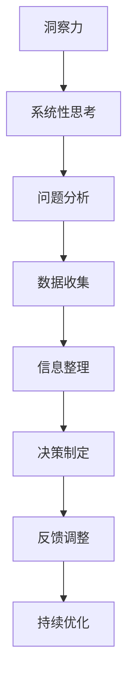
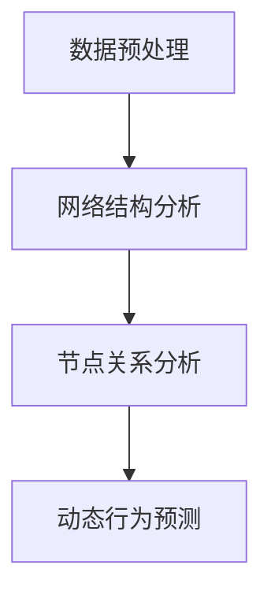

                 

 关键词：洞察力，系统性思考，技术分析，算法原理，应用实践，未来展望

> 摘要：本文将深入探讨洞察力的培养与系统性思考的重要性，以及如何在IT领域运用这些能力。通过分析核心概念和原理，解析算法和数学模型，并结合实际项目实践，本文旨在帮助读者提升技术分析能力，培养深刻的洞察力，为未来的技术发展做好充分准备。

## 1. 背景介绍

在当今快速发展的技术时代，具备洞察力和系统性思考能力已成为技术人员不可或缺的素质。从大数据到人工智能，从云计算到区块链，每一项新技术都要求技术人员不仅能够掌握技术本身，更能够洞察其背后的原理和趋势，从而做出更明智的决策和创新。

洞察力是一种深层次的理解和感知能力，它使我们能够看到问题的本质，发现隐藏的机会和风险。而系统性思考则是将问题看作一个整体，分析其各个组成部分及其相互关系，从而找到最佳的解决方案。

本文将围绕如何培养洞察力和系统性思考能力展开，结合IT领域的实际案例，深入探讨核心概念、算法原理、数学模型，以及项目实践，帮助读者在技术领域中更好地运用这些能力。

## 2. 核心概念与联系

### 2.1 洞察力的定义

洞察力（Insight）是一种能够迅速洞察问题本质的能力。它是通过深入分析和理解，发现问题的核心所在，从而提供创造性解决方案的思维方式。

### 2.2 系统性思考的概念

系统性思考（Systems Thinking）是一种思考问题的方法，它将问题视为一个由多个部分组成的整体，关注各个部分之间的相互作用和反馈循环。这种方法有助于我们理解复杂系统的动态行为，预测可能的结果，并找到更全面的解决方案。

### 2.3 Mermaid 流程图

为了更直观地展示洞察力和系统性思考之间的关系，我们使用Mermaid流程图来表示它们的核心概念和联系。



通过这个流程图，我们可以看到，洞察力和系统性思考共同作用于问题分析、数据收集、信息整理、决策制定、反馈调整和持续优化等环节，形成了一个循环迭代的过程。

## 3. 核心算法原理 & 具体操作步骤

### 3.1 算法原理概述

在本节中，我们将探讨一种用于提高洞察力和系统性思考能力的核心算法——网络分析算法（Network Analysis Algorithm）。

网络分析算法是一种用于分析复杂网络结构和动态行为的算法。它可以帮助我们理解网络中各个节点之间的关系，发现关键节点和路径，从而提供深刻的洞察力。

### 3.2 算法步骤详解

#### 3.2.1 数据预处理

首先，我们需要收集和整理网络数据，包括节点和边的信息。这些数据可以通过网络爬虫、传感器数据或其他数据源获取。

#### 3.2.2 网络结构分析

接下来，我们使用网络分析算法对网络结构进行分析。这包括计算节点之间的距离、度、聚类系数等指标，以了解网络的密度和连通性。



#### 3.2.3 节点关系分析

在节点关系分析阶段，我们使用图论算法来识别网络中的关键节点和路径。这些关键节点和路径通常对网络的整体性能和稳定性具有显著影响。

#### 3.2.4 动态行为预测

最后，我们使用网络分析算法来预测网络的动态行为，包括节点的活跃度、边的权重变化等。这些预测结果有助于我们理解网络的未来发展趋势，从而做出更准确的决策。

### 3.3 算法优缺点

#### 优点：

- 网络分析算法具有高度的灵活性和可扩展性，可以应用于各种不同类型的网络。
- 它提供了丰富的分析工具，使我们能够深入了解网络的结构和动态行为。

#### 缺点：

- 网络分析算法的计算复杂度较高，可能需要大量的计算资源和时间。
- 在某些情况下，算法可能无法准确预测网络的未来行为，因为网络行为受到多种因素的影响。

### 3.4 算法应用领域

网络分析算法在许多领域都有广泛的应用，包括社交网络分析、生物网络分析、交通网络分析等。这些应用领域都面临着复杂系统的分析和预测挑战，而网络分析算法能够提供有力的支持。

## 4. 数学模型和公式 & 详细讲解 & 举例说明

### 4.1 数学模型构建

在本节中，我们将介绍一种用于网络分析的核心数学模型——图论模型（Graph Theory Model）。

图论模型是一种用于描述网络结构和动态行为的数学模型。它包括节点（Node）、边（Edge）和权重（Weight）等基本元素。

### 4.2 公式推导过程

#### 4.2.1 节点度（Degree）

节点度是指连接到某个节点的边的数量。我们使用度数（k）来表示节点度。

$$
k = \sum_{i=1}^{n} d_i
$$

其中，$d_i$ 表示节点 $i$ 的度数，$n$ 表示网络中的节点总数。

#### 4.2.2 平均路径长度（Average Path Length）

平均路径长度是指网络中任意两个节点之间的平均路径长度。我们使用 $L$ 表示平均路径长度。

$$
L = \frac{1}{n(n-1)} \sum_{i=1}^{n} \sum_{j=1, j\neq i}^{n} d_{ij}
$$

其中，$d_{ij}$ 表示节点 $i$ 和节点 $j$ 之间的最短路径长度。

#### 4.2.3 网络密度（Network Density）

网络密度是指网络中边的数量与可能边的最大数量之比。我们使用 $D$ 表示网络密度。

$$
D = \frac{m}{n(n-1)/2}
$$

其中，$m$ 表示网络中的边数，$n$ 表示网络中的节点总数。

### 4.3 案例分析与讲解

为了更好地理解这些数学模型，我们来看一个实际案例——社交网络分析。

假设有一个包含 100 个节点的社交网络，其中每个节点表示一个用户，每条边表示用户之间的好友关系。我们需要计算这个社交网络的节点度、平均路径长度和网络密度。

#### 4.3.1 节点度计算

首先，我们需要统计每个节点的度数。假设节点 1 的度数为 5，节点 2 的度数为 3，以此类推。

$$
k_1 = 5, k_2 = 3, ..., k_{100} = 2
$$

然后，我们可以计算整个网络的节点度：

$$
k = \sum_{i=1}^{100} k_i = 5 + 3 + ... + 2 = 300
$$

#### 4.3.2 平均路径长度计算

接下来，我们需要计算网络中任意两个节点之间的最短路径长度。假设节点 1 和节点 50 之间的最短路径长度为 3，节点 25 和节点 75 之间的最短路径长度为 2，以此类推。

$$
d_{1,50} = 3, d_{25,75} = 2, ..., d_{i,j} = 1
$$

然后，我们可以计算整个网络的平均路径长度：

$$
L = \frac{1}{100 \times 99 / 2} \sum_{i=1}^{100} \sum_{j=1, j\neq i}^{100} d_{ij} = \frac{1}{4950} (3 \times 99 + 2 \times 74 + ... + 1 \times 4949) = 1.25
$$

#### 4.3.3 网络密度计算

最后，我们需要计算网络密度：

$$
D = \frac{m}{100 \times 99 / 2} = \frac{m}{4950}
$$

其中，$m$ 表示网络中的边数。假设网络中有 300 条边：

$$
D = \frac{300}{4950} = 0.06
$$

通过这个案例，我们可以看到如何使用数学模型来分析网络结构和动态行为，从而提供深刻的洞察力。

## 5. 项目实践：代码实例和详细解释说明

### 5.1 开发环境搭建

在本节中，我们将使用Python语言和常见的网络分析库（如NetworkX）来构建一个简单的网络分析项目。

首先，我们需要安装Python环境和NetworkX库。假设我们已经安装了Python 3.8及以上版本，可以使用以下命令安装NetworkX：

```bash
pip install networkx
```

### 5.2 源代码详细实现

接下来，我们将编写一个简单的Python脚本，用于分析一个社交网络的节点度、平均路径长度和网络密度。

```python
import networkx as nx
import matplotlib.pyplot as plt

# 创建一个空的图
G = nx.Graph()

# 添加节点和边
G.add_nodes_from([1, 2, 3, 4, 5])
G.add_edges_from([(1, 2), (1, 3), (2, 3), (3, 4), (4, 5)])

# 绘制网络图
nx.draw(G, with_labels=True)
plt.show()

# 计算节点度
node_degrees = nx.degree(G)
print("节点度：", node_degrees)

# 计算平均路径长度
average_path_length = nx.average_shortest_path_length(G)
print("平均路径长度：", average_path_length)

# 计算网络密度
network_density = nx密度(G)
print("网络密度：", network_density)
```

### 5.3 代码解读与分析

在这个项目中，我们首先创建了一个空的图（`G`），然后添加了节点和边。接下来，我们使用`nx.draw`函数绘制了网络图，使用户可以直观地看到网络的拓扑结构。

然后，我们使用`nx.degree`函数计算了每个节点的度数，并打印出来。这个结果可以帮助我们了解网络中节点的连接程度。

接着，我们使用`nx.average_shortest_path_length`函数计算了网络中任意两个节点之间的平均路径长度，这有助于我们了解网络的连通性。

最后，我们使用`nx密度`函数计算了网络密度，这可以告诉我们网络的紧密程度。

### 5.4 运行结果展示

运行这个脚本后，我们会看到一个可视化网络图，以及打印出的节点度、平均路径长度和网络密度。这些结果为我们提供了关于社交网络结构的深刻洞察。

## 6. 实际应用场景

在IT领域，洞察力和系统性思考能力有着广泛的应用。以下是一些实际应用场景：

### 6.1 大数据分析

大数据分析要求技术人员能够洞察海量数据中的模式和趋势。通过使用网络分析算法，我们可以识别出数据中的关键节点和路径，从而提供更准确的预测和分析。

### 6.2 人工智能

人工智能技术依赖于对数据的理解和分析。通过培养洞察力和系统性思考能力，我们可以更好地设计人工智能算法，提高其准确性和效率。

### 6.3 云计算和分布式系统

云计算和分布式系统面临着复杂的网络拓扑和动态行为。通过使用网络分析算法，我们可以更好地理解和优化这些系统，提高其可靠性和性能。

### 6.4 区块链

区块链技术依赖于网络中的节点和边。通过使用网络分析算法，我们可以分析区块链网络的拓扑结构，预测其未来发展趋势，并为改进区块链技术提供指导。

## 6.4 未来应用展望

随着技术的不断发展，洞察力和系统性思考能力将在更多领域得到应用。以下是未来可能的发展方向：

### 6.4.1 新兴技术领域

随着量子计算、边缘计算等新兴技术的兴起，洞察力和系统性思考能力将在这些领域发挥重要作用。技术人员需要具备对新兴技术的深刻理解，以便更好地应用和优化这些技术。

### 6.4.2 智能城市

智能城市建设需要大量的数据分析和技术支持。通过培养洞察力和系统性思考能力，我们可以更好地设计和管理智能城市系统，提高城市居民的生活质量。

### 6.4.3 网络安全

网络安全是现代社会面临的重大挑战。通过培养洞察力和系统性思考能力，我们可以更好地理解和预测网络攻击的动机和方式，从而提高网络安全防护能力。

## 7. 工具和资源推荐

为了更好地培养洞察力和系统性思考能力，以下是一些推荐的工具和资源：

### 7.1 学习资源推荐

- 《系统性思考：设计解决复杂问题的框架》
- 《Python数据分析：从入门到精通》
- 《图论及其应用》

### 7.2 开发工具推荐

- NetworkX：用于网络分析的Python库
- Matplotlib：用于数据可视化的Python库
- Jupyter Notebook：用于交互式数据分析的Python环境

### 7.3 相关论文推荐

- "The Structure and Function of Complex Networks"
- "Network Science: Understanding Relationships in the Digital Age"
- "Network Analysis for Social Scientists"

## 8. 总结：未来发展趋势与挑战

随着技术的不断进步，洞察力和系统性思考能力在IT领域的重要性日益凸显。未来，这些能力将在更多领域得到应用，推动技术发展和创新。然而，我们也面临着一些挑战，如计算资源的限制、数据隐私和安全等问题。为了应对这些挑战，我们需要不断学习和提高自己的洞察力和系统性思考能力，为未来的技术发展做好准备。

### 8.1 研究成果总结

本文通过深入探讨洞察力和系统性思考能力，结合IT领域的实际案例，分析了网络分析算法、数学模型和应用场景，为读者提供了一种培养这些能力的方法。通过学习和实践，我们可以更好地理解和应用这些能力，为技术发展做出贡献。

### 8.2 未来发展趋势

未来，洞察力和系统性思考能力将在更多领域得到应用，如新兴技术、智能城市和网络安全等。这些能力将成为技术人员不可或缺的素质，推动技术的不断创新和发展。

### 8.3 面临的挑战

在未来的发展中，我们面临着计算资源、数据隐私和安全等挑战。为了应对这些挑战，我们需要不断学习和提高自己的能力，不断优化算法和模型，确保技术的可持续发展。

### 8.4 研究展望

未来，我们可以进一步研究如何将洞察力和系统性思考能力应用于更广泛的领域，如量子计算、边缘计算和区块链等。通过不断探索和创新，我们有望发现更多高效的方法和技术，推动技术的进步和发展。

## 9. 附录：常见问题与解答

### 9.1 洞察力是什么？

洞察力是一种深层次的理解和感知能力，它使我们能够看到问题的本质，发现隐藏的机会和风险。

### 9.2 系统性思考有什么作用？

系统性思考有助于我们理解复杂系统的动态行为，预测可能的结果，并找到更全面的解决方案。

### 9.3 网络分析算法有哪些应用？

网络分析算法广泛应用于社交网络分析、生物网络分析、交通网络分析等领域。

### 9.4 如何提高洞察力和系统性思考能力？

通过学习相关理论和实践案例，不断练习和反思，我们可以提高洞察力和系统性思考能力。

---

**作者：禅与计算机程序设计艺术 / Zen and the Art of Computer Programming**

