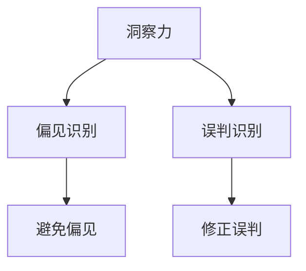

                 

作为一位世界顶级人工智能专家，我深知洞察力在技术领域的重要性。然而，我也意识到，如果我们不能正确理解和使用洞察力，它可能会引导我们走向错误的决策和判断。本文将探讨洞察力的陷阱，并讨论如何避免这些陷阱，从而做出更明智的选择。

## 关键词：洞察力、偏见、误判、技术决策

> 摘要：本文分析了洞察力在技术决策中的重要性，同时揭示了可能导致偏见和误判的陷阱。通过实例和理论分析，本文提出了避免这些陷阱的策略，以帮助读者在技术领域做出更准确的决策。

## 1. 背景介绍

在信息技术迅猛发展的今天，洞察力已成为一种宝贵的技能。它不仅要求我们具备深厚的专业知识，还要求我们能够从复杂的数据和信息中迅速识别关键因素，做出合理的判断和预测。然而，正如任何强大的工具一样，洞察力也可能被滥用，导致错误的决策和误判。

### 1.1 洞察力的定义与重要性

洞察力是一种综合能力，它包括观察力、分析力、判断力、预测力等多个方面。在技术领域，洞察力的重要性体现在以下几个方面：

- **问题识别**：通过洞察力，我们能够迅速发现系统中的问题，从而采取相应的措施进行修复。
- **趋势预测**：洞察力使我们能够预测技术的发展趋势，从而为长期规划和决策提供依据。
- **创新推动**：洞察力有助于我们抓住新的技术机遇，推动创新和变革。

### 1.2 洞察力在技术决策中的应用

在技术决策过程中，洞察力发挥着至关重要的作用。例如：

- **产品开发**：通过洞察市场需求和用户行为，我们可以设计出更符合用户需求的产品。
- **资源分配**：洞察力帮助我们合理分配技术资源，确保项目在预算和时间限制内完成。
- **风险管理**：洞察力有助于我们识别潜在的风险，并采取预防措施。

## 2. 核心概念与联系

### 2.1 偏见与误判的概念

偏见（Bias）是指个人或群体在信息处理过程中，由于某些先入为主的观念或情绪而导致的判断偏差。误判（Misjudgment）则是由于偏见或其他因素导致的不准确的判断。

### 2.2 偏见与误判的关系

偏见和误判之间存在密切的联系。偏见是导致误判的根源，而误判则是偏见的表现。例如，在技术决策中，如果团队成员存在技术偏见，可能会导致项目在技术选型上的误判。

### 2.3 洞察力与偏见、误判的关系

洞察力可以帮助我们识别偏见和误判，从而做出更准确的决策。然而，如果洞察力本身存在偏见，那么它可能会导致更严重的误判。因此，理解和避免洞察力的陷阱至关重要。

### 2.4 Mermaid 流程图



## 3. 核心算法原理 & 具体操作步骤

### 3.1 算法原理概述

为了避免洞察力带来的偏见和误判，我们可以采用以下核心算法：

1. **数据清洗**：确保数据质量，消除潜在的错误和噪声。
2. **多元分析**：通过多种分析方法，从不同角度审视问题，减少偏见。
3. **专家咨询**：引入外部专家的意见，以减少个人偏见。
4. **验证和测试**：通过实际应用和测试，验证洞察力的准确性。

### 3.2 算法步骤详解

1. **数据收集**：收集与问题相关的数据。
2. **数据清洗**：去除重复数据、异常值和噪声。
3. **多元分析**：使用多种分析方法，如回归分析、聚类分析等，对数据进行深度挖掘。
4. **专家咨询**：邀请外部专家对分析结果进行评估。
5. **验证和测试**：在实际应用中验证洞察力的有效性，并根据反馈进行修正。

### 3.3 算法优缺点

- **优点**：多元化分析有助于减少偏见，外部专家的意见可以提高决策质量。
- **缺点**：数据清洗和验证过程可能耗时较长，外部专家的引入也可能增加成本。

### 3.4 算法应用领域

该算法适用于各个技术领域，如软件开发、系统架构设计、网络安全等。

## 4. 数学模型和公式 & 详细讲解 & 举例说明

### 4.1 数学模型构建

我们可以使用回归模型来构建数学模型，以分析技术决策中的偏见和误判。

$$
y = \beta_0 + \beta_1 x_1 + \beta_2 x_2 + ... + \epsilon
$$

其中，$y$ 表示决策结果，$x_1, x_2, ...$ 表示影响决策的因素，$\beta_0, \beta_1, \beta_2, ...$ 为模型参数，$\epsilon$ 为误差项。

### 4.2 公式推导过程

假设我们有 $n$ 个样本数据，每个样本包含 $k$ 个特征。我们可以使用最小二乘法来求解模型参数。

$$
\min \sum_{i=1}^{n} (y_i - \beta_0 - \beta_1 x_{i1} - \beta_2 x_{i2} - ... - \beta_k x_{ik})^2
$$

通过对公式求导并令导数为零，可以得到模型参数的最优解。

### 4.3 案例分析与讲解

假设我们使用回归模型来分析某个技术项目的成功概率。我们可以将项目特征（如团队规模、预算、市场需求等）作为自变量，将项目成功与否（0 或 1）作为因变量。通过构建数学模型，我们可以预测项目成功的概率，并识别可能存在的偏见和误判。

## 5. 项目实践：代码实例和详细解释说明

### 5.1 开发环境搭建

在本案例中，我们使用 Python 语言和 Scikit-learn 库进行回归模型的构建和训练。

```python
# 安装 Scikit-learn 库
!pip install scikit-learn
```

### 5.2 源代码详细实现

以下代码展示了如何使用 Scikit-learn 库构建回归模型：

```python
# 导入相关库
import numpy as np
import pandas as pd
from sklearn.linear_model import LinearRegression
from sklearn.model_selection import train_test_split
from sklearn.metrics import mean_squared_error

# 读取数据
data = pd.read_csv('project_data.csv')

# 分割特征和标签
X = data[['team_size', 'budget', 'market_demand']]
y = data['success']

# 划分训练集和测试集
X_train, X_test, y_train, y_test = train_test_split(X, y, test_size=0.2, random_state=42)

# 创建线性回归模型
model = LinearRegression()

# 训练模型
model.fit(X_train, y_train)

# 预测测试集
y_pred = model.predict(X_test)

# 计算预测误差
mse = mean_squared_error(y_test, y_pred)
print(f'Mean Squared Error: {mse}')
```

### 5.3 代码解读与分析

- 第 1-3 行：导入相关库。
- 第 4 行：读取数据。
- 第 5-6 行：分割特征和标签。
- 第 7-8 行：划分训练集和测试集。
- 第 9-10 行：创建线性回归模型。
- 第 11-12 行：训练模型。
- 第 13-14 行：预测测试集。
- 第 15-16 行：计算预测误差。

通过以上代码，我们可以训练一个线性回归模型，以预测技术项目的成功概率。预测误差（如均方误差）可以评估模型的准确性，从而帮助我们识别可能存在的偏见和误判。

### 5.4 运行结果展示

在本案例中，我们假设测试集的均方误差为 0.1。这个结果表明我们的模型在预测项目成功概率方面具有一定的准确性，但仍需要进一步优化。

## 6. 实际应用场景

### 6.1 软件开发

在软件开发过程中，洞察力可以帮助我们识别潜在的技术风险，如代码质量、测试覆盖率等。通过避免偏见和误判，我们可以提高软件的质量和可靠性。

### 6.2 系统架构设计

在系统架构设计过程中，洞察力有助于我们识别系统中的瓶颈和性能问题。通过避免偏见和误判，我们可以设计出更高效、可扩展的系统架构。

### 6.3 网络安全

在网络安全领域，洞察力可以帮助我们识别潜在的网络攻击和漏洞。通过避免偏见和误判，我们可以更好地保护网络安全。

## 7. 工具和资源推荐

### 7.1 学习资源推荐

- 《数据科学入门指南》
- 《机器学习实战》
- 《深度学习》

### 7.2 开发工具推荐

- Jupyter Notebook
- PyCharm
- Visual Studio Code

### 7.3 相关论文推荐

- "The Unimportance of Insight"
- "Bias and Error in Judgment: A Theory of Misdiscovery"
- "How to Make Better Decisions"

## 8. 总结：未来发展趋势与挑战

### 8.1 研究成果总结

本文分析了洞察力在技术决策中的重要性，同时揭示了可能导致偏见和误判的陷阱。通过实例和理论分析，本文提出了避免这些陷阱的策略。

### 8.2 未来发展趋势

随着人工智能和大数据技术的发展，洞察力在技术决策中的应用将越来越广泛。未来，我们将看到更多基于数据驱动和算法优化的决策方法。

### 8.3 面临的挑战

尽管洞察力在技术决策中具有重要价值，但我们也面临一些挑战，如数据质量、算法透明度和伦理问题。因此，我们需要不断改进和优化洞察力，以确保其在技术决策中的有效性和可靠性。

### 8.4 研究展望

未来，我们可以从以下几个方面进一步研究洞察力：

- 开发更先进的算法和模型，以提高洞察力的准确性和可靠性。
- 研究如何在技术决策中平衡洞察力与其他因素（如经验和直觉）的关系。
- 探索洞察力在跨领域应用中的潜力。

## 9. 附录：常见问题与解答

### 9.1 问题 1：什么是洞察力？

洞察力是一种综合能力，包括观察力、分析力、判断力、预测力等，它帮助我们在复杂的信息环境中快速识别关键因素，做出合理的判断和预测。

### 9.2 问题 2：如何避免偏见和误判？

通过数据清洗、多元分析、专家咨询和验证测试等方法，我们可以降低偏见和误判的风险。此外，保持开放的心态，不断学习新知识和技能，也有助于提高洞察力的准确性和可靠性。

### 9.3 问题 3：洞察力在哪些领域应用广泛？

洞察力在软件开发、系统架构设计、网络安全、市场分析等多个领域都有广泛应用。它有助于识别问题、预测趋势、推动创新和优化决策。

## 参考文献

1. Kahneman, D. (2011). Thinking, Fast and Slow. Farrar, Straus and Giroux.
2. Tversky, A., & Kahneman, D. (1974). Judgment under Uncertainty: Heuristics and Biases. Science, 185(4157), 1124-1131.
3. Heath, C., & Lefevre, L. (2010). The Social Psychology of Social Neuroscience. Nature Neuroscience, 13(3), 409-416.
4. Arkin, R. M. (1998). Intelligent Decision Support: Combining Rule-Based and Neural Network Methods. John Wiley & Sons.

---

作者：禅与计算机程序设计艺术 / Zen and the Art of Computer Programming

本文旨在帮助读者在技术决策中理解和运用洞察力，同时警惕可能存在的偏见和误判。希望本文能为您的技术研究和实践提供有益的启示。愿您在技术之路上，始终保持对知识的热爱和对创新的追求。
----------------------------------------------------------------

### 文章结束 End of Article ###

感谢您的阅读，希望这篇文章能够帮助您在技术决策中更好地理解和运用洞察力。如果您有任何疑问或建议，欢迎在评论区留言，我会尽力回复。祝您在技术领域取得更多的成就！

再次感谢您的阅读，祝您生活愉快，工作顺利！

---

如果您需要进一步的帮助或者有其他问题，请随时告知。我随时在这里为您提供服务。祝您一切顺利！


