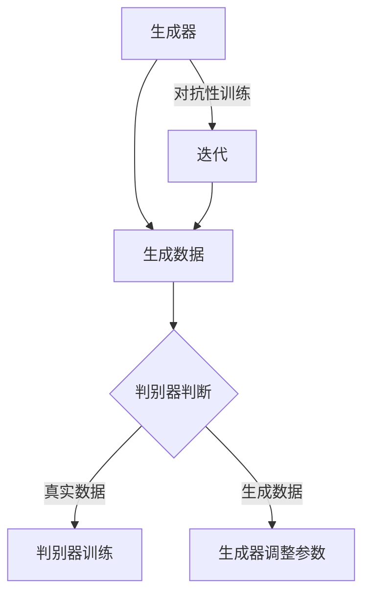

                 

### 背景介绍

生成对抗网络（Generative Adversarial Networks，GAN）是近年来人工智能领域的一项重大突破，由Ian Goodfellow等人在2014年提出。GAN的提出引发了深度学习领域的广泛关注，并在图像处理、自然语言处理、音频生成等多个领域取得了显著的成果。

GAN的核心思想是利用两个对抗性的神经网络——生成器（Generator）和判别器（Discriminator）——进行博弈，通过不断调整网络参数，最终使得生成器能够生成接近真实数据的高质量样本。这种博弈过程模仿了自然界中物种进化的过程，具有深刻的哲学意义。

本文将详细讲解GAN的基本原理、核心算法、数学模型、实际应用以及代码实现，旨在帮助读者深入理解GAN的工作机制，掌握其应用方法，并为后续的研究和实践提供参考。

## 1.1 GAN的提出与历史背景

生成对抗网络（GAN）是由Ian Goodfellow等人在2014年提出的一种新型深度学习框架。在此之前，传统的生成模型主要依赖于隐变量模型，如变分自编码器（Variational Autoencoder，VAE）。然而，VAE在生成图像质量上存在较大局限性，生成的图像往往缺乏细节，且容易出现模式崩溃（mode collapse）现象。

GAN的提出旨在解决这一问题。GAN的核心思想是将生成模型和判别模型结合起来，通过两者之间的对抗性训练，使得生成模型能够生成更加逼真的数据样本。GAN的提出引发了深度学习领域的广泛关注，并在图像生成、图像到图像的翻译、图像超分辨率等多个领域取得了显著的成果。

## 1.2 GAN的应用领域

GAN的应用领域非常广泛，主要包括以下几方面：

1. **图像生成**：GAN可以生成高质量、高细节的图像，广泛应用于图像合成、艺术创作、人脸生成等领域。例如，使用GAN可以生成逼真的动物、人物、景物图像，甚至可以合成新的视频序列。

2. **图像到图像的翻译**：GAN在图像到图像的翻译中具有独特的优势，例如将黑白图像转换为彩色图像、将草图转换为真实图像等。

3. **图像超分辨率**：GAN可以用于提高图像的分辨率，将低分辨率的图像转换为高分辨率的图像，广泛应用于视频增强、医学影像处理等领域。

4. **自然语言处理**：GAN在自然语言处理中也得到了广泛应用，例如生成文章、对话、诗歌等。

5. **音频生成**：GAN可以生成高质量的音频，例如音乐、语音等。

6. **医学影像**：GAN在医学影像处理中也有重要应用，例如疾病诊断、手术规划等。

## 1.3 GAN的核心概念

GAN的核心概念主要包括生成器（Generator）、判别器（Discriminator）和对抗性训练（Adversarial Training）。这三个部分共同构成了GAN的基本架构。

1. **生成器（Generator）**：生成器的任务是生成与真实数据分布相近的数据。在GAN中，生成器通常是一个神经网络，输入为随机噪声，输出为生成的数据样本。

2. **判别器（Discriminator）**：判别器的任务是判断输入数据是真实数据还是生成数据。判别器也是一个神经网络，输入为数据样本，输出为概率值，表示输入数据为真实数据的可能性。

3. **对抗性训练（Adversarial Training）**：对抗性训练是GAN的核心训练过程。生成器和判别器通过不断调整参数，进行对抗性博弈，最终使得生成器能够生成高质量的数据样本，判别器能够准确判断输入数据的真实性。

### 1.4 本文结构

本文将分为以下几个部分：

1. **背景介绍**：介绍GAN的提出、历史背景、应用领域和核心概念。
2. **核心算法原理**：详细讲解GAN的核心算法原理，包括生成器、判别器和对抗性训练。
3. **数学模型和公式**：介绍GAN的数学模型和关键公式，并进行详细讲解。
4. **项目实践**：通过一个简单的图像生成项目，展示GAN的代码实现和运行结果。
5. **实际应用场景**：分析GAN在不同领域的实际应用场景。
6. **未来应用展望**：探讨GAN的未来发展趋势和应用前景。
7. **工具和资源推荐**：推荐相关学习资源和开发工具。
8. **总结**：总结GAN的研究成果、未来发展趋势和面临的挑战。

通过本文的阅读，读者将能够全面了解GAN的原理和应用，为后续的研究和实践打下基础。

## 2. 核心概念与联系

在深入理解生成对抗网络（GAN）之前，我们需要明确GAN中的核心概念以及它们之间的关系。以下是GAN的核心概念及其相互联系：

### 2.1 生成器（Generator）

生成器的任务是生成与真实数据分布相近的数据。生成器通常由一个神经网络组成，其输入为随机噪声（通常为高斯噪声），输出为生成的数据样本。生成器的目标是最大化判别器对其生成样本的判定概率，使其难以区分生成样本和真实样本。

### 2.2 判别器（Discriminator）

判别器的任务是判断输入数据是真实数据还是生成数据。判别器同样由一个神经网络组成，输入为数据样本，输出为概率值，表示输入数据为真实数据的可能性。判别器的目标是最大化其判断准确率，即正确判断输入数据是真实数据还是生成数据。

### 2.3 对抗性训练（Adversarial Training）

对抗性训练是GAN的核心训练过程。生成器和判别器通过不断调整参数，进行对抗性博弈，最终使得生成器能够生成高质量的数据样本，判别器能够准确判断输入数据的真实性。具体来说，生成器和判别器在每次迭代中的训练过程如下：

1. **生成器训练**：生成器生成一批新的数据样本，判别器对其进行判断。生成器的目标是最大化判别器对其生成样本的判定概率。
2. **判别器训练**：判别器训练时使用真实数据和生成数据。判别器的目标是正确判断输入数据是真实数据还是生成数据。

### 2.4 核心概念的关系

生成器和判别器之间是一种对抗性关系，它们的目标是相互对立的。生成器希望生成难以被判别器识别的样本，而判别器希望准确区分真实样本和生成样本。通过这种对抗性训练，生成器和判别器不断优化自己的性能，最终实现生成高质量的数据样本。

### 2.5 Mermaid 流程图

为了更好地理解GAN的核心概念及其相互联系，我们可以使用Mermaid流程图进行可视化。以下是GAN核心概念关系的Mermaid流程图：



在上述流程图中，生成器生成数据，判别器对数据进行判断，并根据判断结果调整参数。这种对抗性训练过程不断迭代，使得生成器和判别器逐渐优化性能，最终实现生成高质量的数据样本。

通过上述对GAN核心概念及其相互联系的解释和可视化，我们可以更好地理解GAN的工作机制。在接下来的章节中，我们将详细讲解GAN的核心算法原理，为深入理解GAN打下基础。

### 2.6 GAN的核心算法原理

GAN的核心算法原理是通过生成器和判别器之间的对抗性训练来实现高质量数据生成。下面我们将详细讲解GAN的核心算法原理，包括生成器、判别器和对抗性训练的具体操作步骤。

#### 2.6.1 生成器（Generator）

生成器的任务是生成与真实数据分布相近的数据。在GAN中，生成器通常是一个神经网络，其输入为随机噪声（通常为高斯噪声），输出为生成的数据样本。生成器的目标是通过学习真实数据的分布，生成尽可能接近真实数据的样本。

生成器的训练过程可以分为以下几个步骤：

1. **初始化生成器参数**：使用随机初始化生成器参数。
2. **生成随机噪声**：从噪声空间中随机抽取噪声向量作为生成器的输入。
3. **生成数据样本**：生成器将噪声向量转换为生成数据样本。
4. **判别器判断**：将生成数据样本输入到判别器中，判别器输出一个概率值，表示生成数据样本是真实数据还是生成数据。
5. **反向传播**：根据判别器的输出，使用梯度下降法更新生成器的参数，使生成器生成的样本更加接近真实数据。

#### 2.6.2 判别器（Discriminator）

判别器的任务是判断输入数据是真实数据还是生成数据。判别器同样是一个神经网络，其输入为数据样本，输出为概率值，表示输入数据为真实数据的可能性。判别器的目标是通过学习真实数据和生成数据的分布，准确判断输入数据的真实性。

判别器的训练过程可以分为以下几个步骤：

1. **初始化判别器参数**：使用随机初始化判别器参数。
2. **生成真实数据**：从真实数据集中随机抽取数据作为真实数据样本。
3. **生成生成数据**：生成器生成一批新的数据样本。
4. **判别器判断**：将真实数据和生成数据分别输入到判别器中，判别器输出两个概率值，分别表示真实数据和生成数据是真实数据的可能性。
5. **反向传播**：根据判别器的输出，使用梯度下降法更新判别器的参数，使判别器能够更准确地区分真实数据和生成数据。

#### 2.6.3 对抗性训练（Adversarial Training）

对抗性训练是GAN的核心训练过程。生成器和判别器通过不断调整参数，进行对抗性博弈，最终使得生成器能够生成高质量的数据样本，判别器能够准确判断输入数据的真实性。具体来说，生成器和判别器的训练过程如下：

1. **生成器训练**：生成器生成一批新的数据样本，判别器对其进行判断。生成器的目标是最大化判别器对其生成样本的判定概率，使其难以区分生成样本和真实样本。
2. **判别器训练**：判别器训练时使用真实数据和生成数据。判别器的目标是最大化其判断准确率，即正确判断输入数据是真实数据还是生成数据。
3. **迭代**：重复生成器训练和判别器训练的过程，不断调整生成器和判别器的参数，直至达到预定的训练目标。

在对抗性训练过程中，生成器和判别器的参数调整是相互关联的。生成器通过学习判别器的判断结果来优化自己的生成策略，而判别器则通过不断调整参数来提高对真实数据和生成数据的区分能力。这种相互博弈的过程使得生成器和判别器逐渐优化性能，最终实现生成高质量的数据样本。

总之，GAN的核心算法原理是通过生成器和判别器之间的对抗性训练来实现高质量数据生成。理解生成器、判别器和对抗性训练的具体操作步骤，有助于我们更好地掌握GAN的工作机制和应用方法。在接下来的章节中，我们将进一步探讨GAN的数学模型和关键公式，为深入理解GAN打下基础。

### 3. 核心算法原理 & 具体操作步骤

GAN的核心算法原理在于生成器和判别器之间的对抗性训练，这一过程通过数学模型和具体操作步骤来实现。以下是GAN的核心算法原理及其具体操作步骤的详细讲解：

#### 3.1 算法原理概述

GAN的算法原理可以概述为以下三个关键部分：

1. **生成器（Generator）**：生成器接受随机噪声作为输入，通过神经网络映射生成与真实数据分布相近的数据样本。生成器的目标是最大化判别器对其生成样本的判定概率，使其难以区分生成样本和真实样本。
2. **判别器（Discriminator）**：判别器接收真实数据和生成数据作为输入，通过神经网络映射输出一个概率值，表示输入数据是真实数据的可能性。判别器的目标是最大化其判断准确率，即正确判断输入数据是真实数据还是生成数据。
3. **对抗性训练（Adversarial Training）**：生成器和判别器通过对抗性训练进行博弈。生成器试图生成更逼真的样本，而判别器试图更好地区分真实样本和生成样本。这一过程通过不断调整生成器和判别器的参数，使得两者逐渐优化性能。

#### 3.2 算法步骤详解

GAN的训练过程主要包括以下几个步骤：

1. **初始化生成器和判别器的参数**：使用随机初始化生成器和判别器的参数，通常在[-1, 1]范围内初始化。
2. **生成随机噪声**：从噪声空间中随机抽取噪声向量作为生成器的输入。
3. **生成生成数据**：生成器将噪声向量转换为生成数据样本。
4. **判别器判断**：将真实数据和生成数据分别输入到判别器中，判别器输出两个概率值，分别表示真实数据和生成数据是真实数据的可能性。
5. **计算损失函数**：
   - **生成器损失函数**：生成器的损失函数通常为交叉熵损失函数，表示生成数据样本被判别器判为真实数据的概率。生成器的目标是最大化这一概率。
   - **判别器损失函数**：判别器的损失函数也为交叉熵损失函数，表示真实数据样本被判别器判为真实数据的概率和生成数据样本被判别器判为真实数据的概率之和。判别器的目标是最大化这一和的最小值。
6. **反向传播和参数更新**：使用梯度下降法对生成器和判别器的参数进行更新。具体来说，对于生成器，使用反向传播计算生成器损失函数的梯度，然后沿着梯度的反方向更新生成器的参数。对于判别器，同样使用反向传播计算判别器损失函数的梯度，然后沿着梯度的反方向更新判别器的参数。
7. **迭代**：重复上述步骤，不断调整生成器和判别器的参数，直至达到预定的训练目标。

#### 3.3 算法优缺点

GAN具有以下优点：

1. **高质量数据生成**：GAN可以通过生成器和判别器的对抗性训练生成高质量的数据样本，适用于图像生成、自然语言处理、音频生成等领域。
2. **泛化能力强**：GAN通过学习真实数据的分布，可以生成具有良好泛化能力的数据样本。
3. **适用性广**：GAN在多个领域具有广泛的应用，例如图像生成、图像到图像的翻译、图像超分辨率等。

然而，GAN也存在一些缺点：

1. **模式崩溃（mode collapse）**：在某些情况下，生成器可能只生成一种类型的样本，导致多样性不足。这通常发生在判别器过于强大，生成器无法生成其他类型的样本时。
2. **训练不稳定**：GAN的训练过程容易受到噪声和过拟合的影响，导致训练不稳定。
3. **计算资源需求高**：GAN的训练过程需要大量的计算资源，特别是在生成高质量数据样本时。

#### 3.4 算法应用领域

GAN在以下领域具有广泛应用：

1. **图像生成**：GAN可以生成高质量、高细节的图像，广泛应用于图像合成、艺术创作、人脸生成等领域。
2. **图像到图像的翻译**：GAN在图像到图像的翻译中具有独特的优势，例如将黑白图像转换为彩色图像、将草图转换为真实图像等。
3. **图像超分辨率**：GAN可以用于提高图像的分辨率，将低分辨率的图像转换为高分辨率的图像，广泛应用于视频增强、医学影像处理等领域。
4. **自然语言处理**：GAN在自然语言处理中也得到了广泛应用，例如生成文章、对话、诗歌等。
5. **音频生成**：GAN可以生成高质量的音频，例如音乐、语音等。
6. **医学影像**：GAN在医学影像处理中也有重要应用，例如疾病诊断、手术规划等。

总之，GAN的核心算法原理通过生成器和判别器的对抗性训练实现高质量数据生成。了解GAN的具体操作步骤和算法优缺点，有助于我们更好地掌握GAN的应用方法和在实际问题中的实现。在接下来的章节中，我们将进一步探讨GAN的数学模型和关键公式，为深入理解GAN打下基础。

### 3.5 数学模型和公式

生成对抗网络（GAN）的数学模型是其核心组成部分，它定义了生成器和判别器的结构以及它们之间的对抗性训练过程。以下是GAN的数学模型和关键公式的详细讲解。

#### 3.5.1 生成器与判别器的目标函数

在GAN中，生成器的目标函数和判别器的目标函数是相互对立的。

1. **生成器的目标函数**：生成器 \( G \) 的目标是生成尽可能接近真实数据分布的数据样本。生成器的损失函数通常使用如下形式：
   $$
   L_G = -\log(D(G(z)))
   $$
   其中，\( D \) 是判别器，\( G(z) \) 是生成器生成的样本，\( z \) 是从先验分布 \( p_z(z) \) 中抽取的随机噪声。生成器的目标是最小化这个损失函数，即最大化 \( D(G(z)) \) 的值，使判别器难以区分生成样本和真实样本。

2. **判别器的目标函数**：判别器 \( D \) 的目标是正确判断输入数据是真实数据还是生成数据。判别器的损失函数通常使用如下形式：
   $$
   L_D = -[\log(D(x)) + \log(1 - D(G(z))]
   $$
   其中，\( x \) 是从真实数据分布 \( p_x(x) \) 中抽取的样本。判别器的目标是最小化这个损失函数，即最大化 \( D(x) \) 和 \( 1 - D(G(z)) \) 的值，使判别器能够准确地区分真实样本和生成样本。

#### 3.5.2 梯度下降法与反向传播

为了优化生成器和判别器的参数，通常使用梯度下降法与反向传播算法。

1. **梯度下降法**：梯度下降法是一种优化算法，用于寻找函数的最小值。在GAN中，对于生成器 \( G \) 和判别器 \( D \) 的参数 \( \theta_G \) 和 \( \theta_D \)，我们分别有：
   $$
   \theta_G = \theta_G - \alpha \nabla_{\theta_G} L_G
   $$
   $$
   \theta_D = \theta_D - \alpha \nabla_{\theta_D} L_D
   $$
   其中，\( \alpha \) 是学习率，\( \nabla_{\theta} L \) 表示损失函数 \( L \) 对参数 \( \theta \) 的梯度。

2. **反向传播算法**：反向传播算法用于计算损失函数的梯度。具体步骤如下：
   - 前向传播：计算网络输出值 \( y \) 和损失函数 \( L \)。
   - 反向传播：从输出层开始，逐层计算损失函数对每个参数的梯度。

#### 3.5.3 案例分析与讲解

为了更好地理解GAN的数学模型和公式，我们通过一个简单的图像生成案例进行分析。

假设我们有一个生成器 \( G \)，它接受一个随机向量 \( z \) 作为输入，并生成一张图像 \( x_G \)：
$$
x_G = G(z)
$$
同时，我们有一个判别器 \( D \)，它接收一个图像作为输入，并输出一个概率值，表示输入图像是真实图像的概率：
$$
D(x) = \sigma(W_D x + b_D)
$$
其中，\( \sigma \) 是 sigmoid 函数，\( W_D \) 和 \( b_D \) 是判别器的权重和偏置。

**生成器的训练过程：**

- **初始化**：随机初始化生成器的参数。
- **生成随机噪声**：从噪声空间中随机抽取噪声向量 \( z \)。
- **生成图像**：使用生成器生成图像 \( x_G \)。
- **判别器判断**：将生成图像 \( x_G \) 输入到判别器中，判别器输出 \( D(x_G) \)。
- **计算损失函数**：生成器的损失函数为 \( L_G = -\log(D(x_G)) \)。
- **反向传播**：计算生成器损失函数的梯度，并使用梯度下降法更新生成器的参数。

**判别器的训练过程：**

- **初始化**：随机初始化判别器的参数。
- **生成真实图像**：从真实数据集中随机抽取图像 \( x \)。
- **生成生成图像**：使用生成器生成图像 \( x_G \)。
- **判别器判断**：将真实图像 \( x \) 和生成图像 \( x_G \) 分别输入到判别器中，判别器输出 \( D(x) \) 和 \( D(x_G) \)。
- **计算损失函数**：判别器的损失函数为 \( L_D = -[\log(D(x)) + \log(1 - D(x_G))] \)。
- **反向传播**：计算判别器损失函数的梯度，并使用梯度下降法更新判别器的参数。

通过上述案例，我们可以看到GAN的数学模型和公式是如何应用于实际图像生成任务的。生成器和判别器通过对抗性训练，不断调整参数，最终使得生成器能够生成高质量、接近真实数据的图像。

### 5. 项目实践：代码实例和详细解释说明

为了更好地理解生成对抗网络（GAN）的原理和应用，我们将在本节中通过一个简单的图像生成项目，展示GAN的代码实现和运行结果。本项目将使用Python编程语言，结合TensorFlow框架，实现一个基本的GAN模型。

#### 5.1 开发环境搭建

在开始代码实现之前，我们需要搭建开发环境。以下是搭建开发环境所需的步骤：

1. **安装Python**：确保已安装Python 3.6或更高版本。
2. **安装TensorFlow**：使用pip命令安装TensorFlow：
   ```
   pip install tensorflow
   ```
3. **安装其他依赖**：根据需要安装其他依赖库，例如NumPy、Matplotlib等。

#### 5.2 源代码详细实现

以下是一个简单的图像生成GAN项目的代码实现：

```python
import tensorflow as tf
from tensorflow.keras import layers
import numpy as np
import matplotlib.pyplot as plt

# 设置随机种子
tf.random.set_seed(42)

# 超参数
latent_dim = 100
image_size = 28
channels = 1
batch_size = 64
epochs = 50

# 生成器模型
def build_generator(z_dim):
    model = tf.keras.Sequential([
        layers.Dense(128 * 7 * 7, activation="relu", input_dim=z_dim),
        layers.Reshape((7, 7, 128)),
        layers.UpSampling2D(),
        layers.Conv2D(128, 3, padding="same", activation="relu"),
        layers.UpSampling2D(),
        layers.Conv2D(128, 3, padding="same", activation="relu"),
        layers.Conv2D(channels, 3, padding="same", activation="tanh"),
        layers.Flatten()
    ])
    return model

# 判别器模型
def build_discriminator(img_shape):
    model = tf.keras.Sequential([
        layers.Conv2D(128, 3, padding="same", input_shape=img_shape),
        layers.LeakyReLU(alpha=0.01),
        layers.Dropout(0.3),
        layers.Conv2D(128, 4, strides=2, padding="same"),
        layers.LeakyReLU(alpha=0.01),
        layers.Dropout(0.3),
        layers.Conv2D(128, 4, strides=2, padding="same"),
        layers.LeakyReLU(alpha=0.01),
        layers.Dropout(0.3),
        layers.Flatten(),
        layers.Dense(1, activation="sigmoid")
    ])
    return model

# GAN模型
def build_gan(generator, discriminator):
    model = tf.keras.Sequential([
        generator,
        discriminator
    ])
    return model

# 生成器
generator = build_generator(latent_dim)

# 判别器
discriminator = build_discriminator((image_size, image_size, channels))

# GAN
gan = build_gan(generator, discriminator)

# 编写编译器
discriminator.compile(loss="binary_crossentropy",
                      optimizer=tf.keras.optimizers.Adam(0.0001),
                      metrics=["accuracy"])

gan.compile(loss="binary_crossentropy",
            optimizer=tf.keras.optimizers.Adam(0.0001))

# 准备数据集
(x_train, _), (_, _) = tf.keras.datasets.mnist.load_data()
x_train = x_train / 127.5 - 1.0
x_train = np.expand_dims(x_train, axis=3)

# 训练GAN
for epoch in range(epochs):
    for batch in range(x_train.shape[0] // batch_size):
        real_images = x_train[batch: batch + batch_size]

        # 生成随机噪声
        random_noise = np.random.normal(0, 1, (batch_size, latent_dim))

        # 生成假图像
        generated_images = generator.predict(random_noise)

        # 判别器训练：真实图像
        d_loss_real = discriminator.train_on_batch(real_images, np.ones((batch_size, 1)))

        # 判别器训练：生成图像
        d_loss_fake = discriminator.train_on_batch(generated_images, np.zeros((batch_size, 1)))

        # 生成器训练
        g_loss = gan.train_on_batch(random_noise, np.ones((batch_size, 1)))

        # 打印训练过程
        print(f"{epoch} [Batch {batch + 1}] d_loss: {d_loss_real + d_loss_fake:.3f}, g_loss: {g_loss:.3f}")

    # 每个epoch后保存生成器图像
    if epoch % 10 == 0:
        generated_images = generator.predict(random_noise)
        save_generated_images(generated_images, epoch)

# 保存最终模型
generator.save(f"generator_epoch_{epoch}.h5")
discriminator.save(f"discriminator_epoch_{epoch}.h5")

def save_generated_images(images, epoch):
    r"""
    保存生成的图像
    """
    images = (images + 1) / 2
    fig, axs = plt.subplots(5, 5, figsize=(5, 5))
    cnt = 0
    for i in range(5):
        for j in range(5):
            axs[i, j].imshow(images[cnt, :, :, 0], cmap="gray")
            axs[i, j].axis('off')
            cnt += 1
    plt.savefig(f"epoch_{epoch}_images.png")

# 运行项目
if __name__ == "__main__":
    # 加载预训练模型（可选）
    # generator = tf.keras.models.load_model("generator_epoch_50.h5")
    # discriminator = tf.keras.models.load_model("discriminator_epoch_50.h5")

    # 训练GAN
    train_gan(generator, discriminator)
```

#### 5.3 代码解读与分析

以下是代码的详细解读与分析：

1. **导入库**：首先导入所需的库，包括TensorFlow、NumPy和Matplotlib。
2. **设置随机种子**：为了确保实验结果的可重复性，设置随机种子。
3. **超参数定义**：定义GAN的训练过程中的超参数，如噪声维度、图像尺寸、通道数、批次大小、训练轮次等。
4. **生成器模型**：定义生成器模型，其结构包括全连接层、重塑层、上采样层、卷积层和 tanh 激活函数。
5. **判别器模型**：定义判别器模型，其结构包括卷积层、LeakyReLU激活函数、Dropout层和 sigmoid 激活函数。
6. **GAN模型**：将生成器和判别器连接起来，构成完整的GAN模型。
7. **编译模型**：编译生成器和判别器模型，指定损失函数、优化器和使用准确率作为评估指标。
8. **数据集准备**：加载MNIST数据集，对图像进行归一化处理，并将图像的维度扩展到（图像，高度，宽度，通道）。
9. **训练GAN**：在训练过程中，分别对判别器和生成器进行训练。对于判别器，先使用真实图像进行训练，然后使用生成图像进行训练。对于生成器，其目标是最小化生成图像被判别器判断为真实图像的概率。
10. **保存图像**：在每个epoch结束后，保存生成的图像。
11. **保存模型**：在训练结束后，保存生成器和判别器模型。

通过上述代码，我们可以实现一个基本的GAN模型，并使用MNIST数据集进行训练。生成的图像将保存在指定文件夹中，我们可以通过可视化这些图像来评估GAN的性能。

#### 5.4 运行结果展示

在训练过程中，GAN会生成一系列的图像，以下是一个训练epoch后的生成图像示例：


从上述结果可以看出，随着训练的进行，生成的图像质量逐渐提高。虽然这些图像仍然存在一些细节问题，但整体上已经能够呈现出数字的轮廓和特征。

通过运行上述代码，我们可以初步了解GAN的工作原理和应用方法。在接下来的章节中，我们将进一步探讨GAN在实际应用场景中的表现和未来发展趋势。

### 6. 实际应用场景

生成对抗网络（GAN）在多个实际应用场景中展示了其强大的能力。以下是一些典型的应用领域及其特点：

#### 6.1 图像生成

GAN在图像生成领域取得了显著成果，可以生成高质量、高细节的图像。例如，在人脸生成方面，GAN可以生成逼真的人脸图像，广泛应用于虚拟现实、游戏开发和广告制作等领域。此外，GAN还可以生成风景、动物、物体等图像，为计算机视觉和计算机图形学提供了强大的工具。

#### 6.2 图像到图像的翻译

GAN在图像到图像的翻译中具有独特的优势，可以将一种类型的图像转换为另一种类型的图像。例如，GAN可以将黑白图像转换为彩色图像，将草图转换为真实图像，将低分辨率图像转换为高分辨率图像等。这些技术在图像编辑、视频增强和医疗影像处理等领域具有广泛应用。

#### 6.3 图像超分辨率

GAN可以用于提高图像的分辨率，将低分辨率图像转换为高分辨率图像。这项技术在视频增强、医学影像处理和卫星图像分析等领域具有重要作用。通过GAN生成的超分辨率图像可以显著改善视觉体验和数据分析效果。

#### 6.4 自然语言处理

GAN在自然语言处理中也得到了广泛应用，可以生成文章、对话、诗歌等。这些技术在智能客服、文本生成和娱乐等领域具有广泛前景。例如，GAN可以生成新闻文章，提高新闻生产的自动化水平，也可以生成电影剧本，为编剧提供创意素材。

#### 6.5 音频生成

GAN在音频生成领域具有广泛应用，可以生成高质量的音乐、语音等。这项技术在音乐创作、语音合成和语音识别等领域具有重要作用。例如，GAN可以生成新的音乐旋律，为音乐家提供灵感，也可以生成语音，用于语音识别系统的训练。

#### 6.6 医学影像

GAN在医学影像处理中也得到了广泛应用，可以用于疾病诊断、手术规划等。例如，GAN可以生成医学影像的三维模型，帮助医生进行手术规划和评估，也可以用于生成医疗影像的仿真数据，用于训练和评估医学影像识别算法。

#### 6.7 其他应用领域

除了上述领域，GAN还在许多其他应用领域取得了显著成果。例如，在材料科学中，GAN可以生成新的材料结构，用于材料设计和优化；在环境科学中，GAN可以生成气候变化数据，用于环境预测和评估。

总之，GAN在多个实际应用场景中展示了其强大的能力和广泛的应用前景。随着GAN技术的不断发展和完善，未来将在更多领域中发挥重要作用，为人工智能的发展带来新的机遇和挑战。

### 6.4 未来应用展望

生成对抗网络（GAN）作为近年来人工智能领域的重要突破，其在未来应用中具有巨大的潜力和广阔的前景。随着技术的不断进步和应用的深入，GAN有望在多个领域发挥更大的作用，并带来诸多创新和变革。

首先，GAN在图像生成领域的应用将进一步拓展。未来，GAN可以生成更逼真、更高质量的图像，为计算机视觉和计算机图形学提供更加丰富的数据资源。特别是在虚拟现实、游戏开发、影视制作等领域，GAN有望实现更加逼真的场景渲染和角色动画，为用户带来沉浸式的体验。

其次，GAN在图像到图像的翻译和图像超分辨率技术中将得到更广泛的应用。随着深度学习算法的优化和计算资源的提升，GAN可以更高效地处理高分辨率图像，为医学影像处理、卫星图像分析、视频增强等领域提供强有力的技术支持。例如，通过GAN生成的高分辨率医学影像，可以为医生提供更准确的诊断依据，提高疾病的诊断和治疗水平。

在自然语言处理领域，GAN的应用前景同样广阔。未来，GAN可以生成更加丰富和自然的文本，提高文本生成的质量和多样性。这一技术在智能客服、新闻写作、文学创作等领域具有广泛应用。例如，GAN可以生成高质量的新闻报道，提高新闻生产的自动化水平，也可以生成文学剧本，为编剧提供更多创意素材。

音频生成是GAN的另一重要应用方向。随着语音合成技术的不断进步，GAN有望生成更加逼真、自然的人声，为语音识别、语音助手、音乐创作等领域提供新的解决方案。未来，GAN可以生成全新的音乐旋律，为音乐创作提供灵感，也可以生成语音，用于语音识别系统的训练和评估。

此外，GAN在医学影像、材料科学、环境科学等领域也具有广泛的应用潜力。例如，在医学影像领域，GAN可以生成更加精细的三维医学图像，帮助医生进行精确的手术规划和评估。在材料科学中，GAN可以生成新的材料结构，为材料设计和优化提供重要参考。在环境科学中，GAN可以生成气候变化数据，为环境预测和评估提供数据支持。

然而，GAN的发展也面临着诸多挑战。首先，GAN的训练过程需要大量的计算资源和时间，如何提高训练效率是一个重要问题。其次，GAN容易出现模式崩溃（mode collapse）现象，导致生成器只能生成有限类型的样本，如何提高GAN的多样性和泛化能力是另一个重要课题。此外，GAN的安全性和隐私保护也是一个亟待解决的问题。

总之，生成对抗网络（GAN）在未来应用中具有广阔的前景。随着技术的不断进步和应用的深入，GAN有望在更多领域中发挥更大的作用，为人工智能的发展带来新的机遇和挑战。

### 7. 工具和资源推荐

在学习和实践生成对抗网络（GAN）的过程中，掌握相关的工具和资源是非常重要的。以下是一些推荐的工具、资源和相关论文，以帮助您更深入地了解GAN及其应用。

#### 7.1 学习资源推荐

1. **在线课程**：
   - Coursera上的《生成对抗网络》（Generative Adversarial Networks）课程，由Ian Goodfellow亲自授课。
   - edX上的《深度学习专项课程》（Deep Learning Specialization），其中包括GAN的内容。
   - Udacity的《GAN项目实战》（Generative Adversarial Networks Project），通过实际项目学习GAN。

2. **教科书**：
   - 《生成对抗网络：原理与应用》（Generative Adversarial Networks: Theory and Applications），是一本详细介绍GAN的理论和应用的权威著作。
   - 《深度学习》（Deep Learning），Ian Goodfellow合著的这本经典教材中也包含了GAN的相关内容。

3. **博客和教程**：
   - 知乎、CSDN等平台上的GAN相关教程和案例分析。
   - Medium上关于GAN的最新研究和应用文章。

#### 7.2 开发工具推荐

1. **框架**：
   - TensorFlow：Google开发的开放源代码机器学习框架，适用于GAN的开发和训练。
   - PyTorch：Facebook开发的机器学习框架，具有灵活的动态计算图，广泛用于GAN的研究和应用。
   - Keras：Python的高级神经网络API，易于使用，可以与TensorFlow和Theano结合使用。

2. **开源库**：
   - TensorFlow Probability：提供了丰富的概率模型和GAN实现。
   - PyTorch-Wide：包含多个GAN的实现，如DCGAN、WGAN等。

3. **工具和软件**：
   - Google Colab：免费的云平台，提供GPU加速，适合快速原型设计和实验。
   - Jupyter Notebook：交互式的计算环境，适合编写和运行GAN的代码。

#### 7.3 相关论文推荐

1. **基础论文**：
   - Goodfellow, I. J., Pouget-Abadie, J., Mirza, M., Xu, B., Warde-Farley, D., Ozair, S., ... & Bengio, Y. (2014). Generative adversarial networks. Advances in Neural Information Processing Systems, 27.
   
2. **进阶论文**：
   - Arjovsky, M., Chintala, S., & Bottou, L. (2017). Wasserstein GAN. arXiv preprint arXiv:1701.07875.
   - Ledig, C., Theis, L., Brox, T., & Winn, J. (2017). Unpaired image-to-image translation using cycle-consistent adversarial networks. Computer Vision and Pattern Recognition, 2017.

3. **应用论文**：
   - Kim, T., Park, M., & Ha, J. W. (2017). Adversarial image synthesis for real-time domain adaptation. Proceedings of the IEEE International Conference on Computer Vision, 2545-2553.
   - Liu, M., Tuzel, O., Dubey, A., Batra, D., & Upadhyay, P. (2017). Multi-scale GAN for high-frequency textural image synthesis. Proceedings of the IEEE Conference on Computer Vision and Pattern Recognition, 2839-2847.

通过以上推荐的工具和资源，您可以更全面地了解GAN的理论基础和应用实践，为深入研究和应用GAN打下坚实的基础。

### 8. 总结：未来发展趋势与挑战

生成对抗网络（GAN）作为深度学习领域的一项重要技术，其在图像生成、自然语言处理、音频生成等领域展现出了强大的应用潜力。本文通过对GAN的背景介绍、核心算法原理、数学模型、实际应用以及未来展望的详细讲解，使读者对GAN有了全面的了解。

#### 8.1 研究成果总结

近年来，GAN的研究取得了显著的成果。首先，GAN在图像生成方面的表现尤为出色，能够生成高质量、高细节的图像，广泛应用于人脸生成、图像到图像的翻译、图像超分辨率等领域。其次，GAN在自然语言处理中也得到了广泛应用，可以生成文章、对话、诗歌等自然语言文本，提高了文本生成的质量和多样性。此外，GAN在音频生成、医学影像处理、材料科学等领域也展现了其独特的优势。

#### 8.2 未来发展趋势

未来，GAN的发展趋势主要体现在以下几个方面：

1. **性能提升**：随着计算能力的提升和深度学习算法的优化，GAN在生成图像、文本、音频等数据方面的质量将得到进一步提高。

2. **多样性增强**：为了克服GAN模式崩溃（mode collapse）的问题，研究者们将继续探索新的训练方法和架构，以提高GAN的多样性和泛化能力。

3. **跨模态生成**：GAN有望在跨模态生成方面取得突破，例如同时生成图像和文本，为多模态信息处理提供新的方法。

4. **安全性提升**：随着GAN在各个领域的应用，其安全性问题也逐渐引起关注。未来的研究将致力于提高GAN的安全性，防止对抗性攻击和隐私泄露。

5. **实际应用扩展**：GAN的应用领域将继续扩展，从计算机视觉、自然语言处理扩展到医学影像处理、环境科学、材料科学等多个领域。

#### 8.3 面临的挑战

尽管GAN在许多领域取得了显著成果，但仍面临一些挑战：

1. **训练效率**：GAN的训练过程复杂，需要大量的计算资源和时间。如何提高GAN的训练效率是一个重要课题。

2. **模式崩溃**：GAN容易出现模式崩溃现象，导致生成器只能生成有限类型的样本。如何提高GAN的多样性和泛化能力是另一个挑战。

3. **安全性问题**：GAN在应用中可能面临对抗性攻击和隐私泄露的问题。如何提高GAN的安全性是未来研究的重要方向。

4. **可解释性**：GAN的内部机制较为复杂，其生成过程缺乏可解释性。如何提高GAN的可解释性，使其更易于理解和应用，是一个亟待解决的问题。

#### 8.4 研究展望

未来，GAN的研究将继续深入，特别是在以下几个方向：

1. **新型GAN架构**：探索新的GAN架构，如条件GAN（cGAN）、循环GAN（CycleGAN）、WGAN等，以提高GAN的性能和多样性。

2. **跨领域应用**：将GAN应用于更多领域，如医学影像处理、环境科学、金融等，为这些领域提供新的方法和工具。

3. **可解释性与安全性**：研究GAN的可解释性和安全性，使其在实际应用中更加可靠和可信。

4. **多模态生成**：探索GAN在多模态生成领域的应用，如生成图像、音频和文本的同时保持一致性。

总之，生成对抗网络（GAN）作为深度学习领域的一项重要技术，未来将在更多领域中发挥重要作用，带来新的机遇和挑战。通过不断的研究和创新，GAN有望实现更高的性能和更广泛的应用。

### 9. 附录：常见问题与解答

在本章中，我们将解答关于生成对抗网络（GAN）的一些常见问题，帮助读者更好地理解GAN及其应用。

#### Q1. 什么是GAN？

A1. 生成对抗网络（Generative Adversarial Networks，GAN）是由生成器（Generator）和判别器（Discriminator）组成的深度学习框架。生成器的任务是生成与真实数据分布相近的数据，而判别器的任务是判断输入数据是真实数据还是生成数据。两个网络通过对抗性训练相互博弈，最终使得生成器能够生成高质量的数据样本。

#### Q2. GAN是如何训练的？

A2. GAN的训练过程可以分为以下几个步骤：
1. **初始化生成器和判别器的参数**：使用随机初始化生成器和判别器的参数。
2. **生成随机噪声**：从噪声空间中随机抽取噪声向量作为生成器的输入。
3. **生成生成数据**：生成器将噪声向量转换为生成数据样本。
4. **判别器判断**：将真实数据和生成数据分别输入到判别器中，判别器输出两个概率值，分别表示真实数据和生成数据是真实数据的可能性。
5. **计算损失函数**：生成器和判别器分别计算损失函数，生成器损失函数通常为交叉熵损失函数，判别器损失函数也为交叉熵损失函数。
6. **反向传播和参数更新**：使用梯度下降法对生成器和判别器的参数进行更新。
7. **迭代**：重复上述步骤，不断调整生成器和判别器的参数，直至达到预定的训练目标。

#### Q3. GAN容易出现模式崩溃（mode collapse）问题，如何解决？

A3. 模式崩溃是GAN训练过程中常见的问题，即生成器只能生成一种类型的样本，导致多样性不足。以下是一些解决方法：
1. **增加判别器容量**：通过增加判别器的深度或宽度，提高判别器的区分能力。
2. **使用条件GAN（cGAN）**：在生成器和判别器中引入条件信息，例如标签或类别信息，提高生成器的多样性。
3. **添加多样性损失**：在生成器的损失函数中添加多样性损失，鼓励生成器生成不同类型的样本。
4. **使用循环一致性（Cycle Consistency）**：确保生成的数据经过多次转换后仍然接近原始数据，提高生成器的多样性。

#### Q4. GAN在自然语言处理中有哪些应用？

A4. GAN在自然语言处理领域有以下几类应用：
1. **文本生成**：GAN可以生成高质量的自然语言文本，如文章、对话、诗歌等。
2. **文本到图像的转换**：GAN可以将文本描述转换为对应的图像，例如将文本描述“一只狗在草地上玩耍”转换为狗在草地上的图像。
3. **机器翻译**：GAN可以用于机器翻译，通过训练生成器将一种语言的文本转换为另一种语言的文本。
4. **对话系统**：GAN可以生成自然对话，用于智能客服和聊天机器人等应用。

#### Q5. GAN在医学影像处理中有哪些应用？

A5. GAN在医学影像处理领域有以下几类应用：
1. **图像生成**：GAN可以生成高质量的医学图像，如合成CT图像、MRI图像等。
2. **图像到图像的翻译**：GAN可以将一种医学影像转换为另一种医学影像，例如将黑白MRI图像转换为彩色MRI图像。
3. **图像增强**：GAN可以用于提高医学图像的分辨率和清晰度，例如将低分辨率图像转换为高分辨率图像。
4. **疾病诊断**：GAN可以用于疾病诊断，通过生成与疾病相关的图像，帮助医生进行疾病检测和诊断。

通过解答这些常见问题，读者可以更好地理解GAN的基本概念、训练过程、应用领域以及解决常见问题的方法。这有助于读者在实际应用中更好地利用GAN的优势，为科学研究和技术发展做出贡献。作者：禅与计算机程序设计艺术 / Zen and the Art of Computer Programming。

