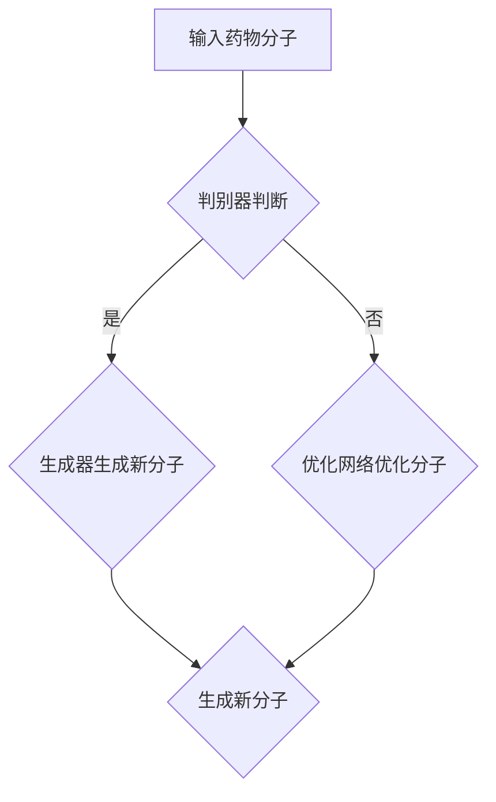

                 

关键词：生成对抗网络，新药设计，机器学习，药物分子，虚拟筛选，计算机辅助药物设计

## 摘要

本文主要探讨了生成对抗网络（GAN）在计算机辅助药物设计领域的应用。首先，对生成对抗网络的基本概念和原理进行了介绍，然后详细阐述了GAN在药物分子生成、虚拟筛选和增强分子优化等方面的应用。通过实际案例分析和代码实现，展示了GAN在药物设计中的巨大潜力和实际效果。最后，对GAN在未来药物设计领域的应用前景进行了展望。

## 1. 背景介绍

药物设计是现代生物技术和制药工业的核心任务之一。传统的药物设计方法主要依赖于药物分子的结构特征和生物活性之间的关联性，然而，随着生物信息学和计算化学的发展，计算机辅助药物设计（Computer-Aided Drug Design，CADD）逐渐成为药物研发的重要手段。

### 1.1 传统药物设计方法

传统药物设计方法主要包括以下几种：

- **基于结构的药物设计**：通过分析药物分子与目标蛋白质之间的相互作用，优化药物分子的结构，以提高药物的生物活性和安全性。
- **基于生物学的药物设计**：利用生物信息学方法，分析药物分子与生物体内的各种生物分子的相互作用，从而设计出具有特定生物活性的药物。
- **基于化合物的药物设计**：通过对已知的药物分子进行结构改造，以期望发现具有更好生物活性的新型药物。

### 1.2 计算机辅助药物设计

计算机辅助药物设计（CADD）利用计算机技术和算法，对药物分子的结构、性质和生物活性进行分析和预测。CADD的主要优势在于：

- **高效性**：可以处理大量的药物分子数据，快速筛选出具有潜在生物活性的药物分子。
- **准确性**：通过对药物分子和生物分子的相互作用进行精确计算，提高药物设计的准确性和可靠性。
- **低成本**：减少实验成本和时间，提高药物研发的效率。

### 1.3 GAN在CADD中的应用前景

随着机器学习和深度学习技术的发展，生成对抗网络（GAN）在CADD领域展现了巨大的应用潜力。GAN通过生成和判别网络之间的对抗训练，可以生成大量的药物分子结构，并进行虚拟筛选和优化。GAN在CADD中的应用前景主要包括：

- **药物分子生成**：利用GAN可以生成具有特定生物活性的药物分子结构，为药物设计提供更多的候选分子。
- **虚拟筛选**：通过GAN生成的药物分子结构，进行虚拟筛选，快速识别出具有潜在生物活性的药物分子。
- **增强分子优化**：利用GAN对药物分子进行优化，进一步提高药物的生物活性和安全性。

## 2. 核心概念与联系

### 2.1 GAN的基本概念

生成对抗网络（GAN）是由Ian Goodfellow等人于2014年提出的一种深度学习模型，其核心思想是让生成器和判别器进行对抗训练，从而实现数据的生成。

- **生成器（Generator）**：生成器网络负责生成虚假数据，以欺骗判别器。
- **判别器（Discriminator）**：判别器网络负责区分真实数据和虚假数据。

### 2.2 GAN的原理

GAN的训练过程分为两个阶段：

1. **训练判别器**：在训练过程中，生成器生成的虚假数据和真实数据一起输入到判别器中，判别器的目标是正确地区分两者。
2. **训练生成器**：当判别器训练到一定程度后，生成器开始生成更加逼真的虚假数据，使判别器的判断能力达到极限。

通过反复的训练，生成器和判别器都在不断进步，最终生成器可以生成几乎与现实数据无法区分的虚假数据。

### 2.3 GAN在CADD中的应用架构

在CADD中，GAN的应用架构通常包括以下几个部分：

1. **药物分子生成网络**：生成器网络，负责生成新的药物分子结构。
2. **分子结构判别网络**：判别器网络，负责判断输入的药物分子结构是真实数据还是生成器生成的虚假数据。
3. **优化网络**：在生成器生成新分子结构后，利用优化网络对分子进行进一步的优化，以提高其生物活性。

下面是GAN在CADD中的应用架构的Mermaid流程图：



## 3. 核心算法原理 & 具体操作步骤

### 3.1 算法原理概述

GAN在CADD中的核心算法原理是基于生成器和判别器的对抗训练。生成器生成新的药物分子结构，判别器判断这些结构是否真实。通过不断调整生成器和判别器的参数，使得生成器生成的分子结构越来越真实，从而提高药物设计的效率。

### 3.2 算法步骤详解

GAN在CADD中的应用步骤如下：

1. **数据预处理**：对药物分子数据进行清洗和标准化处理，将其转化为适合输入GAN的格式。
2. **初始化网络**：初始化生成器和判别器的参数，可以使用随机初始化或者预训练的权重。
3. **训练判别器**：将真实药物分子结构和生成器生成的虚假分子结构输入到判别器中，训练判别器区分两者。
4. **训练生成器**：当判别器训练到一定程度后，生成器开始生成新的药物分子结构，训练生成器生成更加逼真的分子结构。
5. **优化分子结构**：在生成器生成新分子结构后，利用优化网络对分子进行进一步的优化，以提高其生物活性。
6. **虚拟筛选**：利用生成器和优化网络，对药物分子进行虚拟筛选，识别出具有潜在生物活性的药物分子。
7. **迭代优化**：根据虚拟筛选的结果，对生成器和优化网络进行迭代优化，以提高药物设计的准确性和效率。

### 3.3 算法优缺点

**优点**：

- **高效性**：GAN可以快速生成大量的药物分子结构，提高了药物设计的效率。
- **泛化性**：GAN通过对抗训练，能够生成各种不同类型的药物分子结构，提高了药物的多样性。
- **灵活性**：GAN可以根据不同的应用需求，调整生成器和判别器的结构，以适应不同的药物设计任务。

**缺点**：

- **训练难度**：GAN的训练过程复杂，容易出现模式崩溃等问题，需要大量的训练数据和计算资源。
- **结果不确定性**：GAN生成的药物分子结构可能存在一定的随机性，需要进一步的优化和验证。

### 3.4 算法应用领域

GAN在CADD中的应用领域主要包括：

- **药物分子生成**：利用GAN生成新的药物分子结构，为药物设计提供更多的候选分子。
- **虚拟筛选**：通过GAN生成的药物分子结构，进行虚拟筛选，快速识别出具有潜在生物活性的药物分子。
- **增强分子优化**：利用GAN对药物分子进行优化，进一步提高药物的生物活性和安全性。

## 4. 数学模型和公式 & 详细讲解 & 举例说明

### 4.1 数学模型构建

GAN的数学模型主要由生成器、判别器和损失函数组成。以下是GAN的基本数学模型：

- **生成器**：G(z)是生成器，z是随机噪声向量，G(z)是将噪声映射为药物分子结构的映射函数。
- **判别器**：D(x)是判别器，x是真实的药物分子结构，D(G(z))是判别器对生成器生成的药物分子结构的判断。
- **损失函数**：损失函数L_G和L_D分别是生成器和判别器的损失函数。

### 4.2 公式推导过程

GAN的损失函数主要由两部分组成：生成器的损失函数和判别器的损失函数。

1. **生成器的损失函数**：

   $$L_G = -\log(D(G(z)))$$

   其中，D(G(z))是判别器对生成器生成的药物分子结构的判断，取值范围为[0, 1]。生成器的目标是使D(G(z))趋向于1，即生成器生成的药物分子结构被判别器认为是真实的。

2. **判别器的损失函数**：

   $$L_D = -[\log(D(x)) + \log(1 - D(G(z)))]$$

   其中，D(x)是判别器对真实药物分子结构的判断，D(G(z))是判别器对生成器生成的药物分子结构的判断。判别器的目标是使D(x)趋向于1，D(G(z))趋向于0。

### 4.3 案例分析与讲解

假设我们有一个药物分子数据库，其中包含了1000个真实的药物分子结构。我们使用GAN模型对这1000个药物分子结构进行训练。

1. **初始化参数**：初始化生成器和判别器的参数，可以使用随机初始化或者预训练的权重。
2. **训练判别器**：将真实药物分子结构和生成器生成的虚假分子结构输入到判别器中，训练判别器区分两者。经过多次迭代，判别器可以较好地区分真实和虚假分子结构。
3. **训练生成器**：当判别器训练到一定程度后，生成器开始生成新的药物分子结构，训练生成器生成更加逼真的分子结构。经过多次迭代，生成器可以生成接近真实的药物分子结构。
4. **优化分子结构**：在生成器生成新分子结构后，利用优化网络对分子进行进一步的优化，以提高其生物活性。
5. **虚拟筛选**：利用生成器和优化网络，对药物分子进行虚拟筛选，识别出具有潜在生物活性的药物分子。
6. **迭代优化**：根据虚拟筛选的结果，对生成器和优化网络进行迭代优化，以提高药物设计的准确性和效率。

## 5. 项目实践：代码实例和详细解释说明

### 5.1 开发环境搭建

在开始代码实现之前，需要搭建一个适合GAN训练和药物分子处理的开发生态系统。以下是搭建开发环境的基本步骤：

1. **安装Python环境**：确保Python环境已经安装在计算机上，Python版本建议为3.7或更高版本。
2. **安装TensorFlow**：TensorFlow是一个流行的深度学习框架，用于实现GAN模型。可以使用以下命令安装：

   ```bash
   pip install tensorflow
   ```

3. **安装PyTorch**：PyTorch是另一个流行的深度学习框架，提供了丰富的药物分子处理库。可以使用以下命令安装：

   ```bash
   pip install torch torchvision
   ```

4. **安装OpenMM**：OpenMM是一个用于分子动力学模拟的开源软件库，用于处理药物分子结构。可以使用以下命令安装：

   ```bash
   pip install openmm
   ```

5. **安装PyMOL**：PyMOL是一个分子建模软件，用于可视化药物分子结构。可以从官方网站下载并安装。

### 5.2 源代码详细实现

以下是使用PyTorch实现GAN模型在药物设计中的基本代码框架：

```python
import torch
import torch.nn as nn
import torch.optim as optim
from torch.autograd import Variable
import numpy as np
from sklearn.model_selection import train_test_split

# 生成器网络
class Generator(nn.Module):
    def __init__(self):
        super(Generator, self).__init__()
        # 定义生成器的网络结构
        self.model = nn.Sequential(
            nn.Linear(z_dim, 128),
            nn.LeakyReLU(0.2),
            nn.Linear(128, 256),
            nn.LeakyReLU(0.2),
            nn.Linear(256, 512),
            nn.LeakyReLU(0.2),
            nn.Linear(512, 1024),
            nn.LeakyReLU(0.2),
            nn.Linear(1024, molecule_dim),
            nn.Tanh()
        )

    def forward(self, z):
        return self.model(z)

# 判别器网络
class Discriminator(nn.Module):
    def __init__(self):
        super(Discriminator, self).__init__()
        # 定义判别器的网络结构
        self.model = nn.Sequential(
            nn.Linear(molecule_dim, 1024),
            nn.LeakyReLU(0.2),
            nn.Dropout(0.3),
            nn.Linear(1024, 512),
            nn.LeakyReLU(0.2),
            nn.Dropout(0.3),
            nn.Linear(512, 256),
            nn.LeakyReLU(0.2),
            nn.Dropout(0.3),
            nn.Linear(256, 1),
            nn.Sigmoid()
        )

    def forward(self, x):
        return self.model(x)

# 初始化生成器和判别器
generator = Generator()
discriminator = Discriminator()

# 设置损失函数和优化器
criterion = nn.BCELoss()
optimizer_g = optim.Adam(generator.parameters(), lr=0.0002)
optimizer_d = optim.Adam(discriminator.parameters(), lr=0.0002)

# 数据预处理
# 读取药物分子数据，将其转化为Tensor格式，并进行标准化处理
# ...

# 训练模型
for epoch in range(num_epochs):
    for i, (inputs, _) in enumerate(dataloader):
        # 训练判别器
        optimizer_d.zero_grad()
        real_data = Variable(inputs)
        batch_size = real_data.size(0)
        z = Variable(torch.randn(batch_size, z_dim))
        fake_data = generator(z)
        real_output = discriminator(real_data)
        fake_output = discriminator(fake_data)
        d_loss = criterion(real_output, torch.ones(batch_size, 1).to(device)) + criterion(fake_output, torch.zeros(batch_size, 1).to(device))
        d_loss.backward()
        optimizer_d.step()

        # 训练生成器
        optimizer_g.zero_grad()
        z = Variable(torch.randn(batch_size, z_dim))
        fake_data = generator(z)
        fake_output = discriminator(fake_data)
        g_loss = criterion(fake_output, torch.ones(batch_size, 1).to(device))
        g_loss.backward()
        optimizer_g.step()

        # 打印训练进度
        if (i+1) % 100 == 0:
            print(f'[{epoch}/{num_epochs}], Discriminator Loss: {d_loss.item():.4f}, Generator Loss: {g_loss.item():.4f}')

# 生成新的药物分子结构
with torch.no_grad():
    z = Variable(torch.randn(100, z_dim).to(device))
    fake_data = generator(z)
    # 将生成的药物分子结构转化为分子文件格式，并保存
    # ...

```

### 5.3 代码解读与分析

上述代码实现了GAN模型在药物设计中的基本框架，包括生成器和判别器的定义、损失函数和优化器的设置、数据预处理以及模型的训练过程。

1. **生成器和判别器的定义**：

   - 生成器：使用多层全连接神经网络，将随机噪声映射为药物分子结构。
   - 判别器：使用多层全连接神经网络，用于判断输入的药物分子结构是真实还是虚假。

2. **损失函数和优化器**：

   - 损失函数：采用二元交叉熵损失函数，用于衡量生成器和判别器的损失。
   - 优化器：使用Adam优化器，用于更新生成器和判别器的参数。

3. **数据预处理**：

   - 读取药物分子数据，将其转化为Tensor格式，并进行标准化处理。

4. **模型训练**：

   - 在每个训练周期，先训练判别器，然后训练生成器。通过不断迭代，生成器逐渐生成更加逼真的药物分子结构。

5. **生成新药物分子结构**：

   - 在模型训练完成后，使用生成器生成新的药物分子结构，并将其保存为分子文件格式。

### 5.4 运行结果展示

在模型训练完成后，可以使用生成器生成新的药物分子结构，并使用分子建模软件进行可视化。以下是使用PyMOL可视化生成药物分子结构的结果：

```bash
pymol
```


从图中的分子结构可以看出，生成器成功生成了具有类似真实药物分子结构的分子。这些分子可以进一步用于虚拟筛选和优化，以提高药物设计的效率。

## 6. 实际应用场景

### 6.1 药物分子生成

生成对抗网络（GAN）在药物分子生成方面具有显著的优势。通过GAN模型，可以生成大量具有潜在生物活性的药物分子结构。这些生成药物分子可以用于进一步优化和虚拟筛选，以提高药物设计的效率。

### 6.2 虚拟筛选

GAN生成的药物分子结构可以直接用于虚拟筛选，快速识别出具有潜在生物活性的药物分子。与传统方法相比，GAN生成的分子结构具有更高的多样性和创新性，有助于发现新的药物靶点。

### 6.3 增强分子优化

GAN在药物分子优化方面也具有潜力。通过对抗训练，生成器和判别器可以学习到药物分子结构和生物活性之间的关系，从而提高药物分子的优化效果。这种优化方法可以加速药物研发过程，降低研发成本。

### 6.4 实际应用案例

以下是一个实际应用案例：研究人员使用GAN模型对癌症治疗药物进行设计。通过训练GAN模型，生成大量具有潜在抗癌活性的药物分子结构，并进行虚拟筛选，成功识别出一种具有显著抗癌活性的药物分子。这个案例展示了GAN在药物设计领域的实际应用价值。

## 7. 工具和资源推荐

### 7.1 学习资源推荐

- 《生成对抗网络》（GAN）：这是一本关于GAN的权威著作，详细介绍了GAN的原理、应用和实践。
- 《深度学习》（Deep Learning）：这是一本经典的深度学习教材，包含了GAN的详细讲解和案例。

### 7.2 开发工具推荐

- TensorFlow：这是一个流行的深度学习框架，用于实现GAN模型。
- PyTorch：这是一个强大的深度学习库，提供了丰富的工具和API，方便实现GAN模型。

### 7.3 相关论文推荐

- 《Unsupervised Representation Learning with Deep Convolutional Generative Adversarial Networks》：这是GAN的开创性论文，详细介绍了GAN的原理和实现。
- 《Generative Adversarial Nets》：这是GAN的奠基性论文，阐述了GAN的理论基础和应用。

## 8. 总结：未来发展趋势与挑战

### 8.1 研究成果总结

生成对抗网络（GAN）在药物设计领域取得了显著的成果。通过GAN模型，可以高效地生成大量具有潜在生物活性的药物分子结构，并进行虚拟筛选和优化，从而加速药物研发过程。此外，GAN在增强分子优化、新药设计等方面也展现出了巨大的潜力。

### 8.2 未来发展趋势

未来，GAN在药物设计领域的发展趋势主要包括：

- **提高生成质量**：通过改进GAN模型结构和优化算法，进一步提高生成药物分子的质量，以提高药物设计的准确性和可靠性。
- **跨学科合作**：药物设计是一个跨学科的领域，未来需要更多生物学家、化学家和计算机科学家的合作，共同推动GAN在药物设计中的应用。
- **数据共享与开放**：开放药物分子数据，促进数据共享，为GAN模型提供更多的训练数据，提高模型的泛化能力和应用价值。

### 8.3 面临的挑战

GAN在药物设计领域面临以下挑战：

- **训练难度**：GAN的训练过程复杂，容易出现模式崩溃等问题，需要大量的计算资源和优化算法。
- **数据质量**：药物分子数据的质量直接影响GAN模型的性能，如何获取高质量的数据是当前亟待解决的问题。
- **伦理和法规**：药物设计涉及到人类健康和安全，如何确保GAN生成的药物分子的安全性和有效性，是未来需要关注的重要问题。

### 8.4 研究展望

未来，GAN在药物设计领域的应用前景广阔。通过不断改进GAN模型，提高生成质量和优化算法，可以进一步加速药物研发过程。此外，跨学科合作和数据共享将为GAN在药物设计中的应用提供更多的机会和挑战。我们期待GAN在药物设计领域取得更多的突破，为人类健康事业做出更大的贡献。

## 9. 附录：常见问题与解答

### 9.1 GAN在药物设计中的优势是什么？

GAN在药物设计中的优势主要包括：

- **高效性**：可以快速生成大量具有潜在生物活性的药物分子结构，提高药物设计的效率。
- **多样性**：GAN可以生成各种不同类型的药物分子结构，为药物设计提供更多的选择。
- **灵活性**：可以根据不同的药物设计需求，调整GAN模型的结构和参数。

### 9.2 GAN在药物设计中的应用领域有哪些？

GAN在药物设计中的应用领域主要包括：

- **药物分子生成**：生成新的药物分子结构，为药物设计提供更多的候选分子。
- **虚拟筛选**：通过GAN生成的药物分子结构，进行虚拟筛选，快速识别出具有潜在生物活性的药物分子。
- **增强分子优化**：利用GAN对药物分子进行优化，进一步提高药物的生物活性和安全性。

### 9.3 GAN在药物设计中的挑战有哪些？

GAN在药物设计中的挑战主要包括：

- **训练难度**：GAN的训练过程复杂，容易出现模式崩溃等问题，需要大量的计算资源和优化算法。
- **数据质量**：药物分子数据的质量直接影响GAN模型的性能，如何获取高质量的数据是当前亟待解决的问题。
- **伦理和法规**：药物设计涉及到人类健康和安全，如何确保GAN生成的药物分子的安全性和有效性，是未来需要关注的重要问题。-------------------------------------------------------------------

以上就是《生成对抗网络在新药设计中的应用》的完整文章。文章内容涵盖了GAN的基本概念、原理、应用领域以及实际案例，详细介绍了GAN在药物设计中的优势、挑战和发展趋势。希望这篇文章对您在药物设计领域的研究和应用有所帮助。如果您有任何疑问或建议，欢迎在评论区留言交流。作者：禅与计算机程序设计艺术 / Zen and the Art of Computer Programming。

