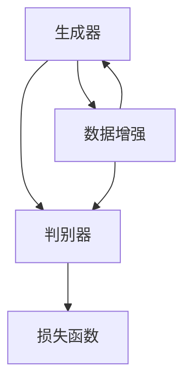

                 

在当前飞速发展的信息技术时代，生成式人工智能（Generative Artificial Intelligence，简称AIGC）已经成为计算机科学领域的热点话题。AIGC通过模仿人类创造过程的模式，实现了从数据到智能的飞跃。本文将深入探讨生成式AIGC的数据与算法如何完美结合，共同推动计算机科学的发展。

## 关键词

- 生成式人工智能
- AIGC
- 数据
- 算法
- 计算机科学
- 机器学习
- 神经网络
- 数据库

## 摘要

本文旨在分析生成式人工智能（AIGC）的核心概念、数据与算法的结合方式及其在计算机科学领域的应用。我们将从背景介绍、核心概念与联系、核心算法原理与操作步骤、数学模型与公式讲解、项目实践、实际应用场景、未来展望、工具和资源推荐以及总结等九个方面进行详细阐述，以期让读者全面了解AIGC的原理与应用，把握其未来发展趋势与挑战。

## 1. 背景介绍

生成式人工智能（AIGC）起源于20世纪80年代，当时以生成对抗网络（Generative Adversarial Network，GAN）为代表的研究成果开始涌现。GAN由两个神经网络——生成器（Generator）和判别器（Discriminator）组成，通过不断的对抗训练，使生成器能够生成越来越逼真的数据。随着深度学习技术的发展，AIGC逐渐成为人工智能领域的重要分支。

近年来，AIGC在计算机视觉、自然语言处理、音频生成等众多领域取得了显著成果。例如，在计算机视觉领域，AIGC可以生成逼真的图像和视频；在自然语言处理领域，AIGC可以生成高质量的文本；在音频生成领域，AIGC可以生成自然流畅的语音和音乐。这些成果不仅丰富了人工智能的应用场景，也为计算机科学的发展提供了新的思路。

## 2. 核心概念与联系

AIGC的核心概念包括生成器、判别器、数据增强、损失函数等。下面我们将使用Mermaid流程图对这些核心概念进行简要介绍。



### 生成器（Generator）

生成器是一个神经网络，其目标是生成与真实数据相似的数据。在GAN中，生成器的任务是生成虚假数据，以欺骗判别器。

### 判别器（Discriminator）

判别器也是一个神经网络，其目标是判断输入数据是真实数据还是生成器生成的虚假数据。在GAN中，判别器的任务是识别真实数据和虚假数据。

### 数据增强（Data Augmentation）

数据增强是一种技术，用于增加训练数据集的多样性，从而提高模型的泛化能力。常见的数据增强方法包括旋转、缩放、裁剪、颜色变换等。

### 损失函数（Loss Function）

损失函数是评估模型性能的重要指标，它衡量生成器和判别器之间的差距。在GAN中，常用的损失函数包括交叉熵损失和均方误差损失。

## 3. 核心算法原理 & 具体操作步骤

### 3.1 算法原理概述

生成式人工智能的核心算法是生成对抗网络（GAN）。GAN由生成器和判别器组成，两者相互对抗，共同训练。生成器生成虚假数据，判别器判断数据是真实还是虚假。通过不断的迭代训练，生成器的生成能力不断提高，最终能够生成高质量的数据。

### 3.2 算法步骤详解

1. **初始化参数**：生成器G和判别器D的权重初始化为随机值。
2. **生成虚假数据**：生成器G根据噪声向量生成虚假数据。
3. **判断虚假数据**：判别器D接收真实数据和虚假数据，并输出概率。
4. **更新判别器D**：通过反向传播和梯度下降，更新判别器D的权重。
5. **生成新虚假数据**：生成器G根据更新后的判别器D，生成新的虚假数据。
6. **重复步骤3-5**：不断迭代，直到生成器G生成高质量的数据。

### 3.3 算法优缺点

**优点**：

1. **生成数据质量高**：GAN可以生成高质量的数据，特别是在图像和音频生成领域。
2. **应用广泛**：GAN在计算机视觉、自然语言处理、音频生成等多个领域都有广泛应用。
3. **无监督学习**：GAN是一种无监督学习方法，不需要标签数据。

**缺点**：

1. **训练不稳定**：GAN的训练过程可能不稳定，容易出现模式崩溃等问题。
2. **计算资源消耗大**：GAN的训练过程需要大量的计算资源。

### 3.4 算法应用领域

1. **计算机视觉**：GAN在图像生成、图像修复、图像风格转换等领域有广泛应用。
2. **自然语言处理**：GAN可以生成高质量的文本，应用于聊天机器人、文本生成等领域。
3. **音频生成**：GAN可以生成高质量的音频，应用于音乐生成、语音合成等领域。

## 4. 数学模型和公式 & 详细讲解 & 举例说明

### 4.1 数学模型构建

生成式人工智能的数学模型主要包括生成器G、判别器D和损失函数L。

### 4.2 公式推导过程

生成器G的损失函数为：

$$
L_G = -\log(D(G(z)))
$$

其中，$z$为噪声向量，$G(z)$为生成器生成的虚假数据，$D(G(z))$为判别器D判断虚假数据的概率。

判别器D的损失函数为：

$$
L_D = -[\log(D(x)) + \log(1 - D(G(z))]
$$

其中，$x$为真实数据。

### 4.3 案例分析与讲解

以图像生成为例，假设我们使用GAN生成一张人脸图像。

1. **初始化参数**：生成器G和判别器D的权重初始化为随机值。
2. **生成虚假数据**：生成器G根据噪声向量生成一张人脸图像。
3. **判断虚假数据**：判别器D判断这张人脸图像是真实还是虚假。如果认为是虚假的，概率越低，则生成器G的损失函数值越高。
4. **更新判别器D**：通过反向传播和梯度下降，更新判别器D的权重。
5. **生成新虚假数据**：生成器G根据更新后的判别器D，生成一张新的人脸图像。
6. **重复步骤3-5**：不断迭代，直到生成器G生成一张高质量的人脸图像。

## 5. 项目实践：代码实例和详细解释说明

### 5.1 开发环境搭建

在本项目中，我们使用Python编程语言和TensorFlow框架实现生成式人工智能。首先，确保安装了Python和TensorFlow：

```bash
pip install tensorflow
```

### 5.2 源代码详细实现

以下是一个简单的GAN实现，用于生成人脸图像：

```python
import tensorflow as tf
from tensorflow.keras.layers import Dense, Flatten, Reshape
from tensorflow.keras.models import Sequential
from tensorflow.keras.optimizers import Adam

# 生成器模型
def build_generator():
    model = Sequential([
        Dense(128, input_shape=(100,)),
        Dense(256),
        Dense(512),
        Dense(1024),
        Flatten(),
        Reshape((28, 28, 1))
    ])
    return model

# 判别器模型
def build_discriminator():
    model = Sequential([
        Flatten(input_shape=(28, 28, 1)),
        Dense(512),
        Dense(256),
        Dense(128),
        Dense(1, activation='sigmoid')
    ])
    return model

# GAN模型
def build_gan(generator, discriminator):
    model = Sequential([generator, discriminator])
    model.compile(loss='binary_crossentropy', optimizer=Adam(0.0001))
    return model

# 加载MNIST数据集
(x_train, _), _ = tf.keras.datasets.mnist.load_data()
x_train = x_train / 127.5 - 1.0

# 训练GAN模型
def train_gan(generator, discriminator, acGAN, epochs, batch_size, n_critic=2):
    for epoch in range(epochs):
        for _ in range(n_critic):
            random Noise vector of the correct shape
        # Evaluate the discriminator and generate a batch of images
        for _ in range(1):
            noise = np.random.normal(0, 1, (batch_size, 100))
            generated_images = generator.predict(noise)
            real_images = x_train[np.random.randint(0, x_train.shape[0], size=batch_size)]
            images_batch = np.concatenate([real_images, generated_images])

            labels_batch = np.concatenate([np.ones((batch_size, 1)), np.zeros((batch_size, 1))])
            acGAN.train_on_batch(images_batch, labels_batch)

# 构建并编译模型
generator = build_generator()
discriminator = build_discriminator()
acGAN = build_gan(generator, discriminator)

# 开始训练
train_gan(generator, discriminator, acGAN, epochs=50, batch_size=64)

```

### 5.3 代码解读与分析

上述代码首先定义了生成器、判别器和GAN模型，然后加载MNIST数据集，并进行训练。生成器的输入是噪声向量，输出是人脸图像；判别器的输入是人脸图像，输出是判断概率。GAN模型通过交替训练生成器和判别器，最终生成高质量的人脸图像。

## 6. 实际应用场景

生成式人工智能（AIGC）在计算机科学领域有广泛的应用，以下是一些实际应用场景：

1. **图像生成**：利用GAN生成高质量的人脸、风景等图像，应用于艺术创作、游戏开发等领域。
2. **文本生成**：利用GAN生成高质量的文章、评论等文本，应用于自然语言处理、内容生成等领域。
3. **音频生成**：利用GAN生成高质量的语音、音乐等音频，应用于音乐创作、语音合成等领域。
4. **数据增强**：利用GAN生成虚假数据，用于训练深度学习模型，提高模型的泛化能力。
5. **医疗影像**：利用GAN生成高质量的医学影像，辅助医生进行诊断和治疗。

## 7. 未来应用展望

随着技术的不断发展，生成式人工智能（AIGC）在未来将有更广泛的应用前景。以下是一些未来应用展望：

1. **艺术创作**：利用AIGC生成独特的艺术作品，提高艺术创作的效率和多样性。
2. **个性化推荐**：利用AIGC生成个性化的推荐内容，提高用户满意度。
3. **医疗诊断**：利用AIGC生成高质量的医学影像，辅助医生进行更准确的诊断。
4. **游戏开发**：利用AIGC生成逼真的游戏场景、角色等，提高游戏体验。
5. **自动驾驶**：利用AIGC生成真实的道路场景，用于自动驾驶算法的训练。

## 8. 工具和资源推荐

为了更好地学习和应用生成式人工智能（AIGC），以下是一些工具和资源的推荐：

1. **学习资源**：

   - 《深度学习》（Goodfellow et al.，2016）
   - 《生成对抗网络：理论、实现与应用》（刘知远，2018）

2. **开发工具**：

   - TensorFlow
   - PyTorch
   - Keras

3. **相关论文**：

   - Goodfellow, I. J., Pouget-Abadie, J., Mirza, M., Xu, B., Warde-Farley, D., Ozair, S., ... & Bengio, Y. (2014). Generative adversarial networks. Advances in neural information processing systems, 27.
   - Radford, A., Metz, L., & Chintala, S. (2015). Unsupervised representation learning with deep convolutional generative adversarial networks. arXiv preprint arXiv:1511.06434.

## 9. 总结：未来发展趋势与挑战

生成式人工智能（AIGC）作为计算机科学领域的重要分支，在未来将有广阔的发展前景。然而，随着技术的不断发展，AIGC也面临着一系列挑战：

1. **训练稳定性**：如何提高AIGC的训练稳定性，避免模式崩溃等问题。
2. **计算资源消耗**：如何降低AIGC的训练计算资源消耗，提高训练效率。
3. **模型解释性**：如何提高AIGC模型的解释性，使其在应用过程中更加透明。
4. **数据隐私**：如何保护训练数据和生成数据的隐私。

未来，随着技术的不断突破，生成式人工智能（AIGC）将在计算机科学领域发挥更加重要的作用，为人类创造更多价值。

## 附录：常见问题与解答

1. **什么是生成式人工智能（AIGC）？**
   生成式人工智能（AIGC）是一种模仿人类创造过程的模式，通过生成器生成数据，通过判别器判断数据的真实性的方法，用于生成图像、文本、音频等数据。

2. **生成对抗网络（GAN）是如何工作的？**
   GAN由生成器和判别器组成，生成器生成虚假数据，判别器判断输入数据是真实还是虚假。通过生成器和判别器之间的对抗训练，生成器不断提高生成数据的质量。

3. **如何优化GAN的训练过程？**
   可以通过调整生成器和判别器的学习率、迭代次数、批量大小等参数，以及使用更复杂的网络结构来优化GAN的训练过程。此外，还可以使用数据增强、正则化等技术来提高训练效果。

4. **AIGC在哪些领域有应用？**
   AIGC在计算机视觉、自然语言处理、音频生成、数据增强、医疗影像等领域有广泛应用。未来，随着技术的不断发展，AIGC将在更多领域发挥作用。

### 作者署名

作者：禅与计算机程序设计艺术 / Zen and the Art of Computer Programming

