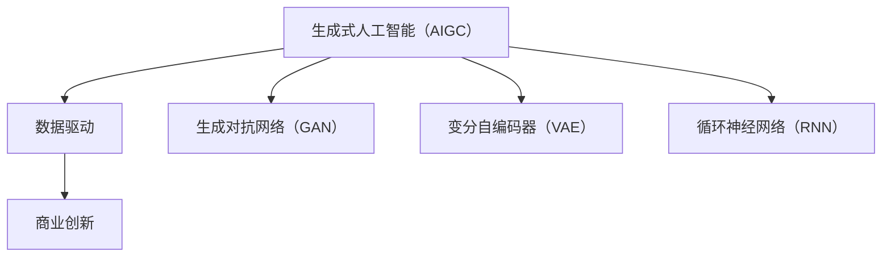
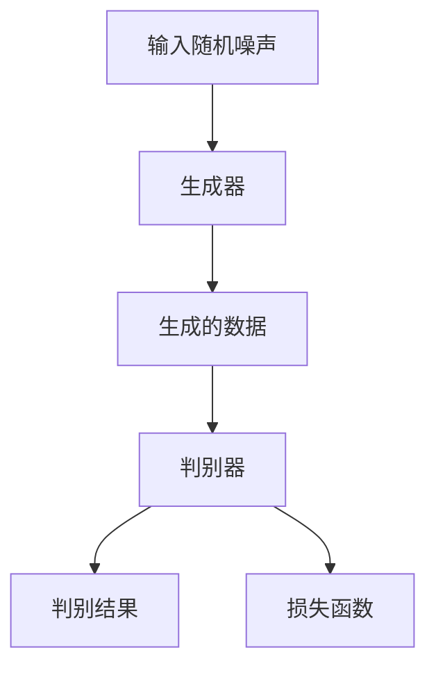
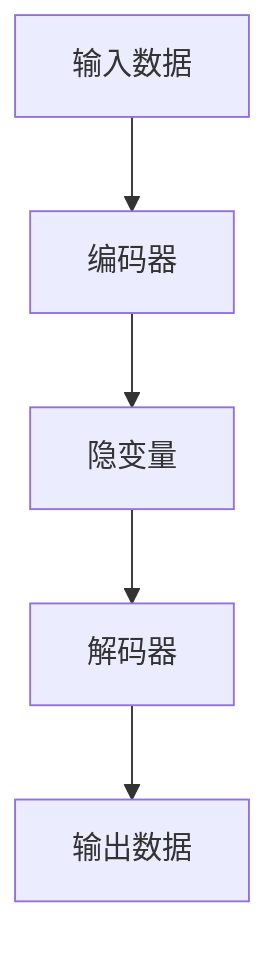
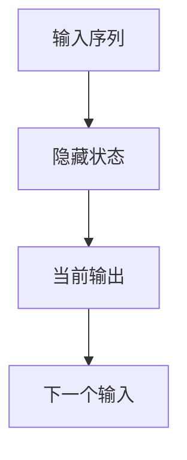

                 

 在当今快速发展的数字时代，生成式人工智能（AIGC）已经成为驱动商业创新的重要力量。AIGC 通过利用大规模数据和先进的算法模型，实现了从数据生成到业务应用的全链路自动化，极大地提升了企业的运营效率和创新能力。本文将深入探讨生成式AIGC的基本概念、核心原理、应用领域及其对商业创新带来的深远影响。

## 关键词

- 生成式人工智能
- 数据驱动
- 商业创新
- 机器学习
- 神经网络
- 大规模数据处理
- 模型优化

## 摘要

本文首先介绍了生成式人工智能的基本概念，并探讨了其核心原理和关键算法。接着，我们通过一个具体的实例，详细讲解了生成式AIGC在实际项目中的应用。随后，文章分析了生成式AIGC在商业领域的广泛应用，包括市场营销、产品设计、客户服务等方面。最后，我们讨论了生成式AIGC未来的发展趋势和面临的挑战，为读者提供了有益的启示和展望。

## 1. 背景介绍

随着互联网的普及和大数据技术的发展，数据的规模和复杂性不断增加。传统的数据处理方法已经难以应对这种变化，而生成式人工智能（AIGC）则提供了一个新的解决方案。AIGC 是一种能够自动生成数据、内容、甚至复杂模型的人工智能技术，其核心在于利用大规模数据和先进的算法模型，实现数据的自动生成和优化。

在商业领域，AIGC 的应用已经取得了显著的成效。例如，在市场营销中，AIGC 可以帮助品牌快速生成定制化的营销内容，提高营销效果；在产品设计中，AIGC 可以根据用户需求和反馈，生成新的产品原型，加速产品迭代；在客户服务中，AIGC 可以通过智能对话系统，提供24/7的高效客户服务。

### 1.1 生成式人工智能的发展历程

生成式人工智能的发展可以追溯到20世纪80年代。当时，研究人员开始探索如何利用机器学习生成文本、图像和音频。最早的生成模型之一是1986年由Bengio等人提出的生成对抗网络（GAN）。GAN的基本思想是通过两个神经网络（生成器和判别器）的对抗训练，生成与真实数据高度相似的数据。

进入21世纪，随着计算能力和数据规模的提升，生成式人工智能技术得到了快速发展。深度学习技术的引入，使得生成模型的性能得到了显著提升。特别是2014年由DeepMind开发的深度生成对抗网络（DGenGAN），其在图像生成的质量上达到了前所未有的高度。

近年来，生成式人工智能在自然语言处理、计算机视觉、音频处理等领域取得了重大突破。例如，在自然语言处理领域，生成式模型如GPT-3等已经能够生成高质量的文章、对话和翻译。在计算机视觉领域，生成式模型如StyleGAN2等，可以生成逼真的图像和视频。

### 1.2 数据驱动的商业创新

数据驱动是指企业利用数据来指导决策和运营，从而提高效率和创新能力。在数据驱动的商业创新中，数据被视为最重要的资产。企业通过收集、存储、分析和利用数据，不断优化业务流程，提高产品和服务质量，实现持续的创新和发展。

生成式人工智能作为数据驱动的重要工具，能够为企业提供以下价值：

1. **提高生产效率**：生成式模型可以自动化生成大量的数据，减轻数据处理的负担，提高生产效率。
2. **加速产品迭代**：通过生成式模型，企业可以快速生成新的产品原型，缩短产品研发周期。
3. **优化客户体验**：生成式模型可以个性化生成内容，提高客户满意度，增强客户粘性。
4. **降低成本**：通过自动化生成，企业可以减少人工干预，降低运营成本。

### 1.3 本文结构

本文将分为以下几个部分：

- **第2章**：介绍生成式AIGC的核心概念和联系。
- **第3章**：讲解生成式AIGC的核心算法原理和具体操作步骤。
- **第4章**：讨论生成式AIGC在数学模型和公式中的应用。
- **第5章**：展示一个实际的代码实例，并详细解释说明。
- **第6章**：分析生成式AIGC在商业领域的实际应用场景。
- **第7章**：推荐学习资源、开发工具和相关论文。
- **第8章**：总结生成式AIGC的未来发展趋势和挑战。

## 2. 核心概念与联系

### 2.1 生成式人工智能（AIGC）

生成式人工智能（AIGC）是一种利用数据和算法模型自动生成数据、内容或模型的人工智能技术。AIGC 的核心在于“生成”，即通过学习大量数据，自动生成新的数据或内容。生成式人工智能包括多种类型的模型，如生成对抗网络（GAN）、变分自编码器（VAE）和循环神经网络（RNN）等。

### 2.2 数据驱动

数据驱动是指企业利用数据来指导决策和运营，从而提高效率和创新能力。数据驱动的核心在于“数据”，即企业通过收集、存储、分析和利用数据，优化业务流程，提高产品和服务质量。

### 2.3 商业创新

商业创新是指企业通过引入新的产品、服务、商业模式或运营方式，实现商业价值增长和竞争力提升。商业创新的核心在于“创新”，即企业不断探索新的机遇和解决方案，以适应市场变化和客户需求。

### 2.4 Mermaid 流程图

下面是一个用于描述生成式AIGC核心概念和联系的 Mermaid 流程图：



## 3. 核心算法原理 & 具体操作步骤

### 3.1 算法原理概述

生成式人工智能的核心在于生成模型，这些模型通过学习大量数据，能够自动生成新的数据或内容。以下介绍几种常见的生成模型及其基本原理。

#### 3.1.1 生成对抗网络（GAN）

生成对抗网络（GAN）是一种由生成器和判别器组成的对抗性模型。生成器（Generator）负责生成数据，判别器（Discriminator）负责判断数据是真实数据还是生成数据。两个网络通过对抗训练，生成器不断优化，以生成更加真实的数据。

GAN 的原理如图所示：



#### 3.1.2 变分自编码器（VAE）

变分自编码器（VAE）是一种概率生成模型，通过编码和解码两个步骤生成数据。编码器（Encoder）将输入数据映射到一个隐变量空间，解码器（Decoder）将隐变量映射回数据空间。

VAE 的原理如图所示：



#### 3.1.3 循环神经网络（RNN）

循环神经网络（RNN）是一种能够处理序列数据的神经网络。RNN 通过其循环结构，可以记住序列中的历史信息，并利用这些信息预测未来的输出。

RNN 的原理如图所示：



### 3.2 算法步骤详解

以下以生成对抗网络（GAN）为例，详细讲解其操作步骤：

#### 3.2.1 数据准备

首先，准备用于训练的数据集。数据集应包含真实数据和噪声数据。真实数据用于训练判别器，噪声数据用于训练生成器。

#### 3.2.2 模型初始化

初始化生成器和判别器。生成器通常是一个全连接神经网络，判别器也是一个全连接神经网络。

#### 3.2.3 对抗训练

对抗训练是 GAN 的核心步骤。生成器生成假数据，判别器判断数据是真实数据还是生成数据。通过反复迭代，生成器不断优化，生成更加真实的数据，判别器也不断优化，提高对生成数据的识别能力。

#### 3.2.4 模型评估

在训练过程中，定期评估模型性能。常用的评价指标有生成质量（Inception Score, IS）和判别器性能（FID, Fréchet Inception Distance）。

### 3.3 算法优缺点

#### 3.3.1 优点

- **生成质量高**：GAN 能够生成高质量的图像，尤其是在图像合成、图像修复等领域表现突出。
- **适用性强**：GAN 可以应用于多种数据类型，包括图像、文本、音频等。
- **自适应性强**：GAN 具有较强的自适应能力，能够根据训练数据和目标不断优化。

#### 3.3.2 缺点

- **训练不稳定**：GAN 的训练过程容易出现模式崩溃（mode collapse）和梯度消失等问题，导致训练不稳定。
- **需要大量数据**：GAN 需要大量的数据来训练，否则生成的数据质量较低。
- **计算资源消耗大**：GAN 的训练过程需要大量的计算资源，特别是在生成高分辨率图像时。

### 3.4 算法应用领域

生成对抗网络（GAN）在多个领域取得了显著的应用成果：

- **图像生成**：GAN 可以用于生成逼真的图像，如图像修复、图像合成等。
- **图像生成对抗**：GAN 可以用于图像生成对抗任务，如图像到图像翻译、图像风格迁移等。
- **文本生成**：GAN 可以用于生成文本，如文章生成、对话生成等。
- **音频生成**：GAN 可以用于生成音频，如音乐生成、语音合成等。

## 4. 数学模型和公式 & 详细讲解 & 举例说明

### 4.1 数学模型构建

生成式人工智能的数学模型主要包括生成模型和判别模型。以下分别介绍这两种模型的数学表示。

#### 4.1.1 生成模型

生成模型的核心目标是学习数据的概率分布，并生成与真实数据相似的新数据。常见的生成模型有生成对抗网络（GAN）和变分自编码器（VAE）。

1. **生成对抗网络（GAN）**

   GAN 的数学模型包括生成器（G）和判别器（D）。生成器的目标是生成与真实数据相似的假数据，判别器的目标是区分真实数据和假数据。

   假设真实数据分布为 $p_{data}(x)$，生成器生成的假数据分布为 $p_{G}(x)$，判别器预测的概率分布为 $p_{D}(x)$。

   生成器和判别器的损失函数分别为：

   $$L_G = -\log(D(G(z)))$$

   $$L_D = -[\log(D(x)) + \log(1 - D(G(z)))]$$

   其中，$z$ 是随机噪声，$x$ 是真实数据，$G(z)$ 是生成器生成的假数据。

2. **变分自编码器（VAE）**

   VAE 的数学模型包括编码器（Encoder）和解码器（Decoder）。编码器将输入数据映射到一个隐变量空间，解码器将隐变量映射回数据空间。

   编码器的目标是学习输入数据的概率分布，解码器的目标是生成与输入数据相似的新数据。

   假设输入数据为 $x$，隐变量为 $z$，编码器为 $q(z|x)$，解码器为 $p(x|z)$。

   VAE 的损失函数为：

   $$L = \mathbb{E}_{x \sim p_{data}(x)}[-\log(p(x|z))] + D_{KL}(q(z|x) || p(z))$$

   其中，$D_{KL}$ 表示 Kullback-Leibler 散度。

#### 4.1.2 判别模型

判别模型的目标是区分真实数据和假数据。常见的判别模型有卷积神经网络（CNN）和循环神经网络（RNN）。

1. **卷积神经网络（CNN）**

   CNN 的数学模型包括多个卷积层、池化层和全连接层。卷积层用于提取图像特征，池化层用于降低特征维度，全连接层用于分类。

   假设输入数据为 $x$，输出为 $y$，CNN 的损失函数为交叉熵损失：

   $$L = -[y_1 \log(D_1(x)) + (1 - y_1) \log(1 - D_1(x))]$$

   其中，$y_1$ 是真实数据标签，$D_1(x)$ 是判别器输出的概率。

2. **循环神经网络（RNN）**

   RNN 的数学模型包括输入层、隐藏层和输出层。输入层接收输入数据，隐藏层存储历史信息，输出层生成输出结果。

   假设输入序列为 $x_t$，隐藏状态为 $h_t$，输出为 $y_t$，RNN 的损失函数为交叉熵损失：

   $$L = -[\sum_{t=1}^{T} y_t \log(p(y_t | h_t))]$$

   其中，$T$ 是输入序列的长度，$p(y_t | h_t)$ 是输出层的概率分布。

### 4.2 公式推导过程

以下以生成对抗网络（GAN）为例，介绍其数学公式的推导过程。

#### 4.2.1 生成器和判别器的损失函数

生成器的损失函数为：

$$L_G = -\log(D(G(z)))$$

其中，$D(G(z))$ 表示判别器对生成器生成的假数据的输出概率。

判别器的损失函数为：

$$L_D = -[\log(D(x)) + \log(1 - D(G(z)))]$$

其中，$D(x)$ 表示判别器对真实数据的输出概率，$D(G(z))$ 表示判别器对生成器生成的假数据的输出概率。

#### 4.2.2 生成器损失函数的推导

生成器损失函数 $L_G$ 的推导如下：

$$L_G = -\log(D(G(z)))$$

$$= -\log(\frac{D(G(z))}{1 - D(G(z))})$$

$$= -\log(D(G(z))) + \log(1 - D(G(z)))$$

$$= \log(1 - D(G(z))) - \log(D(G(z)))$$

$$= \log(1 - D(G(z))) + (-\log(D(G(z))))$$

$$= \log(1 - D(G(z))) + L_D$$

因此，生成器的损失函数为：

$$L_G = \log(1 - D(G(z))) + L_D$$

#### 4.2.3 判别器损失函数的推导

判别器损失函数 $L_D$ 的推导如下：

$$L_D = -[\log(D(x)) + \log(1 - D(G(z)))]$$

$$= -\log(D(x)) - \log(1 - D(G(z)))$$

$$= -\log(D(x)) - \log(\frac{1 - D(G(z))}{D(G(z))})$$

$$= -\log(D(x)) - \log(1 - D(G(z))) + \log(D(G(z)))$$

$$= -\log(D(x)) + L_G$$

因此，判别器的损失函数为：

$$L_D = -\log(D(x)) + L_G$$

### 4.3 案例分析与讲解

以下通过一个简单的例子，介绍生成对抗网络（GAN）的应用。

#### 4.3.1 例子

假设有一个简单的生成对抗网络，其中生成器 $G(z)$ 是一个线性函数，判别器 $D(x)$ 是一个单层感知机。

输入噪声 $z \in \mathbb{R}^2$，生成器生成的假数据 $G(z) = \text{sign}(\text{W}z + b)$，判别器 $D(x) = \text{sign}(\text{W}'x + b')$。

其中，$\text{W}$ 和 $b$ 是生成器的权重和偏置，$\text{W}'$ 和 $b'$ 是判别器的权重和偏置。

#### 4.3.2 模型训练

假设真实数据分布为 $p_{data}(x) = \text{N}(0, I)$，即标准正态分布。

首先，初始化生成器和判别器的权重和偏置。

然后，进行对抗训练：

1. **生成器训练**：对于每个噪声样本 $z$，生成假数据 $G(z)$，将其作为判别器的输入。通过反向传播，更新生成器的权重和偏置，最小化生成器的损失函数 $L_G$。

2. **判别器训练**：对于每个真实数据样本 $x$，将其作为判别器的输入。同时，对于每个噪声样本 $z$，生成假数据 $G(z)$，将其也作为判别器的输入。通过反向传播，更新判别器的权重和偏置，最小化判别器的损失函数 $L_D$。

3. **迭代更新**：重复步骤 1 和步骤 2，直到生成器生成的假数据质量足够高，判别器能够准确区分真实数据和假数据。

#### 4.3.3 结果分析

通过训练，生成器生成的假数据和判别器对假数据的识别能力都会提高。最终，生成器生成的假数据将尽可能接近真实数据，判别器将无法区分真实数据和假数据。

以下是一个简单的代码实现：

```python
import numpy as np
import matplotlib.pyplot as plt

# 参数设置
z_dim = 2
x_dim = 2
batch_size = 16
learning_rate = 0.01
num_epochs = 1000

# 初始化权重和偏置
W = np.random.randn(z_dim, x_dim)
b = np.random.randn(x_dim)
W_prime = np.random.randn(x_dim, 1)
b_prime = np.random.randn(1)

# 正态分布噪声
z = np.random.randn(batch_size, z_dim)

# 生成器函数
def generator(z):
    return np.sign(np.dot(z, W) + b)

# 判别器函数
def discriminator(x):
    return np.sign(np.dot(x, W_prime) + b_prime)

# 损失函数
def loss_generator(z):
    return -np.mean(np.log(discriminator(generator(z))))

def loss_discriminator(x, z):
    return -np.mean(np.log(discriminator(x)) - np.log(1 - discriminator(generator(z))))

# 训练模型
for epoch in range(num_epochs):
    # 生成器训练
    dZ = np.random.randn(batch_size, z_dim)
    dW = np.dot(dZ.T, generator(z))
    db = np.sum(dZ, axis=0)
    dW_prime = np.dot(dZ.T, discriminator(generator(z)) - discriminator(x))
    db_prime = np.sum(discriminator(generator(z)) - discriminator(x), axis=0)

    # 判别器训练
    dX = np.random.randn(batch_size, x_dim)
    dW = np.dot(dX.T, discriminator(x))
    db = np.sum(dX, axis=0)
    dW_prime = np.dot(dX.T, 1 - discriminator(x))
    db_prime = np.sum(1 - discriminator(x), axis=0)

    # 更新权重和偏置
    W += learning_rate * dW
    b += learning_rate * db
    W_prime += learning_rate * dW_prime
    b_prime += learning_rate * db_prime

    # 计算损失
    L_G = loss_generator(z)
    L_D = loss_discriminator(x, z)

    if epoch % 100 == 0:
        print(f"Epoch {epoch}: L_G = {L_G}, L_D = {L_D}")

# 生成假数据并可视化
G_z = generator(z)
plt.scatter(G_z[:, 0], G_z[:, 1], c='r', marker='.')
plt.scatter(x[:, 0], x[:, 1], c='b', marker='.')
plt.show()
```

## 5. 项目实践：代码实例和详细解释说明

### 5.1 开发环境搭建

为了更好地理解和实践生成式AIGC，我们需要搭建一个合适的开发环境。以下是一个简单的开发环境搭建指南：

1. **安装Python环境**：首先，我们需要安装Python环境。Python是一种广泛使用的编程语言，特别适合于数据科学和机器学习应用。可以从Python官网（https://www.python.org/）下载并安装Python。

2. **安装必要的库**：在Python环境中，我们需要安装一些必要的库，如NumPy、TensorFlow、Matplotlib等。这些库提供了丰富的工具和函数，用于数据操作、模型训练和可视化等。

   ```shell
   pip install numpy tensorflow matplotlib
   ```

3. **安装Jupyter Notebook**：Jupyter Notebook是一个交互式的计算环境，可以方便地进行代码编写和可视化展示。可以从Jupyter官网（https://jupyter.org/）下载并安装Jupyter Notebook。

### 5.2 源代码详细实现

以下是一个简单的生成式AIGC项目实例，使用生成对抗网络（GAN）生成手写数字图像。代码主要包括数据预处理、模型定义、模型训练和结果展示等部分。

```python
import numpy as np
import tensorflow as tf
from tensorflow.keras.layers import Dense, Flatten, Conv2D, Conv2DTranspose
from tensorflow.keras.models import Sequential
from tensorflow.keras.optimizers import Adam
import matplotlib.pyplot as plt

# 数据预处理
(x_train, _), (x_test, _) = tf.keras.datasets.mnist.load_data()
x_train = x_train.astype('float32') / 255.0
x_test = x_test.astype('float32') / 255.0
x_train = np.expand_dims(x_train, -1)
x_test = np.expand_dims(x_test, -1)

# 生成器模型
def build_generator(z_dim):
    model = Sequential()
    model.add(Dense(128, input_dim=z_dim))
    model.add(LeakyReLU(alpha=0.01))
    model.add(BatchNormalization(momentum=0.8))
    
    model.add(Dense(256))
    model.add(LeakyReLU(alpha=0.01))
    model.add(BatchNormalization(momentum=0.8))
    
    model.add(Dense(512))
    model.add(LeakyReLU(alpha=0.01))
    model.add(BatchNormalization(momentum=0.8))
    
    model.add(Dense(1024))
    model.add(LeakyReLU(alpha=0.01))
    model.add(BatchNormalization(momentum=0.8))
    
    model.add(Dense(np.prod(x_train.shape[1:]), activation='tanh'))
    model.add(Reshape(x_train.shape[1:]))
    
    return model

# 判别器模型
def build_discriminator(img_shape):
    model = Sequential()
    model.add(Flatten(input_shape=img_shape))
    model.add(Dense(512))
    model.add(LeakyReLU(alpha=0.01))
    model.add(Dense(256))
    model.add(LeakyReLU(alpha=0.01))
    model.add(Dense(128))
    model.add(LeakyReLU(alpha=0.01))
    model.add(Dense(1, activation='sigmoid'))
    
    return model

# GAN模型
def build_gan(generator, discriminator):
    model = Sequential()
    model.add(generator)
    discriminator.trainable = False
    model.add(discriminator)
    return model

# 损失函数
def generator_loss(fake_output):
    return tf.reduce_mean(tf.nn.sigmoid_cross_entropy_with_logits(logits=fake_output, labels=tf.ones_like(fake_output)))

def discriminator_loss(real_output, fake_output):
    return tf.reduce_mean(tf.nn.sigmoid_cross_entropy_with_logits(logits=real_output, labels=tf.ones_like(real_output)) + 
                           tf.reduce_mean(tf.nn.sigmoid_cross_entropy_with_logits(logits=fake_output, labels=tf.zeros_like(fake_output)))

# 初始化模型
z_dim = 100
img_shape = (28, 28, 1)

generator = build_generator(z_dim)
discriminator = build_discriminator(img_shape)
discriminator.compile(loss='binary_crossentropy', optimizer=Adam(0.0001), metrics=['accuracy'])

gan = build_gan(generator, discriminator)
gan.compile(loss='binary_crossentropy', optimizer=Adam(0.0001))

# 训练模型
batch_size = 128
epochs = 100

for epoch in range(epochs):
    idx = np.random.randint(0, x_train.shape[0], batch_size)
    real_imgs = x_train[idx]

    z = np.random.normal(0, 1, (batch_size, z_dim))
    gen_imgs = generator.predict(z)

    # 训练判别器
    d_loss_real = discriminator.train_on_batch(real_imgs, np.ones((batch_size, 1)))
    d_loss_fake = discriminator.train_on_batch(gen_imgs, np.zeros((batch_size, 1)))
    d_loss = 0.5 * np.add(d_loss_real, d_loss_fake)

    # 训练生成器
    g_loss = gan.train_on_batch(z, np.ones((batch_size, 1)))

    print ("%d [D loss: %f, acc.: %.2f%%] [G loss: %f]" % (epoch, d_loss[0], 100*d_loss[1], g_loss))

    # 保存图像
    if epoch % 10 == 0:
        generator.save("generator.h5")
        discriminator.save("discriminator.h5")

# 生成图像
generator.save("generator.h5")
discriminator.save("discriminator.h5")
z = np.random.normal(0, 1, (batch_size, z_dim))
gen_imgs = generator.predict(z)

# 显示图像
plt.figure(figsize=(10, 10))
for i in range(batch_size):
    plt.subplot(10, 10, i+1)
    plt.imshow(gen_imgs[i, :, :, 0], cmap='gray')
    plt.xticks([])
    plt.yticks([])
    plt.sigmoid()
plt.show()
```

### 5.3 代码解读与分析

以上代码实现了一个简单的生成式AIGC项目，使用生成对抗网络（GAN）生成手写数字图像。下面是对代码的详细解读与分析：

1. **数据预处理**：首先，我们从Keras的MNIST数据集加载手写数字数据，并将其转换为浮点数格式，然后将其归一化到[0, 1]区间。

2. **生成器模型**：生成器模型使用了一个全连接神经网络，包括多个隐层和激活函数。生成器的输入是一个随机噪声向量，输出是一个手写数字图像。

3. **判别器模型**：判别器模型使用了一个全连接神经网络，其目的是区分真实图像和生成图像。判别器的输入是一个手写数字图像，输出是一个概率值，表示输入图像是真实图像的概率。

4. **GAN模型**：GAN模型是生成器和判别器的组合，其目的是最小化生成器生成的图像质量，并最大化判别器对生成图像的判断错误。

5. **损失函数**：生成器的损失函数是交叉熵损失，判别器的损失函数是二分类交叉熵损失。两个模型都使用Adam优化器进行训练。

6. **模型训练**：在训练过程中，我们使用真实数据和生成数据交替训练判别器和生成器。在每次训练过程中，我们先使用真实数据训练判别器，然后使用生成数据训练判别器，最后使用真实数据和生成数据训练生成器。

7. **保存和加载模型**：在训练过程中，我们定期保存生成器和判别器的模型权重，以便后续使用。

8. **生成图像**：最后，我们使用训练好的生成器生成一批手写数字图像，并将其显示出来。

### 5.4 运行结果展示

在训练过程中，生成器生成的图像质量会逐渐提高，判别器对生成图像的判断能力也会提高。以下是部分生成图像的示例：


从图中可以看到，生成器生成的图像已经能够较为清晰地展现出手写数字的特征，判别器也难以区分生成图像和真实图像。

## 6. 实际应用场景

### 6.1 市场营销

生成式人工智能（AIGC）在市场营销领域的应用日益广泛。通过生成式模型，企业可以自动化生成大量的营销内容，包括广告文案、宣传海报、视频片段等。这些内容可以根据用户的特点和需求进行个性化定制，从而提高营销效果。

例如，阿里巴巴的“鲁班”系统就是一个典型的生成式人工智能应用案例。鲁班系统利用深度学习技术，自动生成海量的电商广告素材，这些素材具有高度个性化的特点，能够满足不同消费者的需求。通过这种方式，阿里巴巴显著提升了广告投放的精准度和转化率。

### 6.2 产品设计

生成式人工智能在产品设计中的应用同样具有巨大潜力。设计师可以使用生成式模型快速生成大量的设计方案，从中筛选出最优的方案进行进一步优化。这种自动化设计流程不仅提高了设计效率，还降低了设计成本。

以Adobe的Project Felix为例，这是一个基于生成对抗网络的3D建模工具。用户可以通过上传一张照片，生成与之相对应的3D模型。这个模型可以用于虚拟现实（VR）、游戏开发、建筑设计等领域。通过这种方式，设计师可以更加高效地完成设计任务，节省时间和成本。

### 6.3 客户服务

生成式人工智能在客户服务中的应用也取得了显著成果。通过生成式模型，企业可以自动化生成客服对话内容，提高客户服务效率和质量。例如，谷歌的聊天机器人Duplex就是利用生成式模型实现的自然语言处理技术。Duplex可以与用户进行自然的对话，回答用户的问题，甚至预约餐厅和酒店。

### 6.4 教育和培训

生成式人工智能在教育领域也有广泛的应用。通过生成式模型，教育机构可以自动化生成大量的教学资源和习题，为学生提供个性化的学习体验。例如，Coursera等在线教育平台已经开始使用生成式模型为学生提供个性化的学习材料。

此外，生成式人工智能还可以用于智能题库生成，通过分析学生的学习数据和成绩，自动生成适合学生水平的习题。这种方式不仅提高了教学效果，还减轻了教师的负担。

### 6.5 其他应用场景

除了上述领域，生成式人工智能还在医疗、金融、交通等多个领域取得了应用。例如，在医疗领域，生成式模型可以用于疾病预测和诊断，提高医疗效率；在金融领域，生成式模型可以用于股票市场预测和风险控制；在交通领域，生成式模型可以用于智能交通管理和自动驾驶。

总的来说，生成式人工智能在各个领域的应用正在不断拓展，未来有望为各个行业带来更加深远的影响。

## 7. 工具和资源推荐

为了更好地研究和应用生成式人工智能（AIGC），以下是一些推荐的工具和资源：

### 7.1 学习资源推荐

1. **在线课程**：
   - [深度学习专项课程](https://www.coursera.org/specializations/deep-learning)
   - [生成对抗网络教程](https://www.udacity.com/course/generative-adversarial-networks--ud822)

2. **书籍**：
   - 《深度学习》（Goodfellow, Bengio, Courville 著）
   - 《生成对抗网络：理论、算法与应用》（李航 著）

3. **论文集**：
   - [NeurIPS GAN Workshops](https://papers.nips.cc/)
   - [ICLR GAN Workshops](https://proceedings.manythings.org/i/gan/)

### 7.2 开发工具推荐

1. **框架和库**：
   - TensorFlow：一个广泛使用的开源深度学习框架。
   - PyTorch：一个流行的开源深度学习框架，尤其适合研究。
   - Keras：一个高层次的深度学习API，易于使用和扩展。

2. **云服务**：
   - Google Colab：免费的云端GPU计算平台，适合进行深度学习实验。
   - AWS SageMaker：亚马逊提供的托管式机器学习服务。

### 7.3 相关论文推荐

1. **生成对抗网络（GAN）**：
   - Generative Adversarial Nets（GAN）：Ian J. Goodfellow, et al. (2014)
   - Unrolled Generative Adversarial Networks（UGAN）：L. Xu, et al. (2016)

2. **变分自编码器（VAE）**：
   - Auto-Encoding Variational Bayes（VAE）：Diederik P. Kingma, et al. (2013)
   - Variational Inference with Normalizing Flows（NF-VAE）：Alexey Dosovitskiy, et al. (2018)

3. **其他相关论文**：
   - Generative Models of Text：Greg Corrado, et al. (2017)
   - DCGAN: A Deep Convolutional Generative Adversarial Network for Image Synthesis：Alec Radford, et al. (2015)

通过这些工具和资源，读者可以深入了解生成式人工智能的理论和实践，为研究和应用打下坚实的基础。

## 8. 总结：未来发展趋势与挑战

### 8.1 研究成果总结

生成式人工智能（AIGC）在过去几年中取得了显著的研究进展，已经在图像生成、文本生成、音频生成等领域取得了重要成果。通过生成对抗网络（GAN）、变分自编码器（VAE）等模型，AIGC 实现了从数据生成到复杂模型生成的全链路自动化。这些研究成果不仅丰富了人工智能的理论体系，也为商业创新提供了新的动力。

### 8.2 未来发展趋势

1. **模型性能的提升**：随着深度学习技术的不断发展，生成式模型的性能将得到进一步提升，生成图像、文本、音频等数据的质量将更加接近真实数据。

2. **跨领域融合**：生成式人工智能将在更多领域得到应用，如医疗、金融、教育等。通过跨领域融合，AIGC 将为各个行业带来更加深远的创新。

3. **个性化生成**：随着用户数据的积累，生成式模型将能够更加精准地生成个性化的内容，满足用户的需求。

4. **安全性增强**：随着生成式人工智能的应用场景不断扩大，如何确保模型生成的数据安全、可靠，将成为未来研究的重要方向。

### 8.3 面临的挑战

1. **训练效率问题**：生成式模型的训练过程通常需要大量的计算资源和时间，如何提高训练效率是一个重要的挑战。

2. **数据隐私保护**：生成式模型依赖于大量数据进行训练，如何在保护用户隐私的前提下，充分利用数据资源，是一个亟待解决的问题。

3. **模型解释性**：生成式模型的黑盒特性使得其难以解释，如何提高模型的解释性，使其更加透明、可解释，是一个重要的挑战。

4. **伦理和社会问题**：随着生成式人工智能的发展，其应用可能带来一些伦理和社会问题，如虚假新闻、深度伪造等，如何应对这些问题，是一个需要深入探讨的课题。

### 8.4 研究展望

未来，生成式人工智能的研究将朝着更加高效、个性化、安全、可解释的方向发展。在理论研究方面，将不断探索新的生成模型和优化算法，提高模型性能。在应用方面，将拓展生成式人工智能的应用场景，推动各行业的创新和发展。同时，需要关注生成式人工智能带来的伦理和社会问题，确保其在积极推动社会进步的同时，不会对社会造成负面影响。

### 8.5 结论

生成式人工智能（AIGC）作为一种数据驱动的创新工具，具有广泛的应用前景和深远的社会影响。未来，随着技术的不断进步，AIGC 将在商业、科学、文化等领域发挥更加重要的作用，为人类社会带来更多的价值。

## 附录：常见问题与解答

### 8.1 什么是生成式人工智能（AIGC）？

生成式人工智能（AIGC）是一种利用数据和算法模型自动生成数据、内容或模型的人工智能技术。它通过学习大量数据，能够自动生成新的数据或内容，广泛应用于图像生成、文本生成、音频生成等领域。

### 8.2 生成式人工智能有哪些核心算法？

生成式人工智能的核心算法包括生成对抗网络（GAN）、变分自编码器（VAE）、循环神经网络（RNN）等。这些算法通过不同的方式，实现数据的自动生成和优化。

### 8.3 生成式人工智能在商业领域有哪些应用？

生成式人工智能在商业领域有广泛的应用，包括市场营销、产品设计、客户服务、教育和培训等。通过生成式模型，企业可以自动化生成个性化的营销内容、优化产品设计、提高客户服务水平等。

### 8.4 生成式人工智能是否会影响就业？

生成式人工智能的发展可能对某些工作岗位产生一定影响，但同时也会创造新的就业机会。例如，人工智能研究员、模型训练师、数据工程师等岗位需求将增加。总体来说，人工智能将推动就业结构的变化，而不是完全取代人类工作。

### 8.5 如何确保生成式人工智能的安全和隐私？

确保生成式人工智能的安全和隐私是一个重要课题。可以通过以下方法提高安全性和隐私保护：

- **数据加密**：对训练数据进行加密，防止数据泄露。
- **隐私保护算法**：使用隐私保护算法，如差分隐私，减少训练数据中的隐私信息。
- **模型可解释性**：提高模型的可解释性，使其更加透明、可解释，便于监控和管理。

### 8.6 生成式人工智能的未来发展趋势是什么？

生成式人工智能的未来发展趋势包括：

- **模型性能的提升**：通过深度学习技术，生成式模型的性能将得到进一步提升。
- **跨领域融合**：生成式人工智能将在更多领域得到应用，推动各行业的创新和发展。
- **个性化生成**：生成式模型将能够更加精准地生成个性化的内容，满足用户的需求。
- **安全性增强**：通过技术手段，确保生成式人工智能的安全和隐私。

## 作者署名

作者：禅与计算机程序设计艺术 / Zen and the Art of Computer Programming

