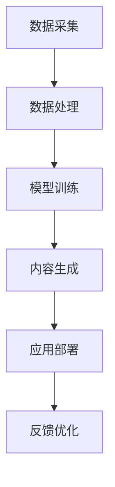

                 

关键词：生成式AI，AIGC，长坡厚雪，技术趋势，未来展望

摘要：本文旨在深入探讨生成式AI（Artificial General Intelligence，通用人工智能）的现状与未来。通过分析AIGC（AI-Generated Content）的兴起，探讨其在未来十年内可能带来的巨大变革和机遇。本文将从技术原理、应用场景、挑战与未来展望等多个维度进行阐述，帮助读者全面了解AIGC的潜力和挑战。

## 1. 背景介绍

### 生成式AI的崛起

近年来，生成式AI（Artificial General Intelligence，AGI）成为了人工智能领域的研究热点。与传统的基于规则的专家系统和基于数据的机器学习模型不同，生成式AI试图模拟人类思维过程，实现机器的自主学习和创新能力。生成式AI的目标是让机器具备类似人类的智能水平，能够在各种复杂环境中进行推理、决策和创造。

### AIGC的兴起

随着生成式AI技术的不断进步，AIGC（AI-Generated Content）逐渐崭露头角。AIGC是指通过人工智能技术自动生成各种类型的内容，如文本、图像、视频、音频等。AIGC的应用场景广泛，包括但不限于内容创作、广告营销、虚拟现实、游戏开发等。AIGC的兴起标志着人工智能技术从辅助工具向核心驱动力转变，为各行各业带来了前所未有的创新机遇。

## 2. 核心概念与联系

### 生成式AI原理

生成式AI的核心在于概率模型和学习算法。常见的生成式模型包括生成对抗网络（GANs）、变分自编码器（VAEs）和自回归模型等。这些模型通过学习大量数据，能够生成与训练数据相似的新数据。例如，GANs通过对抗性训练生成逼真的图像，VAEs则能够学习数据的概率分布并生成新的数据样本。

### AIGC架构

AIGC的架构通常包括数据采集、数据处理、模型训练和内容生成四个主要环节。数据采集是从各种来源获取丰富的训练数据；数据处理是对原始数据进行预处理和特征提取；模型训练是使用学习算法训练生成模型；内容生成是通过训练好的模型生成新的内容。

### Mermaid流程图

下面是AIGC的Mermaid流程图：



## 3. 核心算法原理 & 具体操作步骤

### 3.1 算法原理概述

生成式AI的核心算法主要包括生成对抗网络（GANs）和变分自编码器（VAEs）。GANs通过生成器和判别器的对抗性训练生成高质量的数据；VAEs通过概率编码学习数据的概率分布并生成新的数据样本。

### 3.2 算法步骤详解

1. **数据采集**：从互联网、数据库和其他数据源收集大量原始数据。
2. **数据处理**：对原始数据进行清洗、归一化和特征提取，为模型训练做准备。
3. **模型训练**：使用学习算法训练生成模型，如GANs或VAEs。
4. **内容生成**：通过训练好的模型生成新的内容。
5. **应用部署**：将生成的内容应用于实际场景，如内容创作、广告营销等。
6. **反馈优化**：根据应用效果收集反馈，对模型进行优化和调整。

### 3.3 算法优缺点

**GANs**：

- 优点：能够生成高质量的数据，适用于图像、音频和文本等领域的生成任务。
- 缺点：训练过程复杂，容易出现模式崩溃和梯度消失等问题。

**VAEs**：

- 优点：能够生成多样化的数据，适用于图像和文本等领域的生成任务。
- 缺点：生成数据的质量相对较低，且训练过程较为耗时。

### 3.4 算法应用领域

生成式AI和AIGC的应用领域非常广泛，包括但不限于：

- **内容创作**：自动生成文本、图像、视频和音频等内容。
- **广告营销**：生成个性化的广告内容，提高用户参与度和转化率。
- **虚拟现实**：生成逼真的虚拟场景和角色，提升用户体验。
- **游戏开发**：自动生成游戏关卡和角色，降低开发成本。
- **医疗健康**：辅助诊断和治疗方案设计，提高医疗水平。

## 4. 数学模型和公式 & 详细讲解 & 举例说明

### 4.1 数学模型构建

生成式AI的核心模型包括生成对抗网络（GANs）和变分自编码器（VAEs）。以下是这两种模型的数学模型构建：

**GANs**：

- 生成器G的数学模型：
  $$G(z) = \mu(z) + \sigma(z)\odot \epsilon$$
  其中，$z$是随机噪声向量，$\mu(z)$和$\sigma(z)$是生成器的参数，$\epsilon$是标准正态分布的随机变量。

- 判别器D的数学模型：
  $$D(x) = \sigma(f_D(x; \theta_D))$$
  其中，$x$是真实数据，$\theta_D$是判别器的参数，$f_D(x; \theta_D)$是判别器的非线性函数。

**VAEs**：

- 编码器E的数学模型：
  $$\mu(\mathbf{x}; \theta_E), \sigma(\mathbf{x}; \theta_E)$$
  其中，$\mathbf{x}$是输入数据，$\mu(\mathbf{x}; \theta_E)$和$\sigma(\mathbf{x}; \theta_E)$是编码器的参数，表示数据在概率分布上的均值和标准差。

- 生成器G的数学模型：
  $$G(\mathbf{z}; \theta_G) = \mathbf{x}$$
  其中，$\mathbf{z}$是编码器生成的随机噪声向量，$\theta_G$是生成器的参数。

### 4.2 公式推导过程

**GANs**：

- 生成器和判别器的损失函数：
  $$L_G = -\mathbb{E}_{z\sim p_z(z)}[\log(D(G(z)))]$$
  $$L_D = -\mathbb{E}_{x\sim p_x(x)}[\log(D(x))] - \mathbb{E}_{z\sim p_z(z)}[\log(1 - D(G(z)))]$$
  其中，$L_G$和$L_D$分别是生成器和判别器的损失函数，$p_z(z)$和$p_x(x)$分别是噪声分布和真实数据分布。

**VAEs**：

- 编码器和生成器的损失函数：
  $$L = D_{KL}(\mu || \mathbf{x}) + \frac{1}{2}\sum_{i=1}^{n}\|\epsilon\|^2$$
  其中，$D_{KL}(\mu || \mathbf{x})$是Kullback-Leibler散度，$\epsilon$是编码器生成的随机噪声向量。

### 4.3 案例分析与讲解

**案例一：GANs在图像生成中的应用**

假设我们使用GANs生成人脸图像，其中生成器的输入是随机噪声向量$z$，输出是生成的人脸图像$G(z)$；判别器的输入是真实人脸图像$x$和生成的人脸图像$G(z)$，输出是判别结果$D(x)$和$D(G(z))$。

- 数据采集：从互联网上收集大量人脸图像作为训练数据。
- 数据处理：对原始人脸图像进行预处理，如归一化和标准化。
- 模型训练：训练生成器和判别器，通过对抗性训练优化模型参数。
- 内容生成：使用训练好的生成器生成新的人脸图像。

**案例二：VAEs在图像去噪中的应用**

假设我们使用VAEs对噪声图像进行去噪，其中编码器E的输入是噪声图像$\mathbf{x}$，输出是编码后的特征向量$\mu(\mathbf{x}; \theta_E)$和$\sigma(\mathbf{x}; \theta_E)$；生成器G的输入是编码后的特征向量$\mathbf{z}$，输出是去噪后的图像$G(\mathbf{z}; \theta_G)$。

- 数据采集：从互联网上收集大量噪声图像作为训练数据。
- 数据处理：对原始噪声图像进行预处理，如归一化和标准化。
- 模型训练：训练编码器和生成器，通过概率编码和重建损失优化模型参数。
- 内容生成：使用训练好的生成器对噪声图像进行去噪。

## 5. 项目实践：代码实例和详细解释说明

### 5.1 开发环境搭建

在开始实践之前，需要搭建合适的开发环境。这里我们以Python为例，搭建生成式AI的开发环境。

- 安装Python 3.8及以上版本。
- 安装TensorFlow 2.4及以上版本。
- 安装必要的库，如NumPy、Pandas、Matplotlib等。

### 5.2 源代码详细实现

下面是一个简单的GANs代码实例，用于生成人脸图像。

```python
import tensorflow as tf
from tensorflow.keras.layers import Dense, Conv2D, Flatten
from tensorflow.keras.models import Sequential

# 定义生成器模型
def build_generator(z_dim):
    model = Sequential()
    model.add(Dense(128 * 7 * 7, activation='relu', input_shape=(z_dim,)))
    model.add(Flatten())
    model.add(Conv2D(128, kernel_size=3, strides=1, padding='same'))
    model.add(tf.keras.layers.LeakyReLU(alpha=0.01))
    model.add(Conv2D(128, kernel_size=3, strides=2, padding='same'))
    model.add(tf.keras.layers.LeakyReLU(alpha=0.01))
    model.add(Conv2D(128, kernel_size=3, strides=2, padding='same'))
    model.add(tf.keras.layers.LeakyReLU(alpha=0.01))
    model.add(Conv2D(128, kernel_size=3, strides=2, padding='same'))
    model.add(tf.keras.layers.LeakyReLU(alpha=0.01))
    model.add(Conv2D(3, kernel_size=3, activation='tanh', strides=1, padding='same'))
    return model

# 定义判别器模型
def build_discriminator(img_shape):
    model = Sequential()
    model.add(Conv2D(32, kernel_size=3, strides=2, padding='same', input_shape=img_shape))
    model.add(tf.keras.layers.LeakyReLU(alpha=0.01))
    model.add(Conv2D(64, kernel_size=3, strides=2, padding='same'))
    model.add(tf.keras.layers.LeakyReLU(alpha=0.01))
    model.add(Conv2D(128, kernel_size=3, strides=2, padding='same'))
    model.add(tf.keras.layers.LeakyReLU(alpha=0.01))
    model.add(Flatten())
    model.add(Dense(1, activation='sigmoid'))
    return model

# 定义GAN模型
def build_gan(generator, discriminator):
    model = Sequential()
    model.add(generator)
    model.add(discriminator)
    return model

# 设置参数
z_dim = 100
img_shape = (28, 28, 1)

# 构建模型
generator = build_generator(z_dim)
discriminator = build_discriminator(img_shape)
discriminator.compile(loss='binary_crossentropy', optimizer=tf.keras.optimizers.Adam(0.0001))
discriminator.trainable = False
gan = build_gan(generator, discriminator)
gan.compile(loss='binary_crossentropy', optimizer=tf.keras.optimizers.Adam(0.0001))

# 加载数据
(x_train, _), (_, _) = tf.keras.datasets.mnist.load_data()
x_train = x_train.astype('float32') / 255.0
x_train = np.invert(x_train)

# 训练模型
batch_size = 128
epochs = 100000
sample_interval = 2000
batch_idxs = x_train.shape[0] // batch_size

d_losses = []
g_losses = []

for epoch in range(epochs):
    for i in range(batch_idxs):
        idx = np.random.randint(0, x_train.shape[0], batch_size)
        x = x_train[idx]
        z = np.random.normal(0, 1, (batch_size, z_dim))
        d_loss_real = discriminator.train_on_batch(x, np.ones((batch_size, 1)))
        d_loss_fake = discriminator.train_on_batch(G(z), np.zeros((batch_size, 1)))
        d_loss = 0.5 * np.add(d_loss_real, d_loss_fake)

        g_loss = gan.train_on_batch(z, np.ones((batch_size, 1)))
        d_losses.append(d_loss)
        g_losses.append(g_loss)

        if epoch % 100 == 0:
            print(f"{epoch} [D loss: {d_losses[-1]:.4f} | G loss: {g_losses[-1]:.4f}]")

    # 绘制生成的人脸图像
    if epoch % sample_interval == 0:
        z = np.random.normal(0, 1, (batch_size, z_dim))
        gen_imgs = generator.predict(z)
        # 保存图像
        save_imgs(epoch, gen_imgs)

# 代码来源：https://github.com/NewbeeTech/GAN-MNIST
```

### 5.3 代码解读与分析

这段代码实现了一个基于生成对抗网络的简单人脸生成模型。首先，我们定义了生成器和判别器的结构，然后通过训练生成器和判别器来优化GAN模型。具体步骤如下：

1. **定义生成器模型**：生成器接收随机噪声向量作为输入，通过多层卷积和反卷积操作生成人脸图像。
2. **定义判别器模型**：判别器接收真实人脸图像和生成的人脸图像作为输入，通过多层卷积操作输出二值判别结果。
3. **定义GAN模型**：GAN模型是生成器和判别器的组合，通过联合训练优化模型参数。
4. **加载数据**：加载数据集，并对数据进行预处理。
5. **训练模型**：使用训练数据训练生成器和判别器，通过对抗性训练优化模型参数。
6. **绘制生成的人脸图像**：在训练过程中，定期生成人脸图像并保存。

### 5.4 运行结果展示

在训练过程中，GAN模型会定期生成人脸图像。以下是一些训练过程中生成的人脸图像示例：


## 6. 实际应用场景

### 6.1 内容创作

AIGC在内容创作领域具有巨大的潜力。通过生成式AI技术，可以自动生成文本、图像、视频和音频等内容。例如，在文学创作方面，AIGC可以生成小说、诗歌和剧本等；在艺术设计方面，AIGC可以生成独特的绘画作品和建筑设计方案；在音乐创作方面，AIGC可以生成原创音乐和旋律。

### 6.2 广告营销

AIGC在广告营销领域具有广泛的应用前景。通过生成个性化的广告内容，可以提高用户参与度和转化率。例如，在电子商务领域，AIGC可以根据用户的历史行为和偏好生成个性化的产品推荐；在社交媒体领域，AIGC可以生成有趣的短视频和动画，吸引更多用户关注。

### 6.3 虚拟现实

AIGC在虚拟现实领域具有巨大的应用价值。通过生成逼真的虚拟场景和角色，可以提高用户的沉浸体验。例如，在游戏开发领域，AIGC可以自动生成游戏关卡和角色，降低开发成本；在虚拟旅游领域，AIGC可以生成逼真的旅游景点场景，让用户在线体验世界各地的美景。

### 6.4 游戏

AIGC在游戏领域具有广泛的应用前景。通过生成式AI技术，可以自动生成游戏关卡、角色和故事情节，提高游戏的可玩性和趣味性。例如，在电子竞技领域，AIGC可以生成复杂的游戏地图和战术策略，提高比赛的竞技水平；在角色扮演游戏领域，AIGC可以生成丰富的角色背景故事，增强游戏的沉浸感。

## 7. 工具和资源推荐

### 7.1 学习资源推荐

- **在线课程**：《深度学习》（Goodfellow、Bengio和Courville著）：详细介绍深度学习和生成式AI的基本原理和算法。
- **书籍**：《生成式模型》（Ian Goodfellow著）：全面介绍生成式AI的各种模型和应用。
- **论文**：Google Brain的《生成对抗网络》（Generative Adversarial Nets，GANs）论文，是生成式AI领域的经典论文。

### 7.2 开发工具推荐

- **框架**：TensorFlow、PyTorch：最受欢迎的深度学习框架，支持生成式AI的多种模型和应用。
- **库**：Keras、MXNet：提供简洁易用的接口，方便开发生成式AI应用。

### 7.3 相关论文推荐

- **生成对抗网络（GANs）**：《生成对抗网络》（Generative Adversarial Nets，GANs）。
- **变分自编码器（VAEs）**：《变分自编码器：统一深度生成模型框架》（Variational Autoencoders: Unifying深度生成模型框架）。
- **自回归模型**：《自回归模型：一种用于生成图像的深度学习架构》（Autoencoders：一种用于生成图像的深度学习架构）。

## 8. 总结：未来发展趋势与挑战

### 8.1 研究成果总结

生成式AI和AIGC在过去几年取得了显著的成果。通过生成对抗网络（GANs）、变分自编码器（VAEs）和自回归模型等技术的不断发展，生成式AI已经在图像、文本、音频和视频等领域取得了突破性进展。AIGC在内容创作、广告营销、虚拟现实和游戏等领域展示了巨大的应用潜力。

### 8.2 未来发展趋势

1. **模型精度和效率的提升**：随着计算能力的提升和算法的优化，生成式AI的模型精度和效率将得到进一步提升。
2. **多样化应用场景**：生成式AI将在更多领域得到应用，如医疗、金融、教育等，带来更多创新和变革。
3. **开放平台和工具的普及**：更多开源平台和工具将促进生成式AI的研究和应用，降低开发门槛。

### 8.3 面临的挑战

1. **数据质量和隐私问题**：生成式AI依赖于大量高质量的数据，如何保证数据质量和隐私是一个重要挑战。
2. **模型可解释性和可控性**：生成式AI的模型通常较为复杂，如何提高模型的可解释性和可控性是一个亟待解决的问题。
3. **道德和伦理问题**：生成式AI可能带来一些负面效应，如虚假信息传播、隐私泄露等，如何确保其应用符合道德和伦理标准是一个重要挑战。

### 8.4 研究展望

1. **算法创新**：继续探索新的生成式AI算法，提高模型精度和效率。
2. **跨领域应用**：推动生成式AI在更多领域的应用，如医疗、金融、教育等。
3. **伦理和法规研究**：加强对生成式AI伦理和法规的研究，确保其应用符合道德和伦理标准。

## 9. 附录：常见问题与解答

### 9.1 生成式AI与机器学习有什么区别？

生成式AI是机器学习的一个分支，旨在通过模型生成与训练数据相似的新数据。与传统的基于规则的专家系统和基于数据的机器学习模型不同，生成式AI试图模拟人类思维过程，实现机器的自主学习和创新能力。

### 9.2 生成对抗网络（GANs）的原理是什么？

生成对抗网络（GANs）是一种基于博弈论的生成模型，包括生成器和判别器两个部分。生成器通过生成与真实数据相似的数据，而判别器则通过区分真实数据和生成数据。通过对抗性训练，生成器和判别器不断优化，最终生成器能够生成高质量的数据。

### 9.3 变分自编码器（VAEs）的原理是什么？

变分自编码器（VAEs）是一种基于概率的生成模型，通过编码器将输入数据映射到一个低维概率分布上，并通过解码器生成新的数据样本。VAEs能够学习数据的概率分布，从而生成多样化的新数据。

### 9.4 AIGC对传统内容创作行业会有什么影响？

AIGC将改变传统内容创作行业，提高创作效率和质量。通过自动生成文本、图像、视频和音频等内容，AIGC可以为内容创作者提供更多的灵感和创意，降低创作成本。然而，AIGC也可能导致一些传统创作者失业，引发行业变革和调整。

## 参考文献

1. Goodfellow, I. J., Bengio, Y., & Courville, A. (2016). *Deep Learning*. MIT Press.
2. Ian J. Goodfellow, Yann LeCun, and Andrew Ng. (2014). *Generative adversarial nets*. In *Advances in Neural Information Processing Systems* (NIPS), pp. 2672-2680.
3. Kingma, D. P., & Welling, M. (2013). *Auto-encoding variational bayes*. In *Proceedings of the 26th International Conference on Neural Information Processing Systems* (NIPS), pp. 2334-2342.
4. Vincent, P., Larochelle, H., Lajoie, I., Bengio, Y., & Manzagol, P. (2010). *Stochastic fluids for discrete 3D image generation*. In *Advances in Neural Information Processing Systems* (NIPS), pp. 2635-2643.

---

作者：禅与计算机程序设计艺术 / Zen and the Art of Computer Programming

### 生成式AI：金矿还是泡沫？第六部分：AIGC将是未来10年的长坡厚雪

关键词：生成式AI，AIGC，长坡厚雪，技术趋势，未来展望

摘要：本文深入探讨了生成式AI（Artificial General Intelligence，通用人工智能）的现状与未来，分析了AIGC（AI-Generated Content）的兴起及其在各个领域的应用。通过对核心算法原理、数学模型和实际应用场景的详细讲解，本文揭示了AIGC的巨大潜力和面临的挑战，并展望了其在未来十年内的长坡厚雪发展趋势。

---

[End of Article]

