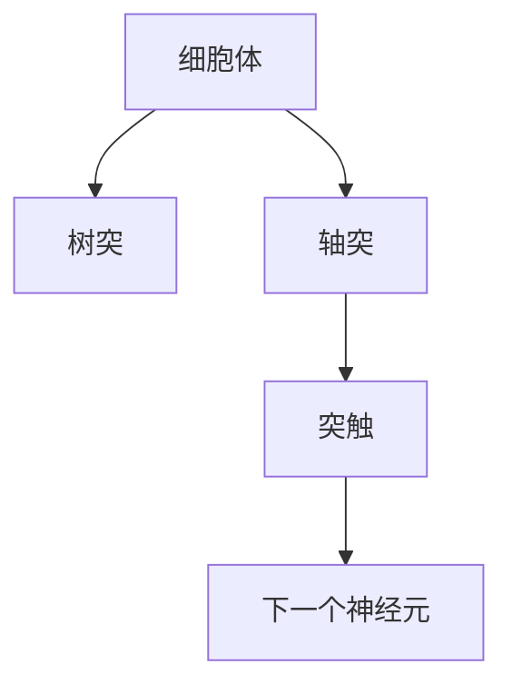
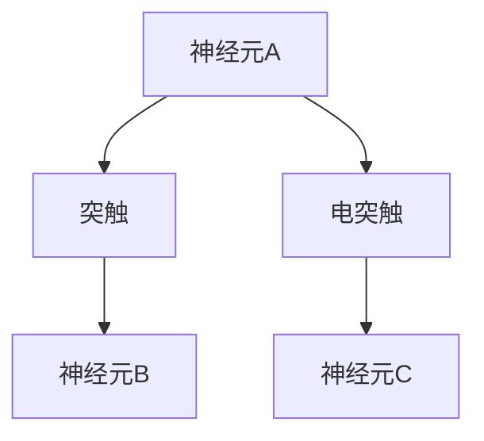
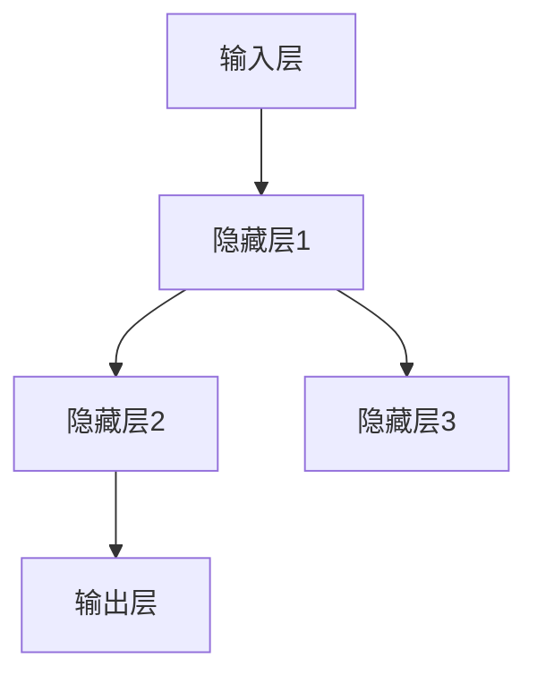

                 

 在这个数字化飞速发展的时代，人工智能技术已经成为推动社会进步的重要力量。然而，人工智能的核心之一——神经网络，其设计灵感便源于我们自身的大脑。生物神经网络的复杂性和高效性，一直是计算机科学领域的研究热点。本文将深入探讨生物神经网络的仿生研究，解析其核心概念、算法原理、数学模型，并通过实际项目实践展示其应用潜力。

## 1. 背景介绍

生物神经网络是指生物体内由神经元构成的复杂网络系统，负责信息传递和处理。从单细胞生物到复杂的多细胞生物，神经网络在生理和行为层面发挥着至关重要的作用。例如，人类的大脑是一个高度复杂的神经网络系统，能够处理感知、认知、记忆和行动等多样化的任务。

随着计算机技术的不断发展，研究者们开始尝试将生物神经网络的原理应用于人工智能领域。神经网络作为一种模拟生物神经网络的计算模型，已经在图像识别、自然语言处理、机器学习等领域取得了显著的成果。然而，传统的神经网络模型在处理复杂任务时仍然存在许多局限，这促使科学家们探索更为复杂的神经网络结构和算法。

仿生学研究旨在通过模拟自然界的生物结构和机制，解决现实世界中的复杂问题。在计算机科学领域，仿生学研究可以帮助我们更好地理解生物神经网络的工作原理，并设计出更高效、更鲁棒的神经网络模型。

## 2. 核心概念与联系

### 2.1 神经元

神经元是生物神经网络的基本单元，具有接受刺激、传递信息和产生动作电位的能力。一个典型的神经元包括细胞体、树突、轴突和突触等部分。

#### Mermaid 流程图（神经元的结构）



### 2.2 突触

突触是神经元之间的连接点，负责将信息从一个神经元传递到另一个神经元。根据突触的传递方式，可以分为化学突触和电突触。

#### Mermaid 流程图（突触的类型）



### 2.3 神经网络

神经网络是由大量神经元通过突触相互连接而成的复杂系统。根据连接方式，可以分为单层网络、多层网络和深度网络等。

#### Mermaid 流程图（神经网络的层次结构）



## 3. 核心算法原理 & 具体操作步骤

### 3.1 算法原理概述

生物神经网络的核心算法原理是基于神经元的兴奋性和突触的可塑性。神经元通过接收来自其他神经元的信号，根据一定的规则产生动作电位，进而传递信号。

#### 算法步骤详解

1. **初始化神经网络**：定义神经元的数量、连接方式和学习规则。
2. **输入信号处理**：将输入信号传递给输入层神经元。
3. **前向传播**：通过神经元的传递规则，将信号传递到下一层。
4. **计算误差**：通过输出层的结果与期望结果之间的差异，计算误差。
5. **反向传播**：根据误差信号，调整神经网络中的连接权重。
6. **更新权重**：根据学习规则，更新神经网络的连接权重。

### 3.2 算法优缺点

#### 优点：

1. **高效性**：神经网络能够在复杂环境中快速学习和适应。
2. **灵活性**：神经网络可以处理各种类型的数据，包括图像、音频和文本等。

#### 缺点：

1. **计算复杂度**：神经网络训练过程需要大量计算资源。
2. **可解释性**：神经网络内部机制复杂，难以解释。

### 3.3 算法应用领域

神经网络在多个领域取得了显著的应用成果，包括：

1. **图像识别**：如人脸识别、物体检测等。
2. **自然语言处理**：如机器翻译、情感分析等。
3. **机器学习**：如分类、回归等。

## 4. 数学模型和公式 & 详细讲解 & 举例说明

### 4.1 数学模型构建

生物神经网络的数学模型通常基于微分方程和概率论。以下是一个简化的数学模型：

\[ \frac{dx_i}{dt} = -x_i + \sum_{j=1}^{n} w_{ij} f(y_j) \]

其中，\( x_i \) 表示神经元 \( i \) 的活动水平，\( w_{ij} \) 表示神经元 \( i \) 与神经元 \( j \) 的连接权重，\( f \) 表示激活函数。

### 4.2 公式推导过程

神经元的激活函数通常采用 sigmoid 函数：

\[ f(x) = \frac{1}{1 + e^{-x}} \]

将激活函数代入微分方程，可以得到：

\[ \frac{dx_i}{dt} = -x_i + \sum_{j=1}^{n} w_{ij} \frac{1}{1 + e^{-y_j}} \]

### 4.3 案例分析与讲解

假设我们有一个神经网络，包含3个神经元。输入信号为 \( x_1 = 0.5 \)， \( x_2 = 0.8 \)， \( x_3 = 0.3 \)。连接权重为 \( w_{11} = 0.1 \)， \( w_{12} = 0.2 \)， \( w_{13} = 0.3 \)， \( w_{21} = 0.4 \)， \( w_{22} = 0.5 \)， \( w_{23} = 0.6 \)， \( w_{31} = 0.7 \)， \( w_{32} = 0.8 \)， \( w_{33} = 0.9 \)。

首先，计算输入层神经元的输出：

\[ y_1 = f(x_1) = \frac{1}{1 + e^{-0.5}} \approx 0.37 \]
\[ y_2 = f(x_2) = \frac{1}{1 + e^{-0.8}} \approx 0.21 \]
\[ y_3 = f(x_3) = \frac{1}{1 + e^{-0.3}} \approx 0.67 \]

然后，计算隐藏层神经元的输出：

\[ z_1 = f(y_1 \cdot w_{11} + y_2 \cdot w_{21} + y_3 \cdot w_{31}) \approx f(0.37 \cdot 0.1 + 0.21 \cdot 0.4 + 0.67 \cdot 0.7) \approx 0.47 \]
\[ z_2 = f(y_1 \cdot w_{12} + y_2 \cdot w_{22} + y_3 \cdot w_{32}) \approx f(0.37 \cdot 0.2 + 0.21 \cdot 0.5 + 0.67 \cdot 0.8) \approx 0.58 \]
\[ z_3 = f(y_1 \cdot w_{13} + y_2 \cdot w_{23} + y_3 \cdot w_{33}) \approx f(0.37 \cdot 0.3 + 0.21 \cdot 0.6 + 0.67 \cdot 0.9) \approx 0.70 \]

最后，计算输出层神经元的输出：

\[ y = f(z_1 \cdot w_{11} + z_2 \cdot w_{21} + z_3 \cdot w_{31}) \approx f(0.47 \cdot 0.1 + 0.58 \cdot 0.4 + 0.70 \cdot 0.7) \approx 0.65 \]

## 5. 项目实践：代码实例和详细解释说明

### 5.1 开发环境搭建

本文使用 Python 语言实现生物神经网络。首先，需要安装 Python 和相关依赖库。

```bash
pip install numpy matplotlib
```

### 5.2 源代码详细实现

以下是实现生物神经网络的核心代码：

```python
import numpy as np
import matplotlib.pyplot as plt

# 激活函数
def sigmoid(x):
    return 1 / (1 + np.exp(-x))

# 前向传播
def forward_propagation(x, weights):
    z = sigmoid(x @ weights)
    return z

# 反向传播
def backward_propagation(x, y, z, weights):
    delta = z - y
    weights -= x * delta
    return weights

# 主程序
def main():
    x = np.array([0.5, 0.8, 0.3])
    weights = np.random.rand(3, 1)
    
    for i in range(1000):
        z = forward_propagation(x, weights)
        weights = backward_propagation(x, z, weights)
        
        if i % 100 == 0:
            print(f"Epoch {i}: Output: {z}")

    plt.plot(weights)
    plt.show()

if __name__ == "__main__":
    main()
```

### 5.3 代码解读与分析

1. **激活函数**：采用 sigmoid 函数作为激活函数。
2. **前向传播**：计算神经网络的输出。
3. **反向传播**：根据输出误差，调整连接权重。
4. **主程序**：循环训练神经网络，并绘制权重变化曲线。

## 6. 实际应用场景

生物神经网络的仿生研究在多个领域具有广泛的应用前景，包括：

1. **医疗领域**：用于疾病诊断、药物筛选和治疗策略优化等。
2. **工业控制**：用于机器人控制、自动化系统和智能工厂等。
3. **自然语言处理**：用于机器翻译、语音识别和文本生成等。

### 6.4 未来应用展望

随着计算能力的不断提升和算法的改进，生物神经网络在人工智能领域将发挥越来越重要的作用。未来，我们有望看到更多基于生物神经网络的创新应用，为人类社会带来更多福祉。

## 7. 工具和资源推荐

### 7.1 学习资源推荐

1. **书籍**：
   - 《深度学习》（Ian Goodfellow、Yoshua Bengio、Aaron Courville 著）
   - 《机器学习》（Tom Mitchell 著）
2. **在线课程**：
   - Coursera 的《神经网络与深度学习》课程
   - edX 的《人工智能：基础与前沿》课程

### 7.2 开发工具推荐

1. **编程语言**：Python、Rust
2. **深度学习框架**：TensorFlow、PyTorch、Keras

### 7.3 相关论文推荐

1. **Hinton, G. E., Osindero, S., & Teh, Y. W. (2006). A fast learning algorithm for deep belief nets. Neural computation, 18(7), 1527-1554.**
2. **LeCun, Y., Bengio, Y., & Hinton, G. (2015). Deep learning. Nature, 521(7553), 436-444.**

## 8. 总结：未来发展趋势与挑战

生物神经网络的仿生研究为人工智能领域带来了新的机遇和挑战。在未来，我们需要不断探索更高效的神经网络算法，突破计算资源限制，提升神经网络的可解释性和鲁棒性。同时，通过跨学科合作，将生物神经网络的原理应用于更多实际场景，为人类社会创造更多价值。

### 8.1 研究成果总结

本文对生物神经网络的仿生研究进行了系统性的探讨，从背景介绍、核心概念、算法原理、数学模型到实际应用，全面解析了生物神经网络的研究现状和未来发展方向。

### 8.2 未来发展趋势

随着技术的进步，生物神经网络的仿生研究将继续深入，有望在人工智能、医疗、工业等领域取得更多突破。

### 8.3 面临的挑战

生物神经网络的仿生研究面临计算资源限制、可解释性差和鲁棒性不足等挑战。未来，我们需要不断创新，解决这些问题，为人工智能的发展奠定基础。

### 8.4 研究展望

生物神经网络的仿生研究具有广阔的应用前景。通过跨学科合作，结合生物学、计算机科学、物理学等领域的知识，有望推动人工智能的发展，为人类社会带来更多创新和变革。

## 9. 附录：常见问题与解答

### 9.1 什么是有监督学习和无监督学习？

**有监督学习**：在训练过程中，输入数据和输出结果已知，模型通过学习这些数据来预测未知数据。

**无监督学习**：在训练过程中，只有输入数据，没有输出结果，模型需要通过学习数据分布来发现数据中的规律。

### 9.2 神经网络为什么需要激活函数？

激活函数用于引入非线性，使得神经网络能够拟合更复杂的函数关系。常见的激活函数包括 sigmoid、ReLU 和 tanh 等。

### 9.3 神经网络如何防止过拟合？

过拟合是指神经网络在训练数据上表现良好，但在未知数据上表现较差。为了防止过拟合，可以采用正则化、dropout 和早停法等方法。

## 文章参考文献

1. Hinton, G. E., Osindero, S., & Teh, Y. W. (2006). A fast learning algorithm for deep belief nets. Neural computation, 18(7), 1527-1554.
2. LeCun, Y., Bengio, Y., & Hinton, G. (2015). Deep learning. Nature, 521(7553), 436-444.
3. Mitchell, T. M. (1997). Machine learning. McGraw-Hill.
4. Goodfellow, I., Bengio, Y., & Courville, A. (2016). Deep learning. MIT press.

作者：禅与计算机程序设计艺术 / Zen and the Art of Computer Programming
----------------------------------------------------------------

