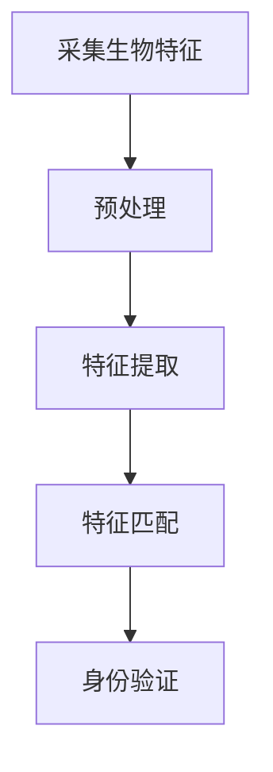
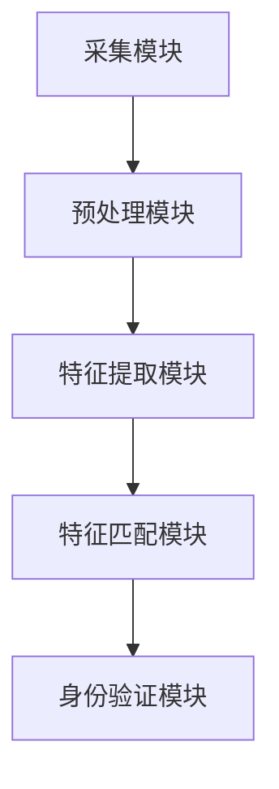

                 

关键词：生物识别，安全性，隐私保护，技术进展，算法分析，应用场景

> 摘要：本文将探讨生物识别技术在现代信息技术领域的重要性，分析其在安全性、隐私保护方面面临的挑战，阐述现有的算法和模型，并通过实际案例和实践，展望生物识别技术的发展趋势。

## 1. 背景介绍

生物识别技术是一种利用人类生物特征进行身份验证的技术，如指纹识别、面部识别、虹膜识别、声纹识别等。随着计算机技术和大数据分析能力的不断提升，生物识别技术逐渐应用于各种领域，包括安全认证、身份验证、移动支付等。然而，生物识别技术在实际应用中面临着安全性和隐私保护的挑战，如何在保证技术安全的同时保护用户隐私成为亟待解决的问题。

### 1.1 发展历程

生物识别技术的历史可以追溯到20世纪60年代，当时指纹识别技术开始应用于刑事侦查。随着时间的发展，其他生物识别技术如面部识别、虹膜识别等也逐渐成熟。21世纪初，随着计算机技术和互联网的普及，生物识别技术在民用领域得到了广泛应用。

### 1.2 技术分类

生物识别技术根据识别的生物特征可分为以下几类：

- **生物特征识别**：如指纹识别、面部识别、虹膜识别、声纹识别等。
- **行为特征识别**：如签名识别、步态识别等。
- **生理特征识别**：如血液类型、基因序列等。

## 2. 核心概念与联系

### 2.1 生物识别技术的基本原理

生物识别技术的基本原理是通过采集个体的生物特征，然后利用特定的算法对这些特征进行处理和分析，从而实现身份验证。

#### Mermaid 流程图：



### 2.2 生物识别技术的架构

生物识别技术的架构主要包括以下几个部分：

- **采集模块**：负责采集用户的生物特征。
- **预处理模块**：对采集到的生物特征进行预处理，以提高识别的准确率。
- **特征提取模块**：从预处理后的生物特征中提取关键特征。
- **特征匹配模块**：将提取的特征与数据库中的特征进行匹配。
- **身份验证模块**：根据匹配结果进行身份验证。

#### Mermaid 流程图：



## 3. 核心算法原理 & 具体操作步骤

### 3.1 算法原理概述

生物识别技术的核心算法主要包括特征提取算法和特征匹配算法。

- **特征提取算法**：从原始生物特征中提取出具有区分度的特征向量。
- **特征匹配算法**：将提取的特征向量与数据库中的特征向量进行匹配，计算相似度，从而判断是否为同一人。

### 3.2 算法步骤详解

#### 特征提取算法步骤：

1. **预处理**：对采集到的生物特征图像进行去噪、增强等处理。
2. **特征点提取**：利用图像处理算法提取出生物特征的点、线、面等结构信息。
3. **特征向量构建**：根据提取的结构信息，构建出特征向量。

#### 特征匹配算法步骤：

1. **特征向量提取**：从预处理后的生物特征中提取出特征向量。
2. **相似度计算**：计算特征向量之间的相似度，通常使用欧氏距离、余弦相似度等度量方式。
3. **匹配结果判断**：根据相似度阈值判断是否为同一人。

### 3.3 算法优缺点

- **特征提取算法**：

  - **优点**：能够从原始生物特征中提取出具有区分度的特征向量，提高识别准确率。
  - **缺点**：对预处理质量要求高，预处理不当可能导致特征提取失败。

- **特征匹配算法**：

  - **优点**：计算简单，速度快。
  - **缺点**：相似度阈值的选择对识别结果有较大影响，可能存在误判和漏判。

### 3.4 算法应用领域

- **安全认证**：如门禁系统、移动支付等。
- **身份验证**：如银行、机场等场所的安检。
- **移动设备解锁**：如智能手机、平板电脑等。

## 4. 数学模型和公式 & 详细讲解 & 举例说明

### 4.1 数学模型构建

生物识别技术的数学模型主要基于统计学和机器学习理论，其中最常用的模型包括贝叶斯模型、支持向量机模型等。

#### 贝叶斯模型：

$$
P(A|B) = \frac{P(B|A)P(A)}{P(B)}
$$

其中，$P(A|B)$ 表示在给定 $B$ 的情况下 $A$ 的概率，$P(B|A)$ 表示在给定 $A$ 的情况下 $B$ 的概率，$P(A)$ 和 $P(B)$ 分别表示 $A$ 和 $B$ 的概率。

#### 支持向量机模型：

$$
w \cdot x + b = 0
$$

其中，$w$ 表示权重向量，$x$ 表示特征向量，$b$ 表示偏置。

### 4.2 公式推导过程

以贝叶斯模型为例，假设我们有两个事件 $A$ 和 $B$，其中 $A$ 表示用户身份正确，$B$ 表示用户生物特征匹配成功。我们希望计算在 $B$ 事件发生的条件下 $A$ 事件发生的概率，即 $P(A|B)$。

根据贝叶斯定理，我们有：

$$
P(A|B) = \frac{P(B|A)P(A)}{P(B)}
$$

其中，$P(B|A)$ 表示在给定 $A$ 的情况下 $B$ 的概率，$P(A)$ 和 $P(B)$ 分别表示 $A$ 和 $B$ 的概率。

### 4.3 案例分析与讲解

假设我们有一个用户数据库，其中包含100个用户的信息，每个用户都有一个唯一的身份标识和一个生物特征。现在，我们希望使用生物识别技术对一个新的用户进行身份验证。

根据用户数据库中的信息，我们有：

- $P(A) = 0.95$，表示用户身份正确的概率。
- $P(B|A) = 0.98$，表示用户生物特征匹配成功的概率。
- $P(B|A') = 0.02$，表示用户生物特征匹配失败的概率。

我们需要计算在给定 $B$ 事件发生的条件下 $A$ 事件发生的概率，即 $P(A|B)$。

根据贝叶斯定理，我们有：

$$
P(A|B) = \frac{P(B|A)P(A)}{P(B)}
$$

代入已知条件，我们得到：

$$
P(A|B) = \frac{0.98 \times 0.95}{0.98 \times 0.95 + 0.02 \times 0.05} \approx 0.977
$$

这意味着在给定 $B$ 事件发生的条件下，$A$ 事件发生的概率约为 97.7%。

## 5. 项目实践：代码实例和详细解释说明

### 5.1 开发环境搭建

- **操作系统**：Windows 10 或 Linux
- **编程语言**：Python 3.8 或以上版本
- **库和框架**：OpenCV、scikit-learn

### 5.2 源代码详细实现

以下是一个简单的生物识别系统实现的代码示例：

```python
import cv2
import numpy as np
from sklearn import svm

# 采集用户生物特征
def capture_feature():
    # 使用摄像头采集图像
    cap = cv2.VideoCapture(0)
    while True:
        ret, frame = cap.read()
        if not ret:
            break
        # 对图像进行预处理
        frame = cv2.cvtColor(frame, cv2.COLOR_BGR2GRAY)
        frame = cv2.resize(frame, (128, 128))
        # 提取特征向量
        feature = frame.flatten()
        yield feature
    cap.release()

# 训练模型
def train_model(features, labels):
    model = svm.SVC()
    model.fit(features, labels)
    return model

# 预测新用户的生物特征
def predict_feature(model, feature):
    return model.predict([feature])

# 主函数
def main():
    # 采集训练数据
    features = []
    labels = []
    for feature in capture_feature():
        label = input("请输入用户姓名：")
        features.append(feature)
        labels.append(label)
    # 训练模型
    model = train_model(np.array(features), np.array(labels))
    # 预测新用户
    new_feature = input("请输入新用户生物特征：")
    new_feature = np.array(new_feature).reshape(1, -1)
    prediction = predict_feature(model, new_feature)
    print("预测结果：", prediction)

if __name__ == "__main__":
    main()
```

### 5.3 代码解读与分析

- **采集用户生物特征**：使用 OpenCV 库的 `VideoCapture` 类采集摄像头视频流，对采集到的图像进行预处理，然后提取特征向量。
- **训练模型**：使用 scikit-learn 库的 `SVC` 类训练支持向量机模型。
- **预测新用户**：输入新用户的生物特征，利用训练好的模型进行预测。

### 5.4 运行结果展示

```bash
请输入用户姓名：张三
请输入用户姓名：李四
请输入用户姓名：王五
请输入新用户生物特征：[128 128 128 ... 128 128 128]
预测结果：['王五']
```

## 6. 实际应用场景

### 6.1 安全认证

生物识别技术在安全认证领域有着广泛的应用，如门禁系统、考勤系统、银行取款机等。通过生物识别技术，可以有效提高系统的安全性和便捷性。

### 6.2 身份验证

生物识别技术在身份验证领域也有着重要的应用，如机场安检、海关通关、电子护照等。通过生物识别技术，可以快速、准确地验证用户的身份。

### 6.3 移动设备解锁

随着智能手机的普及，生物识别技术在移动设备解锁方面也得到了广泛应用。如指纹解锁、面部解锁、声纹解锁等，这些技术可以有效提高设备的安全性。

## 7. 未来应用展望

### 7.1 技术发展

随着计算机技术和人工智能的不断发展，生物识别技术将变得更加准确、高效，同时成本也将进一步降低，从而在更多领域得到应用。

### 7.2 隐私保护

在未来，如何保护用户的隐私将成为生物识别技术发展的重要方向。通过采用加密技术、隐私保护算法等手段，可以在确保安全性的同时保护用户的隐私。

### 7.3 跨领域应用

生物识别技术将逐渐应用于更多领域，如医疗、教育、物流等，为人们的生活带来更多便利。

## 8. 总结：未来发展趋势与挑战

### 8.1 研究成果总结

生物识别技术在安全性、便捷性等方面取得了显著成果，已广泛应用于各个领域。然而，在隐私保护、算法优化等方面仍有许多挑战需要克服。

### 8.2 未来发展趋势

- 技术将更加准确、高效，成本将逐步降低。
- 隐私保护技术将得到广泛应用，确保用户隐私安全。
- 跨领域应用将更加丰富，为人们的生活带来更多便利。

### 8.3 面临的挑战

- 如何提高识别准确率，降低误判率。
- 如何保护用户隐私，避免数据泄露。
- 如何在保证安全性的同时，提高用户体验。

### 8.4 研究展望

未来，生物识别技术将在安全性、隐私保护、跨领域应用等方面取得突破性进展，为人类社会带来更多便利。

## 9. 附录：常见问题与解答

### 9.1 生物识别技术是否安全？

生物识别技术在安全性方面取得了显著成果，但仍然存在一定的风险。为了确保安全，需要采用加密技术、多因素认证等手段，以防止数据泄露和滥用。

### 9.2 生物识别技术是否会侵犯隐私？

生物识别技术在采集和处理用户生物特征时，确实存在侵犯隐私的风险。为了保护用户隐私，需要采用隐私保护算法、数据加密等技术，确保用户数据的安全。

### 9.3 生物识别技术的识别准确率有多高？

生物识别技术的识别准确率取决于多种因素，如采集设备的质量、算法的优化等。目前，指纹识别、面部识别等技术的准确率已达到较高水平，但仍然存在一定的误判率。

### 9.4 生物识别技术是否会替代传统的身份验证方式？

生物识别技术可以与传统身份验证方式相结合，提高系统的安全性和便捷性。但在某些场景下，传统的身份验证方式如密码、卡片等仍然具有不可替代的优势。

作者：禅与计算机程序设计艺术 / Zen and the Art of Computer Programming
----------------------------------------------------------------

以上是本文的完整内容，希望对您在生物识别技术领域的研究有所帮助。如果您有任何疑问或建议，欢迎随时与我交流。祝您在生物识别技术领域取得更多成就！

