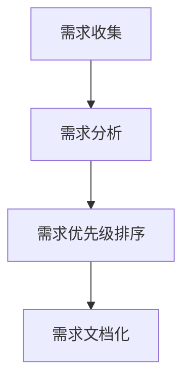

                 

关键词：用户故事、需求管理、敏捷实践、创业公司、软件开发、团队协作

> 摘要：本文深入探讨了用户故事与需求管理在创业公司敏捷实践中的重要性。通过介绍用户故事的概念、编写方法和需求管理的技巧，本文旨在为创业公司的软件开发团队提供实用的指南，帮助他们更有效地与用户沟通，确保项目顺利进行，最终实现产品成功。

## 1. 背景介绍

在当今快速发展的科技行业中，创业公司不断涌现，它们面临着前所未有的机遇和挑战。如何在激烈的市场竞争中脱颖而出，实现产品的快速迭代和高质量交付，成为创业公司成功的关键因素。敏捷开发作为一种敏捷、灵活、高效的软件开发方法，逐渐成为创业公司的首选。

敏捷开发强调团队协作、用户参与和持续交付，其中用户故事和需求管理起到了至关重要的作用。用户故事是一种简明扼要的描述，用于定义用户的需求和期望。需求管理则是一个系统化的过程，旨在确保用户故事的有效实现。本文将围绕这两个核心概念，探讨如何在创业公司的敏捷实践中有效运用。

## 2. 核心概念与联系

### 2.1 用户故事

用户故事是一种描述用户需求和功能的简短叙述，通常由三个部分组成：用户角色、功能目标和商业价值。其格式通常为：“作为[用户角色]，我想要[功能目标]，以便[商业价值]”。

#### 用户故事格式示例：
```
作为用户，我想要搜索产品，以便快速找到所需商品。
```

用户故事的特点是简洁、具体和可测试。它们可以帮助团队更好地理解用户的需求，并将其转化为可执行的任务。

### 2.2 需求管理

需求管理是一个系统化的过程，旨在确保用户故事的有效实现。它包括以下关键步骤：

- 需求收集：通过与用户、利益相关者和市场调研，收集潜在的需求。
- 需求分析：分析用户故事，确保它们符合业务目标和用户需求。
- 需求优先级排序：根据业务价值和紧急程度，对需求进行优先级排序。
- 需求文档化：将用户故事和需求文档化，以便团队参考和跟踪。

#### 需求管理流程图：


### 2.3 用户故事与需求管理的关系

用户故事是需求管理的核心，需求管理则为用户故事的有效实现提供了保障。通过用户故事，团队可以更直观地了解用户的需求，并通过需求管理确保这些需求得到优先处理和有效实现。

## 3. 核心算法原理 & 具体操作步骤

### 3.1 算法原理概述

用户故事和需求管理的核心算法原理在于对用户需求的精确理解和高效实现。具体包括以下几个方面：

- **用户故事编写算法**：通过用户角色、功能目标和商业价值三个要素，确保用户故事简洁、具体和可测试。
- **需求分析算法**：利用用户故事，结合业务目标和市场调研，对需求进行深入分析，确保需求符合实际需求。
- **需求优先级排序算法**：根据业务价值和紧急程度，对需求进行优先级排序，确保资源得到最优配置。
- **需求文档化算法**：将用户故事和需求文档化，便于团队参考和跟踪。

### 3.2 算法步骤详解

#### 3.2.1 用户故事编写

1. **确定用户角色**：明确用户故事的目标用户，例如“用户”、“管理员”、“合作伙伴”等。
2. **描述功能目标**：用简洁的语言描述用户故事的核心功能，例如“搜索产品”、“添加购物车”、“支付订单”等。
3. **阐述商业价值**：说明实现该功能对用户和公司的好处，例如“提高用户体验”、“增加销售额”、“提升客户满意度”等。

#### 3.2.2 需求分析

1. **收集用户故事**：通过与用户、利益相关者和市场调研，收集潜在的用户故事。
2. **分析用户故事**：结合业务目标和市场调研结果，分析用户故事的有效性和可行性。
3. **识别关键需求**：从用户故事中识别出关键需求，确保它们符合业务目标和用户需求。

#### 3.2.3 需求优先级排序

1. **确定业务价值**：根据用户故事对业务价值的影响程度，进行优先级排序。
2. **考虑紧急程度**：根据需求的紧急程度，调整优先级。
3. **资源分配**：根据优先级排序，合理分配资源，确保关键需求得到优先处理。

#### 3.2.4 需求文档化

1. **编写需求文档**：将用户故事和关键需求文档化，包括需求描述、优先级、实现策略等。
2. **更新文档**：在需求变更时，及时更新文档，确保团队成员对需求有清晰的理解。
3. **共享文档**：将需求文档共享给团队成员，确保大家有统一的认知。

### 3.3 算法优缺点

#### 优点：

- **提高需求质量**：通过用户故事和需求管理，确保需求明确、具体和可测试，从而提高需求质量。
- **优化资源分配**：根据需求优先级排序，合理分配资源，确保关键需求得到优先处理。
- **增强团队协作**：通过需求文档化和共享，增强团队对需求的共识和协作。

#### 缺点：

- **需求变更频繁**：在快速迭代的环境下，需求变更较为频繁，可能导致需求管理过程复杂化。
- **需求文档维护难度**：需求文档需要不断更新和维护，以反映需求的变化，这可能会增加团队的工作量。

### 3.4 算法应用领域

用户故事和需求管理适用于各种软件开发项目，尤其是创业公司的敏捷开发实践。以下是一些典型的应用领域：

- **Web 应用开发**：通过用户故事和需求管理，确保 Web 应用的高质量和快速迭代。
- **移动应用开发**：在移动应用开发中，用户故事和需求管理有助于实现用户需求，提高用户满意度。
- **物联网应用开发**：在物联网应用开发中，用户故事和需求管理有助于确保设备功能和用户体验的一致性。

## 4. 数学模型和公式 & 详细讲解 & 举例说明

### 4.1 数学模型构建

用户故事和需求管理的数学模型主要涉及以下几个方面：

- **用户满意度模型**：用于评估用户对产品功能的满意度。
- **需求实现度模型**：用于衡量需求实现的程度。
- **资源分配模型**：用于优化资源分配，确保关键需求得到优先处理。

### 4.2 公式推导过程

#### 用户满意度模型

用户满意度（S）可以通过以下公式计算：

\[ S = \frac{\sum_{i=1}^{n} w_i \cdot s_i}{\sum_{i=1}^{n} w_i} \]

其中，\( w_i \) 是第 \( i \) 个用户故事的重要程度，\( s_i \) 是第 \( i \) 个用户故事的用户满意度得分。

#### 需求实现度模型

需求实现度（E）可以通过以下公式计算：

\[ E = \frac{\sum_{i=1}^{n} w_i \cdot r_i}{\sum_{i=1}^{n} w_i} \]

其中，\( w_i \) 是第 \( i \) 个用户故事的重要程度，\( r_i \) 是第 \( i \) 个用户故事的实际实现程度。

#### 资源分配模型

资源分配模型可以通过线性规划方法求解，以优化资源分配。假设有 \( m \) 个资源和 \( n \) 个用户故事，资源分配模型可以表示为：

\[ \text{最大化} \sum_{i=1}^{n} w_i \cdot r_i \]

\[ \text{约束条件：} \sum_{i=1}^{n} r_i \leq \sum_{j=1}^{m} a_j \]

其中，\( a_j \) 是第 \( j \) 个资源的可用量。

### 4.3 案例分析与讲解

假设某创业公司计划开发一款在线购物平台，其用户故事如下：

| 用户故事 | 重要性 | 用户满意度 | 实际实现程度 |
| --- | --- | --- | --- |
| 搜索产品 | 0.3 | 0.9 | 0.8 |
| 添加购物车 | 0.2 | 0.8 | 0.7 |
| 支付订单 | 0.5 | 0.9 | 0.8 |
| 用户评论 | 0.1 | 0.7 | 0.6 |

根据上述数据，我们可以计算用户满意度（S）和需求实现度（E）：

\[ S = \frac{0.3 \cdot 0.9 + 0.2 \cdot 0.8 + 0.5 \cdot 0.9 + 0.1 \cdot 0.7}{0.3 + 0.2 + 0.5 + 0.1} = 0.865 \]

\[ E = \frac{0.3 \cdot 0.8 + 0.2 \cdot 0.7 + 0.5 \cdot 0.8 + 0.1 \cdot 0.6}{0.3 + 0.2 + 0.5 + 0.1} = 0.77 \]

假设公司有 3 名开发人员和 1 名产品经理，他们的资源可用量分别为 10、8 和 6。根据线性规划模型，我们可以优化资源分配，确保关键需求得到优先处理。

根据优化后的资源分配方案，开发人员 1 负责搜索产品、添加购物车和支付订单，开发人员 2 负责用户评论，产品经理负责需求分析和项目管理。这样，公司可以确保在线购物平台的关键功能得到高效实现，从而提高用户满意度和需求实现度。

## 5. 项目实践：代码实例和详细解释说明

### 5.1 开发环境搭建

在开始项目实践之前，我们需要搭建一个适合开发的环境。以下是一个简单的开发环境搭建步骤：

1. 安装 Java 开发工具包（JDK）：从 [Oracle 官网](https://www.oracle.com/java/technologies/javase-downloads.html) 下载并安装 JDK。
2. 配置环境变量：在系统环境变量中设置 `JAVA_HOME` 和 `PATH`。
3. 安装 IDE：推荐使用 IntelliJ IDEA 或 Eclipse。
4. 安装数据库：例如 MySQL 或 PostgreSQL。
5. 安装版本控制工具：例如 Git。

### 5.2 源代码详细实现

以下是一个简单的用户故事管理系统的源代码实现。该系统包括用户故事创建、查询和更新功能。

#### 5.2.1 用户故事实体类

```java
public class UserStory {
    private String id;
    private String title;
    private String description;
    private double priority;
    private double implementationDegree;

    // 构造器、Getter 和 Setter 略
}
```

#### 5.2.2 用户故事服务类

```java
public class UserStoryService {
    public void createUserStory(UserStory userStory) {
        // 创建用户故事
    }

    public UserStory queryUserStory(String id) {
        // 查询用户故事
        return new UserStory();
    }

    public void updateUserStory(UserStory userStory) {
        // 更新用户故事
    }
}
```

#### 5.2.3 用户故事控制器

```java
@RestController
@RequestMapping("/userstories")
public class UserStoryController {
    @Autowired
    private UserStoryService userStoryService;

    @PostMapping
    public ResponseEntity createUserStory(@RequestBody UserStory userStory) {
        userStoryService.createUserStory(userStory);
        return ResponseEntity.ok().build();
    }

    @GetMapping("/{id}")
    public ResponseEntity getUserStory(@PathVariable String id) {
        UserStory userStory = userStoryService.queryUserStory(id);
        return ResponseEntity.ok(userStory);
    }

    @PutMapping("/{id}")
    public ResponseEntity updateUserStory(@PathVariable String id, @RequestBody UserStory userStory) {
        userStoryService.updateUserStory(userStory);
        return ResponseEntity.ok().build();
    }
}
```

### 5.3 代码解读与分析

上述代码实现了一个简单的用户故事管理系统，主要包括用户故事实体类、用户故事服务类和用户故事控制器。

- **用户故事实体类**：用于封装用户故事的属性，例如 ID、标题、描述、优先级和实现程度。
- **用户故事服务类**：负责实现用户故事的创建、查询和更新功能，与数据库进行交互。
- **用户故事控制器**：通过 RESTful API 接口，提供用户故事的管理功能，与前端进行交互。

通过这个简单的示例，我们可以看到用户故事管理系统的基本架构，以及如何使用 Java 进行实现。

### 5.4 运行结果展示

在完成代码实现后，我们可以启动 Spring Boot 应用程序，并通过浏览器或 Postman 等工具测试用户故事管理系统的功能。

- **创建用户故事**：通过 POST 请求发送用户故事数据，例如：
  ```json
  {
      "id": "1",
      "title": "搜索产品",
      "description": "实现产品搜索功能",
      "priority": 0.3,
      "implementationDegree": 0.8
  }
  ```
  返回结果：
  ```json
  {
      "status": "success",
      "message": "创建用户故事成功"
  }
  ```

- **查询用户故事**：通过 GET 请求查询用户故事，例如：
  ```json
  /userstories/1
  ```
  返回结果：
  ```json
  {
      "id": "1",
      "title": "搜索产品",
      "description": "实现产品搜索功能",
      "priority": 0.3,
      "implementationDegree": 0.8
  }
  ```

- **更新用户故事**：通过 PUT 请求更新用户故事，例如：
  ```json
  /userstories/1
  ```
  ```json
  {
      "id": "1",
      "title": "搜索产品优化",
      "description": "优化产品搜索功能",
      "priority": 0.3,
      "implementationDegree": 0.9
  }
  ```
  返回结果：
  ```json
  {
      "status": "success",
      "message": "更新用户故事成功"
  }
  ```

通过以上测试，我们可以验证用户故事管理系统的功能是否正常，并根据实际需求进行进一步优化。

## 6. 实际应用场景

用户故事和需求管理在创业公司的实际应用场景中具有重要意义。以下是一些典型的应用场景：

### 6.1 产品开发

在产品开发过程中，用户故事和需求管理可以帮助团队更好地理解用户需求，确保产品功能与用户期望相符。通过用户故事，团队可以明确每个功能模块的目标和优先级，从而更有效地进行设计和开发。

### 6.2 项目管理

在项目管理中，用户故事和需求管理有助于确保项目目标的实现。通过需求优先级排序和资源分配，团队可以合理分配资源，确保关键需求得到优先处理。同时，需求文档化有助于团队成员对需求有清晰的认识，避免需求变更引起的混乱。

### 6.3 团队协作

用户故事和需求管理促进了团队之间的协作。通过共享需求文档和用户故事，团队成员可以更好地了解项目进展和各自的责任。同时，用户故事的可测试性有助于团队在开发过程中及时发现问题并进行调整。

### 6.4 产品迭代

在产品迭代过程中，用户故事和需求管理可以帮助团队持续优化产品功能。通过不断收集用户反馈和调整需求，团队可以确保产品功能与市场需求保持一致，提高用户满意度。

## 7. 工具和资源推荐

为了更好地进行用户故事和需求管理，以下是一些建议的工具和资源：

### 7.1 学习资源推荐

- 《用户故事地图》（User Story Mapping）[书]
- 《敏捷实践指南》（The Agile Practice Guide）[书]
- 敏捷联盟（Agile Alliance）[网站]
- 敏捷实践社区（Agile Practice Community）[网站]

### 7.2 开发工具推荐

- JIRA：用于需求管理和项目管理
- Confluence：用于需求文档化和知识共享
- Git：用于版本控制和协作开发

### 7.3 相关论文推荐

- 《用户故事与敏捷软件开发》（User Stories in Agile Software Development）[论文]
- 《需求管理的最佳实践》（Best Practices for Requirements Management）[论文]
- 《敏捷需求工程：方法、技术和工具》（Agile Requirements Engineering: Methods, Techniques, and Tools）[论文]

## 8. 总结：未来发展趋势与挑战

### 8.1 研究成果总结

用户故事和需求管理在创业公司的敏捷实践中取得了显著成果。通过用户故事，团队可以更直观地了解用户需求，提高产品质量和用户满意度。需求管理则确保了需求的精确理解和高效实现，优化了资源分配和团队协作。

### 8.2 未来发展趋势

随着科技的不断发展，用户故事和需求管理将呈现出以下发展趋势：

- **智能化**：利用人工智能技术，自动生成和优化用户故事，提高需求管理的效率。
- **个性化**：根据用户行为数据，为用户提供个性化的需求推荐，提高需求满足度。
- **协作化**：借助云计算和社交网络，实现跨地域、跨团队的协作需求管理。

### 8.3 面临的挑战

尽管用户故事和需求管理在创业公司的敏捷实践中取得了显著成果，但仍面临以下挑战：

- **需求变更**：在快速迭代的环境下，需求变更较为频繁，可能导致需求管理过程复杂化。
- **资源限制**：资源有限，可能导致关键需求无法得到充分满足。
- **团队协作**：在跨地域、跨团队的协作中，沟通和协作效率可能受到影响。

### 8.4 研究展望

为了应对上述挑战，未来的研究可以从以下几个方面展开：

- **需求变更管理**：研究如何更好地管理需求变更，降低变更带来的风险。
- **资源优化分配**：研究如何优化资源分配，确保关键需求得到优先处理。
- **协作需求管理**：研究如何借助技术手段，提高跨地域、跨团队的协作需求管理效率。

通过不断探索和实践，用户故事和需求管理将为创业公司的敏捷实践带来更多价值。

## 9. 附录：常见问题与解答

### 9.1 用户故事编写注意事项

- **用户角色**：确保用户角色明确，避免模糊不清。
- **功能目标**：功能目标应具体、可测试，避免过于抽象。
- **商业价值**：商业价值应明确，有助于团队了解实现该功能的意义。

### 9.2 需求管理流程

- **需求收集**：通过与用户、利益相关者和市场调研，收集潜在需求。
- **需求分析**：分析需求的有效性和可行性，确保符合业务目标和用户需求。
- **需求优先级排序**：根据业务价值和紧急程度，对需求进行优先级排序。
- **需求文档化**：将用户故事和需求文档化，便于团队参考和跟踪。

### 9.3 需求变更管理

- **及时沟通**：在需求变更时，及时与相关利益相关者进行沟通，确保变更得到共识。
- **评估影响**：评估需求变更对项目进度、资源和质量的影响，制定相应的应对策略。
- **文档更新**：及时更新需求文档，确保团队成员对变更有清晰的认识。

### 9.4 跨团队协作需求管理

- **统一需求定义**：确保跨团队对需求有统一的理解和定义。
- **协同工作**：借助协作工具，实现跨团队的协同工作，提高需求管理效率。
- **定期回顾**：定期回顾需求管理过程，总结经验教训，持续优化。

### 9.5 如何提高用户满意度

- **深入用户研究**：通过用户调研、访谈等方法，深入了解用户需求和期望。
- **持续优化功能**：根据用户反馈，持续优化产品功能，提高用户体验。
- **定期用户反馈**：定期收集用户反馈，了解用户满意度，及时调整产品策略。

通过以上问题与解答，希望读者能更好地理解和应用用户故事与需求管理，为创业公司的敏捷实践提供有力支持。

---

### 结束语

作者：禅与计算机程序设计艺术 / Zen and the Art of Computer Programming

本文深入探讨了用户故事与需求管理在创业公司敏捷实践中的重要性。通过介绍用户故事的概念、编写方法和需求管理的技巧，本文旨在为创业公司的软件开发团队提供实用的指南，帮助他们更有效地与用户沟通，确保项目顺利进行，最终实现产品成功。随着科技的发展，用户故事和需求管理将在创业公司的敏捷实践中发挥越来越重要的作用。希望本文能对读者有所启发，为创业公司的敏捷实践提供有益参考。在未来的研究和实践中，我们将继续探索用户故事和需求管理的创新方法和最佳实践，为创业公司的成功贡献力量。感谢读者们的关注和支持！

----------------------------------------------------------------

