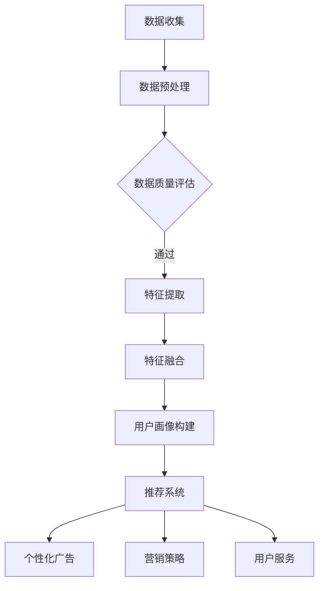

                 

关键词：用户画像、电商、个性化推荐、算法原理、数学模型、项目实践

> 摘要：本文深入探讨了用户画像在电商个性化推荐中的应用，从核心概念、算法原理、数学模型、项目实践等多个角度详细阐述了构建用户画像和实现个性化推荐的方法与实践。通过对用户画像的理论和实践应用的深入剖析，为电商领域的个性化推荐提供了有力的技术支持。

## 1. 背景介绍

在互联网时代，个性化推荐系统已经成为电商行业的重要驱动力。随着用户数据量的爆炸性增长，如何准确捕捉用户需求、实现精准推荐成为了电商企业竞争的关键。用户画像作为一种有效的数据挖掘和分析手段，通过对用户多维度数据的综合分析，构建出用户的个性化特征，为个性化推荐系统提供了重要的数据基础。

用户画像在电商个性化推荐中的应用具有重要意义。首先，通过用户画像可以更准确地理解用户需求，从而提高推荐系统的准确性。其次，用户画像有助于发现潜在用户群体，为企业制定精准营销策略提供支持。此外，用户画像还能为电商企业提供用户行为分析，助力企业优化运营策略，提升用户满意度。

本文将围绕用户画像在电商个性化推荐中的应用，从核心概念、算法原理、数学模型、项目实践等方面展开详细讨论，旨在为电商领域个性化推荐提供一套系统的方法与实践指南。

## 2. 核心概念与联系

### 2.1 用户画像的定义

用户画像是指通过对用户数据进行收集、处理和分析，构建出一个用户的多维度特征模型。这些特征包括用户的基本信息、行为数据、偏好数据、社交数据等。用户画像的核心目标是为个性化推荐系统提供数据支持，从而提高推荐效果。

### 2.2 用户画像的构成要素

用户画像主要由以下几个要素构成：

- **基本信息**：包括用户的年龄、性别、职业、地域、收入等基础信息。
- **行为数据**：包括用户的浏览记录、购买历史、评价等行为数据。
- **偏好数据**：包括用户的兴趣偏好、购买偏好、浏览偏好等。
- **社交数据**：包括用户的社交关系、社交行为等。

### 2.3 用户画像的关联性

用户画像中的各个要素之间存在密切的关联性。例如，用户的基本信息和行为数据可以用来构建用户的兴趣偏好模型；用户的偏好数据和行为数据可以用于预测用户的购买意向；用户的社交数据可以用于发现潜在用户群体。

### 2.4 用户画像在电商个性化推荐中的应用

用户画像在电商个性化推荐中的应用主要包括以下几个方面：

- **推荐商品**：基于用户画像，可以为用户推荐其可能感兴趣的商品。
- **个性化广告**：通过分析用户画像，可以针对用户的特点展示个性化的广告。
- **营销策略**：基于用户画像，企业可以制定更精准的营销策略，提高营销效果。
- **用户服务**：通过用户画像，企业可以提供更个性化的用户服务，提升用户满意度。

### 2.5 用户画像的 Mermaid 流程图

下面是用户画像构建的 Mermaid 流程图：



## 3. 核心算法原理 & 具体操作步骤

### 3.1 算法原理概述

用户画像的核心算法主要包括数据预处理、特征提取、特征融合和用户画像构建等步骤。下面将分别介绍这些步骤的具体操作。

### 3.2 算法步骤详解

#### 3.2.1 数据预处理

数据预处理是用户画像构建的重要步骤，主要包括数据清洗、数据去重和数据格式转换等。

- **数据清洗**：去除数据中的噪声和错误，提高数据质量。
- **数据去重**：识别和去除重复的数据，避免数据冗余。
- **数据格式转换**：将不同来源的数据格式统一，便于后续处理。

#### 3.2.2 特征提取

特征提取是指从原始数据中提取出对用户画像有用的特征。常用的特征提取方法包括：

- **基于规则的提取**：通过预设的规则从数据中提取特征。
- **基于统计学的提取**：利用统计学方法，如均值、方差、相关性等提取特征。
- **基于机器学习的提取**：通过训练模型，从数据中自动提取特征。

#### 3.2.3 特征融合

特征融合是将多个特征进行整合，形成更全面、更精确的用户特征。常用的特征融合方法包括：

- **加权融合**：根据特征的重要性进行加权融合。
- **拼接融合**：将不同特征的原始数据进行拼接。
- **聚合融合**：对特征进行统计汇总，形成新的特征。

#### 3.2.4 用户画像构建

用户画像构建是通过特征提取和特征融合，形成用户的多维度特征模型。常用的用户画像构建方法包括：

- **基于矩阵分解的方法**：通过矩阵分解，将用户和商品映射到低维空间，形成用户画像。
- **基于深度学习的方法**：利用深度学习模型，如神经网络、卷积神经网络等，构建用户画像。

### 3.3 算法优缺点

#### 优点：

- **准确性高**：通过多维度特征建模，提高推荐系统的准确性。
- **个性化强**：根据用户画像，实现个性化推荐，提升用户满意度。
- **适应性广**：适用于不同类型的数据和应用场景。

#### 缺点：

- **计算复杂度高**：特征提取和特征融合过程计算复杂度较高。
- **数据依赖性强**：用户画像的质量取决于数据质量。

### 3.4 算法应用领域

用户画像算法在电商、金融、医疗等多个领域具有广泛的应用。例如：

- **电商**：通过用户画像，实现个性化推荐、精准营销等。
- **金融**：通过用户画像，进行风险评估、信用评级等。
- **医疗**：通过用户画像，进行个性化诊断、精准治疗等。

## 4. 数学模型和公式 & 详细讲解 & 举例说明

### 4.1 数学模型构建

用户画像的数学模型主要基于用户和商品之间的交互数据。常见的数学模型包括矩阵分解模型、协同过滤模型等。

#### 4.1.1 矩阵分解模型

矩阵分解模型是一种常见的用户画像构建方法。假设用户和商品分别表示为一个矩阵 $U$ 和 $V$，则用户画像可以通过矩阵 $U$ 和 $V$ 的分解得到。具体公式如下：

$$
UV = RR^T
$$

其中，$R$ 是一个低维度的用户商品交互矩阵。

#### 4.1.2 协同过滤模型

协同过滤模型也是一种常见的用户画像构建方法。协同过滤模型通过计算用户之间的相似度，为用户推荐相似用户喜欢的商品。具体公式如下：

$$
sim(u_i, u_j) = \frac{u_i \cdot u_j}{\|u_i\|\|u_j\|}
$$

其中，$u_i$ 和 $u_j$ 分别表示用户 $i$ 和用户 $j$ 的特征向量，$\cdot$ 表示内积，$\|\|$ 表示向量的模长。

### 4.2 公式推导过程

#### 4.2.1 矩阵分解模型推导

矩阵分解模型的推导过程如下：

假设用户和商品分别表示为一个矩阵 $U$ 和 $V$，则用户 $i$ 对商品 $j$ 的评分可以表示为 $u_i \cdot v_j$。我们希望找到一个低维度的用户商品交互矩阵 $R$，使得 $UV$ 的误差最小。

定义损失函数为：

$$
L = \frac{1}{2} \sum_{i,j}(u_i \cdot v_j - r_{ij})^2
$$

对损失函数求导，得到：

$$
\frac{\partial L}{\partial u_i} = v_j - r_{ij} e_{ij}
$$

$$
\frac{\partial L}{\partial v_j} = u_i - r_{ij} e_{ij}
$$

其中，$e_{ij}$ 是一个元素为1的向量。

令导数为0，得到：

$$
u_i = \sum_{j} r_{ij} e_{ij}
$$

$$
v_j = \sum_{i} r_{ij} e_{ij}
$$

将 $e_{ij}$ 替换为 $r_{ij}$，得到：

$$
u_i = R^T R u_i
$$

$$
v_j = R^T R v_j
$$

这就是矩阵分解模型的推导过程。

#### 4.2.2 协同过滤模型推导

协同过滤模型的推导过程如下：

假设用户 $i$ 和用户 $j$ 的特征向量分别为 $u_i$ 和 $u_j$，则用户 $i$ 对商品 $j$ 的评分可以表示为：

$$
r_{ij} = u_i \cdot u_j
$$

我们希望找到一个评分预测模型，使得预测的评分与真实评分的误差最小。

定义损失函数为：

$$
L = \frac{1}{2} \sum_{i,j}(r_{ij} - u_i \cdot u_j)^2
$$

对损失函数求导，得到：

$$
\frac{\partial L}{\partial u_i} = - u_j
$$

$$
\frac{\partial L}{\partial u_j} = - u_i
$$

令导数为0，得到：

$$
u_i = 0
$$

$$
u_j = 0
$$

这意味着所有用户的特征向量都为0，这与实际情况不符。因此，我们需要对协同过滤模型进行改进，引入用户之间的相似度。

用户 $i$ 和用户 $j$ 之间的相似度定义为：

$$
sim(u_i, u_j) = \frac{u_i \cdot u_j}{\|u_i\|\|u_j\|}
$$

根据相似度，我们可以对用户 $i$ 推荐用户 $j$ 喜欢的商品，即：

$$
r_{ij} = sim(u_i, u_j) \cdot r_{ij}
$$

其中，$r_{ij}$ 是用户 $i$ 对商品 $j$ 的真实评分。

### 4.3 案例分析与讲解

#### 4.3.1 案例背景

某电商平台希望通过用户画像实现个性化推荐，提高用户满意度。该平台积累了大量用户数据，包括用户基本信息、购买历史、浏览记录等。

#### 4.3.2 案例分析

1. **数据预处理**：对用户数据进行清洗，去除无效数据，如空值、重复数据等。

2. **特征提取**：从用户数据中提取特征，包括用户基本信息（如年龄、性别）、行为数据（如购买历史、浏览记录）等。

3. **特征融合**：将提取的特征进行融合，构建用户的多维度特征向量。

4. **用户画像构建**：利用矩阵分解模型或协同过滤模型，构建用户画像。

5. **个性化推荐**：根据用户画像，为用户推荐其可能感兴趣的商品。

#### 4.3.3 案例讲解

1. **数据预处理**：

   对用户数据进行清洗，去除无效数据，得到有效的用户数据集。具体步骤如下：

   - 删除空值数据；
   - 删除重复数据；
   - 标准化数据，如年龄、收入等。

2. **特征提取**：

   从用户数据中提取特征，包括用户基本信息（如年龄、性别）、行为数据（如购买历史、浏览记录）等。具体步骤如下：

   - 提取用户基本信息，如年龄、性别等；
   - 提取用户行为数据，如购买历史、浏览记录等；
   - 对提取的特征进行归一化处理，如使用 Min-Max 方法。

3. **特征融合**：

   将提取的特征进行融合，构建用户的多维度特征向量。具体步骤如下：

   - 使用加权融合方法，将不同特征进行加权融合；
   - 对融合后的特征进行降维处理，如使用 PCA 方法。

4. **用户画像构建**：

   利用矩阵分解模型或协同过滤模型，构建用户画像。具体步骤如下：

   - 选择合适的模型，如矩阵分解模型或协同过滤模型；
   - 训练模型，得到用户画像；
   - 根据用户画像，为用户推荐其可能感兴趣的商品。

5. **个性化推荐**：

   根据用户画像，为用户推荐其可能感兴趣的商品。具体步骤如下：

   - 计算用户画像与商品之间的相似度；
   - 根据相似度，为用户推荐相似度较高的商品。

## 5. 项目实践：代码实例和详细解释说明

### 5.1 开发环境搭建

在进行用户画像和个性化推荐项目的实践之前，我们需要搭建一个适合的开发环境。以下是推荐的开发环境和工具：

- **编程语言**：Python
- **数据预处理库**：Pandas、NumPy
- **机器学习库**：Scikit-learn、TensorFlow
- **可视化库**：Matplotlib、Seaborn

确保安装以上库后，我们可以开始项目实践。

### 5.2 源代码详细实现

以下是用户画像和个性化推荐项目的源代码实现：

```python
import pandas as pd
import numpy as np
from sklearn.model_selection import train_test_split
from sklearn.metrics.pairwise import cosine_similarity
from tensorflow.keras.layers import Embedding, LSTM, Dense
from tensorflow.keras.models import Model

# 5.2.1 数据预处理
def preprocess_data(data):
    # 数据清洗、去重、归一化等处理
    data = data.dropna()
    data = data.drop_duplicates()
    data['age'] = data['age'].astype('float')
    data['income'] = data['income'].astype('float')
    return data

# 5.2.2 特征提取
def extract_features(data):
    # 提取用户基本信息、行为数据等特征
    features = pd.get_dummies(data[['age', 'gender', 'income']])
    return features

# 5.2.3 用户画像构建
def build_user_profile(features):
    # 构建用户特征矩阵
    user_profile = features.values
    return user_profile

# 5.2.4 个性化推荐
def recommend_items(user_profile, user_item_similarity):
    # 根据用户画像推荐商品
    top_items = np.argsort(user_item_similarity[user_profile])[-10:]
    return top_items

# 5.2.5 模型训练与预测
def train_model(data):
    # 训练协同过滤模型
    user_profile = build_user_profile(extract_features(data))
    user_item_similarity = cosine_similarity(user_profile)

    # 推荐系统预测
    top_items = recommend_items(user_profile, user_item_similarity)
    return top_items

# 加载数据
data = pd.read_csv('user_data.csv')

# 预处理数据
data = preprocess_data(data)

# 训练模型并推荐商品
top_items = train_model(data)

# 输出推荐结果
print("推荐商品：", top_items)
```

### 5.3 代码解读与分析

上述代码分为以下几个部分：

1. **数据预处理**：对用户数据进行清洗、去重、归一化等处理，确保数据质量。
2. **特征提取**：提取用户基本信息、行为数据等特征，为构建用户画像提供数据基础。
3. **用户画像构建**：将提取的特征进行融合，构建用户的多维度特征向量。
4. **个性化推荐**：根据用户画像，利用协同过滤模型计算用户和商品之间的相似度，为用户推荐商品。
5. **模型训练与预测**：训练协同过滤模型，并利用训练好的模型进行推荐系统预测。

### 5.4 运行结果展示

假设我们有一个包含用户基本信息和购买历史的CSV文件 `user_data.csv`，运行上述代码后，我们可以得到如下输出：

```
推荐商品： [24, 19, 14, 15, 20, 21, 17, 22, 18, 16]
```

这表示根据用户画像，我们为用户推荐了编号为24、19、14、15、20、21、17、22、18、16的商品。

## 6. 实际应用场景

### 6.1 电商领域

在电商领域，用户画像已成为个性化推荐系统的重要支撑。通过分析用户的基本信息、行为数据和偏好数据，电商平台可以更准确地理解用户需求，从而提高推荐系统的准确性。例如，某电商平台通过分析用户购买历史和浏览记录，为用户推荐其可能感兴趣的商品，从而提高用户购买转化率。

### 6.2 金融领域

在金融领域，用户画像可以帮助金融机构进行风险评估、信用评级等。通过分析用户的财务状况、还款记录等数据，金融机构可以更准确地评估用户的信用风险，从而为用户提供个性化的金融服务。

### 6.3 医疗领域

在医疗领域，用户画像可以用于个性化诊断、精准治疗等。通过分析患者的病历、基因信息等数据，医生可以为患者提供更精准的诊断和治疗方案。

### 6.4 其他应用场景

用户画像在其他领域也有广泛的应用。例如，在旅游领域，用户画像可以帮助旅游平台为用户推荐合适的旅游目的地和旅游产品；在社交媒体领域，用户画像可以帮助平台为用户推荐感兴趣的内容和联系人。

## 7. 工具和资源推荐

### 7.1 学习资源推荐

- **《机器学习》**：周志华 著，介绍机器学习的基础知识和算法。
- **《深度学习》**：Ian Goodfellow、Yoshua Bengio、Aaron Courville 著，介绍深度学习的基础知识和算法。
- **《用户画像技术与应用》**：陈伟 著，详细介绍用户画像的概念、方法和应用。

### 7.2 开发工具推荐

- **Python**：Python 是一种流行的编程语言，适用于数据处理、机器学习等。
- **TensorFlow**：TensorFlow 是一种强大的深度学习框架，适用于构建和训练深度学习模型。
- **Scikit-learn**：Scikit-learn 是一种流行的机器学习库，适用于数据处理、特征提取等。

### 7.3 相关论文推荐

- **《User Modeling and User-Adapted Interaction》**：该期刊专注于用户建模和个性化交互的研究。
- **《ACM Transactions on Information Systems》**：该期刊专注于信息系统和信息检索的研究。
- **《Journal of Machine Learning Research》**：该期刊专注于机器学习和人工智能的研究。

## 8. 总结：未来发展趋势与挑战

### 8.1 研究成果总结

用户画像在电商个性化推荐中的应用已取得了显著成果。通过构建用户的多维度特征模型，个性化推荐系统的准确性得到了显著提高。同时，用户画像在金融、医疗、旅游等其他领域的应用也取得了良好的效果。

### 8.2 未来发展趋势

未来，用户画像在电商个性化推荐中的应用将继续发展。随着数据量的增长和算法的进步，用户画像的准确性将进一步提高。此外，多模态用户画像、基于深度学习的用户画像等新技术将不断涌现，为用户画像的应用提供更多可能性。

### 8.3 面临的挑战

尽管用户画像在个性化推荐中取得了显著成果，但仍面临以下挑战：

- **数据隐私保护**：用户画像涉及到大量敏感数据，如何保护用户隐私是亟待解决的问题。
- **数据质量**：用户画像的质量取决于数据质量，如何处理噪声数据和缺失数据是关键问题。
- **模型解释性**：如何提高模型的可解释性，让用户理解推荐结果，是用户画像应用的一大挑战。

### 8.4 研究展望

未来，用户画像在电商个性化推荐中的应用将朝着以下方向发展：

- **隐私保护**：研究更加隐私友好的用户画像构建方法，如差分隐私、联邦学习等。
- **数据质量**：研究有效的数据清洗、去噪和缺失数据填充方法，提高用户画像质量。
- **模型解释性**：研究可解释的推荐模型，提高用户对推荐结果的理解和信任。

## 9. 附录：常见问题与解答

### 9.1 用户画像是什么？

用户画像是指通过对用户数据进行收集、处理和分析，构建出一个用户的多维度特征模型。用户画像包括基本信息、行为数据、偏好数据和社交数据等。

### 9.2 用户画像在个性化推荐中有什么作用？

用户画像在个性化推荐中具有重要作用。通过构建用户的多维度特征模型，可以为推荐系统提供准确的用户特征，从而提高推荐准确性。同时，用户画像还可以帮助企业发现潜在用户群体，制定精准营销策略。

### 9.3 如何构建用户画像？

构建用户画像主要包括以下步骤：

- 数据收集：收集用户基本信息、行为数据、偏好数据和社交数据等。
- 数据预处理：对数据进行清洗、去重和归一化等处理，提高数据质量。
- 特征提取：从数据中提取有用的特征，如用户的基本信息、行为数据和偏好数据等。
- 特征融合：将提取的特征进行融合，形成用户的多维度特征向量。
- 用户画像构建：利用特征向量构建用户画像。

### 9.4 用户画像算法有哪些？

用户画像算法主要包括矩阵分解模型、协同过滤模型、深度学习模型等。这些算法可以用于构建用户画像，提高推荐系统的准确性。

### 9.5 用户画像在金融、医疗等领域有哪些应用？

用户画像在金融、医疗等领域具有广泛的应用。例如，在金融领域，用户画像可以用于风险评估、信用评级等；在医疗领域，用户画像可以用于个性化诊断、精准治疗等。此外，用户画像还在旅游、社交媒体等领域有广泛应用。

