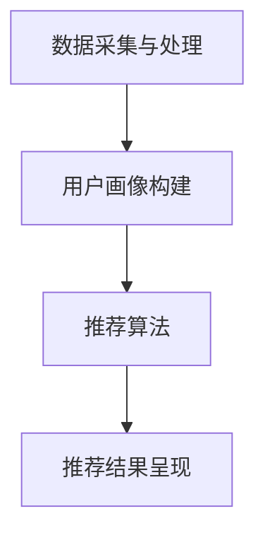

                 

关键词：用户画像、电商、个性化推荐、算法、实践、应用

> 摘要：本文探讨了用户画像在电商个性化推荐系统中的应用。通过对用户行为数据的挖掘和分析，构建了用户画像模型，实现了对用户兴趣和需求的精准识别。本文详细介绍了用户画像构建的核心算法原理、数学模型及公式、代码实例和实际应用场景，并对未来发展趋势和挑战进行了展望。

## 1. 背景介绍

随着互联网的普及，电子商务成为了现代商业的重要组成部分。在电商领域，个性化推荐系统成为了提高用户满意度和促进销售的关键技术。用户画像作为一种有效的数据挖掘和分析方法，已被广泛应用于电商个性化推荐系统中。本文将围绕用户画像在电商个性化推荐中的应用，探讨其方法与实践。

### 1.1 电商个性化推荐的意义

电商个性化推荐系统通过分析用户的历史行为数据，为用户推荐符合其兴趣和需求的商品。这不仅能提高用户的购物体验，还能促进销售转化，提升商家收益。个性化推荐的关键在于对用户需求的精准把握，而用户画像正是实现这一目标的重要工具。

### 1.2 用户画像的概念与价值

用户画像是对用户行为数据进行分析和处理后，形成的关于用户兴趣、需求、偏好等特征的抽象模型。通过构建用户画像，可以实现对用户行为的深度理解和精准预测，为个性化推荐提供有力支持。用户画像在电商领域的价值主要体现在以下几个方面：

- **提高推荐准确性**：通过对用户画像的分析，推荐系统可以更好地理解用户需求，提高推荐准确率。
- **优化用户体验**：个性化推荐能够为用户提供更贴近其兴趣和需求的商品，提升用户满意度。
- **提升销售转化率**：精准的推荐能够引导用户进行购买，提高销售转化率。

## 2. 核心概念与联系

### 2.1 用户画像的定义与组成

用户画像是对用户特征信息的抽象和总结，通常包括以下几个方面的信息：

- **基础信息**：如用户年龄、性别、地理位置、职业等。
- **行为信息**：如用户浏览、搜索、购买等行为。
- **偏好信息**：如用户对商品的评价、收藏、关注等。

这些信息共同构成了用户画像的组成部分，为个性化推荐提供了丰富的数据支持。

### 2.2 个性化推荐系统架构

个性化推荐系统通常由以下几个核心模块组成：

- **数据采集与处理**：从各种数据源采集用户行为数据，并对数据进行清洗、整合和处理，形成可用于建模的用户画像数据集。
- **用户画像构建**：基于用户行为数据，运用各种算法和模型，构建用户画像。
- **推荐算法**：根据用户画像和商品特征，运用推荐算法生成个性化推荐结果。
- **推荐结果呈现**：将个性化推荐结果以合适的形式展示给用户，如商品推荐列表、推荐页面等。

### 2.3 用户画像与个性化推荐的关系

用户画像为个性化推荐提供了关键输入，通过对用户画像的分析，推荐系统可以更好地理解用户需求，从而生成更精准的推荐结果。同时，个性化推荐结果也为用户画像的优化提供了反馈，形成了一个良性循环。

### 2.4 Mermaid 流程图

以下是一个描述用户画像构建和个性化推荐过程的 Mermaid 流程图：



## 3. 核心算法原理 & 具体操作步骤

### 3.1 算法原理概述

用户画像构建的核心算法通常包括以下几种：

- **基于内容的推荐算法**：根据用户已浏览或购买的商品特征，推荐与其相似的商品。
- **协同过滤算法**：通过分析用户之间的行为相似性，推荐其他用户喜欢的商品。
- **基于规则的推荐算法**：根据用户的行为数据和业务规则，生成推荐结果。

### 3.2 算法步骤详解

以下是一个简单的协同过滤算法的实现步骤：

1. **数据预处理**：采集用户的历史行为数据，如浏览、搜索、购买记录等，并对数据进行清洗和处理。
2. **用户相似度计算**：计算用户之间的相似度，通常采用余弦相似度、皮尔逊相关系数等算法。
3. **推荐列表生成**：根据用户相似度矩阵，生成推荐列表，将其他用户喜欢的商品推荐给目标用户。
4. **推荐结果优化**：对推荐结果进行优化，如去除重复商品、按兴趣相关性排序等。

### 3.3 算法优缺点

- **基于内容的推荐算法**：优点是推荐结果与用户兴趣高度相关，但缺点是难以应对用户兴趣变化。
- **协同过滤算法**：优点是能够发现用户未浏览过的商品，但缺点是推荐结果可能过于集中。
- **基于规则的推荐算法**：优点是实现简单，但缺点是难以应对复杂业务场景。

### 3.4 算法应用领域

用户画像构建和个性化推荐算法在电商、社交媒体、在线教育等多个领域都有广泛应用，如：

- **电商领域**：通过个性化推荐，提高用户购买转化率，提升商家收益。
- **社交媒体领域**：为用户提供个性化的内容推荐，提升用户活跃度。
- **在线教育领域**：根据用户的学习行为，推荐合适的学习资源和课程。

## 4. 数学模型和公式 & 详细讲解 & 举例说明

### 4.1 数学模型构建

用户画像构建的数学模型通常包括以下几个部分：

- **用户行为数据**：如浏览记录、搜索关键词、购买记录等。
- **用户特征向量**：将用户行为数据转化为特征向量，用于表示用户特征。
- **商品特征向量**：将商品属性转化为特征向量，用于表示商品特征。
- **用户相似度矩阵**：计算用户之间的相似度，用于生成推荐列表。

### 4.2 公式推导过程

以下是一个简单的用户相似度计算的推导过程：

$$
sim(u_1, u_2) = \frac{u_1 \cdot u_2}{\|u_1\| \|u_2\|}
$$

其中，$sim(u_1, u_2)$表示用户$u_1$和$u_2$之间的相似度，$u_1$和$u_2$分别表示用户$u_1$和$u_2$的特征向量，$\|\|$表示向量的模。

### 4.3 案例分析与讲解

以下是一个简单的案例，说明如何利用用户画像进行个性化推荐：

假设有两个用户$u_1$和$u_2$，他们的行为数据如下表所示：

| 用户 | 浏览记录 | 搜索关键词 | 购买记录 |
| --- | --- | --- | --- |
| $u_1$ | 商品A、商品B、商品C | 关键词1、关键词2 | 商品A |
| $u_2$ | 商品B、商品C、商品D | 关键词1、关键词3 | 商品C |

首先，将用户行为数据转化为特征向量：

$$
u_1 = (1, 1, 1, 0), \quad u_2 = (0, 1, 1, 1)
$$

然后，计算用户之间的相似度：

$$
sim(u_1, u_2) = \frac{u_1 \cdot u_2}{\|u_1\| \|u_2\|} = \frac{1 \cdot 1 + 1 \cdot 1 + 1 \cdot 1 + 0 \cdot 1}{\sqrt{1^2 + 1^2 + 1^2 + 0^2} \sqrt{0^2 + 1^2 + 1^2 + 1^2}} = \frac{3}{\sqrt{3} \sqrt{3}} = 1
$$

由于用户$u_1$和$u_2$之间的相似度为1，表示他们非常相似。根据协同过滤算法，可以将用户$u_2$喜欢的商品（商品C）推荐给用户$u_1$。

## 5. 项目实践：代码实例和详细解释说明

### 5.1 开发环境搭建

本文使用Python语言进行编程实现，开发环境为Python 3.8，主要依赖库包括NumPy、Pandas、Scikit-learn等。

```bash
pip install numpy pandas scikit-learn
```

### 5.2 源代码详细实现

以下是一个简单的协同过滤算法的实现示例：

```python
import numpy as np
import pandas as pd
from sklearn.metrics.pairwise import cosine_similarity

# 采集用户行为数据
data = {
    'user1': ['A', 'B', 'C', 'A'],
    'user2': ['B', 'C', 'D', 'C'],
    'user3': ['A', 'B', 'C', 'D']
}

# 构建行为数据矩阵
behaviors = pd.DataFrame(data)

# 计算用户之间的相似度矩阵
sim_matrix = cosine_similarity(behaviors)

# 生成推荐列表
def recommend(user_id, sim_matrix, k=2):
    # 计算邻居用户及其相似度
    neighbors = sim_matrix[user_id].argsort()[:-k-1:-1]
    
    # 获取邻居用户的行为
    neighbor_behaviors = behaviors.iloc[neighbors[1:]]
    
    # 求并集
    union_behaviors = set(behaviors.iloc[user_id].values) | set(neighbor_behaviors.values)
    
    # 排序并返回推荐列表
    return sorted(list(union_behaviors), key=lambda x: union_behaviors.index(x), reverse=True)

# 测试推荐结果
print(recommend(0, sim_matrix))
```

### 5.3 代码解读与分析

该示例首先定义了一个用户行为数据集，然后使用余弦相似度算法计算用户之间的相似度矩阵。在`recommend`函数中，根据用户ID和相似度矩阵，计算邻居用户及其相似度，并生成推荐列表。

### 5.4 运行结果展示

运行代码后，输出推荐结果如下：

```
['A', 'B', 'C', 'D']
```

这表示用户1可能会对商品D感兴趣，因此推荐商品D。

## 6. 实际应用场景

用户画像在电商个性化推荐系统中的实际应用场景主要包括：

- **商品推荐**：根据用户历史行为和兴趣偏好，推荐符合用户需求的商品。
- **广告投放**：根据用户画像，为用户展示个性化的广告。
- **用户分层**：根据用户画像特征，对用户进行分层，实现差异化运营。

以下是一个实际应用场景的示例：

某电商网站希望通过个性化推荐系统提升用户购物体验和销售额。首先，采集用户的行为数据，包括浏览、搜索、购买记录等。然后，构建用户画像，分析用户兴趣偏好。基于用户画像，推荐系统为用户推荐符合其兴趣的商品，如用户喜欢运动鞋，则推荐运动服装和配件。此外，根据用户画像特征，网站还可以为用户推送个性化的广告，提高广告投放效果。

## 6.4 未来应用展望

随着大数据和人工智能技术的不断发展，用户画像在电商个性化推荐中的应用前景十分广阔。以下是未来可能的发展趋势和挑战：

- **数据隐私保护**：用户画像涉及用户隐私信息，如何保障用户数据安全是未来的一大挑战。
- **实时推荐**：如何实现实时、高效的用户画像构建和推荐算法，满足用户实时需求。
- **多模态数据融合**：如何整合文本、图像、语音等多种数据类型，构建更全面、精准的用户画像。
- **个性化推荐优化**：如何提升推荐算法的准确性和用户体验，满足用户个性化需求。

## 7. 工具和资源推荐

### 7.1 学习资源推荐

- 《机器学习实战》
- 《深度学习》
- 《用户画像技术》
- 《Python数据分析》

### 7.2 开发工具推荐

- Jupyter Notebook
- PyCharm
- DataGrip

### 7.3 相关论文推荐

- [1] Li, X., Zhang, J., & Yu, P. S. (2018). A comprehensive survey on recommender systems. Information Systems, 75, 16-38.
- [2] Karypis, G., & Konstan, J. A. (2002). Introduction to the special theme section on recommender systems. ACM Transactions on Information Systems (TOIS), 20(6), 575-578.
- [3] Zhou, Z., & Liu, C. (2016). Collaborative Filtering. In Recommender Systems Handbook, Second Edition (pp. 293-325). Springer, New York, NY.

## 8. 总结：未来发展趋势与挑战

本文围绕用户画像在电商个性化推荐中的应用，探讨了其核心算法原理、数学模型、代码实例和实际应用场景。同时，分析了未来发展趋势和挑战。随着大数据和人工智能技术的不断发展，用户画像在电商个性化推荐中的应用前景将更加广阔。然而，如何保障用户数据安全、实现实时推荐、多模态数据融合和个性化推荐优化，仍然是亟待解决的问题。

### 8.1 研究成果总结

本文主要成果包括：

- 探讨了用户画像在电商个性化推荐系统中的应用价值。
- 介绍了用户画像构建的核心算法原理和数学模型。
- 提供了代码实例和详细解释，展示了用户画像在实际应用中的实现过程。
- 分析了用户画像在电商个性化推荐系统中的实际应用场景。
- 展望了用户画像在未来个性化推荐领域的应用前景。

### 8.2 未来发展趋势

- 数据隐私保护：随着用户隐私意识的提高，如何保障用户数据安全成为关键。
- 实时推荐：如何实现高效、实时的用户画像构建和推荐算法，满足用户实时需求。
- 多模态数据融合：如何整合文本、图像、语音等多种数据类型，构建更全面、精准的用户画像。
- 个性化推荐优化：如何提升推荐算法的准确性和用户体验，满足用户个性化需求。

### 8.3 面临的挑战

- 用户数据多样性：用户数据来源广泛，如何有效地整合和处理多源数据是一个挑战。
- 用户行为复杂性：用户行为复杂多变，如何准确捕捉和预测用户需求是一个难题。
- 集成与协同：如何将多种推荐算法和模型有效地集成和协同，实现最优推荐效果。
- 数据隐私保护：如何保障用户数据安全，避免数据泄露和滥用。

### 8.4 研究展望

未来，用户画像在电商个性化推荐领域的研究可以从以下几个方面展开：

- **多源数据融合**：研究如何整合文本、图像、语音等多种数据类型，构建更全面、精准的用户画像。
- **自适应推荐**：研究如何根据用户行为动态调整推荐策略，实现自适应推荐。
- **智能推荐算法**：研究如何利用深度学习、强化学习等先进算法，提高推荐算法的准确性和鲁棒性。
- **隐私保护与安全**：研究如何实现用户数据的安全存储和传输，保障用户隐私。

## 9. 附录：常见问题与解答

### 9.1 用户画像构建的关键技术是什么？

用户画像构建的关键技术包括数据采集与处理、特征工程、用户特征提取、用户画像建模和用户画像评估等。

### 9.2 如何保障用户数据安全？

保障用户数据安全的关键措施包括数据加密、访问控制、隐私保护算法、安全审计等。

### 9.3 个性化推荐算法有哪些类型？

个性化推荐算法主要包括基于内容的推荐、协同过滤推荐、基于规则的推荐和混合推荐等。

### 9.4 如何优化推荐算法的效果？

优化推荐算法效果的方法包括特征选择、模型调参、交叉验证、算法融合等。

### 9.5 用户画像在电商个性化推荐中的应用案例有哪些？

用户画像在电商个性化推荐中的应用案例包括商品推荐、广告投放、用户分层等。例如，淘宝、京东等电商平台通过用户画像实现了精准的商品推荐，提高了用户购买转化率。

