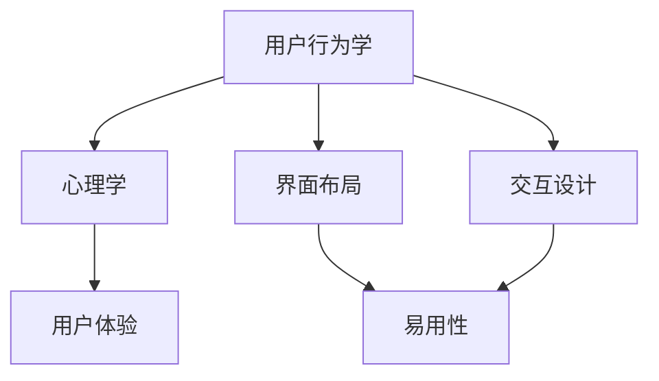

                 

关键词：用户界面设计，人机交互，易用性，用户体验，界面布局，交互设计

<|assistant|>摘要：本文将深入探讨用户界面设计的关键要素，包括界面布局、交互设计、易用性和用户体验等方面。我们将分析现有设计原则和最佳实践，并提供实用的方法和技巧，以帮助开发者创建友好、易用且具有吸引力的用户界面。

## 1. 背景介绍

随着计算机技术的飞速发展，用户界面设计（User Interface Design，简称UI设计）已成为软件和应用程序开发过程中不可或缺的一环。一个优秀的用户界面不仅能够提升用户体验，还能增强用户对产品的满意度和忠诚度。因此，UI设计在当今数字化时代的重要性愈发凸显。

用户界面设计的目标是使应用程序易于使用、直观且具备吸引力。这不仅需要考虑美学和视觉元素，还涉及用户行为学、心理学和技术实现等多方面因素。一个成功的用户界面应具备以下特点：

1. 易用性（Usability）：用户能够轻松地完成任务，不需要过多的指导和说明。
2. 可访问性（Accessibility）：确保不同技能水平和能力的用户都能使用产品。
3. 可理解性（Understandability）：用户能够快速理解界面功能和操作。
4. 引人入胜（Engaging）：界面设计应能吸引用户的注意力，提高用户粘性。

## 2. 核心概念与联系

在深入了解用户界面设计之前，我们需要明确一些核心概念及其相互联系。以下是用户界面设计中的关键概念及其关系，使用Mermaid流程图表示：



### 2.1 用户行为学

用户行为学是研究用户如何与产品互动的学科。它关注用户如何完成特定任务、用户的行为模式、以及用户在使用产品时的情感反应。用户行为学为界面设计提供了重要的数据，有助于我们更好地理解用户需求和行为。

### 2.2 心理学

心理学是研究人类行为和心理过程的学科。在用户界面设计中，心理学帮助我们理解用户的感知、情感和认知过程。例如，通过了解用户的注意力范围、记忆容量和情绪反应，我们可以设计出更符合用户心理预期的界面。

### 2.3 界面布局

界面布局是指将界面元素（如文本、图片、按钮等）在屏幕上进行组织的方式。合理的界面布局可以提高界面的易用性和美观度。界面布局应考虑用户的视觉感知、阅读习惯和任务流程。

### 2.4 交互设计

交互设计关注用户与产品之间的交互方式。它涉及用户如何与界面元素互动，以及这些互动如何影响用户体验。交互设计应注重简洁、直观和高效。

### 2.5 用户体验

用户体验（User Experience，简称UX）是指用户在使用产品过程中所感受到的整体体验。用户体验包括用户对产品外观、功能、易用性、可访问性等方面的感受。一个优秀的用户体验可以增强用户满意度和忠诚度。

## 3. 核心算法原理 & 具体操作步骤

### 3.1 算法原理概述

用户界面设计中的核心算法主要涉及布局算法、交互算法和用户体验评估算法。以下是对这些算法的概述：

### 3.2 算法步骤详解

#### 3.2.1 布局算法

布局算法负责将界面元素在屏幕上合理排列。其步骤如下：

1. 确定界面元素的优先级。
2. 根据优先级对元素进行分组。
3. 对每组元素进行空间分配。
4. 调整元素位置，以优化界面布局。

#### 3.2.2 交互算法

交互算法定义了用户与界面元素之间的交互方式。其步骤如下：

1. 确定用户输入类型（如鼠标点击、触摸屏手势等）。
2. 根据输入类型触发相应的事件处理。
3. 更新界面以反映用户操作结果。
4. 提供即时反馈，以引导用户进行下一步操作。

#### 3.2.3 用户体验评估算法

用户体验评估算法用于评估用户对界面的满意度。其步骤如下：

1. 收集用户反馈数据（如问卷、访谈等）。
2. 对数据进行统计分析。
3. 根据分析结果调整界面设计。

### 3.3 算法优缺点

#### 3.3.1 布局算法

优点：

- 提高界面美观度。
- 增强用户对界面的易用性。

缺点：

- 需要大量时间和资源进行调试。
- 可能导致界面复杂度增加。

#### 3.3.2 交互算法

优点：

- 提高用户操作效率。
- 增强用户对界面的掌控感。

缺点：

- 可能导致界面反应速度变慢。
- 过于复杂的交互可能导致用户困惑。

#### 3.3.3 用户体验评估算法

优点：

- 帮助开发者了解用户需求。
- 优化界面设计。

缺点：

- 需要大量用户参与。
- 分析结果可能受到主观因素的影响。

### 3.4 算法应用领域

布局算法、交互算法和用户体验评估算法广泛应用于各种类型的用户界面设计，包括桌面应用、移动应用、网页应用等。以下是一些应用实例：

- 桌面应用：办公软件、设计软件等。
- 移动应用：社交媒体、电子商务等。
- 网页应用：在线教育、在线购物等。

## 4. 数学模型和公式 & 详细讲解 & 举例说明

### 4.1 数学模型构建

在用户界面设计中，我们常常需要使用数学模型来描述用户行为、界面布局和交互效果。以下是一个简单的数学模型示例：

$$
UX = f(UI, UE)
$$

其中，$UX$表示用户体验，$UI$表示用户界面，$UE$表示用户体验评估。

### 4.2 公式推导过程

为了推导上述公式，我们可以从以下两个方面进行分析：

1. 用户界面（$UI$）：界面设计决定了用户在产品中的互动方式，直接影响用户体验。
2. 用户体验评估（$UE$）：通过用户反馈和数据分析，评估用户体验的质量。

将这两个因素结合起来，我们可以得到用户体验的数学模型：

$$
UX = f(UI, UE)
$$

### 4.3 案例分析与讲解

假设我们设计一款社交媒体应用，目标用户群体是年轻人。根据我们的经验和数据，我们可以构建以下数学模型：

$$
UX = f(UI, UE) = f(\text{界面美观度}, \text{互动性}, \text{反馈速度})
$$

在这个模型中，界面美观度、互动性和反馈速度是影响用户体验的关键因素。

例如，如果我们通过用户调查发现，界面美观度和反馈速度对用户体验的影响较大，那么我们可以在界面设计上增加色彩搭配和动画效果，同时在服务器端优化响应速度。

## 5. 项目实践：代码实例和详细解释说明

### 5.1 开发环境搭建

在开始用户界面设计之前，我们需要搭建一个合适的开发环境。以下是一个基于HTML和CSS的简单示例：

```html
<!DOCTYPE html>
<html>
<head>
    <title>用户界面设计示例</title>
    <style>
        body {
            font-family: Arial, sans-serif;
        }
        h1 {
            color: #333;
        }
        button {
            background-color: #4CAF50;
            color: white;
            padding: 10px 20px;
            border: none;
            cursor: pointer;
        }
    </style>
</head>
<body>
    <h1>欢迎来到我们的应用</h1>
    <button>点击这里</button>
    <script>
        document.querySelector('button').addEventListener('click', function() {
            alert('您已点击按钮！');
        });
    </script>
</body>
</html>
```

### 5.2 源代码详细实现

在这个示例中，我们创建了一个简单的HTML页面，包含一个标题和一个按钮。通过CSS样式，我们设置了标题和按钮的样式。通过JavaScript，我们为按钮添加了一个点击事件，弹出一条消息。

### 5.3 代码解读与分析

这个示例展示了用户界面设计的基本要素：

1. **HTML**：定义了页面结构，包括标题和按钮。
2. **CSS**：定义了页面样式，提高了界面的美观度。
3. **JavaScript**：实现了用户与界面的交互，增强了用户体验。

通过这个简单的示例，我们可以看到如何使用HTML、CSS和JavaScript构建一个基本的用户界面。

### 5.4 运行结果展示

当用户访问这个HTML页面时，他们会看到一个带有标题和按钮的界面。点击按钮后，他们会看到一个弹出窗口，显示“您已点击按钮！”。这个简单的示例展示了用户界面设计的基本原理和实现方法。

## 6. 实际应用场景

用户界面设计在许多领域都有广泛应用，以下是一些实际应用场景：

- **桌面应用**：如Microsoft Office、Adobe Photoshop等。
- **移动应用**：如Facebook、Instagram、微信等。
- **网页应用**：如Airbnb、Amazon、知乎等。
- **物联网设备**：如智能电视、智能音箱、智能穿戴设备等。

在每种应用中，用户界面设计的目标都是提高用户体验，使产品更加友好、易用和吸引人。

### 6.1 社交媒体应用

在社交媒体应用中，用户界面设计关注的是如何让用户快速地浏览、发布和互动。例如，Facebook的界面设计注重内容的展示和互动，使用户能够轻松地浏览朋友动态、评论和点赞。

### 6.2 在线购物平台

在线购物平台的用户界面设计则侧重于产品展示、购物车管理和支付流程。例如，Amazon的界面设计简洁明了，用户可以轻松地浏览商品、添加到购物车并完成支付。

### 6.3 智能设备

智能设备的用户界面设计则需要考虑到设备的特性和用户习惯。例如，智能电视的界面设计注重内容的浏览和播放，而智能穿戴设备的界面设计则更注重简洁和易用性。

## 7. 工具和资源推荐

在进行用户界面设计时，我们通常需要使用各种工具和资源。以下是一些推荐：

### 7.1 学习资源推荐

- 《设计心理学》（Don Norman）
- 《用户体验要素》（Jesse James Garrett）
- 《响应式网页设计》（Eric Meyer）
- 《移动优先设计》（Luke Wroblewski）

### 7.2 开发工具推荐

- Sketch：一款流行的界面设计工具。
- Figma：一款基于云的界面设计工具。
- Adobe XD：一款功能强大的界面设计工具。

### 7.3 相关论文推荐

- “Aesthetic and Usability Evaluation of Web Pages” by Günter Sauro and Tom Tullis
- “Mobile User Experience: Design and Evaluation Approaches” by Paul M. Click and Mark A. Harland
- “The Impact of Color on User Experience” by Benjamin H. Mako Hill and Robert P.rone

## 8. 总结：未来发展趋势与挑战

用户界面设计是一个不断发展和演变的领域，随着技术的发展和用户需求的变化，未来用户界面设计将面临以下发展趋势和挑战：

### 8.1 趋势

1. **人工智能与机器学习**：人工智能和机器学习技术将被广泛应用于用户界面设计，以实现个性化推荐、智能交互等功能。
2. **增强现实（AR）和虚拟现实（VR）**：随着AR和VR技术的发展，用户界面设计将更加注重沉浸式体验和互动性。
3. **无界面交互**：随着语音识别、手势识别等技术的成熟，无界面交互将成为用户界面设计的重要方向。

### 8.2 挑战

1. **隐私保护**：用户界面设计需要平衡用户体验和隐私保护，确保用户数据的安全。
2. **可访问性**：随着用户需求的多样性，用户界面设计需要考虑到不同用户群体（如残障人士）的需求，提高产品的可访问性。
3. **跨平台兼容性**：用户界面设计需要适应不同设备和平台，实现跨平台兼容性。

### 8.3 研究展望

未来，用户界面设计的研究将更加关注人机交互的自然性和智能化，探索如何更好地满足用户需求和提高用户体验。同时，研究者将致力于解决隐私保护、可访问性和跨平台兼容性等挑战，推动用户界面设计的发展。

## 9. 附录：常见问题与解答

### 9.1 用户界面设计的重要性是什么？

用户界面设计对产品成功至关重要。它直接影响用户体验，决定了用户是否愿意使用产品，以及产品在市场上的竞争力。一个优秀的用户界面能够提升用户满意度、忠诚度和品牌形象。

### 9.2 如何平衡用户体验和可访问性？

在用户界面设计中，平衡用户体验和可访问性是一个重要任务。建议采用以下方法：

1. **用户调研**：了解不同用户群体（如残障人士）的需求和习惯。
2. **设计标准**：遵循国际和国家的设计标准，如WCAG（Web内容可访问性指南）。
3. **测试与反馈**：通过用户测试和反馈，不断优化界面设计。

### 9.3 如何评估用户界面的质量？

评估用户界面的质量可以从以下几个方面入手：

1. **易用性测试**：观察用户完成特定任务的效率、准确性和满意度。
2. **可用性测试**：通过模拟用户行为，评估界面设计的可行性和有效性。
3. **用户反馈**：收集用户对界面的评价和建议，以指导后续优化。

---

作者：禅与计算机程序设计艺术 / Zen and the Art of Computer Programming
----------------------------------------------------------------

以上就是关于用户界面设计：打造友好易用的人机交互的完整文章。本文从用户界面设计的重要性、核心概念、算法原理、数学模型、项目实践、实际应用场景、工具和资源推荐以及未来发展趋势等方面进行了深入探讨。希望通过本文，读者能够对用户界面设计有更全面、深入的理解，并能够在实际项目中运用所学知识，打造出友好、易用且具有吸引力的用户界面。

