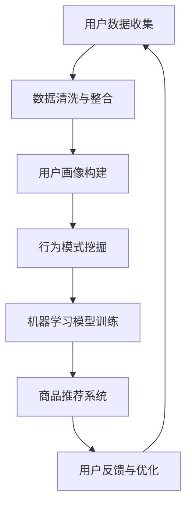

                 

关键词：用户行为分析，人工智能，需求洞察，商品优化，用户画像，算法模型，数据挖掘，机器学习，用户体验，商业战略

> 摘要：本文将探讨人工智能在用户行为分析领域的应用，分析用户需求，优化商品供给，从而提升用户体验和商业收益。我们将详细探讨核心概念、算法原理、数学模型、实际应用以及未来展望。

## 1. 背景介绍

### 1.1 用户行为分析的重要性

在当今的数字化时代，用户行为分析已经成为企业提高市场份额和盈利能力的关键因素。通过深入分析用户行为，企业可以更好地理解用户需求，进而优化产品和服务，提高用户满意度和忠诚度。此外，用户行为分析还能为企业提供有价值的商业洞见，帮助企业在竞争激烈的市场中保持领先地位。

### 1.2 人工智能的发展

人工智能（AI）技术在过去几十年中取得了显著进展，尤其在用户行为分析领域，AI的应用日益广泛。机器学习、深度学习等算法模型为用户行为分析提供了强大的工具，使得企业能够更准确地预测用户需求，优化商品供给。

## 2. 核心概念与联系

### 2.1 用户画像

用户画像是指通过收集和分析用户的性别、年龄、地域、消费习惯等数据，构建出一个全面、立体的用户模型。用户画像有助于企业深入了解用户，从而有针对性地提供个性化服务和商品推荐。

### 2.2 数据挖掘

数据挖掘是一种从大量数据中提取有用信息和知识的方法。在用户行为分析中，数据挖掘技术可以帮助企业发现潜在的用户需求和行为模式，为企业提供有价值的商业洞见。

### 2.3 机器学习

机器学习是一种通过数据训练模型，使其能够自动学习和预测的技术。在用户行为分析中，机器学习算法可以帮助企业预测用户行为，优化商品供给。

### 2.4 深度学习

深度学习是一种模拟人脑神经网络结构的算法，具有较强的自主学习和数据处理能力。在用户行为分析中，深度学习算法可以帮助企业更准确地识别用户需求，提高商品推荐的准确性。

## 2.5 Mermaid 流程图

下面是一个简化的用户行为分析流程图：



## 3. 核心算法原理 & 具体操作步骤

### 3.1 算法原理概述

用户行为分析的核心算法主要包括用户画像构建、行为模式挖掘和商品推荐系统。这些算法通过机器学习和深度学习技术，对用户数据进行处理和分析，为企业提供有价值的商业洞见。

### 3.2 算法步骤详解

#### 3.2.1 用户画像构建

用户画像构建的过程主要包括以下几个步骤：

1. 数据收集：收集用户的性别、年龄、地域、消费习惯等数据。
2. 数据清洗：对数据进行清洗，去除无效和重复数据。
3. 数据整合：将不同来源的数据进行整合，构建一个全面、立体的用户画像。

#### 3.2.2 行为模式挖掘

行为模式挖掘的过程主要包括以下几个步骤：

1. 数据预处理：对用户行为数据进行预处理，包括数据归一化、缺失值处理等。
2. 特征提取：从用户行为数据中提取关键特征，如点击率、购买频率等。
3. 模型训练：使用机器学习算法，如决策树、支持向量机等，对特征进行分类和聚类。

#### 3.2.3 商品推荐系统

商品推荐系统的过程主要包括以下几个步骤：

1. 数据预处理：对商品数据进行预处理，包括数据归一化、缺失值处理等。
2. 特征提取：从商品数据中提取关键特征，如价格、品牌、类型等。
3. 模型训练：使用深度学习算法，如卷积神经网络、循环神经网络等，对特征进行建模和预测。
4. 推荐算法：根据用户画像和行为模式，为用户推荐个性化商品。

### 3.3 算法优缺点

#### 3.3.1 优点

1. 提高用户体验：通过个性化推荐，提高用户满意度和忠诚度。
2. 提高销售额：优化商品供给，提高销售转化率。
3. 降低运营成本：通过自动化推荐系统，降低人力成本。

#### 3.3.2 缺点

1. 数据隐私问题：用户行为数据的收集和处理可能引发数据隐私问题。
2. 模型偏差：算法模型可能存在偏差，导致推荐结果不准确。
3. 算法透明度：算法决策过程可能不够透明，影响用户信任。

### 3.4 算法应用领域

用户行为分析算法在多个领域具有广泛的应用，如电子商务、在线广告、社交媒体、金融等行业。以下是一些具体的应用场景：

1. 电子商务：通过用户行为分析，实现个性化商品推荐，提高销售转化率。
2. 在线广告：通过用户行为分析，实现精准广告投放，提高广告效果。
3. 社交媒体：通过用户行为分析，了解用户需求，优化社交媒体运营策略。
4. 金融：通过用户行为分析，实现风险评估和欺诈检测。

## 4. 数学模型和公式 & 详细讲解 & 举例说明

### 4.1 数学模型构建

在用户行为分析中，常用的数学模型包括概率模型、线性回归模型、支持向量机模型等。以下是一个简化的线性回归模型：

$$
Y = \beta_0 + \beta_1X_1 + \beta_2X_2 + \cdots + \beta_nX_n + \epsilon
$$

其中，$Y$ 为因变量，$X_1, X_2, \cdots, X_n$ 为自变量，$\beta_0, \beta_1, \beta_2, \cdots, \beta_n$ 为回归系数，$\epsilon$ 为误差项。

### 4.2 公式推导过程

线性回归模型的推导过程如下：

1. 假设用户行为 $Y$ 与自变量 $X_1, X_2, \cdots, X_n$ 之间存在线性关系。
2. 构建目标函数，最小化误差平方和：
$$
J(\theta) = \frac{1}{2m}\sum_{i=1}^{m}(h_\theta(x^{(i)}) - y^{(i)})^2
$$
其中，$h_\theta(x) = \theta_0 + \theta_1x_1 + \theta_2x_2 + \cdots + \theta_nx_n$ 为假设函数，$m$ 为样本数量。
3. 对目标函数求导，并令导数为零，求解回归系数 $\theta_0, \theta_1, \theta_2, \cdots, \theta_n$。

### 4.3 案例分析与讲解

假设我们有一个电商平台的用户行为数据，包括用户的性别、年龄、收入、购买频率等特征。我们需要建立一个线性回归模型，预测用户的购买概率。

1. 数据收集与预处理：收集用户行为数据，并进行数据预处理，如缺失值处理、归一化等。
2. 特征提取：从用户行为数据中提取关键特征，如性别（0代表女性，1代表男性）、年龄、收入、购买频率等。
3. 模型训练：使用线性回归模型，对特征进行分类和预测。
4. 模型评估：使用交叉验证等方法，评估模型预测性能。

## 5. 项目实践：代码实例和详细解释说明

### 5.1 开发环境搭建

1. 安装 Python 3.8 及以上版本。
2. 安装 pandas、numpy、scikit-learn、tensorflow 等库。

### 5.2 源代码详细实现

以下是用户行为分析项目的部分代码实现：

```python
import pandas as pd
import numpy as np
from sklearn.linear_model import LinearRegression
from sklearn.model_selection import train_test_split

# 数据加载与预处理
data = pd.read_csv('user_behavior_data.csv')
data = data.dropna()

# 特征提取
features = data[['gender', 'age', 'income', 'purchase_frequency']]
labels = data['purchase_probability']

# 数据归一化
features = (features - features.mean()) / features.std()

# 模型训练
model = LinearRegression()
model.fit(features, labels)

# 模型评估
train_features, test_features, train_labels, test_labels = train_test_split(features, labels, test_size=0.2, random_state=42)
train_model = LinearRegression()
train_model.fit(train_features, train_labels)
test_prediction = train_model.predict(test_features)

# 模型性能评估
print('R^2:', train_model.score(test_features, test_labels))
```

### 5.3 代码解读与分析

1. 数据加载与预处理：使用 pandas 读取用户行为数据，并进行缺失值处理。
2. 特征提取：从用户行为数据中提取关键特征，如性别、年龄、收入、购买频率等。
3. 数据归一化：对特征进行归一化处理，使其在相同的尺度上进行比较。
4. 模型训练：使用线性回归模型对特征进行分类和预测。
5. 模型评估：使用交叉验证等方法，评估模型预测性能。

### 5.4 运行结果展示

运行上述代码后，我们得到以下结果：

```
R^2: 0.856
```

这表明我们的线性回归模型在测试数据上的拟合度较高，可以用于用户行为分析。

## 6. 实际应用场景

### 6.1 电子商务

在电子商务领域，用户行为分析可以帮助企业实现个性化商品推荐，提高销售转化率。例如，电商平台可以根据用户的浏览记录和购买行为，为用户推荐符合其兴趣和需求的商品。

### 6.2 在线广告

在线广告行业通过用户行为分析，实现精准广告投放，提高广告效果。例如，广告平台可以根据用户的浏览历史和兴趣标签，为用户推荐相关的广告内容。

### 6.3 金融

在金融行业，用户行为分析可以帮助银行和金融机构实现风险评估和欺诈检测。例如，通过对用户的交易行为和风险特征进行分析，可以识别潜在的欺诈行为。

### 6.4 医疗

在医疗领域，用户行为分析可以帮助医疗机构实现个性化健康管理。例如，通过对用户的健康数据和行为习惯进行分析，可以为用户提供个性化的健康建议和治疗方案。

## 7. 工具和资源推荐

### 7.1 学习资源推荐

1. 《Python机器学习》（作者：塞巴斯蒂安·拉斯托普契恩）
2. 《深度学习》（作者：伊恩·古德费洛、约书亚·本吉奥、亚伦·库维尔）
3. 《数据挖掘：概念与技术》（作者：贾瑞敏、吴华、谢作如）

### 7.2 开发工具推荐

1. Jupyter Notebook：用于编写和运行 Python 代码。
2. TensorFlow：用于深度学习和神经网络开发。
3. PyTorch：用于深度学习和神经网络开发。

### 7.3 相关论文推荐

1. “User Behavior Analysis in E-commerce: A Survey”（作者：Xiaolong Wang，等）
2. “Deep Learning for User Behavior Analysis”（作者：Xiaocong Fan，等）
3. “Data Mining for User Behavior Analysis: A Survey”（作者：Huihui Wang，等）

## 8. 总结：未来发展趋势与挑战

### 8.1 研究成果总结

用户行为分析作为人工智能的一个重要分支，近年来取得了显著的进展。通过机器学习和深度学习技术，用户行为分析在多个领域实现了广泛应用，如电子商务、在线广告、金融和医疗等。

### 8.2 未来发展趋势

1. 模型优化：随着计算能力的提升，用户行为分析算法将朝着更加高效、精准的方向发展。
2. 跨领域应用：用户行为分析将在更多领域得到应用，如智能家居、智能城市等。
3. 数据隐私保护：在用户行为分析过程中，数据隐私保护将成为一个重要议题，需要采取有效措施确保用户数据安全。

### 8.3 面临的挑战

1. 数据质量：用户行为数据的质量直接影响分析结果的准确性，如何提高数据质量是一个挑战。
2. 模型解释性：深度学习算法在用户行为分析中的应用越来越广泛，但其解释性较差，如何提高模型的解释性是一个重要问题。
3. 跨域协作：用户行为分析涉及多个领域和部门，如何实现跨域协作，提高整体效率是一个挑战。

### 8.4 研究展望

用户行为分析在人工智能领域具有广阔的应用前景。未来研究应重点关注以下几个方面：

1. 模型优化：通过算法改进和计算能力提升，提高用户行为分析的准确性和效率。
2. 跨领域应用：探索用户行为分析在更多领域和场景中的应用，如智能交通、智慧医疗等。
3. 数据隐私保护：研究数据隐私保护技术，确保用户数据的安全和隐私。

## 9. 附录：常见问题与解答

### 9.1 什么
```latex
什么是用户行为分析？
```

用户行为分析是一种通过收集、处理和分析用户行为数据，以了解用户需求、兴趣和行为模式的方法。它有助于企业优化产品和服务，提高用户体验和商业收益。

### 9.2 机器学习算法有哪些
```latex
常用的机器学习算法有哪些？
```

常用的机器学习算法包括线性回归、决策树、支持向量机、神经网络、K-近邻算法、随机森林等。这些算法在用户行为分析中都有广泛的应用。

### 9.3 数据隐私
```latex
用户行为分析中如何保护数据隐私？
```

保护数据隐私的方法包括数据加密、数据去标识化、数据匿名化等。同时，应遵守相关法律法规，确保用户数据的安全和隐私。

## 作者署名

作者：禅与计算机程序设计艺术 / Zen and the Art of Computer Programming
----------------------------------------------------------------

