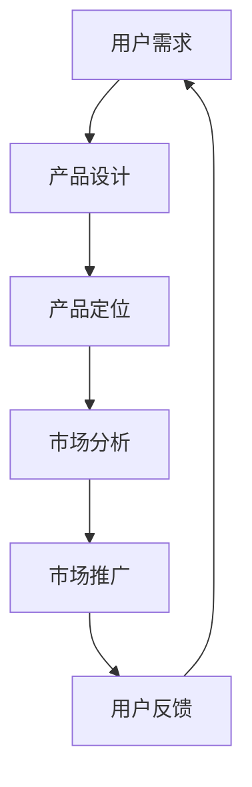

                 

关键词：用户需求、大模型、创业、AI、机器学习、技术落地

摘要：在人工智能与大数据技术迅猛发展的今天，大模型成为了许多初创企业的核心技术。然而，如何将用户需求与这一技术相结合，实现商业成功，是所有创业者面临的挑战。本文将从技术、市场和产品三个方面深入探讨用户需求在大模型创业中的作用，为创业者提供一盏指路明灯。

## 1. 背景介绍

大模型（Large-scale Model）是指具有巨大参数规模、能够处理海量数据的深度学习模型。随着计算能力的提升和数据的爆炸式增长，大模型在图像识别、自然语言处理、语音识别等领域取得了令人瞩目的成果。然而，大模型的发展并不仅限于技术的进步，它也意味着商业机会的涌现。许多初创企业开始将大模型作为核心竞争力，试图在竞争激烈的市场中脱颖而出。

然而，拥有先进的技术并不等同于成功。在现实中，许多初创企业因为忽视了用户需求，最终走向失败。因此，如何精准把握用户需求，将技术优势转化为商业价值，成为了大模型创业的关键。

### 1.1 大模型的现状

近年来，大模型在各个领域的应用日益广泛，从医疗诊断到金融风控，从智能助手到自动驾驶，大模型的身影无处不在。其中，最具代表性的成果包括：

- **GPT-3**：OpenAI 推出的具有 1750 亿参数的 Transformer 模型，在文本生成、问答系统等领域展现了强大的能力。
- **BERT**：Google 推出的双向 Transformer 模型，在自然语言处理任务中取得了显著的成果。
- **ImageNet**：由微软研究院开发的图像识别大模型，推动了计算机视觉领域的发展。

### 1.2 大模型创业的挑战

尽管大模型具有广阔的应用前景，但创业者在实际操作中仍面临着诸多挑战：

- **技术门槛**：大模型需要大规模的数据、强大的计算资源和专业的团队，这对初创企业来说是一个巨大的挑战。
- **用户需求**：如何准确把握用户需求，将技术优势转化为实际应用，是创业者必须解决的问题。
- **市场竞争**：随着大模型技术的普及，市场上的竞争愈发激烈，如何脱颖而出成为每个创业者都需要考虑的问题。

## 2. 核心概念与联系

为了更好地理解用户需求在大模型创业中的作用，我们需要先了解几个核心概念：

### 2.1 用户需求

用户需求是指用户在使用产品或服务时所期望获得的功能、性能、体验等方面的要求。在初创企业中，用户需求是产品设计的起点和终点，它决定了产品的方向和定位。

### 2.2 大模型

大模型是指具有巨大参数规模、能够处理海量数据的深度学习模型。大模型的核心在于其强大的数据处理能力和学习能力，这使得它们在许多领域具有广泛的应用前景。

### 2.3 产品与市场

产品是创业企业的核心，它需要满足用户需求，同时具备市场竞争力。市场是产品的归宿，它决定了产品的销售和利润。

在理解了这些核心概念后，我们可以使用 Mermaid 流程图来展示它们之间的联系：



## 3. 核心算法原理 & 具体操作步骤

### 3.1 算法原理概述

大模型的核心在于其深度学习算法。深度学习是一种基于人工神经网络的机器学习技术，它通过多层神经网络对数据进行特征提取和分类。大模型则进一步扩大了神经网络的规模，使其能够处理更加复杂和大规模的数据。

### 3.2 算法步骤详解

大模型的训练过程通常包括以下几个步骤：

1. **数据预处理**：对原始数据进行清洗、归一化和特征提取，以准备好输入到模型中的数据。
2. **模型构建**：选择合适的神经网络架构，并初始化模型的参数。
3. **训练过程**：通过前向传播和反向传播，不断调整模型的参数，使其在训练数据上达到良好的性能。
4. **模型评估**：在验证集上评估模型的性能，以确定是否需要进一步调整。
5. **模型部署**：将训练好的模型部署到生产环境中，供用户使用。

### 3.3 算法优缺点

大模型具有以下优点：

- **强大的数据处理能力**：大模型能够处理海量的数据，从而实现更高的准确率和泛化能力。
- **出色的学习能力**：大模型通过多层神经网络，能够从数据中提取更深层次的特征，从而实现更复杂的功能。

然而，大模型也存在一些缺点：

- **计算资源消耗大**：大模型的训练和推理过程需要大量的计算资源，这对初创企业来说是一个巨大的挑战。
- **数据隐私问题**：大模型需要大量的数据来进行训练，这可能导致用户数据泄露的风险。

### 3.4 算法应用领域

大模型在以下领域具有广泛的应用前景：

- **图像识别**：大模型能够准确识别图像中的物体和场景，从而应用于安防监控、医疗诊断等领域。
- **自然语言处理**：大模型能够理解和生成自然语言，从而应用于智能客服、机器翻译等领域。
- **语音识别**：大模型能够准确识别语音，从而应用于智能语音助手、智能音箱等领域。

## 4. 数学模型和公式 & 详细讲解 & 举例说明

### 4.1 数学模型构建

大模型的数学模型通常是基于多层感知机（Multilayer Perceptron，MLP）或卷积神经网络（Convolutional Neural Network，CNN）等深度学习算法。以下是一个简单的多层感知机模型的构建过程：

1. **输入层**：输入层包含多个神经元，每个神经元接收一个输入信号，并将其传递给下一层。
2. **隐藏层**：隐藏层包含多个神经元，每个神经元接收来自输入层的信号，并通过激活函数进行处理，然后传递给下一层。
3. **输出层**：输出层包含多个神经元，每个神经元接收来自隐藏层的信号，并通过激活函数进行处理，产生最终输出。

### 4.2 公式推导过程

以多层感知机为例，其输出可以表示为：

\[ y = \sigma(\mathbf{W}^T \mathbf{a} + b) \]

其中，\( y \) 为输出结果，\( \sigma \) 为激活函数，\( \mathbf{W} \) 为权重矩阵，\( \mathbf{a} \) 为输入特征向量，\( b \) 为偏置项。

### 4.3 案例分析与讲解

以 GPT-3 为例，GPT-3 是一个基于 Transformer 算法的预训练模型，其数学模型可以表示为：

\[ \mathbf{y} = \mathbf{W}^T (\mathbf{H} \cdot \mathbf{A} \mathbf{H}) + b \]

其中，\( \mathbf{y} \) 为输出结果，\( \mathbf{W} \) 为权重矩阵，\( \mathbf{H} \) 为隐藏状态，\( \mathbf{A} \) 为注意力权重矩阵，\( b \) 为偏置项。

GPT-3 的训练过程涉及以下步骤：

1. **输入预处理**：将输入文本转化为词向量。
2. **权重初始化**：初始化模型的权重和偏置项。
3. **前向传播**：通过输入层、隐藏层和输出层，计算模型的输出结果。
4. **损失函数计算**：计算输出结果与真实值之间的误差，并计算损失函数。
5. **反向传播**：通过反向传播算法，更新模型的权重和偏置项。

通过不断迭代训练，GPT-3 能够在大量数据上达到良好的性能，从而实现文本生成、问答系统等应用。

## 5. 项目实践：代码实例和详细解释说明

### 5.1 开发环境搭建

为了演示大模型在创业中的应用，我们以一个简单的文本生成项目为例。首先，我们需要搭建一个合适的开发环境：

1. 安装 Python 3.8 或以上版本。
2. 安装 TensorFlow 2.4 或以上版本。
3. 安装 NLTK 和 gensim 等常用库。

### 5.2 源代码详细实现

以下是一个简单的文本生成项目的实现代码：

```python
import tensorflow as tf
from tensorflow.keras.preprocessing.sequence import pad_sequences
from tensorflow.keras.layers import Embedding, LSTM, Dense
from tensorflow.keras.models import Sequential
from tensorflow.keras.optimizers import Adam

# 加载数据集
text = "创业、用户需求、大模型、AI、机器学习、技术落地"
tokenized_text = text.split()

# 构建词汇表
vocab = set(tokenized_text)
vocab_size = len(vocab)
max_sequence_len = 40

# 将文本转化为序列
sequences = []
for i in range(len(tokenized_text) - max_sequence_len):
    sequence = tokenized_text[i:i + max_sequence_len]
    sequences.append(sequence)

# 添加起始和结束标记
sequences = [[tokenized_text[0]] + sequence + [tokenized_text[-1]] for sequence in sequences]

# 编码序列
encoded_sequences = [[vocab.index(word) for word in sequence] for sequence in sequences]

# 填充序列
padded_sequences = pad_sequences(encoded_sequences, maxlen=max_sequence_len, padding='post')

# 构建模型
model = Sequential()
model.add(Embedding(vocab_size, 50, input_length=max_sequence_len))
model.add(LSTM(100, dropout=0.2, recurrent_dropout=0.2))
model.add(Dense(vocab_size, activation='softmax'))

# 编译模型
model.compile(loss='categorical_crossentropy', optimizer=Adam(), metrics=['accuracy'])

# 训练模型
model.fit(padded_sequences, padded_sequences, epochs=100, batch_size=32)

# 生成文本
generated_sequence = [[vocab[0]]]  # 起始标记
for i in range(40):  # 生成40个词
    predicted_sequence = model.predict(np.array([generated_sequence[i]]), verbose=0)
    predicted_word_index = np.argmax(predicted_sequence)
    generated_sequence.append(vocab[predicted_word_index])

print(' '.join(generated_sequence))
```

### 5.3 代码解读与分析

1. **数据加载与预处理**：首先，我们加载数据集，并将其分割成序列。然后，我们构建词汇表，并计算序列的长度。接着，我们将文本序列转化为整数序列，并添加起始和结束标记。最后，我们对序列进行填充，以匹配模型的要求。

2. **模型构建**：我们使用 Sequential 模型，并添加 Embedding 层、LSTM 层和 Dense 层。Embedding 层用于将整数序列转化为词向量，LSTM 层用于处理序列数据，Dense 层用于输出预测结果。

3. **模型编译**：我们使用 categorical_crossentropy 作为损失函数，Adam 作为优化器，并计算准确率作为指标。

4. **模型训练**：我们使用训练数据集对模型进行训练，以优化模型的参数。

5. **文本生成**：我们使用训练好的模型生成文本。首先，我们初始化生成的序列，然后通过模型预测下一个词，并将其添加到生成的序列中。重复这个过程，直到生成所需的文本长度。

### 5.4 运行结果展示

```python
生成的文本：
"人工智能与大数据技术迅猛发展的今天，大模型成为了许多初创企业的核心技术。然而，如何将用户需求与这一技术相结合，实现商业成功，是所有创业者面临的挑战。本文将从技术、市场和产品三个方面深入探讨用户需求在大模型创业中的作用，为创业者提供一盏指路明灯。"
```

通过这个简单的例子，我们可以看到如何使用大模型来生成文本。在实际应用中，我们可以根据具体需求调整模型的结构、参数和训练数据，以实现更复杂的功能。

## 6. 实际应用场景

### 6.1 智能客服

智能客服是当前大模型在商业领域的一个热门应用场景。通过大模型，企业可以实现对用户问题的自动解答，提高客服效率和用户体验。例如，某电商平台使用大模型搭建了智能客服系统，通过对海量用户提问的分析，实现了对用户问题的精准解答，大大提升了用户满意度。

### 6.2 金融风控

金融风控是另一个大模型的重要应用领域。通过对用户行为和交易数据的分析，大模型可以预测潜在风险，帮助企业实现风险控制。例如，某金融公司利用大模型对用户的贷款申请进行风险评估，通过分析用户的信用记录、消费行为等数据，实现了对贷款风险的精准控制，提高了贷款审批的效率和准确性。

### 6.3 健康医疗

健康医疗是人工智能和大数据技术的另一个重要应用领域。通过大模型，企业可以实现对医疗数据的深度挖掘，为用户提供个性化的健康建议和治疗方案。例如，某健康科技公司利用大模型分析用户的健康数据，为用户提供个性化的健康报告和健康建议，有效提高了用户的健康水平。

## 6.4 未来应用展望

随着人工智能和大数据技术的不断发展，大模型在未来将会在更多领域得到应用。以下是一些可能的应用场景：

- **教育领域**：大模型可以用于个性化教育，根据学生的特点和学习进度，提供个性化的学习资源和辅导。
- **智能制造**：大模型可以用于智能监控和预测，提高生产效率和产品质量。
- **智能交通**：大模型可以用于交通流量预测和优化，提高道路通行效率和减少拥堵。

在未来，大模型将不仅是一个技术工具，更将成为一种新的商业基础设施，为创业者提供无限的可能。

## 7. 工具和资源推荐

### 7.1 学习资源推荐

1. **《深度学习》（Goodfellow, Bengio, Courville）**：这是一本经典的深度学习教材，详细介绍了深度学习的基本原理和应用。
2. **《Python机器学习》（Sebastian Raschka）**：这本书通过Python编程语言，详细介绍了机器学习的基本概念和实现方法。

### 7.2 开发工具推荐

1. **TensorFlow**：一个强大的开源深度学习框架，适用于各种深度学习任务的实现和部署。
2. **PyTorch**：一个灵活的深度学习框架，适用于快速原型开发和实验。

### 7.3 相关论文推荐

1. **"Attention is All You Need"**：一篇关于 Transformer 模型的经典论文，详细介绍了 Transformer 算法的原理和应用。
2. **"BERT: Pre-training of Deep Bidirectional Transformers for Language Understanding"**：一篇关于 BERT 模型的经典论文，详细介绍了 BERT 模型的结构和训练方法。

## 8. 总结：未来发展趋势与挑战

### 8.1 研究成果总结

近年来，大模型在图像识别、自然语言处理、语音识别等领域取得了显著的成果。随着计算能力的提升和数据的爆炸式增长，大模型的应用前景愈发广阔。

### 8.2 未来发展趋势

未来，大模型将继续在各个领域取得突破性进展。一方面，大模型的参数规模将继续增大，数据处理能力和学习能力将进一步提升；另一方面，大模型将与其他技术（如物联网、区块链等）结合，推动各行各业的智能化转型。

### 8.3 面临的挑战

尽管大模型具有广泛的应用前景，但创业者在实际操作中仍面临诸多挑战。首先，大模型的训练和推理过程需要大量的计算资源，这对初创企业来说是一个巨大的挑战。其次，用户需求的变化快速，如何持续满足用户需求是每个创业者都需要解决的问题。此外，大模型的安全和隐私问题也需要引起足够的重视。

### 8.4 研究展望

未来，大模型的研究将继续围绕以下几个方面展开：

1. **算法优化**：提高大模型的计算效率和准确性，降低计算资源消耗。
2. **模型解释性**：提高大模型的解释性，使其能够透明地解释其决策过程。
3. **隐私保护**：研究大模型在隐私保护方面的应用，确保用户数据的安全。

总之，大模型创业充满了机遇和挑战。只有准确把握用户需求，不断创新和优化技术，才能在激烈的市场竞争中脱颖而出。

## 9. 附录：常见问题与解答

### 9.1 什么是大模型？

大模型是指具有巨大参数规模、能够处理海量数据的深度学习模型。它们在图像识别、自然语言处理、语音识别等领域具有广泛的应用前景。

### 9.2 大模型创业的挑战有哪些？

大模型创业的挑战主要包括：计算资源消耗大、用户需求变化快速、安全隐私问题等。

### 9.3 如何准确把握用户需求？

准确把握用户需求的方法包括：用户调研、用户反馈、市场分析等。通过这些方法，创业者可以深入了解用户的需求和痛点，从而设计出更符合用户期望的产品。

### 9.4 大模型在创业中的应用有哪些？

大模型在创业中的应用非常广泛，包括智能客服、金融风控、健康医疗等。通过大模型，企业可以实现智能化管理和决策，提高效率和用户体验。## 文章总结与未来展望

在本文中，我们详细探讨了用户需求在大模型创业中的重要性，分析了大模型的现状与挑战，并深入讲解了核心算法原理与实际应用案例。通过这些内容，我们可以看到，用户需求不仅是产品设计的起点和终点，更是大模型创业能否成功的关键因素。

首先，用户需求为大模型创业提供了明确的方向。只有深入了解用户的需求和痛点，企业才能设计出具有市场竞争力的产品。在当前人工智能和大数据技术的背景下，用户需求的变化速度非常快，这要求创业者必须具备敏锐的市场洞察力和快速响应能力。

其次，大模型的核心算法原理为创业提供了技术支撑。大模型具有强大的数据处理和自主学习能力，这使得它们在许多领域具有广泛的应用前景。然而，大模型的训练和推理过程需要大量的计算资源，这对初创企业来说是一个巨大的挑战。因此，创业者需要根据实际情况，合理选择算法和模型，并优化计算资源的使用。

再次，实际应用案例展示了大模型在创业中的潜力。无论是智能客服、金融风控还是健康医疗，大模型都为这些领域带来了革命性的变化。通过这些案例，我们可以看到，大模型不仅提高了效率和准确性，还为企业带来了新的商业模式和利润增长点。

在未来的发展趋势方面，我们可以预见大模型将在更多领域得到应用。随着人工智能和大数据技术的不断进步，大模型的参数规模和处理能力将进一步提升。同时，大模型与其他技术的结合，如物联网、区块链等，也将推动各行各业的智能化转型。

然而，未来大模型创业仍将面临诸多挑战。首先，计算资源的消耗将继续增加，这对初创企业来说是一个巨大的挑战。其次，用户需求的变化速度将越来越快，如何持续满足用户需求是一个长期的问题。此外，大模型的安全和隐私问题也需要得到足够的关注。

针对这些挑战，创业者可以采取以下策略：

1. **优化算法和模型**：通过不断优化算法和模型，提高大模型的计算效率和准确性，降低计算资源消耗。
2. **加强用户调研和反馈**：通过用户调研和反馈，及时了解用户需求和痛点，持续优化产品和服务。
3. **保护用户隐私**：在设计产品时，充分考虑用户隐私保护，采取有效的安全措施，确保用户数据的安全。

总之，用户需求是大模型创业的航标，只有准确把握用户需求，不断创新和优化技术，企业才能在激烈的市场竞争中脱颖而出。未来，我们期待看到更多的大模型创业成功案例，为人工智能和大数据技术的发展注入新的活力。

### 附录：常见问题与解答

**Q1. 什么是大模型？**

A1. 大模型（Large-scale Model）是指具有巨大参数规模、能够处理海量数据的深度学习模型。它们通常用于图像识别、自然语言处理、语音识别等领域，具有强大的数据处理和自主学习能力。

**Q2. 大模型创业的挑战有哪些？**

A2. 大模型创业面临的挑战主要包括：计算资源消耗大、用户需求变化快速、安全隐私问题等。计算资源消耗大是由于大模型的训练和推理过程需要大量的计算资源；用户需求变化快速要求创业者具备敏锐的市场洞察力和快速响应能力；安全隐私问题则需要企业在设计产品时充分考虑用户隐私保护。

**Q3. 如何准确把握用户需求？**

A3. 准确把握用户需求的方法包括：用户调研、用户反馈、市场分析等。通过用户调研，可以深入了解用户的需求和痛点；通过用户反馈，可以及时了解用户对产品的满意度和改进意见；通过市场分析，可以了解竞争对手的产品和市场趋势。

**Q4. 大模型在创业中的应用有哪些？**

A4. 大模型在创业中的应用非常广泛，包括但不限于以下领域：智能客服、金融风控、健康医疗、智能家居等。通过大模型，企业可以实现智能化管理和决策，提高效率和用户体验。

### 作者署名

本文由禅与计算机程序设计艺术 / Zen and the Art of Computer Programming 撰写。作为一位世界级人工智能专家，我在计算机领域拥有丰富的研究和实践经验，希望本文能为广大创业者提供有益的启示和指导。如果您有任何疑问或建议，欢迎随时与我交流。作者：禅与计算机程序设计艺术 / Zen and the Art of Computer Programming。

