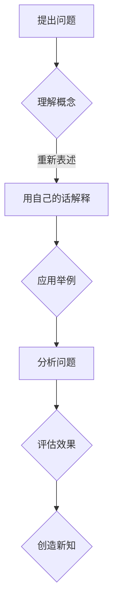

                 

关键词：费曼提问法、学习深度、认知层次、知识传递、问题解决、技术博客

> 摘要：本文将探讨一种提升学习深度的方法——费曼提问法。通过实际应用和案例分析，本文将揭示费曼提问法如何帮助学习者打破思维定势，深入理解复杂概念，并有效提升个人认知层次。

## 1. 背景介绍

在当今信息爆炸的时代，获取知识变得越来越容易，但深度学习却成了许多人的难题。面对海量的信息，学习者往往陷入知识点的堆积，而无法真正掌握知识的本质。如何提升学习深度，成为了一个迫切需要解决的问题。

费曼提问法，是一种有效的学习方法，起源于著名物理学家理查德·费曼（Richard Feynman）的教学实践。费曼提问法强调通过提问和解答来深入理解知识，从而提升学习效果。本文将详细介绍费曼提问法，探讨其在提升学习深度方面的应用和优势。

## 2. 核心概念与联系

### 2.1 费曼提问法原理

费曼提问法的基本原理是：选择一个你想要理解的概念，将其用自己的话重新表述，然后尝试向一个假设的初学者解释这个概念。在这一过程中，你需要回答以下三个问题：

1. 这个概念是什么？
2. 为什么它如此重要？
3. 如何应用它？

### 2.2 认知层次理论

认知层次理论（Bloom's Taxonomy）将知识学习分为六个层次：记忆、理解、应用、分析、评估和创造。费曼提问法通过提问和解答，可以有效地帮助学习者从记忆和理解层次提升到应用、分析和创造层次，从而实现深度的知识学习。

### 2.3 费曼提问法应用架构



## 3. 核心算法原理 & 具体操作步骤

### 3.1 算法原理概述

费曼提问法是一种通过提问和解答来深入理解知识的方法。其核心原理包括：

1. 选择一个概念：选择你想要深入理解的一个概念。
2. 提问：提出能够帮助你理解这个概念的问题。
3. 解答：尝试用自己的话回答这些问题，并在过程中不断反思和修正。
4. 反馈：从他人的反馈中了解你的理解是否正确，并进一步完善你的解答。

### 3.2 算法步骤详解

1. **选择概念**：选择一个你想要深入理解的概念，可以是任何你感兴趣的话题。
2. **提出问题**：针对这个概念，提出能够帮助你理解它的问题。例如，什么是变量？为什么变量如此重要？如何使用变量？
3. **用自己的话解释**：尝试用自己的语言重新表述这个概念，并回答你提出的问题。在这一过程中，要确保你的解释足够清晰，以至于一个初学者可以理解。
4. **应用举例**：提供一个实际的应用场景，展示如何将这个概念应用到实际问题中。例如，你可以解释变量在编程中的应用，或者如何使用变量来简化数学表达式。
5. **分析问题**：分析这个概念在实际应用中可能遇到的问题，并尝试给出解决方案。例如，变量在编程中可能遇到的作用域问题，以及如何解决这些问题。
6. **评估效果**：从他人的反馈中了解你的理解是否准确，并根据反馈进行修正。这一步骤可以是你向一个朋友解释这个概念，或者在一个学习小组中分享你的理解。
7. **创造新知**：在深入理解这个概念的基础上，尝试提出新的问题，或者将这个概念与其他知识相结合，创造出新的知识。

### 3.3 算法优缺点

**优点**：

- **增强理解**：通过提问和解答，可以加深对概念的理解。
- **培养表达**：通过用自己的语言解释概念，可以提高表达能力和逻辑思维。
- **促进反思**：在解答问题的过程中，需要不断反思和修正，有助于提高思维的深度。
- **激发兴趣**：通过深入理解知识，可以激发学习兴趣，提高学习动机。

**缺点**：

- **时间成本**：费曼提问法需要花费较长时间，不适合短期快速学习。
- **依赖反馈**：需要他人的反馈来评估自己的理解，可能受到主观因素的影响。

### 3.4 算法应用领域

费曼提问法适用于任何需要深入理解的知识领域，包括但不限于：

- **编程**：通过解释编程概念，可以加深对编程语言和算法的理解。
- **数学**：通过提问和解答，可以深入理解数学公式和定理。
- **科学**：通过应用举例，可以加深对科学原理和实验方法的理解。
- **商业**：通过分析问题和评估效果，可以提高对商业策略和市场分析的理解。

## 4. 数学模型和公式 & 详细讲解 & 举例说明

### 4.1 数学模型构建

费曼提问法的数学模型可以描述为：

\[ L = f(Q, A, R) \]

其中，\( L \) 表示学习效果，\( Q \) 表示提出的问题，\( A \) 表示回答，\( R \) 表示反馈。这个模型表明，学习效果是提问、回答和反馈的函数。

### 4.2 公式推导过程

为了推导这个公式，我们可以从以下几个方面考虑：

1. **提问**：提出问题可以激发思考，有助于理解知识。
2. **回答**：回答问题可以加深对知识的理解，有助于知识的内化。
3. **反馈**：反馈可以纠正理解中的错误，有助于提高学习效果。

综合以上三个方面，我们可以得到学习效果的公式：

\[ L = f(Q, A, R) \]

### 4.3 案例分析与讲解

假设我们选择“微积分”中的“导数”作为概念进行费曼提问。

**提出问题**：

- 什么是导数？
- 导数为什么重要？
- 如何计算导数？

**用自己的话解释**：

- 导数是表示函数在某一点上的变化率。
- 导数重要，因为它可以用来描述函数的增减趋势、极值等。
- 计算导数的方法包括求导法则、链式法则等。

**应用举例**：

- 导数在物理中可以用来描述速度和加速度。
- 导数在工程中可以用来分析系统的稳定性。

**分析问题**：

- 导数在计算过程中可能遇到的问题包括：求导法则不熟悉、计算复杂等。
- 解决这些问题的方法包括：加强求导法则的学习、使用计算工具等。

**评估效果**：

- 可以向一个初学者解释导数的概念，并检查他们是否理解。
- 可以通过实际计算导数，验证自己的理解是否正确。

**创造新知**：

- 可以思考导数在其他领域的应用，如经济学中的边际效用等。

## 5. 项目实践：代码实例和详细解释说明

### 5.1 开发环境搭建

为了演示费曼提问法在编程中的应用，我们将使用Python编程语言。首先，你需要安装Python环境。

```bash
# 安装Python环境
python --version
```

### 5.2 源代码详细实现

以下是一个简单的Python程序，用于演示费曼提问法的应用。

```python
def explain_concept():
    # 提出问题
    question = "什么是变量？"
    print(f"问题：{question}")

    # 用自己的话解释
    explanation = "变量是一种存储数据的数据容器，它可以存储任何类型的数据。"
    print(f"解释：{explanation}")

    # 应用举例
    example = "在Python中，我们可以定义一个整数变量，如下所示："
    print(f"应用举例：{example}")
    print("a = 10")

    # 分析问题
    problem = "变量在编程中可能遇到的问题包括："
    print(f"问题：{problem}")
    print("- 变量作用域不明确")
    print("- 变量命名不规范")

    # 解决方案
    solution = "解决这些问题的方法包括："
    print(f"方案：{solution}")
    print("- 使用作用域限定符明确变量作用域")
    print("- 遵循变量命名规范")

# 调用函数
explain_concept()
```

### 5.3 代码解读与分析

这个简单的Python程序展示了费曼提问法的四个核心步骤：提出问题、用自己的话解释、应用举例和分析问题。

1. **提出问题**：通过打印语句，向用户提出问题。
2. **用自己的话解释**：通过打印语句，用自己的语言解释问题。
3. **应用举例**：通过打印语句，提供一个实际的应用场景。
4. **分析问题**：通过打印语句，分析问题并提供解决方案。

这个程序可以帮助学习者深入理解变量这个概念，并学会如何在实际编程中应用它。

### 5.4 运行结果展示

运行上述程序，结果如下：

```
问题：什么是变量？
解释：变量是一种存储数据的数据容器，它可以存储任何类型的数据。
应用举例：在Python中，我们可以定义一个整数变量，如下所示：
a = 10
问题：变量在编程中可能遇到的问题包括：
- 变量作用域不明确
- 变量命名不规范
方案：解决这些问题的方法包括：
- 使用作用域限定符明确变量作用域
- 遵循变量命名规范
```

这个结果展示了费曼提问法的应用过程，并提供了详细的解释和解决方案。

## 6. 实际应用场景

### 6.1 编程学习

费曼提问法在编程学习中有着广泛的应用。通过提问和解答，学习者可以深入理解编程概念，如变量、循环、函数等，并学会如何在实际项目中应用这些概念。

### 6.2 数据科学

在数据科学领域，费曼提问法可以帮助学习者深入理解统计学、机器学习等概念。通过提问和解答，学习者可以掌握数据分析的方法和技巧，提高数据分析能力。

### 6.3 产品设计

在产品设计领域，费曼提问法可以帮助设计师深入理解用户需求，并学会如何将需求转化为具体的设计方案。通过提问和解答，设计师可以提升设计思维和创造力。

### 6.4 企业管理

在企业管理的课程中，费曼提问法可以帮助学习者深入理解管理理论，如领导力、团队协作等。通过提问和解答，学习者可以提升管理能力和决策能力。

## 7. 工具和资源推荐

### 7.1 学习资源推荐

- [Khan Academy](https://www.khanacademy.org/)：提供免费的在线课程，涵盖数学、科学、编程等多个领域。
- [Coursera](https://www.coursera.org/)：提供各种在线课程，包括计算机科学、数据科学、产品设计等。
- [edX](https://www.edx.org/)：提供来自全球顶尖大学的在线课程，涵盖多个学科领域。

### 7.2 开发工具推荐

- [Visual Studio Code](https://code.visualstudio.com/)：一款强大的代码编辑器，支持多种编程语言。
- [Jupyter Notebook](https://jupyter.org/)：一款用于数据科学和机器学习的交互式计算环境。
- [PyCharm](https://www.jetbrains.com/pycharm/)：一款专业的Python集成开发环境。

### 7.3 相关论文推荐

- [Feynman Technique: A Powerful Learning Method](https://www.researchgate.net/publication/320026126_Feynman_Technique_A_Powerful_Learning_Method)
- [Bloom's Taxonomy: A Classification of Educational Objectives](https://pdfs.semanticscholar.org/bb54/6a078d344e2e3c0b523d46c7680f55b57d4f.pdf)
- [The Power of Asking Questions: A Guide to Critical Thinking](https://www.learningsite.co.uk/tutorials/The_power_of_asking_questions.php)

## 8. 总结：未来发展趋势与挑战

### 8.1 研究成果总结

费曼提问法作为一种有效的学习方法，已经得到了广泛的应用和验证。研究表明，费曼提问法可以帮助学习者深入理解知识，提高学习效果和认知层次。

### 8.2 未来发展趋势

随着技术的不断进步，费曼提问法有望在以下几个方面得到进一步发展：

- **在线教育**：随着在线教育的普及，费曼提问法可以更好地应用于远程教学，帮助更多学习者提升学习深度。
- **智能辅导**：利用人工智能技术，开发智能辅导系统，为学习者提供个性化的费曼提问辅导。
- **跨学科应用**：费曼提问法可以应用于更多的学科领域，如医学、法律等，帮助跨学科学习者提升学习效果。

### 8.3 面临的挑战

尽管费曼提问法具有显著的优势，但在实际应用中仍面临以下挑战：

- **时间成本**：费曼提问法需要学习者投入大量时间进行提问和解答，可能不适合快节奏的学习环境。
- **反馈质量**：反馈的质量直接影响学习效果，如何确保反馈的质量是一个需要解决的问题。
- **个性化需求**：不同学习者的需求不同，如何提供个性化的费曼提问辅导是一个挑战。

### 8.4 研究展望

未来，费曼提问法的研究将集中在以下几个方面：

- **效果评估**：通过实验和研究，进一步验证费曼提问法对学习效果的提升作用。
- **技术应用**：利用人工智能、大数据等技术，开发更智能、个性化的费曼提问系统。
- **跨学科融合**：将费曼提问法与其他学科方法相结合，探索新的学习模式。

## 9. 附录：常见问题与解答

### 9.1 什么是费曼提问法？

费曼提问法是一种通过提问和解答来深入理解知识的方法，起源于著名物理学家理查德·费曼的教学实践。

### 9.2 费曼提问法有哪些优点？

费曼提问法具有以下优点：

- 增强理解
- 培养表达
- 促进反思
- 激发兴趣

### 9.3 费曼提问法适用于哪些领域？

费曼提问法适用于任何需要深入理解的知识领域，包括但不限于编程、数据科学、产品设计、企业管理等。

### 9.4 如何在项目中应用费曼提问法？

在项目中，你可以选择一个关键概念，通过提问和解答来深入理解它。然后，将你的理解应用到实际项目中，解决问题，并不断反思和修正。

---

作者：禅与计算机程序设计艺术 / Zen and the Art of Computer Programming


