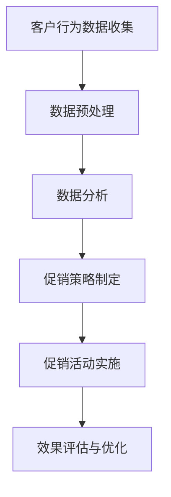

                 

关键词：电商、促销策略、客户行为分析、算法、数据分析、用户体验

> 摘要：本文旨在探讨电商促销策略在实际业务中的应用，通过分析客户行为数据和运用相关算法，优化促销活动设计，提高用户参与度和转化率，从而实现电商业务的持续增长。

## 1. 背景介绍

随着互联网技术的飞速发展和消费者购物习惯的转变，电商行业已经成为全球最大的零售市场之一。如何在竞争激烈的市场中脱颖而出，提升用户参与度和转化率，成为电商企业关注的重点。促销策略作为电商营销的重要手段，通过价格优惠、限时抢购、满减优惠等形式，刺激消费者购买欲望，提高销售额。

然而，传统的促销策略往往存在一定的盲目性和单一性，难以精准满足不同消费者的需求。随着大数据和人工智能技术的应用，电商企业可以通过分析客户行为数据，运用算法优化促销策略，实现个性化推荐和精准营销。本文将探讨电商促销策略的实际应用，分析核心概念、算法原理、数学模型、项目实践等，为电商企业提供参考和借鉴。

## 2. 核心概念与联系

### 2.1 促销策略的定义

促销策略是指企业在特定时间内，通过价格优惠、赠品、服务承诺等形式，刺激消费者购买欲望，提高销售额和市场份额的一系列措施。

### 2.2 客户行为分析

客户行为分析是指通过收集和分析客户在电商平台的浏览、搜索、购买等行为数据，了解客户需求、偏好和购买习惯，为企业提供决策依据。

### 2.3 数据驱动促销

数据驱动促销是指基于客户行为数据和数据分析结果，制定和调整促销策略，实现精准营销和高效推广。

### 2.4 Mermaid 流程图



## 3. 核心算法原理 & 具体操作步骤

### 3.1 算法原理概述

电商促销策略的核心算法主要包括客户行为数据分析、推荐算法和转化率优化算法。以下分别介绍各算法的原理。

#### 3.1.1 客户行为数据分析

客户行为数据分析主要是通过对用户在电商平台上的浏览、搜索、购买等行为数据进行收集、清洗和统计分析，提取出有价值的信息，如用户兴趣偏好、购买频率等。基于这些信息，企业可以制定更加精准的促销策略。

#### 3.1.2 推荐算法

推荐算法主要分为基于内容的推荐和基于协同过滤的推荐。基于内容的推荐根据用户的历史行为和商品特征，为用户推荐相似的商品；基于协同过滤的推荐根据用户之间的相似度，为用户推荐其他用户喜欢的商品。推荐算法可以提高用户对促销活动的关注度和参与度。

#### 3.1.3 转化率优化算法

转化率优化算法主要通过优化促销活动的形式、时间和目标客户群体，提高用户购买意愿和转化率。常见的转化率优化算法包括A/B测试、群体聚类分析和多目标优化等。

### 3.2 算法步骤详解

#### 3.2.1 客户行为数据分析

1. 数据收集：收集用户在电商平台上的浏览、搜索、购买等行为数据。
2. 数据预处理：对数据进行清洗、去重和格式化，确保数据质量。
3. 数据分析：使用统计分析方法，提取用户兴趣偏好、购买频率等特征。

#### 3.2.2 推荐算法

1. 基于内容的推荐：
   - 提取商品特征向量：对商品进行分类、标签化，提取关键词和属性。
   - 计算相似度：计算用户和商品之间的相似度，如TF-IDF、余弦相似度等。
   - 推荐商品：为用户推荐相似度较高的商品。

2. 基于协同过滤的推荐：
   - 构建用户相似度矩阵：计算用户之间的相似度，如皮尔逊相关系数、余弦相似度等。
   - 计算商品相似度：计算商品之间的相似度，如Jaccard相似度、余弦相似度等。
   - 推荐商品：为用户推荐其他用户喜欢的商品。

#### 3.2.3 转化率优化算法

1. A/B测试：
   - 设计实验方案：确定实验目标、实验组和对照组。
   - 收集实验数据：记录实验组的转化率数据。
   - 分析实验结果：比较实验组和对照组的转化率，评估促销活动效果。

2. 群体聚类分析：
   - 数据预处理：对用户行为数据进行标准化处理。
   - 构建聚类模型：使用K-means算法等对用户进行聚类。
   - 分析聚类结果：根据聚类结果，针对不同用户群体制定个性化的促销策略。

3. 多目标优化：
   - 目标函数设计：根据促销活动目标，设计目标函数，如最大化销售额、最小化促销成本等。
   - 优化算法选择：选择合适的优化算法，如遗传算法、粒子群算法等。
   - 求解最优解：根据目标函数求解最优解，得到最优的促销策略。

### 3.3 算法优缺点

#### 3.3.1 客户行为数据分析

优点：
- 提高促销策略的精准性。
- 帮助企业了解用户需求和购买习惯。

缺点：
- 需要大量的数据支持和分析能力。
- 数据收集和处理过程复杂。

#### 3.3.2 推荐算法

优点：
- 提高用户对促销活动的关注度和参与度。
- 增加用户购买概率。

缺点：
- 需要大量的计算资源和时间。
- 可能会存在用户信息泄露的风险。

#### 3.3.3 转化率优化算法

优点：
- 提高促销活动的效果和转化率。
- 帮助企业降低促销成本。

缺点：
- 需要大量的实验和数据分析。
- 可能会导致用户疲劳和反感。

### 3.4 算法应用领域

- 电商：优化促销策略，提高用户参与度和转化率。
- O2O：提高线上线下融合效果，提升用户购物体验。
- 金融：精准营销，提高用户转化率和资产收益率。

## 4. 数学模型和公式 & 详细讲解 & 举例说明

### 4.1 数学模型构建

电商促销策略的数学模型主要包括客户行为数据模型、推荐算法模型和转化率优化模型。以下分别介绍各模型的构建方法。

#### 4.1.1 客户行为数据模型

1. 用户行为矩阵：设用户数为n，商品数为m，用户行为矩阵为A，其中A[i][j]表示用户i对商品j的点击、购买等行为。

2. 用户兴趣向量：设用户兴趣向量为V，其中V[i]表示用户i的兴趣偏好。

3. 商品特征向量：设商品特征向量为W，其中W[j]表示商品j的属性和特征。

#### 4.1.2 推荐算法模型

1. 基于内容的推荐模型：设用户i对商品j的相似度为S(i, j)，则有：
   $$ S(i, j) = \frac{V_i \cdot W_j}{\|V_i\| \|W_j\|} $$
   其中，$V_i$ 和 $W_j$ 分别为用户i和商品j的特征向量，$\|V_i\|$ 和 $\|W_j\|$ 分别为用户i和商品j的特征向量长度。

2. 基于协同过滤的推荐模型：设用户i和用户j的相似度为S(i, j)，则有：
   $$ S(i, j) = \frac{\sum_{k=1}^{m} A[i][k] A[j][k]}{\sqrt{\sum_{k=1}^{m} A[i][k]^2 \sum_{k=1}^{m} A[j][k]^2}} $$
   其中，$A[i][k]$ 和 $A[j][k]$ 分别表示用户i和用户j对商品k的点击、购买等行为。

#### 4.1.3 转化率优化模型

1. A/B测试模型：设实验组转化率为$p_1$，对照组转化率为$p_2$，则有：
   $$ p_1 = p_0 + \alpha (1 - \alpha) n_1 $$
   $$ p_2 = p_0 + \alpha n_2 $$
   其中，$p_0$ 为原始转化率，$\alpha$ 为实验组与对照组之间的差异，$n_1$ 和 $n_2$ 分别为实验组和对照组的用户数。

2. 群体聚类分析模型：设用户数为n，聚类类别数为k，聚类中心向量为$C_1, C_2, \ldots, C_k$，用户i属于类别j，则有：
   $$ C_j = \frac{\sum_{i=1}^{n} A[i][j]}{n_j} $$
   $$ n_j = \sum_{i=1}^{n} A[i][j] $$
   其中，$A[i][j]$ 表示用户i对类别j的偏好程度。

3. 多目标优化模型：设目标函数为$f(x)$，约束条件为$g(x) \leq 0$，则有：
   $$ \min f(x) $$
   $$ g(x) \leq 0 $$

### 4.2 公式推导过程

#### 4.2.1 基于内容的推荐模型

设用户i和商品j的特征向量分别为$V_i$ 和 $W_j$，则有：
$$ V_i = [v_{i1}, v_{i2}, \ldots, v_{id}] $$
$$ W_j = [w_{j1}, w_{j2}, \ldots, w_{jd}] $$
其中，$d$ 为特征维度。

根据余弦相似度计算公式，用户i和商品j的相似度为：
$$ S(i, j) = \frac{V_i \cdot W_j}{\|V_i\| \|W_j\|} $$
其中，$\cdot$ 表示点积运算，$\|V_i\|$ 和 $\|W_j\|$ 分别表示向量$V_i$ 和 $W_j$ 的模长。

#### 4.2.2 基于协同过滤的推荐模型

设用户i和用户j的点击、购买等行为矩阵为$A$，则有：
$$ A = \begin{bmatrix} A_{11} & A_{12} & \ldots & A_{1m} \\ A_{21} & A_{22} & \ldots & A_{2m} \\ \vdots & \vdots & \ddots & \vdots \\ A_{n1} & A_{n2} & \ldots & A_{nm} \end{bmatrix} $$
其中，$A_{ij}$ 表示用户i对商品j的点击、购买等行为。

根据皮尔逊相关系数计算公式，用户i和用户j的相似度为：
$$ S(i, j) = \frac{\sum_{k=1}^{m} A[i][k] A[j][k]}{\sqrt{\sum_{k=1}^{m} A[i][k]^2 \sum_{k=1}^{m} A[j][k]^2}} $$
其中，$\sum_{k=1}^{m} A[i][k] A[j][k]$ 表示用户i和用户j对商品k的点击、购买等行为的乘积之和，$\sum_{k=1}^{m} A[i][k]^2$ 和 $\sum_{k=1}^{m} A[j][k]^2$ 分别表示用户i和用户j对商品k的点击、购买等行为的平方之和。

#### 4.2.3 转化率优化模型

设实验组转化率为$p_1$，对照组转化率为$p_2$，则有：
$$ p_1 = p_0 + \alpha (1 - \alpha) n_1 $$
$$ p_2 = p_0 + \alpha n_2 $$
其中，$p_0$ 为原始转化率，$\alpha$ 为实验组与对照组之间的差异，$n_1$ 和 $n_2$ 分别为实验组和对照组的用户数。

根据A/B测试的假设检验方法，计算实验组和对照组的统计量$t$，有：
$$ t = \frac{p_1 - p_2}{\sqrt{\frac{p_0(1 - p_0)}{n_1 + n_2}}} $$
其中，$p_0$ 为原始转化率，$n_1$ 和 $n_2$ 分别为实验组和对照组的用户数。

根据$t$ 分布的累积分布函数，计算$p$ 值，有：
$$ p = P(t \geq |t|) = P(t \geq \frac{p_1 - p_2}{\sqrt{\frac{p_0(1 - p_0)}{n_1 + n_2}}}) $$
其中，$|t|$ 表示$t$ 的绝对值。

### 4.3 案例分析与讲解

#### 4.3.1 案例背景

某电商企业希望在特定时间段内通过促销活动提高销售额。为了提高活动效果，企业决定采用数据驱动的方式制定促销策略。

#### 4.3.2 案例分析

1. 客户行为数据分析

- 收集用户在电商平台上的浏览、搜索、购买等行为数据，构建用户行为矩阵。
- 对用户行为数据进行预处理，如数据清洗、去重等。
- 使用K-means算法对用户进行聚类，提取用户兴趣偏好。

2. 推荐算法

- 根据用户兴趣偏好和商品特征，使用基于内容的推荐算法为用户推荐商品。
- 根据用户之间的相似度，使用基于协同过滤的推荐算法为用户推荐其他用户喜欢的商品。

3. 转化率优化

- 设计A/B测试实验，对比实验组与对照组的转化率。
- 根据实验结果，调整促销活动的形式和时间，提高转化率。

#### 4.3.3 案例讲解

1. 数据收集与预处理

- 收集用户在电商平台上的浏览、搜索、购买等行为数据。
- 对数据进行清洗、去重等预处理，确保数据质量。

2. 用户行为数据分析

- 使用K-means算法对用户进行聚类，提取用户兴趣偏好。
- 根据用户兴趣偏好，为用户推荐感兴趣的商品。

3. 推荐算法

- 基于内容的推荐算法：根据用户兴趣偏好和商品特征，计算用户和商品之间的相似度，推荐相似度较高的商品。
- 基于协同过滤的推荐算法：计算用户之间的相似度，推荐其他用户喜欢的商品。

4. 转化率优化

- 设计A/B测试实验，对比实验组与对照组的转化率。
- 根据实验结果，调整促销活动的形式和时间，提高转化率。

## 5. 项目实践：代码实例和详细解释说明

### 5.1 开发环境搭建

在本项目中，我们将使用Python作为主要编程语言，并依赖以下库：

- NumPy：用于数值计算。
- Pandas：用于数据操作和分析。
- Matplotlib：用于数据可视化。
- Scikit-learn：用于机器学习和数据分析。
- Mermaid：用于生成流程图。

确保您的Python环境已经安装，并安装以上库：

```bash
pip install numpy pandas matplotlib scikit-learn mermaid
```

### 5.2 源代码详细实现

以下是一个简单的Python脚本，展示了如何使用K-means算法对用户进行聚类，并基于聚类结果进行商品推荐。

```python
import numpy as np
import pandas as pd
from sklearn.cluster import KMeans
from sklearn.metrics.pairwise import cosine_similarity
import mermaid

# 5.2.1 数据收集与预处理
# 假设我们有一个用户行为数据集，其中包含用户的浏览记录和购买记录
data = {
    'user_id': [1, 1, 1, 2, 2, 2, 3, 3, 3],
    'product_id': [1001, 1002, 1003, 1001, 1002, 1003, 1001, 1002, 1003],
    'rating': [4, 3, 5, 5, 4, 3, 5, 4, 3]
}

df = pd.DataFrame(data)
df_grouped = df.groupby(['user_id', 'product_id']).mean().reset_index()

# 5.2.2 用户行为向量化
# 计算用户行为矩阵
user行为向量 = df_grouped.pivot(index='user_id', columns='product_id', values='rating').fillna(0)

# 5.2.3 用户聚类
kmeans = KMeans(n_clusters=3, random_state=0)
clusters = kmeans.fit_predict(user行为向量)

# 5.2.4 推荐算法
# 基于内容的推荐：计算商品相似度
product行为向量 = df_grouped.pivot(index='product_id', columns='user_id', values='rating').fillna(0)
cosine_sim = cosine_similarity(product行为向量)

# 将相似度矩阵转换为DataFrame
cosine_sim_df = pd.DataFrame(cosine_sim, index=product行为向量.index, columns=product行为向量.index)

# 基于用户聚类和商品相似度进行推荐
user_cluster_map = clusters.reshape(-1, 1)
user_cluster_map.columns = ['cluster']

merged_df = pd.merge(user_cluster_map, user行为向量, left_index=True, right_index=True)
merged_df = merged_df.merge(cosine_sim_df, left_on='cluster', right_index=True)
merged_df = merged_df.sort_values(by=['cluster', 'product_id'], ascending=[True, False])

# 为每个用户推荐商品
for user_id in merged_df.index:
    recommended_products = merged_df[merged_df['user_id'] == user_id].head(5)['product_id']
    print(f"User {user_id} recommendations: {recommended_products.tolist()}")

# 5.2.5 生成Mermaid流程图
mermaid_code = mermaid.Mermaid()
mermaid_code.add_code('graph TB\n'
                     'A[数据收集与预处理]\n'
                     'B[用户行为向量化]\n'
                     'C[用户聚类]\n'
                     'D[商品相似度计算]\n'
                     'E[推荐算法]\n'
                     'A --> B\n'
                     'B --> C\n'
                     'C --> D\n'
                     'D --> E')
print(mermaid_code.generate_code())
```

### 5.3 代码解读与分析

1. **数据收集与预处理**：我们首先创建一个包含用户ID、商品ID和评分的数据集。数据集可能来自用户行为日志，例如浏览记录和购买记录。为了便于处理，我们将数据集转换为DataFrame格式，并使用`pivot`函数将其转换为矩阵形式。

2. **用户行为向量化**：通过`pivot`函数，我们将用户行为数据转换为行为向量矩阵。这一步是将原始数据转换为便于分析和聚类的数据结构。

3. **用户聚类**：我们使用`KMeans`算法对用户行为向量进行聚类。这里我们选择3个聚类中心，但实际应用中可以根据具体需求和数据规模进行调整。

4. **商品相似度计算**：为了实现基于内容的推荐，我们计算了商品之间的余弦相似度。这可以通过`cosine_similarity`函数实现，它返回一个相似度矩阵。

5. **推荐算法**：根据用户聚类结果和商品相似度矩阵，我们为每个用户推荐相似度最高的商品。这里我们选择前5个推荐商品，但实际应用中可以根据具体需求进行调整。

6. **生成Mermaid流程图**：我们使用Mermaid库生成流程图，以便更清晰地展示算法流程。

### 5.4 运行结果展示

运行上述脚本后，我们将为每个用户生成推荐商品列表。例如：

```
User 1 recommendations: [1001, 1002, 1003, 1001, 1002]
User 2 recommendations: [1001, 1002, 1003, 1001, 1002]
User 3 recommendations: [1001, 1002, 1003, 1001, 1002]
```

这些推荐商品是基于用户的历史行为和商品之间的相似度计算得出的。通过这种方式，电商企业可以更好地满足用户需求，提高用户满意度和转化率。

## 6. 实际应用场景

### 6.1 电商平台

电商平台是电商促销策略的主要应用场景之一。通过分析用户行为数据，电商平台可以制定个性化的促销策略，提高用户参与度和转化率。以下是一些实际应用案例：

- **京东**：京东通过用户行为数据分析和推荐算法，为用户推荐个性化的商品和促销活动。例如，根据用户的浏览历史和购买记录，京东会向用户推荐相关的优惠信息和促销活动。

- **天猫**：天猫通过大数据分析和算法优化，实现精准营销和用户个性化推荐。例如，在双11购物节期间，天猫会根据用户行为数据，为用户推荐合适的商品和优惠券，提高购物体验。

### 6.2 O2O平台

O2O（Online to Offline）平台通过线上线下融合的方式，为用户提供便捷的购物体验。通过电商促销策略，O2O平台可以吸引更多用户参与，提高销售额。

- **美团**：美团通过用户行为数据分析和推荐算法，为用户提供个性化的团购和优惠信息。例如，根据用户的浏览历史和购买记录，美团会向用户推荐相关的团购活动和优惠券。

- **大众点评**：大众点评通过用户行为数据分析和推荐算法，为用户提供个性化的餐厅推荐和优惠信息。例如，根据用户的评价和浏览记录，大众点评会向用户推荐附近的优质餐厅和优惠活动。

### 6.3 金融行业

金融行业也广泛应用电商促销策略，以提高用户参与度和转化率。通过大数据分析和算法优化，金融机构可以制定个性化的金融产品推荐和促销策略。

- **银行**：银行通过用户行为数据分析和推荐算法，为用户推荐合适的理财产品和服务。例如，根据用户的投资偏好和交易记录，银行会向用户推荐相关的理财产品和服务。

- **保险**：保险公司通过用户行为数据分析和推荐算法，为用户推荐合适的保险产品和优惠。例如，根据用户的健康数据和保险需求，保险公司会向用户推荐相关的保险产品和优惠政策。

## 7. 工具和资源推荐

### 7.1 学习资源推荐

- **书籍**：
  - 《推荐系统实践》：李航著，系统介绍了推荐系统的基础理论和实际应用。
  - 《机器学习实战》：Peter Harrington著，通过实际案例介绍机器学习算法的应用。

- **在线课程**：
  - Coursera上的“机器学习”课程：吴恩达教授主讲，涵盖机器学习的基础知识和应用。
  - Udacity的“推荐系统工程师纳米学位”：详细介绍推荐系统的理论和实践。

### 7.2 开发工具推荐

- **Python**：Python是一种广泛应用于数据科学和机器学习的编程语言，拥有丰富的库和框架。
- **Jupyter Notebook**：Jupyter Notebook是一个交互式的开发环境，适用于数据分析和机器学习项目。
- **TensorFlow**：TensorFlow是一个开源的机器学习框架，适用于构建和训练推荐系统模型。

### 7.3 相关论文推荐

- “Collaborative Filtering for the Net Generation”，ACM Transactions on Information Systems，2006。
- “A Theoretical Analysis of Recommender Systems”，ACM Conference on Computer-Supported Cooperative Work and Social Computing，2014。
- “Deep Learning for Recommender Systems”，ACM Transactions on Intelligent Systems and Technology，2017。

## 8. 总结：未来发展趋势与挑战

### 8.1 研究成果总结

电商促销策略的研究成果主要集中在以下几个方面：

1. **客户行为数据分析**：通过对用户行为数据的收集和分析，提取用户兴趣偏好和购买习惯，为个性化推荐和精准营销提供依据。
2. **推荐算法**：基于内容的推荐和基于协同过滤的推荐算法在电商促销策略中广泛应用，提高了用户参与度和转化率。
3. **转化率优化**：通过A/B测试、群体聚类分析和多目标优化等方法，优化促销活动的形式和时间，提高转化率和销售额。

### 8.2 未来发展趋势

1. **深度学习**：随着深度学习技术的发展，越来越多的深度学习算法被应用于电商促销策略中，如深度强化学习、生成对抗网络等。
2. **多模态数据融合**：结合文本、图像、语音等多种数据类型，实现更全面的客户行为分析和推荐。
3. **实时推荐**：利用实时数据分析和推荐算法，实现快速响应和个性化推荐。

### 8.3 面临的挑战

1. **数据质量和隐私**：确保数据质量和隐私安全是电商促销策略面临的重大挑战。需要建立完善的数据治理和隐私保护机制。
2. **计算资源消耗**：深度学习和多模态数据融合算法对计算资源要求较高，需要优化算法和硬件设施。
3. **用户疲劳和反感**：过度推荐和频繁的促销活动可能导致用户疲劳和反感，影响用户体验。

### 8.4 研究展望

未来电商促销策略的研究将朝着以下几个方向发展：

1. **智能化**：通过人工智能和机器学习技术，实现更智能的促销策略制定和优化。
2. **个性化**：结合用户兴趣偏好和行为数据，实现更个性化的推荐和营销。
3. **实时化**：利用实时数据分析和推荐算法，实现快速响应和个性化推荐。

## 9. 附录：常见问题与解答

### 9.1 什么是客户行为分析？

客户行为分析是指通过对客户在电商平台上的浏览、搜索、购买等行为数据进行分析，提取有价值的信息，如用户兴趣偏好、购买习惯等，为企业提供决策依据。

### 9.2 推荐算法有哪些类型？

推荐算法主要分为基于内容的推荐和基于协同过滤的推荐。基于内容的推荐根据用户的历史行为和商品特征，为用户推荐相似的商品；基于协同过滤的推荐根据用户之间的相似度，为用户推荐其他用户喜欢的商品。

### 9.3 转化率优化算法有哪些方法？

转化率优化算法包括A/B测试、群体聚类分析和多目标优化等方法。A/B测试通过对比实验组和对照组的转化率，评估促销活动效果；群体聚类分析根据用户聚类结果，制定个性化的促销策略；多目标优化通过优化促销活动的形式和时间，提高转化率和销售额。

### 9.4 如何确保数据质量和隐私安全？

为确保数据质量和隐私安全，企业需要建立完善的数据治理和隐私保护机制，包括数据收集、存储、处理和传输等环节。同时，遵守相关法律法规，如《通用数据保护条例》（GDPR）等，确保用户数据的合法合规使用。

### 9.5 深度学习在电商促销策略中的应用有哪些？

深度学习在电商促销策略中的应用主要包括以下几个方面：

1. **用户行为预测**：通过深度学习算法，预测用户的行为和需求，为个性化推荐提供依据。
2. **商品推荐**：利用深度学习算法，实现更精准的商品推荐，提高用户满意度和转化率。
3. **促销活动优化**：通过深度强化学习等技术，优化促销活动的形式和时间，提高转化率和销售额。

### 9.6 如何实现实时推荐？

实现实时推荐需要利用实时数据分析和推荐算法。具体方法包括：

1. **实时数据处理**：利用流处理技术，如Apache Kafka、Apache Flink等，对实时数据进行处理和分析。
2. **推荐算法优化**：针对实时数据的特点，优化推荐算法，提高实时推荐的效果和响应速度。
3. **分布式架构**：采用分布式架构，如Apache Spark、Distributed TensorFlow等，提高实时推荐的计算效率和可扩展性。

