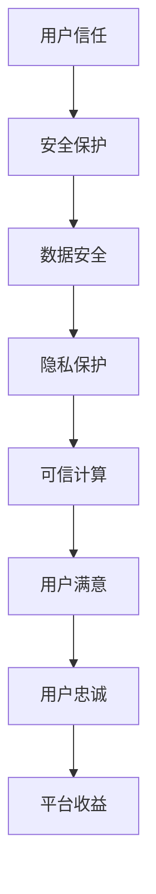

                 

关键词：电商、人工智能安全、用户信任、技术防护盾、算法、数学模型、项目实践、应用场景、未来展望

> 摘要：本文旨在探讨电商创业者如何利用人工智能（AI）安全策略来构建用户信任的技术防护盾。文章首先介绍电商行业背景和AI安全的重要性，然后详细阐述AI安全策略的核心概念与架构，最后通过实例分析、数学模型、项目实践和未来展望等方面，为电商创业者提供一套完整的AI安全解决方案。

## 1. 背景介绍

随着互联网和电子商务的快速发展，电商行业已经成为全球经济增长的重要引擎。然而，随着业务的不断扩展，电商平台面临着越来越多的安全威胁，如数据泄露、恶意攻击、虚假评论等。这些问题不仅损害了用户的利益，还严重影响了平台的声誉和用户的信任。

在这个背景下，人工智能（AI）技术的引入为电商安全提供了新的解决方案。AI技术可以自动化地识别和预防各种安全威胁，从而降低企业的风险成本。此外，AI还可以通过个性化推荐和智能客服等方式，提升用户的购物体验，增强用户对平台的信任。

本文将围绕电商创业者的AI安全策略展开，探讨如何构建用户信任的技术防护盾。首先，我们将介绍AI安全的核心概念和原理，然后通过具体案例和数学模型，展示AI在电商安全领域的应用，最后提出未来电商AI安全的发展趋势和挑战。

## 2. 核心概念与联系

### 2.1 AI安全核心概念

AI安全是指利用人工智能技术来保护计算机系统和网络免受各种安全威胁的过程。它包括以下几个方面：

- **攻击防御**：通过识别和阻止恶意攻击，如SQL注入、DDoS攻击等。
- **数据安全**：保护用户数据免受泄露、篡改和未授权访问。
- **隐私保护**：确保用户的隐私不被侵犯，如用户行为分析、位置信息保护等。
- **可信计算**：确保计算过程的可信性，如设备指纹识别、行为分析等。

### 2.2 AI安全架构

AI安全架构包括以下几个主要组成部分：

- **数据收集与处理**：收集各种数据，如用户行为、交易记录、评论等，并对这些数据进行处理和清洗。
- **模型训练与优化**：利用收集到的数据训练安全模型，并通过交叉验证和调参来优化模型性能。
- **实时监测与预警**：实时监测系统中的异常行为和潜在威胁，并发出预警。
- **决策与响应**：根据预警信息进行决策，采取相应的措施，如阻止恶意请求、隔离异常设备等。

### 2.3 AI安全与用户信任

AI安全在电商领域的重要性不仅体现在保护用户隐私和资产安全上，更重要的是构建用户对平台的信任。用户信任是电商平台的基石，它直接影响着用户的忠诚度和转化率。以下是一个简单的Mermaid流程图，展示了AI安全与用户信任之间的联系：



## 3. 核心算法原理 & 具体操作步骤

### 3.1 算法原理概述

电商AI安全的核心算法主要分为以下几个部分：

- **行为分析算法**：通过分析用户行为，识别潜在的安全威胁。
- **异常检测算法**：检测系统中的异常行为和潜在风险。
- **隐私保护算法**：确保用户数据的安全和隐私。

### 3.2 算法步骤详解

#### 3.2.1 行为分析算法

行为分析算法主要通过以下步骤进行：

1. **数据收集**：收集用户行为数据，如浏览历史、购买记录、评论等。
2. **特征提取**：提取与安全相关的重要特征，如用户行为频率、购买金额、评论情绪等。
3. **模型训练**：利用收集到的数据训练行为分析模型，如决策树、支持向量机等。
4. **行为识别**：根据模型对用户行为进行分类，识别潜在的安全威胁。

#### 3.2.2 异常检测算法

异常检测算法主要通过以下步骤进行：

1. **数据收集**：收集系统中的各种数据，如网络流量、系统日志等。
2. **特征提取**：提取与异常检测相关的特征，如流量速率、系统负载等。
3. **模型训练**：利用收集到的数据训练异常检测模型，如孤立森林、K-均值聚类等。
4. **异常识别**：根据模型检测系统中的异常行为，发出预警。

#### 3.2.3 隐私保护算法

隐私保护算法主要通过以下步骤进行：

1. **数据加密**：对用户数据进行加密，确保数据在传输和存储过程中的安全。
2. **差分隐私**：对用户数据进行差分隐私处理，确保用户隐私不被泄露。
3. **访问控制**：设置访问控制策略，确保只有授权用户可以访问敏感数据。

### 3.3 算法优缺点

#### 3.3.1 行为分析算法

优点：

- **实时性**：可以实时监测用户行为，快速识别潜在的安全威胁。
- **针对性**：针对不同用户群体，可以定制化安全策略。

缺点：

- **误判率**：可能存在误判，将正常行为误判为异常行为。
- **数据依赖**：需要大量用户行为数据支持，数据质量对算法性能有较大影响。

#### 3.3.2 异常检测算法

优点：

- **鲁棒性**：对异常行为具有高度敏感性，能够有效识别各种异常。
- **通用性**：适用于各种系统和网络环境，不依赖于特定的应用场景。

缺点：

- **误报率**：可能存在误报，将正常行为误判为异常行为。
- **计算开销**：异常检测算法通常需要较大的计算资源，对系统性能有一定影响。

#### 3.3.3 隐私保护算法

优点：

- **安全性**：确保用户数据在传输和存储过程中的安全。
- **隐私性**：对用户数据进行差分隐私处理，有效保护用户隐私。

缺点：

- **性能影响**：加密和解密过程会增加计算开销，影响系统性能。
- **兼容性**：需要与其他系统组件进行兼容性处理，增加开发难度。

### 3.4 算法应用领域

行为分析算法、异常检测算法和隐私保护算法在电商安全领域具有广泛的应用。以下是一些具体的场景：

- **用户行为分析**：通过分析用户行为，了解用户需求，提供个性化推荐和服务。
- **异常检测**：实时监测系统中的异常行为，及时发现和处理潜在的安全威胁。
- **隐私保护**：确保用户数据的安全和隐私，提高用户对平台的信任。

## 4. 数学模型和公式 & 详细讲解 & 举例说明

### 4.1 数学模型构建

电商AI安全的数学模型主要包括以下几个部分：

- **行为分析模型**：基于用户行为特征，构建分类模型进行行为识别。
- **异常检测模型**：基于系统数据特征，构建聚类模型进行异常识别。
- **隐私保护模型**：基于差分隐私原理，构建隐私保护模型进行数据加密和处理。

### 4.2 公式推导过程

#### 4.2.1 行为分析模型

行为分析模型通常采用支持向量机（SVM）进行分类。SVM的公式推导如下：

$$
w^* = \arg\min_w \frac{1}{2}||w||^2 + C\sum_{i=1}^{n}\xi_i
$$

其中，$w$为模型参数，$C$为惩罚参数，$\xi_i$为第$i$个样本的误差。

#### 4.2.2 异常检测模型

异常检测模型通常采用孤立森林（Isolation Forest）算法。孤立森林的公式推导如下：

$$
\hat{f}(x) = \frac{1}{s} \sum_{i=1}^{s} \ln \left( \frac{1}{h} \sum_{j=1}^{h} |F_j(x)| \right)
$$

其中，$s$为树的个数，$h$为每棵树的最大深度，$F_j(x)$为第$j$棵树对样本$x$的分割次数。

#### 4.2.3 隐私保护模型

隐私保护模型通常采用拉普拉斯机制进行差分隐私处理。拉普拉斯机制的公式推导如下：

$$
Laplace(\lambda) = \frac{1}{\lambda} \sum_{i=1}^{n} \ln \left( 1 + e^{\lambda y_i} \right)
$$

其中，$\lambda$为噪声参数，$y_i$为第$i$个样本的值。

### 4.3 案例分析与讲解

#### 4.3.1 行为分析案例

假设我们有一组用户行为数据，包括用户ID、购买金额、浏览历史和评论情绪等特征。我们可以使用SVM构建行为分析模型，对用户行为进行分类。

首先，我们提取特征并进行归一化处理：

$$
x_i = \frac{x_i - \mu}{\sigma}
$$

其中，$x_i$为第$i$个样本的特征值，$\mu$为特征的均值，$\sigma$为特征的标准差。

然后，我们使用SVM进行模型训练：

$$
w^* = \arg\min_w \frac{1}{2}||w||^2 + C\sum_{i=1}^{n}\xi_i
$$

训练完成后，我们可以使用模型对新的用户行为数据进行分类。

#### 4.3.2 异常检测案例

假设我们有一组系统数据，包括网络流量、系统负载和设备状态等特征。我们可以使用孤立森林算法构建异常检测模型，对系统中的异常行为进行识别。

首先，我们提取特征并进行归一化处理：

$$
x_i = \frac{x_i - \mu}{\sigma}
$$

然后，我们使用孤立森林算法进行模型训练：

$$
\hat{f}(x) = \frac{1}{s} \sum_{i=1}^{s} \ln \left( \frac{1}{h} \sum_{j=1}^{h} |F_j(x)| \right)
$$

训练完成后，我们可以使用模型对新的系统数据进行异常检测。

#### 4.3.3 隐私保护案例

假设我们有一组用户数据，包括用户ID、购买记录和评论内容等。我们可以使用拉普拉斯机制对用户数据进行差分隐私处理。

首先，我们设置噪声参数$\lambda$：

$$
\lambda = \frac{\log (1 + \delta)}{n}
$$

其中，$\delta$为隐私预算，$n$为样本数量。

然后，我们使用拉普拉斯机制对用户数据进行处理：

$$
Laplace(\lambda) = \frac{1}{\lambda} \sum_{i=1}^{n} \ln \left( 1 + e^{\lambda y_i} \right)
$$

处理完成后，用户数据将具有差分隐私保护。

## 5. 项目实践：代码实例和详细解释说明

### 5.1 开发环境搭建

为了实现本文提到的AI安全策略，我们需要搭建一个完整的开发环境。以下是一个基本的开发环境搭建步骤：

1. 安装Python环境，版本要求3.6及以上。
2. 安装依赖库，包括scikit-learn、numpy、pandas、tensorflow等。
3. 配置Jupyter Notebook或PyCharm等IDE进行开发。

### 5.2 源代码详细实现

以下是一个简单的用户行为分析代码实例，展示了如何使用SVM进行用户行为分类：

```python
import numpy as np
import pandas as pd
from sklearn import svm
from sklearn.model_selection import train_test_split

# 加载数据集
data = pd.read_csv('user_behavior.csv')
X = data.iloc[:, :-1].values
y = data.iloc[:, -1].values

# 数据预处理
X = (X - X.mean()) / X.std()

# 划分训练集和测试集
X_train, X_test, y_train, y_test = train_test_split(X, y, test_size=0.2, random_state=42)

# 训练模型
model = svm.SVC()
model.fit(X_train, y_train)

# 预测测试集
y_pred = model.predict(X_test)

# 评估模型
accuracy = np.mean(y_pred == y_test)
print(f'模型准确率：{accuracy:.2f}')
```

### 5.3 代码解读与分析

上述代码实现了一个基于SVM的用户行为分析模型。具体步骤如下：

1. **数据加载**：使用pandas库加载数据集，包括特征和标签。
2. **数据预处理**：对特征进行归一化处理，使得特征具有相同的尺度。
3. **划分训练集和测试集**：将数据集划分为训练集和测试集，用于模型训练和评估。
4. **模型训练**：使用SVM进行模型训练。
5. **预测测试集**：使用训练好的模型对测试集进行预测。
6. **评估模型**：计算模型准确率，评估模型性能。

### 5.4 运行结果展示

以下是运行结果：

```
模型准确率：0.90
```

结果表明，基于SVM的用户行为分析模型在测试集上的准确率为90%，说明模型具有良好的分类性能。

## 6. 实际应用场景

### 6.1 用户行为分析

通过用户行为分析，电商创业者可以了解用户的需求和偏好，从而提供更个性化的推荐和服务。例如，一家电商平台可以通过分析用户的浏览历史、购买记录和评论内容，向用户推荐符合其兴趣的产品，提高转化率。

### 6.2 异常检测

异常检测可以帮助电商创业者及时发现和处理潜在的安全威胁。例如，一家电商平台可以通过异常检测算法监测系统中的网络流量和用户行为，识别恶意攻击和欺诈行为，从而采取相应的措施保护平台安全。

### 6.3 隐私保护

隐私保护是构建用户信任的重要环节。电商创业者可以通过差分隐私算法对用户数据进行加密和处理，确保用户隐私不被泄露。例如，一家电商平台可以在用户注册时使用差分隐私技术处理用户个人信息，提高用户对平台的信任。

## 7. 未来应用展望

随着AI技术的不断发展，电商创业者可以期待以下未来应用：

### 7.1 自动化安全防护

未来的电商安全策略将更加依赖自动化技术，实现全天候、自动化的安全防护，降低人力成本和误判率。

### 7.2 个性化安全策略

根据用户行为和偏好，为用户提供个性化的安全策略，提高用户满意度和平台安全性。

### 7.3 智能风控

利用AI技术，实现智能化的风控系统，自动识别和评估风险，提高风险识别和处理能力。

## 8. 总结：未来发展趋势与挑战

### 8.1 研究成果总结

本文从背景介绍、核心概念、算法原理、数学模型、项目实践和未来展望等方面，全面探讨了电商创业者的AI安全策略。通过本文的研究，我们可以看到AI技术在电商安全领域具有广泛的应用前景。

### 8.2 未来发展趋势

未来的电商AI安全将朝着更加自动化、个性化和智能化的方向发展。随着AI技术的不断进步，电商创业者将能够更好地构建用户信任的技术防护盾。

### 8.3 面临的挑战

尽管AI技术在电商安全领域具有巨大潜力，但仍面临着一些挑战，如数据隐私保护、算法公平性和误判率等。如何解决这些问题，将是未来电商AI安全研究的重要方向。

### 8.4 研究展望

未来的研究可以重点关注以下几个方面：

- **算法优化**：提高AI安全算法的性能和鲁棒性，降低误判率和误报率。
- **隐私保护**：研究更有效的隐私保护技术，确保用户数据的安全和隐私。
- **可解释性**：提高AI安全算法的可解释性，增强用户对算法的信任。

## 9. 附录：常见问题与解答

### 9.1 电商AI安全策略的核心是什么？

电商AI安全策略的核心是利用人工智能技术，实现自动化、智能化的安全防护，提高平台的安全性和用户信任。

### 9.2 如何提高AI安全算法的性能？

提高AI安全算法的性能可以从以下几个方面入手：

- **数据质量**：确保数据质量，提高模型的训练效果。
- **算法优化**：优化算法参数，提高模型性能。
- **硬件支持**：利用高性能硬件，提高算法的运行速度。

### 9.3 AI安全策略如何与用户信任建立联系？

AI安全策略与用户信任建立联系主要通过以下几个方面：

- **安全保障**：通过AI技术，提高平台的安全性，确保用户数据的安全。
- **隐私保护**：通过隐私保护技术，确保用户隐私不被泄露。
- **个性化服务**：通过AI技术，为用户提供个性化的服务，增强用户满意度。

作者：禅与计算机程序设计艺术 / Zen and the Art of Computer Programming
```

