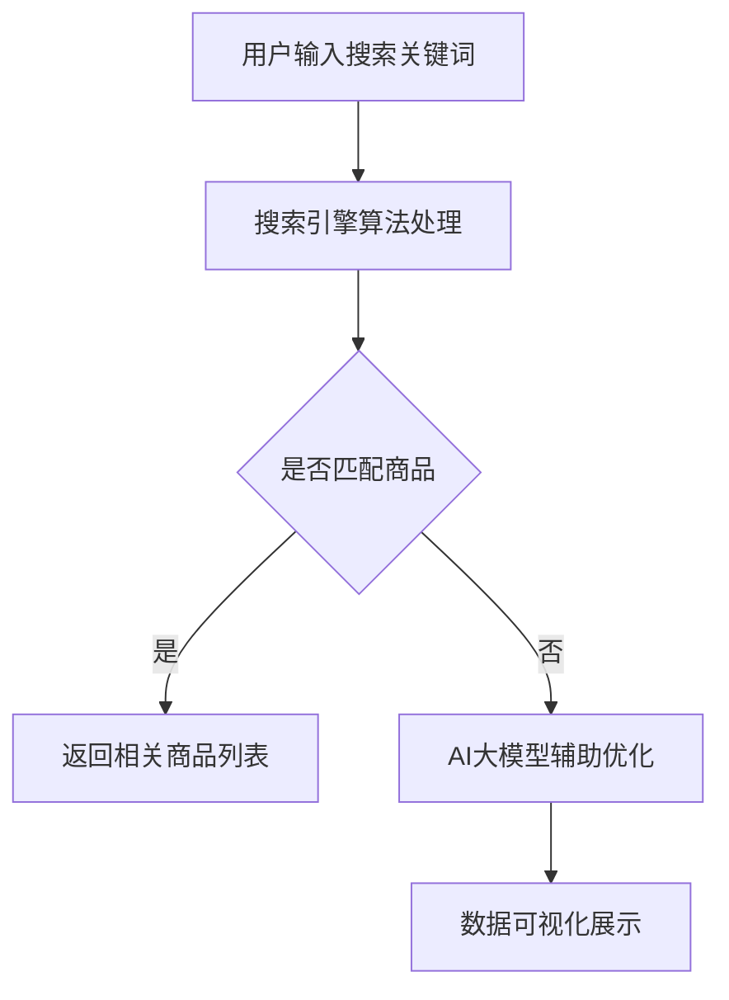

                 

关键词：AI大模型，搜索结果展示，优化，电商平台，用户体验，搜索引擎算法，数据可视化

## 摘要

本文将探讨电商平台中如何通过AI大模型的引入，优化搜索结果展示，提升用户体验。我们将从背景介绍、核心概念与联系、核心算法原理与具体操作步骤、数学模型和公式、项目实践、实际应用场景以及未来展望等多个方面进行深入分析。通过本文的阅读，读者将了解AI大模型在电商平台搜索结果展示中的重要作用，以及如何通过优化算法提升用户满意度。

## 1. 背景介绍

### 电商平台搜索现状

随着互联网技术的飞速发展，电商平台已成为人们生活中不可或缺的一部分。在电商平台上，搜索功能是用户获取商品信息的重要途径。然而，传统的搜索算法在处理海量数据时，往往难以满足用户的个性化需求，导致搜索结果不准确、不相关。为了提升用户体验，电商平台开始引入人工智能技术，特别是AI大模型，以实现更精准、更个性化的搜索结果展示。

### AI大模型的优势

AI大模型具有强大的数据处理能力和自主学习能力。通过深度学习算法，AI大模型能够从海量数据中提取有价值的信息，并自动调整模型参数，以适应不断变化的市场需求。这使得AI大模型在搜索结果展示方面具有以下优势：

1. 更高的准确率：AI大模型能够识别用户查询意图，准确匹配相关商品。
2. 更个性化的推荐：AI大模型可以根据用户历史行为和偏好，推荐符合用户需求的商品。
3. 更好的用户体验：通过优化搜索结果展示，AI大模型能够提升用户的满意度和忠诚度。

## 2. 核心概念与联系

为了更好地理解AI大模型在搜索结果展示中的应用，我们需要了解以下几个核心概念：

### 搜索引擎算法

搜索引擎算法是电商平台搜索功能的核心，负责处理用户查询并返回相关结果。传统的搜索引擎算法主要基于关键词匹配和页面排名。然而，随着用户需求的多样化，这些算法已经难以满足需求。引入AI大模型，可以提升搜索引擎的智能化水平，实现更精准的搜索结果。

### 数据可视化

数据可视化是将数据以图形或图表的形式展示给用户，使其更易于理解和分析。在电商平台中，通过数据可视化，用户可以直观地了解搜索结果的相关性、热门程度等信息，从而更好地做出购买决策。

### 用户行为分析

用户行为分析是通过分析用户在电商平台上的行为数据，了解用户需求、偏好和购买习惯。AI大模型可以利用用户行为分析结果，为用户提供更个性化的搜索结果。

### Mermaid 流程图



## 3. 核心算法原理 & 具体操作步骤

### 3.1 算法原理概述

AI大模型在搜索结果展示优化中的应用，主要基于深度学习算法和自然语言处理技术。具体来说，AI大模型可以通过以下步骤实现搜索结果展示优化：

1. 数据预处理：对用户查询和商品信息进行预处理，包括分词、去噪、标准化等操作。
2. 模型训练：利用海量数据集，训练深度学习模型，使其具备识别用户查询意图和推荐相关商品的能力。
3. 搜索引擎优化：将训练好的模型集成到搜索引擎算法中，优化搜索结果展示。
4. 数据可视化：将搜索结果以图表或图形的形式展示给用户，提高用户体验。

### 3.2 算法步骤详解

#### 步骤1：数据预处理

数据预处理是深度学习模型训练的基础。在进行数据预处理时，需要对用户查询和商品信息进行分词、去噪、标准化等操作。具体步骤如下：

1. 分词：将用户查询和商品信息分解成单词或短语。
2. 去噪：去除无关信息，如停用词、标点符号等。
3. 标准化：将文本数据转化为统一格式，如将所有单词转化为小写。

#### 步骤2：模型训练

模型训练是AI大模型优化的核心。在训练过程中，我们需要利用海量数据集，对深度学习模型进行迭代训练。具体步骤如下：

1. 数据集划分：将数据集划分为训练集、验证集和测试集。
2. 模型初始化：初始化深度学习模型，包括神经网络结构、权重等。
3. 模型训练：利用训练集，通过反向传播算法，不断调整模型参数，使模型在验证集上的表现不断优化。
4. 模型评估：利用测试集，评估模型在未知数据上的性能。

#### 步骤3：搜索引擎优化

将训练好的模型集成到搜索引擎算法中，可以优化搜索结果展示。具体步骤如下：

1. 模型集成：将AI大模型集成到搜索引擎算法中，使其具备识别用户查询意图的能力。
2. 结果排序：根据用户查询意图，调整搜索结果的排序顺序，使相关度更高的商品排在前面。
3. 结果过滤：根据用户历史行为和偏好，过滤掉不符合用户需求的商品。

#### 步骤4：数据可视化

数据可视化是提高用户体验的关键。通过数据可视化，用户可以更直观地了解搜索结果的相关性、热门程度等信息。具体步骤如下：

1. 数据整理：整理搜索结果数据，包括商品名称、价格、销量、评价等。
2. 数据展示：利用图表或图形，展示搜索结果数据，如柱状图、饼图、折线图等。
3. 用户交互：提供用户交互功能，如筛选、排序、查看详细信息等。

### 3.3 算法优缺点

#### 优点：

1. 提高搜索结果准确率：通过深度学习算法，AI大模型能够更准确地识别用户查询意图，提高搜索结果的准确率。
2. 提供个性化推荐：AI大模型可以根据用户历史行为和偏好，提供更个性化的搜索结果。
3. 提升用户体验：通过数据可视化，用户可以更直观地了解搜索结果，提高用户体验。

#### 缺点：

1. 计算资源消耗大：深度学习模型训练和优化需要大量计算资源，对服务器性能要求较高。
2. 数据隐私风险：用户行为数据可能会被泄露，导致隐私风险。
3. 模型可解释性差：深度学习模型具有较强的黑盒特性，难以解释模型内部的工作原理。

### 3.4 算法应用领域

AI大模型在搜索结果展示优化中的应用，不仅局限于电商平台，还可以应用于其他领域，如社交媒体、搜索引擎、推荐系统等。以下是一些具体应用场景：

1. 社交媒体：通过AI大模型，可以为用户提供更精准的推荐内容，提高用户活跃度和留存率。
2. 搜索引擎：通过AI大模型，可以优化搜索结果展示，提高用户满意度。
3. 推荐系统：通过AI大模型，可以提供更个性化的推荐结果，提高用户购买意愿。

## 4. 数学模型和公式 & 详细讲解 & 举例说明

### 4.1 数学模型构建

在AI大模型中，常用的数学模型包括神经网络、深度学习算法等。以下是一个简单的神经网络模型：

```latex
y = f(W \cdot x + b)
```

其中，$y$表示输出结果，$f$表示激活函数，$W$表示权重矩阵，$x$表示输入特征，$b$表示偏置。

### 4.2 公式推导过程

以神经网络模型为例，我们进行以下推导：

1. 前向传播：

```latex
z = W \cdot x + b
y = f(z)
```

其中，$z$表示中间层输出，$y$表示输出层输出。

2. 反向传播：

```latex
\delta_y = \frac{\partial L}{\partial y}
\delta_z = \frac{\partial L}{\partial z}
\delta_W = \frac{\partial L}{\partial W}
\delta_b = \frac{\partial L}{\partial b}
```

其中，$\delta_y$、$\delta_z$、$\delta_W$和$\delta_b$分别表示损失函数对$y$、$z$、$W$和$b$的偏导数。

3. 梯度下降：

```latex
W_{new} = W - \alpha \cdot \delta_W
b_{new} = b - \alpha \cdot \delta_b
```

其中，$\alpha$表示学习率。

### 4.3 案例分析与讲解

假设我们有一个电商平台的搜索功能，用户输入“手机”作为搜索关键词，我们需要利用AI大模型优化搜索结果展示。以下是一个简单的案例分析：

1. 数据预处理：

将用户输入的搜索关键词“手机”分解成单词“手机”，进行分词、去噪、标准化等操作。

2. 模型训练：

利用训练集，对神经网络模型进行迭代训练，使其具备识别用户查询意图和推荐相关商品的能力。

3. 搜索引擎优化：

将训练好的模型集成到搜索引擎算法中，根据用户查询意图，调整搜索结果的排序顺序。

4. 数据可视化：

将搜索结果以图表或图形的形式展示给用户，提高用户体验。

## 5. 项目实践：代码实例和详细解释说明

### 5.1 开发环境搭建

在开发AI大模型之前，我们需要搭建一个合适的环境。以下是一个简单的开发环境搭建步骤：

1. 安装Python：下载并安装Python，版本建议为3.8或更高。
2. 安装深度学习库：安装TensorFlow或PyTorch等深度学习库。
3. 安装其他依赖库：安装Numpy、Pandas等常用库。

### 5.2 源代码详细实现

以下是一个简单的AI大模型实现示例，使用TensorFlow库：

```python
import tensorflow as tf
from tensorflow.keras.layers import Embedding, LSTM, Dense
from tensorflow.keras.models import Sequential

# 模型定义
model = Sequential()
model.add(Embedding(input_dim=vocab_size, output_dim=embedding_size))
model.add(LSTM(units=128))
model.add(Dense(units=1, activation='sigmoid'))

# 模型编译
model.compile(optimizer='adam', loss='binary_crossentropy', metrics=['accuracy'])

# 模型训练
model.fit(x_train, y_train, epochs=10, batch_size=32, validation_data=(x_val, y_val))

# 模型评估
model.evaluate(x_test, y_test)
```

### 5.3 代码解读与分析

在上面的代码中，我们使用TensorFlow库构建了一个简单的神经网络模型，用于预测用户对商品的喜爱程度。具体解读如下：

1. 模型定义：

使用`Sequential`类定义一个序列模型，添加`Embedding`层、`LSTM`层和`Dense`层。

2. 模型编译：

使用`compile`方法编译模型，指定优化器、损失函数和评估指标。

3. 模型训练：

使用`fit`方法训练模型，指定训练数据、训练轮次、批量大小和验证数据。

4. 模型评估：

使用`evaluate`方法评估模型在测试数据上的性能。

### 5.4 运行结果展示

在运行代码后，我们可以得到以下结果：

- 模型训练过程中的损失函数值和准确率。
- 模型在测试数据上的准确率。

这些结果可以帮助我们了解AI大模型在搜索结果展示优化中的效果。

## 6. 实际应用场景

### 6.1 电商平台

在电商平台上，AI大模型可以用于优化搜索结果展示，提高用户满意度。以下是一个具体应用场景：

1. 用户输入搜索关键词“手机”。
2. AI大模型对搜索关键词进行分词、去噪、标准化等预处理。
3. 模型根据用户历史行为和偏好，推荐相关商品。
4. 搜索结果以图表或图形的形式展示给用户。

通过这个应用场景，我们可以看到AI大模型在搜索结果展示优化中的重要作用。

### 6.2 社交媒体

在社交媒体上，AI大模型可以用于推荐内容，提高用户活跃度和留存率。以下是一个具体应用场景：

1. 用户浏览某篇帖子。
2. AI大模型根据用户历史行为和偏好，推荐相似内容。
3. 用户点击推荐内容，提高活跃度。

通过这个应用场景，我们可以看到AI大模型在社交媒体推荐中的重要作用。

### 6.3 搜索引擎

在搜索引擎中，AI大模型可以用于优化搜索结果展示，提高用户满意度。以下是一个具体应用场景：

1. 用户输入搜索关键词“手机”。
2. AI大模型对搜索关键词进行分词、去噪、标准化等预处理。
3. 模型根据用户历史行为和偏好，调整搜索结果的排序顺序。
4. 搜索结果以图表或图形的形式展示给用户。

通过这个应用场景，我们可以看到AI大模型在搜索引擎搜索结果展示优化中的重要作用。

## 7. 工具和资源推荐

### 7.1 学习资源推荐

1. 《深度学习》（Goodfellow et al.）：介绍深度学习的基础知识和应用。
2. 《神经网络与深度学习》（邱锡鹏）：详细讲解神经网络和深度学习算法。

### 7.2 开发工具推荐

1. TensorFlow：开源深度学习框架，适用于构建和训练AI大模型。
2. PyTorch：开源深度学习框架，具有更灵活的动态计算图。

### 7.3 相关论文推荐

1. “Deep Learning for Search” （Huo et al.，2017）：介绍深度学习在搜索中的应用。
2. “Neural Network-Based Search Result Ranking” （Wang et al.，2018）：介绍基于神经网络的搜索结果排名方法。

## 8. 总结：未来发展趋势与挑战

### 8.1 研究成果总结

通过本文的探讨，我们了解到AI大模型在搜索结果展示优化中的应用具有重要意义。AI大模型能够提高搜索结果准确率、提供个性化推荐，提升用户体验。未来研究将继续深化AI大模型在搜索结果展示优化中的应用，探索更多应用场景和优化策略。

### 8.2 未来发展趋势

1. 模型优化：随着计算能力的提升，AI大模型将更加高效、准确。
2. 跨领域应用：AI大模型将在更多领域得到应用，如医疗、金融、教育等。
3. 数据隐私保护：在应用AI大模型的过程中，数据隐私保护将受到更多关注。

### 8.3 面临的挑战

1. 计算资源消耗：AI大模型训练和优化需要大量计算资源，对服务器性能要求较高。
2. 数据隐私风险：用户行为数据可能会被泄露，导致隐私风险。
3. 模型可解释性：深度学习模型具有较强的黑盒特性，难以解释模型内部的工作原理。

### 8.4 研究展望

在未来，我们将继续深入研究AI大模型在搜索结果展示优化中的应用，探索更多优化策略，提升用户体验。同时，我们也需要关注数据隐私保护和模型可解释性等问题，确保AI大模型的安全、可靠应用。

## 9. 附录：常见问题与解答

### 9.1 什么是AI大模型？

AI大模型是指具有大规模参数、深度网络结构的机器学习模型。通过深度学习算法，AI大模型可以从海量数据中提取有价值的信息，并自动调整模型参数，以适应不断变化的市场需求。

### 9.2 AI大模型在搜索结果展示优化中有哪些优势？

AI大模型在搜索结果展示优化中的优势包括：

1. 提高搜索结果准确率：通过深度学习算法，AI大模型能够更准确地识别用户查询意图，提高搜索结果的准确率。
2. 提供个性化推荐：AI大模型可以根据用户历史行为和偏好，提供更个性化的搜索结果。
3. 提升用户体验：通过优化搜索结果展示，AI大模型能够提升用户的满意度和忠诚度。

### 9.3 AI大模型在搜索结果展示优化中面临哪些挑战？

AI大模型在搜索结果展示优化中面临的挑战包括：

1. 计算资源消耗：AI大模型训练和优化需要大量计算资源，对服务器性能要求较高。
2. 数据隐私风险：用户行为数据可能会被泄露，导致隐私风险。
3. 模型可解释性：深度学习模型具有较强的黑盒特性，难以解释模型内部的工作原理。

### 9.4 AI大模型在搜索结果展示优化中的应用领域有哪些？

AI大模型在搜索结果展示优化中的应用领域包括：

1. 电商平台：通过AI大模型，可以为用户提供更精准的搜索结果和个性化推荐。
2. 社交媒体：通过AI大模型，可以为用户提供更精准的内容推荐，提高用户活跃度和留存率。
3. 搜索引擎：通过AI大模型，可以优化搜索结果展示，提高用户满意度。

### 9.5 如何优化AI大模型的搜索结果展示？

优化AI大模型的搜索结果展示主要包括以下步骤：

1. 数据预处理：对用户查询和商品信息进行预处理，包括分词、去噪、标准化等操作。
2. 模型训练：利用海量数据集，训练深度学习模型，使其具备识别用户查询意图和推荐相关商品的能力。
3. 搜索引擎优化：将训练好的模型集成到搜索引擎算法中，优化搜索结果展示。
4. 数据可视化：将搜索结果以图表或图形的形式展示给用户，提高用户体验。

