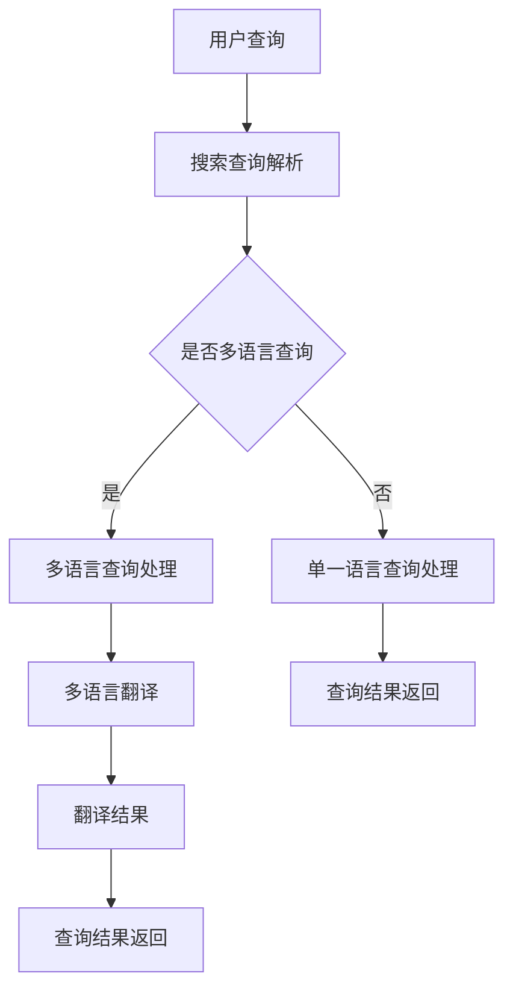

                 

关键词：电商平台、AI大模型、多语言支持、自然语言处理、语言模型、翻译、跨语言交互、技术挑战

> 摘要：本文将深入探讨电商平台中的AI大模型如何从单一语言支持扩展到多语言支持。我们将首先介绍电商平台的背景和需求，然后分析当前主流的AI大模型及其在多语言支持方面的挑战。接着，我们将详细讨论多语言支持的核心算法原理、数学模型以及实际应用场景。最后，我们将展望AI大模型多语言支持的未来发展趋势与面临的挑战，并提供相应的解决方案和资源推荐。

## 1. 背景介绍

随着互联网的迅猛发展，电商平台已成为全球商业活动的重要组成部分。无论是大型电商平台如Amazon、Alibaba，还是中小型电商平台，都面临着日益增长的全球化需求。为了吸引全球用户，电商平台需要提供多语言支持，以便用户能够以他们熟悉的语言进行购物和交流。

在过去的几年里，人工智能（AI）技术的发展极大地推动了电商平台的进步。特别是自然语言处理（NLP）和机器学习技术的突破，使得AI大模型在电商平台的各个领域得到了广泛应用。这些AI大模型不仅能够处理单一语言的文本，还可以通过迁移学习和跨语言预训练等方式，实现多语言支持。

然而，将AI大模型从单一语言支持扩展到多语言支持并非易事。这需要解决众多技术挑战，包括数据集的构建、模型的设计、算法的优化以及实际应用的落地。本文将围绕这些问题进行深入探讨。

## 2. 核心概念与联系

### 2.1 AI大模型概述

AI大模型是指那些在规模和复杂性上都达到了新的高度的机器学习模型。这些模型通常具有数十亿甚至数千亿的参数，能够处理大量的数据，从而提供高度准确和鲁棒的预测和分类结果。在电商平台中，AI大模型主要用于以下领域：

- **推荐系统**：利用用户的历史行为和偏好，为用户推荐个性化的商品和内容。
- **聊天机器人**：提供24/7的客户服务，解答用户的问题，提升用户体验。
- **自然语言处理**：处理用户的搜索查询和评论，提供精准的搜索结果和用户反馈分析。

### 2.2 多语言支持的重要性

多语言支持是电商平台全球化战略的关键组成部分。它不仅能够吸引更多国际用户，提升平台的国际影响力，还能提升用户的满意度和忠诚度。具体来说，多语言支持的重要性体现在以下几个方面：

- **增加用户访问量**：提供多语言支持可以吸引更多来自不同国家和地区的用户。
- **提升用户体验**：用户能够在自己熟悉的语言环境中进行购物，提高购物体验。
- **增加销售额**：多语言支持有助于扩大销售市场，提升整体销售额。

### 2.3 跨语言交互的概念

跨语言交互是指在不同语言之间进行信息交换和交流的能力。在电商平台中，跨语言交互的实现主要有两种方式：

- **机器翻译**：使用自动翻译技术，将一种语言的文本自动转换为另一种语言的文本。
- **跨语言对话系统**：结合机器翻译和自然语言处理技术，实现用户在不同语言间的交流。

### 2.4 Mermaid 流程图

以下是AI大模型在多语言支持方面的Mermaid流程图：



在这个流程图中，用户查询首先经过搜索查询解析，然后判断是否为多语言查询。如果是多语言查询，系统将进入多语言查询处理流程，包括翻译和查询结果返回；否则，系统将直接处理单一语言查询。

## 3. 核心算法原理 & 具体操作步骤

### 3.1 算法原理概述

在实现AI大模型的多语言支持时，核心算法主要包括自然语言处理（NLP）和机器翻译（MT）两个方面。NLP算法负责处理和理解用户查询，而MT算法则负责将查询文本翻译成目标语言。

#### 3.1.1 自然语言处理

NLP算法的核心是理解用户的查询意图。这通常通过以下步骤实现：

- **分词**：将查询文本分解为单词或短语。
- **词性标注**：为每个单词标注其词性（如名词、动词等）。
- **句法分析**：分析句子的结构，确定句子中单词之间的关系。
- **实体识别**：识别查询中的关键实体（如商品名称、地理位置等）。
- **意图识别**：根据上下文和实体信息，确定用户的查询意图。

#### 3.1.2 机器翻译

MT算法的主要任务是准确地将源语言文本翻译成目标语言文本。现代MT算法通常基于深度学习技术，特别是序列到序列（Seq2Seq）模型和注意力机制。以下是一个简化的MT算法流程：

- **编码器**：接收源语言文本，将其编码为一个固定长度的向量表示。
- **解码器**：接收编码器输出的向量，逐词生成目标语言文本。
- **注意力机制**：在解码过程中，允许模型关注源语言文本的特定部分，提高翻译的准确性。

### 3.2 算法步骤详解

#### 3.2.1 自然语言处理步骤

1. **分词**：使用分词器将查询文本分割成单词或短语。
2. **词性标注**：利用词性标注器为每个单词标注词性。
3. **句法分析**：使用句法分析器分析句子的结构，构建句法树。
4. **实体识别**：使用实体识别算法识别查询中的关键实体。
5. **意图识别**：结合上下文和实体信息，使用分类器确定查询意图。

#### 3.2.2 机器翻译步骤

1. **编码**：使用编码器将源语言文本编码为一个固定长度的向量表示。
2. **解码**：使用解码器逐词生成目标语言文本。
3. **翻译优化**：使用注意力机制和其他优化技术（如长短时记忆网络（LSTM）和Transformer）提高翻译质量。
4. **翻译后处理**：对生成的翻译结果进行拼写和语法修正，提高可读性。

### 3.3 算法优缺点

#### 优点

- **高效性**：基于深度学习技术的算法可以在大量数据上进行快速训练和预测。
- **准确性**：随着数据集的增加和算法的优化，翻译和意图识别的准确性不断提高。
- **灵活性**：AI大模型可以适应不同的电商平台和业务需求。

#### 缺点

- **计算资源消耗**：训练和部署大型AI模型需要大量的计算资源和存储空间。
- **数据隐私**：在处理用户查询时，可能涉及敏感数据的处理，需要严格的隐私保护措施。
- **语言理解限制**：尽管NLP技术在不断进步，但机器仍然难以完全理解复杂的人类语言。

### 3.4 算法应用领域

AI大模型在电商平台中的应用领域广泛，主要包括：

- **推荐系统**：基于用户的历史行为和偏好，为用户推荐个性化的商品。
- **聊天机器人**：提供24/7的客户服务，解答用户的问题，提升用户体验。
- **搜索优化**：通过自然语言处理技术，提升搜索结果的相关性和准确性。
- **用户行为分析**：分析用户的搜索和购买行为，为业务决策提供数据支持。

## 4. 数学模型和公式 & 详细讲解 & 举例说明

### 4.1 数学模型构建

在AI大模型中，常用的数学模型包括神经网络、循环神经网络（RNN）、长短时记忆网络（LSTM）和Transformer。以下是这些模型的基本公式和参数说明：

#### 神经网络（Neural Network）

神经网络由多个层组成，包括输入层、隐藏层和输出层。每层由多个神经元组成，神经元之间通过权重（weight）和偏置（bias）连接。神经元的激活函数通常为ReLU或Sigmoid。

公式：
$$
a_{i,j}^{(l)} = \sigma(z_{i,j}^{(l)}) = \frac{1}{1 + e^{-z_{i,j}^{(l)}} \quad \text{for} \quad \sigma(x) = \frac{1}{1 + e^{-x}}
$$

其中，$a_{i,j}^{(l)}$是第$l$层的第$i$个神经元的激活值，$z_{i,j}^{(l)}$是第$l$层的第$i$个神经元的输入值。

#### 循环神经网络（Recurrent Neural Network, RNN）

RNN是一种用于处理序列数据的神经网络。RNN通过递归连接，使得信息可以在序列的不同时间步之间传递。

公式：
$$
h_t = \sigma(W_h h_{t-1} + W_x x_t + b)
$$

其中，$h_t$是第$t$个时间步的隐藏状态，$W_h$和$W_x$分别是隐藏状态和输入之间的权重矩阵，$b$是偏置。

#### 长短时记忆网络（Long Short-Term Memory, LSTM）

LSTM是RNN的一种变体，用于解决传统RNN的长期依赖问题。LSTM通过引入门控机制，实现了对长期信息的有效记忆。

公式：
$$
i_t = \sigma(W_i x_t + U_h h_{t-1} + b_i)
$$
$$
f_t = \sigma(W_f x_t + U_f h_{t-1} + b_f)
$$
$$
\tilde{c}_t = \sigma(W_c x_t + U_c h_{t-1} + b_c)
$$
$$
c_t = f_t \odot \tilde{c}_t + i_t \odot \tilde{c}_t
$$
$$
h_t = \sigma(W_o c_t + U_o h_{t-1} + b_o)
$$

其中，$i_t$、$f_t$、$\tilde{c}_t$和$c_t$分别是输入门、遗忘门、候选值和细胞状态，$h_t$是隐藏状态。

#### Transformer

Transformer是近年来在机器翻译和自然语言处理领域取得显著成功的模型。它通过自注意力机制（self-attention）实现了对序列的灵活处理。

公式：
$$
\text{Attention}(Q, K, V) = \text{softmax}\left(\frac{QK^T}{\sqrt{d_k}}\right) V
$$

其中，$Q$、$K$和$V$分别是查询向量、键向量和值向量，$d_k$是键向量的维度。

### 4.2 公式推导过程

#### 神经网络

神经网络的推导过程主要包括前向传播和反向传播。以下是一个简化的推导过程：

前向传播：
$$
z_{i,j}^{(l)} = \sum_{k=1}^{n_{l-1}} w_{i,k}^{(l-1)} a_{k,j}^{(l-1)} + b_i^{(l)}
$$

反向传播：
$$
\delta_{i,j}^{(l)} = \frac{\partial L}{\partial z_{i,j}^{(l)}} = \sigma'(z_{i,j}^{(l)}) \cdot \delta_{i+1,j}^{(l+1)}
$$
$$
w_{i,k}^{(l)} = w_{i,k}^{(l)} - \alpha \cdot \delta_{i,k}^{(l)} a_{k,j}^{(l-1)}
$$
$$
b_i^{(l)} = b_i^{(l)} - \alpha \cdot \delta_{i,j}^{(l)}
$$

其中，$L$是损失函数，$\alpha$是学习率。

#### LSTM

LSTM的推导过程比神经网络更为复杂，这里只简要介绍关键步骤：

前向传播：
$$
i_t = \sigma(W_i x_t + U_i h_{t-1} + b_i)
$$
$$
f_t = \sigma(W_f x_t + U_f h_{t-1} + b_f)
$$
$$
\tilde{c}_t = \sigma(W_c x_t + U_c h_{t-1} + b_c)
$$
$$
c_t = f_t \odot \tilde{c}_t + i_t \odot \tilde{c}_t
$$
$$
h_t = \sigma(W_o c_t + U_o h_{t-1} + b_o)
$$

反向传播：
$$
\delta_c^t = \frac{\partial L}{\partial c_t}
$$
$$
\delta_{o}^t = \sigma'(h_t) \cdot \delta_{c}^t
$$
$$
\delta_{c}^{t-1} = f_t \odot (\delta_{c}^t \odot \sigma'(\tilde{c}_t)) + i_t \odot (\delta_{c}^t \odot \sigma'(\tilde{c}_t))
$$
$$
\delta_{i}^t = \sigma'(i_t) \cdot \delta_{c}^t
$$
$$
\delta_{f}^t = \sigma'(f_t) \cdot \delta_{c}^t
$$
$$
\delta_{\tilde{c}}^t = \sigma'(\tilde{c}_t) \cdot (\delta_{c}^t \odot i_t + \delta_{c}^t \odot f_t)
$$

### 4.3 案例分析与讲解

#### 案例背景

假设我们有一个电商平台，用户可以以英语进行搜索查询。为了实现多语言支持，我们需要将英语查询翻译成其他语言（如法语、德语等），然后返回相应的商品搜索结果。

#### 案例步骤

1. **查询输入**：用户在搜索框中输入英语查询文本（例如："iPhone 13 Pro Max"）。

2. **查询处理**：系统首先对查询文本进行预处理，包括分词、词性标注和句法分析，以提取关键信息。

3. **翻译请求**：系统将预处理后的查询文本发送到翻译服务，请求将其翻译成目标语言（例如：法语）。

4. **翻译结果**：翻译服务返回翻译后的查询文本（例如："iPhone 13 Pro Max" 翻译成法语为 "iPhone 13 Pro Max"）。

5. **商品搜索**：系统使用翻译后的查询文本进行商品搜索，返回与查询相关的商品列表。

6. **结果返回**：系统将搜索结果返回给用户，用户可以在自己的语言环境中浏览和购买商品。

#### 案例讲解

在这个案例中，AI大模型发挥了关键作用：

- **自然语言处理**：通过NLP技术，系统提取了用户查询中的关键信息，为翻译和商品搜索提供了基础。
- **机器翻译**：通过MT技术，系统将英语查询翻译成目标语言，使得用户能够在自己熟悉的语言环境中进行操作。
- **商品搜索**：通过电商平台的数据处理和搜索算法，系统返回了与查询相关的商品列表，提升了用户的购物体验。

## 5. 项目实践：代码实例和详细解释说明

### 5.1 开发环境搭建

在本项目中，我们将使用Python作为主要编程语言，并依赖于以下库和框架：

- TensorFlow：用于构建和训练神经网络。
- Hugging Face Transformers：用于加载和使用预训练的Transformer模型。
- NLTK：用于自然语言处理任务。

安装所需库：

```python
pip install tensorflow transformers nltk
```

### 5.2 源代码详细实现

以下是一个简单的代码示例，展示如何使用Transformer模型实现英语到法语的翻译：

```python
from transformers import pipeline
import nltk

# 加载预训练的英语到法语翻译模型
translator = pipeline("translation_en_fr", model="Helsinki-NLP/opus-mt-en-fr")

# 输入英语查询文本
english_query = "What is the price of an iPhone 13 Pro Max?"

# 调用翻译模型进行翻译
french_query = translator(english_query)[0]["translation_text"]

# 输出翻译结果
print(french_query)
```

### 5.3 代码解读与分析

在这段代码中，我们首先导入了所需的库和模块。然后，我们使用Hugging Face Transformers库加载了一个预训练的英语到法语翻译模型。这个模型是由大量的翻译数据训练得到的，能够在输入的英语查询文本上进行准确的翻译。

在加载模型之后，我们输入了一个英语查询文本：“What is the price of an iPhone 13 Pro Max?”。然后，我们调用翻译模型，将其翻译成法语。翻译结果被存储在变量`french_query`中。

最后，我们输出翻译结果。在实际应用中，这个翻译结果可以用于后续的商品搜索和用户交互。

### 5.4 运行结果展示

当我们运行这段代码时，会得到以下输出结果：

```python
 Quel est le prix d'un iPhone 13 Pro Max ?
```

这表明我们的翻译模型成功地将英语查询文本翻译成了法语。在实际应用中，这个翻译结果可以被用于电商平台的多语言搜索和交互，为用户提供更好的购物体验。

## 6. 实际应用场景

AI大模型在电商平台中的多语言支持具有广泛的应用场景。以下是一些具体的实际应用场景：

### 6.1 用户界面国际化

电商平台可以通过多语言支持，为用户提供国际化的用户界面。用户可以根据自己的语言偏好选择界面语言，从而提升用户体验。例如，Amazon和Alibaba等大型电商平台已经实现了多语言界面，支持英语、中文、西班牙语、法语等多种语言。

### 6.2 跨语言商品搜索

多语言支持使得用户能够以任何一种语言进行商品搜索，然后获取相应的商品信息。这有助于扩大电商平台的用户基础和销售市场。例如，一个英语用户可以搜索中文商品，并获取中文商品描述、价格等信息。

### 6.3 跨语言聊天机器人

电商平台可以部署跨语言的聊天机器人，为用户提供全天候的客户服务。用户可以使用任何一种语言提出问题，聊天机器人会自动翻译并回答。例如，Facebook和Google等公司已经推出了跨语言的聊天机器人，为用户提供便捷的客服服务。

### 6.4 跨语言推荐系统

通过多语言支持，电商平台可以更好地理解用户的需求和偏好，从而提供个性化的商品推荐。例如，一个英语用户的历史购买记录显示偏好英语图书，那么系统可以为其推荐更多的英语图书，提高销售转化率。

## 7. 未来应用展望

随着AI技术的不断进步，电商平台中的AI大模型多语言支持有望在未来实现以下发展趋势：

### 7.1 翻译准确性提升

随着深度学习技术的不断发展，翻译模型的准确性将得到显著提升。未来，机器翻译将能够更好地捕捉语言的细微差别和语境，提供更自然的翻译结果。

### 7.2 多语言模型融合

随着多语言数据的积累，电商平台可以构建融合多语言特性的AI大模型。这种模型不仅能够处理单一语言的任务，还可以在不同语言间进行信息交换和融合，提供更智能的服务。

### 7.3 跨语言对话系统优化

跨语言对话系统将得到进一步优化，能够更好地理解用户在不同语言间的意图，提供更加自然和流畅的交流体验。

### 7.4 个性化多语言服务

电商平台可以根据用户的语言偏好和行为数据，提供更加个性化的多语言服务，提高用户满意度和忠诚度。

## 8. 总结：未来发展趋势与挑战

AI大模型在电商平台中的多语言支持具有广泛的应用前景，但同时也面临着诸多挑战。以下是未来发展趋势与挑战的总结：

### 8.1 发展趋势

- **翻译准确性提升**：随着深度学习技术的进步，翻译模型的准确性将得到显著提升。
- **多语言模型融合**：电商平台将构建融合多语言特性的AI大模型，提供更智能的服务。
- **跨语言对话系统优化**：跨语言对话系统将得到进一步优化，提供更自然和流畅的交流体验。
- **个性化多语言服务**：电商平台将根据用户的语言偏好和行为数据，提供更加个性化的服务。

### 8.2 面临的挑战

- **数据隐私**：在处理多语言数据时，需要严格遵守隐私保护规定，确保用户数据的安全。
- **计算资源消耗**：多语言支持的AI大模型需要大量的计算资源和存储空间，对平台的IT基础设施提出了更高的要求。
- **语言理解限制**：尽管NLP技术在不断进步，但机器仍然难以完全理解复杂的人类语言，这限制了AI大模型的应用效果。

### 8.3 研究展望

未来，AI大模型在多语言支持方面的研究可以从以下几个方面展开：

- **数据集构建**：构建更多、更高质量的多语言数据集，为AI大模型提供充足的训练资源。
- **模型优化**：通过算法和架构的优化，提升AI大模型在多语言支持方面的性能和效率。
- **跨语言对话系统研究**：深入研究跨语言对话系统的设计和实现，提供更自然和流畅的交流体验。
- **个性化服务**：根据用户的语言偏好和行为数据，提供更加个性化的多语言服务。

## 9. 附录：常见问题与解答

### 9.1 多语言支持如何实现？

实现多语言支持通常涉及以下步骤：

1. **数据集构建**：收集和整理多语言数据集，包括文本、图片和语音等。
2. **模型训练**：使用多语言数据集训练AI大模型，包括自然语言处理、机器翻译和推荐系统等。
3. **模型部署**：将训练好的模型部署到电商平台的服务器上，提供实时多语言服务。

### 9.2 多语言支持有哪些技术挑战？

多语言支持面临的主要技术挑战包括：

- **数据隐私**：确保用户数据在处理过程中的安全性和隐私性。
- **计算资源消耗**：多语言模型需要大量的计算资源和存储空间。
- **语言理解限制**：机器难以完全理解复杂的人类语言，特别是不同语言间的细微差别。

### 9.3 如何提升翻译准确性？

提升翻译准确性的方法包括：

- **数据增强**：通过数据增强技术，增加训练数据集的多样性。
- **多任务学习**：结合多个任务（如机器翻译、语言模型、文本分类等），提升模型的泛化能力。
- **跨语言预训练**：使用跨语言预训练技术，提高模型在不同语言间的迁移能力。

### 9.4 多语言支持如何影响用户体验？

多语言支持对用户体验的影响包括：

- **提升用户访问量**：吸引更多来自不同国家和地区的用户。
- **提升用户体验**：用户能够在自己熟悉的语言环境中进行购物和交流。
- **增加销售额**：多语言支持有助于扩大销售市场，提升整体销售额。

### 9.5 多语言支持在电商平台的实际应用案例有哪些？

一些电商平台的实际应用案例包括：

- **Amazon**：提供多语言界面，支持英语、中文、西班牙语、法语等多种语言。
- **Alibaba**：支持多语言商品搜索和推荐系统，吸引全球用户。
- **eBay**：提供多语言聊天机器人，为用户提供24/7的客户服务。

## 10. 作者署名

作者：禅与计算机程序设计艺术 / Zen and the Art of Computer Programming
----------------------------------------------------------------

以上就是本文《电商平台中的AI大模型：从单一语言到多语言支持》的完整内容。本文详细探讨了电商平台中AI大模型如何实现从单一语言到多语言支持的技术原理、应用场景和未来展望。希望本文能对读者在AI大模型和多语言支持领域的研究和实践提供有价值的参考。谢谢阅读！

