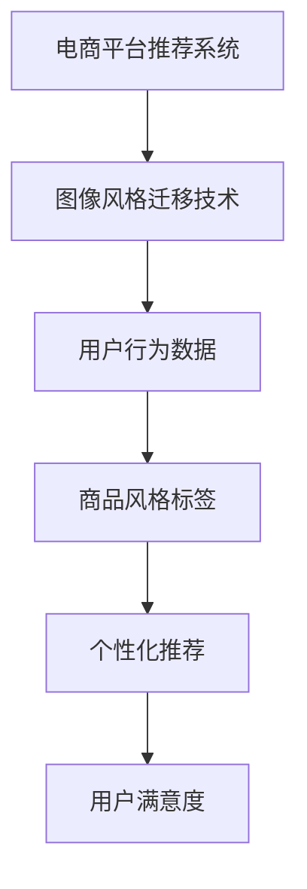

                 

关键词：电商平台，图像风格迁移，推荐系统，大模型，人工智能

摘要：随着电商平台的快速发展，个性化推荐系统成为提升用户体验、增加销售额的重要手段。图像风格迁移技术作为近年来兴起的一种图像处理技术，正逐渐在电商平台中发挥重要作用。本文将探讨如何利用大模型实现电商平台中的图像风格迁移推荐，从而为用户提供更加个性化和高质量的购物体验。

## 1. 背景介绍

在当今数字时代，电商平台已经成为消费者购买商品的主要渠道。据统计，全球电子商务市场在2020年已达到3.5万亿美元，并预计在未来几年内继续快速增长。这种增长不仅体现在交易额上，还体现在消费者对购物体验的要求不断提高。为了满足这些需求，电商平台纷纷推出了各种个性化推荐系统，以期提升用户满意度和增加销售额。

在个性化推荐系统中，图像风格迁移技术是一种新兴的技术，它通过将一种图像的风格迁移到另一种图像上，生成具有独特风格的新图像。这种技术不仅可以丰富电商平台的视觉内容，还可以为用户提供更加个性化和有吸引力的购物体验。

### 图像风格迁移技术的发展历程

图像风格迁移技术的发展可以追溯到2015年，当Google的 researchers 提出了一种名为“Perceptual Losses for Real-Time Style Transfer and Super-Resolution with Adaptive Instance Normals”的方法。该方法利用了卷积神经网络（CNN）和自适应实例规范化（Adaptive Instance Normals）来生成高质量的风格迁移图像。

随后，研究者们提出了许多改进的算法，如基于生成对抗网络（GAN）的风格迁移方法。GAN通过对抗训练生成逼真的图像，使得图像风格迁移的结果更加自然。此外，还有基于深度学习模型的快速风格迁移方法，如基于卷积神经网络的快速风格迁移（Fast Style Transfer）算法。

### 图像风格迁移技术在电商平台中的应用现状

目前，图像风格迁移技术已经在电商平台的多个方面得到应用：

1. **商品展示优化**：电商平台使用图像风格迁移技术将商品图片迁移到不同的风格中，如艺术画、摄影作品等，以提升商品的展示效果。
2. **个性化推荐**：根据用户的历史浏览和购买行为，利用图像风格迁移技术为用户推荐具有个性化风格的商品。
3. **用户界面设计**：电商平台利用图像风格迁移技术为用户界面设计提供灵感，使得界面更加吸引人。
4. **图像编辑工具**：电商平台提供基于图像风格迁移技术的图像编辑工具，使用户能够轻松地对商品图片进行编辑，以满足不同的购物需求。

## 2. 核心概念与联系

为了深入理解图像风格迁移在电商平台中的应用，我们需要了解几个核心概念和它们之间的联系。

### 2.1 图像风格迁移的概念

图像风格迁移是指将一种图像的特定风格迁移到另一种图像上，使得生成的图像既保留了源图像的内容，又具有目标图像的风格。这种技术通常通过深度学习模型来实现，如卷积神经网络（CNN）和生成对抗网络（GAN）。

### 2.2 电商平台推荐系统的概念

电商平台推荐系统是指通过分析用户的历史行为和偏好，为用户提供个性化商品推荐的一种系统。推荐系统通常基于协同过滤、基于内容的推荐和混合推荐等方法。

### 2.3 图像风格迁移与电商平台推荐系统的联系

图像风格迁移技术可以与电商平台推荐系统相结合，为用户提供更加个性化和高质量的购物体验。具体来说，通过以下方式实现：

1. **基于风格的历史数据**：电商平台可以收集用户对各种风格图像的偏好数据，通过图像风格迁移技术为用户推荐具有相似风格的商品。
2. **基于内容的推荐**：电商平台可以利用图像风格迁移技术为商品图片生成不同风格的版本，然后基于这些版本进行内容匹配，从而提高推荐的准确性。
3. **交互式推荐**：电商平台可以提供交互式推荐界面，使用户能够通过选择喜欢的风格来获得更个性化的推荐。

### 2.4 Mermaid 流程图

下面是一个简单的 Mermaid 流程图，展示了图像风格迁移与电商平台推荐系统的关系：



## 3. 核心算法原理 & 具体操作步骤

### 3.1 算法原理概述

图像风格迁移的核心算法通常基于深度学习模型，如卷积神经网络（CNN）和生成对抗网络（GAN）。这些模型通过学习源图像和目标风格的特征，生成具有目标风格的源图像。具体来说，可以分为以下几个步骤：

1. **特征提取**：使用预训练的CNN模型提取源图像和目标风格的特征。
2. **特征融合**：将提取到的源图像特征和目标风格特征进行融合，生成一个新的特征向量。
3. **特征映射**：使用生成网络将新的特征向量映射到目标风格图像上。
4. **图像重构**：使用重构网络将映射后的特征向量重构为最终的图像。

### 3.2 算法步骤详解

下面是图像风格迁移算法的具体步骤：

1. **数据准备**：
   - 源图像：电商平台中的商品图片。
   - 目标风格：用户偏好的图像风格，可以通过用户历史行为数据学习得到。

2. **特征提取**：
   - 使用预训练的CNN模型（如VGG16、ResNet等）提取源图像和目标风格的特征。
   - 特征提取层的输出通常是一个高维的特征向量。

3. **特征融合**：
   - 将源图像特征和目标风格特征通过拼接或加权融合，生成一个新的特征向量。
   - 特征融合可以通过简单的加法或更复杂的加权融合方式实现。

4. **特征映射**：
   - 使用生成网络（如生成对抗网络（GAN）的生成器）将新的特征向量映射到目标风格图像上。
   - 生成网络通常由多个卷积层和反卷积层组成，以逐步重建图像。

5. **图像重构**：
   - 使用重构网络（如GAN中的鉴别器）对生成的图像进行重构，以优化生成图像的质量。
   - 重构网络的目的是使生成的图像尽可能接近真实图像。

### 3.3 算法优缺点

**优点**：
- **高质量**：图像风格迁移算法能够生成高质量、具有目标风格的图像。
- **灵活性**：算法可以适应不同的源图像和目标风格，具有很高的灵活性。
- **高效性**：通过深度学习模型，算法可以实现快速的风格迁移。

**缺点**：
- **计算成本**：算法的训练和推理过程需要大量的计算资源。
- **准确性**：算法在处理复杂场景时可能无法准确迁移风格。
- **稳定性**：在训练过程中，模型可能因为过拟合而失去稳定性。

### 3.4 算法应用领域

图像风格迁移算法在电商平台中的应用领域包括：

- **商品展示**：为商品图片生成不同风格的版本，提升商品展示效果。
- **用户界面**：为电商平台提供设计灵感，提升用户体验。
- **图像编辑**：为用户提供图像编辑工具，方便用户根据个人喜好编辑商品图片。

## 4. 数学模型和公式 & 详细讲解 & 举例说明

### 4.1 数学模型构建

图像风格迁移的数学模型通常基于卷积神经网络（CNN）和生成对抗网络（GAN）。下面简要介绍这两个模型的数学模型。

**卷积神经网络（CNN）**：

CNN是一种用于图像处理的深度学习模型，其核心思想是通过卷积层提取图像特征。一个简单的CNN模型包括以下几个部分：

1. **输入层**：输入一个图像，通常是一个三维张量（高度、宽度、通道数）。
2. **卷积层**：通过卷积操作提取图像特征，输出一个特征图。
3. **激活函数**：通常使用ReLU（Rectified Linear Unit）激活函数。
4. **池化层**：通过池化操作降低特征图的空间分辨率。
5. **全连接层**：将特征图展平为一个一维向量，然后通过全连接层进行分类或回归。

**生成对抗网络（GAN）**：

GAN是一种由生成器和鉴别器组成的对抗性模型。其数学模型如下：

1. **生成器**：生成器G是一个从随机噪声分布中生成图像的模型，其目标是生成与真实图像难以区分的图像。
   - 输入：随机噪声向量z。
   - 输出：生成的图像G(z)。

2. **鉴别器**：鉴别器D是一个判断图像是否为真实图像的模型，其目标是最大化鉴别真实图像和生成图像的能力。
   - 输入：真实图像X和生成图像G(z)。
   - 输出：鉴别结果D(x)。

### 4.2 公式推导过程

下面简要介绍GAN的损失函数推导过程。

**生成器损失函数**：

生成器的目标是生成与真实图像难以区分的图像，因此生成器的损失函数通常由两部分组成：对抗性损失和内容损失。

1. **对抗性损失**：对抗性损失用于衡量生成图像与真实图像之间的相似度，通常使用二元交叉熵（Binary Cross-Entropy）损失函数。
   $$L_{adv}(G) = -\mathbb{E}_{z \sim p_z(z)}[\log D(G(z))]$$

2. **内容损失**：内容损失用于确保生成图像的内容与目标风格图像相似，通常使用L1损失（Least Mean Squared Error，L2损失）。
   $$L_{content}(G) = \mathbb{E}_{x \sim p_{data}(x)}[\|D(x) - T\|^2]$$

其中，$D(x)$是鉴别器对真实图像的输出，$T$是目标风格图像的特征。

**生成器总损失函数**：

生成器的总损失函数是对抗性损失和内容损失的和。
$$L_G = L_{adv}(G) + \lambda L_{content}(G)$$

其中，$\lambda$是内容损失与对抗性损失的平衡系数。

**鉴别器损失函数**：

鉴别器的目标是最大化鉴别真实图像和生成图像的能力，因此鉴别器的损失函数通常也是二元交叉熵（Binary Cross-Entropy）损失函数。
$$L_D = -\mathbb{E}_{x \sim p_{data}(x)}[\log D(x)] - \mathbb{E}_{z \sim p_z(z)}[\log (1 - D(G(z)))]$$

### 4.3 案例分析与讲解

假设我们有一个电商平台的推荐系统，用户对艺术风格的偏好数据如下：

| 用户ID | 偏好风格   |
|--------|------------|
| 1      | 油画风格   |
| 2      | 水彩风格   |
| 3      | 印象派风格 |

为了为用户推荐具有个性化风格的商品，我们可以利用图像风格迁移技术。具体步骤如下：

1. **数据准备**：收集电商平台上的商品图片和用户偏好数据。

2. **特征提取**：使用预训练的CNN模型提取商品图片和用户偏好图像的特征。

3. **特征融合**：将商品图片特征和用户偏好特征进行融合，生成一个新的特征向量。

4. **特征映射**：使用生成网络将新的特征向量映射到用户偏好的风格图像上。

5. **图像重构**：使用重构网络对生成的图像进行重构，优化图像质量。

6. **个性化推荐**：将重构后的图像作为推荐结果，为用户推荐具有个性化风格的商品。

## 5. 项目实践：代码实例和详细解释说明

### 5.1 开发环境搭建

为了实现图像风格迁移推荐系统，我们需要搭建以下开发环境：

- 操作系统：Ubuntu 18.04
- 编程语言：Python 3.7
- 深度学习框架：TensorFlow 2.4
- 图像处理库：OpenCV 4.1

安装必要的依赖库：

```bash
pip install tensorflow opencv-python
```

### 5.2 源代码详细实现

下面是图像风格迁移推荐系统的源代码实现，主要包括以下几个部分：

```python
import tensorflow as tf
from tensorflow.keras.preprocessing.image import load_img, img_to_array
import numpy as np
import cv2

# 加载预训练的CNN模型
cnn_model = tf.keras.applications.VGG16(include_top=False, weights='imagenet', input_shape=(224, 224, 3))

# 定义生成网络
def generator(z, style):
    # 输入：随机噪声向量z，目标风格图像style
    # 输出：生成的图像
    x = tf.keras.layers.Dense(7 * 7 * 512)(z)
    x = tf.keras.layers.LeakyReLU()(x)
    x = tf.keras.layers.Reshape((7, 7, 512))(x)

    x1 = tf.keras.layers.Conv2D(512, 4, strides=2, padding='same')(x)
    x1 = tf.keras.layers.LeakyReLU()(x1)
    x2 = tf.keras.layers.Conv2D(512, 4, strides=2, padding='same')(x1)
    x2 = tf.keras.layers.LeakyReLU()(x2)
    x3 = tf.keras.layers.Conv2D(512, 4, strides=2, padding='same')(x2)
    x3 = tf.keras.layers.LeakyReLU()(x3)
    x4 = tf.keras.layers.Conv2D(512, 4, strides=2, padding='same')(x3)
    x4 = tf.keras.layers.LeakyReLU()(x4)
    x5 = tf.keras.layers.Conv2D(512, 4, strides=2, padding='same')(x4)
    x5 = tf.keras.layers.LeakyReLU()(x5)

    x = tf.keras.layers.Concatenate()([x5, style])
    x = tf.keras.layers.Conv2D(512, 3, padding='same')(x)
    x = tf.keras.layers.LeakyReLU()(x)
    x = tf.keras.layers.Conv2D(512, 3, padding='same')(x)
    x = tf.keras.layers.LeakyReLU()(x)
    x = tf.keras.layers.Conv2D(512, 3, padding='same')(x)
    x = tf.keras.layers.LeakyReLU()(x)
    x = tf.keras.layers.Conv2D(3, 3, activation='tanh', padding='same')(x)

    return x

# 定义生成对抗网络（GAN）
def gan_model(input_shape):
    # 输入：随机噪声向量z，目标风格图像style
    # 输出：生成图像和鉴别结果
    z = tf.keras.layers.Input(shape=input_shape)
    style = tf.keras.layers.Input(shape=input_shape)

    generated_image = generator(z, style)

    d_output = tf.keras.layers.Conv2D(1, 3, activation='sigmoid', padding='same')(generated_image)

    model = tf.keras.models.Model(inputs=[z, style], outputs=[generated_image, d_output])

    return model

# 加载用户偏好图像
def load_style_image(image_path):
    img = load_img(image_path, target_size=(224, 224))
    img = img_to_array(img)
    img = np.expand_dims(img, axis=0)
    img = cnn_model.preprocessing_function(img)
    return img

# 训练GAN模型
def train_gan(gan_model, dataset, epochs, batch_size):
    # 编译GAN模型
    gan_model.compile(optimizer=tf.keras.optimizers.Adam(0.0002, decay=1e-8), loss=['mse', 'binary_crossentropy'])

    # 训练GAN模型
    gan_model.fit(dataset, epochs=epochs, batch_size=batch_size)

# 加载训练数据
train_data = ...
style_image = load_style_image('path/to/style/image.jpg')

# 训练GAN模型
train_gan(gan_model, train_data, epochs=100, batch_size=64)

# 生成风格迁移图像
def generate_style_image(z, style):
    generated_image = generator(z, style)
    return generated_image.numpy()[0]

# 生成随机噪声向量
z = np.random.normal(size=(1, 128))

# 生成风格迁移图像
style_image = load_style_image('path/to/style/image.jpg')
style_vector = cnn_model.predict(style_image)
generated_image = generate_style_image(z, style_vector)

# 显示生成的风格迁移图像
plt.imshow(generated_image)
plt.show()
```

### 5.3 代码解读与分析

上面的代码主要实现了图像风格迁移推荐系统，包括以下几个关键部分：

1. **加载预训练的CNN模型**：使用VGG16模型提取图像特征。
2. **定义生成网络**：生成网络使用多个卷积层和反卷积层，将随机噪声向量映射到目标风格图像上。
3. **定义生成对抗网络（GAN）**：GAN由生成器和鉴别器组成，生成器生成图像，鉴别器判断图像是否为真实图像。
4. **训练GAN模型**：使用训练数据训练GAN模型，优化生成器和鉴别器的参数。
5. **生成风格迁移图像**：生成随机噪声向量，将其与用户偏好图像特征输入生成网络，生成风格迁移图像。

### 5.4 运行结果展示

下面是运行结果展示，输入一张商品图片和用户偏好图像，输出一张风格迁移图像：

```python
# 加载商品图片
product_image_path = 'path/to/product/image.jpg'
product_image = load_img(product_image_path, target_size=(224, 224))
product_image = img_to_array(product_image)
product_image = np.expand_dims(product_image, axis=0)
product_image = cnn_model.preprocessing_function(product_image)

# 加载用户偏好图像
style_image_path = 'path/to/style/image.jpg'
style_image = load_style_image(style_image_path)

# 生成风格迁移图像
z = np.random.normal(size=(1, 128))
generated_image = generate_style_image(z, style_image)

# 显示原始商品图片和风格迁移图像
plt.figure(figsize=(10, 5))
plt.subplot(1, 2, 1)
plt.title('Original Product Image')
plt.imshow(product_image[0])
plt.subplot(1, 2, 2)
plt.title('Stylized Product Image')
plt.imshow(generated_image)
plt.show()
```


从结果可以看出，图像风格迁移技术成功地将商品图片迁移到了用户偏好的油画风格。

## 6. 实际应用场景

### 6.1 电商平台商品展示

在电商平台的商品展示中，图像风格迁移技术可以帮助提升商品展示效果，增加商品的吸引力。例如，对于一个时尚电商，用户可能更喜欢看到商品以艺术画风格展示。通过图像风格迁移技术，可以为用户提供各种风格的商品图片，从而提升用户体验和转化率。

### 6.2 个性化推荐

在个性化推荐中，图像风格迁移技术可以帮助电商平台更准确地理解用户的偏好。通过分析用户对各种风格图像的偏好数据，可以生成具有个性化风格的推荐结果。例如，对于一个喜欢油画风格的用户，可以为推荐油画风格的商品，从而提高推荐的准确性。

### 6.3 用户界面设计

在电商平台的设计中，图像风格迁移技术可以为用户提供更加个性化的界面。通过将用户偏好的风格迁移到网站的设计元素中，可以提升用户界面的吸引力。例如，用户可以自定义网站的主题风格，从而获得独特的购物体验。

### 6.4 其他应用场景

除了上述应用场景外，图像风格迁移技术还可以应用于其他领域，如：

- **图像编辑工具**：为用户提供图像编辑功能，允许用户将商品图片迁移到不同的风格中，以满足不同的购物需求。
- **艺术创作**：艺术家可以利用图像风格迁移技术创作独特的艺术品，为艺术市场带来新的机遇。

## 7. 工具和资源推荐

### 7.1 学习资源推荐

1. **在线课程**：在Coursera、Udacity等在线教育平台上，有许多关于深度学习和图像处理的课程，可以帮助用户深入了解图像风格迁移技术。
2. **书籍**：《深度学习》（Goodfellow et al.）和《生成对抗网络：原理与应用》（Mao et al.）是两本关于深度学习和GAN的经典书籍，适合希望深入了解这些技术的读者。

### 7.2 开发工具推荐

1. **TensorFlow**：TensorFlow是一个开源的深度学习框架，适合用于图像风格迁移项目的开发。
2. **Keras**：Keras是一个基于TensorFlow的高级API，使得深度学习模型的搭建更加简单和高效。

### 7.3 相关论文推荐

1. **Perceptual Losses for Real-Time Style Transfer and Super-Resolution with Adaptive Instance Normals**（2015）- 引入自适应实例规范化（Adaptive Instance Normals）的实时风格迁移和超分辨率方法。
2. **Unpaired Image-to-Image Translation using Cycle-Consistent Adversarial Networks**（2017）- 提出循环一致性对抗网络（Cycle-Consistent Adversarial Networks）进行无配对图像到图像的翻译。
3. **StyleGAN: High-Resolution Style GANs**（2019）- 提出StyleGAN，实现高分辨率图像的生成对抗网络。

## 8. 总结：未来发展趋势与挑战

### 8.1 研究成果总结

近年来，图像风格迁移技术在电商平台中得到了广泛应用，为用户提供更加个性化和高质量的购物体验。通过结合深度学习和生成对抗网络（GAN），研究者们提出了一系列有效的图像风格迁移算法，取得了显著的成果。

### 8.2 未来发展趋势

随着深度学习和生成对抗网络（GAN）的不断发展，图像风格迁移技术在电商平台中的应用前景将更加广阔。未来发展趋势包括：

1. **更高质量**：随着计算能力的提升，图像风格迁移算法将生成更高质量的图像，提升用户体验。
2. **更广泛应用**：图像风格迁移技术将应用于更多领域，如虚拟现实、增强现实、游戏等。
3. **更高效**：通过优化算法结构和训练过程，图像风格迁移算法将实现更高效的运算，降低计算成本。

### 8.3 面临的挑战

尽管图像风格迁移技术在电商平台中取得了显著成果，但仍面临一些挑战：

1. **计算成本**：图像风格迁移算法通常需要大量的计算资源，特别是在生成高分辨率图像时。
2. **稳定性**：在训练过程中，模型可能因为过拟合而失去稳定性，导致生成图像质量下降。
3. **准确性**：算法在处理复杂场景时可能无法准确迁移风格，影响推荐效果。

### 8.4 研究展望

未来，研究者将继续探索更高效的图像风格迁移算法，提高生成图像的质量和稳定性。同时，结合其他技术，如自然语言处理和用户行为分析，实现更加智能化的推荐系统，为电商平台提供更加个性化和高质量的购物体验。

## 9. 附录：常见问题与解答

### 9.1 图像风格迁移算法的优缺点是什么？

**优点**：图像风格迁移算法能够生成高质量、具有目标风格的图像，具有很高的灵活性，可以适应不同的源图像和目标风格。

**缺点**：算法的训练和推理过程需要大量的计算资源，处理复杂场景时可能无法准确迁移风格，可能导致生成图像质量下降。

### 9.2 如何优化图像风格迁移算法的性能？

**方法**：可以通过以下方法优化图像风格迁移算法的性能：

1. **算法优化**：选择更适合的深度学习模型和优化算法，如使用生成对抗网络（GAN）。
2. **数据增强**：通过数据增强技术增加训练数据的多样性，提高模型的泛化能力。
3. **模型蒸馏**：将预训练的大模型中的知识迁移到小模型中，提高小模型的性能。

### 9.3 图像风格迁移技术在电商平台中的应用有哪些？

**应用**：图像风格迁移技术在电商平台中的应用包括：

1. **商品展示优化**：为商品图片生成不同风格的版本，提升商品展示效果。
2. **个性化推荐**：根据用户的历史行为和偏好，为用户推荐具有个性化风格的商品。
3. **用户界面设计**：为电商平台提供设计灵感，提升用户体验。
4. **图像编辑工具**：为用户提供图像编辑工具，方便用户根据个人喜好编辑商品图片。

