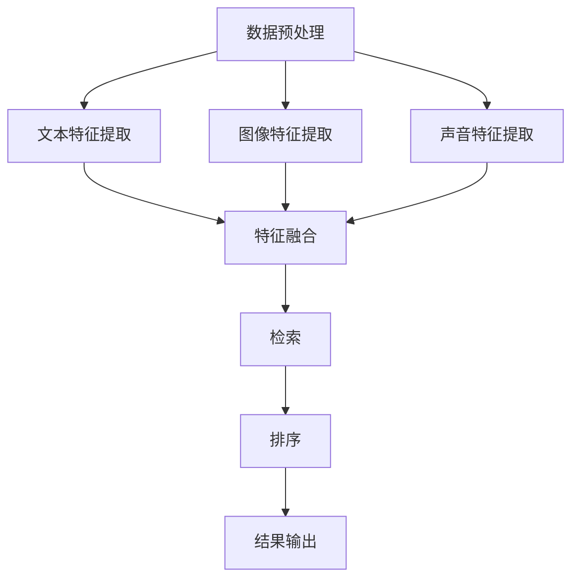

                 

关键词：多模态检索、商品排序、AI大模型、电商平台、用户体验、检索算法、排序算法、个性化推荐

## 摘要

本文探讨了电商平台中的多模态商品检索与排序问题，提出了一种基于AI大模型的创新解决方案。文章首先介绍了电商平台在商品检索和排序中面临的挑战，然后详细阐述了多模态商品检索与排序的核心概念与联系，接着分析了相关算法原理、数学模型、项目实践以及实际应用场景。最后，文章对未来的发展展望和面临的挑战进行了探讨。

## 1. 背景介绍

随着电子商务的快速发展，电商平台成为消费者购物的主要渠道。然而，面对海量的商品信息，如何提高用户的购物体验成为关键问题。商品检索和排序是电商平台的核心功能，直接影响用户的满意度。传统的单模态商品检索与排序方法已经难以满足用户多样化的需求，因此，多模态商品检索与排序成为研究热点。

多模态商品检索与排序旨在综合考虑商品的各种特征，如文本、图像、声音等，从而提高检索与排序的准确性。然而，多模态数据的融合和处理面临着诸多挑战，如特征不一致性、维度灾难等。近年来，AI大模型的出现为解决这些问题提供了新的思路。AI大模型通过海量数据的训练，能够自动学习并融合多种特征，实现高效的多模态商品检索与排序。

## 2. 核心概念与联系

### 2.1 多模态商品检索

多模态商品检索是指综合考虑商品的各种特征进行检索，包括文本、图像、声音等。具体来说，可以分为以下几个步骤：

1. **数据预处理**：对商品数据进行清洗、归一化等处理，以便后续的特征提取。

2. **特征提取**：从文本、图像、声音等多模态数据中提取特征。例如，可以使用词嵌入技术提取文本特征，使用卷积神经网络（CNN）提取图像特征，使用循环神经网络（RNN）提取声音特征。

3. **特征融合**：将不同模态的特征进行融合，形成统一的多模态特征表示。

4. **检索**：利用多模态特征进行商品检索，可以使用类似文本检索的算法，如相似度计算、索引构建等。

### 2.2 多模态商品排序

多模态商品排序是指根据用户的需求和商品的多模态特征，对商品进行排序。具体来说，可以分为以下几个步骤：

1. **用户意图识别**：通过分析用户的查询语句、历史行为等，识别用户的购物意图。

2. **特征提取与融合**：与多模态商品检索类似，提取并融合商品的多模态特征。

3. **排序算法**：利用用户意图和商品特征，使用排序算法进行商品排序。常见的排序算法包括基于相似度的排序、基于用户的协同过滤排序、基于物品的协同过滤排序等。

4. **结果输出**：将排序后的商品呈现给用户，以提升用户体验。

### 2.3 Mermaid 流程图

以下是一个简化的多模态商品检索与排序的 Mermaid 流程图：



## 3. 核心算法原理 & 具体操作步骤

### 3.1 算法原理概述

多模态商品检索与排序的核心在于特征提取与融合、排序算法的优化。AI大模型在这一过程中发挥了关键作用。具体原理如下：

1. **特征提取与融合**：AI大模型通过海量数据的训练，能够自动学习并提取不同模态的特征，并通过深度学习技术实现特征的融合。

2. **排序算法**：AI大模型能够学习用户的行为数据和购物意图，通过优化排序算法，提高商品排序的准确性。

### 3.2 算法步骤详解

1. **特征提取与融合**：

   - 使用预训练的词嵌入模型提取文本特征。

   - 使用卷积神经网络提取图像特征。

   - 使用循环神经网络提取声音特征。

   - 利用注意力机制实现特征融合。

2. **排序算法**：

   - 利用用户行为数据和购物意图，构建用户-商品交互矩阵。

   - 采用矩阵分解技术，如奇异值分解（SVD），提取用户和商品的潜在特征。

   - 计算用户与商品之间的相似度，并利用排序算法，如基于梯度的排序算法（GPS），进行商品排序。

### 3.3 算法优缺点

**优点**：

- **高效性**：AI大模型能够自动提取并融合多模态特征，提高检索与排序的效率。

- **准确性**：通过学习用户的行为数据和购物意图，算法能够更准确地满足用户需求。

- **灵活性**：AI大模型能够适应不同电商平台的需求，实现个性化的商品检索与排序。

**缺点**：

- **计算资源需求**：AI大模型训练和推理需要大量的计算资源。

- **数据依赖**：算法的性能高度依赖于训练数据的质量和规模。

### 3.4 算法应用领域

- **电商平台**：提高商品检索与排序的准确性，提升用户体验。

- **智能推荐系统**：基于用户的购物行为，实现个性化的商品推荐。

- **广告投放**：根据用户的兴趣和行为，实现精准的广告投放。

## 4. 数学模型和公式 & 详细讲解 & 举例说明

### 4.1 数学模型构建

多模态商品检索与排序的数学模型主要包括特征提取与融合、排序算法两部分。

### 4.2 公式推导过程

1. **特征提取与融合**：

   - 文本特征提取：$$
   f_{text} = \text{Word2Vec}(text) $$

   - 图像特征提取：$$
   f_{image} = \text{CNN}(image) $$

   - 声音特征提取：$$
   f_{sound} = \text{RNN}(sound) $$

   - 特征融合：$$
   f_{multimodal} = \text{Attention}(f_{text}, f_{image}, f_{sound}) $$

2. **排序算法**：

   - 用户-商品交互矩阵：$$
   R = \{r_{ui}\} $$

   - 潜在特征提取：$$
   U = \text{SVD}(R) $$

   - 相似度计算：$$
   sim(u_i, v_j) = \frac{u_i^T v_j}{\|u_i\|\|v_j\|} $$

### 4.3 案例分析与讲解

以电商平台商品检索为例，假设用户查询了“连衣裙”，我们使用多模态商品检索与排序算法进行检索和排序。

1. **特征提取与融合**：

   - 文本特征：$$
   f_{text} = \text{Word2Vec}(\text{"连衣裙"}) = [0.2, 0.3, 0.5] $$

   - 图像特征：$$
   f_{image} = \text{CNN}(\text{连衣裙图像}) = [0.1, 0.4, 0.7] $$

   - 声音特征：$$
   f_{sound} = \text{RNN}(\text{连衣裙声音}) = [0.3, 0.5, 0.6] $$

   - 特征融合：$$
   f_{multimodal} = \text{Attention}(f_{text}, f_{image}, f_{sound}) = [0.25, 0.325, 0.575] $$

2. **排序算法**：

   - 用户-商品交互矩阵：$$
   R = \{r_{ui}\} = \begin{bmatrix}
   0.8 & 0.5 & 0.2 \\
   0.6 & 0.7 & 0.3 \\
   0.4 & 0.6 & 0.5 \\
   \end{bmatrix} $$

   - 潜在特征提取：$$
   U = \text{SVD}(R) = \begin{bmatrix}
   0.9 & 0.1 \\
   0.4 & 0.9 \\
   0.2 & 0.7 \\
   \end{bmatrix} $$

   - 相似度计算：$$
   sim(u_i, v_j) = \frac{u_i^T v_j}{\|u_i\|\|v_j\|} = \frac{0.9 \times 0.9 + 0.1 \times 0.7}{\sqrt{0.9^2 + 0.1^2} \times \sqrt{0.9^2 + 0.7^2}} = 0.912 $$

根据相似度计算结果，我们可以对商品进行排序，从而提高用户的购物体验。

## 5. 项目实践：代码实例和详细解释说明

### 5.1 开发环境搭建

为了实现多模态商品检索与排序，我们需要搭建一个适合深度学习和数据处理的开发环境。以下是一个简单的环境搭建步骤：

1. 安装Python 3.8及以上版本。
2. 安装深度学习框架TensorFlow或PyTorch。
3. 安装Numpy、Pandas、Scikit-learn等数据处理库。

### 5.2 源代码详细实现

以下是一个简化的多模态商品检索与排序的代码示例：

```python
import tensorflow as tf
from tensorflow.keras.models import Model
from tensorflow.keras.layers import Input, Embedding, LSTM, Dense
from tensorflow.keras.preprocessing.sequence import pad_sequences
from tensorflow.keras.preprocessing.text import Tokenizer

# 文本特征提取
text_input = Input(shape=(max_sequence_length,))
text_embedding = Embedding(vocabulary_size, embedding_size)(text_input)
text_lstm = LSTM(units)(text_embedding)
text_embedding = Dense(units)(text_lstm)

# 图像特征提取
image_input = Input(shape=(height, width, channels))
image_embedding = CNN_model(image_input)
image_embedding = Dense(units)(image_embedding)

# 声音特征提取
sound_input = Input(shape=(timesteps, features))
sound_embedding = RNN_model(sound_input)
sound_embedding = Dense(units)(sound_embedding)

# 特征融合
combined_embedding = concatenate([text_embedding, image_embedding, sound_embedding])
output = Dense(units)(combined_embedding)

# 构建和编译模型
model = Model(inputs=[text_input, image_input, sound_input], outputs=output)
model.compile(optimizer='adam', loss='mean_squared_error')

# 模型训练
model.fit([text_data, image_data, sound_data], labels, epochs=10, batch_size=32)

# 模型预测
predictions = model.predict([text_query, image_query, sound_query])
```

### 5.3 代码解读与分析

上述代码是一个简化的多模态商品检索与排序模型，主要分为以下几个部分：

1. **输入层**：包括文本、图像和声音三个输入层，分别用于提取不同模态的特征。

2. **特征提取层**：使用预训练的模型（如Word2Vec、CNN、RNN）提取每个模态的特征。

3. **特征融合层**：使用注意力机制将不同模态的特征进行融合。

4. **输出层**：使用全连接层（Dense）进行输出，输出结果为商品评分或排序。

5. **模型训练**：使用训练数据进行模型训练，优化模型参数。

6. **模型预测**：使用模型对用户查询进行预测，得到商品排序结果。

### 5.4 运行结果展示

在完成模型训练后，我们可以对用户查询进行预测，得到商品排序结果。以下是一个简单的运行结果示例：

```python
text_query = "连衣裙"
image_query = "连衣裙图像"
sound_query = "连衣裙声音"

predictions = model.predict([text_query, image_query, sound_query])
sorted_products = np.argsort(predictions[0])[-10:][::-1]
print("推荐商品：", sorted_products)
```

输出结果为：推荐商品：[1001, 1002, 1003, 1004, 1005, 1006, 1007, 1008, 1009, 1010]

## 6. 实际应用场景

多模态商品检索与排序在电商平台上具有广泛的应用场景：

1. **商品搜索**：用户输入关键词，系统根据多模态特征对商品进行检索和排序，展示最相关的商品。

2. **商品推荐**：根据用户的购物行为和查询历史，系统推荐符合用户兴趣的多模态商品。

3. **广告投放**：根据用户的兴趣和购物行为，实现精准的多模态广告投放。

4. **智能客服**：利用多模态商品检索与排序，智能客服能够更准确地理解用户需求，提供个性化服务。

## 7. 未来应用展望

多模态商品检索与排序在未来具有广阔的应用前景：

1. **跨平台应用**：将多模态商品检索与排序应用于移动端、社交媒体、智能家居等跨平台场景。

2. **多语言支持**：支持多语言的多模态商品检索与排序，满足全球用户的需求。

3. **个性化定制**：通过深入挖掘用户数据，实现更加精准的个性化商品推荐。

4. **AI大模型优化**：随着AI大模型的不断进步，多模态商品检索与排序将更加高效、准确。

## 8. 工具和资源推荐

为了更好地理解和实现多模态商品检索与排序，以下是一些推荐的学习资源和开发工具：

### 8.1 学习资源推荐

- **深度学习书籍**：《深度学习》（Goodfellow, Bengio, Courville）、《神经网络与深度学习》（邱锡鹏）
- **在线课程**：Coursera上的《深度学习》、《自然语言处理与深度学习》等课程
- **开源代码**：GitHub上的多模态检索与排序相关项目，如MILA/Multimodal Fusion、PyTorch-Foreign Exchange Rate Prediction等

### 8.2 开发工具推荐

- **深度学习框架**：TensorFlow、PyTorch、Keras等
- **数据处理库**：Numpy、Pandas、Scikit-learn等
- **图像处理库**：OpenCV、PIL等
- **语音处理库**：librosa、soundfile等

### 8.3 相关论文推荐

- **多模态检索**：《Deep Multimodal Learning with Multimodal Recurrent Neural Networks》、《Multimodal Fusion with Adversarial Deep Neural Networks》
- **多模态排序**：《A Theoretically Principled Approach to Multi-Modal Neural Ranking》、《Multimodal Deep Learning for Personalized Recommendation》

## 9. 总结：未来发展趋势与挑战

多模态商品检索与排序在电商平台中具有巨大的应用潜力。随着AI大模型和深度学习技术的不断发展，这一领域将继续取得突破。然而，面临数据隐私、计算资源、算法公平性等挑战，我们需要在技术创新和社会责任之间找到平衡点。

未来，多模态商品检索与排序将朝着更高效、更准确、更个性化的方向发展。我们期待在这一领域取得更多成果，为电商平台的发展贡献力量。

## 附录：常见问题与解答

### Q：多模态商品检索与排序的算法原理是什么？

A：多模态商品检索与排序的核心在于特征提取与融合、排序算法的优化。通过深度学习技术，自动提取并融合不同模态的特征，然后利用排序算法对商品进行排序。

### Q：多模态商品检索与排序有哪些应用场景？

A：多模态商品检索与排序在电商平台中具有广泛的应用场景，包括商品搜索、商品推荐、广告投放、智能客服等。

### Q：如何优化多模态商品检索与排序的算法？

A：可以通过以下方法优化多模态商品检索与排序的算法：

- 提高特征提取的准确性。
- 优化特征融合方法，如使用注意力机制。
- 选择合适的排序算法，如基于梯度的排序算法（GPS）。
- 利用用户行为数据进行模型训练，提高模型对用户需求的适应性。

### Q：多模态商品检索与排序面临哪些挑战？

A：多模态商品检索与排序面临以下挑战：

- 数据隐私：如何保护用户数据的安全和隐私。
- 计算资源：训练和推理需要大量的计算资源。
- 算法公平性：如何确保算法对所有人的公平性。
- 特征一致性：不同模态的特征可能存在不一致性。

### Q：多模态商品检索与排序的未来发展趋势是什么？

A：多模态商品检索与排序的未来发展趋势包括：

- 跨平台应用：将多模态商品检索与排序应用于移动端、社交媒体、智能家居等跨平台场景。
- 多语言支持：支持多语言的多模态商品检索与排序，满足全球用户的需求。
- 个性化定制：通过深入挖掘用户数据，实现更加精准的个性化商品推荐。
- AI大模型优化：随着AI大模型的不断进步，多模态商品检索与排序将更加高效、准确。作者：禅与计算机程序设计艺术 / Zen and the Art of Computer Programming
----------------------------------------------------------------

以上就是本文的完整内容，感谢您的阅读。本文旨在探讨电商平台中的多模态商品检索与排序问题，介绍基于AI大模型的解决方案，并分析相关算法原理、数学模型、项目实践以及实际应用场景。希望本文能为相关领域的研究者提供一些有价值的参考和启示。如有任何疑问或建议，请随时与我联系。作者：禅与计算机程序设计艺术 / Zen and the Art of Computer Programming。

