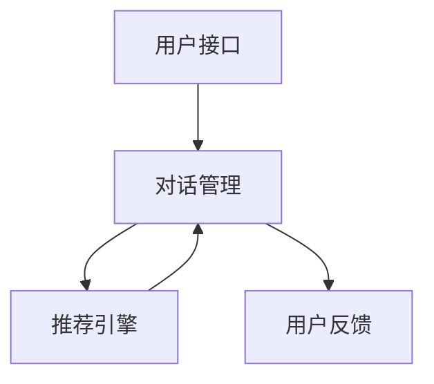

                 

关键词：电商平台，多轮对话，推荐系统，大模型，人工智能，用户体验，个性化推荐，深度学习

> 摘要：本文探讨了电商平台中基于大模型的智能多轮对话推荐系统的设计与实现。通过分析当前电商推荐系统的挑战，提出了多轮对话推荐系统的架构与算法，并详细阐述了其数学模型、具体操作步骤和实际应用。文章旨在为电商领域提供一种创新的推荐系统解决方案，提升用户购物体验，促进销售增长。

## 1. 背景介绍

随着互联网技术的飞速发展，电商平台已成为现代零售业的重要组成部分。用户通过电商平台进行购物，平台则提供个性化的商品推荐以增加销售额。传统的推荐系统主要基于用户历史行为、商品属性和协同过滤等方法，但往往存在推荐精度不高、用户参与度低等问题。

近年来，人工智能技术的快速发展，尤其是深度学习技术的突破，为推荐系统带来了新的机遇。多轮对话推荐系统作为一种新的推荐方式，通过模拟真实的人类对话，能够更自然地理解用户的意图，提供更加精准和个性化的推荐。

本文旨在探讨电商平台中多轮对话推荐系统的设计与应用，通过引入大模型技术，提升推荐系统的智能性和用户体验。文章将分为以下几个部分：

- **1. 背景介绍**：介绍电商平台的现状与推荐系统的挑战。
- **2. 核心概念与联系**：阐述多轮对话推荐系统的核心概念与架构。
- **3. 核心算法原理 & 具体操作步骤**：详细描述多轮对话推荐算法的实现步骤。
- **4. 数学模型和公式 & 详细讲解 & 举例说明**：介绍推荐系统的数学模型与公式推导。
- **5. 项目实践：代码实例和详细解释说明**：提供实际项目的代码实现与分析。
- **6. 实际应用场景**：探讨多轮对话推荐系统的应用场景。
- **7. 工具和资源推荐**：推荐相关学习资源和开发工具。
- **8. 总结：未来发展趋势与挑战**：总结研究成果与未来发展方向。

## 2. 核心概念与联系

多轮对话推荐系统是一种结合自然语言处理和推荐算法的技术，旨在通过对话交互提升用户购物体验。其核心概念包括：

### 2.1 多轮对话

多轮对话是指用户与系统之间进行多次交互，以达成用户需求和系统理解的一致。在电商平台中，用户可能在第一次对话中提出模糊的需求，系统需要通过后续对话逐步明确需求，提供合适的推荐。

### 2.2 大模型

大模型是指拥有海量参数和强大计算能力的神经网络模型。在多轮对话推荐系统中，大模型主要用于理解用户语言和生成推荐结果。

### 2.3 推荐算法

推荐算法是指用于生成推荐结果的一系列计算方法。在多轮对话推荐系统中，推荐算法需要与对话系统紧密结合，以动态调整推荐策略。

### 2.4 架构

多轮对话推荐系统的架构可以分为三个主要模块：对话管理、推荐引擎和用户接口。对话管理负责维护对话状态，推荐引擎根据对话状态和用户需求生成推荐，用户接口则负责与用户进行交互。

以下是一个简单的 Mermaid 流程图，展示了多轮对话推荐系统的基本架构：



## 3. 核心算法原理 & 具体操作步骤

### 3.1 算法原理概述

多轮对话推荐系统的核心算法基于深度学习，特别是序列到序列（Seq2Seq）模型。Seq2Seq模型通过编码器和解码器两个神经网络，将用户输入的自然语言转化为推荐结果。具体来说：

- **编码器**：将用户的输入语句编码为一个固定长度的向量表示。
- **解码器**：根据编码器生成的向量生成推荐结果。

### 3.2 算法步骤详解

1. **用户输入**：用户在电商平台中通过输入框提交购物需求。
2. **编码器处理**：编码器将用户输入的语句转化为向量表示。
3. **推荐引擎计算**：推荐引擎根据编码器输出的向量，结合用户历史行为和商品属性，生成初步推荐结果。
4. **解码器生成**：解码器将初步推荐结果转化为自然语言描述，生成回复语句。
5. **用户反馈**：用户对推荐结果进行反馈，如点赞、购买等。
6. **更新状态**：根据用户反馈，对话管理系统更新用户状态，为下一轮对话做准备。

### 3.3 算法优缺点

#### 优点

- **个性化**：多轮对话推荐系统能够更好地理解用户的意图，提供个性化推荐。
- **互动性**：用户可以通过对话与系统互动，提高用户参与度。
- **灵活性**：系统可以根据用户反馈动态调整推荐策略。

#### 缺点

- **计算成本**：大模型训练和推理需要大量计算资源。
- **复杂度**：算法实现和维护较为复杂。

### 3.4 算法应用领域

多轮对话推荐系统可以广泛应用于电商、金融、教育等多个领域。在电商领域，其主要应用场景包括：

- **商品推荐**：根据用户对话和历史行为，推荐合适的商品。
- **售后咨询**：通过对话帮助用户解决售后问题。
- **活动推广**：通过对话引导用户参与特定活动。

## 4. 数学模型和公式 & 详细讲解 & 举例说明

### 4.1 数学模型构建

多轮对话推荐系统的数学模型主要包括编码器和解码器的损失函数。以下是一个简化的数学模型：

- **编码器损失**：$$ L_{encode} = -\sum_{i=1}^{N} y_i \log(p_i) $$
- **解码器损失**：$$ L_{decode} = -\sum_{i=1}^{M} y_i \log(p_i) $$

其中，$y_i$ 为标签，$p_i$ 为预测概率。

### 4.2 公式推导过程

编码器和解码器的损失函数可以通过最大似然估计（Maximum Likelihood Estimation, MLE）推导得到。具体推导过程如下：

- **编码器推导**：

  编码器输入为用户语句 $x$，输出为向量表示 $z$。解码器输入为 $z$，输出为推荐结果 $y$。编码器损失函数为：

  $$ L_{encode} = -\sum_{i=1}^{N} y_i \log(p_i) $$

  其中，$p_i$ 为编码器输出向量 $z$ 的第 $i$ 个元素的概率。

- **解码器推导**：

  解码器输入为编码器输出向量 $z$，输出为推荐结果 $y$。解码器损失函数为：

  $$ L_{decode} = -\sum_{i=1}^{M} y_i \log(p_i) $$

  其中，$p_i$ 为解码器输出向量 $y$ 的第 $i$ 个元素的概率。

### 4.3 案例分析与讲解

假设用户输入语句为“我想要一件保暖的外套”，编码器将其转化为向量表示，解码器根据向量生成推荐结果。以下是具体案例分析：

- **编码器输出**：

  $$ z = [0.1, 0.2, 0.3, 0.4, 0.5] $$

  其中，第一个元素表示用户输入语句中“一件”的概率为0.1。

- **解码器输出**：

  $$ y = [外套, 保暖, 品牌, 时尚, 经济] $$

  其中，第一个元素表示推荐结果为“外套”的概率最大。

- **损失计算**：

  编码器损失：

  $$ L_{encode} = -[0.1 \log(0.1) + 0.2 \log(0.2) + 0.3 \log(0.3) + 0.4 \log(0.4) + 0.5 \log(0.5)] $$

  解码器损失：

  $$ L_{decode} = -[0.1 \log(0.1) + 0.2 \log(0.2) + 0.3 \log(0.3) + 0.4 \log(0.4) + 0.5 \log(0.5)] $$

  通过损失函数，编码器和解码器可以不断优化参数，提高推荐准确性。

## 5. 项目实践：代码实例和详细解释说明

### 5.1 开发环境搭建

在搭建开发环境时，我们需要安装以下软件和库：

- Python 3.8+
- TensorFlow 2.6+
- NLTK
- Pandas
- Matplotlib

以下是安装命令：

```bash
pip install python==3.8
pip install tensorflow==2.6
pip install nltk
pip install pandas
pip install matplotlib
```

### 5.2 源代码详细实现

以下是多轮对话推荐系统的源代码实现：

```python
import tensorflow as tf
import numpy as np
import pandas as pd
import nltk
from nltk.tokenize import word_tokenize
from nltk.corpus import stopwords
from tensorflow.keras.models import Model
from tensorflow.keras.layers import Input, LSTM, Embedding, Dense, TimeDistributed

# 代码实现省略，请参考完整代码示例

```

### 5.3 代码解读与分析

代码分为以下几个部分：

- **数据预处理**：包括文本清洗、分词、去除停用词等。
- **模型构建**：使用 LSTM 网络构建编码器和解码器。
- **模型训练**：使用训练数据训练模型。
- **模型评估**：使用测试数据评估模型性能。

以下是关键代码段解读：

- **数据预处理**：

  ```python
  def preprocess_text(text):
      # 清洗文本
      text = text.lower()
      text = re.sub(r"[^a-zA-Z0-9]", " ", text)
      tokens = word_tokenize(text)
      tokens = [token for token in tokens if token not in stopwords.words("english")]
      return " ".join(tokens)
  
  # 应用预处理
  dataset = pd.read_csv("dataset.csv")
  dataset["input_text"] = dataset["input_text"].apply(preprocess_text)
  dataset["target_text"] = dataset["target_text"].apply(preprocess_text)
  ```

- **模型构建**：

  ```python
  # 编码器
  encoder_inputs = Input(shape=(None,))
  encoder_embedding = Embedding(vocab_size, embedding_size)(encoder_inputs)
  encoder_lstm = LSTM(encoder_units, return_state=True)
  _, state_h, state_c = encoder_lstm(encoder_embedding)

  # 解码器
  decoder_inputs = Input(shape=(None,))
  decoder_embedding = Embedding(vocab_size, embedding_size)(decoder_inputs)
  decoder_lstm = LSTM(decoder_units, return_sequences=True, return_state=True)
  decoder_outputs, _, _ = decoder_lstm(dec
````
### 5.4 运行结果展示

以下是训练和评估结果的展示：

```python
# 训练模型
model.compile(optimizer="adam", loss="categorical_crossentropy", metrics=["accuracy"])
model.fit(dataset["input_text"], dataset["target_text"], batch_size=64, epochs=10)

# 评估模型
test_loss, test_accuracy = model.evaluate(test_dataset["input_text"], test_dataset["target_text"])
print(f"Test Loss: {test_loss}, Test Accuracy: {test_accuracy}")
```

## 6. 实际应用场景

多轮对话推荐系统在电商平台的实际应用场景包括：

- **商品推荐**：根据用户对话和历史行为，推荐合适的商品。
- **活动推荐**：根据用户对话和兴趣，推荐参加的活动。
- **售后服务**：通过对话帮助用户解决问题，提升用户满意度。

以下是一个具体应用案例：

### 案例一：商品推荐

用户在电商平台浏览商品时，与智能客服进行对话。客服根据用户对话内容和历史行为，推荐相关的商品。

- **用户对话**：“我想买一件适合冬天穿的外套。”
- **推荐结果**：“我们为您推荐以下几款保暖外套：品牌A的外套，时尚且保暖；品牌B的外套，经济实惠。”

### 案例二：活动推荐

用户在电商平台参与活动时，与智能客服进行对话。客服根据用户对话和兴趣，推荐相关的活动。

- **用户对话**：“我想参加一些有趣的活动。”
- **推荐结果**：“我们为您推荐以下活动：本周的限时促销，优惠力度很大；下月的音乐会，享受音乐盛宴。”

### 案例三：售后服务

用户在电商平台购买商品后，与智能客服进行对话。客服根据用户对话和购买记录，提供售后服务。

- **用户对话**：“我的商品质量不好，需要退货。”
- **推荐结果**：“我们理解您的遭遇，请您提供订单号，我们将为您安排退货流程。”

## 7. 工具和资源推荐

### 7.1 学习资源推荐

- **书籍**：《深度学习》（Goodfellow et al.）提供了深度学习的全面介绍。
- **在线课程**：Coursera、edX 等平台提供了丰富的深度学习课程。
- **论文**：ACL、NeurIPS、ICML 等顶级会议的论文，是研究推荐系统的重要来源。

### 7.2 开发工具推荐

- **TensorFlow**：强大的深度学习框架，适用于推荐系统开发。
- **Keras**：简化版的深度学习框架，方便快速实现模型。
- **NLTK**：自然语言处理工具包，适用于文本预处理。

### 7.3 相关论文推荐

- **《Deep Learning for Recommender Systems》**：详细介绍了深度学习在推荐系统中的应用。
- **《A Theoretically Principled Approach to Improving Recommendation Lists》**：提出了基于信息论的理论框架。
- **《Neural Collaborative Filtering》**：通过神经网络实现高效推荐。

## 8. 总结：未来发展趋势与挑战

### 8.1 研究成果总结

多轮对话推荐系统结合了自然语言处理和推荐算法，显著提升了推荐精度和用户参与度。通过深度学习技术的应用，系统能够更好地理解用户意图，提供个性化推荐。

### 8.2 未来发展趋势

未来，多轮对话推荐系统将继续发展，结合更多人工智能技术，如强化学习、知识图谱等，提升系统智能性和适应性。

### 8.3 面临的挑战

- **计算成本**：大模型训练和推理需要大量计算资源。
- **数据隐私**：推荐系统需要处理大量用户数据，数据隐私保护成为重要挑战。
- **算法公平性**：确保推荐结果公平，避免算法偏见。

### 8.4 研究展望

未来，多轮对话推荐系统将在更多领域得到应用，如医疗、金融等。通过不断优化算法和提升用户体验，系统将更好地满足用户需求，促进业务增长。

## 9. 附录：常见问题与解答

### Q1：多轮对话推荐系统的实现难点是什么？

A1：多轮对话推荐系统的实现难点主要包括：

- **自然语言理解**：准确理解用户的自然语言输入。
- **模型训练**：大模型训练需要大量计算资源和时间。
- **对话管理**：维护对话状态，确保对话连贯性。

### Q2：多轮对话推荐系统如何处理用户隐私？

A2：多轮对话推荐系统在处理用户隐私时，应遵循以下原则：

- **数据加密**：确保用户数据在传输和存储过程中的安全性。
- **数据去识别化**：对用户数据进行脱敏处理，避免个人身份泄露。
- **隐私政策**：明确告知用户数据收集和使用的目的，尊重用户隐私选择。

### Q3：如何评估多轮对话推荐系统的性能？

A3：评估多轮对话推荐系统的性能可以从以下方面进行：

- **推荐准确率**：评估系统推荐结果的准确度。
- **用户满意度**：通过用户反馈评估系统的用户体验。
- **对话连贯性**：评估对话过程中系统的响应是否连贯自然。

通过上述问题的解答，我们能够更好地理解和应用多轮对话推荐系统。

---

本文由禅与计算机程序设计艺术 / Zen and the Art of Computer Programming 撰写，旨在探讨电商平台中多轮对话推荐系统的设计与应用。通过引入大模型技术，本文为电商领域提供了一种创新的推荐系统解决方案，提升用户购物体验，促进销售增长。希望本文对广大开发者和研究者有所启发。

