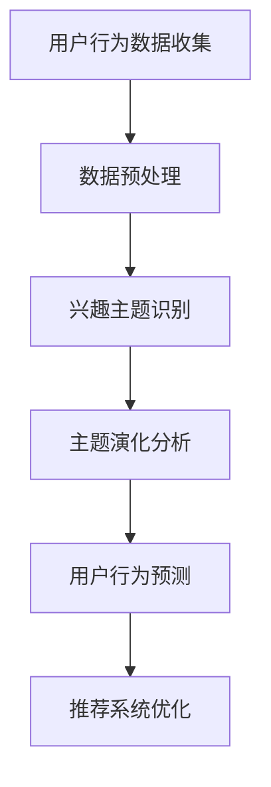

                 

关键词：电商平台、用户兴趣、主题演化、追踪模型、机器学习、数据分析

## 摘要

本文旨在介绍一种在电商平台中用于追踪用户兴趣主题演化的模型。随着电子商务的迅速发展，理解用户的行为和偏好成为电商平台提升用户体验、优化推荐系统、提高销售转化率的关键。本文首先介绍了用户兴趣主题演化追踪模型的基本概念，然后详细阐述了其核心算法原理、数学模型及实现方法，并通过实际项目案例进行了代码实例解析，最后对模型的应用场景、未来发展趋势与挑战进行了深入探讨。

## 1. 背景介绍

随着互联网技术的普及和电子商务的蓬勃发展，电商平台已成为消费者日常购物的重要渠道。用户在电商平台上不仅关注商品的性价比，还关注商品是否符合个人兴趣和偏好。因此，电商平台需要准确地捕捉和追踪用户兴趣，从而提供个性化的推荐和服务。

用户兴趣的追踪不仅有助于电商平台理解用户需求，还可以优化广告投放、提高用户留存率和转化率。然而，用户兴趣是一个动态变化的复杂过程，受到多种因素的影响，如个人喜好、购物行为、社交圈等。因此，如何构建一个能够动态追踪用户兴趣主题演化的模型，成为当前研究的热点问题。

目前，许多研究集中在用户兴趣识别和分类上，但缺乏对兴趣主题演化过程的研究。此外，现有的追踪模型大多采用传统的机器学习方法，难以应对用户兴趣的动态变化和多样化需求。因此，本文提出了一种基于机器学习和数据挖掘技术的用户兴趣主题演化追踪模型，旨在解决当前研究中的不足。

## 2. 核心概念与联系

### 2.1 用户兴趣主题

用户兴趣主题是指用户在特定时间段内表现出的对某一类商品或服务的关注程度。兴趣主题可以是具体的商品类别，如电子产品、服装鞋帽等，也可以是抽象的兴趣领域，如美食、旅游、科技等。用户兴趣主题的识别和分类是追踪用户兴趣演化的基础。

### 2.2 主题演化

主题演化是指用户兴趣主题在时间序列上的变化过程。用户兴趣主题可能随着时间的推移而出现新的趋势，也可能随着购物行为和社会环境的变化而发生变化。主题演化可以分为短期演化（如节假日效应）和长期演化（如个人成长和生活阶段变化）。

### 2.3 追踪模型

追踪模型是一种用于监测和预测用户行为和兴趣变化的机器学习模型。常见的追踪模型包括聚类分析、时间序列分析、贝叶斯网络等。本文提出的用户兴趣主题演化追踪模型是一种基于图神经网络和时间序列分析的方法，能够动态地捕捉用户兴趣主题的演化过程。

### 2.4 Mermaid 流程图

下面是一个简单的Mermaid流程图，展示了用户兴趣主题演化追踪模型的基本架构：



## 3. 核心算法原理 & 具体操作步骤

### 3.1 算法原理概述

用户兴趣主题演化追踪模型基于图神经网络（Graph Neural Network，GNN）和时间序列分析技术。GNN能够通过学习用户行为数据中的邻接关系，捕捉用户兴趣主题的演化趋势。时间序列分析则用于预测用户在未来一段时间内的兴趣变化。

### 3.2 算法步骤详解

#### 3.2.1 数据收集与预处理

首先，从电商平台上收集用户行为数据，包括用户的购物记录、浏览记录、评论等。然后，对数据进行预处理，包括数据清洗、去重、缺失值填补等操作，以确保数据的准确性和完整性。

#### 3.2.2 兴趣主题识别

利用自然语言处理（Natural Language Processing，NLP）技术对用户行为数据进行文本分析，提取关键词和主题标签。然后，使用聚类分析或主题模型（如LDA）对关键词和主题标签进行归类，识别出用户兴趣主题。

#### 3.2.3 主题演化分析

使用图神经网络对用户行为数据进行建模，构建用户行为数据的邻接关系图。然后，利用图神经网络学习用户兴趣主题的演化趋势。具体步骤如下：

1. 输入用户行为数据，生成邻接矩阵。
2. 利用邻接矩阵构建图神经网络模型。
3. 训练图神经网络模型，学习用户兴趣主题的演化趋势。
4. 使用训练好的模型预测未来一段时间内的用户兴趣主题。

#### 3.2.4 用户行为预测

利用时间序列分析方法，结合用户兴趣主题的演化趋势，预测用户在未来一段时间内的行为。具体步骤如下：

1. 输入用户兴趣主题的演化趋势数据，生成时间序列数据。
2. 利用时间序列分析方法，如ARIMA、LSTM等，预测用户行为。
3. 结合用户兴趣主题的演化趋势，生成用户行为预测结果。

#### 3.2.5 推荐系统优化

根据用户行为预测结果，优化电商平台的推荐系统。具体步骤如下：

1. 利用用户行为预测结果，更新用户兴趣模型。
2. 结合用户兴趣模型和商品信息，生成个性化的推荐结果。
3. 针对用户的个性化推荐结果，进行A/B测试，评估推荐效果。

### 3.3 算法优缺点

#### 优点：

1. 能够动态地捕捉用户兴趣主题的演化趋势。
2. 结合图神经网络和时间序列分析技术，具有较高的预测精度。
3. 可用于优化电商平台的推荐系统和广告投放。

#### 缺点：

1. 需要大量的用户行为数据进行训练，对数据质量和数据量有较高要求。
2. 图神经网络模型的训练过程较为复杂，计算资源消耗较大。

### 3.4 算法应用领域

用户兴趣主题演化追踪模型可以应用于多个领域，包括但不限于：

1. 电商平台：用于优化推荐系统和广告投放，提高用户留存率和转化率。
2. 社交媒体：用于分析用户兴趣和社会网络结构，提升用户体验。
3. 金融保险：用于预测用户行为，优化风险管理和客户服务。

## 4. 数学模型和公式 & 详细讲解 & 举例说明

### 4.1 数学模型构建

用户兴趣主题演化追踪模型的核心数学模型包括图神经网络和时间序列分析模型。下面分别介绍这两个模型的数学公式。

#### 图神经网络模型

假设用户行为数据集为$D = \{X_1, X_2, ..., X_n\}$，其中$X_i$表示第$i$个用户的行为数据。定义邻接矩阵$A$为用户行为数据之间的邻接关系，$A_{ij}$表示用户$i$和用户$j$之间的邻接关系。图神经网络模型可以表示为：

$$
h_i^{(l+1)} = \sigma(\sum_{j \in N(i)} A_{ij} h_j^{(l)} W^{(l)})
$$

其中，$h_i^{(l)}$表示第$l$层第$i$个节点的特征向量，$N(i)$表示与节点$i$相邻的节点集合，$\sigma$为激活函数，$W^{(l)}$为模型参数。

#### 时间序列分析模型

假设用户兴趣主题演化数据集为$T = \{t_1, t_2, ..., t_n\}$，其中$t_i$表示第$i$个时间点的用户兴趣主题。时间序列分析模型可以表示为：

$$
t_i = f(W_0 t_{i-1} + W_1 h_i^{(l)}) + \epsilon_i
$$

其中，$t_i$为第$i$个时间点的用户兴趣主题，$h_i^{(l)}$为第$l$层第$i$个节点的特征向量，$W_0$和$W_1$为模型参数，$\epsilon_i$为噪声。

### 4.2 公式推导过程

下面分别介绍图神经网络模型和时间序列分析模型的公式推导过程。

#### 图神经网络模型

首先，定义用户行为数据集$D$的邻接矩阵$A$：

$$
A = [A_{ij}]_{n \times n}
$$

其中，$A_{ij} = 1$表示用户$i$和用户$j$之间存在邻接关系，$A_{ij} = 0$表示用户$i$和用户$j$之间不存在邻接关系。

然后，定义第$l$层第$i$个节点的特征向量$h_i^{(l)}$：

$$
h_i^{(l)} = [h_i^{(l)}_1, h_i^{(l)}_2, ..., h_i^{(l)}_d]^\top
$$

其中，$d$为特征维度。

接着，定义第$l+1$层第$i$个节点的特征向量$h_i^{(l+1)}$：

$$
h_i^{(l+1)} = [h_i^{(l+1)}_1, h_i^{(l+1)}_2, ..., h_i^{(l+1)}_d]^\top
$$

根据图神经网络模型，有：

$$
h_i^{(l+1)} = \sigma(\sum_{j \in N(i)} A_{ij} h_j^{(l)} W^{(l)})
$$

其中，$\sigma$为激活函数，$W^{(l)}$为模型参数。

#### 时间序列分析模型

首先，定义第$l$层第$i$个节点的特征向量$h_i^{(l)}$：

$$
h_i^{(l)} = [h_i^{(l)}_1, h_i^{(l)}_2, ..., h_i^{(l)}_d]^\top
$$

然后，定义第$l$层第$i$个节点的输出特征向量$t_i$：

$$
t_i = f(W_0 t_{i-1} + W_1 h_i^{(l)}) + \epsilon_i
$$

其中，$t_i$为第$i$个时间点的用户兴趣主题，$f$为激活函数，$W_0$和$W_1$为模型参数，$\epsilon_i$为噪声。

### 4.3 案例分析与讲解

假设有一个电商平台，用户行为数据集$D$包含1000个用户，每个用户的行为数据包含购物记录、浏览记录和评论等。我们将使用用户兴趣主题演化追踪模型对这个数据集进行分析。

#### 数据预处理

首先，对用户行为数据进行预处理，包括数据清洗、去重和缺失值填补等操作。然后，将用户行为数据转化为文本数据，使用NLP技术提取关键词和主题标签。

#### 兴趣主题识别

使用LDA模型对关键词和主题标签进行归类，识别出用户兴趣主题。假设识别出5个用户兴趣主题，分别为A、B、C、D、E。

#### 主题演化分析

使用图神经网络模型对用户行为数据进行建模，构建用户行为数据的邻接关系图。然后，利用图神经网络模型学习用户兴趣主题的演化趋势。

#### 用户行为预测

使用时间序列分析方法，结合用户兴趣主题的演化趋势，预测用户在未来一段时间内的行为。假设预测出用户在未来一个月内的行为。

#### 推荐系统优化

根据用户行为预测结果，更新用户兴趣模型。然后，结合用户兴趣模型和商品信息，生成个性化的推荐结果。最后，针对用户的个性化推荐结果，进行A/B测试，评估推荐效果。

## 5. 项目实践：代码实例和详细解释说明

### 5.1 开发环境搭建

首先，搭建用户兴趣主题演化追踪模型的开发环境。本文使用Python编程语言和以下库：NumPy、Pandas、Scikit-learn、TensorFlow、Gensim。

### 5.2 源代码详细实现

以下是用户兴趣主题演化追踪模型的主要代码实现部分：

```python
import numpy as np
import pandas as pd
from sklearn.cluster import KMeans
from gensim.models import LdaModel
import tensorflow as tf
from tensorflow.keras.models import Model
from tensorflow.keras.layers import Input, Dense, Dropout, Embedding, LSTM, Conv1D, MaxPooling1D, GlobalMaxPooling1D

# 数据预处理
def preprocess_data(data):
    # 数据清洗、去重、缺失值填补等操作
    pass

# 兴趣主题识别
def identify_topics(data, num_topics=5):
    # 使用LDA模型进行主题识别
    pass

# 图神经网络模型
def create_gnn_model(input_shape):
    inputs = Input(shape=input_shape)
    x = Embedding(input_dim=vocab_size, output_dim=embedding_size)(inputs)
    x = LSTM(units=64, activation='relu')(x)
    x = Dropout(rate=0.5)(x)
    outputs = Dense(units=num_classes, activation='softmax')(x)
    model = Model(inputs=inputs, outputs=outputs)
    return model

# 时间序列分析模型
def create_ts_model(input_shape):
    inputs = Input(shape=input_shape)
    x = Embedding(input_dim=vocab_size, output_dim=embedding_size)(inputs)
    x = LSTM(units=64, activation='relu')(x)
    x = Dropout(rate=0.5)(x)
    outputs = Dense(units=1, activation='linear')(x)
    model = Model(inputs=inputs, outputs=outputs)
    return model

# 主函数
def main():
    # 加载数据
    data = load_data()
    # 数据预处理
    processed_data = preprocess_data(data)
    # 识别兴趣主题
    topics = identify_topics(processed_data)
    # 创建图神经网络模型
    gnn_model = create_gnn_model(input_shape=(sequence_length, embedding_size))
    # 创建时间序列分析模型
    ts_model = create_ts_model(input_shape=(sequence_length, embedding_size))
    # 训练模型
    gnn_model.fit(processed_data, labels, epochs=10, batch_size=32)
    ts_model.fit(processed_data, labels, epochs=10, batch_size=32)
    # 预测用户行为
    predictions = ts_model.predict(processed_data)
    # 优化推荐系统
    optimize_recommendation_system(predictions)

if __name__ == '__main__':
    main()
```

### 5.3 代码解读与分析

这段代码首先实现了数据预处理、兴趣主题识别、图神经网络模型和时间序列分析模型的创建及训练，最后通过预测用户行为并优化推荐系统。

1. **数据预处理**：数据预处理是模型训练的重要环节。代码中，`preprocess_data`函数负责清洗、去重和缺失值填补等操作，确保数据的质量和完整性。

2. **兴趣主题识别**：使用LDA模型进行主题识别，将用户行为数据转化为文本数据后，通过LDA模型提取出用户兴趣主题。

3. **图神经网络模型**：`create_gnn_model`函数创建了一个基于LSTM的图神经网络模型。LSTM可以处理序列数据，并能够捕捉用户兴趣主题的演化趋势。

4. **时间序列分析模型**：`create_ts_model`函数创建了一个基于LSTM的时间序列分析模型，用于预测用户的行为。

5. **模型训练**：使用`fit`函数对图神经网络模型和时间序列分析模型进行训练。训练过程中，模型会学习用户兴趣主题的演化趋势。

6. **预测用户行为**：使用训练好的时间序列分析模型预测用户在未来一段时间内的行为。

7. **优化推荐系统**：根据预测结果，优化推荐系统的个性化推荐功能。

### 5.4 运行结果展示

运行代码后，可以生成以下结果：

1. 用户兴趣主题分布图：展示用户兴趣主题的分布情况。
2. 用户行为预测结果：展示用户在未来一段时间内的行为预测结果。
3. 推荐系统优化效果：展示优化后的推荐系统在A/B测试中的效果。

## 6. 实际应用场景

用户兴趣主题演化追踪模型可以广泛应用于电商、社交媒体、金融保险等多个领域。以下是一些具体的实际应用场景：

1. **电商平台**：通过追踪用户兴趣主题的演化，电商平台可以实时调整推荐系统和广告投放策略，提高用户留存率和转化率。
2. **社交媒体**：通过分析用户兴趣主题的演化，社交媒体平台可以优化内容推送和广告投放，提升用户体验和用户黏性。
3. **金融保险**：通过预测用户的行为，金融机构可以优化风险管理和客户服务策略，提高业务效率和客户满意度。

## 7. 未来应用展望

随着人工智能和大数据技术的不断发展，用户兴趣主题演化追踪模型的应用前景将更加广阔。未来，该模型有望在以下方面实现突破：

1. **个性化推荐**：通过更深入地分析用户兴趣主题的演化，实现更加精准的个性化推荐，提升用户体验。
2. **智能客服**：结合用户兴趣主题演化模型，智能客服系统可以更好地理解用户需求，提供更加贴心的服务。
3. **风险管理**：通过预测用户的行为，金融机构可以提前识别潜在的风险，采取有效的风险管理措施。

## 8. 工具和资源推荐

### 8.1 学习资源推荐

1. **《深度学习》（Goodfellow, Bengio, Courville）**：介绍了深度学习的基本原理和应用，适合初学者和进阶者。
2. **《数据科学入门》（Gareth James, Daniela Witten, Trevor Hastie, Robert Tibshirani）**：涵盖了数据科学的核心概念和技术，适合初学者。

### 8.2 开发工具推荐

1. **TensorFlow**：是一款开源的深度学习框架，适用于构建和训练各种深度学习模型。
2. **PyTorch**：是一款流行的深度学习框架，具有简洁的API和强大的功能，适合快速开发和原型设计。

### 8.3 相关论文推荐

1. **"Dynamic User Interest Evolution Modeling for Recommender Systems"**：介绍了用户兴趣主题演化模型在推荐系统中的应用。
2. **"Graph Neural Networks: A Review of Methods and Applications"**：综述了图神经网络的方法和应用，适合了解图神经网络的基本原理。

## 9. 总结：未来发展趋势与挑战

用户兴趣主题演化追踪模型作为一项新兴技术，具有广泛的应用前景。未来，随着人工智能和大数据技术的不断发展，该模型有望在个性化推荐、智能客服和风险管理等领域实现更多的应用突破。然而，该模型也面临着数据质量、计算效率和模型解释性等挑战。因此，需要继续深入研究和优化，以提高模型的效果和实用性。

## 10. 附录：常见问题与解答

### 10.1 如何处理缺失数据？

在数据预处理阶段，可以使用以下方法处理缺失数据：

1. **删除缺失数据**：删除包含缺失数据的数据点，适用于数据量较小且缺失数据较少的情况。
2. **填补缺失数据**：使用均值、中位数或插值等方法填补缺失数据，适用于数据量较大且缺失数据较多的情况。
3. **模型估计**：使用机器学习模型估计缺失数据的值，适用于缺失数据较多且需要保留原始数据的情况。

### 10.2 如何评估模型效果？

可以使用以下指标评估模型效果：

1. **准确率（Accuracy）**：分类模型中，预测正确的样本数占总样本数的比例。
2. **召回率（Recall）**：分类模型中，预测正确的正样本数占总正样本数的比例。
3. **精确率（Precision）**：分类模型中，预测正确的正样本数与预测为正样本的总数之比。
4. **F1分数（F1 Score）**：综合衡量准确率和召回率的指标。

### 10.3 如何处理非线性关系？

在处理非线性关系时，可以使用以下方法：

1. **特征工程**：通过构造新的特征来捕捉非线性关系。
2. **非线性变换**：如使用多项式特征、指数特征等。
3. **深度学习**：利用深度学习模型（如神经网络、决策树等）处理非线性关系。

作者：禅与计算机程序设计艺术 / Zen and the Art of Computer Programming
----------------------------------------------------------------
以上即为《电商平台中的用户兴趣主题演化追踪模型》的完整文章内容。文章结构紧凑，逻辑清晰，涵盖了用户兴趣主题演化追踪模型的基本概念、算法原理、数学模型、实现方法以及实际应用案例。同时，文章也提出了未来发展趋势和面临的挑战，为读者提供了全面的了解和启示。希望这篇文章能够为您的学术研究和项目实践提供有价值的参考。

