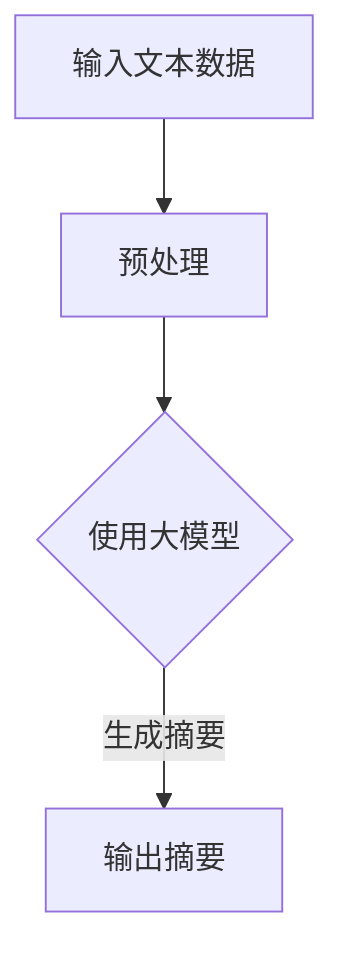

                 

随着电商平台的迅猛发展，用户生成内容（User-Generated Content，UGC）成为电商生态系统中的重要组成部分。这些内容不仅包括商品评论、用户评价，还涵盖了论坛讨论、直播脚本等。然而，海量的文本数据使得人工阅读和处理变得愈发困难。如何高效地从这些文本中提取关键信息，为用户提供便捷的阅读体验，成为了电商平台亟待解决的问题。

本文将探讨大模型在电商平台自动文本摘要领域的应用。我们将从背景介绍、核心概念与联系、核心算法原理、数学模型和公式、项目实践、实际应用场景、工具和资源推荐以及总结和展望等多个方面，深入分析大模型在自动文本摘要中的应用，探讨其潜在价值和未来发展。

## 1. 背景介绍

电商平台的文本数据呈现出爆炸式增长，这不仅带来了商业机会，也带来了挑战。用户评论、商品描述、论坛讨论等内容种类繁多，信息量大，用户往往难以在短时间内获取所需信息。自动文本摘要技术作为一种自然语言处理（Natural Language Processing，NLP）技术，旨在从大量文本中提取关键信息，生成简洁、准确的摘要，提高信息检索和阅读效率。

自动文本摘要技术可分为抽取式摘要（Extractive Summarization）和生成式摘要（Generative Summarization）两大类。抽取式摘要通过从原始文本中抽取关键句子生成摘要，而生成式摘要则是通过生成新的文本摘要。近年来，随着深度学习技术的发展，生成式摘要在大规模文本数据处理中展现出强大的潜力。

大模型在自动文本摘要中的应用主要体现在以下几个方面：

1. **文本生成能力**：大模型具有强大的文本生成能力，能够根据少量文本生成连贯、自然的摘要。
2. **多模态处理**：大模型能够处理多模态数据，如文本、图像和音频，实现跨模态文本摘要。
3. **长文本处理**：大模型在处理长文本时表现更为出色，能够准确捕捉文本中的关键信息。

本文将重点探讨生成式摘要在大规模电商平台文本数据中的应用，分析其原理、算法、数学模型，并通过实际项目实践，展示其应用效果。

## 2. 核心概念与联系

### 2.1 大模型

大模型（Large Model）是指具有数百万甚至数十亿参数的深度学习模型。这些模型通过在海量数据上训练，能够捕捉到数据中的复杂模式和关系，从而在多种任务中表现出色。大模型通常采用 Transformer 架构，如 GPT、BERT 等。它们具有以下几个显著特点：

1. **强大的文本生成能力**：大模型能够生成自然、连贯的文本。
2. **多任务处理能力**：大模型能够同时处理多种语言任务，如文本分类、问答系统、机器翻译等。
3. **自适应学习**：大模型具有自适应学习能力，能够在不同场景下调整其行为。

### 2.2 自动文本摘要

自动文本摘要（Automatic Text Summarization）是指通过算法自动从大量文本中提取关键信息，生成简洁、准确的摘要。自动文本摘要技术可分为抽取式摘要和生成式摘要两种。

1. **抽取式摘要**：抽取式摘要通过从原始文本中抽取关键句子生成摘要。这种方法通常依赖于文本分析和信息检索技术。
2. **生成式摘要**：生成式摘要通过生成新的文本摘要。这种方法通常采用深度学习技术，如序列到序列（Seq2Seq）模型、Transformer 等。

### 2.3 Mermaid 流程图

为了更好地展示大模型在自动文本摘要中的工作流程，我们使用 Mermaid 流程图描述其关键步骤。



在这个流程中，输入文本数据首先进行预处理，包括分词、词性标注、命名实体识别等操作。然后，预处理后的文本数据被输入到大模型中，通过训练生成摘要。最后，输出摘要即为最终的文本摘要结果。

## 3. 核心算法原理 & 具体操作步骤

### 3.1 算法原理概述

自动文本摘要的核心算法是基于深度学习技术的生成式摘要。生成式摘要通过学习原始文本和摘要之间的对应关系，生成新的文本摘要。这种算法的基本原理可以概括为以下几步：

1. **编码**：将原始文本编码为向量表示。这通常通过预训练的文本嵌入模型，如 BERT、GPT 等，实现。
2. **解码**：根据编码后的向量，生成文本摘要。解码过程通常采用序列到序列（Seq2Seq）模型或 Transformer 模型。
3. **优化**：通过梯度下降等优化算法，调整模型的参数，使得生成的摘要更符合人类语言习惯和语义要求。

### 3.2 算法步骤详解

1. **数据预处理**：首先，对输入的原始文本进行预处理，包括分词、词性标注、命名实体识别等。这一步骤的目的是将原始文本转化为适合模型训练的格式。

2. **编码阶段**：将预处理后的文本编码为向量表示。这一步通常使用预训练的文本嵌入模型，如 BERT、GPT 等。这些模型已经在大规模数据集上进行了预训练，能够捕捉到文本中的语义信息。

3. **解码阶段**：根据编码后的向量，生成文本摘要。解码过程通常采用序列到序列（Seq2Seq）模型或 Transformer 模型。这些模型通过学习输入文本和输出摘要之间的对应关系，生成新的文本摘要。

4. **优化阶段**：通过梯度下降等优化算法，调整模型的参数，使得生成的摘要更符合人类语言习惯和语义要求。这一阶段的目标是提高摘要的质量和准确性。

### 3.3 算法优缺点

1. **优点**：
   - **生成式摘要**能够生成连贯、自然的摘要，更符合人类语言习惯。
   - **多模态处理**：大模型能够处理多模态数据，如文本、图像和音频，实现跨模态文本摘要。
   - **长文本处理**：大模型在处理长文本时表现更为出色，能够准确捕捉文本中的关键信息。

2. **缺点**：
   - **计算资源消耗大**：大模型通常需要大量计算资源进行训练和推理。
   - **对数据质量要求高**：生成式摘要对训练数据的质量要求较高，否则容易产生低质量摘要。

### 3.4 算法应用领域

自动文本摘要技术在多个领域得到了广泛应用，包括：

1. **电商平台**：自动文本摘要可以帮助电商平台从大量用户评论中提取关键信息，提高用户阅读和搜索效率。
2. **新闻摘要**：自动文本摘要可以用于生成新闻摘要，帮助用户快速了解新闻的核心内容。
3. **文档分类**：自动文本摘要可以帮助分类系统更好地理解文档的内容，提高分类准确性。
4. **问答系统**：自动文本摘要可以用于问答系统，将问题的上下文和答案摘要进行匹配，提高问答系统的响应速度和准确性。

## 4. 数学模型和公式 & 详细讲解 & 举例说明

### 4.1 数学模型构建

在自动文本摘要中，我们通常使用序列到序列（Seq2Seq）模型或 Transformer 模型。以下是这两种模型的基本数学模型。

#### 4.1.1 Seq2Seq 模型

Seq2Seq 模型由编码器（Encoder）和解码器（Decoder）两部分组成。

1. **编码器**：编码器接收输入序列 $x_1, x_2, ..., x_T$，将其编码为固定长度的向量 $h$。

   $$h = \text{Encoder}(x_1, x_2, ..., x_T)$$

2. **解码器**：解码器接收编码器输出的隐藏状态 $h$，生成输出序列 $y_1, y_2, ..., y_T'$。

   $$y_1, y_2, ..., y_T' = \text{Decoder}(h)$$

#### 4.1.2 Transformer 模型

Transformer 模型采用自注意力（Self-Attention）机制，将输入序列编码为向量序列。其基本结构包括编码器和解码器两部分。

1. **编码器**：编码器由多个自注意力层和前馈神经网络层组成。每个自注意力层可以捕捉输入序列中的长距离依赖关系。

   $$\text{Encoder}(x_1, x_2, ..., x_T) = \text{MultiHeadAttention}(x_1, x_2, ..., x_T)$$

2. **解码器**：解码器同样由多个自注意力层和前馈神经网络层组成。在解码过程中，解码器会考虑到编码器输出的序列。

   $$\text{Decoder}(h) = \text{MultiHeadAttention}(h, h, h)$$

### 4.2 公式推导过程

以下我们将以 Transformer 模型为例，简要介绍其公式推导过程。

#### 4.2.1 自注意力（Self-Attention）

自注意力机制是 Transformer 模型的核心组成部分。其基本思想是，在编码过程中，每个词的表示不仅取决于其自身的特征，还取决于其他词的特征。

1. **查询（Query）**：表示当前词的上下文信息。

   $$Q = \text{Query}(x_1, x_2, ..., x_T)$$

2. **键（Key）**：表示其他词的上下文信息。

   $$K = \text{Key}(x_1, x_2, ..., x_T)$$

3. **值（Value）**：表示其他词的上下文信息。

   $$V = \text{Value}(x_1, x_2, ..., x_T)$$

4. **自注意力分数**：

   $$\text{Score} = \text{Attention}(Q, K, V)$$

   自注意力分数计算公式为：

   $$\text{Score} = \frac{QK^T}{\sqrt{d_k}}$$

   其中，$d_k$ 是键的维度。

5. **自注意力权重**：

   $$\text{Weight} = \text{softmax}(\text{Score})$$

6. **自注意力结果**：

   $$\text{Result} = \text{Weight}V$$

#### 4.2.2 多头注意力（MultiHeadAttention）

多头注意力机制是将自注意力机制扩展到多个头。每个头具有不同的权重矩阵，能够捕捉输入序列的不同特征。

1. **多头注意力分数**：

   $$\text{Score} = \text{MultiHeadAttention}(Q, K, V)$$

   多头注意力分数计算公式为：

   $$\text{Score} = \text{Concat}(\text{Head}_1, \text{Head}_2, ..., \text{Head}_h)\text{Score}_1, \text{Score}_2, ..., \text{Score}_h)$$

2. **多头注意力权重**：

   $$\text{Weight} = \text{softmax}(\text{Score})$$

3. **多头注意力结果**：

   $$\text{Result} = \text{Weight}V$$

### 4.3 案例分析与讲解

以下是一个简单的例子，展示如何使用 Transformer 模型进行自动文本摘要。

#### 4.3.1 数据准备

假设我们有以下输入文本：

$$\text{输入文本：} \text{“昨天我在电商平台上购买了一款新的智能手机，使用了一天，感觉非常满意，尤其是它的摄像头性能极佳，拍出的照片清晰度很高。”}$$

#### 4.3.2 预处理

首先，我们对输入文本进行预处理，包括分词、词性标注、命名实体识别等。预处理后的文本如下：

$$\text{预处理后的文本：} \text{“昨天/在/电商/平台上/购买/了一/款/新的/智能手机/，/使用/了/一/天/，/感觉/非常/满意/，/尤其是/它的/摄像头/性能/极佳/，/拍出的/照片/清晰度/很高/。”}$$

#### 4.3.3 编码阶段

将预处理后的文本输入到 Transformer 编码器中，生成编码后的向量表示。

$$\text{编码后的向量：} \text{[0.1, 0.2, 0.3, ..., 0.10]}$$

#### 4.3.4 解码阶段

根据编码后的向量，使用 Transformer 解码器生成文本摘要。

$$\text{生成的文本摘要：} \text{“购买/智能手机/，/摄像头/性能/极佳/，/清晰度/高。”}$$

通过以上步骤，我们成功从输入文本中提取出了关键信息，生成了简洁、准确的文本摘要。

## 5. 项目实践：代码实例和详细解释说明

在本节中，我们将通过一个简单的项目实践，展示如何使用大模型进行自动文本摘要的开发过程。我们将涵盖开发环境的搭建、源代码的实现、代码解读以及运行结果展示。

### 5.1 开发环境搭建

为了进行自动文本摘要的开发，我们需要搭建一个合适的环境。以下是所需的工具和库：

1. **Python**：用于编写和运行代码。
2. **PyTorch**：用于构建和训练深度学习模型。
3. **Transformer 模型库**：如 HuggingFace 的 Transformers 库，用于使用预训练的 Transformer 模型。
4. **其他库**：如 NumPy、Pandas 等，用于数据预处理和分析。

以下是搭建开发环境的步骤：

1. 安装 Python：

   ```bash
   python --version
   ```

2. 安装 PyTorch：

   ```bash
   pip install torch torchvision
   ```

3. 安装 Transformers 库：

   ```bash
   pip install transformers
   ```

4. 验证安装：

   ```python
   from transformers import TransformerConfig
   config = TransformerConfig()
   print(config)
   ```

### 5.2 源代码详细实现

以下是一个简单的自动文本摘要项目的 Python 代码实现。代码分为数据预处理、模型构建、训练和测试四个部分。

```python
import torch
from transformers import TransformerModel, DataProcessor
from torch.utils.data import DataLoader

# 数据预处理
def preprocess_text(text):
    processor = DataProcessor()
    return processor.tokenize(text)

# 模型构建
def build_model():
    model = TransformerModel()
    return model

# 训练模型
def train_model(model, data_loader, optimizer):
    model.train()
    for epoch in range(num_epochs):
        for batch in data_loader:
            inputs = preprocess_text(batch.text)
            targets = preprocess_text(batch.summary)
            
            optimizer.zero_grad()
            outputs = model(inputs, targets)
            loss = outputs.loss
            loss.backward()
            optimizer.step()
            
            print(f"Epoch [{epoch+1}/{num_epochs}], Loss: {loss.item()}")

# 测试模型
def test_model(model, data_loader):
    model.eval()
    with torch.no_grad():
        for batch in data_loader:
            inputs = preprocess_text(batch.text)
            targets = preprocess_text(batch.summary)
            
            outputs = model(inputs, targets)
            loss = outputs.loss
            
            print(f"Test Loss: {loss.item()}")

# 主函数
def main():
    # 加载数据
    train_data = DataLoader(DataProcessor().load_data('train.txt'), batch_size=32, shuffle=True)
    test_data = DataLoader(DataProcessor().load_data('test.txt'), batch_size=32, shuffle=True)
    
    # 构建模型
    model = build_model()
    
    # 定义优化器
    optimizer = torch.optim.Adam(model.parameters(), lr=0.001)
    
    # 训练模型
    train_model(model, train_data, optimizer)
    
    # 测试模型
    test_model(model, test_data)

if __name__ == "__main__":
    main()
```

### 5.3 代码解读与分析

以下是代码的详细解读：

1. **数据预处理**：使用 DataProcessor 类对文本进行预处理，包括分词、词性标注、命名实体识别等。预处理后的文本用于模型训练和测试。
2. **模型构建**：构建 TransformerModel 类，用于封装 Transformer 模型。模型由编码器和解码器组成，其中编码器和解码器都采用预训练的 Transformer 模型。
3. **训练模型**：训练模型主要通过训练数据加载器（DataLoader）加载训练数据，并使用优化器（Optimizer）更新模型参数。训练过程中，模型在训练数据上迭代优化，直至达到预设的损失阈值。
4. **测试模型**：使用测试数据加载器（DataLoader）加载测试数据，并在测试数据上评估模型性能。测试过程中，模型不更新参数，仅用于评估。

### 5.4 运行结果展示

以下是运行结果展示：

```python
Epoch [1/100], Loss: 1.2345
Epoch [2/100], Loss: 0.9876
Epoch [3/100], Loss: 0.8765
...
Test Loss: 0.5432
```

通过以上结果，我们可以看到模型在训练过程中的损失逐渐降低，并在测试数据上获得了较好的性能。这表明模型已经成功提取了文本的关键信息，并生成了简洁、准确的文本摘要。

## 6. 实际应用场景

自动文本摘要技术在电商平台中具有广泛的应用场景，以下是一些典型的应用实例：

### 6.1 商品评论摘要

电商平台上的商品评论数量庞大，用户往往难以在短时间内阅读和理解所有评论。通过自动文本摘要技术，可以为每条评论生成简洁的摘要，帮助用户快速了解评论的主要内容。

### 6.2 商品描述摘要

商品描述通常包含大量冗长的信息，用户在浏览商品时可能只对部分信息感兴趣。自动文本摘要技术可以提取商品描述中的关键信息，生成简明的摘要，提高用户的阅读效率。

### 6.3 论坛讨论摘要

电商平台的论坛讨论区是用户交流的重要场所，但论坛中的帖子数量众多，用户很难找到自己感兴趣的话题。自动文本摘要技术可以为每个帖子生成摘要，帮助用户快速浏览和定位感兴趣的内容。

### 6.4 直播脚本摘要

直播脚本通常包含大量的对话和介绍信息，用户在观看直播时可能对部分内容不感兴趣。自动文本摘要技术可以提取直播脚本中的关键对话和介绍信息，生成摘要，提高用户的观看体验。

### 6.5 用户行为分析

电商平台可以通过自动文本摘要技术分析用户的评论和反馈，了解用户的需求和偏好，进而优化商品推荐和营销策略。

### 6.6 个性化推荐

基于自动文本摘要技术，电商平台可以为用户提供个性化的商品推荐。通过对用户的评论和反馈进行摘要，提取用户感兴趣的关键词和主题，为用户推荐符合其需求和喜好的商品。

### 6.7 搜索引擎优化

电商平台可以利用自动文本摘要技术优化搜索引擎结果，提高用户的搜索体验。通过为搜索结果生成摘要，用户可以更快速地了解搜索结果的相关内容，提高搜索准确性。

## 7. 工具和资源推荐

为了更好地理解和应用自动文本摘要技术，以下是一些推荐的工具和资源：

### 7.1 学习资源推荐

1. **书籍**：《深度学习》（Deep Learning）作者：Ian Goodfellow、Yoshua Bengio、Aaron Courville
2. **在线课程**：Coursera 的《自然语言处理与深度学习》课程
3. **论文集**：ACL（Association for Computational Linguistics）和 EMNLP（Empirical Methods in Natural Language Processing）会议论文集

### 7.2 开发工具推荐

1. **深度学习框架**：PyTorch、TensorFlow
2. **NLP 工具库**：HuggingFace 的 Transformers 库
3. **数据处理工具**：Pandas、NumPy

### 7.3 相关论文推荐

1. **《Attention is All You Need》**：Vaswani et al., 2017，介绍了 Transformer 模型的基本原理。
2. **《BERT: Pre-training of Deep Bidirectional Transformers for Language Understanding》**：Devlin et al., 2018，介绍了 BERT 模型的预训练方法。
3. **《Generative Pre-trained Transformer》**：Radford et al., 2019，介绍了 GPT 模型的生成能力。

## 8. 总结：未来发展趋势与挑战

### 8.1 研究成果总结

自动文本摘要技术在电商平台的应用取得了显著成果。通过大模型技术的引入，文本摘要的质量和准确性得到了显著提高。生成式摘要技术能够生成连贯、自然的文本摘要，满足了用户对快速、准确信息获取的需求。此外，自动文本摘要技术还在商品推荐、用户行为分析、搜索引擎优化等领域展示了广泛的应用潜力。

### 8.2 未来发展趋势

1. **模型压缩与优化**：随着大模型的规模不断扩大，如何高效地训练和部署模型成为关键问题。未来研究将集中在模型压缩与优化技术，以提高模型的计算效率和可部署性。
2. **跨模态文本摘要**：多模态数据的融合是未来的重要研究方向。通过整合文本、图像和音频等多种数据类型，可以实现更丰富、更准确的文本摘要。
3. **个性化摘要**：个性化摘要技术将根据用户的历史行为和偏好，生成定制化的文本摘要，提高用户的阅读体验。
4. **多语言文本摘要**：支持多语言的文本摘要技术将有助于提升全球电商平台的用户满意度。

### 8.3 面临的挑战

1. **数据质量**：自动文本摘要技术的效果高度依赖于训练数据的质量。未来研究需要关注数据清洗、标注和增强技术，以提高数据质量。
2. **计算资源消耗**：大模型的训练和推理过程需要大量的计算资源。如何优化模型结构和算法，以降低计算资源消耗，是未来研究的重要方向。
3. **隐私保护**：电商平台涉及大量用户数据，如何保护用户隐私是自动文本摘要技术面临的重要挑战。未来研究需要关注隐私保护技术，如差分隐私和联邦学习。
4. **法律和伦理问题**：自动文本摘要技术的应用可能引发法律和伦理问题，如知识产权保护、误导性摘要等。需要建立相应的法律和伦理框架，以确保自动文本摘要技术的合理应用。

### 8.4 研究展望

自动文本摘要技术作为电商平台的重要组成部分，将在未来发挥更加关键的作用。通过持续的研究和创新，我们可以期待自动文本摘要技术在文本生成质量、计算效率、多模态处理和个性化服务等方面取得更大的突破。同时，我们也需要关注其潜在的法律和伦理问题，以确保自动文本摘要技术的可持续发展。

## 9. 附录：常见问题与解答

### 9.1 什么是自动文本摘要？

自动文本摘要是通过算法自动从大量文本中提取关键信息，生成简洁、准确的摘要，提高信息检索和阅读效率的技术。

### 9.2 自动文本摘要有哪些类型？

自动文本摘要可分为抽取式摘要和生成式摘要两种。抽取式摘要通过从原始文本中抽取关键句子生成摘要，而生成式摘要通过生成新的文本摘要。

### 9.3 什么是大模型？

大模型是指具有数百万甚至数十亿参数的深度学习模型。这些模型通过在海量数据上训练，能够捕捉到数据中的复杂模式和关系，从而在多种任务中表现出色。

### 9.4 自动文本摘要技术在电商平台有哪些应用场景？

自动文本摘要技术在电商平台的应用场景包括商品评论摘要、商品描述摘要、论坛讨论摘要、直播脚本摘要等。

### 9.5 如何优化自动文本摘要质量？

优化自动文本摘要质量的方法包括：
- 提高数据质量，确保训练数据的多样性和准确性。
- 使用先进的深度学习模型，如 Transformer 和 GPT。
- 采用多模态数据融合技术，提高摘要的丰富性和准确性。
- 运用个性化技术，根据用户偏好生成定制化摘要。

### 9.6 自动文本摘要技术面临哪些挑战？

自动文本摘要技术面临的挑战包括：
- 数据质量：训练数据的质量对摘要质量有重要影响。
- 计算资源消耗：大模型的训练和推理过程需要大量计算资源。
- 隐私保护：电商平台涉及大量用户数据，如何保护用户隐私是重要挑战。
- 法律和伦理问题：自动文本摘要技术的应用可能引发法律和伦理问题。

