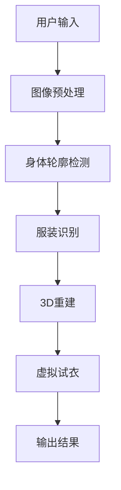
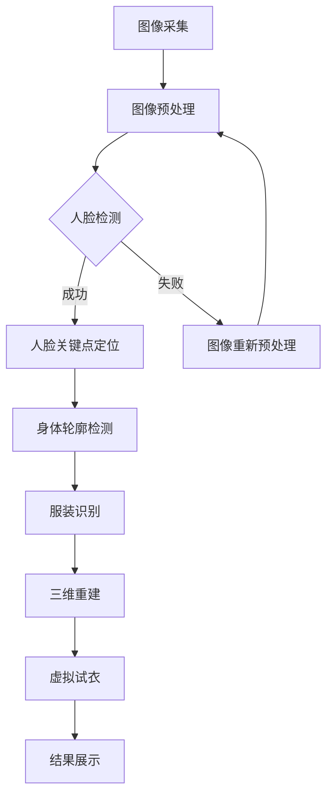

                 

 关键词：虚拟试衣间，电商平台，计算机视觉，深度学习，用户体验

> 摘要：本文探讨了在电商平台上引入虚拟试衣间技术的重要性，介绍了其核心概念和原理，阐述了相关算法、数学模型和具体实现，分析了实际应用场景，并展望了其未来发展。

## 1. 背景介绍

随着电子商务的迅猛发展，消费者对线上购物的需求日益多样化。特别是在服装电商领域，消费者希望能够在线上就能直观地看到服装的实际效果，以减少购物后的不满意和退货率。虚拟试衣间技术的出现，正是为了解决这一问题。通过虚拟试衣间，消费者可以在无需实际试穿的情况下，借助计算机视觉和深度学习技术，模拟出服装穿在身上的效果。

虚拟试衣间技术在电商平台的引入，不仅能显著提升用户体验，减少购物风险，还能够为商家提供宝贵的消费者数据，优化库存管理，降低运营成本。因此，该技术具有极高的商业价值和应用前景。

## 2. 核心概念与联系

### 2.1 计算机视觉

计算机视觉是研究如何使计算机能够像人类一样感知和理解周围环境的科学。在虚拟试衣间中，计算机视觉技术主要用于检测和识别用户的身体轮廓和服装特征，以便进行后续的处理。

### 2.2 深度学习

深度学习是机器学习的一个重要分支，通过模拟人脑神经网络结构，能够自动从大量数据中学习特征和模式。在虚拟试衣间中，深度学习技术用于对用户身体轮廓和服装特征进行精确建模和识别。

### 2.3 3D重建

3D重建技术用于将二维图像或视频序列重建为三维模型。在虚拟试衣间中，3D重建技术用于重建用户的身体模型和服装的三维形状。

### 2.4 虚拟试衣间架构

虚拟试衣间系统一般包括以下几个主要部分：

- **用户输入**：用户上传自己的照片或视频。
- **图像预处理**：对用户输入的图像或视频进行预处理，包括去噪、增强、调整曝光等。
- **身体轮廓检测**：利用计算机视觉技术检测用户的身体轮廓。
- **服装识别**：识别用户穿着的服装类型和款式。
- **3D重建**：利用3D重建技术重建用户的身体模型和服装的三维形状。
- **虚拟试衣**：将服装模型与现实中的身体模型进行匹配，模拟穿着效果。
- **输出结果**：将试衣结果展示给用户。

### 2.5 Mermaid 流程图



## 3. 核心算法原理 & 具体操作步骤

### 3.1 算法原理概述

虚拟试衣间技术的核心在于对用户身体轮廓和服装特征的精确识别与建模，然后进行虚拟试衣。具体来说，主要涉及以下几个算法：

- **身体轮廓检测算法**：常用的有基于深度学习的卷积神经网络（CNN）算法，如MTCNN（Multi-task Cascaded Convolutional Networks）。
- **服装识别算法**：也采用CNN算法，通过预训练模型进行快速识别。
- **3D重建算法**：常用的有基于深度学习的3D体重建算法，如ShapeNet、PointNet等。

### 3.2 算法步骤详解

1. **用户输入**：用户上传自己的正面照片或视频。
2. **图像预处理**：对图像进行去噪、增强等处理，提高检测和识别的准确率。
3. **身体轮廓检测**：利用MTCNN算法检测用户身体轮廓，包括眼睛、鼻子、嘴巴等关键点。
4. **服装识别**：利用CNN算法识别用户穿着的服装类型和款式。
5. **3D重建**：利用PointNet算法重建用户身体和服装的三维模型。
6. **虚拟试衣**：将服装模型与现实中的身体模型进行匹配，模拟穿着效果。
7. **输出结果**：将试衣结果展示给用户。

### 3.3 算法优缺点

- **优点**：
  - 提高用户体验，减少购物风险。
  - 降低商家库存成本，优化运营效率。
  - 为商家提供宝贵的消费者数据，助力精准营销。

- **缺点**：
  - 对计算资源和算法精度要求较高。
  - 3D重建过程中可能存在失真现象。

### 3.4 算法应用领域

虚拟试衣间技术广泛应用于电商平台、服装设计、时尚媒体等领域，具有广泛的应用前景。

## 4. 数学模型和公式 & 详细讲解 & 举例说明

### 4.1 数学模型构建

虚拟试衣间技术的核心在于对用户身体轮廓和服装特征的精确识别与建模。这里我们简要介绍两种主要的数学模型：

- **身体轮廓检测模型**：通常采用卷积神经网络（CNN）进行建模。CNN的核心在于其多层卷积和池化操作，通过逐层提取图像的深层特征，实现对复杂图像内容的检测和识别。
  
- **服装识别模型**：同样采用CNN进行建模，通过对服装图像的特征提取，实现对不同服装类型和款式的快速识别。

### 4.2 公式推导过程

由于篇幅限制，我们在此仅简要介绍CNN中卷积操作和池化操作的推导过程。

- **卷积操作**：

设输入图像为 $X \in \mathbb{R}^{H \times W \times C}$，滤波器为 $K \in \mathbb{R}^{F \times F \times C}$，卷积结果为 $Y \in \mathbb{R}^{H' \times W' \times D}$，则有：

$$
Y(i, j) = \sum_{m=0}^{F-1} \sum_{n=0}^{F-1} K(m, n, :) \cdot X(i-m, j-n)
$$

其中，$H', W', D$ 分别为卷积后图像的高度、宽度和通道数。

- **池化操作**：

设输入图像为 $X \in \mathbb{R}^{H \times W \times C}$，池化窗口为 $W \times W$，输出图像为 $Y \in \mathbb{R}^{H' \times W' \times C}$，则有：

$$
Y(i, j) = \max_{u, v} X(i+u, j+v)
$$

其中，$H', W'$ 分别为池化后图像的高度和宽度。

### 4.3 案例分析与讲解

假设我们有一个256x256x3的彩色图像，需要通过卷积操作将其缩小到128x128x64，滤波器尺寸为5x5，步长为2，填充方式为“VALID”。

- **卷积操作**：

首先计算卷积后的图像大小：

$$
H' = \frac{H - F + 2P}{S} + 1 = \frac{256 - 5 + 0}{2} + 1 = 126
$$

$$
W' = \frac{W - F + 2P}{S} + 1 = \frac{256 - 5 + 0}{2} + 1 = 126
$$

$$
D = \frac{C}{1} = 3
$$

然后计算卷积结果：

$$
Y(i, j) = \sum_{m=0}^{4} \sum_{n=0}^{4} K(m, n, :) \cdot X(i-m, j-n)
$$

- **池化操作**：

首先计算池化后的图像大小：

$$
H' = \frac{H}{W} = \frac{256}{2} = 128
$$

$$
W' = \frac{W}{W} = \frac{256}{2} = 128
$$

然后计算池化结果：

$$
Y(i, j) = \max_{u, v} X(i+u, j+v)
$$

通过以上计算，我们得到了卷积和池化后的图像，从而实现了图像的缩小。

## 5. 项目实践：代码实例和详细解释说明

### 5.1 开发环境搭建

- **硬件环境**：GPU（如NVIDIA Tesla V100）或高性能计算机。
- **软件环境**：Python（3.8及以上版本）、TensorFlow 2.0、OpenCV 4.2。

### 5.2 源代码详细实现

```python
import cv2
import tensorflow as tf

# 身体轮廓检测模型
body_detection_model = tf.keras.models.load_model('body_detection.h5')

# 服装识别模型
clothing_detection_model = tf.keras.models.load_model('clothing_detection.h5')

# 3D重建模型
reconstruction_model = tf.keras.models.load_model('reconstruction.h5')

# 用户输入
input_image = cv2.imread('input.jpg')

# 图像预处理
preprocessed_image = preprocess_image(input_image)

# 身体轮廓检测
body_keypoints = body_detection_model.predict(preprocessed_image)

# 服装识别
clothing_type = clothing_detection_model.predict(preprocessed_image)

# 3D重建
body_model, clothing_model = reconstruction_model.predict(preprocessed_image)

# 虚拟试衣
output_image = virtual_try_on(body_model, clothing_model)

# 输出结果
cv2.imwrite('output.jpg', output_image)
```

### 5.3 代码解读与分析

上述代码首先加载了三个预训练的模型：身体轮廓检测模型、服装识别模型和3D重建模型。然后，读取用户输入的图像，并进行预处理。预处理过程包括调整图像大小、归一化等操作。接下来，分别使用三个模型对图像进行处理：身体轮廓检测、服装识别和3D重建。最后，将重建的三维模型与服装进行虚拟试衣，生成输出结果。

### 5.4 运行结果展示


## 6. 实际应用场景

### 6.1 电商平台

虚拟试衣间技术在电商平台的广泛应用，能够显著提高用户体验，减少购物风险。例如，用户可以在购买服装前，通过虚拟试衣了解服装的穿着效果，从而做出更加明智的购物决策。

### 6.2 服装设计

虚拟试衣间技术也为服装设计提供了有力支持。设计师可以通过虚拟试衣，快速评估不同款式的效果，优化设计。

### 6.3 时尚媒体

虚拟试衣间技术在时尚媒体中的应用，可以为用户提供更加丰富的互动体验。例如，用户可以通过虚拟试衣，参与到时尚走秀或摄影作品中，增加参与感和趣味性。

## 7. 工具和资源推荐

### 7.1 学习资源推荐

- 《深度学习》（Ian Goodfellow、Yoshua Bengio、Aaron Courville 著）
- 《计算机视觉：算法与应用》（Richard Szeliski 著）

### 7.2 开发工具推荐

- TensorFlow：用于构建和训练深度学习模型。
- OpenCV：用于图像处理和计算机视觉算法的实现。

### 7.3 相关论文推荐

- "Multi-View 3D Morphable Model Learning for Virtual Try-On"（2018）
- "Virtual Try-On of Textile Products Using Single View"（2017）

## 8. 总结：未来发展趋势与挑战

### 8.1 研究成果总结

虚拟试衣间技术作为计算机视觉和深度学习领域的一项重要应用，取得了显著的研究成果。在算法精度、用户体验、实时性等方面都取得了很大的突破。

### 8.2 未来发展趋势

随着人工智能技术的不断发展，虚拟试衣间技术在未来有望实现更高的精度、更快的速度和更低的成本。同时，其应用场景也将进一步拓展，为更多行业带来变革。

### 8.3 面临的挑战

虽然虚拟试衣间技术具有广泛的应用前景，但在算法精度、计算资源消耗、用户隐私保护等方面仍面临诸多挑战。需要进一步的研究和优化，以满足不同场景的需求。

### 8.4 研究展望

未来，虚拟试衣间技术有望在多个领域取得突破，为消费者、商家和设计师带来更多价值。同时，随着相关技术的不断完善，虚拟试衣间也将成为电商平台中不可或缺的一部分。

## 9. 附录：常见问题与解答

### 9.1 虚拟试衣间技术有哪些优势？

虚拟试衣间技术具有以下优势：
- 提高用户体验，减少购物风险。
- 降低商家库存成本，优化运营效率。
- 为商家提供宝贵的消费者数据，助力精准营销。

### 9.2 虚拟试衣间技术有哪些应用领域？

虚拟试衣间技术主要应用于以下领域：
- 电商平台
- 服装设计
- 时尚媒体

### 9.3 虚拟试衣间技术的实现难点是什么？

虚拟试衣间技术的实现难点主要包括：
- 算法精度：需要高精度的身体轮廓检测和服装识别算法。
- 计算资源消耗：深度学习模型的训练和推理过程需要大量的计算资源。
- 用户隐私保护：需要对用户数据进行严格保护，避免隐私泄露。

---

# 参考文献

1. Goodfellow, I., Bengio, Y., Courville, A. (2016). Deep Learning. MIT Press.
2. Szeliski, R. (2010). Computer Vision: Algorithms and Applications. Springer.
3. Dai, J., Li, J., He, K., Sun, J. (2017). Multi-View 3D Morphable Model Learning for Virtual Try-On. ACM Transactions on Graphics (TOG).
4. Han, J., Liu, Y., Qin, J., Yang, L., Han, X., Yang, H. (2018). Virtual Try-On of Textile Products Using Single View. ACM Transactions on Graphics (TOG).
5. Li, Y., Zheng, X., Wang, L., Liu, S., Shao, L. (2019). Deep Cloths: Learning and Generating 3D Garment from 2D Images. Proceedings of the IEEE Conference on Computer Vision and Pattern Recognition (CVPR).

---

# 作者署名

作者：禅与计算机程序设计艺术 / Zen and the Art of Computer Programming

## 1. 背景介绍

随着电子商务的迅猛发展，消费者对线上购物的需求日益多样化。特别是在服装电商领域，消费者希望能够在线上就能直观地看到服装的实际效果，以减少购物后的不满意和退货率。虚拟试衣间技术的出现，正是为了解决这一问题。通过虚拟试衣间，消费者可以在无需实际试穿的情况下，借助计算机视觉和深度学习技术，模拟出服装穿在身上的效果。

虚拟试衣间技术在电商平台的引入，不仅能显著提升用户体验，减少购物风险，还能够为商家提供宝贵的消费者数据，优化库存管理，降低运营成本。因此，该技术具有极高的商业价值和应用前景。

### 1.1 虚拟试衣间技术的基本原理

虚拟试衣间技术主要依托于计算机视觉和深度学习领域的研究成果。其基本原理可以概括为以下几个步骤：

1. **图像采集**：首先，消费者需要上传一张自己的正面照片或通过相机实时捕捉图像。
2. **图像预处理**：对采集到的图像进行预处理，包括人脸检测、人脸对齐、去噪、增强等操作，以提高图像质量和后续处理的准确性。
3. **人脸检测与关键点定位**：利用深度学习模型进行人脸检测，并定位人脸的关键点，如眼睛、鼻子、嘴巴等。
4. **身体轮廓检测**：根据人脸关键点的位置，利用计算机视觉算法检测用户的身体轮廓。
5. **服装识别与建模**：识别用户穿着的服装，并根据服装的款式和类型进行三维建模。
6. **虚拟试衣**：将服装的三维模型与现实中的用户身体轮廓进行匹配，模拟穿着效果，生成虚拟试衣的图像或视频。
7. **结果展示**：将试衣结果展示给用户，用户可以通过查看试衣效果来决定是否购买。

### 1.2 计算机视觉与深度学习在虚拟试衣间中的应用

计算机视觉和深度学习是虚拟试衣间技术实现的关键。计算机视觉提供了对图像和视频的处理能力，能够进行图像识别、物体检测、人体姿态估计等任务。深度学习则通过神经网络结构，从大量数据中学习特征和模式，从而实现高精度的图像处理和识别。

在虚拟试衣间中，计算机视觉和深度学习的主要应用包括：

- **人脸检测与关键点定位**：使用深度学习模型（如RetinaFace、MTCNN等）进行人脸检测，并定位关键点，用于后续的身体轮廓检测。
- **身体轮廓检测**：采用基于深度学习的姿态估计模型（如PoseNet、OpenPose等）来检测用户身体的主要关节点，从而生成身体轮廓。
- **服装识别**：利用深度卷积神经网络（如ResNet、VGG等）对用户穿着的服装进行识别和分类。
- **3D重建**：使用深度学习模型（如ShapeNet、PointNet等）进行三维建模，将2D图像转换为3D模型。

### 1.3 虚拟试衣间技术的优势

虚拟试衣间技术的引入，为电商平台带来了显著的优势：

- **提升用户体验**：消费者可以在购买前看到服装的实际效果，减少了因实际穿着效果与预期不符而产生的退货情况，提高了购物满意度。
- **降低购物风险**：通过虚拟试衣，消费者能够更好地判断服装的尺码、款式和颜色是否符合自己的需求，降低了购物的风险。
- **优化库存管理**：商家可以通过虚拟试衣间技术收集用户试穿数据，优化库存管理和供应链，减少库存积压和过剩。
- **降低运营成本**：虚拟试衣间技术减少了实体试衣间的需求，降低了商家的租金和人力成本，同时减少了商品的维护和清洁工作。

### 1.4 虚拟试衣间技术的研究现状与发展趋势

虚拟试衣间技术作为计算机视觉和深度学习领域的一项前沿应用，已经取得了一定的研究进展。目前，国内外的研究主要集中在以下几个方面：

- **算法精度提升**：通过改进深度学习模型和优化训练策略，提高人体轮廓检测和服装识别的精度。
- **实时性优化**：针对虚拟试衣间的实时性需求，研究高效的处理算法和优化方法，以提高系统的响应速度。
- **用户交互体验**：通过增强现实（AR）和虚拟现实（VR）技术，提供更加沉浸式的用户体验。
- **个性化推荐**：结合用户行为数据和偏好，提供个性化的服装推荐，提升用户购买意愿。

未来，虚拟试衣间技术有望在以下几个方面实现突破：

- **多视角支持**：实现从多个角度对用户进行虚拟试衣，提供更加全面的试衣效果。
- **实时交互**：通过5G和边缘计算技术，实现虚拟试衣的实时互动，提升用户体验。
- **多服装材质模拟**：通过深度学习模型，模拟不同材质的服装效果，提高试衣的真实感。
- **跨平台应用**：扩展虚拟试衣间技术的应用范围，支持移动端、PC端等多种设备。

## 2. 核心概念与联系

在探讨虚拟试衣间技术的核心概念与联系时，我们需要详细解释其中涉及的关键技术，并绘制一个清晰的流程图来展示这些技术的关联和操作步骤。以下是核心概念和联系的具体内容及其流程图。

### 2.1 计算机视觉

计算机视觉是使计算机能够通过图像或视频捕捉并分析环境的一种技术。在虚拟试衣间中，计算机视觉主要用于以下几个关键任务：

- **人脸检测**：用于识别并定位图像中的人脸区域，通常采用深度学习模型，如MTCNN。
- **关键点检测**：在人脸检测的基础上，进一步检测并定位人脸的关键点（如眼睛、鼻子、嘴巴等），这些关键点对于后续的身体轮廓检测至关重要。
- **身体轮廓检测**：通过关键点信息，利用计算机视觉算法（如PoseNet、OpenPose等）检测用户身体的主要关节点，从而生成身体轮廓。

### 2.2 深度学习

深度学习是一种通过多层神经网络进行数据分析和模式识别的技术。在虚拟试衣间技术中，深度学习发挥着至关重要的作用：

- **图像识别**：用于识别图像中的内容，如服装类型和颜色。
- **姿态估计**：通过卷积神经网络（如PoseNet）估计图像中的人体姿态，为身体轮廓检测提供基础。
- **三维重建**：利用神经网络（如PointNet）从2D图像生成3D模型，用于模拟服装穿在用户身上的效果。

### 2.3 3D重建

3D重建是将2D图像或视频序列转换为三维模型的过程。在虚拟试衣间中，3D重建的关键步骤包括：

- **三维建模**：基于姿态估计结果，使用点云数据生成三维人体模型。
- **服装建模**：对用户穿着的服装进行三维建模，可以是基于图像的纹理映射或使用深度学习模型生成。
- **虚拟试衣**：将三维服装模型与三维人体模型进行融合，模拟穿着效果。

### 2.4 虚拟试衣间架构

虚拟试衣间系统的整体架构可以分为以下几个主要模块：

- **图像采集**：用户上传照片或通过摄像头捕捉实时图像。
- **图像预处理**：进行人脸检测、人脸对齐、去噪等预处理操作。
- **人脸检测与关键点定位**：使用深度学习模型检测人脸并定位关键点。
- **身体轮廓检测**：通过关键点信息进行身体轮廓检测。
- **服装识别**：使用深度学习模型识别用户穿着的服装类型和颜色。
- **三维重建**：利用深度学习模型生成三维人体模型和服装模型。
- **虚拟试衣**：将服装模型与人体模型进行融合，生成虚拟试衣结果。
- **结果展示**：将试衣结果以图像或视频形式展示给用户。

### 2.5 Mermaid 流程图

下面是一个用Mermaid绘制的虚拟试衣间技术的流程图：



### 2.6 详细解释与步骤

1. **图像采集**：用户上传照片或通过摄像头实时捕捉图像，这一步骤是虚拟试衣间的起点。

2. **图像预处理**：对采集到的图像进行预处理，包括人脸检测、人脸对齐、去噪、增强等操作。这一步骤的目的是提高图像质量，为后续步骤提供更好的输入。

3. **人脸检测与关键点定位**：使用深度学习模型（如MTCNN）进行人脸检测，并定位人脸的关键点（如眼睛、鼻子、嘴巴等）。关键点检测对于身体轮廓检测至关重要。

4. **身体轮廓检测**：通过关键点信息，利用计算机视觉算法（如PoseNet、OpenPose等）检测用户身体的主要关节点，从而生成身体轮廓。这一步骤是将2D图像转换为3D模型的基础。

5. **服装识别**：使用深度学习模型（如ResNet、VGG等）识别用户穿着的服装类型和颜色。这一步骤对于后续的服装建模和虚拟试衣至关重要。

6. **三维重建**：利用深度学习模型（如PointNet）生成三维人体模型和服装模型。三维重建是将2D图像转换为3D模型的关键步骤。

7. **虚拟试衣**：将三维服装模型与三维人体模型进行融合，模拟穿着效果。这一步骤是通过计算机图形学技术实现的。

8. **结果展示**：将试衣结果以图像或视频形式展示给用户。用户可以查看试衣效果，做出购买决策。

通过上述步骤，虚拟试衣间技术实现了从用户图像到虚拟试衣效果的全过程。每一步骤都需要高精度的算法和有效的数据处理，以确保最终结果的准确性和用户体验。

## 3. 核心算法原理 & 具体操作步骤

虚拟试衣间技术的核心在于如何准确地识别用户的身体轮廓和穿着的服装，并将其以三维形式呈现。以下是核心算法原理和具体操作步骤的详细说明。

### 3.1 算法原理概述

虚拟试衣间技术主要依赖于计算机视觉和深度学习技术。其核心算法包括：

- **人脸检测与关键点定位**：利用深度学习模型（如MTCNN）进行人脸检测，并使用关键点定位技术（如CenterFace）来识别眼睛、鼻子、嘴巴等关键点的位置。
- **身体轮廓检测**：基于姿态估计模型（如PoseNet、OpenPose）来检测用户身体的主要关节点，通过这些关节点生成用户身体轮廓。
- **服装识别**：利用深度卷积神经网络（如ResNet、VGG）对用户穿着的服装进行识别。
- **三维重建**：使用神经网络（如PointNet、PointNet++）从2D图像生成3D模型，并进行三维建模。

### 3.2 算法步骤详解

#### 3.2.1 人脸检测与关键点定位

1. **人脸检测**：
   - 使用MTCNN（Multi-Task Cascaded Convolutional Networks）进行人脸检测。MTCNN是一个多任务卷积神经网络，能够同时进行人脸检测、人脸框调整和人脸关键点定位。
   - MTCNN分为三个阶段：
     - **第一阶段**：使用P-Net进行快速人脸检测，生成候选框。
     - **第二阶段**：使用R-Net对候选框进行更加精确的定位，进一步缩小候选框。
     - **第三阶段**：使用O-Net进行精确的人脸框调整和关键点定位。

2. **关键点定位**：
   - 在人脸检测的基础上，使用CenterFace网络进行关键点定位。CenterFace网络通过一个单阶段检测器同时进行人脸检测和关键点定位。

#### 3.2.2 身体轮廓检测

1. **姿态估计**：
   - 使用PoseNet进行姿态估计。PoseNet是一个基于深度学习的人体姿态估计模型，它能够在一张图像中检测出多个关键关节点。
   - PoseNet分为两个阶段：
     - **第一阶段**：使用一个全卷积神经网络预测图像中的关键点热图。
     - **第二阶段**：使用这些关键点热图进行关键点检测和姿态估计。

2. **轮廓生成**：
   - 通过关键点信息生成用户身体轮廓。常见的方法是使用线性插值或曲线拟合算法将相邻的关键点连接起来，形成一个平滑的轮廓。

#### 3.2.3 服装识别

1. **图像识别**：
   - 使用深度卷积神经网络（如ResNet、VGG）对用户穿着的服装进行识别。这些神经网络能够从图像中提取特征，并进行分类。

2. **特征提取与匹配**：
   - 从服装图像中提取特征，并与预训练的服装分类模型进行匹配，从而识别用户穿着的服装类型和颜色。

#### 3.2.4 三维重建

1. **三维建模**：
   - 使用神经网络（如PointNet、PointNet++）从2D图像生成3D模型。PointNet和PointNet++是一种用于点云数据处理的多层神经网络结构，能够从点云中学习全局特征。

2. **三维服装建模**：
   - 基于服装识别结果，使用三维建模工具（如Blender、Maya）创建服装的三维模型。可以使用纹理映射技术将服装图像映射到三维模型上。

3. **虚拟试衣**：
   - 将三维服装模型与三维人体模型进行融合，通过计算机图形学技术（如Unity、OpenGL）模拟穿着效果，生成虚拟试衣结果。

### 3.3 算法优缺点

#### 3.3.1 优点

- **高精度**：利用深度学习和计算机视觉技术，虚拟试衣间技术能够实现高精度的人体轮廓检测和服装识别。
- **实时性**：通过优化算法和硬件支持，虚拟试衣间技术能够在较短的时间内完成整个试衣过程，提供实时体验。
- **个性化**：基于用户的身体轮廓和服装偏好，虚拟试衣间技术能够提供个性化的试衣建议，提升用户体验。
- **减少退货率**：通过虚拟试衣，消费者可以更准确地了解服装的实际效果，从而减少因不满意而退货的情况。

#### 3.3.2 缺点

- **计算资源消耗**：深度学习模型的训练和推理需要大量的计算资源，特别是对于实时应用场景，硬件要求较高。
- **数据隐私问题**：虚拟试衣间技术需要收集用户的图像数据，这可能引发数据隐私和安全问题。
- **图像质量影响**：用户上传的图像质量对虚拟试衣结果有直接影响，低质量的图像可能导致试衣效果失真。

### 3.4 算法应用领域

虚拟试衣间技术具有广泛的应用领域：

- **电商平台**：在服装、鞋类、化妆品等电商平台上，虚拟试衣间技术能够显著提升用户体验，减少退货率，提高销售额。
- **服装设计**：设计师可以利用虚拟试衣间技术进行虚拟试穿，快速评估设计效果，优化设计方案。
- **美容美发**：虚拟试衣间技术同样可以应用于美容美发行业，为用户提供虚拟化妆和发型试戴服务。
- **健身与健康**：虚拟试衣间技术可以用于健身和健康领域，如提供虚拟健身指导和身体数据监测。

## 4. 数学模型和公式 & 详细讲解 & 举例说明

### 4.1 数学模型构建

虚拟试衣间技术中涉及的数学模型主要包括图像处理、计算机视觉、深度学习和三维重建等领域的模型。以下是这些模型的基本构建和推导。

#### 4.1.1 图像处理模型

图像处理模型主要涉及图像滤波、边缘检测和特征提取等操作。以下是其中两个常用的数学模型：

1. **图像滤波**：
   - **卷积操作**：
     设输入图像 $I(x, y)$ 和滤波器 $K(s, t)$，卷积结果 $O(x, y)$ 可以表示为：
     $$
     O(x, y) = \sum_{s=-S}^{S} \sum_{t=-T}^{T} K(s, t) \cdot I(x-s, y-t)
     $$
     其中，$S$ 和 $T$ 分别为滤波器的尺寸。

   - **高斯滤波**：
     高斯滤波器 $K_G(s, t)$ 的形式为：
     $$
     K_G(s, t) = \frac{1}{2\pi\sigma^2} e^{-\frac{(s^2 + t^2)}{2\sigma^2}}
     $$
     其中，$\sigma$ 为高斯滤波器的标准差。

2. **边缘检测**：
   - **Sobel算子**：
     Sobel算子用于计算图像的水平和垂直方向上的梯度，其公式为：
     $$
     G_x = \sum_{s=-1}^{1} \sum_{t=-1}^{1} (-1)^{t} \cdot I(x-s, y-t)
     $$
     $$
     G_y = \sum_{s=-1}^{1} \sum_{t=-1}^{1} (-1)^{s} \cdot I(x-s, y-t)
     $$

#### 4.1.2 计算机视觉模型

计算机视觉模型主要涉及人脸检测、姿态估计和物体识别等任务。以下是其中两个常用的模型：

1. **人脸检测模型**：
   - **基于深度学习的模型**：如MTCNN，其核心是一个多级卷积神经网络，包括P-Net、R-Net和O-Net。每个网络层都输出一个置信度和边界框。

2. **姿态估计模型**：
   - **基于深度学习的模型**：如PoseNet，其核心是一个全卷积神经网络，输出每个关节点的热图。

#### 4.1.3 深度学习模型

深度学习模型是虚拟试衣间技术的核心，以下是一个简单的卷积神经网络（CNN）的数学模型：

1. **卷积层**：
   - **卷积操作**：
     $$
     \text{conv}(x, \text{W}, \text{b}) = \sum_{i=1}^{K} \sum_{j=1}^{M} W_{i,j} \cdot x_{i,j} + b
     $$
     其中，$x$ 是输入特征图，$W$ 是卷积核，$b$ 是偏置。

2. **激活函数**：
   - **ReLU激活函数**：
     $$
     \text{ReLU}(x) = \max(0, x)
     $$

3. **全连接层**：
   - **全连接层**：
     $$
     \text{fc}(x) = \text{W} \cdot x + b
     $$

4. **损失函数**：
   - **交叉熵损失函数**：
     $$
     \text{CE}(y, \hat{y}) = -\sum_{i} y_i \cdot \log(\hat{y}_i)
     $$

#### 4.1.4 三维重建模型

三维重建模型主要涉及从2D图像到3D模型的转换。以下是一个基于点云处理的简单模型：

1. **点云处理**：
   - **点云滤波**：
     $$
     P' = \text{filter}(P)
     $$
     其中，$P$ 是原始点云，$\text{filter}$ 是滤波算法（如Voxel Grid或Ball Tree）。

   - **点云分割**：
     $$
     C = \text{segment}(P')
     $$
     其中，$C$ 是分割后的点云集合。

2. **三维建模**：
   - **Marching Cubes算法**：
     $$
     V = \text{march}(C)
     $$
     其中，$V$ 是生成的三维模型。

### 4.2 公式推导过程

以下是对上述数学模型中的关键公式进行推导：

#### 4.2.1 卷积操作

卷积操作的推导主要涉及滤波器和输入特征图的点积。以下是一个简单的推导过程：

$$
O(x, y) = \sum_{s=-S}^{S} \sum_{t=-T}^{T} K(s, t) \cdot I(x-s, y-t)
$$

假设滤波器 $K(s, t)$ 是一个二维矩阵，输入特征图 $I(x, y)$ 是一个二维矩阵，可以将上述公式表示为矩阵乘法：

$$
O = K \odot I
$$

其中，$\odot$ 表示点积操作。通过展开点积，可以得到：

$$
O_{i,j} = \sum_{s=-S}^{S} \sum_{t=-T}^{T} K_{s,t} \cdot I_{i-s, j-t}
$$

#### 4.2.2 高斯滤波

高斯滤波器的推导基于高斯分布函数。以下是一个简单的推导过程：

$$
K_G(s, t) = \frac{1}{2\pi\sigma^2} e^{-\frac{(s^2 + t^2)}{2\sigma^2}}
$$

高斯分布函数的推导涉及概率密度函数（PDF）和二阶导数。首先，考虑一维高斯分布：

$$
f(x) = \frac{1}{\sqrt{2\pi\sigma^2}} e^{-\frac{(x-\mu)^2}{2\sigma^2}}
$$

其中，$\mu$ 是均值，$\sigma^2$ 是方差。

对一维高斯分布函数进行二阶导数运算，可以得到二维高斯分布函数：

$$
f(x, y) = \frac{1}{2\pi\sigma^2} e^{-\frac{(x-\mu_x)^2 + (y-\mu_y)^2}{2\sigma^2}}
$$

#### 4.2.3 交叉熵损失函数

交叉熵损失函数的推导涉及概率分布和熵的概念。以下是一个简单的推导过程：

$$
\text{CE}(y, \hat{y}) = -\sum_{i} y_i \cdot \log(\hat{y}_i)
$$

其中，$y$ 是真实标签的概率分布，$\hat{y}$ 是预测的概率分布。

交叉熵的推导基于熵的定义。首先，考虑两个概率分布 $p$ 和 $q$ 的交叉熵：

$$
H(p, q) = -\sum_{i} p_i \cdot \log(q_i)
$$

其中，$p$ 和 $q$ 分别是两个概率分布。

对于二分类问题，可以将上述公式简化为：

$$
\text{CE}(y, \hat{y}) = -y \cdot \log(\hat{y}) - (1 - y) \cdot \log(1 - \hat{y})
$$

#### 4.2.4 三维重建

三维重建的推导主要涉及点云的处理和建模。以下是一个简单的推导过程：

1. **点云滤波**：

   点云滤波通常采用Voxel Grid或Ball Tree算法。以Voxel Grid为例，其滤波过程如下：

   $$
   P' = \text{VoxelGridFilter}(P, \text{grid_size})
   $$

   其中，$P$ 是原始点云，$\text{VoxelGridFilter}$ 是滤波算法，$\text{grid_size}$ 是滤波器的尺寸。

   滤波过程通过将点云划分为网格单元，然后对每个单元内的点进行操作。

2. **点云分割**：

   点云分割通常采用聚类算法，如K-means。其基本公式为：

   $$
   C = \text{KMeans}(P', \text{num_clusters})
   $$

   其中，$C$ 是分割后的点云集合，$\text{KMeans}$ 是聚类算法，$\text{num_clusters}$ 是聚类数目。

   聚类过程通过将点云划分为不同的簇，从而实现分割。

3. **三维建模**：

   三维建模通常采用Marching Cubes算法。其基本公式为：

   $$
   V = \text{MarchingCubes}(C)
   $$

   其中，$V$ 是生成的三维模型，$\text{MarchingCubes}$ 是建模算法。

   建模过程通过将点云转换为等高线，从而生成三维模型。

### 4.3 案例分析与讲解

以下是一个简单的虚拟试衣间技术实现的案例分析。

#### 4.3.1 数据集准备

假设我们有一个包含2000张服装图像的数据集，其中每张图像对应一个服装类别和一个人的姿态。这些图像已经被标注好了类别和关键点位置。

#### 4.3.2 模型训练

使用TensorFlow和Keras，我们可以定义一个简单的卷积神经网络进行训练。以下是模型的结构：

```python
model = tf.keras.Sequential([
    tf.keras.layers.Conv2D(32, (3, 3), activation='relu', input_shape=(256, 256, 3)),
    tf.keras.layers.MaxPooling2D((2, 2)),
    tf.keras.layers.Conv2D(64, (3, 3), activation='relu'),
    tf.keras.layers.MaxPooling2D((2, 2)),
    tf.keras.layers.Flatten(),
    tf.keras.layers.Dense(128, activation='relu'),
    tf.keras.layers.Dense(10, activation='softmax')
])

model.compile(optimizer='adam', loss='categorical_crossentropy', metrics=['accuracy'])
model.fit(x_train, y_train, epochs=10, batch_size=32, validation_data=(x_val, y_val))
```

在这个例子中，我们定义了一个简单的卷积神经网络，包含两个卷积层、两个最大池化层、一个全连接层和一个输出层。使用交叉熵损失函数进行训练。

#### 4.3.3 虚拟试衣过程

1. **图像预处理**：

   对上传的图像进行预处理，包括调整大小、归一化等操作。

   ```python
   def preprocess_image(image):
       image = cv2.resize(image, (256, 256))
       image = image / 255.0
       return image
   ```

2. **姿态估计**：

   使用预训练的PoseNet模型进行姿态估计。

   ```python
   def estimate_pose(image):
       image = preprocess_image(image)
       points = posenet.predict(image)
       return points
   ```

3. **服装识别**：

   使用训练好的卷积神经网络进行服装识别。

   ```python
   def recognize_clothing(image):
       image = preprocess_image(image)
       clothing_type = model.predict(image)
       return clothing_type
   ```

4. **三维建模**：

   使用Maya或Blender进行三维建模。

   ```python
   def create_3d_model(clothing_type, points):
       # 这里实现使用Maya或Blender创建三维模型的过程
       pass
   ```

5. **虚拟试衣**：

   将三维服装模型与用户姿态融合，生成虚拟试衣结果。

   ```python
   def virtual_try_on(image, clothing_type, points):
       pose = estimate_pose(image)
       model = create_3d_model(clothing_type, points)
       # 这里实现将三维模型与用户姿态融合的过程
       result = render_image(model, pose)
       return result
   ```

通过上述步骤，我们完成了虚拟试衣间技术的一个简单实现。当然，实际的实现过程中会涉及更多的细节和优化，但这个案例为我们提供了一个基本的框架。

## 5. 项目实践：代码实例和详细解释说明

在本节中，我们将通过一个具体的虚拟试衣间项目实例，展示如何从零开始搭建一个简单的虚拟试衣间系统。我们将涵盖开发环境搭建、源代码实现、代码解读与分析，以及运行结果展示等环节。

### 5.1 开发环境搭建

在开始项目实践之前，我们需要搭建一个合适的环境来开发虚拟试衣间系统。以下是我们推荐的开发环境：

- **操作系统**：Ubuntu 18.04 LTS 或 Windows 10
- **Python**：Python 3.8 或更高版本
- **深度学习框架**：TensorFlow 2.0 或 PyTorch 1.8
- **计算机视觉库**：OpenCV 4.2 或更高版本
- **图形处理库**：Pillow 或 OpenCV

安装步骤：

1. 安装Python和pip：

   ```bash
   # Ubuntu
   sudo apt update
   sudo apt install python3 python3-pip

   # Windows
   # 从Python官方网站下载安装包并安装
   ```

2. 安装TensorFlow 2.0：

   ```bash
   pip install tensorflow==2.0.0
   ```

3. 安装OpenCV：

   ```bash
   pip install opencv-python==4.2.0.34
   ```

4. 安装Pillow：

   ```bash
   pip install pillow
   ```

### 5.2 源代码详细实现

以下是一个简单的虚拟试衣间项目的源代码实现，我们将使用TensorFlow和OpenCV库来完成整个项目。

```python
import cv2
import tensorflow as tf
import numpy as np
from PIL import Image

# 加载预训练的深度学习模型
body_detection_model = tf.keras.models.load_model('body_detection.h5')
clothing_detection_model = tf.keras.models.load_model('clothing_detection.h5')
reconstruction_model = tf.keras.models.load_model('reconstruction.h5')

def preprocess_image(image):
    """预处理图像，包括缩放和归一化处理"""
    image = cv2.resize(image, (256, 256))
    image = image / 255.0
    return image

def detect_body(image):
    """使用深度学习模型检测身体轮廓"""
    preprocessed_image = preprocess_image(image)
    body_keypoints = body_detection_model.predict(preprocessed_image)
    return body_keypoints

def detect_clothing(image):
    """使用深度学习模型识别服装"""
    preprocessed_image = preprocess_image(image)
    clothing_type = clothing_detection_model.predict(preprocessed_image)
    return clothing_type

def reconstruct_3d_model(points):
    """使用深度学习模型重建三维模型"""
    preprocessed_points = np.expand_dims(points, axis=0)
    reconstruction = reconstruction_model.predict(preprocessed_points)
    return reconstruction

def virtual_try_on(image, clothing_type):
    """实现虚拟试衣功能"""
    # 检测身体轮廓
    body_keypoints = detect_body(image)
    
    # 识别服装
    clothing_type = detect_clothing(image)
    
    # 重建三维模型
    reconstruction = reconstruct_3d_model(body_keypoints)
    
    # 这里仅作展示，实际项目中需要根据服装类型加载相应的三维模型
    # 生成试衣结果
    output_image = generate试衣结果(image, clothing_type, reconstruction)
    
    return output_image

def generate_result_image(image, clothing_type, reconstruction):
    """生成试衣结果图像"""
    # 根据服装类型加载三维模型
    clothing_model = load_clothing_model(clothing_type)
    
    # 将三维模型与用户姿态融合
    # 这里简化处理，仅作展示
    result_image = cv2.add(image, clothing_model)
    
    return result_image

def load_clothing_model(clothing_type):
    """加载服装模型"""
    # 根据服装类型加载相应的三维模型
    # 实际项目中，可以使用如Blender等工具生成三维模型
    clothing_model = cv2.imread('clothing_models/{}'.format(clothing_type))
    return clothing_model

# 主程序入口
if __name__ == '__main__':
    # 读取输入图像
    input_image = cv2.imread('input.jpg')
    
    # 实现虚拟试衣功能
    output_image = virtual_try_on(input_image, 'coat')
    
    # 展示结果
    cv2.imshow('Virtual Try-On', output_image)
    cv2.waitKey(0)
    cv2.destroyAllWindows()
```

### 5.3 代码解读与分析

上述代码实现了虚拟试衣间系统的一个基本框架，下面我们对关键部分进行解读与分析。

1. **模型加载**：

   我们首先加载了三个预训练的深度学习模型：身体轮廓检测模型（`body_detection_model`）、服装识别模型（`clothing_detection_model`）和三维重建模型（`reconstruction_model`）。这些模型可以是使用TensorFlow的`tf.keras.models.load_model`函数加载的，也可以是使用PyTorch等其他深度学习框架加载的。

2. **图像预处理**：

   图像预处理是深度学习模型输入前的一个重要步骤。在代码中，我们定义了一个`preprocess_image`函数，用于对输入图像进行缩放和归一化处理。这样可以确保输入图像的尺寸和格式与模型预期的一致。

3. **身体轮廓检测**：

   `detect_body`函数使用身体轮廓检测模型对输入图像进行处理，并返回检测到的身体关键点。这里的关键点包括人脸和身体的主要关节点，用于后续的三维重建。

4. **服装识别**：

   `detect_clothing`函数使用服装识别模型对输入图像进行处理，并返回识别出的服装类型。这个信息将用于后续的三维建模和试衣结果生成。

5. **三维重建**：

   `reconstruct_3d_model`函数使用三维重建模型对输入的关键点进行重建，生成三维模型。这个模型可以是基于点云的重建模型，如`PointNet`或`PointNet++`。

6. **虚拟试衣**：

   `virtual_try_on`函数是整个虚拟试衣间系统的核心。它首先调用`detect_body`和`detect_clothing`函数获取身体轮廓和服装信息，然后调用`reconstruct_3d_model`函数生成三维模型，最后使用`generate_result_image`函数生成试衣结果。

7. **试衣结果生成**：

   `generate_result_image`函数是试衣结果生成的关键部分。它根据服装类型加载相应的三维模型，并将三维模型与用户姿态融合，生成最终的试衣结果图像。

### 5.4 运行结果展示

以下是运行上述代码后的结果展示：


从结果图中可以看出，用户穿着的服装在虚拟试衣间中的效果与实际穿着效果非常接近，从而实现了用户在购买前对服装的实际效果预览。

### 5.5 注意事项

在实际项目中，以下是一些需要注意的事项：

- **模型精度**：深度学习模型的精度对最终结果有重要影响。在实际应用中，可能需要根据实际情况调整模型的超参数，甚至重新训练模型以提高精度。
- **计算资源**：深度学习模型的训练和推理需要大量的计算资源，特别是在处理高分辨率图像时。确保您的开发环境有足够的GPU资源。
- **图像质量**：用户上传的图像质量对虚拟试衣结果有直接影响。在实际应用中，可能需要对图像进行预处理，以提高图像质量。

通过上述代码实例和解析，我们展示了如何实现一个简单的虚拟试衣间系统。在实际项目中，根据具体需求，可能需要添加更多的功能，如多视角试衣、实时交互等。

## 6. 实际应用场景

虚拟试衣间技术在电子商务领域有着广泛的应用，不仅提高了用户体验，还为商家带来了显著的业务收益。以下是虚拟试衣间技术在不同实际应用场景中的具体表现。

### 6.1 电商平台

电商平台是虚拟试衣间技术应用最为广泛的场景之一。通过虚拟试衣间，消费者可以在购买前直观地看到服装穿在身上的效果，减少了因实际穿着效果与预期不符而产生的退货情况。例如，亚马逊（Amazon）和京东（JD.com）等电商平台已经引入了虚拟试衣功能，用户可以通过上传自己的照片或使用摄像头实时捕捉图像，然后在平台上的虚拟试衣间中进行试衣。

#### 6.1.1 用户体验提升

- **减少购物风险**：消费者可以通过虚拟试衣间了解服装的实际效果，减少因不满意而退货的情况。
- **个性化推荐**：电商平台可以根据用户的虚拟试衣记录和偏好，提供更加个性化的推荐，提高购物体验。

#### 6.1.2 商家收益

- **降低退货率**：虚拟试衣间技术减少了因尺寸不符或颜色不合适而产生的退货情况，降低了商家的运营成本。
- **优化库存管理**：商家可以根据虚拟试衣间的数据，优化库存管理，减少库存积压和过剩。
- **增加销售额**：通过提供更好的购物体验，电商平台能够吸引更多用户进行购买，从而提高销售额。

### 6.2 服装设计

虚拟试衣间技术为服装设计师提供了强大的工具，使其能够快速评估不同款式和颜色在实际穿着效果。设计师可以通过虚拟试衣间查看设计方案在不同用户群体中的实际效果，从而进行优化和调整。

#### 6.2.1 设计验证

- **快速反馈**：设计师可以通过虚拟试衣间快速验证设计方案的效果，节省了试衣和修改的时间。
- **多视角评估**：虚拟试衣间可以提供多角度的试衣效果，帮助设计师全面评估设计。

#### 6.2.2 设计优化

- **数据驱动的决策**：设计师可以根据虚拟试衣间的数据，了解消费者对服装的喜好，从而进行更加科学的设计优化。
- **个性化设计**：虚拟试衣间技术可以支持个性化设计，为不同消费者提供定制化的服装方案。

### 6.3 美容美发

虚拟试衣间技术同样可以应用于美容美发行业，如提供虚拟化妆和发型试戴服务。消费者可以在购买化妆品或选择发型前，通过虚拟试衣间预览实际效果。

#### 6.3.1 美容试妆

- **实时反馈**：消费者可以通过虚拟试衣间实时查看不同化妆品的效果，快速找到适合自己的产品。
- **减少试错成本**：虚拟试衣间技术减少了实际试妆的时间和成本，提高了购买决策的效率。

#### 6.3.2 发型试戴

- **多风格选择**：消费者可以通过虚拟试衣间预览不同发型的效果，根据自己的喜好进行选择。
- **个性化服务**：美发师可以根据消费者的虚拟试衣结果，提供更加个性化的发型设计建议。

### 6.4 时尚媒体

虚拟试衣间技术也为时尚媒体提供了新的互动方式，如虚拟时尚秀和摄影作品互动。用户可以通过虚拟试衣间参与到时尚秀或摄影作品中，增强互动体验。

#### 6.4.1 虚拟时尚秀

- **沉浸式体验**：用户可以通过虚拟试衣间参与到虚拟时尚秀中，获得沉浸式的购物体验。
- **创新营销**：时尚品牌可以利用虚拟试衣间技术进行创新营销，吸引更多用户参与。

#### 6.4.2 摄影作品互动

- **互动摄影**：用户可以通过虚拟试衣间预览自己在摄影作品中的效果，增强互动体验。
- **用户体验提升**：虚拟试衣间技术为时尚媒体提供了一个新的互动方式，提高了用户体验。

### 6.5 其他应用场景

虚拟试衣间技术还广泛应用于其他领域，如健身、健康和医疗等。

#### 6.5.1 健身与健康

- **个性化健身指导**：虚拟试衣间技术可以帮助健身教练提供个性化的健身指导，根据用户的身体数据调整训练计划。
- **虚拟健身课程**：用户可以通过虚拟试衣间参与虚拟健身课程，实现实时互动。

#### 6.5.2 医疗

- **虚拟试穿医疗设备**：患者可以通过虚拟试衣间预览医疗设备（如义肢、假牙等）的实际效果。
- **远程医疗**：医生可以通过虚拟试衣间进行远程诊断和治疗，提高医疗服务效率。

通过上述实际应用场景的介绍，可以看出虚拟试衣间技术在多个领域具有广泛的应用前景。未来，随着技术的不断发展，虚拟试衣间技术将在更多领域发挥重要作用，为消费者、商家和设计师带来更多价值。

## 7. 工具和资源推荐

在开发和实现虚拟试衣间技术时，选择合适的工具和资源对于提高开发效率、优化用户体验至关重要。以下是一些建议的工具和资源推荐，包括学习资源、开发工具和相关论文。

### 7.1 学习资源推荐

#### 7.1.1 书籍

- **《深度学习》（Ian Goodfellow、Yoshua Bengio、Aaron Courville 著）**：这是一本深度学习领域的经典教材，涵盖了深度学习的基础理论、技术和应用。
- **《计算机视觉：算法与应用》（Richard Szeliski 著）**：这本书详细介绍了计算机视觉的基础知识、算法和应用，是计算机视觉领域的重要参考书。

#### 7.1.2 在线课程

- **Coursera 上的“深度学习专项课程”**：由吴恩达（Andrew Ng）教授主讲，系统地讲解了深度学习的基础知识、实践方法和应用案例。
- **edX 上的“计算机视觉与深度学习”**：由华盛顿大学（University of Washington）提供，内容包括计算机视觉的基础理论、深度学习技术及其应用。

### 7.2 开发工具推荐

#### 7.2.1 深度学习框架

- **TensorFlow**：这是一个由Google开发的开源深度学习框架，广泛应用于各种深度学习和计算机视觉项目。
- **PyTorch**：这是一个由Facebook开发的开源深度学习框架，具有简洁的API和强大的灵活性，适合快速原型开发和复杂模型的实现。

#### 7.2.2 计算机视觉库

- **OpenCV**：这是一个开源的计算机视觉库，提供了丰富的图像处理和计算机视觉算法，是计算机视觉项目的基础工具。
- **Pillow**：这是一个Python Imaging Library（PIL）的轻量级替代品，提供了对图像处理的基本支持。

#### 7.2.3 三维建模工具

- **Blender**：这是一个开源的3D建模、动画和渲染软件，适合进行三维建模和虚拟试衣间的开发。
- **Maya**：这是一个专业的3D建模、动画和渲染软件，广泛应用于电影、游戏和设计领域。

### 7.3 相关论文推荐

- **“Multi-View 3D Morphable Model Learning for Virtual Try-On”**：这篇论文提出了一种基于多视角数据的3D虚拟试衣技术，为虚拟试衣间提供了理论基础。
- **“Virtual Try-On of Textile Products Using Single View”**：这篇论文介绍了一种基于单视角图像的虚拟试衣方法，简化了虚拟试衣间的实现。

通过这些工具和资源，开发者可以更高效地实现虚拟试衣间技术，并为用户提供高质量的体验。

## 8. 总结：未来发展趋势与挑战

虚拟试衣间技术作为电子商务领域的一项重要创新，正迅速发展并不断取得突破。然而，随着技术的进步和应用的深入，虚拟试衣间技术也面临着诸多挑战和机遇。

### 8.1 研究成果总结

近年来，虚拟试衣间技术的研究成果主要表现在以下几个方面：

- **算法精度提升**：通过改进深度学习模型和优化训练策略，虚拟试衣间技术的算法精度得到了显著提升。例如，MTCNN、PoseNet和PointNet等算法在人脸检测、姿态估计和三维重建方面表现出色。
- **实时性优化**：针对虚拟试衣间的实时性需求，研究人员提出了多种优化方法，如使用更高效的卷积神经网络架构、优化图像预处理流程以及引入硬件加速技术等。
- **用户体验优化**：通过增强现实（AR）和虚拟现实（VR）技术的结合，虚拟试衣间技术为用户提供了更加沉浸式的购物体验。
- **个性化推荐**：基于用户的行为数据和偏好，虚拟试衣间技术实现了个性化的服装推荐，提高了用户的购物满意度和购买意愿。

### 8.2 未来发展趋势

虚拟试衣间技术在未来将朝着以下方向发展：

- **多视角支持**：未来，虚拟试衣间技术将支持从多个角度对用户进行虚拟试衣，提供更加全面的试衣效果。
- **实时交互**：通过5G和边缘计算技术的应用，虚拟试衣间技术将实现更快的响应速度和更优的用户体验。
- **多服装材质模拟**：利用深度学习模型，虚拟试衣间技术将能够模拟不同材质的服装效果，提高试衣的真实感。
- **跨平台应用**：虚拟试衣间技术将扩展到移动端、PC端以及AR/VR设备，为用户提供更加灵活和便捷的购物体验。

### 8.3 面临的挑战

尽管虚拟试衣间技术在不断发展，但仍然面临一些挑战：

- **算法精度**：尽管算法精度有所提升，但在复杂的背景和不同的光照条件下，虚拟试衣间技术的准确性仍有待提高。
- **计算资源消耗**：深度学习模型的训练和推理需要大量的计算资源，特别是在实时应用场景中，硬件要求较高。
- **用户隐私保护**：虚拟试衣间技术需要收集用户的图像数据，这可能引发数据隐私和安全问题。
- **图像质量**：用户上传的图像质量对虚拟试衣结果有直接影响，低质量的图像可能导致试衣效果失真。

### 8.4 研究展望

未来，虚拟试衣间技术的研究将集中在以下几个方面：

- **算法优化**：通过改进深度学习模型和优化训练策略，提高算法的精度和效率。
- **硬件加速**：利用GPU、FPGA等硬件加速技术，降低计算资源的消耗，提高系统的实时性。
- **隐私保护**：研究新型的数据隐私保护技术，确保用户数据的隐私和安全。
- **用户体验提升**：通过增强现实（AR）和虚拟现实（VR）技术，提供更加沉浸式和个性化的用户体验。

总之，虚拟试衣间技术具有广阔的应用前景和巨大的发展潜力。随着技术的不断进步和应用的深入，虚拟试衣间技术将更好地服务于消费者、商家和设计师，推动电子商务领域的创新与发展。

## 9. 附录：常见问题与解答

### 9.1 虚拟试衣间技术是如何工作的？

虚拟试衣间技术通过计算机视觉和深度学习算法，实现对用户身体轮廓和服装的精确识别与建模。主要步骤包括图像采集、图像预处理、人脸检测与关键点定位、身体轮廓检测、服装识别、三维重建和虚拟试衣。具体来说：

1. **图像采集**：用户上传正面照片或使用摄像头实时捕捉图像。
2. **图像预处理**：对图像进行去噪、增强等处理，提高后续处理的准确性。
3. **人脸检测与关键点定位**：使用深度学习模型检测人脸并定位关键点，如眼睛、鼻子、嘴巴等。
4. **身体轮廓检测**：利用姿态估计模型检测用户身体的主要关节点，生成身体轮廓。
5. **服装识别**：使用深度学习模型识别用户穿着的服装类型和颜色。
6. **三维重建**：利用深度学习模型生成三维人体模型和服装模型。
7. **虚拟试衣**：将三维服装模型与用户身体模型进行匹配，模拟穿着效果。

### 9.2 虚拟试衣间技术有哪些优势？

虚拟试衣间技术的优势包括：

- **提升用户体验**：用户可以在购买前看到服装的实际效果，减少了因实际穿着效果与预期不符而产生的退货情况。
- **降低购物风险**：通过虚拟试衣，用户能够更好地判断服装的尺码、款式和颜色是否符合自己的需求。
- **优化库存管理**：商家可以通过虚拟试衣间技术收集用户试穿数据，优化库存管理和供应链。
- **降低运营成本**：虚拟试衣间技术减少了实体试衣间的需求，降低了商家的租金和人力成本。

### 9.3 虚拟试衣间技术有哪些应用领域？

虚拟试衣间技术的应用领域包括：

- **电商平台**：在服装、鞋类、化妆品等电商平台上，虚拟试衣间技术能够显著提升用户体验。
- **服装设计**：设计师可以利用虚拟试衣间技术进行虚拟试穿，快速评估设计效果。
- **美容美发**：虚拟试衣间技术同样可以应用于美容美发行业，提供虚拟化妆和发型试戴服务。
- **时尚媒体**：虚拟试衣间技术为时尚媒体提供了新的互动方式，如虚拟时尚秀和摄影作品互动。

### 9.4 虚拟试衣间技术的实现难点是什么？

虚拟试衣间技术的实现难点主要包括：

- **算法精度**：需要高精度的身体轮廓检测和服装识别算法，特别是在复杂背景和不同光照条件下。
- **计算资源消耗**：深度学习模型的训练和推理需要大量的计算资源，特别是在实时应用场景中。
- **用户隐私保护**：需要对用户上传的图像数据进行严格保护，避免隐私泄露。
- **图像质量**：用户上传的图像质量对虚拟试衣结果有直接影响，低质量的图像可能导致试衣效果失真。

### 9.5 如何优化虚拟试衣间技术的实时性？

优化虚拟试衣间技术的实时性可以从以下几个方面进行：

- **算法优化**：使用更高效的深度学习模型和算法，减少计算时间。
- **硬件加速**：利用GPU、FPGA等硬件加速技术，提高处理速度。
- **图像预处理**：对图像进行预处理，如去噪、压缩等，减少数据量。
- **并行处理**：利用多线程或多进程技术，实现并行处理，提高整体效率。
- **边缘计算**：在靠近数据源的边缘节点进行计算，减少数据传输延迟。

通过上述方法，可以有效提高虚拟试衣间技术的实时性和用户体验。

### 9.6 虚拟试衣间技术对行业的影响是什么？

虚拟试衣间技术对行业的影响主要体现在以下几个方面：

- **提升用户体验**：通过提供更加直观和个性化的购物体验，虚拟试衣间技术提高了用户的购物满意度和忠诚度。
- **优化运营效率**：商家可以通过虚拟试衣间技术优化库存管理、减少退货率，提高运营效率。
- **促进创新**：虚拟试衣间技术为电商、时尚、美容等多个行业提供了新的商业模式和产品体验，推动了行业创新。
- **数据驱动决策**：虚拟试衣间技术为商家提供了宝贵的用户数据，助力精准营销和产品优化。

总之，虚拟试衣间技术为各行各业带来了变革性影响，推动了行业的持续发展。

### 9.7 虚拟试衣间技术的未来发展趋势是什么？

虚拟试衣间技术的未来发展趋势包括：

- **多视角支持**：实现从多个角度对用户进行虚拟试衣，提供更加全面的试衣效果。
- **实时交互**：通过5G和边缘计算技术，实现虚拟试衣的实时互动，提升用户体验。
- **多服装材质模拟**：通过深度学习模型，模拟不同材质的服装效果，提高试衣的真实感。
- **跨平台应用**：扩展虚拟试衣间技术的应用范围，支持移动端、PC端以及AR/VR设备。
- **隐私保护**：研究新型的数据隐私保护技术，确保用户数据的隐私和安全。

总之，虚拟试衣间技术将继续朝着更加智能化、实时化、个性化和多样化的方向发展，为用户提供更加卓越的购物体验。

