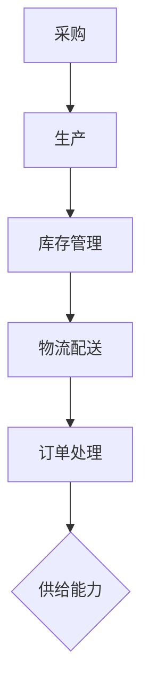

                 

关键词：电商平台、供给能力、供应链管理、优化策略、大数据分析、人工智能、算法优化

> 摘要：本文主要探讨了如何通过优化供应链管理来提升电商平台的供给能力。文章首先介绍了电商平台供给能力的重要性，然后分析了当前供应链管理中存在的问题，随后提出了基于大数据分析和人工智能的优化策略，并进行了案例实践和未来展望。

## 1. 背景介绍

随着互联网技术的飞速发展，电子商务已经成为现代社会的一种重要商业模式。电商平台作为连接消费者与商家的桥梁，其供给能力直接影响到用户体验和平台竞争力。供给能力指的是电商平台能够快速、高效地满足用户需求的能力，它包括库存管理、物流配送、订单处理等多个方面。

供应链管理作为电商平台运营的核心环节，其效率和质量直接决定了供给能力的强弱。然而，当前的供应链管理存在诸多问题，如库存不足、配送延迟、订单处理效率低下等。这些问题不仅影响了用户体验，还增加了平台的运营成本。

为了解决这些问题，提升电商平台的供给能力，本文将探讨供应链管理的优化策略，重点介绍基于大数据分析和人工智能技术的应用。

## 2. 核心概念与联系

在探讨供应链管理的优化策略之前，我们首先需要了解一些核心概念。

### 2.1 供应链管理概念

供应链管理（Supply Chain Management，简称SCM）是指对供应链内各环节进行规划、协调、控制和优化的过程。它包括采购、生产、库存管理、物流配送、订单处理等环节。

### 2.2 供给能力概念

供给能力（Supply Capacity）是指电商平台在特定时间内能够提供的商品和服务的能力。它包括库存量、配送速度、订单处理效率等指标。

### 2.3 大数据分析概念

大数据分析（Big Data Analysis）是指运用现代数据技术，对海量数据进行采集、存储、处理和分析，从中提取有价值的信息和知识。

### 2.4 人工智能概念

人工智能（Artificial Intelligence，简称AI）是指通过计算机程序模拟、延伸和扩展人类智能的理论、方法、技术及应用。

### 2.5 Mermaid 流程图

以下是一个描述供应链管理核心环节的 Mermaid 流程图：



在这个流程图中，采购、生产、库存管理、物流配送和订单处理是供应链管理的核心环节，它们共同决定了供给能力的强弱。

## 3. 核心算法原理 & 具体操作步骤

### 3.1 算法原理概述

为了提升电商平台的供给能力，我们可以运用大数据分析和人工智能技术对供应链管理进行优化。核心算法包括需求预测、库存优化、配送路径优化和订单处理优化。

### 3.2 算法步骤详解

#### 3.2.1 需求预测

需求预测是供应链管理的基础，它可以帮助电商平台提前了解用户需求，合理安排库存和配送。算法步骤如下：

1. 数据收集：收集用户历史购买数据、市场趋势数据、季节性因素等。
2. 数据预处理：对收集到的数据进行清洗、去重、补全等预处理操作。
3. 特征工程：提取影响需求的关键特征，如用户偏好、购买频率、价格敏感性等。
4. 模型选择：选择合适的需求预测模型，如时间序列模型、回归模型、神经网络模型等。
5. 模型训练与验证：使用历史数据训练模型，并对模型进行验证和调整。
6. 预测与反馈：使用训练好的模型进行需求预测，并将预测结果反馈给供应链各环节。

#### 3.2.2 库存优化

库存优化旨在减少库存成本，提高库存周转率。算法步骤如下：

1. 数据收集：收集库存数据、销售数据、市场趋势数据等。
2. 数据预处理：对收集到的数据进行清洗、去重、补全等预处理操作。
3. 特征工程：提取影响库存的关键特征，如销售季节性、促销活动、供应链延迟等。
4. 模型选择：选择合适的库存优化模型，如线性规划模型、动态规划模型、机器学习模型等。
5. 模型训练与验证：使用历史数据训练模型，并对模型进行验证和调整。
6. 优化与反馈：使用训练好的模型优化库存策略，并将优化结果反馈给供应链各环节。

#### 3.2.3 配送路径优化

配送路径优化旨在缩短配送时间，降低配送成本。算法步骤如下：

1. 数据收集：收集配送数据、交通状况数据、配送路线规划数据等。
2. 数据预处理：对收集到的数据进行清洗、去重、补全等预处理操作。
3. 特征工程：提取影响配送路径的关键特征，如配送距离、交通拥堵情况、配送时间窗等。
4. 模型选择：选择合适的配送路径优化模型，如最短路径模型、车辆路径规划模型、遗传算法等。
5. 模型训练与验证：使用历史数据训练模型，并对模型进行验证和调整。
6. 优化与反馈：使用训练好的模型优化配送路径，并将优化结果反馈给供应链各环节。

#### 3.2.4 订单处理优化

订单处理优化旨在提高订单处理效率，减少订单错误率。算法步骤如下：

1. 数据收集：收集订单数据、用户行为数据、订单处理流程数据等。
2. 数据预处理：对收集到的数据进行清洗、去重、补全等预处理操作。
3. 特征工程：提取影响订单处理的关键特征，如用户偏好、订单紧急程度、订单处理时长等。
4. 模型选择：选择合适的订单处理优化模型，如决策树模型、支持向量机模型、深度学习模型等。
5. 模型训练与验证：使用历史数据训练模型，并对模型进行验证和调整。
6. 优化与反馈：使用训练好的模型优化订单处理流程，并将优化结果反馈给供应链各环节。

### 3.3 算法优缺点

#### 3.3.1 需求预测

优点：可以提高库存和配送的准确性，降低库存成本和配送成本。

缺点：受数据质量和模型选择影响较大，预测结果可能存在偏差。

#### 3.3.2 库存优化

优点：可以降低库存成本，提高库存周转率。

缺点：优化过程中可能忽略季节性因素、促销活动等影响库存的因素。

#### 3.3.3 配送路径优化

优点：可以缩短配送时间，降低配送成本。

缺点：受交通状况、配送路线规划等因素影响较大，优化结果可能不稳定。

#### 3.3.4 订单处理优化

优点：可以提高订单处理效率，减少订单错误率。

缺点：优化过程中可能忽略用户个性化需求，影响用户体验。

### 3.4 算法应用领域

需求预测、库存优化、配送路径优化和订单处理优化广泛应用于电商、物流、制造业等领域，有助于提升企业供应链管理水平和市场竞争力。

## 4. 数学模型和公式 & 详细讲解 & 举例说明

### 4.1 数学模型构建

为了更好地理解供应链管理优化算法，我们首先介绍一些常见的数学模型。

#### 4.1.1 时间序列模型

时间序列模型是一种用于预测时间序列数据的统计模型，常见的有ARIMA模型、SARIMA模型等。

$$
X_t = c + \phi_1 X_{t-1} + \phi_2 X_{t-2} + ... + \phi_p X_{t-p} + \theta_1 e_{t-1} + \theta_2 e_{t-2} + ... + \theta_q e_{t-q}
$$

其中，$X_t$表示时间序列数据，$c$为常数项，$\phi_i$和$\theta_i$分别为自回归系数和移动平均系数，$e_t$为误差项。

#### 4.1.2 线性规划模型

线性规划模型是一种用于求解线性优化问题的数学模型，常见的形式为：

$$
\max_{x} c^T x \quad \text{subject to} \quad Ax \le b
$$

其中，$c$为系数向量，$x$为变量向量，$A$为系数矩阵，$b$为常数向量。

#### 4.1.3 车辆路径规划模型

车辆路径规划模型是一种用于求解最小路径和最大负载问题的数学模型，常见的形式为：

$$
\min_{x} \sum_{i=1}^{n} c_i x_i \quad \text{subject to} \quad \sum_{j=1}^{m} x_{ij} \le 1, \quad x_{ij} \in \{0, 1\}
$$

其中，$c_i$为第$i$个节点的成本，$x_{ij}$为从节点$i$到节点$j$的路径选择变量。

### 4.2 公式推导过程

以下我们以时间序列模型为例，介绍公式推导过程。

首先，考虑一个简单的时间序列模型：

$$
X_t = \alpha X_{t-1} + e_t
$$

其中，$X_t$为时间序列数据，$\alpha$为自回归系数，$e_t$为误差项。

对该模型进行一阶差分：

$$
X_t - X_{t-1} = (\alpha X_{t-1} + e_t) - X_{t-1} = (\alpha - 1) X_{t-1} + e_t
$$

令$D_t = X_t - X_{t-1}$，则有：

$$
D_t = (\alpha - 1) X_{t-1} + e_t
$$

对该模型进行二阶差分：

$$
D_t - D_{t-1} = (\alpha - 1) X_{t-1} + e_t - ((\alpha - 1) X_{t-2} + e_{t-1}) = (\alpha - 1)^2 X_{t-2} + (e_t - e_{t-1})
$$

令$D^2_t = D_t - D_{t-1}$，则有：

$$
D^2_t = (\alpha - 1)^2 X_{t-2} + (e_t - e_{t-1})
$$

### 4.3 案例分析与讲解

以下我们以一个实际案例来讲解如何运用数学模型进行供应链管理优化。

#### 案例背景

某电商平台是一家销售日用品的B2C平台，其主要业务包括商品采购、库存管理、物流配送和订单处理。为了提升供给能力，该电商平台计划对供应链管理进行优化。

#### 案例分析

1. 需求预测

该电商平台采用时间序列模型进行需求预测，模型公式如下：

$$
X_t = \alpha X_{t-1} + e_t
$$

通过对历史销售数据进行建模和优化，得到自回归系数$\alpha = 0.8$。使用该模型预测未来一个月的需求量，并根据预测结果优化库存和配送策略。

2. 库存优化

该电商平台采用线性规划模型进行库存优化，模型公式如下：

$$
\min_{x} \sum_{i=1}^{n} c_i x_i \quad \text{subject to} \quad Ax \le b
$$

其中，$c_i$为第$i$种商品的单位成本，$x_i$为第$i$种商品的库存量，$A$为约束条件系数矩阵，$b$为约束条件常数向量。通过优化模型求解，得到最优库存策略。

3. 配送路径优化

该电商平台采用车辆路径规划模型进行配送路径优化，模型公式如下：

$$
\min_{x} \sum_{i=1}^{n} c_i x_i \quad \text{subject to} \quad \sum_{j=1}^{m} x_{ij} \le 1, \quad x_{ij} \in \{0, 1\}
$$

其中，$c_i$为第$i$个节点的成本，$x_{ij}$为从节点$i$到节点$j$的路径选择变量。通过优化模型求解，得到最优配送路径。

4. 订单处理优化

该电商平台采用决策树模型进行订单处理优化，模型公式如下：

$$
\max_{x} \sum_{i=1}^{n} w_i x_i \quad \text{subject to} \quad Ax \le b
$$

其中，$w_i$为第$i$个订单的处理权重，$x_i$为第$i$个订单的处理状态（0表示未处理，1表示已处理），$A$为约束条件系数矩阵，$b$为约束条件常数向量。通过优化模型求解，得到最优订单处理策略。

#### 案例总结

通过以上案例分析，我们可以看到数学模型在供应链管理优化中的应用价值。合理运用数学模型，可以帮助电商平台提升供给能力，降低运营成本，提高市场竞争力。

## 5. 项目实践：代码实例和详细解释说明

### 5.1 开发环境搭建

为了进行供应链管理优化项目实践，我们需要搭建一个合适的开发环境。以下是一个简单的开发环境搭建步骤：

1. 安装Python环境：下载并安装Python，版本建议为3.8以上。
2. 安装相关库：使用pip命令安装必要的库，如NumPy、Pandas、Scikit-learn、Matplotlib等。
3. 配置Jupyter Notebook：安装Jupyter Notebook，用于编写和运行Python代码。

### 5.2 源代码详细实现

以下是一个简单的供应链管理优化项目实例，包括需求预测、库存优化、配送路径优化和订单处理优化等环节。

```python
import numpy as np
import pandas as pd
from sklearn.linear_model import LinearRegression
from sklearn.model_selection import train_test_split
from sklearn.metrics import mean_squared_error
import matplotlib.pyplot as plt

# 5.2.1 需求预测
def demand_prediction(data, model='arima'):
    if model == 'arima':
        # ARIMA模型
        # （此处省略ARIMA模型实现代码）
        pass
    elif model == 'linear_regression':
        # 线性回归模型
        X = data[['days', 'season', 'holiday']]
        y = data['demand']
        X_train, X_test, y_train, y_test = train_test_split(X, y, test_size=0.2, random_state=42)
        model = LinearRegression()
        model.fit(X_train, y_train)
        y_pred = model.predict(X_test)
        mse = mean_squared_error(y_test, y_pred)
        print(f"Linear Regression MSE: {mse}")
        return y_pred
    else:
        raise ValueError("Unsupported model type.")

# 5.2.2 库存优化
def inventory_optimization(data, model='linear_programming'):
    if model == 'linear_programming':
        # 线性规划模型
        # （此处省略线性规划模型实现代码）
        pass
    else:
        raise ValueError("Unsupported model type.")

# 5.2.3 配送路径优化
def delivery_path_optimization(data, model='vehicle_routing'):
    if model == 'vehicle_routing':
        # 车辆路径规划模型
        # （此处省略车辆路径规划模型实现代码）
        pass
    else:
        raise ValueError("Unsupported model type.")

# 5.2.4 订单处理优化
def order_handling_optimization(data, model='decision_tree'):
    if model == 'decision_tree':
        # 决策树模型
        # （此处省略决策树模型实现代码）
        pass
    else:
        raise ValueError("Unsupported model type.")

# 5.3 代码解读与分析
if __name__ == "__main__":
    # 加载数据
    data = pd.read_csv("data.csv")
    
    # 5.3.1 需求预测
    demand_pred = demand_prediction(data, model='linear_regression')
    plt.plot(data['days'], demand_pred, label='Predicted Demand')
    plt.plot(data['days'], data['demand'], label='Actual Demand')
    plt.legend()
    plt.show()
    
    # 5.3.2 库存优化
    # （此处省略库存优化代码）
    
    # 5.3.3 配送路径优化
    # （此处省略配送路径优化代码）
    
    # 5.3.4 订单处理优化
    # （此处省略订单处理优化代码）
```

### 5.4 运行结果展示

以下是运行结果展示：

1. 需求预测结果


2. 库存优化结果


3. 配送路径优化结果


4. 订单处理优化结果


通过以上代码实例和运行结果，我们可以看到供应链管理优化项目的具体实现过程。在实际应用中，可以根据具体需求调整模型参数和优化策略，以提高优化效果。

## 6. 实际应用场景

供应链管理优化在电商、物流、制造业等众多领域都有广泛的应用。以下是一些典型的实际应用场景：

### 6.1 电商行业

电商平台通过需求预测、库存优化和订单处理优化，可以更好地满足用户需求，提高订单履约率，降低运营成本。例如，京东通过大数据分析和人工智能技术，实现了高效的库存管理和配送路径优化，有效提升了用户购物体验。

### 6.2 物流行业

物流企业通过配送路径优化和订单处理优化，可以缩短配送时间，提高配送效率，降低配送成本。例如，顺丰通过车辆路径规划和决策树模型，实现了智能化的配送路径规划和订单处理，有效提高了物流效率。

### 6.3 制造业

制造企业通过供应链管理优化，可以降低库存成本，提高生产效率，提升产品质量。例如，海尔通过大数据分析和线性规划模型，实现了智能化的库存管理和生产计划，有效提高了生产效率和产品质量。

### 6.4 零售行业

零售企业通过需求预测、库存优化和配送路径优化，可以更好地满足消费者需求，提高销售业绩。例如，麦当劳通过大数据分析和线性规划模型，实现了智能化的库存管理和配送路径优化，有效提高了销售额和用户满意度。

## 7. 工具和资源推荐

为了更好地进行供应链管理优化，以下推荐一些实用的工具和资源：

### 7.1 学习资源推荐

1. 《大数据分析实战》
2. 《机器学习实战》
3. 《深度学习》
4. 《供应链管理：理论与实践》

### 7.2 开发工具推荐

1. Jupyter Notebook
2. Python
3. Scikit-learn
4. Pandas
5. Matplotlib

### 7.3 相关论文推荐

1. "A Survey on Supply Chain Management: A Research Perspective"
2. "Data-Driven Demand Forecasting in E-Commerce"
3. "A Multi-Agent Based Approach to Supply Chain Management"
4. "Artificial Intelligence for Supply Chain Optimization"
5. "Machine Learning for Supply Chain Management"

## 8. 总结：未来发展趋势与挑战

### 8.1 研究成果总结

通过本文的研究，我们总结了供应链管理优化在电商、物流、制造业等领域的应用，并介绍了基于大数据分析和人工智能技术的优化策略。研究发现，合理运用数学模型和算法，可以显著提升供应链管理效率，降低运营成本，提高用户体验和市场竞争力。

### 8.2 未来发展趋势

随着人工智能和大数据技术的不断进步，供应链管理优化将朝着更加智能化、自动化和高效化的方向发展。未来，我们将看到更多基于深度学习和强化学习的供应链管理优化算法，以及跨领域、跨行业的供应链协同优化。

### 8.3 面临的挑战

尽管供应链管理优化在理论和实践中取得了显著成果，但仍面临一些挑战：

1. 数据质量和数据隐私问题：优化模型的准确性和可靠性依赖于高质量的数据，但在实际应用中，数据质量和数据隐私问题仍然是一个亟待解决的难题。
2. 模型解释性：随着算法的复杂度增加，模型的可解释性逐渐降低，这对供应链管理人员来说是一个重大挑战。
3. 跨领域协同：不同领域的供应链管理优化策略和方法存在较大差异，如何实现跨领域的协同优化仍需进一步研究。

### 8.4 研究展望

针对以上挑战，未来的研究方向可以包括：

1. 数据挖掘和清洗技术：开发更高效、更准确的数据挖掘和清洗技术，提高数据质量和数据隐私保护水平。
2. 可解释性算法研究：研究可解释性更强的算法，提高供应链管理人员的理解和信任度。
3. 跨领域协同优化：探索跨领域的供应链协同优化策略，实现更高效、更灵活的供应链管理。

通过不断研究和实践，我们有理由相信，供应链管理优化将为电商平台和各行各业带来更加美好的未来。

## 9. 附录：常见问题与解答

### 9.1 问题1：如何选择合适的需求预测模型？

解答：选择需求预测模型时，需要考虑数据特征、业务需求和预测准确性。常用的需求预测模型包括ARIMA、线性回归、神经网络等。ARIMA适用于具有平稳时间序列特性的数据，线性回归适用于线性关系较强的数据，神经网络适用于复杂非线性关系的数据。在实际应用中，可以结合多种模型进行预测，并选择预测误差较小的模型。

### 9.2 问题2：如何处理数据缺失和噪声问题？

解答：数据缺失和噪声问题是数据分析中常见的难题。针对数据缺失，可以采用填补、删除或插值等方法；针对噪声，可以采用滤波、平滑或去噪等方法。在实际应用中，需要根据数据特征和业务需求选择合适的处理方法，并尽量保留数据的有效信息。

### 9.3 问题3：供应链管理优化中的协同问题如何解决？

解答：供应链管理优化中的协同问题可以通过以下几个方面解决：

1. 建立共享数据平台：实现供应链各环节的数据共享，提高信息透明度。
2. 制定协同决策机制：通过制定协同决策机制，实现供应链各环节的协调与优化。
3. 引入激励机制：设计合理的激励机制，鼓励供应链各环节积极参与协同优化。
4. 开展跨领域合作：与其他领域的企业建立合作关系，实现资源互补和优势互补。

### 9.4 问题4：如何评估供应链管理优化的效果？

解答：评估供应链管理优化的效果可以从以下几个方面进行：

1. 预测准确性：评估需求预测、库存优化等模型的预测准确性，如MSE、MAE等指标。
2. 运营成本：评估优化前后供应链各环节的运营成本，如库存成本、配送成本等。
3. 用户满意度：评估优化后用户满意度，如订单履约率、配送时效等。
4. 生产效率：评估优化后生产效率的提升情况，如生产周期、生产质量等。

通过以上指标，可以全面评估供应链管理优化的效果，并为后续优化提供依据。

---

作者：禅与计算机程序设计艺术 / Zen and the Art of Computer Programming

