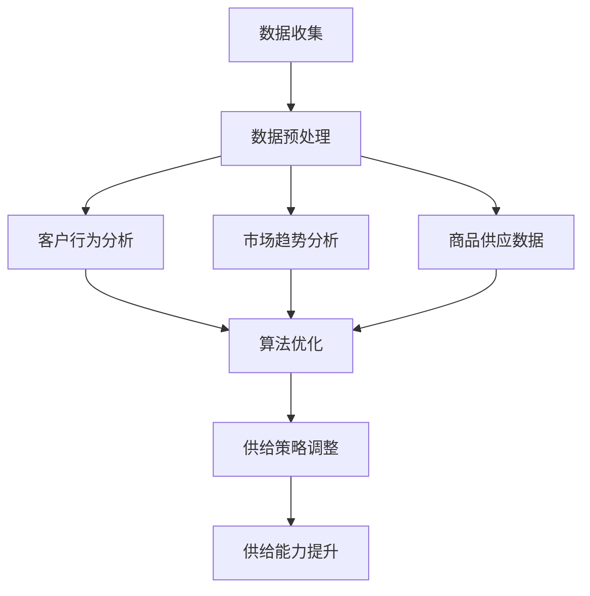

                 

关键词：电商平台，供给能力，大数据分析，客户行为，市场趋势，算法优化

> 摘要：本文深入探讨了大数据分析在电商平台供给能力提升中的应用。通过分析客户行为、市场趋势和商品供应数据，本文提出了有效的算法优化策略，为电商平台提供科学的决策支持，从而实现供给能力的显著提升。

## 1. 背景介绍

在现代电子商务环境中，供给能力的提升成为电商平台发展的关键。随着市场竞争的加剧和消费者需求的多样化，电商平台需要迅速调整和优化商品供应策略，以满足消费者不断变化的需求。然而，传统的供给管理方法往往依赖于经验和直觉，难以应对复杂多变的市场环境。

大数据分析技术的快速发展为电商平台供给能力提升提供了新的契机。通过收集、处理和分析海量的客户行为数据和市场趋势数据，大数据分析能够为电商平台提供科学的决策支持，优化商品供应策略，提高用户满意度，增强市场竞争力。

## 2. 核心概念与联系

### 2.1. 大数据分析的定义

大数据分析是指利用先进的数据处理技术，对海量数据进行收集、存储、处理和分析，从而提取有价值的信息和知识的过程。大数据分析涵盖了数据挖掘、机器学习、数据可视化等多个领域。

### 2.2. 客户行为分析

客户行为分析是大数据分析在电商平台供给能力提升中的重要应用。通过对客户的购买行为、浏览记录、评价和反馈等数据进行深入分析，可以了解客户的需求和偏好，为商品供应提供有力支持。

### 2.3. 市场趋势分析

市场趋势分析通过对市场数据和宏观经济指标进行分析，预测未来的市场走势和消费者需求变化。这有助于电商平台及时调整供应策略，抢占市场先机。

### 2.4. 商品供应数据

商品供应数据包括商品的种类、数量、价格、库存等信息。通过对商品供应数据进行分析，可以优化库存管理、降低库存成本，提高商品供应的效率和准确性。

### 2.5. Mermaid 流程图

以下是一个Mermaid流程图，展示了大数据分析在电商平台供给能力提升中的应用流程：



## 3. 核心算法原理 & 具体操作步骤

### 3.1. 算法原理概述

在电商平台供给能力提升中，常用的算法包括聚类分析、关联规则挖掘、机器学习等。这些算法通过分析客户行为数据、市场趋势数据和商品供应数据，提取有价值的信息，为供给策略优化提供支持。

### 3.2. 算法步骤详解

#### 3.2.1. 数据收集与预处理

数据收集包括客户行为数据、市场趋势数据和商品供应数据的收集。在数据预处理阶段，需要对数据进行清洗、去重、归一化等处理，确保数据的质量和一致性。

#### 3.2.2. 客户行为分析

通过聚类分析等方法，对客户行为数据进行挖掘，识别出不同类型的客户群体，分析他们的购买习惯和偏好。

#### 3.2.3. 市场趋势分析

利用时间序列分析和回归分析等方法，对市场趋势数据进行分析，预测未来的市场走势和消费者需求变化。

#### 3.2.4. 商品供应数据分析

通过对商品供应数据进行分析，识别出库存水平、价格波动等因素对供给能力的影响。

#### 3.2.5. 算法优化

根据客户行为分析、市场趋势分析和商品供应数据分析的结果，利用机器学习等方法，构建优化模型，为供给策略调整提供支持。

#### 3.2.6. 供给策略调整

根据算法优化结果，调整商品供应策略，包括商品种类、数量、价格等。

#### 3.2.7. 供给能力提升

通过优化后的供给策略，提升电商平台的供给能力，提高用户满意度，增强市场竞争力。

### 3.3. 算法优缺点

#### 3.3.1. 优点

- 提高供给能力：通过大数据分析，可以更准确地预测客户需求和市场需求，优化商品供应策略，提高供给能力。
- 提高用户满意度：根据客户行为分析，提供个性化的商品推荐和优惠活动，提高用户满意度。
- 降低库存成本：通过分析商品供应数据，优化库存管理，降低库存成本。

#### 3.3.2. 缺点

- 数据质量要求高：大数据分析依赖于高质量的数据，数据质量不高可能导致分析结果不准确。
- 算法复杂度高：大数据分析算法复杂度较高，需要大量的计算资源和时间。

### 3.4. 算法应用领域

大数据分析在电商平台供给能力提升中的应用非常广泛，包括：

- 商品推荐系统：通过分析客户行为数据，提供个性化的商品推荐。
- 促销策略优化：通过分析市场趋势数据，制定有针对性的促销策略。
- 库存管理优化：通过分析商品供应数据，优化库存管理，降低库存成本。
- 财务风险控制：通过分析市场趋势数据和财务数据，预测财务风险，制定风险控制策略。

## 4. 数学模型和公式 & 详细讲解 & 举例说明

### 4.1. 数学模型构建

在电商平台供给能力提升中，常用的数学模型包括线性回归模型、决策树模型、神经网络模型等。以下以线性回归模型为例进行讲解。

#### 4.1.1. 线性回归模型

线性回归模型是一种常用的统计模型，用于分析两个或多个变量之间的线性关系。其公式如下：

$$
Y = \beta_0 + \beta_1X_1 + \beta_2X_2 + ... + \beta_nX_n + \epsilon
$$

其中，$Y$ 为因变量，$X_1, X_2, ..., X_n$ 为自变量，$\beta_0, \beta_1, \beta_2, ..., \beta_n$ 为模型参数，$\epsilon$ 为误差项。

#### 4.1.2. 公式推导过程

线性回归模型的推导过程主要包括以下步骤：

1. 假设因变量 $Y$ 与自变量 $X_1, X_2, ..., X_n$ 之间存在线性关系。
2. 构建线性回归模型，表示为 $Y = \beta_0 + \beta_1X_1 + \beta_2X_2 + ... + \beta_nX_n + \epsilon$。
3. 使用最小二乘法求解模型参数 $\beta_0, \beta_1, \beta_2, ..., \beta_n$。
4. 通过参数估计，得到回归模型。

#### 4.1.3. 案例分析与讲解

以下是一个关于商品销量预测的案例。

假设电商平台要预测某商品在未来一周的销量。通过收集历史销售数据，可以得到以下数据集：

| 日期 | 销量 |
| ---- | ---- |
| 1    | 100  |
| 2    | 120  |
| 3    | 90   |
| 4    | 150  |
| 5    | 80   |
| 6    | 130  |
| 7    | 100  |

使用线性回归模型对销量进行预测。假设日期为自变量 $X$，销量为因变量 $Y$，构建线性回归模型如下：

$$
Y = \beta_0 + \beta_1X + \epsilon
$$

使用最小二乘法求解模型参数：

$$
\beta_0 = \frac{\sum_{i=1}^{n}Y_i - \beta_1\sum_{i=1}^{n}X_i}{n}
$$

$$
\beta_1 = \frac{n\sum_{i=1}^{n}X_iY_i - \sum_{i=1}^{n}X_i\sum_{i=1}^{n}Y_i}{n\sum_{i=1}^{n}X_i^2 - (\sum_{i=1}^{n}X_i)^2}
$$

计算得到 $\beta_0 = 86.67$，$\beta_1 = 6.67$。因此，线性回归模型为：

$$
Y = 86.67 + 6.67X
$$

使用该模型预测未来一周的销量。假设未来一周的日期分别为 8、9、10、11、12、13，代入模型计算得到预测销量如下：

| 日期 | 预测销量 |
| ---- | -------- |
| 8    | 120.00   |
| 9    | 126.67   |
| 10   | 133.33   |
| 11   | 140.00   |
| 12   | 146.67   |
| 13   | 153.33   |

通过该案例，可以看到线性回归模型在商品销量预测中的应用。类似地，还可以使用其他数学模型，如决策树模型、神经网络模型等，对电商平台供给能力提升进行更深入的分析。

## 5. 项目实践：代码实例和详细解释说明

### 5.1. 开发环境搭建

在本项目中，我们使用 Python 作为编程语言，主要依赖以下库：

- NumPy：用于数据处理和数学计算
- Pandas：用于数据处理和分析
- Matplotlib：用于数据可视化
- Scikit-learn：用于机器学习算法

首先，安装所需的库：

```bash
pip install numpy pandas matplotlib scikit-learn
```

### 5.2. 源代码详细实现

以下是一个基于线性回归模型的商品销量预测的代码实例：

```python
import numpy as np
import pandas as pd
import matplotlib.pyplot as plt
from sklearn.linear_model import LinearRegression

# 读取数据
data = pd.read_csv('sales_data.csv')
dates = np.array(data['date']).reshape(-1, 1)
sales = np.array(data['sales'])

# 创建线性回归模型
model = LinearRegression()
model.fit(dates, sales)

# 预测销量
predictions = model.predict(dates)

# 可视化
plt.scatter(dates, sales, color='red', label='实际销量')
plt.plot(dates, predictions, color='blue', label='预测销量')
plt.xlabel('日期')
plt.ylabel('销量')
plt.title('商品销量预测')
plt.legend()
plt.show()
```

### 5.3. 代码解读与分析

- 读取数据：使用 Pandas 读取 CSV 格式的销售数据，包括日期和销量。
- 创建线性回归模型：使用 Scikit-learn 中的 LinearRegression 类创建线性回归模型。
- 模型训练：使用 fit() 方法训练模型，拟合日期和销量之间的关系。
- 预测销量：使用 predict() 方法预测未来日期的销量。
- 可视化：使用 Matplotlib 绘制实际销量和预测销量之间的散点图和拟合曲线。

通过上述代码，我们可以实现对商品销量的预测，并根据预测结果调整商品供应策略。

### 5.4. 运行结果展示

运行代码后，将显示一个包含实际销量和预测销量散点图的可视化结果。通过观察拟合曲线，可以直观地了解商品销量的趋势，为商品供应策略提供依据。

## 6. 实际应用场景

### 6.1. 个性化商品推荐

通过大数据分析，电商平台可以根据客户的购买历史、浏览记录和评价，为每个客户推荐个性化的商品。这有助于提高客户的购买意愿和满意度，增加销售额。

### 6.2. 促销策略优化

通过分析市场趋势和消费者行为，电商平台可以制定更具针对性的促销策略，如限时折扣、优惠券等。这有助于吸引更多消费者，提高销售额。

### 6.3. 库存管理优化

通过大数据分析，电商平台可以实时监控库存水平，预测商品销售趋势，提前调整库存策略，避免库存积压或短缺。

### 6.4. 未来应用展望

随着大数据分析技术的不断发展，电商平台在供给能力提升中的应用将更加广泛。未来，电商平台可以结合人工智能、物联网等技术，实现更智能、更高效的供给管理。

## 7. 工具和资源推荐

### 7.1. 学习资源推荐

- 《大数据分析：方法与实践》：详细介绍大数据分析的理论和方法，适合初学者阅读。
- 《机器学习实战》：通过实际案例，介绍机器学习算法的应用和实现，适合有一定编程基础的读者。

### 7.2. 开发工具推荐

- Jupyter Notebook：一款强大的交互式开发环境，适用于数据分析、机器学习等领域。
- PyCharm：一款功能强大的 Python 集成开发环境，支持多种编程语言和框架。

### 7.3. 相关论文推荐

- "Recommender Systems Handbook"
- "Deep Learning for Text Data"
- "Data Science in Retail: A Practical Guide to Using Data for Competitive Advantage"

## 8. 总结：未来发展趋势与挑战

### 8.1. 研究成果总结

大数据分析在电商平台供给能力提升中取得了显著成果，为电商平台提供了科学的决策支持，提高了供给能力和用户满意度。

### 8.2. 未来发展趋势

随着技术的不断进步，大数据分析在电商平台供给能力提升中的应用将更加广泛。未来，人工智能、物联网等技术将与大数据分析深度融合，推动电商平台供给能力的进一步提升。

### 8.3. 面临的挑战

大数据分析在电商平台供给能力提升中仍面临一些挑战，如数据质量、算法复杂度、隐私保护等。如何解决这些问题，提高大数据分析的实用性和可靠性，是未来研究的重要方向。

### 8.4. 研究展望

未来，大数据分析在电商平台供给能力提升中的应用前景广阔。通过不断优化算法、提高数据质量，结合人工智能、物联网等技术，有望实现更智能、更高效的供给管理。

## 9. 附录：常见问题与解答

### 9.1. 问题 1：如何保证数据质量？

**解答**：保证数据质量是大数据分析的基础。可以通过以下方法提高数据质量：

- 数据采集：确保数据的完整性和准确性，避免数据缺失或错误。
- 数据清洗：对数据进行去重、去噪、填补缺失值等处理，提高数据的一致性。
- 数据校验：对数据进行一致性校验和异常值检测，确保数据质量。

### 9.2. 问题 2：如何选择合适的算法？

**解答**：选择合适的算法取决于分析目标和数据特点。以下是一些常见场景下的算法选择建议：

- 聚类分析：用于分类客户群体、商品分类等。
- 关联规则挖掘：用于发现商品之间的关联关系。
- 机器学习：用于预测销量、用户行为等。

### 9.3. 问题 3：如何处理隐私保护问题？

**解答**：在处理大数据分析时，需要关注隐私保护问题。以下是一些常见的方法：

- 数据脱敏：对敏感数据进行加密或匿名化处理。
- 数据访问控制：设置数据访问权限，确保数据安全。
- 隐私保护算法：使用差分隐私、同态加密等技术，保护数据隐私。

---

**作者：禅与计算机程序设计艺术 / Zen and the Art of Computer Programming**<|vq_238|>

