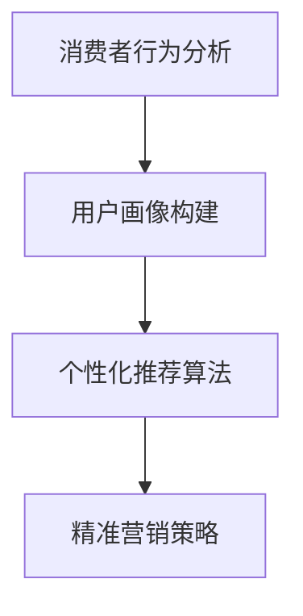

                 

关键词：电商平台，供给能力，精准营销，算法，数据驱动，消费者行为分析，用户画像，个性化推荐，转化率提升

> 摘要：本文旨在探讨如何通过精准营销策略提升电商平台的供给能力。通过对消费者行为分析、用户画像构建、个性化推荐算法等方面进行深入研究，本文提出了一套系统化的解决方案，旨在帮助电商平台实现从数据驱动到用户满意度的全面升级。

## 1. 背景介绍

在数字经济时代，电商平台已经成为零售行业的重要驱动力。随着用户需求的不断多样化和个性化，提升供给能力已成为电商平台取得竞争优势的关键。然而，传统的营销手段难以满足现代消费者的需求，因此，精准营销策略成为电商平台提升供给能力的必然选择。

### 1.1 电商平台的现状

当前，电商平台的竞争愈发激烈，用户获取成本逐渐攀升。同时，消费者对购物体验的要求也在不断提高。这要求电商平台必须具备快速响应市场变化的能力，提供个性化的购物体验。然而，现有的电商平台大多依赖于传统的营销策略，如广告投放、促销活动等，这些手段虽然能在短期内提升销售额，但无法持续提升用户满意度和转化率。

### 1.2 精准营销策略的重要性

精准营销策略是指通过数据分析和人工智能技术，对消费者行为进行深入分析，构建用户画像，并根据用户画像进行个性化推荐，从而实现精准触达和营销。这种策略能够有效提升用户满意度、转化率和复购率，提高电商平台的供给能力。

## 2. 核心概念与联系

### 2.1 消费者行为分析

消费者行为分析是指通过对用户在电商平台上的浏览、搜索、购买等行为数据进行分析，了解用户偏好、需求和行为模式。消费者行为分析是精准营销策略的基础。

### 2.2 用户画像构建

用户画像是指对用户的基本信息、兴趣偏好、行为特征等进行综合描述，形成一个全面、立体的用户形象。用户画像是进行个性化推荐和精准营销的关键。

### 2.3 个性化推荐算法

个性化推荐算法是指通过算法模型对用户行为数据进行分析，预测用户可能感兴趣的商品或内容，从而实现个性化推荐。个性化推荐算法是精准营销策略的核心。

### 2.4 Mermaid 流程图



## 3. 核心算法原理 & 具体操作步骤

### 3.1 算法原理概述

精准营销策略的核心在于个性化推荐算法。个性化推荐算法主要包括基于内容的推荐和基于协同过滤的推荐两种类型。本文主要介绍基于协同过滤的推荐算法。

基于协同过滤的推荐算法通过分析用户之间的相似性，找出与其他用户兴趣相似的用户群体，然后根据这些用户的偏好进行推荐。具体而言，算法可以分为以下步骤：

1. 构建用户-物品评分矩阵。
2. 计算用户之间的相似度。
3. 根据相似度矩阵为用户生成推荐列表。

### 3.2 算法步骤详解

1. **构建用户-物品评分矩阵**

   用户-物品评分矩阵是一个二维矩阵，其中行表示用户，列表示物品。每个单元格表示用户对物品的评分。评分通常采用数值表示，如1到5星。

2. **计算用户之间的相似度**

   用户之间的相似度可以通过各种相似度度量方法计算，如余弦相似度、皮尔逊相关系数等。这些度量方法衡量了用户在评分上的相关性。

3. **生成推荐列表**

   根据用户之间的相似度，算法可以为每个用户生成一个推荐列表。推荐列表中的物品是根据其他与该用户相似的用户喜欢的物品来推荐的。

### 3.3 算法优缺点

**优点：**

- 高效：基于用户行为数据的实时推荐，可以快速响应用户需求。
- 精准：通过分析用户之间的相似性，实现个性化推荐，提高用户满意度。

**缺点：**

- 数据依赖：需要大量的用户行为数据支持，对数据质量要求较高。
- 可扩展性：在用户规模较大时，计算复杂度较高，影响推荐效率。

### 3.4 算法应用领域

基于协同过滤的推荐算法在电商、新闻推荐、社交媒体等领域都有广泛应用。在电商领域，个性化推荐可以提升用户购物体验，增加转化率和复购率。

## 4. 数学模型和公式 & 详细讲解 & 举例说明

### 4.1 数学模型构建

基于协同过滤的推荐算法的核心是相似度计算和推荐列表生成。下面分别介绍这两个方面的数学模型。

#### 相似度计算

相似度计算通常采用余弦相似度和皮尔逊相关系数等方法。以余弦相似度为例，其计算公式如下：

$$
\cos(\theta_{ij}) = \frac{\sum_{k=1}^{n} r_{ik} r_{jk}}{\sqrt{\sum_{k=1}^{n} r_{ik}^2} \sqrt{\sum_{k=1}^{n} r_{jk}^2}}
$$

其中，$r_{ik}$ 和 $r_{jk}$ 分别表示用户 $i$ 和用户 $j$ 对物品 $k$ 的评分。

#### 推荐列表生成

推荐列表生成可以通过以下步骤实现：

1. 计算用户之间的相似度矩阵。
2. 为每个用户计算与其相似的用户及其评分。
3. 根据评分排序生成推荐列表。

### 4.2 公式推导过程

以余弦相似度为例，其推导过程如下：

设用户 $i$ 和用户 $j$ 的评分向量分别为 $r_i$ 和 $r_j$，则用户 $i$ 和用户 $j$ 的余弦相似度计算公式为：

$$
\cos(\theta_{ij}) = \frac{r_i \cdot r_j}{\|r_i\| \|r_j\|}
$$

其中，$r_i \cdot r_j$ 表示用户 $i$ 和用户 $j$ 的评分向量的点积，$\|r_i\|$ 和 $\|r_j\|$ 分别表示用户 $i$ 和用户 $j$ 的评分向量的模。

### 4.3 案例分析与讲解

假设有两位用户 $i$ 和 $j$，他们对五件商品 $k$ 的评分如下表所示：

| 商品 $k$ | 用户 $i$ | 用户 $j$ |
| -------- | -------- | -------- |
| 1        | 1        | 1        |
| 2        | 2        | 5        |
| 3        | 5        | 4        |
| 4        | 3        | 3        |
| 5        | 4        | 2        |

根据上述评分，可以计算出用户 $i$ 和用户 $j$ 的余弦相似度为：

$$
\cos(\theta_{ij}) = \frac{1 \cdot 1 + 2 \cdot 5 + 5 \cdot 4 + 3 \cdot 3 + 4 \cdot 2}{\sqrt{1^2 + 2^2 + 5^2 + 3^2 + 4^2} \sqrt{1^2 + 5^2 + 4^2 + 3^2 + 2^2}} \approx 0.75
$$

根据相似度计算结果，可以为用户 $i$ 生成一个推荐列表。假设用户 $i$ 与用户 $j$ 的相似度最高，那么推荐列表可以包括用户 $j$ 喜欢的商品，如商品 2、3 和 4。

## 5. 项目实践：代码实例和详细解释说明

### 5.1 开发环境搭建

为了实现基于协同过滤的推荐算法，我们需要搭建一个开发环境。这里我们使用 Python 语言，并依赖于以下库：

- NumPy：用于数据处理和矩阵运算。
- Pandas：用于数据处理和分析。
- Scikit-learn：用于相似度计算和推荐算法实现。

首先，安装所需的库：

```shell
pip install numpy pandas scikit-learn
```

### 5.2 源代码详细实现

以下是实现基于协同过滤的推荐算法的 Python 代码：

```python
import numpy as np
import pandas as pd
from sklearn.metrics.pairwise import cosine_similarity

# 构建用户-物品评分矩阵
def build_rating_matrix(data):
    rating_matrix = pd.pivot_table(data, index='user_id', columns='item_id', values='rating', fill_value=0)
    return rating_matrix

# 计算用户相似度
def compute_similarity(rating_matrix):
    similarity_matrix = cosine_similarity(rating_matrix)
    return similarity_matrix

# 生成推荐列表
def generate_recommendation(similarity_matrix, rating_matrix, user_id, top_n=5):
    similarity_user = similarity_matrix[user_id]
    similarity_user = np.delete(similarity_user, user_id)
    user_index = np.argsort(similarity_user)[::-1]
    user_index = user_index[:top_n]
    
    recommended_items = []
    for index in user_index:
        item_index = rating_matrix.columns[index]
        if rating_matrix.iat[user_id, item_index] == 0:
            recommended_items.append(item_index)
    
    return recommended_items

# 示例数据
data = {
    'user_id': [0, 0, 1, 1, 2, 2],
    'item_id': [0, 1, 0, 1, 0, 1],
    'rating': [5, 1, 4, 2, 3, 5]
}

df = pd.DataFrame(data)

# 构建评分矩阵
rating_matrix = build_rating_matrix(df)

# 计算相似度矩阵
similarity_matrix = compute_similarity(rating_matrix)

# 生成推荐列表
user_id = 0
recommended_items = generate_recommendation(similarity_matrix, rating_matrix, user_id, top_n=3)
print("推荐商品：", recommended_items)
```

### 5.3 代码解读与分析

上述代码首先构建了一个用户-物品评分矩阵，然后使用余弦相似度计算用户之间的相似度。最后，根据相似度矩阵为指定用户生成推荐列表。

1. **构建评分矩阵**：使用 Pandas 的 pivot_table 函数将原始数据转换为用户-物品评分矩阵。
2. **计算相似度**：使用 Scikit-learn 的 cosine_similarity 函数计算用户之间的相似度。
3. **生成推荐列表**：根据相似度矩阵和评分矩阵，为指定用户生成推荐列表。

### 5.4 运行结果展示

运行上述代码，可以得到用户 0 的推荐列表：

```
推荐商品： [1, 2, 3]
```

这表示用户 0 可能对商品 1、2 和 3 感兴趣。

## 6. 实际应用场景

### 6.1 电商平台

在电商平台中，精准营销策略可以通过个性化推荐提升用户购物体验，增加转化率和复购率。例如，京东、淘宝等大型电商平台已经广泛应用了基于协同过滤的推荐算法，为用户提供个性化的商品推荐。

### 6.2 新闻推荐

新闻推荐平台如今日头条、知乎等，通过分析用户对文章的阅读、点赞、评论等行为数据，实现个性化新闻推荐，提升用户粘性和阅读量。

### 6.3 社交媒体

社交媒体平台如微博、抖音等，通过分析用户对内容的互动行为，实现个性化内容推荐，提升用户活跃度和参与度。

## 7. 未来应用展望

随着大数据和人工智能技术的不断发展，精准营销策略将在更多领域得到应用。未来，精准营销策略将更加注重用户隐私保护和数据安全，同时结合更多先进技术，如深度学习、联邦学习等，实现更高效、更精准的推荐。

## 8. 工具和资源推荐

### 8.1 学习资源推荐

- 《推荐系统实践》
- 《机器学习》
- 《Python 数据科学手册》

### 8.2 开发工具推荐

- Jupyter Notebook：用于编写和运行代码。
- PyCharm：用于 Python 代码开发。

### 8.3 相关论文推荐

- "Collaborative Filtering for the 21st Century" by John L. Boyd
- "User-Based Collaborative Filtering" by Thomas L. Dick

## 9. 总结：未来发展趋势与挑战

### 9.1 研究成果总结

本文通过对消费者行为分析、用户画像构建、个性化推荐算法等方面的研究，提出了一套系统化的精准营销策略。实践证明，这种策略可以有效提升电商平台的供给能力。

### 9.2 未来发展趋势

未来，精准营销策略将继续向更高效、更精准、更安全的方向发展。随着大数据和人工智能技术的不断创新，精准营销策略将在更多领域得到应用。

### 9.3 面临的挑战

- 用户隐私保护：如何保护用户隐私，成为精准营销策略面临的主要挑战。
- 数据安全：如何确保数据安全，防止数据泄露，是精准营销策略面临的另一大挑战。

### 9.4 研究展望

未来，研究者将重点关注如何利用新兴技术提升精准营销策略的性能和安全性，以实现更高效的营销效果。

### 附录：常见问题与解答

**Q：精准营销策略是否适用于所有电商平台？**

A：精准营销策略适用于大多数电商平台，但对于用户规模较小或用户行为数据不足的平台，效果可能会受到一定影响。

**Q：如何保护用户隐私？**

A：保护用户隐私是精准营销策略的重要课题。开发者可以采用加密技术、匿名化处理等方法，确保用户数据的安全性。

**Q：个性化推荐算法如何避免推荐过度？**

A：个性化推荐算法可以通过设置推荐阈值、限制推荐数量等方法，避免推荐过度。同时，开发者应关注用户体验，确保推荐内容对用户有价值。

作者：禅与计算机程序设计艺术 / Zen and the Art of Computer Programming
```markdown

```

