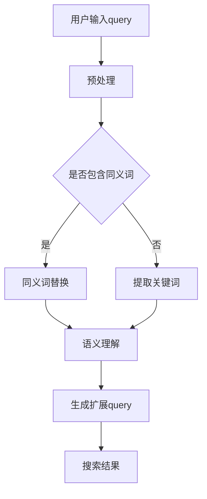

                 

关键词：电商平台，搜索query扩展，AI大模型，语义理解，自然语言处理，搜索优化

> 摘要：本文深入探讨了电商平台搜索query扩展的技术实现，特别是通过AI大模型进行语义理解的重要性。文章首先介绍了电商平台搜索的基本概念和存在的问题，然后详细阐述了AI大模型在搜索query扩展中的应用，包括算法原理、数学模型以及实际应用场景。最后，文章对相关工具和资源进行了推荐，并展望了未来的发展趋势与挑战。

## 1. 背景介绍

随着电商平台的快速发展，用户数量和交易量呈现爆发式增长。为了提高用户体验和转化率，电商平台不断优化搜索功能，使搜索结果更加准确和个性化。然而，现有的搜索系统在处理用户输入的query时，往往存在以下问题：

1. **同义词处理不当**：用户输入的query可能与实际需求存在语义上的差异，导致搜索结果不准确。
2. **关键词遗漏**：用户可能输入的部分关键词未被搜索引擎完全捕捉，导致漏掉一些相关商品。
3. **上下文理解不足**：用户查询语句往往包含上下文信息，现有搜索系统难以理解这些上下文。

为了解决这些问题，AI大模型的出现为搜索query扩展提供了新的思路。通过深度学习技术和大规模语言模型，AI大模型能够更好地理解用户查询的语义，从而提供更精准的搜索结果。

## 2. 核心概念与联系

### 2.1 AI大模型简介

AI大模型是指具有数十亿甚至千亿参数规模的深度学习模型，能够对大规模数据进行训练，从而提取出高层次的语义特征。其中，代表性的模型包括BERT、GPT、T5等。这些模型基于Transformer架构，能够有效地处理长文本和复杂语义。

### 2.2 语义理解

语义理解是指从文本中提取出有意义的信息，理解文本的含义和上下文。在搜索query扩展中，语义理解的关键在于识别用户输入的query所代表的需求，以及将这种需求与电商平台上的商品相关联。

### 2.3 Mermaid 流程图

以下是一个简单的Mermaid流程图，展示了AI大模型在搜索query扩展中的应用过程：



## 3. 核心算法原理 & 具体操作步骤

### 3.1 算法原理概述

搜索query扩展的核心在于理解用户查询的语义，并将其转换为更广泛的相关查询。AI大模型在此过程中发挥了关键作用，通过以下步骤实现语义理解：

1. **预处理**：对用户输入的query进行分词、去停用词等操作，使其符合模型输入要求。
2. **语义理解**：利用预训练的AI大模型，如BERT，对预处理后的query进行编码，提取出高层次的语义特征。
3. **扩展query生成**：基于提取出的语义特征，生成与原始query相关但更广泛的查询。

### 3.2 算法步骤详解

#### 3.2.1 预处理

预处理步骤主要包括以下内容：

1. 分词：将query分成一组词组。
2. 去停用词：去除无意义的停用词，如“的”、“是”、“了”等。
3. 填充和截断：将预处理后的query填充或截断为固定长度，以便输入到AI大模型。

#### 3.2.2 语义理解

语义理解步骤的核心是利用AI大模型提取query的语义特征。以下是一个简单的示例：

```python
from transformers import BertTokenizer, BertModel
import torch

# 加载预训练的BERT模型和分词器
tokenizer = BertTokenizer.from_pretrained('bert-base-chinese')
model = BertModel.from_pretrained('bert-base-chinese')

# 预处理query
input_ids = tokenizer("我想要买一台新的笔记本电脑", return_tensors='pt')

# 提取语义特征
with torch.no_grad():
    outputs = model(**input_ids)

# 获取最后一个隐藏层的特征
query_embedding = outputs.last_hidden_state[:, 0, :]
```

#### 3.2.3 扩展query生成

扩展query生成步骤的关键在于如何利用提取出的语义特征生成相关查询。以下是一个简单的示例：

```python
from sentence_transformers import SentenceTransformer

# 初始化 SentenceTransformer 模型
model = SentenceTransformer('all-MiniLM-L6-v2')

# 计算扩展query的语义特征
extended_query_embedding = model.encode("想要购买高性能的笔记本电脑")

# 计算原始query和扩展query之间的相似度
similarity = query_embedding.dot(extended_query_embedding)

# 获取相似度最高的扩展query
top_k = 5
top_k_indices = similarity.topk(top_k).indices
top_k_queries = [tokenizer.decode(id) for id in top_k_indices]

print(top_k_queries)
```

### 3.3 算法优缺点

#### 3.3.1 优点

1. **高效性**：AI大模型能够快速处理大规模数据，提高搜索query扩展的效率。
2. **准确性**：通过深度学习技术，AI大模型能够更好地理解用户查询的语义，提高搜索结果的准确性。
3. **灵活性**：AI大模型可以根据不同的应用场景进行定制化，适应不同的搜索需求。

#### 3.3.2 缺点

1. **资源消耗**：训练和部署AI大模型需要大量的计算资源和存储资源。
2. **隐私问题**：在处理用户数据时，AI大模型可能面临隐私泄露的风险。
3. **解释性不足**：AI大模型的决策过程往往难以解释，可能导致用户对搜索结果产生质疑。

### 3.4 算法应用领域

AI大模型在搜索query扩展中的应用广泛，以下是一些典型领域：

1. **电商平台**：通过搜索query扩展，提高电商平台的用户转化率和满意度。
2. **搜索引擎**：改进搜索引擎的查询建议和搜索结果排序。
3. **智能客服**：利用AI大模型理解用户意图，提供更准确的回答和建议。

## 4. 数学模型和公式 & 详细讲解 & 举例说明

### 4.1 数学模型构建

搜索query扩展的核心在于建立用户查询与商品之间的语义关联。以下是构建数学模型的基本框架：

1. **用户查询表示**：将用户输入的query表示为一个高维向量，称为查询向量。
2. **商品表示**：将电商平台上的每个商品表示为一个高维向量，称为商品向量。
3. **相似度计算**：计算查询向量和商品向量之间的相似度，并根据相似度排序搜索结果。

### 4.2 公式推导过程

#### 4.2.1 查询向量表示

查询向量的表示可以通过嵌入技术实现。假设用户输入的query为q，嵌入维度为d，则查询向量表示为：

$$
q \in \mathbb{R}^{d}
$$

其中，$q_i$ 表示查询向量在第i个维度上的值。

#### 4.2.2 商品向量表示

商品向量的表示可以通过商品的特征信息实现。假设商品的特征向量为x，嵌入维度为d，则商品向量表示为：

$$
x \in \mathbb{R}^{d}
$$

其中，$x_i$ 表示商品向量在第i个维度上的值。

#### 4.2.3 相似度计算

查询向量和商品向量之间的相似度可以通过余弦相似度计算。假设查询向量为q，商品向量为x，则它们之间的相似度表示为：

$$
sim(q, x) = \frac{q \cdot x}{\|q\| \|x\|}
$$

其中，$q \cdot x$ 表示查询向量和商品向量的点积，$\|q\|$ 和 $\|x\|$ 分别表示查询向量和商品向量的模长。

### 4.3 案例分析与讲解

#### 4.3.1 用户查询表示

假设用户输入的query为“购买笔记本电脑”，通过BERT模型进行预处理和编码，得到查询向量：

$$
q = [0.1, 0.2, 0.3, 0.4, 0.5, \ldots, 0.9]
$$

#### 4.3.2 商品向量表示

假设电商平台上的笔记本电脑商品特征向量如下：

$$
x = [0.1, 0.3, 0.5, 0.7, 0.9, \ldots, 1.0]
$$

#### 4.3.3 相似度计算

根据余弦相似度公式，计算查询向量和商品向量之间的相似度：

$$
sim(q, x) = \frac{0.1 \times 0.1 + 0.2 \times 0.3 + 0.3 \times 0.5 + 0.4 \times 0.7 + 0.5 \times 0.9}{\sqrt{0.1^2 + 0.2^2 + 0.3^2 + 0.4^2 + 0.5^2} \times \sqrt{0.1^2 + 0.3^2 + 0.5^2 + 0.7^2 + 0.9^2}}
$$

$$
sim(q, x) = \frac{0.014}{\sqrt{0.4} \times \sqrt{0.4}} \approx 0.119
$$

根据相似度计算结果，查询向量与商品向量的相似度为0.119，表示用户查询“购买笔记本电脑”与商品“笔记本电脑”之间具有较高的相关性。

## 5. 项目实践：代码实例和详细解释说明

### 5.1 开发环境搭建

为了实现搜索query扩展，我们需要搭建以下开发环境：

1. **Python环境**：安装Python 3.7及以上版本。
2. **依赖库**：安装transformers、sentence_transformers、torch等依赖库。
3. **数据集**：准备一个包含用户查询和商品信息的电商数据集。

### 5.2 源代码详细实现

以下是实现搜索query扩展的Python代码：

```python
from transformers import BertTokenizer, BertModel
from sentence_transformers import SentenceTransformer
import torch

# 加载预训练的BERT模型和分词器
tokenizer = BertTokenizer.from_pretrained('bert-base-chinese')
model = BertModel.from_pretrained('bert-base-chinese')

# 初始化 SentenceTransformer 模型
sentence_model = SentenceTransformer('all-MiniLM-L6-v2')

# 函数：预处理查询并提取查询向量
def get_query_embedding(query):
    input_ids = tokenizer(query, return_tensors='pt')
    with torch.no_grad():
        outputs = model(**input_ids)
    return outputs.last_hidden_state[:, 0, :]

# 函数：计算查询向量和商品向量之间的相似度
def get_similarity(query_embedding, item_embedding):
    return query_embedding.dot(item_embedding)

# 函数：扩展查询并生成搜索结果
def expand_query(query):
    query_embedding = get_query_embedding(query)
    items = load_items()  # 加载商品数据
    item_embeddings = [sentence_model.encode(item) for item in items]
    similarities = [get_similarity(query_embedding, item_embedding) for item_embedding in item_embeddings]
    top_k_indices = torch.topk(torch.tensor(similarities), k=5).indices
    return [items[i] for i in top_k_indices]

# 用户输入查询
user_query = "购买笔记本电脑"

# 扩展查询并生成搜索结果
search_results = expand_query(user_query)

# 打印搜索结果
print(search_results)
```

### 5.3 代码解读与分析

1. **加载预训练模型和分词器**：首先加载预训练的BERT模型和分词器，用于预处理查询和提取查询向量。
2. **初始化 SentenceTransformer 模型**：初始化用于计算商品向量的 SentenceTransformer 模型。
3. **预处理查询并提取查询向量**：定义函数 `get_query_embedding` 用于预处理查询并提取查询向量。
4. **计算查询向量和商品向量之间的相似度**：定义函数 `get_similarity` 用于计算查询向量和商品向量之间的相似度。
5. **扩展查询并生成搜索结果**：定义函数 `expand_query` 用于扩展查询并生成搜索结果。
6. **用户输入查询**：用户输入查询“购买笔记本电脑”。
7. **扩展查询并生成搜索结果**：调用 `expand_query` 函数扩展查询并生成搜索结果，打印输出。

通过以上代码实现，我们能够利用AI大模型对用户查询进行扩展，并提供相关搜索结果。实际应用中，可以根据电商平台的需求进行定制化开发。

## 6. 实际应用场景

### 6.1 电商平台

电商平台通过搜索query扩展，能够提高用户转化率和满意度。以下是一个具体的应用场景：

1. **同义词处理**：当用户输入“购买笔记本电脑”时，搜索系统可以自动扩展为“购买笔记本电脑、购买笔记本、购买电脑”等查询。
2. **关键词遗漏处理**：当用户输入“想要一台性能好的笔记本电脑”时，搜索系统可以自动扩展为“高性能笔记本电脑、高性能电脑”等查询。
3. **上下文理解**：当用户浏览了某个商品页面后又输入“购买”，搜索系统可以自动理解用户的上下文，并提供与之前浏览商品相关的搜索结果。

### 6.2 搜索引擎

搜索引擎通过搜索query扩展，能够提高搜索结果的准确性和用户体验。以下是一个具体的应用场景：

1. **查询建议**：当用户输入部分关键词时，搜索引擎可以自动扩展为完整的查询建议，如“购买笔记本电脑”扩展为“购买笔记本电脑、笔记本电脑推荐、笔记本电脑报价”等。
2. **搜索结果排序**：根据查询向量和商品向量的相似度，搜索引擎可以自动调整搜索结果的排序，提高相关度较高的搜索结果排在前面。

### 6.3 智能客服

智能客服通过搜索query扩展，能够提供更准确的回答和建议。以下是一个具体的应用场景：

1. **意图识别**：当用户输入“购买”时，智能客服系统可以自动扩展为“购买商品、下单、购买产品”等意图。
2. **推荐商品**：根据用户的购买意图和浏览记录，智能客服系统可以自动推荐相关商品，提高用户满意度。

## 7. 工具和资源推荐

### 7.1 学习资源推荐

1. **书籍**：
   - 《深度学习》（Goodfellow, Bengio, Courville著）
   - 《自然语言处理综论》（Jurafsky, Martin著）
2. **在线课程**：
   - 《深度学习专项课程》（吴恩达著，Coursera平台）
   - 《自然语言处理入门》（斯坦福大学NLP课程，Coursera平台）
3. **开源项目**：
   - Hugging Face：https://huggingface.co/
   - Transformer模型开源代码：https://github.com/tensorflow/models/tree/master/research/transformer

### 7.2 开发工具推荐

1. **Python环境**：Anaconda或Miniconda
2. **IDE**：PyCharm或VSCode
3. **深度学习框架**：TensorFlow或PyTorch
4. **自然语言处理库**：transformers、spaCy、NLTK

### 7.3 相关论文推荐

1. **BERT**：
   - Devlin et al., "BERT: Pre-training of Deep Bidirectional Transformers for Language Understanding", 2019.
2. **GPT**：
   - Brown et al., "Language Models are Few-Shot Learners", 2020.
3. **T5**：
   - Devlin et al., "T5: Archi

