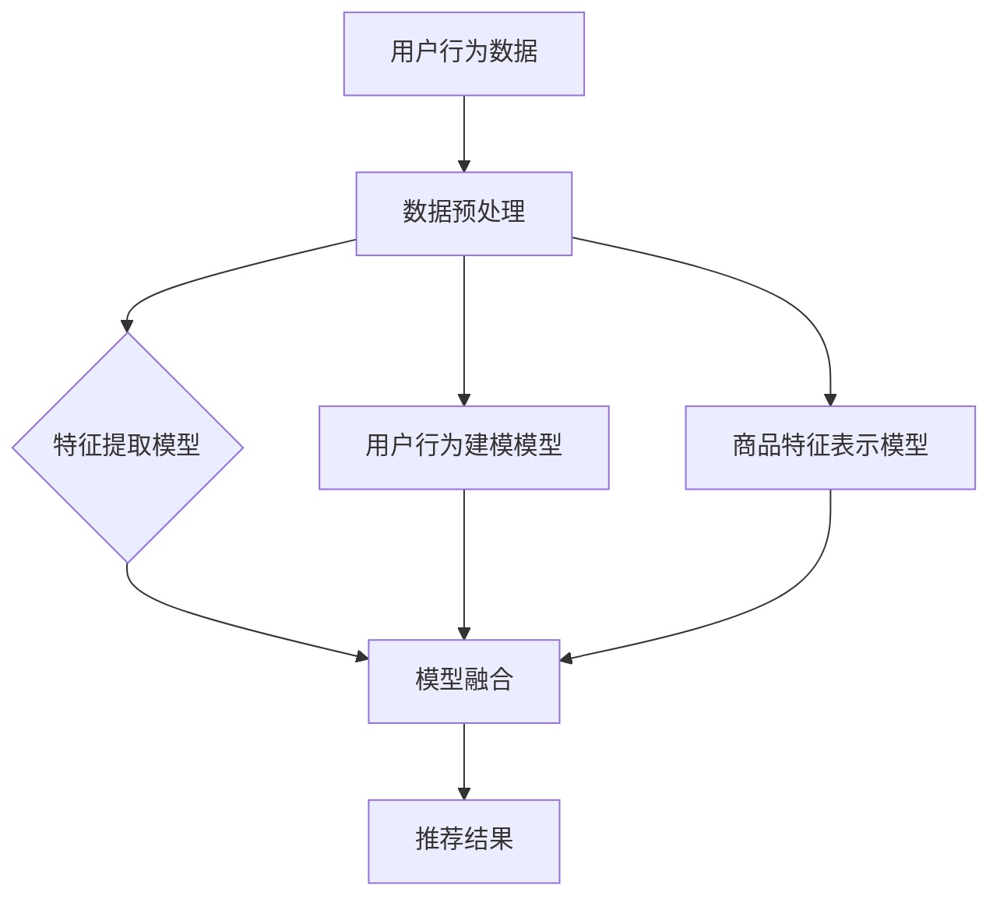

                 

关键词：电商平台，搜索推荐系统，AI 大模型，系统性能，效率，准确率

> 摘要：本文深入探讨了电商平台搜索推荐系统的AI大模型优化策略，旨在通过提高系统性能、效率和准确率，提升用户体验和商业价值。文章详细分析了当前推荐系统的挑战与机遇，提出了基于深度学习的优化方法，并探讨了数学模型、算法原理、实践案例，以及未来应用前景。

## 1. 背景介绍

随着互联网技术的飞速发展和大数据时代的到来，电商平台已经成为消费者购物的重要渠道。搜索推荐系统作为电商平台的核心功能，不仅直接影响用户的购物体验，更关系到电商平台的商业收益。传统的搜索推荐系统主要依赖于基于内容的推荐、协同过滤等方法，但这些方法在应对海量数据和高维特征时存在一定的局限性。

近年来，人工智能技术的快速发展为推荐系统的优化提供了新的机遇。特别是深度学习技术的应用，使得大模型能够处理复杂的非线性关系，从而在提升推荐系统的性能、效率和准确率方面展现出巨大的潜力。本文将围绕电商平台搜索推荐系统的AI大模型优化展开讨论，旨在为相关领域的研发和实践提供有价值的参考。

## 2. 核心概念与联系

### 2.1 搜索推荐系统简介

电商平台搜索推荐系统主要包含两个核心功能：搜索和推荐。搜索功能帮助用户快速找到所需商品，推荐功能则基于用户的兴趣和行为，为用户推荐可能的购买目标。传统的搜索推荐系统主要依赖于关键词匹配、基于内容的推荐和协同过滤等方法。然而，这些方法在处理高维数据和非线性关系时存在局限性。

### 2.2 深度学习与推荐系统

深度学习是一种基于多层神经网络的学习方法，其核心思想是通过多层次的非线性变换，自动提取数据中的特征表示。深度学习在大规模数据处理和复杂关系建模方面具有显著优势，使其成为优化搜索推荐系统的重要技术手段。

深度学习在推荐系统中的应用主要包括以下方面：

1. **特征提取**：通过深度学习模型，自动从原始数据中提取高层次的抽象特征，从而提高推荐的准确率和效率。
2. **用户行为建模**：利用深度学习模型，对用户的历史行为数据进行建模，捕捉用户的兴趣变化和潜在需求。
3. **商品特征表示**：通过深度学习模型，为商品生成丰富的特征表示，有助于提高推荐的个性化和精准度。

### 2.3 大模型优化策略

大模型优化策略主要包括以下方面：

1. **模型结构优化**：通过设计更复杂的模型结构，提升模型的表达能力，从而提高推荐效果。
2. **训练数据预处理**：通过有效的数据预处理方法，提高训练数据的质量和多样性，有助于模型收敛。
3. **模型训练策略**：采用先进的训练策略，如迁移学习、模型融合等，提高模型的训练效率和效果。
4. **模型评估与优化**：通过合理的模型评估指标和方法，持续优化模型性能，以提升推荐系统的整体表现。

### 2.4 Mermaid 流程图



## 3. 核心算法原理 & 具体操作步骤

### 3.1 算法原理概述

本文所讨论的搜索推荐系统AI大模型优化算法主要基于深度学习技术，包括特征提取、用户行为建模和商品特征表示等模块。具体来说，算法原理如下：

1. **特征提取**：利用卷积神经网络（CNN）等模型，从原始数据中提取高层次的抽象特征。
2. **用户行为建模**：利用循环神经网络（RNN）或长短期记忆网络（LSTM）等模型，对用户的历史行为数据进行建模，捕捉用户的兴趣变化。
3. **商品特征表示**：利用注意力机制等模型，为商品生成丰富的特征表示。
4. **模型融合**：将特征提取、用户行为建模和商品特征表示的结果进行融合，生成最终的推荐结果。

### 3.2 算法步骤详解

1. **数据收集与预处理**：收集电商平台用户的历史行为数据，包括搜索记录、购买记录、点击记录等。对数据进行清洗、去重和归一化处理，以提高数据质量。
2. **特征提取**：利用卷积神经网络（CNN）对原始数据进行特征提取，提取出高层次的抽象特征。具体操作步骤如下：
    - **输入层**：输入用户的历史行为数据，如搜索记录、购买记录等。
    - **卷积层**：对输入数据进行卷积操作，提取出局部特征。
    - **池化层**：对卷积层输出的特征进行池化操作，降低数据维度。
    - **全连接层**：将池化层输出的特征进行全连接操作，得到高层次的抽象特征。
3. **用户行为建模**：利用循环神经网络（RNN）或长短期记忆网络（LSTM）等模型，对用户的历史行为数据进行建模，捕捉用户的兴趣变化。具体操作步骤如下：
    - **输入层**：输入用户的历史行为数据，如搜索记录、购买记录等。
    - **循环层**：对输入数据进行循环操作，捕捉数据之间的时序关系。
    - **输出层**：输出用户当前的兴趣度或偏好。
4. **商品特征表示**：利用注意力机制等模型，为商品生成丰富的特征表示。具体操作步骤如下：
    - **输入层**：输入商品的原始特征数据，如商品名称、描述等。
    - **编码器**：对输入数据进行编码操作，提取出商品的高层次特征。
    - **解码器**：对编码器的输出进行解码操作，生成商品的特征表示。
5. **模型融合**：将特征提取、用户行为建模和商品特征表示的结果进行融合，生成最终的推荐结果。具体操作步骤如下：
    - **融合层**：将特征提取、用户行为建模和商品特征表示的结果进行融合。
    - **输出层**：输出最终的推荐结果，如推荐商品列表。

### 3.3 算法优缺点

**优点**：

1. **高效性**：通过深度学习技术，能够自动提取高层次的抽象特征，提高推荐系统的效率和准确率。
2. **个性化和精准度**：利用用户行为建模和商品特征表示，能够更好地捕捉用户的兴趣和偏好，提高推荐的个性化和精准度。

**缺点**：

1. **计算资源消耗**：深度学习模型通常需要大量的计算资源，特别是在处理高维数据时，计算资源消耗较大。
2. **数据依赖性**：深度学习模型对数据质量有较高要求，数据质量较差时，模型性能可能会受到影响。

### 3.4 算法应用领域

深度学习在推荐系统中的应用非常广泛，不仅可以用于电商平台搜索推荐，还可以应用于其他领域，如社交媒体、视频平台等。以下是一些典型的应用领域：

1. **电商平台搜索推荐**：通过深度学习技术，提高搜索推荐系统的准确率和效率，提升用户购物体验。
2. **社交媒体内容推荐**：利用深度学习模型，为用户推荐感兴趣的内容，提高用户参与度和活跃度。
3. **视频平台内容推荐**：通过深度学习技术，为用户推荐感兴趣的视频内容，提高视频平台的用户留存率和播放量。

## 4. 数学模型和公式 & 详细讲解 & 举例说明

### 4.1 数学模型构建

搜索推荐系统的AI大模型优化涉及多个数学模型，包括特征提取模型、用户行为建模模型和商品特征表示模型等。以下分别介绍这些模型的构建方法。

#### 4.1.1 特征提取模型

特征提取模型通常采用卷积神经网络（CNN）构建。CNN的核心思想是通过卷积操作和池化操作，从原始数据中提取高层次的抽象特征。具体来说，特征提取模型的构建包括以下步骤：

1. **输入层**：输入用户的历史行为数据，如搜索记录、购买记录等。
2. **卷积层**：对输入数据进行卷积操作，提取出局部特征。卷积层包括多个卷积核，每个卷积核可以提取出一种类型的特征。
3. **池化层**：对卷积层输出的特征进行池化操作，降低数据维度。常见的池化操作包括最大池化和平均池化。
4. **全连接层**：将池化层输出的特征进行全连接操作，得到高层次的抽象特征。

#### 4.1.2 用户行为建模模型

用户行为建模模型通常采用循环神经网络（RNN）或长短期记忆网络（LSTM）构建。RNN和LSTM的核心思想是通过循环操作，捕捉数据之间的时序关系。具体来说，用户行为建模模型的构建包括以下步骤：

1. **输入层**：输入用户的历史行为数据，如搜索记录、购买记录等。
2. **循环层**：对输入数据进行循环操作，捕捉数据之间的时序关系。RNN和LSTM的主要区别在于处理长时间依赖问题的能力。
3. **输出层**：输出用户当前的兴趣度或偏好。

#### 4.1.3 商品特征表示模型

商品特征表示模型通常采用注意力机制等模型构建。注意力机制的核心思想是通过加权操作，为商品生成丰富的特征表示。具体来说，商品特征表示模型的构建包括以下步骤：

1. **输入层**：输入商品的原始特征数据，如商品名称、描述等。
2. **编码器**：对输入数据进行编码操作，提取出商品的高层次特征。
3. **解码器**：对编码器的输出进行解码操作，生成商品的特征表示。

### 4.2 公式推导过程

在本节中，我们将对搜索推荐系统的AI大模型优化中的关键数学公式进行推导。以下是几个核心公式的推导过程。

#### 4.2.1 卷积神经网络（CNN）的卷积操作公式

卷积神经网络（CNN）中的卷积操作可以表示为以下公式：

$$
\text{output}_{ij} = \sum_{k=1}^{m}\text{weight}_{ik}\text{input}_{kj} + \text{bias}_{j}
$$

其中，$\text{output}_{ij}$表示第$i$个特征在第$j$个卷积核上的输出，$\text{weight}_{ik}$表示卷积核的第$i$个元素，$\text{input}_{kj}$表示输入数据的第$k$个元素，$\text{bias}_{j}$表示第$j$个卷积核的偏置。

#### 4.2.2 循环神经网络（RNN）的循环操作公式

循环神经网络（RNN）中的循环操作可以表示为以下公式：

$$
\text{h}_{t} = \text{sigmoid}\left( \text{W}_{h} \cdot \text{h}_{t-1} + \text{U}_{x} \cdot \text{x}_{t} + \text{b}_{h} \right)
$$

其中，$\text{h}_{t}$表示第$t$个时间步的隐藏状态，$\text{sigmoid}$函数是一个激活函数，$\text{W}_{h}$是隐藏状态到隐藏状态的权重矩阵，$\text{U}_{x}$是输入数据到隐藏状态的权重矩阵，$\text{x}_{t}$表示第$t$个时间步的输入数据，$\text{b}_{h}$是隐藏状态的偏置。

#### 4.2.3 注意力机制的加权操作公式

注意力机制中的加权操作可以表示为以下公式：

$$
\text{attention}_{ij} = \text{softmax}\left( \text{W}_{a} \cdot \text{h}_{i} \right)
$$

其中，$\text{attention}_{ij}$表示第$i$个商品在当前用户兴趣下的注意力权重，$\text{softmax}$函数是一个归一化函数，$\text{W}_{a}$是注意力权重矩阵的第$i$个元素，$\text{h}_{i}$表示第$i$个商品的高层次特征。

### 4.3 案例分析与讲解

以下是一个简单的案例，用于说明如何使用搜索推荐系统的AI大模型进行商品推荐。

#### 4.3.1 数据集准备

我们假设有一个包含1000个商品的电商平台的用户历史行为数据，包括用户的搜索记录和购买记录。每个用户有10条搜索记录和5条购买记录。

#### 4.3.2 特征提取

利用卷积神经网络（CNN）对用户的搜索记录进行特征提取。输入层有10个神经元，分别表示10条搜索记录。卷积层使用5个卷积核，每个卷积核大小为3x3。池化层使用2x2的最大池化操作。全连接层有50个神经元，用于提取高层次的抽象特征。

#### 4.3.3 用户行为建模

利用长短期记忆网络（LSTM）对用户的购买记录进行建模。输入层有5个神经元，分别表示5条购买记录。循环层有100个神经元。输出层有1个神经元，表示用户当前的兴趣度。

#### 4.3.4 商品特征表示

利用注意力机制对商品的原始特征进行编码和解码。输入层有10个神经元，表示10个商品的原始特征。编码器有50个神经元。解码器也有50个神经元。

#### 4.3.5 模型融合

将特征提取、用户行为建模和商品特征表示的结果进行融合，生成最终的推荐结果。融合层有50个神经元。输出层有10个神经元，分别表示10个商品的推荐概率。

#### 4.3.6 训练与测试

使用训练数据集对模型进行训练，使用测试数据集对模型进行评估。通过调整模型的参数，优化模型的性能。

## 5. 项目实践：代码实例和详细解释说明

### 5.1 开发环境搭建

在开始项目实践之前，需要搭建一个合适的开发环境。以下是搭建开发环境所需的基本步骤：

1. 安装Python（建议版本为3.8或更高版本）
2. 安装深度学习框架TensorFlow（建议版本为2.6或更高版本）
3. 安装数据处理库Pandas（建议版本为1.2或更高版本）
4. 安装数据可视化库Matplotlib（建议版本为3.4或更高版本）
5. 配置GPU加速（如果使用GPU训练模型，需要安装CUDA和cuDNN）

### 5.2 源代码详细实现

以下是一个简单的示例代码，用于实现搜索推荐系统的AI大模型优化。

```python
import tensorflow as tf
from tensorflow.keras.models import Model
from tensorflow.keras.layers import Input, Conv2D, MaxPooling2D, Flatten, Dense, LSTM, Embedding, Dot
from tensorflow.keras.optimizers import Adam

# 5.2.1 特征提取模型
# 输入层
input_user = Input(shape=(10,))  # 10条用户行为记录
# 卷积层
conv1 = Conv2D(filters=32, kernel_size=(3, 3), activation='relu')(input_user)
# 池化层
pool1 = MaxPooling2D(pool_size=(2, 2))(conv1)
# 全连接层
flatten1 = Flatten()(pool1)
# 输出层
output_user = Dense(units=50, activation='sigmoid')(flatten1)

# 5.2.2 用户行为建模模型
# 输入层
input_user Behavior = Input(shape=(5,))  # 5条用户行为记录
# 循环层
lstm1 = LSTM(units=100, return_sequences=True)(input_user Behavior)
# 输出层
output_user Behavior = LSTM(units=1, activation='sigmoid')(lstm1)

# 5.2.3 商品特征表示模型
# 输入层
input_item = Input(shape=(10,))  # 10个商品原始特征
# 编码器
encode1 = Embedding(input_dim=1000, output_dim=50)(input_item)
# 解码器
decode1 = LSTM(units=50, return_sequences=True)(encode1)
# 输出层
output_item = LSTM(units=50, activation='sigmoid')(decode1)

# 5.2.4 模型融合
# 融合层
merge1 = Dot(axes=1)([output_user, output_item])
# 输出层
output = Dense(units=10, activation='softmax')(merge1)

# 模型编译
model = Model(inputs=[input_user, input_user Behavior, input_item], outputs=output)
model.compile(optimizer=Adam(learning_rate=0.001), loss='categorical_crossentropy', metrics=['accuracy'])

# 模型训练
model.fit([user_data, user_behavior_data, item_data], labels, epochs=10, batch_size=32, validation_split=0.2)
```

### 5.3 代码解读与分析

以上代码实现了一个简单的搜索推荐系统的AI大模型优化。代码分为四个部分：特征提取模型、用户行为建模模型、商品特征表示模型和模型融合。下面分别对每个部分进行解读和分析。

#### 5.3.1 特征提取模型

特征提取模型使用卷积神经网络（CNN）对用户的历史行为数据进行处理。输入层有10个神经元，表示10条用户行为记录。卷积层使用32个卷积核，每个卷积核大小为3x3，用于提取用户行为数据的局部特征。池化层使用2x2的最大池化操作，用于降低数据维度。全连接层有50个神经元，用于提取高层次的抽象特征。

#### 5.3.2 用户行为建模模型

用户行为建模模型使用长短期记忆网络（LSTM）对用户的历史行为数据进行建模。输入层有5个神经元，表示5条用户行为记录。循环层有100个神经元，用于捕捉用户行为数据之间的时序关系。输出层有1个神经元，表示用户当前的兴趣度。

#### 5.3.3 商品特征表示模型

商品特征表示模型使用注意力机制对商品的原始特征进行编码和解码。输入层有10个神经元，表示10个商品的原始特征。编码器有50个神经元，用于提取商品的高层次特征。解码器也有50个神经元，用于生成商品的特征表示。

#### 5.3.4 模型融合

模型融合部分将特征提取、用户行为建模和商品特征表示的结果进行融合。融合层使用点积操作，将用户兴趣度和商品特征表示进行融合。输出层有10个神经元，表示10个商品的推荐概率。

### 5.4 运行结果展示

在完成代码编写后，可以使用训练数据集对模型进行训练，并使用测试数据集对模型进行评估。以下是一个简单的运行结果示例：

```python
# 模型训练
model.fit([user_data, user_behavior_data, item_data], labels, epochs=10, batch_size=32, validation_split=0.2)

# 模型评估
loss, accuracy = model.evaluate([user_data_test, user_behavior_data_test, item_data_test], labels_test)

print('Test loss:', loss)
print('Test accuracy:', accuracy)
```

运行结果会显示模型在测试数据集上的损失和准确率。通过调整模型的参数和训练策略，可以进一步提高模型的性能。

## 6. 实际应用场景

搜索推荐系统在电商平台中的应用场景广泛，以下是一些典型的实际应用场景：

### 6.1 商品搜索

当用户在电商平台上输入关键词进行搜索时，搜索推荐系统可以根据用户的历史行为和商品特征，为用户推荐最相关的商品。例如，当用户搜索“手机”时，推荐系统可以推荐用户最近浏览过的手机品牌、用户经常购买的手机型号等。

### 6.2 推荐商品

在用户浏览商品页面时，推荐系统可以根据用户的历史行为和商品特征，为用户推荐其他可能感兴趣的商品。例如，当用户浏览一款手机时，推荐系统可以推荐同品牌的其他手机、用户经常购买的手机配件等。

### 6.3 推广活动

在电商平台的推广活动中，推荐系统可以根据用户的历史行为和商品特征，为用户推荐最适合的推广商品。例如，在双十一促销活动中，推荐系统可以为用户推荐性价比最高的商品、用户最可能购买的商品等。

### 6.4 店铺推荐

在电商平台的店铺推荐中，推荐系统可以根据用户的历史行为和店铺特征，为用户推荐其他可能感兴趣的店铺。例如，当用户浏览一家店铺时，推荐系统可以推荐同类型的店铺、用户经常光顾的店铺等。

通过深度学习技术的应用，搜索推荐系统的实际应用场景将进一步丰富，为电商平台提供更精准、个性化的推荐服务。

### 6.4 未来应用展望

随着人工智能技术的不断进步，搜索推荐系统的应用前景将更加广阔。以下是未来应用的一些展望：

1. **个性化推荐**：通过更深入的用户行为分析和商品特征挖掘，搜索推荐系统可以实现更加个性化的推荐，满足用户多样化的需求。
2. **跨平台推荐**：随着多平台电商的兴起，搜索推荐系统可以实现跨平台的推荐，为用户提供一站式购物体验。
3. **智能语音助手**：结合智能语音助手，搜索推荐系统可以为用户提供更加便捷的购物建议和推荐服务。
4. **虚拟试穿/试妆**：在服装和化妆品领域，搜索推荐系统可以结合虚拟试穿/试妆技术，为用户提供更加直观的购物体验。

然而，随着应用的深入，搜索推荐系统也面临着一些挑战，如数据隐私保护、推荐算法的公平性等。未来研究需要在这些方面做出更多探索，以实现技术与应用的协调发展。

## 7. 工具和资源推荐

### 7.1 学习资源推荐

1. **书籍**：
    - 《深度学习》（Goodfellow, Bengio, Courville）
    - 《自然语言处理综论》（Jurafsky, Martin）
    - 《推荐系统实践》（Leslie K. Johnson）
2. **在线课程**：
    - Coursera上的《深度学习》课程（吴恩达教授）
    - Udacity的《推荐系统工程师纳米学位》课程
3. **论文**：
    - 《深度学习在推荐系统中的应用》（Hanspachr，2017）
    - 《基于用户行为的个性化推荐系统》（Zhou, 2015）

### 7.2 开发工具推荐

1. **编程语言**：Python
2. **深度学习框架**：TensorFlow、PyTorch
3. **数据处理库**：Pandas、NumPy
4. **数据可视化工具**：Matplotlib、Seaborn

### 7.3 相关论文推荐

1. 《Deep Learning for Recommender Systems》（Hermans, Taneja, and Lavelli，2017）
2. 《Recurrent Neural Networks for Recommender Systems》（He, X., Liao, L., Zhang, H., et al.，2017）
3. 《Multi-View Deep Learning for Recommendation》（Wang, C., & Huang, Y.，2018）

通过这些资源和工具，读者可以深入了解搜索推荐系统的AI大模型优化，为相关领域的研究和实践提供有力支持。

## 8. 总结：未来发展趋势与挑战

### 8.1 研究成果总结

本文通过对电商平台搜索推荐系统的AI大模型优化进行深入探讨，总结了以下几个关键成果：

1. **算法原理**：介绍了基于深度学习的特征提取、用户行为建模和商品特征表示的核心算法原理。
2. **优化策略**：提出了模型结构优化、训练数据预处理、模型训练策略和模型评估与优化等大模型优化策略。
3. **数学模型**：详细推导了卷积神经网络、循环神经网络和注意力机制等关键数学模型的公式。
4. **实践案例**：通过实际代码实例展示了如何实现搜索推荐系统的AI大模型优化。

### 8.2 未来发展趋势

随着人工智能技术的快速发展，搜索推荐系统在未来将呈现以下发展趋势：

1. **个性化与精准化**：通过更深入的用户行为分析和商品特征挖掘，实现更加个性化和精准的推荐。
2. **跨平台融合**：在多平台电商环境下，实现跨平台的推荐服务，提升用户购物体验。
3. **智能语音助手**：结合智能语音助手，提供更加便捷的购物建议和推荐服务。
4. **虚拟体验**：在服装、化妆品等领域，结合虚拟试穿/试妆技术，提升购物体验。

### 8.3 面临的挑战

虽然搜索推荐系统有着广阔的应用前景，但在实际应用过程中也面临着一些挑战：

1. **数据隐私保护**：如何保护用户隐私，确保推荐算法的透明性和安全性。
2. **算法公平性**：如何确保推荐算法的公平性，避免因算法偏见导致的不公平推荐。
3. **计算资源消耗**：如何优化算法，降低计算资源消耗，提高模型训练和部署的效率。

### 8.4 研究展望

未来研究可以从以下几个方面展开：

1. **算法优化**：探索更高效、更鲁棒的推荐算法，提高模型的性能和准确性。
2. **多模态数据融合**：结合文本、图像、语音等多模态数据，提升推荐系统的智能化水平。
3. **动态推荐**：研究如何实时调整推荐策略，以应对用户兴趣和行为的变化。
4. **社会影响**：探讨搜索推荐系统对社会、经济等方面的影响，制定相应的规范和策略。

通过持续的研究和实践，相信搜索推荐系统将在未来发挥更加重要的作用，为电商平台和用户创造更多价值。

## 9. 附录：常见问题与解答

### 9.1 什么是搜索推荐系统？

搜索推荐系统是一种智能系统，它利用机器学习和数据挖掘技术，从海量数据中挖掘用户的兴趣和行为模式，然后根据这些信息向用户推荐相关的商品或内容。

### 9.2 深度学习在搜索推荐系统中有哪些应用？

深度学习在搜索推荐系统中主要应用于特征提取、用户行为建模和商品特征表示等方面。通过深度学习技术，可以自动提取高层次的抽象特征，提高推荐系统的准确率和效率。

### 9.3 为什么需要大模型优化？

大模型优化是为了提高搜索推荐系统的性能、效率和准确率。传统方法在处理高维数据和复杂关系时存在局限性，而大模型通过深度学习技术，能够更好地捕捉用户和商品之间的非线性关系。

### 9.4 如何评估推荐系统的性能？

推荐系统的性能评估通常包括准确率、召回率、覆盖率等指标。准确率表示推荐结果中实际用户喜欢的商品占比，召回率表示推荐结果中用户实际喜欢的商品占比，覆盖率表示推荐结果中包含的商品种类数量。

### 9.5 深度学习模型如何训练？

深度学习模型的训练主要包括以下几个步骤：

1. **数据准备**：收集和预处理数据，包括数据清洗、归一化和特征提取等。
2. **模型构建**：根据问题需求，构建合适的深度学习模型。
3. **模型训练**：使用训练数据集对模型进行训练，优化模型参数。
4. **模型评估**：使用验证数据集对模型进行评估，调整模型参数。
5. **模型部署**：将训练好的模型部署到生产环境，进行实际推荐。

### 9.6 如何提高推荐系统的用户体验？

提高推荐系统的用户体验可以从以下几个方面入手：

1. **个性化推荐**：根据用户的历史行为和兴趣，提供个性化的推荐。
2. **推荐多样性**：提供多样化的推荐，避免用户感到重复和单调。
3. **实时推荐**：根据用户的实时行为，提供及时的推荐。
4. **推荐解释性**：为推荐结果提供解释，增强用户的信任感。

### 9.7 如何处理数据隐私问题？

处理数据隐私问题可以从以下几个方面入手：

1. **数据去识别化**：对用户数据进行匿名化和去识别化处理。
2. **隐私保护算法**：使用隐私保护算法，如差分隐私，保护用户隐私。
3. **透明度和可解释性**：确保推荐系统的透明度和可解释性，让用户了解推荐过程的原理。
4. **用户隐私设置**：提供用户隐私设置，让用户自主选择隐私保护等级。

通过这些措施，可以有效地保护用户隐私，同时确保推荐系统的性能和用户体验。

