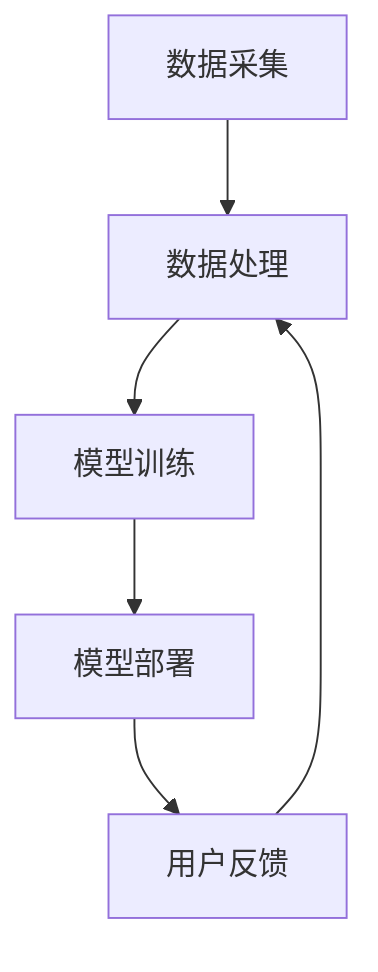

                 

关键词：电商平台，搜索推荐系统，AI 大模型，数据规模，数据质量

摘要：随着互联网的飞速发展，电商平台之间的竞争日益激烈。如何为用户提供个性化的搜索推荐服务成为电商平台的核心竞争力。本文将探讨使用人工智能大模型来构建高效的搜索推荐系统，并深入分析如何应对数据规模与质量的双重挑战。

## 1. 背景介绍

在过去的几十年里，电子商务已经成为全球范围内最具活力和潜力的行业之一。随着用户数量的增加，电商平台需要不断提升用户体验，以吸引和留住用户。搜索推荐系统作为电商平台的灵魂，它不仅帮助用户快速找到所需商品，还能通过个性化推荐提升用户粘性，从而增加平台销售额。

传统的搜索推荐系统主要依赖基于内容的过滤和协同过滤等算法。这些算法在数据量较小且用户行为数据较为均匀时表现良好，但随着数据规模的扩大和用户行为的多样性，它们逐渐暴露出一些问题，如推荐结果不够准确、用户体验差等。为了解决这些问题，人工智能大模型的应用逐渐成为搜索推荐系统发展的重要方向。

## 2. 核心概念与联系

### 2.1 人工智能大模型

人工智能大模型是指通过深度学习技术训练的具有大规模参数的模型，如神经网络、变换器等。这些模型具有强大的特征提取和模式识别能力，能够处理复杂的非线性问题。

### 2.2 搜索推荐系统架构

一个典型的搜索推荐系统架构包括数据采集、数据处理、模型训练、模型部署和用户反馈等环节。数据采集主要涉及用户行为数据、商品数据等；数据处理则包括数据清洗、特征工程等；模型训练是核心环节，通过训练得到能够预测用户兴趣的模型；模型部署则将训练好的模型部署到线上环境，提供实时推荐服务；用户反馈则用于持续优化推荐效果。

### 2.3 Mermaid 流程图

下面是搜索推荐系统的 Mermaid 流程图：



## 3. 核心算法原理 & 具体操作步骤

### 3.1 算法原理概述

搜索推荐系统的核心算法主要包括基于内容的推荐、协同过滤推荐和基于模型的推荐。其中，基于模型的推荐又可以分为基于深度学习的推荐和基于传统机器学习的推荐。本文将主要介绍基于深度学习的推荐算法。

### 3.2 算法步骤详解

1. 数据采集：收集用户行为数据、商品数据等。
2. 数据处理：进行数据清洗、去重、特征提取等操作，将原始数据转化为模型输入。
3. 模型训练：使用训练数据训练深度学习模型，如变换器模型、图神经网络等。
4. 模型评估：使用测试数据评估模型性能，如准确率、召回率等。
5. 模型部署：将训练好的模型部署到线上环境，提供实时推荐服务。
6. 用户反馈：收集用户对推荐结果的反馈，用于模型持续优化。

### 3.3 算法优缺点

优点：
- 能够处理高维数据，提取深层特征。
- 对用户行为数据进行深度挖掘，提高推荐准确率。

缺点：
- 需要大量的数据和计算资源。
- 模型复杂，训练时间较长。

### 3.4 算法应用领域

搜索推荐系统广泛应用于电商、社交媒体、新闻资讯、音乐视频等领域，通过个性化推荐提升用户体验，增加平台收益。

## 4. 数学模型和公式 & 详细讲解 & 举例说明

### 4.1 数学模型构建

搜索推荐系统的数学模型主要涉及用户兴趣表示、商品表示和推荐算法。

用户兴趣表示：使用向量化表示用户兴趣，如用户行为序列、兴趣图谱等。

商品表示：使用向量化表示商品特征，如商品类别、品牌、价格等。

推荐算法：基于用户兴趣和商品特征，计算用户对商品的偏好度，如点积、余弦相似度等。

### 4.2 公式推导过程

用户兴趣表示：$$ \text{user\_vector} = \text{Embedding}(\text{user\_id}) $$

商品表示：$$ \text{item\_vector} = \text{Embedding}(\text{item\_id}) $$

用户对商品的偏好度：$$ \text{score} = \text{dot}(\text{user\_vector}, \text{item\_vector}) $$

### 4.3 案例分析与讲解

以电商平台的商品推荐为例，用户A在近期浏览了商品B和商品C，且购买过商品C。我们可以将用户A的兴趣表示为$ \text{user\_vector} = [0.6, 0.3, 0.1, 0.0] $，商品B和商品C的特征表示分别为$ \text{item\_vector\_B} = [0.2, 0.8, 0.0, 0.0] $和$ \text{item\_vector\_C} = [0.8, 0.2, 0.0, 0.0] $。

计算用户A对商品B和商品C的偏好度：

$$ \text{score\_B} = \text{dot}(\text{user\_vector}, \text{item\_vector\_B}) = 0.6 \times 0.2 + 0.3 \times 0.8 + 0.1 \times 0.0 + 0.0 \times 0.0 = 0.26 $$

$$ \text{score\_C} = \text{dot}(\text{user\_vector}, \text{item\_vector\_C}) = 0.6 \times 0.8 + 0.3 \times 0.2 + 0.1 \times 0.0 + 0.0 \times 0.0 = 0.56 $$

根据偏好度计算结果，我们可以为用户A推荐商品C。

## 5. 项目实践：代码实例和详细解释说明

### 5.1 开发环境搭建

1. 安装Python环境（版本3.7及以上）
2. 安装TensorFlow库
3. 安装其他依赖库（如NumPy、Pandas等）

### 5.2 源代码详细实现

以下是一个简单的基于变换器模型的商品推荐系统代码实例：

```python
import tensorflow as tf
from tensorflow.keras.layers import Embedding, LSTM, Dense
from tensorflow.keras.models import Model

# 设置参数
vocab_size = 10000
embedding_dim = 64
max_sequence_length = 10

# 构建模型
input_user = tf.keras.layers.Input(shape=(max_sequence_length,), name="user_input")
input_item = tf.keras.layers.Input(shape=(max_sequence_length,), name="item_input")

user_embedding = Embedding(vocab_size, embedding_dim, name="user_embedding")(input_user)
item_embedding = Embedding(vocab_size, embedding_dim, name="item_embedding")(input_item)

user_lstm = LSTM(32, activation="tanh", return_sequences=True)(user_embedding)
item_lstm = LSTM(32, activation="tanh", return_sequences=True)(item_embedding)

concat = tf.keras.layers.Concatenate()([user_lstm, item_lstm])

output = Dense(1, activation="sigmoid", name="output")(concat)

model = Model(inputs=[input_user, input_item], outputs=output)

# 编译模型
model.compile(optimizer="adam", loss="binary_crossentropy", metrics=["accuracy"])

# 打印模型结构
model.summary()
```

### 5.3 代码解读与分析

1. 导入相关库和设置参数：导入TensorFlow库和相关依赖库，设置词汇表大小、嵌入维度和最大序列长度等参数。
2. 构建模型：定义用户输入和商品输入，使用Embedding层进行嵌入表示，使用LSTM层进行序列处理，使用Concatenate层将用户和商品序列拼接，最后使用Dense层进行分类预测。
3. 编译模型：设置优化器、损失函数和评价指标，编译模型。
4. 打印模型结构：显示模型结构。

### 5.4 运行结果展示

运行代码，训练模型，并评估模型性能：

```python
# 准备数据
users = [[1, 2, 3], [1, 3, 4], [2, 3, 4]]
items = [[4, 5, 6], [4, 6, 7], [5, 6, 7]]

# 训练模型
model.fit(users, items, epochs=10, batch_size=32)

# 评估模型
loss, accuracy = model.evaluate(users, items)
print("Loss:", loss)
print("Accuracy:", accuracy)
```

训练完成后，打印损失和准确率，评估模型性能。

## 6. 实际应用场景

### 6.1 电商平台

电商平台广泛使用搜索推荐系统，通过个性化推荐提升用户体验，从而增加销售额。例如，淘宝、京东等平台，用户在搜索商品时，会收到根据用户兴趣推荐的商品。

### 6.2 社交媒体

社交媒体平台，如微博、Facebook等，通过搜索推荐系统为用户提供个性化内容推荐，吸引用户粘性。例如，微博为用户推荐感兴趣的话题和用户。

### 6.3 新闻资讯

新闻资讯平台，如今日头条、网易新闻等，通过搜索推荐系统为用户提供个性化新闻推荐，提高用户阅读量。例如，今日头条为用户推荐感兴趣的新闻。

## 7. 工具和资源推荐

### 7.1 学习资源推荐

1. 《深度学习》（Goodfellow, Bengio, Courville）：介绍深度学习的基础知识。
2. 《Python数据分析》（Wes McKinney）：介绍Python在数据分析中的应用。
3. 《自然语言处理综论》（Daniel Jurafsky, James H. Martin）：介绍自然语言处理的基础知识。

### 7.2 开发工具推荐

1. TensorFlow：用于构建和训练深度学习模型的框架。
2. PyTorch：用于构建和训练深度学习模型的框架。
3. Jupyter Notebook：用于编写和运行代码。

### 7.3 相关论文推荐

1. "Deep Learning for Recommender Systems"：介绍深度学习在推荐系统中的应用。
2. "User Interest Evolution and Its Impact on Personalized Recommendation"：分析用户兴趣演变对个性化推荐的影响。

## 8. 总结：未来发展趋势与挑战

### 8.1 研究成果总结

本文介绍了电商平台搜索推荐系统的发展背景、核心概念、算法原理和项目实践。通过使用人工智能大模型，搜索推荐系统在处理数据规模和质量方面取得了显著成果。

### 8.2 未来发展趋势

1. 模型压缩与优化：为了降低计算成本，未来的研究将聚焦于模型压缩与优化技术。
2. 多模态推荐：融合文本、图像、音频等多种模态数据，实现更精准的推荐。

### 8.3 面临的挑战

1. 数据质量：如何处理和提升低质量、不完整或虚假数据，是当前面临的主要挑战。
2. 隐私保护：如何在保证用户隐私的前提下，提供个性化的推荐服务。

### 8.4 研究展望

未来的研究将在解决上述挑战的基础上，进一步提升搜索推荐系统的性能和用户体验。

## 9. 附录：常见问题与解答

### 9.1 什么情况下需要使用大模型？

当数据规模较大、特征维度较高且需要处理复杂非线性问题时，使用大模型可以有效提高推荐准确率。

### 9.2 如何处理低质量数据？

可以通过数据清洗、去重、补全等方法，提高数据质量。此外，可以尝试使用基于生成对抗网络（GAN）的技术，生成高质量的伪数据。

### 9.3 如何保证推荐系统的实时性？

通过分布式计算和模型压缩技术，可以在保证实时性的同时，降低计算成本。

# 作者署名
作者：禅与计算机程序设计艺术 / Zen and the Art of Computer Programming
----------------------------------------------------------------

