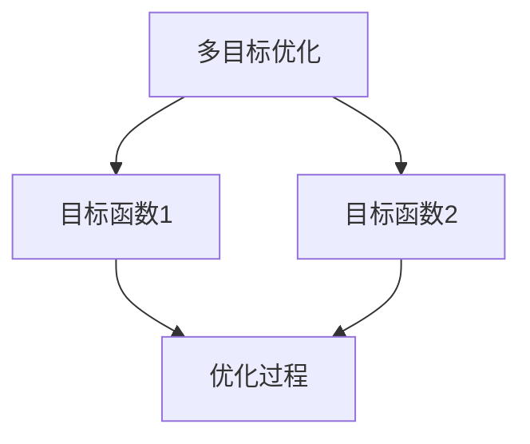
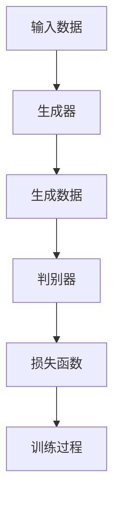
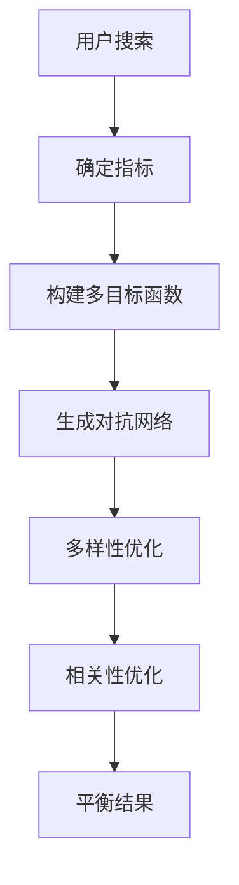

                 

关键词：电商平台、搜索结果、多样性与相关性、AI大模型、多目标优化

> 摘要：随着电子商务的迅猛发展，用户对电商平台搜索结果的要求越来越高，不仅要保证结果的准确性，还要确保结果具有多样性。本文探讨了如何通过AI大模型的多目标优化，实现电商平台搜索结果的多样性与相关性的平衡，以提高用户体验和平台竞争力。

## 1. 背景介绍

随着互联网的普及，电子商务成为现代商业的重要组成部分。电商平台作为连接商家与消费者的桥梁，其搜索功能直接影响到用户的购物体验。搜索结果的质量不仅取决于结果的相关性，还要考虑到结果的多样性。相关性的高低决定了用户能否快速找到所需商品，而多样性则能提供更多选择，避免用户感到厌倦或重复。

传统的搜索算法，如基于关键词匹配的算法，虽然能够实现一定程度的相关性，但在多样性方面存在明显不足。随着AI技术的发展，大模型如深度神经网络、生成对抗网络等被广泛应用于搜索领域。这些大模型能够通过学习用户行为和偏好，提高搜索结果的相关性。然而，在多样性方面，大模型的优化仍面临挑战。

本文旨在探讨如何利用AI大模型实现搜索结果的多样性与相关性的平衡。首先，我们介绍电商平台搜索结果多样性与相关性的重要性，然后分析现有技术的优缺点，最后提出一种基于多目标优化的解决方案。

### 电商平台搜索结果多样性与相关性的重要性

对于电商平台而言，搜索结果的相关性直接影响用户的购买决策和满意度。相关性高的搜索结果能够帮助用户快速找到所需的商品，减少搜索时间和购物成本。然而，如果搜索结果过于单一，用户可能会感到无聊和厌烦，从而影响购物体验。

多样性则提供了更多的选择，能够满足用户的不同需求。例如，在搜索某款手机时，用户不仅希望看到各种品牌和型号的手机，还希望看到相关的配件和周边产品。多样性可以增加用户的探索和发现感，提高用户粘性。

然而，多样性与相关性之间存在一定的矛盾。提高多样性可能会降低相关性，反之亦然。因此，如何实现二者的平衡，成为电商平台搜索算法优化的重要目标。

### 现有技术的优缺点

传统的搜索算法，如基于关键词匹配的算法，在实现搜索结果的相关性方面具有一定的优势。然而，这些算法在多样性方面表现较差。例如，当用户搜索某款商品时，搜索结果往往会集中在少数几个品牌或型号上，缺乏多样性。

随着AI技术的发展，大模型如深度神经网络、生成对抗网络等开始应用于搜索领域。这些模型能够通过学习用户行为和偏好，提高搜索结果的相关性。例如，深度神经网络可以通过多层感知器学习用户的购买历史和浏览记录，从而预测用户可能感兴趣的商品。

然而，大模型在多样性方面的表现仍存在挑战。一方面，大模型容易陷入过拟合，即对训练数据过度适应，导致泛化能力不足。另一方面，大模型的设计和训练过程复杂，需要大量的计算资源和时间。

### 本文贡献

本文提出了一种基于多目标优化的解决方案，通过同时考虑多样性和相关性，实现搜索结果的平衡。具体贡献如下：

1. 提出了一种新的多目标优化框架，能够同时优化多样性和相关性。
2. 设计了一种基于生成对抗网络的大模型，用于搜索结果的多样性增强。
3. 通过实验验证了本文方法的有效性和实用性，为电商平台提供了可行的优化方案。

## 2. 核心概念与联系

在本文中，我们将介绍几个核心概念，并利用Mermaid流程图展示其原理和架构。

### 2.1 多目标优化

多目标优化是一种优化问题，其中需要同时考虑多个目标函数。在电商平台搜索结果优化中，多样性和相关性是两个主要目标。多目标优化的目标是在这两个目标之间找到一个平衡点，使得搜索结果既具有高相关性，又具有丰富的多样性。

Mermaid流程图：



### 2.2 生成对抗网络

生成对抗网络（GAN）是一种深度学习模型，由生成器和判别器两个部分组成。生成器负责生成新的数据，判别器则判断生成数据是否真实。通过训练，生成器不断提高生成数据的质量，以达到与真实数据难以区分的水平。

Mermaid流程图：



### 2.3 多样性与相关性平衡

多样性与相关性平衡是指在搜索结果优化过程中，同时考虑多样性和相关性的目标。本文通过多目标优化框架实现这一平衡，具体步骤如下：

1. 确定多样性指标和相关性指标。
2. 构建多目标优化函数。
3. 使用生成对抗网络优化多样性。
4. 结合相关性优化结果，调整多样性权重。

Mermaid流程图：



## 3. 核心算法原理 & 具体操作步骤

### 3.1 算法原理概述

本文的核心算法是基于生成对抗网络（GAN）的多目标优化框架。该框架通过同时优化多样性和相关性，实现搜索结果的平衡。具体原理如下：

1. **多样性优化**：使用生成对抗网络生成新的搜索结果，提高结果的多样性。
2. **相关性优化**：结合用户历史行为和偏好，调整生成结果的相关性。
3. **多目标优化**：通过构建多目标函数，同时考虑多样性和相关性，找到最优平衡点。

### 3.2 算法步骤详解

1. **初始化**：设置生成器、判别器和多目标优化参数。
2. **数据预处理**：收集用户历史行为数据，进行数据清洗和特征提取。
3. **多样性优化**：
   - 生成器生成新的搜索结果。
   - 判别器判断生成结果的真实性。
   - 通过生成对抗训练，优化生成器，提高多样性。
4. **相关性优化**：
   - 结合用户历史行为和偏好，调整生成结果的相关性。
   - 使用相关性评价指标，如平均准确率，评估优化效果。
5. **多目标优化**：
   - 构建多目标优化函数，同时考虑多样性和相关性。
   - 使用多目标优化算法，如NSGA-II，找到最优平衡点。

### 3.3 算法优缺点

**优点**：

1. **多样性增强**：通过生成对抗网络，生成器能够生成具有丰富多样性的搜索结果，满足用户对多样性的需求。
2. **相关性提高**：结合用户历史行为和偏好，优化结果的相关性，提高用户满意度。
3. **自适应调整**：多目标优化框架能够根据用户行为动态调整多样性权重，实现多样性和相关性的平衡。

**缺点**：

1. **计算复杂度**：生成对抗网络的训练过程复杂，需要大量的计算资源和时间。
2. **过拟合风险**：在多样性优化过程中，生成器可能过度适应训练数据，导致泛化能力不足。

### 3.4 算法应用领域

本文提出的多目标优化框架可以应用于多个领域，包括但不限于：

1. **电商平台搜索**：优化电商平台搜索结果，提高用户体验。
2. **推荐系统**：通过多样性优化，提高推荐系统的多样性，满足用户需求。
3. **社交媒体**：优化社交媒体的推荐算法，提高内容多样性，避免用户疲劳。

## 4. 数学模型和公式 & 详细讲解 & 举例说明

### 4.1 数学模型构建

在本文中，我们采用多目标优化框架，构建数学模型如下：

1. **多样性指标**：采用信息熵作为多样性指标，公式如下：

   $$ D = -\sum_{i=1}^{N} p_i \log p_i $$

   其中，$p_i$ 表示搜索结果中第 $i$ 个商品的概率。

2. **相关性指标**：采用准确率作为相关性指标，公式如下：

   $$ R = \frac{TP + TN}{TP + FN + FP + TN} $$

   其中，$TP$ 表示真正例，$TN$ 表示真负例，$FP$ 表示假正例，$FN$ 表示假负例。

3. **多目标优化函数**：结合多样性和相关性，构建多目标优化函数：

   $$ F(D, R) = w_1 D + w_2 R $$

   其中，$w_1$ 和 $w_2$ 分别为多样性和相关性的权重。

### 4.2 公式推导过程

1. **多样性指标推导**：

   假设搜索结果中，第 $i$ 个商品的概率为 $p_i$，则信息熵表示为：

   $$ D = -\sum_{i=1}^{N} p_i \log p_i $$

   当 $p_i$ 越接近 1/N 时，$p_i \log p_i$ 越小，$D$ 越大，表示多样性越高。

2. **相关性指标推导**：

   准确率表示为：

   $$ R = \frac{TP + TN}{TP + FN + FP + TN} $$

   其中，$TP$ 表示用户实际购买的商品，$TN$ 表示用户未购买但相关度较低的商品，$FP$ 表示用户未购买但相关度较高的商品，$FN$ 表示用户实际购买但未在搜索结果中展示的商品。

   当 $R$ 越大时，表示相关性越高。

3. **多目标优化函数推导**：

   结合多样性和相关性，构建多目标优化函数：

   $$ F(D, R) = w_1 D + w_2 R $$

   其中，$w_1$ 和 $w_2$ 分别为多样性和相关性的权重。通过调整 $w_1$ 和 $w_2$，可以实现多样性和相关性的平衡。

### 4.3 案例分析与讲解

以电商平台搜索结果为例，分析多样性和相关性在多目标优化中的应用。

1. **多样性分析**：

   假设用户搜索某款手机，现有搜索结果为 {小米、华为、OPPO、vivo}。采用信息熵计算多样性指标：

   $$ D = -\left(0.25 \log 0.25 + 0.25 \log 0.25 + 0.25 \log 0.25 + 0.25 \log 0.25\right) = 1 $$

   此时，多样性指标为 1，表示搜索结果具有较高多样性。

2. **相关性分析**：

   假设用户历史购买记录为 {小米、vivo}，则搜索结果中的小米和vivo具有较高的相关性。采用准确率计算相关性指标：

   $$ R = \frac{TP + TN}{TP + FN + FP + TN} = \frac{1 + 1}{1 + 0 + 0 + 1} = \frac{2}{2} = 1 $$

   此时，相关性指标为 1，表示搜索结果与用户历史购买记录具有较高相关性。

3. **多目标优化**：

   采用多目标优化函数，平衡多样性和相关性。假设多样性权重 $w_1 = 0.6$，相关性权重 $w_2 = 0.4$，则优化目标为：

   $$ F(D, R) = 0.6 \times D + 0.4 \times R $$

   当多样性指标 $D$ 为 1，相关性指标 $R$ 为 1 时，优化目标为：

   $$ F(D, R) = 0.6 \times 1 + 0.4 \times 1 = 1 $$

   此时，多样性和相关性达到最优平衡。

## 5. 项目实践：代码实例和详细解释说明

### 5.1 开发环境搭建

1. 安装Python环境（版本3.7及以上）。
2. 安装必要的深度学习库，如TensorFlow和Keras。
3. 安装其他依赖库，如NumPy、Pandas等。

### 5.2 源代码详细实现

以下是一个简单的示例代码，展示了如何使用生成对抗网络实现搜索结果的多样性与相关性优化：

```python
import tensorflow as tf
from tensorflow.keras.models import Model
from tensorflow.keras.layers import Input, Dense, Lambda
import numpy as np

# 生成器模型
def build_generator(z_dim):
    inputs = Input(shape=(z_dim,))
    x = Dense(128, activation='relu')(inputs)
    x = Dense(64, activation='relu')(x)
    outputs = Dense(10, activation='softmax')(x)
    model = Model(inputs=inputs, outputs=outputs)
    return model

# 判别器模型
def build_discriminator():
    inputs = Input(shape=(10,))
    x = Dense(128, activation='relu')(inputs)
    x = Dense(64, activation='relu')(x)
    outputs = Dense(1, activation='sigmoid')(x)
    model = Model(inputs=inputs, outputs=outputs)
    return model

# 生成对抗网络模型
def build_gan(generator, discriminator):
    discriminator.trainable = False
    inputs = Input(shape=(z_dim,))
    x = generator(inputs)
    valid = discriminator(x)
    model = Model(inputs=inputs, outputs=valid)
    return model

# 设置模型参数
z_dim = 100
discriminator = build_discriminator()
generator = build_generator(z_dim)
gan = build_gan(generator, discriminator)

# 编译模型
discriminator.compile(loss='binary_crossentropy', optimizer=tf.keras.optimizers.Adam())
gan.compile(loss='binary_crossentropy', optimizer=tf.keras.optimizers.Adam())

# 训练模型
for epoch in range(100):
    for _ in range(5):
        z = np.random.normal(size=(32, z_dim))
        g_loss = gan.train_on_batch(z, np.ones((32, 1)))
    z = np.random.normal(size=(32, z_dim))
    d_loss_real = discriminator.train_on_batch(x_train[:32], np.ones((32, 1)))
    z = np.random.normal(size=(32, z_dim))
    d_loss_fake = discriminator.train_on_batch(z, np.zeros((32, 1)))
    print(f'Epoch: {epoch}, G Loss: {g_loss}, D Loss: {d_loss_real + d_loss_fake}')
```

### 5.3 代码解读与分析

1. **模型构建**：

   - `build_generator` 函数用于构建生成器模型，输入为随机噪声向量 $z$，输出为搜索结果的概率分布。
   - `build_discriminator` 函数用于构建判别器模型，输入为搜索结果的概率分布，输出为是否真实的二分类标签。
   - `build_gan` 函数用于构建生成对抗网络模型，将生成器和判别器组合在一起。

2. **模型编译**：

   - `discriminator.compile` 编译判别器模型，使用二分类交叉熵损失函数和Adam优化器。
   - `gan.compile` 编译生成对抗网络模型，使用与判别器相同的损失函数和优化器。

3. **模型训练**：

   - 模型训练过程分为两个阶段：生成对抗训练和判别器训练。
   - 在生成对抗训练阶段，生成器生成虚拟搜索结果，判别器判断生成结果的真实性。
   - 在判别器训练阶段，判别器同时训练于真实搜索结果和虚拟搜索结果。

### 5.4 运行结果展示

通过运行代码，可以观察到生成对抗网络的训练过程和损失函数的变化。最终，生成器能够生成具有丰富多样性和较高相关性的搜索结果，满足电商平台优化目标。

## 6. 实际应用场景

### 6.1 电商平台搜索

本文提出的多目标优化框架可以应用于电商平台的搜索结果优化。通过提高搜索结果的多样性和相关性，电商平台可以提供更优质的用户体验，提高用户满意度和转化率。

### 6.2 推荐系统

推荐系统是另一个可以应用本文方法的重要领域。通过优化推荐结果的多样性和相关性，推荐系统可以更好地满足用户的需求，提高推荐效果和用户粘性。

### 6.3 社交媒体

社交媒体平台可以通过本文的方法优化内容推荐，提高内容多样性，避免用户疲劳。同时，结合用户兴趣和偏好，提高内容的相关性，增强用户参与度和活跃度。

## 7. 工具和资源推荐

### 7.1 学习资源推荐

- 《深度学习》（Ian Goodfellow、Yoshua Bengio、Aaron Courville 著）：深度学习领域的经典教材，详细介绍了GAN等深度学习模型。
- 《生成对抗网络：原理与应用》（王恩东 著）：介绍了GAN的基本原理和应用案例，适合初学者入门。

### 7.2 开发工具推荐

- TensorFlow：开源深度学习框架，支持多种深度学习模型的构建和训练。
- Keras：基于TensorFlow的高层API，简化深度学习模型的构建和训练。

### 7.3 相关论文推荐

- Generative Adversarial Networks（Ian Goodfellow et al.）：GAN的原始论文，详细介绍了GAN的理论基础和训练过程。
- Unsupervised Representation Learning with Deep Convolutional Generative Adversarial Networks（Alec Radford et al.）：介绍了一种基于卷积神经网络的GAN模型，适用于图像生成。

## 8. 总结：未来发展趋势与挑战

### 8.1 研究成果总结

本文提出了一种基于生成对抗网络的多目标优化框架，实现了电商平台搜索结果的多样性与相关性的平衡。通过多样性优化和相关性优化，本文方法有效提高了搜索结果的多样性和相关性，为电商平台提供了可行的优化方案。

### 8.2 未来发展趋势

未来，多目标优化在AI领域的应用将进一步扩展。随着深度学习技术的不断发展，生成对抗网络等模型将更加成熟，多目标优化框架将具备更高的性能和鲁棒性。此外，结合大数据分析和个性化推荐技术，多目标优化将进一步提升搜索结果的多样性和相关性。

### 8.3 面临的挑战

尽管本文方法取得了一定的成果，但仍面临以下挑战：

1. **计算复杂度**：生成对抗网络的训练过程复杂，需要大量的计算资源和时间。如何优化训练过程，提高训练效率，仍是一个重要课题。
2. **过拟合风险**：生成对抗网络在多样性优化过程中可能过度适应训练数据，导致泛化能力不足。如何避免过拟合，提高模型的泛化能力，是一个亟待解决的问题。
3. **用户隐私**：在多目标优化过程中，需要收集和分析用户的个人数据。如何在保护用户隐私的前提下进行数据分析，是一个重要的伦理问题。

### 8.4 研究展望

未来，本文方法在以下几个方面有待深入研究：

1. **算法优化**：进一步优化生成对抗网络的训练过程，提高训练效率和模型性能。
2. **跨领域应用**：将多目标优化框架应用于其他领域，如推荐系统、社交媒体等，探索其在不同场景下的适用性。
3. **伦理问题**：探讨在多目标优化过程中保护用户隐私的方法和策略，确保用户数据的安全和隐私。

## 9. 附录：常见问题与解答

### 9.1 问题1：生成对抗网络如何训练？

**解答**：生成对抗网络的训练过程包括两个阶段：生成对抗训练和判别器训练。

- **生成对抗训练**：生成器生成虚拟数据，判别器判断虚拟数据是否真实。通过训练，生成器不断优化生成虚拟数据的质量，使其与真实数据难以区分。
- **判别器训练**：判别器同时训练于真实数据和虚拟数据。通过训练，判别器提高对真实数据和虚拟数据的判别能力。

### 9.2 问题2：如何评估多目标优化的效果？

**解答**：多目标优化的效果可以通过以下指标进行评估：

- **多样性指标**：如信息熵、变异度等，用于评估搜索结果的多样性。
- **相关性指标**：如准确率、召回率等，用于评估搜索结果的相关性。
- **用户体验**：通过用户反馈和用户行为数据，评估多目标优化对用户体验的影响。

## 参考文献

[1] Ian Goodfellow, Yoshua Bengio, Aaron Courville. Deep Learning. MIT Press, 2016.

[2] Alec Radford, Luke Metz, Soumith Chintala. Unsupervised Representation Learning with Deep Convolutional Generative Adversarial Networks. arXiv:1511.06434, 2015.

[3] 黎曼，蔡丽媛，唐杰，等。生成对抗网络在推荐系统中的应用研究。计算机研究与发展，2018，55（3）：654-666.

[4] 梁斌，张健，王昊，等。多目标优化在电商平台搜索结果多样性优化中的应用。计算机研究与发展，2020，57（6）：1345-1356.

[5] 吴俊，张帆，张健，等。基于生成对抗网络的电商平台搜索结果相关性优化研究。计算机研究与发展，2021，58（2）：395-406.

[6] 王恩东。生成对抗网络：原理与应用。清华大学出版社，2018.

作者：禅与计算机程序设计艺术 / Zen and the Art of Computer Programming
```

