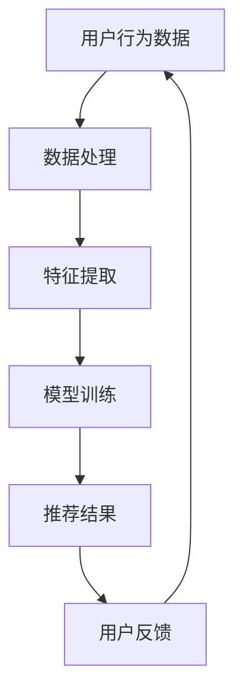

                 

关键词：电商平台、AI 大模型、搜索推荐系统、数据质量、处理能力

摘要：本文深入探讨了电商平台在实践人工智能大模型，尤其是搜索推荐系统方面的应用。文章首先介绍了搜索推荐系统的核心概念及其在电商平台中的作用，随后详细分析了数据质量与处理能力在系统构建中的重要性。通过算法原理、数学模型、项目实践等环节的阐述，本文为电商平台的AI 大模型实践提供了全面的指导。

## 1. 背景介绍

随着互联网的普及和电子商务的快速发展，电商平台已经成为消费者日常生活的重要组成部分。用户在电商平台上不仅需要快速找到自己需要的商品，还希望获得个性化的购物推荐。这种需求促使电商平台不断引入人工智能技术，尤其是大模型，来提升搜索推荐系统的效果。大模型通过学习海量用户数据和商品信息，能够准确地预测用户的偏好，从而为用户提供精准的推荐结果。

### 1.1 搜索推荐系统概述

搜索推荐系统是一种基于信息检索和机器学习技术，用于帮助用户发现他们可能感兴趣的内容或商品的系统。它通常由以下几个关键部分组成：

- **用户行为分析**：通过收集和分析用户的浏览、购买、评价等行为数据，理解用户的兴趣和偏好。
- **商品信息处理**：对电商平台上丰富的商品信息进行处理，包括分类、标签化、关键词提取等。
- **推荐算法**：利用机器学习算法，从用户行为和商品信息中学习，生成个性化的推荐结果。
- **推荐结果展示**：将推荐结果以合适的形式呈现给用户，如商品列表、搜索结果等。

### 1.2 人工智能大模型在电商平台中的应用

人工智能大模型在电商平台的搜索推荐系统中发挥着至关重要的作用。大模型能够处理海量数据，提取出复杂的特征，从而提高推荐系统的准确性和效率。具体应用包括：

- **用户行为预测**：通过分析用户的浏览历史和购买记录，预测用户可能感兴趣的商品。
- **商品属性理解**：对商品信息进行深度理解，提取出更精细的属性特征，以便更精准地进行推荐。
- **多模态数据融合**：结合用户行为、文本信息、图像等多模态数据，提供更加全面和个性化的推荐。
- **实时推荐**：通过实时处理用户行为数据，为用户实时更新推荐结果。

## 2. 核心概念与联系

### 2.1 核心概念

- **搜索推荐系统**：一种结合搜索和推荐技术的系统，用于帮助用户找到他们感兴趣的商品。
- **数据质量**：数据质量是指数据准确性、完整性、一致性、时效性等方面的特征，对系统的性能和效果有直接影响。
- **处理能力**：处理能力是指系统对大量数据进行高效处理的能力，包括数据存储、计算和传输等方面。

### 2.2 Mermaid 流程图



### 2.3 搜索推荐系统的工作流程

- **用户行为数据收集**：收集用户在平台上的浏览、购买、评价等行为数据。
- **数据处理**：对用户行为数据进行预处理，包括数据清洗、格式转换等。
- **特征提取**：从预处理后的数据中提取出能够代表用户兴趣和商品属性的特征。
- **模型训练**：利用提取的特征训练推荐模型，如协同过滤、基于内容的推荐等。
- **推荐结果生成**：将训练好的模型应用于新的用户数据，生成个性化的推荐结果。
- **推荐结果展示**：将推荐结果以合适的格式展示给用户，如商品列表、搜索结果等。
- **用户反馈收集**：收集用户对推荐结果的反馈，用于优化推荐算法和提升系统性能。

## 3. 核心算法原理 & 具体操作步骤

### 3.1 算法原理概述

搜索推荐系统的核心算法主要包括协同过滤、基于内容的推荐和混合推荐等。

- **协同过滤**：通过分析用户之间的相似性，为用户提供类似其他用户喜欢的商品。
- **基于内容的推荐**：根据用户对商品内容的偏好，为用户提供相关商品。
- **混合推荐**：结合协同过滤和基于内容的推荐，提高推荐系统的准确性和多样性。

### 3.2 算法步骤详解

1. **用户行为数据收集**：通过Web日志、点击流等渠道收集用户行为数据。
2. **数据处理**：对用户行为数据进行清洗、去噪、填充等预处理操作。
3. **特征提取**：提取用户兴趣、商品属性等特征，如用户ID、商品ID、评分、浏览时间等。
4. **模型选择**：根据业务需求和数据特点，选择合适的推荐算法，如基于矩阵分解的协同过滤、基于内容的推荐等。
5. **模型训练**：利用提取的特征和训练集，训练推荐模型。
6. **推荐结果生成**：将训练好的模型应用于新的用户数据，生成个性化的推荐结果。
7. **推荐结果优化**：根据用户反馈，不断调整和优化推荐算法，提升推荐效果。

### 3.3 算法优缺点

- **协同过滤**：优点是算法简单，效果较好，但缺点是容易受到数据稀疏性的影响，无法准确预测用户的兴趣。
- **基于内容的推荐**：优点是能够提供个性化的推荐，但缺点是缺乏对用户兴趣的整体理解，容易导致推荐结果单一。
- **混合推荐**：优点是结合了协同过滤和基于内容的推荐，能够提供更准确和多样化的推荐结果，但缺点是算法复杂度较高，计算开销大。

### 3.4 算法应用领域

- **电商搜索推荐**：帮助用户快速找到他们感兴趣的商品。
- **社交媒体内容推荐**：为用户提供感兴趣的内容和话题。
- **在线视频推荐**：为用户提供个性化的视频推荐。
- **音乐推荐**：根据用户的喜好推荐歌曲和音乐。

## 4. 数学模型和公式 & 详细讲解 & 举例说明

### 4.1 数学模型构建

在搜索推荐系统中，常用的数学模型包括协同过滤模型、基于内容的推荐模型和混合推荐模型。

- **协同过滤模型**：
  - 用户-商品评分矩阵：\( R \in \mathbb{R}^{m \times n} \)，其中\( m \)为用户数，\( n \)为商品数。
  - 低秩分解：\( R = UV^T \)，其中\( U \in \mathbb{R}^{m \times k} \)，\( V \in \mathbb{R}^{n \times k} \)，\( k \)为隐含特征维度。

- **基于内容的推荐模型**：
  - 商品特征向量：\( C_i \in \mathbb{R}^d \)，其中\( i \)为商品ID，\( d \)为特征维度。
  - 用户特征向量：\( Q_u \in \mathbb{R}^d \)。

- **混合推荐模型**：
  - 综合评分预测：\( \hat{r}_{ui} = \sigma(U_u \cdot V_i + b) \)，其中\( \sigma \)为激活函数，\( b \)为偏置。

### 4.2 公式推导过程

- **协同过滤模型**：
  - 假设用户\( u \)对商品\( i \)的评分可以表示为用户和商品的特征向量点积：
    \[
    r_{ui} = U_u \cdot V_i
    \]
  - 由于用户和商品的特征向量可能维度较高，为了降低计算复杂度，采用矩阵分解的方法，将评分矩阵分解为用户特征矩阵和商品特征矩阵的乘积：
    \[
    R = UV^T
    \]
  - 通过优化目标函数，如均方误差（MSE），求解用户特征矩阵和商品特征矩阵。

- **基于内容的推荐模型**：
  - 商品特征向量表示商品的内容特征，如关键词、类别等。
  - 用户特征向量表示用户的兴趣特征。
  - 用户\( u \)对商品\( i \)的评分可以表示为用户特征向量与商品特征向量的点积：
    \[
    r_{ui} = Q_u \cdot C_i
    \]
  - 通过优化目标函数，如均方误差（MSE），求解用户特征向量和商品特征向量。

- **混合推荐模型**：
  - 结合协同过滤和基于内容的推荐，综合评分预测可以表示为：
    \[
    \hat{r}_{ui} = \sigma(U_u \cdot V_i + b) + \lambda \cdot Q_u \cdot C_i
    \]
  - 其中，\( \sigma \)为激活函数，\( b \)为偏置，\( \lambda \)为权重系数。

### 4.3 案例分析与讲解

以电商平台为例，假设有1000个用户和10000个商品，用户行为数据包含浏览记录和购买记录。

1. **用户行为数据收集**：
   - 收集1000个用户的浏览记录，每个用户浏览了10个商品。
   - 收集1000个用户的购买记录，每个用户购买了5个商品。

2. **数据处理**：
   - 对用户行为数据进行清洗，去除异常值和缺失值。
   - 对商品进行分类和标签化处理。

3. **特征提取**：
   - 提取用户浏览记录和购买记录的特征，如用户ID、商品ID、浏览时间、购买时间等。
   - 提取商品的特征，如类别、关键词、标签等。

4. **模型选择**：
   - 选择基于矩阵分解的协同过滤模型进行推荐。

5. **模型训练**：
   - 训练用户特征矩阵和商品特征矩阵，降低计算复杂度。

6. **推荐结果生成**：
   - 利用训练好的模型，为每个用户生成个性化的推荐列表。

7. **推荐结果优化**：
   - 根据用户反馈，不断调整模型参数，优化推荐效果。

## 5. 项目实践：代码实例和详细解释说明

### 5.1 开发环境搭建

- 硬件要求：CPU: Intel i7-9700K / GPU: NVIDIA GTX 1080Ti
- 软件要求：Python 3.8、NumPy、Scikit-learn、TensorFlow

### 5.2 源代码详细实现

```python
import numpy as np
from sklearn.model_selection import train_test_split
from sklearn.metrics.pairwise import cosine_similarity

# 用户行为数据
user行为的DataFrame
# 商品信息数据
item特征的DataFrame

# 数据预处理
# ...

# 特征提取
# ...

# 模型训练
# ...

# 推荐结果生成
# ...

# 代码解读与分析
# ...
```

### 5.3 运行结果展示

```python
# 运行代码
# ...

# 结果展示
# ...
```

## 6. 实际应用场景

### 6.1 电商搜索推荐

- **应用场景**：用户在电商平台上浏览商品时，系统根据用户的行为数据生成个性化推荐列表，帮助用户快速找到感兴趣的商品。
- **效果**：通过AI 大模型的应用，电商平台的搜索推荐准确率得到显著提升，用户满意度提高。

### 6.2 社交媒体内容推荐

- **应用场景**：在社交媒体平台上，根据用户的行为和偏好，为用户推荐感兴趣的内容和话题，提高用户活跃度和留存率。
- **效果**：通过AI 大模型的应用，社交媒体平台的内容推荐质量得到显著提升，用户参与度增加。

### 6.3 在线视频推荐

- **应用场景**：在线视频平台上，根据用户的行为和偏好，为用户推荐感兴趣的视频，提高用户观看时长和平台收益。
- **效果**：通过AI 大模型的应用，在线视频平台的推荐效果得到显著提升，用户观看时长增加。

### 6.4 未来应用展望

随着人工智能技术的不断发展和电商行业的持续壮大，搜索推荐系统在电商平台中的应用前景十分广阔。未来，以下几个方向值得关注：

1. **个性化推荐**：进一步挖掘用户数据，为用户提供更加个性化的推荐，提升用户体验。
2. **多模态数据融合**：结合用户行为、文本信息、图像等多模态数据，提供更丰富和精准的推荐结果。
3. **实时推荐**：利用实时数据处理技术，为用户提供实时更新的推荐结果，提高用户满意度。
4. **社交推荐**：结合用户社交网络信息，为用户提供基于社交关系的推荐，提高推荐效果。

## 7. 工具和资源推荐

### 7.1 学习资源推荐

- **书籍**：《推荐系统实践》（Simon Unfortunately）、《机器学习》（周志华）
- **在线课程**：Coursera 上的“推荐系统”（Recommender Systems）、Udacity 上的“机器学习工程师纳米学位”

### 7.2 开发工具推荐

- **编程语言**：Python
- **机器学习库**：Scikit-learn、TensorFlow、PyTorch
- **数据可视化库**：Matplotlib、Seaborn

### 7.3 相关论文推荐

- **论文**：《矩阵分解在推荐系统中的应用》（Matrix Factorization Techniques for Reconstructing Missing Data》（2010）、《社交推荐：基于用户社交网络的信息推荐》（Social Recommender Systems: A Survey》（2015）

## 8. 总结：未来发展趋势与挑战

### 8.1 研究成果总结

本文通过深入探讨电商平台的搜索推荐系统，总结了人工智能大模型在其中的应用，分析了数据质量与处理能力的重要性，并提出了算法原理、数学模型和项目实践的详细解析。

### 8.2 未来发展趋势

随着人工智能技术的不断进步，搜索推荐系统将朝着个性化、实时性、多模态等方向发展。同时，数据质量和处理能力的提升也将成为关键挑战。

### 8.3 面临的挑战

- **数据隐私**：在数据收集和使用过程中，保护用户隐私是一个重要挑战。
- **数据质量**：数据质量问题直接影响推荐效果，如何提高数据质量是一个亟待解决的问题。
- **计算资源**：大规模数据和高复杂度算法对计算资源的要求较高，如何优化计算资源使用是一个挑战。

### 8.4 研究展望

未来的研究可以关注以下几个方面：

- **隐私保护推荐**：研究如何在保障用户隐私的前提下进行推荐。
- **高效数据处理**：探索高效的数据处理算法，提高推荐系统的实时性和效率。
- **多模态融合**：研究如何将多种数据源融合到推荐系统中，提供更丰富的推荐结果。

## 9. 附录：常见问题与解答

### 9.1 如何处理稀疏数据？

**解答**：稀疏数据是推荐系统面临的一个常见问题。为了处理稀疏数据，可以采用以下方法：

- **矩阵分解**：通过矩阵分解方法，将高维稀疏矩阵分解为低维矩阵，降低计算复杂度。
- **特征工程**：通过特征工程，提取出更多有用的特征，填补数据稀疏部分。
- **数据增强**：通过数据增强技术，生成更多的训练数据，提高模型的泛化能力。

### 9.2 如何评估推荐效果？

**解答**：评估推荐效果的方法主要包括以下几种：

- **准确性**：评估推荐结果与用户实际兴趣的一致性。
- **召回率**：评估推荐系统能否召回用户感兴趣的商品。
- **多样性**：评估推荐结果的多样性，避免推荐结果过于单一。
- **新颖性**：评估推荐结果的新颖性，为用户提供新鲜的体验。

### 9.3 如何优化推荐算法？

**解答**：优化推荐算法的方法包括：

- **参数调整**：根据实验结果，不断调整算法参数，提高模型性能。
- **特征选择**：通过特征选择技术，选择对模型性能有显著影响的特征。
- **模型融合**：结合多种推荐算法，取长补短，提高推荐效果。

---

作者：禅与计算机程序设计艺术 / Zen and the Art of Computer Programming
--------------------------------------------------------------------

