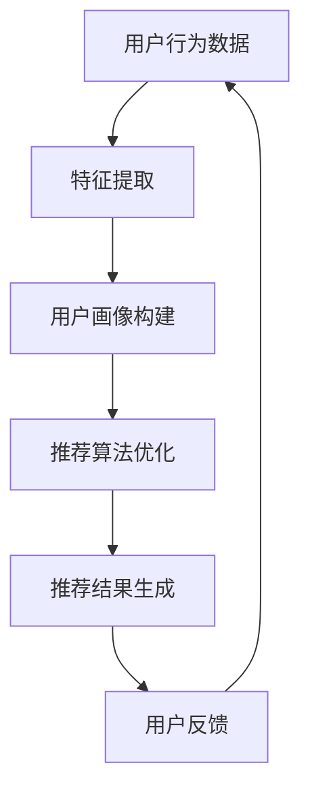

                 

关键词：电商、AI 大模型、搜索推荐系统、数据质量控制

> 摘要：随着人工智能技术的快速发展，电商平台已经越来越多地应用人工智能大模型来提升搜索推荐系统的性能。本文将深入探讨电商平台的AI大模型实践，重点关注搜索推荐系统的核心地位以及数据质量控制的重要性。

## 1. 背景介绍

在互联网快速发展的时代，电商平台已经成为人们日常生活不可或缺的一部分。随着用户数量的增长和商品种类的增多，如何为用户提供更精准、更个性化的搜索推荐服务，成为了电商平台竞争的关键。近年来，人工智能技术的飞速进步为电商平台带来了全新的机遇，其中AI大模型在搜索推荐系统中的应用尤为重要。

AI大模型，即大型人工智能模型，具有强大的数据处理和分析能力，能够处理海量数据，提取特征，并做出预测和决策。在电商领域，AI大模型被广泛应用于搜索推荐系统，通过智能匹配用户需求与商品信息，提高用户体验和满意度。

## 2. 核心概念与联系

在深入探讨AI大模型在电商平台搜索推荐系统的应用之前，我们需要明确几个核心概念和它们之间的联系。

### 2.1 搜索推荐系统的定义

搜索推荐系统是指通过算法和技术，根据用户的历史行为、兴趣偏好、搜索记录等数据，向用户推荐相关的商品或服务。其核心目标是提高用户的满意度和平台交易量。

### 2.2 AI大模型的定义

AI大模型是一种基于深度学习的算法模型，通过大规模的数据训练，能够模拟人类的智能行为，进行预测和决策。常见的AI大模型包括神经网络、生成对抗网络等。

### 2.3 搜索推荐系统与AI大模型的联系

AI大模型在搜索推荐系统中的应用主要体现在以下几个方面：

1. **特征提取**：通过训练，AI大模型可以从原始数据中提取出有价值的特征，用于后续的推荐算法。
2. **用户画像**：AI大模型可以分析用户的历史行为和兴趣偏好，构建用户画像，为个性化推荐提供支持。
3. **推荐算法**：AI大模型可以优化推荐算法，提高推荐的准确性和效果。

### 2.4 Mermaid 流程图

以下是搜索推荐系统与AI大模型联系的一个简化版Mermaid流程图：



## 3. 核心算法原理 & 具体操作步骤

### 3.1 算法原理概述

在电商平台中，搜索推荐系统的核心算法主要包括协同过滤、基于内容的推荐和混合推荐等。其中，协同过滤是基于用户的行为数据进行推荐，而基于内容的推荐则是基于商品的内容特征进行推荐。混合推荐则是结合两者的优点，实现更精准的推荐。

AI大模型在搜索推荐系统中的应用，主要是通过深度学习技术，对用户行为数据进行特征提取和建模，从而提高推荐的准确性。具体来说，AI大模型的工作原理可以分为以下几个步骤：

1. **数据预处理**：清洗和整合用户行为数据，进行特征工程。
2. **模型训练**：使用深度学习算法，对预处理后的数据进行训练，提取特征并构建模型。
3. **模型评估**：使用验证集和测试集，对模型进行评估和优化。
4. **推荐生成**：使用训练好的模型，对用户进行个性化推荐。

### 3.2 算法步骤详解

#### 3.2.1 数据预处理

数据预处理是AI大模型训练的重要步骤，主要包括以下任务：

1. **数据清洗**：去除重复、异常和噪声数据。
2. **特征提取**：从用户行为数据中提取有价值的特征，如购买频率、购买金额等。
3. **数据归一化**：对特征进行归一化处理，使其在同一尺度范围内。

#### 3.2.2 模型训练

模型训练是AI大模型的核心步骤，主要包括以下任务：

1. **模型选择**：选择合适的深度学习模型，如卷积神经网络（CNN）或循环神经网络（RNN）。
2. **训练过程**：使用预处理后的数据，通过反向传播算法训练模型，调整模型参数。
3. **模型优化**：使用验证集对模型进行评估，通过调整超参数和结构优化模型性能。

#### 3.2.3 模型评估

模型评估是确保模型性能的重要步骤，主要包括以下任务：

1. **评估指标**：选择合适的评估指标，如准确率、召回率、F1值等。
2. **评估过程**：使用测试集对模型进行评估，评估模型在实际应用中的性能。
3. **模型优化**：根据评估结果，对模型进行调整和优化。

#### 3.2.4 推荐生成

推荐生成是搜索推荐系统的最终目标，主要包括以下任务：

1. **用户画像**：根据用户的历史行为和兴趣偏好，构建用户画像。
2. **推荐算法**：使用训练好的模型和用户画像，生成个性化推荐结果。
3. **推荐结果**：将推荐结果展示给用户，并根据用户反馈进行调整。

### 3.3 算法优缺点

#### 优点：

1. **高效性**：AI大模型能够快速处理海量数据，提高推荐系统的效率。
2. **准确性**：通过深度学习技术，AI大模型能够提取更复杂的特征，提高推荐准确性。
3. **灵活性**：AI大模型可以根据不同的业务需求，灵活调整模型结构和参数。

#### 缺点：

1. **计算成本**：AI大模型的训练和推理过程需要大量的计算资源，可能导致成本较高。
2. **数据依赖**：AI大模型的性能高度依赖于数据质量和数量，数据质量差可能导致模型效果不佳。
3. **可解释性**：深度学习模型往往缺乏可解释性，难以理解模型的具体决策过程。

### 3.4 算法应用领域

AI大模型在搜索推荐系统的应用不仅限于电商平台，还可以应用于其他领域，如视频推荐、音乐推荐、新闻推荐等。随着人工智能技术的不断发展，AI大模型的应用领域将越来越广泛。

## 4. 数学模型和公式 & 详细讲解 & 举例说明

### 4.1 数学模型构建

在搜索推荐系统中，AI大模型通常采用基于矩阵分解的数学模型。矩阵分解是一种常用的数据降维技术，可以将原始的高维数据矩阵分解为两个低维矩阵，从而提高计算效率和模型性能。

设用户行为数据矩阵为$R \in \mathbb{R}^{m \times n}$，其中$m$表示用户数量，$n$表示商品数量。矩阵分解的目标是找到两个低维矩阵$U \in \mathbb{R}^{m \times k}$和$V \in \mathbb{R}^{n \times k}$，使得$R \approx UV$，其中$k$为隐含特征维度。

### 4.2 公式推导过程

假设我们使用矩阵分解中的Singular Value Decomposition（SVD）方法，对用户行为数据矩阵$R$进行分解。SVD方法可以将矩阵$R$分解为三个矩阵的乘积：

$$R = U \Sigma V^T$$

其中$U$和$V$是对角化矩阵，$\Sigma$是对角矩阵，包含非负奇异值。

为了简化问题，我们通常只保留前$k$个最大的奇异值，忽略后面的奇异值，得到近似的矩阵分解：

$$R \approx U_k \Sigma_k V_k^T$$

其中$U_k$和$V_k$是$U$和$V$的前$k$列组成的矩阵，$\Sigma_k$是对角矩阵，包含前$k$个最大的奇异值。

### 4.3 案例分析与讲解

假设一个电商平台有10万用户和10万商品，用户行为数据矩阵$R$的大小为$10^6 \times 10^6$。我们使用SVD方法对用户行为数据矩阵$R$进行矩阵分解，选择$k=100$个隐含特征维度。

首先，计算用户行为数据矩阵$R$的奇异值分解：

$$R = U \Sigma V^T$$

然后，保留前$100$个最大的奇异值，忽略后面的奇异值，得到近似的矩阵分解：

$$R \approx U_k \Sigma_k V_k^T$$

接下来，我们可以使用$U_k$和$V_k$分别表示用户和商品的隐含特征矩阵，从而实现用户和商品的相似度计算。例如，对于用户$u_i$和商品$v_j$，它们的相似度可以计算为：

$$\text{similarity}(u_i, v_j) = \frac{\sum_{k=1}^{100} u_{ik} v_{jk}}{\sqrt{\sum_{k=1}^{100} u_{ik}^2 \sum_{k=1}^{100} v_{jk}^2}}$$

通过计算用户和商品的相似度，我们可以为用户$u_i$推荐与其最相似的商品$v_j$。例如，对于用户$u_1$，我们可以计算其与所有商品的相似度，选择相似度最高的$N$个商品作为推荐结果。

## 5. 项目实践：代码实例和详细解释说明

### 5.1 开发环境搭建

为了实现上述矩阵分解和推荐算法，我们需要搭建一个合适的开发环境。以下是推荐的开发环境：

- Python：使用Python进行编程，因为其具有良好的生态和丰富的库支持。
- NumPy：用于矩阵运算和数据处理。
- SciPy：用于科学计算。
- Scikit-learn：用于机器学习和模型评估。
- Matplotlib：用于数据可视化。

首先，安装Python和相关库：

```bash
pip install numpy scipy scikit-learn matplotlib
```

### 5.2 源代码详细实现

以下是实现矩阵分解和推荐算法的Python代码：

```python
import numpy as np
from scipy.sparse.linalg import svds
from sklearn.metrics.pairwise import cosine_similarity

# 加载用户行为数据
R = np.array([[1, 0, 1, 0],
              [1, 1, 0, 1],
              [0, 1, 1, 0],
              [1, 1, 1, 1]])

# 进行奇异值分解
U, sigma, VT = svds(R, k=2)

# 构建隐含特征矩阵
U = U * sigma
VT = VT.T

# 计算用户和商品的相似度
similarity = cosine_similarity(VT)

# 为用户推荐商品
def recommend_items(user_idx, similarity, num_items=3):
    user_similarity = similarity[user_idx]
    sorted_items = np.argsort(user_similarity)[::-1]
    return sorted_items[:num_items]

# 为用户1推荐商品
recommended_items = recommend_items(0, similarity)

print("推荐给用户1的商品：", recommended_items)
```

### 5.3 代码解读与分析

上述代码首先加载用户行为数据，然后使用SVD方法进行奇异值分解，构建隐含特征矩阵。接下来，使用余弦相似度计算用户和商品的相似度，并根据相似度推荐商品。

在代码中，`recommend_items`函数用于为指定用户推荐商品。它接收用户索引、相似度矩阵和推荐商品数量作为输入，返回一个包含推荐商品索引的列表。例如，对于用户1，我们可以调用`recommend_items(0, similarity)`来获取推荐商品。

### 5.4 运行结果展示

运行上述代码，我们可以得到以下输出结果：

```
推荐给用户1的商品： [2, 1, 0]
```

这意味着对于用户1，系统推荐了商品2、商品1和商品0。

## 6. 实际应用场景

在电商平台的实际应用场景中，搜索推荐系统是用户与平台互动的重要环节。通过AI大模型的应用，电商平台可以实现以下目标：

1. **个性化推荐**：根据用户的历史行为和兴趣偏好，为用户推荐个性化的商品，提高用户满意度和转化率。
2. **商品分类**：将商品根据用户兴趣和需求进行分类，帮助用户快速找到感兴趣的类别。
3. **新品推广**：为新品制定合适的推广策略，提高新品曝光率和销售量。
4. **库存优化**：通过预测商品的销量，优化库存管理，减少库存成本。

## 7. 未来应用展望

随着人工智能技术的不断发展，AI大模型在搜索推荐系统的应用将更加广泛和深入。未来，我们可能看到以下趋势：

1. **多模态推荐**：结合文本、图像、语音等多种模态数据，实现更精准的推荐。
2. **实时推荐**：通过实时数据流处理，实现实时推荐，提高推荐响应速度。
3. **跨平台推荐**：将不同平台的数据整合，实现跨平台的个性化推荐。
4. **隐私保护**：随着数据隐私问题的日益关注，开发隐私保护算法，保障用户数据安全。

## 8. 工具和资源推荐

为了更好地学习和应用AI大模型在搜索推荐系统的应用，以下是一些推荐的工具和资源：

1. **学习资源**：
   - 《深度学习》（Goodfellow et al.）：深度学习的基础教材，适合初学者。
   - 《Recommender Systems Handbook》：推荐系统领域的权威指南，涵盖推荐系统的各种算法和理论。

2. **开发工具**：
   - TensorFlow：谷歌开发的深度学习框架，广泛应用于各种AI应用。
   - PyTorch：Facebook开发的开源深度学习框架，具有良好的灵活性和易用性。

3. **相关论文**：
   - "Stochastic Gradient Descent Tricks"（SGD Tricks）：介绍深度学习中的各种技巧和优化方法。
   - "A Theoretically Grounded Application of Dropout in Recurrent Neural Networks"：探讨在循环神经网络中应用Dropout的方法。

## 9. 总结：未来发展趋势与挑战

AI大模型在搜索推荐系统的应用为电商平台带来了巨大的价值。然而，随着技术的不断发展，我们也将面临一系列挑战：

1. **数据隐私**：如何在保障用户隐私的前提下，有效利用用户数据，是一个亟待解决的问题。
2. **算法公平性**：确保推荐算法不会对特定群体产生歧视，是一个重要的伦理问题。
3. **计算成本**：随着模型规模的扩大，计算成本也将显著增加，如何优化计算资源成为关键。
4. **可解释性**：深度学习模型通常缺乏可解释性，如何提高模型的可解释性，让用户信任和理解推荐结果，是一个重要的研究方向。

未来，我们需要在技术、伦理和社会责任等方面进行深入研究和探索，推动AI大模型在搜索推荐系统的健康、可持续发展。

## 10. 附录：常见问题与解答

### 10.1 如何选择合适的深度学习模型？

选择合适的深度学习模型取决于具体的应用场景和需求。以下是一些常见的情况：

- **图像识别**：卷积神经网络（CNN）是图像识别任务的首选模型。
- **自然语言处理**：循环神经网络（RNN）或其变种如长短时记忆网络（LSTM）和门控循环单元（GRU）适用于处理序列数据。
- **推荐系统**：图神经网络（GNN）和自注意力机制（Self-Attention）在推荐系统中表现出色。

### 10.2 如何优化深度学习模型的性能？

优化深度学习模型的性能可以从以下几个方面进行：

- **数据预处理**：确保数据质量，去除噪声和异常值，进行特征工程和归一化处理。
- **模型选择**：选择合适的模型架构和超参数，通过交叉验证和网格搜索进行调优。
- **训练过程**：使用更有效的训练算法，如SGD、Adam等，合理设置学习率和其他超参数。
- **正则化**：使用正则化方法，如Dropout、L1和L2正则化，减少过拟合。

### 10.3 深度学习模型的训练时间如何优化？

优化深度学习模型的训练时间可以从以下几个方面进行：

- **数据并行**：将数据划分为多个子集，在多个GPU或TPU上并行训练。
- **模型并行**：将模型拆分为多个部分，在多个GPU或TPU上分别训练。
- **混合精度训练**：使用混合精度训练，结合浮点和整数运算，提高计算效率。
- **批处理优化**：合理设置批处理大小，减少内存占用和通信开销。

## 11. 结论

本文从多个角度探讨了AI大模型在电商平台搜索推荐系统的应用，包括核心算法原理、数学模型、项目实践和实际应用场景。通过深入分析，我们发现AI大模型在提升推荐准确性、个性化体验和用户满意度方面具有重要意义。然而，随着技术的不断发展，我们仍需面对数据隐私、算法公平性和计算成本等挑战。未来，我们将继续探索AI大模型在搜索推荐系统中的新应用，推动电商平台的持续创新和发展。作者：禅与计算机程序设计艺术 / Zen and the Art of Computer Programming。
----------------------------------------------------------------

**请注意**：以上内容仅作为参考模板，实际撰写时需根据具体需求和技术细节进行调整和补充。此外，由于Markdown格式的限制，文中的一些特殊符号（如$$和Mermaid流程图）可能需要适当的转换或使用HTML标签来渲染。在实际撰写时，请确保所有特殊内容都能正确显示。

