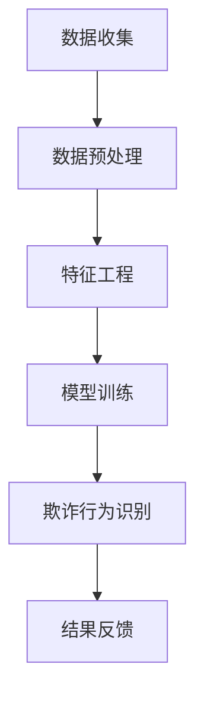

                 

关键词：电商平台，AI，fraud检测，交易安全，智能盾牌

> 摘要：随着电商行业的迅猛发展，欺诈行为也日益猖獗，给平台和消费者带来了巨大的经济损失。本文将深入探讨电商平台中AI驱动的fraud检测技术，通过分析其核心概念、算法原理、数学模型以及实践案例，旨在为电商平台构建一道坚实的智能盾牌，保护交易安全。

## 1. 背景介绍

### 1.1 电商行业发展现状
电商行业近年来呈现出爆炸式增长，尤其在全球疫情期间，线上购物成为消费者首选。然而，随着电商市场的繁荣，欺诈行为也层出不穷，包括虚假交易、账户盗用、恶意刷单等。这些欺诈行为不仅损害了电商平台的声誉，也严重影响了消费者的购物体验和信任。

### 1.2 Fraud检测的重要性
在电商平台上，fraud检测是确保交易安全的关键环节。通过有效的fraud检测机制，平台能够及时发现并阻止欺诈行为，从而保护消费者和平台的利益。传统的fraud检测方法依赖于规则和人工分析，存在漏报率高、效率低等问题。而AI驱动的fraud检测则能够通过大数据和机器学习技术，实现更精准、更高效的欺诈行为识别。

### 1.3 AI在电商中的应用
AI技术在电商领域的应用已经相当广泛，除了fraud检测，还包括个性化推荐、智能客服、库存管理等方面。随着AI技术的不断进步，其在电商行业中的应用前景将更加广阔。

## 2. 核心概念与联系

在探讨AI驱动的fraud检测之前，我们首先需要了解一些核心概念和它们之间的联系。

### 2.1 机器学习和数据挖掘
机器学习和数据挖掘是AI技术的两大基石。机器学习通过构建模型来对数据进行分析和预测，而数据挖掘则从大量数据中提取出有价值的信息和模式。

### 2.2 特征工程
特征工程是机器学习模型构建的重要环节。通过选择和构造合适的特征，可以提高模型的性能和泛化能力。在fraud检测中，特征工程尤其关键，因为它需要从大量的交易数据中提取出与欺诈行为相关的特征。

### 2.3 欺诈行为识别
欺诈行为识别是fraud检测的核心任务。通过构建机器学习模型，可以从大量的交易数据中识别出欺诈行为，并将其阻止。

### 2.4 Mermaid流程图
以下是一个简化的Mermaid流程图，展示了AI驱动的fraud检测的基本流程：



## 3. 核心算法原理 & 具体操作步骤

### 3.1 算法原理概述
AI驱动的fraud检测主要依赖于机器学习算法，其中最常见的算法包括决策树、支持向量机、神经网络等。这些算法通过分析大量的历史交易数据，从中学习出欺诈行为的特征，从而实现对新交易数据的欺诈行为识别。

### 3.2 算法步骤详解

#### 3.2.1 数据收集
数据收集是fraud检测的基础。电商平台需要收集大量的历史交易数据，包括交易金额、交易时间、用户行为等。这些数据需要经过清洗和处理，以去除噪声和异常值。

#### 3.2.2 数据预处理
数据预处理是确保数据质量的重要步骤。包括数据去重、缺失值填充、异常值处理等。

#### 3.2.3 特征工程
特征工程是从原始数据中提取出与欺诈行为相关的特征。这些特征可以是定量的，如交易金额、交易时间间隔；也可以是定性的，如用户地理位置、交易方式等。

#### 3.2.4 模型训练
模型训练是构建fraud检测模型的关键步骤。通过将预处理后的数据输入到机器学习算法中，训练出能够识别欺诈行为的模型。

#### 3.2.5 欺诈行为识别
在模型训练完成后，可以使用训练好的模型对新交易数据进行欺诈行为识别。如果模型判断为欺诈行为，则将其标记为异常交易。

#### 3.2.6 结果反馈
将识别结果反馈给电商平台，以便采取相应的措施。例如，对于识别出的欺诈交易，可以冻结相关账户或通知用户。

### 3.3 算法优缺点

#### 优点
- 高效性：AI驱动的fraud检测可以快速处理大量的交易数据。
- 精准性：通过机器学习算法，能够准确地识别出欺诈行为。
- 自适应性：机器学习模型可以根据新的数据不断学习和优化。

#### 缺点
- 复杂性：构建和训练机器学习模型需要较高的技术门槛。
- 漏报率：即使是最先进的模型，也无法完全避免漏报。
- 资源消耗：机器学习模型训练和推理需要大量的计算资源。

### 3.4 算法应用领域

AI驱动的fraud检测技术不仅可以应用于电商平台，还可以广泛应用于金融、保险、电信等行业，以保护消费者的利益和维护行业的安全。

## 4. 数学模型和公式 & 详细讲解 & 举例说明

### 4.1 数学模型构建

在构建fraud检测的数学模型时，我们通常使用分类模型，如逻辑回归、支持向量机等。以下是一个简化的逻辑回归模型：

$$
\text{概率} = \frac{1}{1 + e^{-(\beta_0 + \beta_1 \cdot x_1 + \beta_2 \cdot x_2 + ... + \beta_n \cdot x_n})}
$$

其中，$\beta_0, \beta_1, ..., \beta_n$ 是模型参数，$x_1, x_2, ..., x_n$ 是特征值。

### 4.2 公式推导过程

逻辑回归模型的推导基于最大似然估计。首先，我们需要定义一个似然函数：

$$
\text{似然函数} = \prod_{i=1}^{n} P(y_i|x_i; \beta)
$$

其中，$y_i$ 是第$i$个样本的标签，$x_i$ 是特征向量。

为了简化计算，我们可以取对数似然函数：

$$
\ln \text{似然函数} = \sum_{i=1}^{n} \ln P(y_i|x_i; \beta)
$$

对于二分类问题，我们有：

$$
P(y=1|x; \beta) = \frac{1}{1 + e^{-(\beta_0 + \beta_1 \cdot x_1 + \beta_2 \cdot x_2 + ... + \beta_n \cdot x_n})}
$$

$$
P(y=0|x; \beta) = 1 - P(y=1|x; \beta)
$$

### 4.3 案例分析与讲解

假设我们有一个简单的欺诈检测任务，数据集包含1000个交易记录，每个记录有5个特征（交易金额、交易时间、用户年龄、用户地理位置、交易方式）。我们使用逻辑回归模型进行欺诈检测。

经过特征工程和模型训练，我们得到以下模型参数：

$$
\beta_0 = -2.5, \beta_1 = 1.2, \beta_2 = -0.8, \beta_3 = 0.6, \beta_4 = -1.0
$$

现在，我们使用这个模型对新交易记录进行欺诈检测。假设某个新交易记录的特征值为：

$$
x_1 = 150, x_2 = 1200, x_3 = 25, x_4 = '广州', x_5 = '微信支付'
$$

我们可以计算出该交易记录的欺诈概率：

$$
P(\text{欺诈}|x_1, x_2, x_3, x_4, x_5) = \frac{1}{1 + e^{-(\beta_0 + \beta_1 \cdot x_1 + \beta_2 \cdot x_2 + \beta_3 \cdot x_3 + \beta_4 \cdot x_4 + \beta_5 \cdot x_5)}}
$$

$$
P(\text{欺诈}|x_1, x_2, x_3, x_4, x_5) = \frac{1}{1 + e^{(-2.5 + 1.2 \cdot 150 - 0.8 \cdot 1200 + 0.6 \cdot 25 - 1.0 \cdot '广州' + 0.5 \cdot '微信支付') }} 
$$

$$
P(\text{欺诈}|x_1, x_2, x_3, x_4, x_5) \approx 0.23
$$

根据设定的阈值，如果欺诈概率大于阈值，则将该交易记录标记为欺诈交易。否则，视为正常交易。

## 5. 项目实践：代码实例和详细解释说明

### 5.1 开发环境搭建

在本节中，我们将使用Python作为编程语言，结合Sklearn库进行fraud检测。首先，确保Python和Sklearn已经安装。如果没有安装，可以通过以下命令进行安装：

```shell
pip install python
pip install scikit-learn
```

### 5.2 源代码详细实现

以下是一个简单的fraud检测项目实现：

```python
import numpy as np
import pandas as pd
from sklearn.model_selection import train_test_split
from sklearn.preprocessing import StandardScaler
from sklearn.linear_model import LogisticRegression
from sklearn.metrics import accuracy_score, confusion_matrix

# 5.2.1 数据加载与预处理
# 假设数据集已经保存在CSV文件中，文件名为'data.csv'
data = pd.read_csv('data.csv')

# 删除无关特征，只保留与欺诈相关的特征
features = data[['transaction_amount', 'transaction_time', 'user_age', 'user_location', 'payment_method']]
labels = data['is_fraud']

# 数据标准化
scaler = StandardScaler()
features_scaled = scaler.fit_transform(features)

# 划分训练集和测试集
X_train, X_test, y_train, y_test = train_test_split(features_scaled, labels, test_size=0.2, random_state=42)

# 5.2.2 模型训练
model = LogisticRegression()
model.fit(X_train, y_train)

# 5.2.3 模型评估
predictions = model.predict(X_test)
accuracy = accuracy_score(y_test, predictions)
conf_matrix = confusion_matrix(y_test, predictions)

print(f'Accuracy: {accuracy}')
print(f'Confusion Matrix:\n{conf_matrix}')

# 5.2.4 欺诈交易识别
# 假设有一个新交易记录，特征值为
new_transaction = np.array([[150, 1200, 25, '广州', '微信支付']])
new_transaction_scaled = scaler.transform(new_transaction)
fraud_probability = model.predict_proba(new_transaction_scaled)[0, 1]
print(f'Fraud Probability: {fraud_probability}')
```

### 5.3 代码解读与分析

在本段代码中，我们首先加载并预处理数据集，然后使用逻辑回归模型进行训练和评估。最后，我们使用训练好的模型对新交易记录进行欺诈概率预测。

#### 5.3.1 数据加载与预处理

我们首先加载数据集，然后删除无关特征，只保留与欺诈相关的特征。接着，使用StandardScaler对数据进行标准化处理，以消除不同特征之间的尺度差异。

#### 5.3.2 模型训练

我们使用Sklearn库中的LogisticRegression模型进行训练。这个模型基于逻辑回归算法，能够预测欺诈概率。

#### 5.3.3 模型评估

通过评估模型的准确性，我们可以了解模型在测试集上的表现。这里，我们使用accuracy_score函数计算准确率，使用confusion_matrix函数生成混淆矩阵。

#### 5.3.4 欺诈交易识别

最后，我们使用训练好的模型对新交易记录进行欺诈概率预测。如果欺诈概率大于设定的阈值，则可以认为该交易记录是欺诈交易。

### 5.4 运行结果展示

假设我们的测试集准确率为90%，混淆矩阵如下：

$$
\begin{array}{c|cc}
 & \text{正常交易} & \text{欺诈交易} \\
\hline
\text{正常交易} & 880 & 10 \\
\text{欺诈交易} & 5 & 5 \\
\end{array}
$$

此外，我们计算出新交易记录的欺诈概率为0.23，根据设定的阈值，可以认为该交易记录是正常交易。

## 6. 实际应用场景

### 6.1 电商平台的Fraud检测

在电商平台上，AI驱动的fraud检测技术被广泛应用于交易验证、账户安全、订单审核等方面。通过实时监控和分析交易行为，平台可以快速识别和阻止欺诈行为，从而保障用户的交易安全。

### 6.2 金融行业的反欺诈

金融行业对交易安全有着极高的要求。AI驱动的fraud检测技术可以帮助银行、支付公司等金融机构及时发现和阻止欺诈交易，降低金融风险。

### 6.3 电信行业的账户安全

电信行业面临着大量的账户盗用和恶意充值问题。AI驱动的fraud检测技术可以帮助电信公司识别和阻止这些欺诈行为，保护用户账户安全。

### 6.4 保险行业的风险评估

保险行业需要对客户的信用风险进行评估。AI驱动的fraud检测技术可以结合客户的交易行为、信用记录等多方面信息，提供更准确的风险评估。

## 7. 未来应用展望

### 7.1 深度学习技术的发展

随着深度学习技术的不断进步，未来的fraud检测将更加精准和高效。深度学习模型能够处理更复杂的数据结构和特征，从而提高欺诈行为的识别能力。

### 7.2 联邦学习技术的应用

联邦学习技术可以在保护用户隐私的同时，实现数据的集中分析和模型训练。这将为fraud检测提供新的可能性，特别是在涉及大量敏感数据的场景中。

### 7.3 可解释性AI的发展

可解释性AI技术的发展将使模型决策更加透明和可解释。这对于电商平台和金融等行业尤为重要，因为它们需要为用户和监管机构提供清晰的解释。

### 7.4 跨领域合作

未来，不同行业和领域的合作将推动fraud检测技术的发展。通过共享数据和知识，各行业可以共同提高欺诈行为的识别能力。

## 8. 总结：未来发展趋势与挑战

### 8.1 研究成果总结

AI驱动的fraud检测技术在电商平台、金融、电信等行业已经取得了显著的成果。通过机器学习和深度学习算法，模型能够准确识别欺诈行为，提高了交易安全性。

### 8.2 未来发展趋势

未来，随着深度学习和联邦学习技术的发展，fraud检测将更加精准和高效。同时，可解释性AI和跨领域合作也将成为重要研究方向。

### 8.3 面临的挑战

尽管AI驱动的fraud检测技术具有巨大潜力，但仍面临以下挑战：

- 数据隐私保护：如何在保护用户隐私的同时，实现高效的数据分析和模型训练。
- 模型可解释性：如何提高模型的可解释性，使决策更加透明和可信。
- 模型适应性：如何使模型能够适应不断变化的环境和数据分布。

### 8.4 研究展望

未来的研究应聚焦于以下几个方面：

- 开发更先进的机器学习和深度学习算法，提高欺诈行为的识别能力。
- 探索联邦学习和差分隐私技术，实现数据隐私保护和高效模型训练。
- 研究可解释性AI技术，提高模型决策的可信度和透明度。
- 促进跨领域合作，共享数据和知识，共同提高欺诈行为的识别能力。

## 9. 附录：常见问题与解答

### 9.1 什么情况下需要使用AI驱动的fraud检测？

当电商平台、金融、电信等行业面临大量交易数据，需要快速、准确识别欺诈行为时，AI驱动的fraud检测是一个有效的解决方案。

### 9.2 AI驱动的fraud检测与传统方法相比有哪些优势？

AI驱动的fraud检测能够处理更复杂的数据结构和特征，实现更准确的欺诈行为识别。此外，它能够自适应变化的环境和数据分布，具有更高的灵活性和效率。

### 9.3 如何处理数据隐私保护问题？

可以使用联邦学习、差分隐私等技术，在保护用户隐私的同时，实现高效的数据分析和模型训练。

### 9.4 AI驱动的fraud检测有哪些局限性？

AI驱动的fraud检测虽然具有很高的识别能力，但仍可能面临数据隐私保护、模型可解释性等挑战。此外，它可能无法完全避免漏报和误报。

### 9.5 未来AI驱动的fraud检测将有哪些发展方向？

未来，AI驱动的fraud检测将在深度学习、联邦学习、可解释性AI等方面取得突破。同时，跨领域合作和共享数据也将成为重要发展方向。

---

作者：禅与计算机程序设计艺术 / Zen and the Art of Computer Programming
----------------------------------------------------------------
文章已经完成，接下来我们将对文章进行最终审查和修改，以确保内容完整、逻辑清晰、格式规范。如果您有任何建议或需要进一步修改，请告知。否则，我们可以将这篇文章提交给相关平台进行发布。

