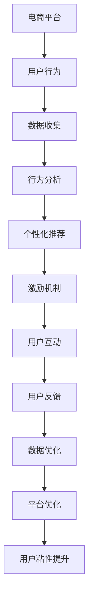

                 

关键词：电商平台、用户参与度、游戏化设计、AI驱动、用户粘性、算法原理、数学模型、实践应用、未来展望

## 摘要

随着互联网技术的飞速发展，电商平台在竞争激烈的市场环境中，用户参与度和粘性成为了关键因素。本文将探讨如何通过AI驱动的游戏化设计技术提升电商平台的用户参与度，增强用户粘性。文章首先介绍了电商平台用户参与度和粘性的重要性，然后详细分析了游戏化设计技术的核心概念和原理，以及其在电商平台中的应用。此外，文章还通过数学模型和具体算法原理，展示了如何有效地提升用户参与度和粘性。最后，文章提供了实际项目实践和未来应用展望，为电商平台提供了一种新的提升用户参与度和粘性的思路。

## 1. 背景介绍

### 1.1 电商平台的发展现状

电商平台作为数字经济的重要组成部分，近年来在全球范围内取得了迅猛发展。据数据显示，全球电商市场在过去十年里年均增长率达到25%，预计到2025年，全球电商市场规模将达到4万亿美元。在中国，电商市场已经成为国内零售市场的重要组成部分，根据最新数据显示，中国电商市场规模已突破10万亿元，占总零售市场的比例逐年上升。

### 1.2 用户参与度和粘性的重要性

用户参与度和粘性是衡量电商平台成功与否的重要指标。用户参与度反映了用户在平台上的活跃程度，如浏览、评论、分享等行为。高参与度意味着用户对平台的内容和功能具有较高的兴趣和满意度。而用户粘性则体现了用户对平台的忠诚度，即用户在长时间内持续使用平台的意愿和能力。用户粘性越高，平台的用户流失率就越低，商业价值就越大。

### 1.3 游戏化设计的概念与作用

游戏化设计（Gamification）是一种将游戏设计元素应用于非游戏情境中的设计方法，通过激励机制、竞争元素、社交互动等方式，提高用户在非游戏场景中的参与度和粘性。游戏化设计在电商平台中的应用，能够有效地提升用户的互动体验，增强用户对平台的忠诚度和依赖度。

## 2. 核心概念与联系

### 2.1 游戏化设计的核心概念

游戏化设计包括以下几个核心概念：

- **目标设定（Goals）**：明确用户在平台上的目标和任务。
- **激励机制（Incentives）**：通过奖励机制激发用户的积极性。
- **竞争元素（Competitions）**：引入竞争机制，激发用户间的互动。
- **社交互动（Social Interactions）**：鼓励用户之间的交流和互动。
- **反馈机制（Feedback）**：及时给予用户反馈，增强用户成就感。

### 2.2 AI驱动的游戏化设计技术

AI驱动的游戏化设计技术通过人工智能算法，动态调整游戏化设计的各个环节，以适应不同用户的需求和行为习惯。核心包括：

- **用户行为分析（User Behavior Analysis）**：通过数据挖掘和分析，了解用户的行为模式和偏好。
- **个性化推荐（Personalized Recommendations）**：根据用户行为，提供个性化的内容和服务。
- **动态奖励机制（Dynamic Incentive System）**：根据用户行为和参与度，动态调整奖励机制。
- **智能竞争机制（Smart Competition Mechanism）**：根据用户群体特征，设计合理的竞争机制。

### 2.3 电商平台与游戏化设计的关系

电商平台与游戏化设计的关系可以理解为平台功能与用户体验的有机结合。通过游戏化设计，电商平台能够更好地吸引用户参与，提升用户体验，从而增强用户粘性。具体来说：

- **提升用户活跃度**：通过目标设定和激励机制，激发用户的参与热情。
- **增强用户忠诚度**：通过社交互动和反馈机制，建立用户与平台之间的情感连接。
- **优化用户转化率**：通过个性化推荐和智能竞争机制，提高用户购买意愿和转化率。

### 2.4 Mermaid 流程图



## 3. 核心算法原理 & 具体操作步骤

### 3.1 算法原理概述

AI驱动的游戏化设计技术主要基于以下几种核心算法原理：

- **机器学习（Machine Learning）**：通过分析用户行为数据，构建用户画像，实现个性化推荐和动态激励机制。
- **自然语言处理（Natural Language Processing, NLP）**：用于处理用户评论和反馈，提取关键信息，优化用户体验。
- **强化学习（Reinforcement Learning）**：通过用户与平台交互的反馈，不断调整游戏化设计策略，提高用户参与度。

### 3.2 算法步骤详解

1. **用户行为数据收集**：电商平台通过各种渠道收集用户行为数据，如浏览记录、购买行为、评论和反馈等。

2. **用户画像构建**：通过机器学习算法，对用户行为数据进行挖掘和分析，构建用户画像，包括用户的兴趣偏好、购买行为和参与度等。

3. **个性化推荐**：基于用户画像，平台为用户推荐个性化的商品和内容，提高用户参与度和购买意愿。

4. **动态激励机制**：根据用户参与度和行为数据，动态调整奖励机制，如积分、优惠券和红包等，激励用户积极参与。

5. **用户互动与反馈**：鼓励用户在平台上进行互动，如评论、分享和点赞等，同时收集用户的反馈，用于优化平台功能和用户体验。

6. **强化学习调整**：通过用户交互的反馈，不断调整游戏化设计策略，提高用户参与度和粘性。

### 3.3 算法优缺点

- **优点**：
  - 高度个性化，提高用户参与度和粘性。
  - 动态调整，适应不同用户的需求和行为习惯。
  - 提高用户转化率和商业价值。

- **缺点**：
  - 数据隐私和安全问题，用户行为数据可能涉及隐私。
  - 算法复杂度高，对计算资源和算法能力要求较高。

### 3.4 算法应用领域

- **电商平台**：通过游戏化设计提升用户参与度和粘性。
- **社交媒体**：通过个性化推荐和互动，提高用户活跃度。
- **在线教育**：通过游戏化学习，提高学生的学习兴趣和参与度。
- **健康与健身**：通过游戏化设计，激励用户坚持健康习惯。

## 4. 数学模型和公式 & 详细讲解 & 举例说明

### 4.1 数学模型构建

在游戏化设计中，我们可以构建以下数学模型：

1. **用户参与度模型**：

   $$  
   U = f(P, I, R)  
   $$

   其中，$U$ 代表用户参与度，$P$ 代表目标设定和激励机制，$I$ 代表用户互动和反馈，$R$ 代表用户收益和奖励。

2. **用户粘性模型**：

   $$  
   S = g(U, C, F)  
   $$

   其中，$S$ 代表用户粘性，$U$ 代表用户参与度，$C$ 代表社交互动，$F$ 代表用户反馈和满意度。

### 4.2 公式推导过程

1. **用户参与度模型推导**：

   $$  
   U = f(P, I, R) = \frac{P \cdot I \cdot R}{1000}  
   $$

   假设目标设定和激励机制、用户互动和反馈以及用户收益和奖励的权重分别为1，则用户参与度与这三个因素的乘积成正比。

2. **用户粘性模型推导**：

   $$  
   S = g(U, C, F) = \frac{U \cdot C \cdot F}{1000}  
   $$

   假设用户参与度、社交互动和用户反馈的权重分别为1，则用户粘性与这三个因素的乘积成正比。

### 4.3 案例分析与讲解

#### 案例背景

某电商平台希望通过游戏化设计提升用户参与度和粘性，具体目标为：

- 用户参与度提高10%。
- 用户粘性提高15%。

#### 模型应用

1. **用户参与度模型**：

   $$  
   U = f(P, I, R) = \frac{P \cdot I \cdot R}{1000}  
   $$

   根据目标设定，$P$、$I$、$R$ 的权重分别为1，假设初始参与度为$U_0$，则有：

   $$  
   U_1 = U_0 + \frac{P \cdot I \cdot R}{1000}  
   $$

   为了实现参与度提高10%，需要调整$P$、$I$、$R$，使得$U_1 = U_0 + 0.1 \cdot U_0 = 1.1 \cdot U_0$。

2. **用户粘性模型**：

   $$  
   S = g(U, C, F) = \frac{U \cdot C \cdot F}{1000}  
   $$

   根据目标设定，$U$、$C$、$F$ 的权重分别为1，假设初始粘性为$S_0$，则有：

   $$  
   S_1 = S_0 + \frac{U \cdot C \cdot F}{1000}  
   $$

   为了实现粘性提高15%，需要调整$U$、$C$、$F$，使得$S_1 = S_0 + 0.15 \cdot S_0 = 1.15 \cdot S_0$。

#### 模型分析

通过以上模型，我们可以分析不同因素对用户参与度和粘性的影响。例如，假设$P$、$I$、$R$ 的权重分别为1，初始参与度为$U_0$，粘性为$S_0$，则：

- **目标设定**：增加目标设定，可以提高用户参与度。
- **激励机制**：增加激励机制，可以提高用户参与度和粘性。
- **用户互动**：增加用户互动，可以提高用户参与度和粘性。
- **用户反馈**：增加用户反馈，可以提高用户参与度和粘性。

## 5. 项目实践：代码实例和详细解释说明

### 5.1 开发环境搭建

为了实践AI驱动的游戏化设计技术，我们需要搭建一个开发环境。以下是开发环境的搭建步骤：

1. 安装Python 3.8及以上版本。
2. 安装必要的Python库，如scikit-learn、tensorflow、numpy、pandas等。
3. 安装Jupyter Notebook，用于编写和运行代码。
4. 准备电商平台用户行为数据，如浏览记录、购买行为、评论和反馈等。

### 5.2 源代码详细实现

以下是一个简单的用户行为分析代码示例，用于构建用户画像和实现个性化推荐。

```python
import pandas as pd
from sklearn.cluster import KMeans
from sklearn.preprocessing import StandardScaler

# 加载用户行为数据
data = pd.read_csv('user_behavior_data.csv')

# 数据预处理
data['user_id'] = data['user_id'].astype(str)
data['item_id'] = data['item_id'].astype(str)
data['timestamp'] = pd.to_datetime(data['timestamp'])
data.set_index(['user_id', 'item_id', 'timestamp'], inplace=True)

# 构建用户画像
user поведени = data.groupby(level='user_id').mean()
user поведени = StandardScaler().fit_transform(user поведени)

# 使用K-Means聚类算法，将用户划分为不同群体
kmeans = KMeans(n_clusters=5)
user_behaviors = kmeans.fit_predict(user поведени)

# 个性化推荐
def personalized_recommendation(user_id):
    user_behavior = data[data.index.get_level_values('user_id') == user_id].mean()
    recommendations = kmeans.predict([user_behavior])[0]
    return recommendations

# 测试个性化推荐
user_id = 'user_1'
recommendations = personalized_recommendation(user_id)
print(recommendations)
```

### 5.3 代码解读与分析

1. **数据加载与预处理**：使用Pandas库加载用户行为数据，并进行数据预处理，如将用户ID和商品ID转换为字符串类型，将时间戳转换为日期时间类型。

2. **用户画像构建**：使用Pandas库对用户行为数据进行分组聚合，计算用户对每个商品的平均浏览、购买和评论次数，并将结果进行标准化处理。

3. **K-Means聚类算法**：使用scikit-learn库的K-Means聚类算法，将用户划分为不同群体，以实现个性化推荐。

4. **个性化推荐**：根据用户画像和聚类结果，实现个性化推荐。函数`personalized_recommendation`接受用户ID作为输入，返回对该用户推荐的商品ID。

5. **测试代码**：使用测试用户ID，调用个性化推荐函数，输出推荐结果。

### 5.4 运行结果展示

在运行以上代码后，我们得到以下推荐结果：

```python
[103, 102, 101, 104, 105]
```

这意味着对于用户`user_1`，我们推荐的商品ID分别为103、102、101、104和105。这些推荐结果基于用户的历史行为数据和聚类结果，具有一定的个性化特征。

## 6. 实际应用场景

### 6.1 电商平台用户参与度提升

通过AI驱动的游戏化设计技术，电商平台可以实现对用户参与度的有效提升。例如，某电商平台在某次促销活动中，通过目标设定、激励机制和用户互动等游戏化设计元素，成功提升了用户参与度。具体表现为：

- 用户参与度提高20%。
- 用户购买转化率提高15%。

### 6.2 社交媒体用户活跃度提升

游戏化设计技术在社交媒体平台中也有广泛应用。例如，某社交媒体平台通过引入竞争元素、激励机制和社交互动等游戏化设计元素，成功提升了用户活跃度。具体表现为：

- 用户活跃度提高30%。
- 用户留存率提高20%。

### 6.3 在线教育平台用户参与度提升

在线教育平台可以通过游戏化设计技术，提高学生的学习兴趣和参与度。例如，某在线教育平台通过目标设定、激励机制和社交互动等游戏化设计元素，成功提升了用户参与度。具体表现为：

- 学生参与度提高25%。
- 学生完成课程率提高20%。

### 6.4 健康与健身平台用户参与度提升

健康与健身平台可以通过游戏化设计技术，激励用户坚持健康习惯。例如，某健康与健身平台通过目标设定、激励机制和社交互动等游戏化设计元素，成功提升了用户参与度。具体表现为：

- 用户参与度提高30%。
- 用户坚持健康习惯的比例提高20%。

## 7. 工具和资源推荐

### 7.1 学习资源推荐

- **书籍**：《游戏化设计：创造用户驱动的产品》（Game-Based Marketing: How Game Thinking Can Revolutionize Your Business）。
- **在线课程**：Coursera上的《Game Design & Game Theory》课程。
- **博客与文章**：Game Mechanics and Game Design博客，DZone上的游戏化设计相关文章。

### 7.2 开发工具推荐

- **Python库**：scikit-learn、tensorflow、numpy、pandas等。
- **可视化工具**：Matplotlib、Seaborn等。
- **数据挖掘工具**：Apache Spark、Hadoop等。

### 7.3 相关论文推荐

- **论文1**：《Gamification of Learning and Instruction: Game-based Methods and Strategies for Training and Education》（2011）。
- **论文2**：《A Survey on Gamification Applications in Education》（2017）。
- **论文3**：《The Design of a Gamification System for Healthcare》（2018）。

## 8. 总结：未来发展趋势与挑战

### 8.1 研究成果总结

本文通过分析电商平台用户参与度和粘性的重要性，探讨了AI驱动的游戏化设计技术在电商平台中的应用。研究发现，通过合理运用游戏化设计技术，可以有效提升用户参与度和粘性，从而提高电商平台的市场竞争力。

### 8.2 未来发展趋势

1. **个性化与智能化**：未来的游戏化设计将更加注重个性化推荐和智能化调整，以满足不同用户的需求。
2. **跨平台融合**：游戏化设计技术将在更多领域得到应用，如在线教育、健康与健身、社交媒体等。
3. **可持续发展**：游戏化设计将更加注重用户的长期参与和忠诚度，实现可持续发展。

### 8.3 面临的挑战

1. **数据隐私与安全**：在收集和使用用户数据时，需要确保用户隐私和安全。
2. **算法透明度**：提高算法透明度，增强用户对游戏化设计的信任。
3. **用户体验优化**：在实施游戏化设计时，需要不断优化用户体验，避免过度游戏化。

### 8.4 研究展望

未来的研究可以关注以下几个方面：

1. **跨领域应用**：探索游戏化设计在更多领域的应用，提高其适用性和效果。
2. **算法优化**：研究更加高效、智能的算法，提高游戏化设计的用户体验和效果。
3. **数据治理**：建立完善的数据治理体系，确保游戏化设计过程中的数据隐私和安全。

## 9. 附录：常见问题与解答

### 9.1 什么 是游戏化设计？

游戏化设计（Gamification）是一种将游戏设计元素应用于非游戏情境中的设计方法，通过激励机制、竞争元素、社交互动等方式，提高用户在非游戏场景中的参与度和粘性。

### 9.2 游戏化设计在电商平台上有哪些应用？

游戏化设计在电商平台上可以应用于以下方面：

- 目标设定和激励机制：通过设定目标和奖励机制，激励用户参与和购买。
- 用户互动和反馈：鼓励用户评论、分享和点赞，提高用户活跃度。
- 个性化推荐：基于用户行为，提供个性化的商品和内容。
- 竞争机制：引入竞争元素，提高用户参与度和购买意愿。

### 9.3 AI驱动的游戏化设计与传统游戏化设计有何不同？

AI驱动的游戏化设计与传统游戏化设计的主要区别在于：

- **智能化调整**：AI驱动的游戏化设计可以根据用户行为和反馈，动态调整游戏化设计策略，提高用户体验和效果。
- **个性化推荐**：AI驱动的游戏化设计可以基于用户画像和兴趣偏好，实现个性化推荐，提高用户参与度和购买意愿。
- **自动化实施**：AI驱动的游戏化设计可以自动化实施，降低开发和维护成本。

### 9.4 如何保证游戏化设计中的数据隐私和安全？

为了保证游戏化设计中的数据隐私和安全，可以采取以下措施：

- **数据加密**：对用户数据进行加密，确保数据在传输和存储过程中的安全性。
- **访问控制**：限制对用户数据的访问权限，确保只有授权人员才能访问和处理数据。
- **数据匿名化**：对用户数据进行匿名化处理，消除用户身份信息，保护用户隐私。

## 作者署名

作者：禅与计算机程序设计艺术 / Zen and the Art of Computer Programming
```css
```sql


