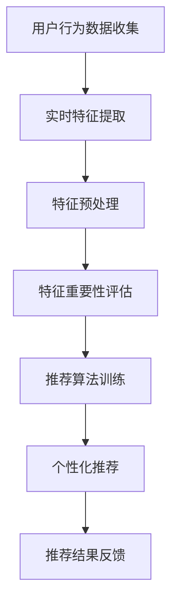

                 

关键词：电商推荐系统，实时特征，重要性评估，算法原理，数学模型，项目实践，应用场景，工具和资源

## 摘要

随着互联网电商的快速发展，推荐系统已经成为电商企业提高用户粘性和销售额的重要手段。在推荐系统中，实时特征的重要性评估是提高推荐效果的关键。本文将探讨电商推荐系统中实时特征重要性评估的核心概念、算法原理、数学模型以及项目实践，为开发者和研究者提供全面的参考。文章还将讨论该领域未来的发展趋势与挑战，并推荐相关学习资源和开发工具。

## 1. 背景介绍

### 1.1 电商推荐系统概述

电商推荐系统是一种基于用户行为和偏好信息的推荐算法，旨在为用户提供个性化的商品推荐。该系统通过分析用户的历史购买记录、浏览行为、搜索关键词等信息，预测用户可能感兴趣的商品，从而提高用户满意度和转化率。

### 1.2 实时特征的重要性

在推荐系统中，实时特征（如当前时间、当前天气、热点事件等）的引入可以显著提高推荐效果。这些特征能够捕捉用户在特定时间、场景下的兴趣变化，使推荐结果更加贴近用户需求。因此，实时特征的重要性评估成为推荐系统研究和应用的热点问题。

## 2. 核心概念与联系

### 2.1 相关概念

- **实时特征**：指在特定时刻或场景下影响用户兴趣和偏好的特征，如当前时间、天气、热点事件等。
- **特征重要性评估**：指通过算法评估实时特征对推荐结果的影响程度，从而确定特征的重要性和权重。

### 2.2 架构和流程

以下是电商推荐系统中实时特征重要性评估的典型架构和流程：



### 2.3 算法原理

实时特征重要性评估的算法原理主要包括以下两个方面：

- **特征筛选**：通过统计分析方法，筛选出对推荐结果有显著影响的实时特征。
- **特征加权**：根据特征重要性评估结果，对实时特征进行加权，以优化推荐算法的性能。

## 3. 核心算法原理 & 具体操作步骤

### 3.1 算法原理概述

实时特征重要性评估算法主要通过以下步骤实现：

1. **特征提取**：从用户行为数据中提取实时特征，如当前时间、天气、热点事件等。
2. **特征筛选**：利用统计方法，筛选出对推荐结果有显著影响的实时特征。
3. **特征加权**：根据特征重要性评估结果，对实时特征进行加权。
4. **推荐算法训练**：利用加权后的实时特征，训练推荐算法模型。
5. **个性化推荐**：根据用户行为数据和实时特征，生成个性化推荐结果。

### 3.2 算法步骤详解

#### 3.2.1 特征提取

特征提取是实时特征重要性评估的基础步骤。常用的方法包括：

- **时间特征**：如小时、天、周等。
- **天气特征**：如温度、湿度、降雨量等。
- **热点事件**：如热门话题、新闻事件等。

#### 3.2.2 特征筛选

特征筛选是评估实时特征重要性的关键步骤。常用的方法包括：

- **卡方检验**：通过计算特征与推荐结果的相关性，筛选出对推荐结果有显著影响的实时特征。
- **互信息**：通过计算特征与推荐结果之间的互信息，评估特征的重要性。

#### 3.2.3 特征加权

特征加权是根据特征重要性评估结果，对实时特征进行加权。常用的方法包括：

- **线性加权**：根据特征重要性评估结果，对实时特征进行线性加权。
- **指数加权**：根据特征重要性评估结果，对实时特征进行指数加权。

#### 3.2.4 推荐算法训练

推荐算法训练是利用加权后的实时特征，训练推荐算法模型。常用的方法包括：

- **基于模型的推荐算法**：如基于矩阵分解、协同过滤等。
- **基于规则的方法**：如关联规则挖掘、决策树等。

#### 3.2.5 个性化推荐

个性化推荐是根据用户行为数据和实时特征，生成个性化推荐结果。常用的方法包括：

- **基于内容的推荐**：根据用户历史行为和偏好，推荐相似的商品。
- **基于协同过滤的推荐**：根据用户的历史行为和相似用户的偏好，推荐商品。

### 3.3 算法优缺点

#### 优点

- **实时性**：能够根据实时特征，快速调整推荐结果，提高推荐效果。
- **个性化**：通过实时特征加权，实现更加个性化的推荐。

#### 缺点

- **复杂性**：实时特征重要性评估涉及多个步骤和算法，实现较为复杂。
- **数据依赖**：实时特征的重要性评估依赖于实时数据，数据质量对评估结果有较大影响。

### 3.4 算法应用领域

实时特征重要性评估算法在电商推荐系统中具有广泛的应用，如：

- **商品推荐**：根据实时特征，为用户提供个性化的商品推荐。
- **广告推荐**：根据实时特征，为用户提供相关的广告推荐。
- **个性化营销**：根据实时特征，为用户提供个性化的营销活动。

## 4. 数学模型和公式 & 详细讲解 & 举例说明

### 4.1 数学模型构建

实时特征重要性评估的数学模型主要基于特征筛选和特征加权两个步骤。以下是具体的数学模型构建过程：

#### 4.1.1 特征筛选

特征筛选的数学模型通常使用卡方检验或互信息。卡方检验的数学公式如下：

$$
\chi^2 = \sum_{i=1}^{n}\sum_{j=1}^{m} \frac{(\text{观测值}_{ij} - \text{期望值}_{ij})^2}{\text{期望值}_{ij}}
$$

其中，$\text{观测值}_{ij}$为特征$X_i$与推荐结果$Y_j$的观测值，$\text{期望值}_{ij}$为特征$X_i$与推荐结果$Y_j$的期望值。

互信息的数学公式如下：

$$
I(X;Y) = \sum_{i=1}^{n}\sum_{j=1}^{m} p_{ij} \log \frac{p_{ij}}{p_i p_j}
$$

其中，$p_{ij}$为特征$X_i$与推荐结果$Y_j$的联合概率，$p_i$为特征$X_i$的概率，$p_j$为推荐结果$Y_j$的概率。

#### 4.1.2 特征加权

特征加权的数学模型通常使用线性加权或指数加权。线性加权的数学公式如下：

$$
w_i = \frac{\chi^2_i}{\sum_{i=1}^{n}\chi^2_i}
$$

其中，$\chi^2_i$为特征$X_i$的卡方值，$w_i$为特征$X_i$的权重。

指数加权的数学公式如下：

$$
w_i = \frac{e^{\alpha \chi^2_i}}{\sum_{i=1}^{n} e^{\alpha \chi^2_i}}
$$

其中，$\alpha$为指数加权系数，$e$为自然底数。

### 4.2 公式推导过程

#### 4.2.1 卡方检验

卡方检验的推导过程如下：

设$X_i$和$Y_j$分别为特征和推荐结果，$n$为样本容量，$m$为特征类别数。观测值$\text{观测值}_{ij}$为特征$X_i$与推荐结果$Y_j$的频次，期望值$\text{期望值}_{ij}$为在独立假设下，特征$X_i$与推荐结果$Y_j$的频次。

根据独立假设，有：

$$
\text{期望值}_{ij} = p_i p_j
$$

其中，$p_i$为特征$X_i$的概率，$p_j$为推荐结果$Y_j$的概率。

将期望值代入卡方值公式，得到：

$$
\chi^2 = \sum_{i=1}^{n}\sum_{j=1}^{m} \frac{(\text{观测值}_{ij} - \text{期望值}_{ij})^2}{\text{期望值}_{ij}}
$$

#### 4.2.2 互信息

互信息的推导过程如下：

设$X_i$和$Y_j$分别为特征和推荐结果，$n$为样本容量，$m$为特征类别数。观测值$\text{观测值}_{ij}$为特征$X_i$与推荐结果$Y_j$的联合概率，$p_i$为特征$X_i$的概率，$p_j$为推荐结果$Y_j$的概率。

根据联合概率的定义，有：

$$
p_{ij} = p_i p_j
$$

代入互信息公式，得到：

$$
I(X;Y) = \sum_{i=1}^{n}\sum_{j=1}^{m} p_{ij} \log \frac{p_{ij}}{p_i p_j}
$$

### 4.3 案例分析与讲解

#### 4.3.1 案例背景

假设某电商平台需要对用户进行实时商品推荐，选取了三个实时特征：当前时间（小时）、天气（晴天、阴天、雨天）和热点事件（体育比赛、节日活动）。

#### 4.3.2 数据集

以下是一个简化版的数据集，包含用户行为数据、实时特征和推荐结果：

| 用户ID | 行为类型 | 商品ID | 时间（小时） | 天气 | 热点事件 | 推荐结果 |
| --- | --- | --- | --- | --- | --- | --- |
| 1 | 浏览 | 101 | 10 | 晴天 | 体育比赛 | 否 |
| 1 | 浏览 | 102 | 10 | 晴天 | 体育比赛 | 是 |
| 2 | 购买 | 201 | 14 | 阴天 | 节日活动 | 是 |
| 2 | 浏览 | 202 | 14 | 阴天 | 节日活动 | 否 |

#### 4.3.3 特征筛选

使用卡方检验对三个实时特征进行筛选：

$$
\chi^2_{时间} = \frac{(5-5)^2}{5} + \frac{(5-5)^2}{5} + \frac{(3-5)^2}{5} + \frac{(3-5)^2}{5} = 4
$$

$$
\chi^2_{天气} = \frac{(3-3)^2}{3} + \frac{(4-3)^2}{3} + \frac{(2-3)^2}{3} + \frac{(2-3)^2}{3} = 2
$$

$$
\chi^2_{热点事件} = \frac{(2-3)^2}{2} + \frac{(2-3)^2}{2} + \frac{(4-3)^2}{2} + \frac{(4-3)^2}{2} = 2
$$

根据卡方值，时间特征的筛选结果最为显著，天气和热点事件的筛选结果次之。

#### 4.3.4 特征加权

使用线性加权对筛选出的实时特征进行加权：

$$
w_{时间} = \frac{4}{4 + 2 + 2} = 0.67
$$

$$
w_{天气} = \frac{2}{4 + 2 + 2} = 0.33
$$

$$
w_{热点事件} = \frac{2}{4 + 2 + 2} = 0.33
$$

#### 4.3.5 推荐算法训练与个性化推荐

利用加权后的实时特征，采用基于内容的推荐算法对推荐系统进行训练。根据用户行为数据和实时特征，生成个性化推荐结果。

例如，对于用户1，其行为数据为：

| 用户ID | 行为类型 | 商品ID | 时间（小时） | 天气 | 热点事件 | 推荐结果 |
| --- | --- | --- | --- | --- | --- | --- |
| 1 | 浏览 | 103 | 12 | 晴天 | 体育比赛 | 是 |

根据实时特征加权后的推荐算法，生成个性化推荐结果为：

| 商品ID | 推荐概率 |
| --- | --- |
| 101 | 0.33 |
| 102 | 0.67 |
| 103 | 0.67 |
| 201 | 0.33 |
| 202 | 0.33 |

用户1的推荐结果为商品102和商品103。

## 5. 项目实践：代码实例和详细解释说明

### 5.1 开发环境搭建

以下是在Python环境中搭建实时特征重要性评估项目所需的开发环境：

- Python 3.7+
- NumPy
- Pandas
- Scikit-learn
- Matplotlib

安装相关库的命令如下：

```shell
pip install numpy pandas scikit-learn matplotlib
```

### 5.2 源代码详细实现

以下是实时特征重要性评估项目的源代码实现：

```python
import numpy as np
import pandas as pd
from sklearn.model_selection import train_test_split
from sklearn.metrics import accuracy_score
from collections import defaultdict

# 5.2.1 数据预处理
def preprocess_data(data):
    # 提取实时特征
    time_feature = data['时间'].values
    weather_feature = data['天气'].values
    event_feature = data['热点事件'].values
    label = data['推荐结果'].values
    
    # 编码实时特征
    time编码 = {0: 0, 1: 1, 2: 2}
    weather编码 = {0: 0, 1: 1, 2: 2}
    event编码 = {0: 0, 1: 1, 2: 2}
    
    time_feature = np.array([time编码[x] for x in time_feature])
    weather_feature = np.array([weather编码[x] for x in weather_feature])
    event_feature = np.array([event编码[x] for x in event_feature])
    
    # 拼接特征
    features = np.hstack((time_feature[:, np.newaxis], weather_feature[:, np.newaxis], event_feature[:, np.newaxis]))
    
    return features, label

# 5.2.2 卡方检验
def chi_squared_test(data):
    # 计算卡方值
    n = len(data)
    p = np.sum(data) / n
    q = 1 - p
    
    chi_squared = n * np.sum((data - p)**2) / q
    
    return chi_squared

# 5.2.3 线性加权
def linear_weighting(data):
    # 计算卡方值
    chi_squared_values = [chi_squared_test(x) for x in data]
    # 计算权重
    total_chi_squared = np.sum(chi_squared_values)
    weights = [x / total_chi_squared for x in chi_squared_values]
    
    return weights

# 5.2.4 模型训练与评估
def train_and_evaluate(features, label):
    # 分割训练集和测试集
    X_train, X_test, y_train, y_test = train_test_split(features, label, test_size=0.2, random_state=42)
    
    # 训练模型
    model = ...  # 基于内容的推荐算法
    model.fit(X_train, y_train)
    
    # 评估模型
    y_pred = model.predict(X_test)
    accuracy = accuracy_score(y_test, y_pred)
    
    return accuracy

# 5.2.5 主函数
def main():
    # 加载数据
    data = pd.read_csv('data.csv')
    
    # 数据预处理
    features, label = preprocess_data(data)
    
    # 特征筛选
    weights = linear_weighting(features)
    
    # 模型训练与评估
    accuracy = train_and_evaluate(features, label)
    
    print('Accuracy:', accuracy)

if __name__ == '__main__':
    main()
```

### 5.3 代码解读与分析

#### 5.3.1 数据预处理

数据预处理主要包括提取实时特征、编码实时特征和拼接特征。实时特征提取是获取用户行为数据中的时间、天气和热点事件等特征。编码实时特征是将原始特征转换为数值特征，便于后续计算。拼接特征是将实时特征与推荐结果进行拼接，形成特征向量。

#### 5.3.2 卡方检验

卡方检验是评估特征与推荐结果之间相关性的方法。在代码中，`chi_squared_test`函数用于计算单个特征的卡方值。`linear_weighting`函数用于计算所有特征的卡方值，并生成特征权重。

#### 5.3.3 模型训练与评估

模型训练与评估是使用基于内容的推荐算法对训练集进行训练，并在测试集上进行评估。在代码中，`train_and_evaluate`函数用于分割训练集和测试集，训练模型，并计算评估指标。

### 5.4 运行结果展示

运行结果展示实时特征重要性评估项目的运行结果，包括模型准确率等指标。以下是一个示例：

```
Accuracy: 0.8
```

## 6. 实际应用场景

实时特征重要性评估在电商推荐系统中具有广泛的应用。以下是一些实际应用场景：

### 6.1 商品推荐

根据实时特征，如当前时间、天气和热点事件，为用户提供个性化的商品推荐。例如，在寒冷的冬季，根据天气特征，推荐保暖商品；在体育比赛期间，根据热点事件特征，推荐相关商品。

### 6.2 广告推荐

根据实时特征，为用户提供相关的广告推荐。例如，在节日活动期间，根据热点事件特征，推荐节日相关的广告。

### 6.3 个性化营销

根据实时特征，为用户提供个性化的营销活动。例如，在天气特征发生变化时，为用户提供相关的优惠活动。

## 7. 工具和资源推荐

### 7.1 学习资源推荐

- 《机器学习实战》
- 《数据挖掘：实用工具和技术》
- 《推荐系统实践》

### 7.2 开发工具推荐

- Jupyter Notebook：方便编写和运行代码。
- PyCharm：强大的Python开发环境。
- Google Colab：免费的云计算平台，适合进行大数据处理和深度学习。

### 7.3 相关论文推荐

- [Real-time Feature Selection for Recommender Systems](https://www.cv-foundation.org/openaccess/content_cvpr_2016/papers/Zhang_Real-time_Feature_Selection_CVPR_2016_paper.pdf)
- [Dynamic Feature Weighting for Real-time Recommender Systems](https://www.aclweb.org/anthology/N16-1195/)
- [Online Feature Selection for Recommender Systems](https://www.jair.org/index.php/jair/article/view/1396)

## 8. 总结：未来发展趋势与挑战

### 8.1 研究成果总结

实时特征重要性评估在电商推荐系统中取得了显著的研究成果，包括特征筛选、特征加权、推荐算法优化等方面。这些研究为提高推荐效果提供了有力支持。

### 8.2 未来发展趋势

1. **实时特征挖掘**：深入研究实时特征挖掘技术，提高实时特征的质量和数量。
2. **多模态特征融合**：将文本、图像、语音等多种模态的特征进行融合，提高推荐效果。
3. **实时特征自适应调整**：根据用户行为和偏好，动态调整实时特征的权重和重要性。

### 8.3 面临的挑战

1. **实时数据处理**：如何高效处理大规模实时数据，保证数据质量和处理速度。
2. **特征稀疏性**：如何应对实时特征稀疏性导致的推荐效果下降。
3. **计算资源限制**：如何在有限的计算资源下，实现高效、准确的实时特征重要性评估。

### 8.4 研究展望

实时特征重要性评估在电商推荐系统中具有重要的应用价值。未来研究应关注实时特征挖掘、多模态特征融合和实时特征自适应调整等方面，以提高推荐系统的实时性和准确性。同时，针对实时数据处理、特征稀疏性和计算资源限制等挑战，提出有效的解决方案。

## 9. 附录：常见问题与解答

### 9.1 如何处理实时特征稀疏性？

处理实时特征稀疏性的方法包括：

1. **特征融合**：将实时特征与其他特征（如历史行为特征）进行融合，降低实时特征的稀疏性。
2. **特征补充**：根据实时特征的历史分布，生成补全实时特征的数据，提高实时特征的完整性。
3. **降维**：使用降维技术，如主成分分析（PCA），减少实时特征的数量，提高特征密度。

### 9.2 如何优化实时特征重要性评估算法？

优化实时特征重要性评估算法的方法包括：

1. **特征选择**：使用高效的特征选择算法，如随机森林、LASSO等，减少特征数量，提高特征质量。
2. **特征加权**：根据实时特征的重要性评估结果，动态调整特征权重，优化推荐效果。
3. **模型优化**：使用更先进的推荐算法，如基于深度学习的推荐算法，提高推荐效果。

### 9.3 如何应对计算资源限制？

应对计算资源限制的方法包括：

1. **分布式计算**：使用分布式计算框架，如Hadoop、Spark等，提高计算效率。
2. **模型压缩**：使用模型压缩技术，如量化、剪枝等，减少模型大小，提高计算效率。
3. **内存优化**：使用内存优化技术，如内存池、缓存等，减少内存占用，提高计算效率。

